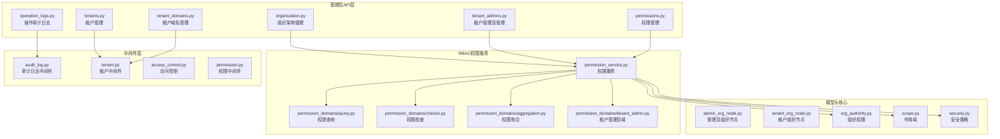
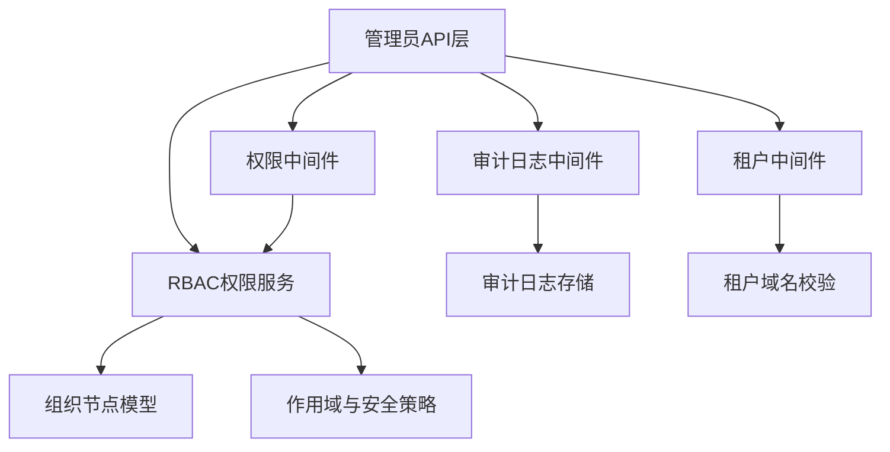
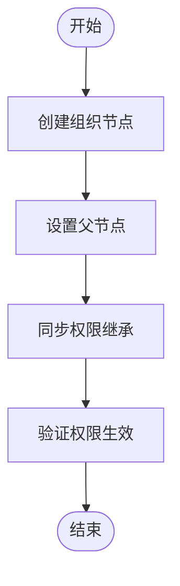
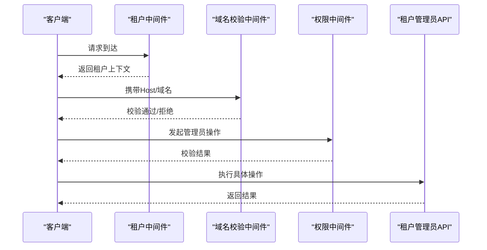
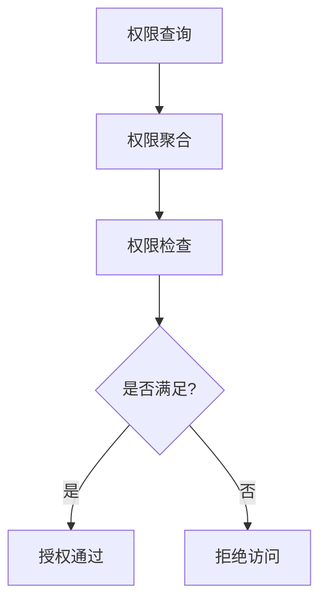
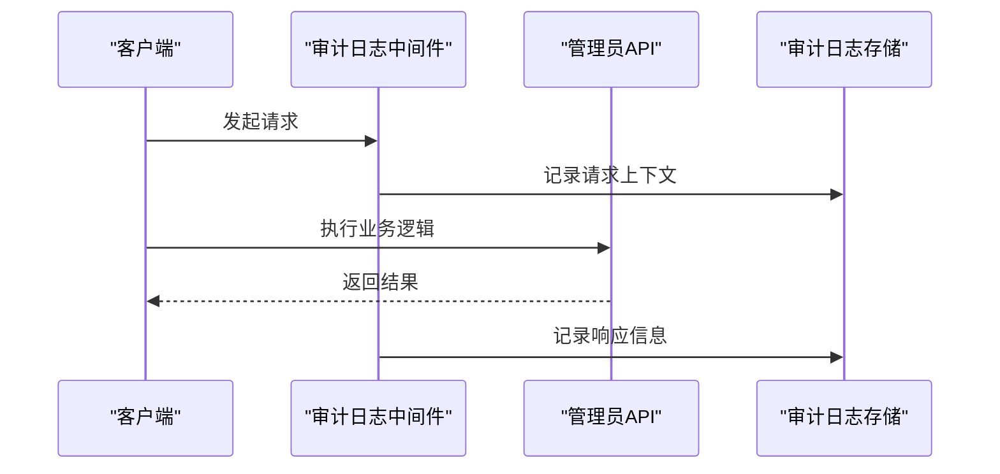
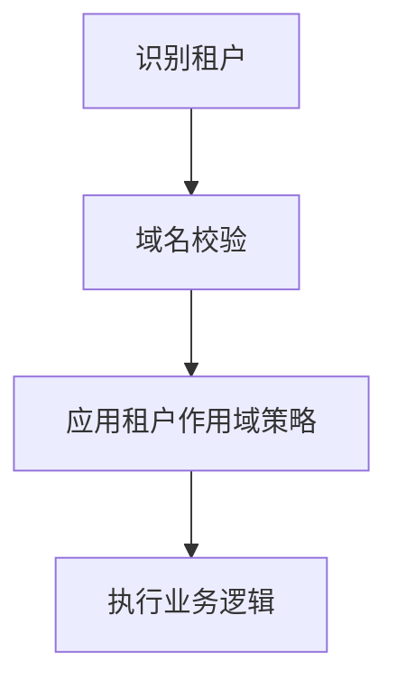
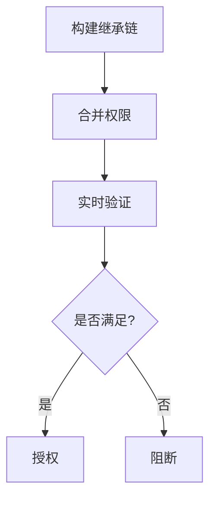
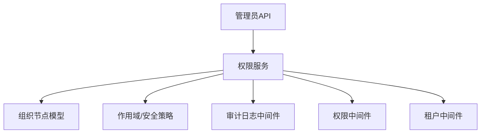

# 管理员管理服务

<cite>
**本文引用的文件**
- [admin/organization.py](file://backend/app/api/admin/organization.py)
- [admin/tenant_admins.py](file://backend/app/api/admin/tenant_admins.py)
- [admin/permissions.py](file://backend/app/api/admin/permissions.py)
- [admin/operation_logs.py](file://backend/app/api/admin/operation_logs.py)
- [admin/tenants.py](file://backend/app/api/admin/tenants.py)
- [admin/tenant_domains.py](file://backend/app/api/admin/tenant_domains.py)
- [rbac/services/permission_service.py](file://backend/app/rbac/services/permission_service.py)
- [rbac/services/permission_domains/query.py](file://backend/app/rbac/services/permission_domains/query.py)
- [rbac/services/permission_domains/checks.py](file://backend/app/rbac/services/permission_domains/checks.py)
- [rbac/services/permission_domains/aggregation.py](file://backend/app/rbac/services/permission_domains/aggregation.py)
- [rbac/services/permission_domains/tenant_admin.py](file://backend/app/rbac/services/permission_domains/tenant_admin.py)
- [models/org/admin_org_node.py](file://backend/app/models/org/admin_org_node.py)
- [models/org/tenant_org_node.py](file://backend/app/models/org/tenant_org_node.py)
- [middleware/audit_log.py](file://backend/app/middleware/audit_log.py)
- [middleware/tenant.py](file://backend/app/middleware/tenant.py)
- [middleware/access_control.py](file://backend/app/middleware/access_control.py)
- [middleware/permission.py](file://backend/app/middleware/permission.py)
- [core/org_authority.py](file://backend/app/core/org_authority.py)
- [core/scope.py](file://backend/app/core/scope.py)
- [core/security.py](file://backend/app/core/security.py)
- [enums/rbac.py](file://backend/app/enums/rbac.py)
- [enums/domain.py](file://backend/app/enums/domain.py)
- [migrations/versions/20260325_org_authority_rebuild.py](file://backend/migrations/versions/20260325_org_authority_rebuild.py)
- [migrations/versions/20260325_org_node_perm.py](file://backend/migrations/versions/20260325_org_node_perm.py)
- [migrations/versions/20260318_1935_merge_all_heads.py](file://backend/migrations/versions/20260318_1935_merge_all_heads.py)
- [migrations/versions/20260320_unified_resource_and_permission_scope.py](file://backend/migrations/versions/20260320_unified_resource_and_permission_scope.py)
- [migrations/versions/20260320_update_data_mgmt_pkg_desc.py](file://backend/migrations/versions/20260320_update_data_mgmt_pkg_desc.py)
- [migrations/versions/20260321_ai_api_keys_scope_owner_normalize.py](file://backend/migrations/versions/20260321_ai_api_keys_scope_owner_normalize.py)
- [migrations/versions/20260321_ai_call_log_agent_resource_scope.py](file://backend/migrations/versions/20260321_ai_call_log_agent_resource_scope.py)
- [migrations/versions/20260324_add_conversation_owner_type_and_session_task_scope.py](file://backend/migrations/versions/20260324_add_conversation_owner_type_and_session_task_scope.py)
- [migrations/versions/20260324_add_missing_recycle_bin_columns.py](file://backend/migrations/versions/20260324_add_missing_recycle_bin_columns.py)
- [migrations/versions/20260324_drop_skill_package_target_audience.py](file://backend/migrations/versions/20260324_drop_skill_package_target_audience.py)
- [migrations/versions/20260324_periodic_tasks_owner_tenant_id_repair.py](file://backend/migrations/versions/20260324_periodic_tasks_owner_tenant_id_repair.py)
- [migrations/versions/20260324_plugin_license_semantics_cleanup.py](file://backend/migrations/versions/20260324_plugin_license_semantics_cleanup.py)
- [migrations/versions/20260325_0001_skill_architecture_foundation.py](file://backend/migrations/versions/20260325_0001_skill_architecture_foundation.py)
- [migrations/versions/20260325_0002_task_scheduling_foundation.py](file://backend/migrations/versions/20260325_0002_task_scheduling_foundation.py)
- [migrations/versions/20260325_0003_task_definition_operational_fields.py](file://backend/migrations/versions/20260325_0003_task_definition_operational_fields.py)
- [migrations/versions/20260325_0004_backfill_task_definitions_from_periodic_tasks.py](file://backend/migrations/versions/20260325_0004_backfill_task_definitions_from_periodic_tasks.py)
- [migrations/versions/20260325_0005_drop_legacy_task_tables.py](file://backend/migrations/versions/20260325_0005_drop_legacy_task_tables.py)
- [migrations/versions/20260326_0001_ai_action_log_actor_snapshots.py](file://backend/migrations/versions/20260326_0001_ai_action_log_actor_snapshots.py)
- [migrations/versions/20260327_1500_cleanup_legacy.py](file://backend/migrations/versions/20260327_1500_cleanup_legacy.py)
- [migrations/versions/20260327_1930_residual_schema.py](file://backend/migrations/versions/20260327_1930_residual_schema.py)
- [migrations/versions/20260327_2030_index_sync.py](file://backend/migrations/versions/20260327_2030_index_sync.py)
- [migrations/versions/20260329_0010_normalize_task_definition_platform_scope.py](file://backend/migrations/versions/20260329_0010_normalize_task_definition_platform_scope.py)
- [migrations/versions/20260329_0020_cleanup_task_binding_scope_semantics.py](file://backend/migrations/versions/20260329_0020_cleanup_task_binding_scope_semantics.py)
- [migrations/versions/20260329_0030_add_memory_records.py](file://backend/migrations/versions/20260329_0030_add_memory_records.py)
- [migrations/versions/20260329_0040_add_execution_trust_policies.py](file://backend/migrations/versions/20260329_0040_add_execution_trust_policies.py)
- [migrations/versions/20260329_0050_add_execution_decisions.py](file://backend/migrations/versions/20260329_0050_add_execution_decisions.py)
- [migrations/versions/20260330_0060_add_execution_decision_id_to_ai_action_logs.py](file://backend/migrations/versions/20260330_0060_add_execution_decision_id_to_ai_action_logs.py)
- [migrations/versions/20260330_0070_add_profile_snapshots.py](file://backend/migrations/versions/20260330_0070_add_profile_snapshots.py)
- [migrations/versions/20260330_0080_ephem_docs.py](file://backend/migrations/versions/20260330_0080_ephem_docs.py)
</cite>

## 目录
1. [简介](#简介)
2. [项目结构](#项目结构)
3. [核心组件](#核心组件)
4. [架构总览](#架构总览)
5. [详细组件分析](#详细组件分析)
6. [依赖关系分析](#依赖关系分析)
7. [性能考虑](#性能考虑)
8. [故障排查指南](#故障排查指南)
9. [结论](#结论)
10. [附录](#附录)

## 简介
本文件面向管理员管理服务的技术文档，聚焦以下主题：系统管理员权限管理、组织架构管理与角色分配机制；认证授权流程、组织节点管理、权限继承与验证机制；审计日志、操作跟踪与安全控制策略；多租户架构集成（跨租户权限管理与租户域名校验）；配置管理、批量操作与权限批量分配最佳实践；以及扩展点设计与自定义权限控制的实现指导。文档基于仓库中的实际代码与迁移脚本进行分析，确保内容可追溯且可落地。

## 项目结构
管理员管理服务位于后端应用的 API 层中，围绕“管理员”前缀的路由模块组织，同时与 RBAC 权限服务、中间件层、模型层及迁移脚本协同工作，形成完整的权限与组织管理体系。

图示来源
- [admin/organization.py](file://backend/app/api/admin/organization.py)
- [admin/tenant_admins.py](file://backend/app/api/admin/tenant_admins.py)
- [admin/permissions.py](file://backend/app/api/admin/permissions.py)
- [admin/operation_logs.py](file://backend/app/api/admin/operation_logs.py)
- [admin/tenants.py](file://backend/app/api/admin/tenants.py)
- [admin/tenant_domains.py](file://backend/app/api/admin/tenant_domains.py)
- [rbac/services/permission_service.py](file://backend/app/rbac/services/permission_service.py)
- [rbac/services/permission_domains/query.py](file://backend/app/rbac/services/permission_domains/query.py)
- [rbac/services/permission_domains/checks.py](file://backend/app/rbac/services/permission_domains/checks.py)
- [rbac/services/permission_domains/aggregation.py](file://backend/app/rbac/services/permission_domains/aggregation.py)
- [rbac/services/permission_domains/tenant_admin.py](file://backend/app/rbac/services/permission_domains/tenant_admin.py)
- [models/org/admin_org_node.py](file://backend/app/models/org/admin_org_node.py)
- [models/org/tenant_org_node.py](file://backend/app/models/org/tenant_org_node.py)
- [middleware/audit_log.py](file://backend/app/middleware/audit_log.py)
- [middleware/tenant.py](file://backend/app/middleware/tenant.py)
- [middleware/access_control.py](file://backend/app/middleware/access_control.py)
- [middleware/permission.py](file://backend/app/middleware/permission.py)
- [core/org_authority.py](file://backend/app/core/org_authority.py)
- [core/scope.py](file://backend/app/core/scope.py)
- [core/security.py](file://backend/app/core/security.py)

章节来源
- [admin/organization.py](file://backend/app/api/admin/organization.py)
- [admin/tenant_admins.py](file://backend/app/api/admin/tenant_admins.py)
- [admin/permissions.py](file://backend/app/api/admin/permissions.py)
- [admin/operation_logs.py](file://backend/app/api/admin/operation_logs.py)
- [admin/tenants.py](file://backend/app/api/admin/tenants.py)
- [admin/tenant_domains.py](file://backend/app/api/admin/tenant_domains.py)
- [rbac/services/permission_service.py](file://backend/app/rbac/services/permission_service.py)
- [rbac/services/permission_domains/query.py](file://backend/app/rbac/services/permission_domains/query.py)
- [rbac/services/permission_domains/checks.py](file://backend/app/rbac/services/permission_domains/checks.py)
- [rbac/services/permission_domains/aggregation.py](file://backend/app/rbac/services/permission_domains/aggregation.py)
- [rbac/services/permission_domains/tenant_admin.py](file://backend/app/rbac/services/permission_domains/tenant_admin.py)
- [models/org/admin_org_node.py](file://backend/app/models/org/admin_org_node.py)
- [models/org/tenant_org_node.py](file://backend/app/models/org/tenant_org_node.py)
- [middleware/audit_log.py](file://backend/app/middleware/audit_log.py)
- [middleware/tenant.py](file://backend/app/middleware/tenant.py)
- [middleware/access_control.py](file://backend/app/middleware/access_control.py)
- [middleware/permission.py](file://backend/app/middleware/permission.py)
- [core/org_authority.py](file://backend/app/core/org_authority.py)
- [core/scope.py](file://backend/app/core/scope.py)
- [core/security.py](file://backend/app/core/security.py)

## 核心组件
- 组织架构管理：负责管理员侧的组织节点构建、层级关系维护与权限继承路径计算。
- 租户管理员管理：负责为租户分配管理员角色，支持跨租户权限校验与域名校验。
- 权限管理：提供权限查询、聚合与检查能力，支撑管理员在不同作用域内的权限验证。
- 操作审计日志：记录管理员关键操作，支持审计追踪与合规要求。
- 多租户集成：通过租户中间件与域名校验，确保跨租户访问的安全性与一致性。
- 安全与作用域：统一的作用域模型与安全策略，保障资源访问边界与权限最小化原则。

章节来源
- [admin/organization.py](file://backend/app/api/admin/organization.py)
- [admin/tenant_admins.py](file://backend/app/api/admin/tenant_admins.py)
- [admin/permissions.py](file://backend/app/api/admin/permissions.py)
- [admin/operation_logs.py](file://backend/app/api/admin/operation_logs.py)
- [admin/tenants.py](file://backend/app/api/admin/tenants.py)
- [admin/tenant_domains.py](file://backend/app/api/admin/tenant_domains.py)
- [rbac/services/permission_service.py](file://backend/app/rbac/services/permission_service.py)
- [middleware/audit_log.py](file://backend/app/middleware/audit_log.py)
- [middleware/tenant.py](file://backend/app/middleware/tenant.py)
- [core/scope.py](file://backend/app/core/scope.py)
- [core/security.py](file://backend/app/core/security.py)

## 架构总览
管理员管理服务采用分层架构：API 层负责对外接口与业务编排；RBAC 权限服务负责权限计算与校验；中间件层负责横切关注点（审计、租户隔离、权限拦截）；模型与核心模块提供组织节点、作用域与安全策略的基础能力。

图示来源
- [admin/organization.py](file://backend/app/api/admin/organization.py)
- [rbac/services/permission_service.py](file://backend/app/rbac/services/permission_service.py)
- [middleware/audit_log.py](file://backend/app/middleware/audit_log.py)
- [middleware/tenant.py](file://backend/app/middleware/tenant.py)
- [middleware/permission.py](file://backend/app/middleware/permission.py)
- [models/org/admin_org_node.py](file://backend/app/models/org/admin_org_node.py)
- [models/org/tenant_org_node.py](file://backend/app/models/org/tenant_org_node.py)
- [core/scope.py](file://backend/app/core/scope.py)
- [core/security.py](file://backend/app/core/security.py)

## 详细组件分析

### 组织架构管理（Admin Organization）
- 职责：维护管理员侧的组织节点树，支持节点增删改查、父子关系调整与权限继承路径计算。
- 关键点：
  - 使用组织节点模型构建层级结构，支持从根到叶的权限传播。
  - 结合权限服务进行继承路径计算，确保管理员在子节点的操作权限被正确继承。
- 典型流程：创建组织节点 → 设置父节点 → 同步权限继承 → 验证权限生效。

图示来源
- [admin/organization.py](file://backend/app/api/admin/organization.py)
- [models/org/admin_org_node.py](file://backend/app/models/org/admin_org_node.py)
- [rbac/services/permission_service.py](file://backend/app/rbac/services/permission_service.py)

章节来源
- [admin/organization.py](file://backend/app/api/admin/organization.py)
- [models/org/admin_org_node.py](file://backend/app/models/org/admin_org_node.py)
- [rbac/services/permission_service.py](file://backend/app/rbac/services/permission_service.py)

### 租户管理员管理（Tenant Admins）
- 职责：为租户分配管理员角色，支持跨租户权限校验与域名校验。
- 关键点：
  - 通过租户中间件解析当前请求所属租户。
  - 域名校验确保访问合法性与租户边界。
  - 权限中间件对管理员操作进行细粒度校验。
- 典型流程：租户识别 → 域名校验 → 角色绑定 → 权限校验 → 操作执行。

图示来源
- [admin/tenant_admins.py](file://backend/app/api/admin/tenant_admins.py)
- [middleware/tenant.py](file://backend/app/middleware/tenant.py)
- [middleware/permission.py](file://backend/app/middleware/permission.py)
- [admin/tenant_domains.py](file://backend/app/api/admin/tenant_domains.py)

章节来源
- [admin/tenant_admins.py](file://backend/app/api/admin/tenant_admins.py)
- [middleware/tenant.py](file://backend/app/middleware/tenant.py)
- [middleware/permission.py](file://backend/app/middleware/permission.py)
- [admin/tenant_domains.py](file://backend/app/api/admin/tenant_domains.py)

### 权限管理（Permissions）
- 职责：提供权限查询、聚合与检查能力，支撑管理员在不同作用域内的权限验证。
- 关键点：
  - 权限查询：按资源与作用域检索有效权限集合。
  - 权限聚合：合并来自角色、组织节点与直接赋权的权限。
  - 权限检查：在执行操作前进行实时校验。
- 典型流程：权限查询 → 权限聚合 → 权限检查 → 授权/拒绝。

图示来源
- [admin/permissions.py](file://backend/app/api/admin/permissions.py)
- [rbac/services/permission_domains/query.py](file://backend/app/rbac/services/permission_domains/query.py)
- [rbac/services/permission_domains/aggregation.py](file://backend/app/rbac/services/permission_domains/aggregation.py)
- [rbac/services/permission_domains/checks.py](file://backend/app/rbac/services/permission_domains/checks.py)
- [rbac/services/permission_service.py](file://backend/app/rbac/services/permission_service.py)

章节来源
- [admin/permissions.py](file://backend/app/api/admin/permissions.py)
- [rbac/services/permission_domains/query.py](file://backend/app/rbac/services/permission_domains/query.py)
- [rbac/services/permission_domains/aggregation.py](file://backend/app/rbac/services/permission_domains/aggregation.py)
- [rbac/services/permission_domains/checks.py](file://backend/app/rbac/services/permission_domains/checks.py)
- [rbac/services/permission_service.py](file://backend/app/rbac/services/permission_service.py)

### 操作审计日志（Operation Logs）
- 职责：记录管理员的关键操作，支持审计追踪与合规要求。
- 关键点：
  - 审计日志中间件自动捕获请求上下文、操作类型、目标资源与结果。
  - 支持导出与查询，便于事后审计与问题定位。
- 典型流程：请求进入 → 中间件记录 → 写入审计日志 → 返回响应。

图示来源
- [admin/operation_logs.py](file://backend/app/api/admin/operation_logs.py)
- [middleware/audit_log.py](file://backend/app/middleware/audit_log.py)

章节来源
- [admin/operation_logs.py](file://backend/app/api/admin/operation_logs.py)
- [middleware/audit_log.py](file://backend/app/middleware/audit_log.py)

### 多租户集成与域名校验
- 职责：确保跨租户访问的安全性与一致性，防止越权访问。
- 关键点：
  - 租户中间件根据请求头或子域名识别租户。
  - 域名校验中间件验证 Host 与已注册租户域名匹配。
  - 权限中间件结合租户上下文进行权限校验。
- 典型流程：识别租户 → 校验域名 → 应用租户级权限策略 → 执行业务。

图示来源
- [middleware/tenant.py](file://backend/app/middleware/tenant.py)
- [admin/tenant_domains.py](file://backend/app/api/admin/tenant_domains.py)
- [middleware/permission.py](file://backend/app/middleware/permission.py)

章节来源
- [middleware/tenant.py](file://backend/app/middleware/tenant.py)
- [admin/tenant_domains.py](file://backend/app/api/admin/tenant_domains.py)
- [middleware/permission.py](file://backend/app/middleware/permission.py)

### 权限继承与权限验证机制
- 职责：确保管理员在组织节点上的权限能够正确继承与验证。
- 关键点：
  - 组织节点模型支持父子关系，权限从父节点向子节点传递。
  - 权限服务在执行前进行继承链路验证，保证最小权限原则。
- 典型流程：构建继承链 → 合并权限 → 实时验证 → 授权。

图示来源
- [models/org/admin_org_node.py](file://backend/app/models/org/admin_org_node.py)
- [rbac/services/permission_service.py](file://backend/app/rbac/services/permission_service.py)
- [core/org_authority.py](file://backend/app/core/org_authority.py)

章节来源
- [models/org/admin_org_node.py](file://backend/app/models/org/admin_org_node.py)
- [rbac/services/permission_service.py](file://backend/app/rbac/services/permission_service.py)
- [core/org_authority.py](file://backend/app/core/org_authority.py)

### 配置管理、批量操作与权限批量分配最佳实践
- 配置管理：统一通过配置服务与迁移脚本管理权限与作用域的变更，确保版本化与可回滚。
- 批量操作：提供批量导入/导出与批量权限分配接口，减少重复劳动。
- 最佳实践：
  - 使用作用域隔离不同租户与资源，避免权限扩散。
  - 对批量操作增加幂等性与事务性，确保一致性。
  - 在权限变更后进行继承链验证与审计记录。

章节来源
- [admin/permissions.py](file://backend/app/api/admin/permissions.py)
- [admin/organization.py](file://backend/app/api/admin/organization.py)
- [rbac/services/permission_service.py](file://backend/app/rbac/services/permission_service.py)

### 扩展点设计与自定义权限控制
- 扩展点：
  - 权限域扩展：通过权限域注册器扩展新的权限域与校验规则。
  - 自定义检查器：实现自定义权限检查逻辑，适配复杂业务场景。
  - 组织节点扩展：支持多维度组织节点（如按部门、项目）以满足复杂权限模型。
- 自定义权限控制实现指导：
  - 定义权限域与资源映射。
  - 编写检查器逻辑并注册到权限服务。
  - 在组织节点上绑定自定义权限，并进行继承与验证。

章节来源
- [rbac/services/permission_service.py](file://backend/app/rbac/services/permission_service.py)
- [rbac/services/permission_domains/checks.py](file://backend/app/rbac/services/permission_domains/checks.py)
- [rbac/services/permission_domains/tenant_admin.py](file://backend/app/rbac/services/permission_domains/tenant_admin.py)

## 依赖关系分析
管理员管理服务与 RBAC 权限服务、中间件层、模型层之间存在紧密耦合，权限服务作为核心枢纽，向上承接 API 层的调用，向下依赖模型与核心模块提供的数据与策略。

图示来源
- [rbac/services/permission_service.py](file://backend/app/rbac/services/permission_service.py)
- [models/org/admin_org_node.py](file://backend/app/models/org/admin_org_node.py)
- [models/org/tenant_org_node.py](file://backend/app/models/org/tenant_org_node.py)
- [core/scope.py](file://backend/app/core/scope.py)
- [core/security.py](file://backend/app/core/security.py)
- [middleware/audit_log.py](file://backend/app/middleware/audit_log.py)
- [middleware/permission.py](file://backend/app/middleware/permission.py)
- [middleware/tenant.py](file://backend/app/middleware/tenant.py)

章节来源
- [rbac/services/permission_service.py](file://backend/app/rbac/services/permission_service.py)
- [models/org/admin_org_node.py](file://backend/app/models/org/admin_org_node.py)
- [models/org/tenant_org_node.py](file://backend/app/models/org/tenant_org_node.py)
- [core/scope.py](file://backend/app/core/scope.py)
- [core/security.py](file://backend/app/core/security.py)
- [middleware/audit_log.py](file://backend/app/middleware/audit_log.py)
- [middleware/permission.py](file://backend/app/middleware/permission.py)
- [middleware/tenant.py](file://backend/app/middleware/tenant.py)

## 性能考虑
- 权限缓存：对常用权限查询结果进行缓存，降低重复计算开销。
- 批处理：批量权限分配与查询应采用批处理与异步任务，避免阻塞主线程。
- 查询优化：权限查询应使用索引与限制返回字段，减少数据库压力。
- 并发控制：在高并发场景下，使用乐观锁或队列化权限变更，确保一致性。

## 故障排查指南
- 审计日志缺失：检查审计日志中间件是否正确挂载与配置。
- 跨租户越权：确认租户中间件与域名校验中间件是否生效，权限中间件是否正确应用租户作用域。
- 权限不生效：检查组织节点继承链是否正确，权限聚合与检查流程是否通过。
- 权限冲突：核对角色与直接赋权的优先级与覆盖关系，必要时调整权限域配置。

章节来源
- [middleware/audit_log.py](file://backend/app/middleware/audit_log.py)
- [middleware/tenant.py](file://backend/app/middleware/tenant.py)
- [middleware/permission.py](file://backend/app/middleware/permission.py)
- [rbac/services/permission_service.py](file://backend/app/rbac/services/permission_service.py)

## 结论
管理员管理服务通过清晰的分层架构与完善的中间件体系，实现了对组织架构、权限继承与跨租户访问的精细化控制。配合审计日志与安全策略，满足了企业级 SaaS 平台对合规与安全的要求。建议在生产环境中启用权限缓存、批处理与并发控制，并持续完善权限域扩展与自定义检查器，以适应不断演进的业务需求。

## 附录
- 迁移脚本要点：组织权限重建、组织节点权限、资源与权限作用域统一、AI 资源作用域规范化等，均体现了权限模型的演进与稳定化过程。
- 数据模型：组织节点模型与权限服务紧密耦合，确保权限继承与验证的准确性。

章节来源
- [migrations/versions/20260325_org_authority_rebuild.py](file://backend/migrations/versions/20260325_org_authority_rebuild.py)
- [migrations/versions/20260325_org_node_perm.py](file://backend/migrations/versions/20260325_org_node_perm.py)
- [migrations/versions/20260320_unified_resource_and_permission_scope.py](file://backend/migrations/versions/20260320_unified_resource_and_permission_scope.py)
- [migrations/versions/20260321_ai_call_log_agent_resource_scope.py](file://backend/migrations/versions/20260321_ai_call_log_agent_resource_scope.py)
- [migrations/versions/20260324_add_conversation_owner_type_and_session_task_scope.py](file://backend/migrations/versions/20260324_add_conversation_owner_type_and_session_task_scope.py)
- [migrations/versions/20260329_0040_add_execution_trust_policies.py](file://backend/migrations/versions/20260329_0040_add_execution_trust_policies.py)
- [migrations/versions/20260329_0050_add_execution_decisions.py](file://backend/migrations/versions/20260329_0050_add_execution_decisions.py)