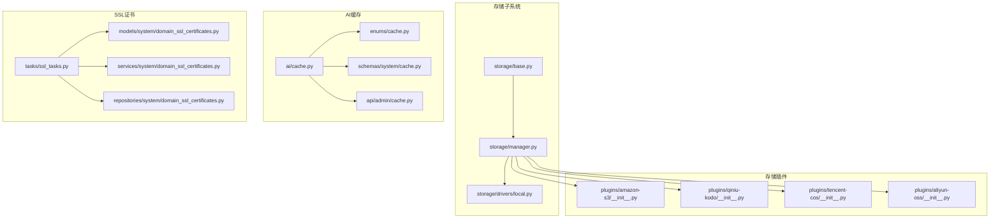
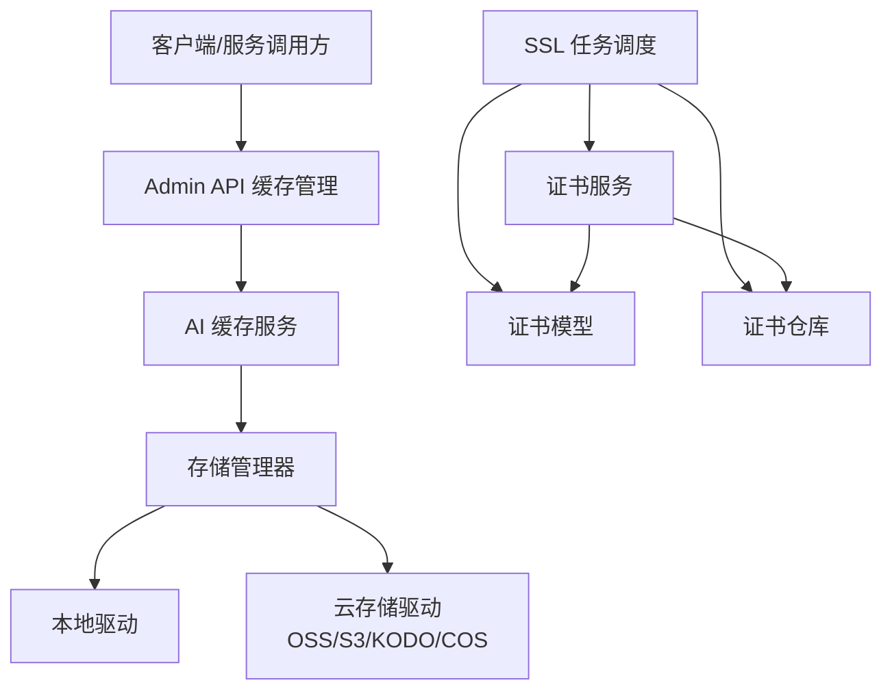
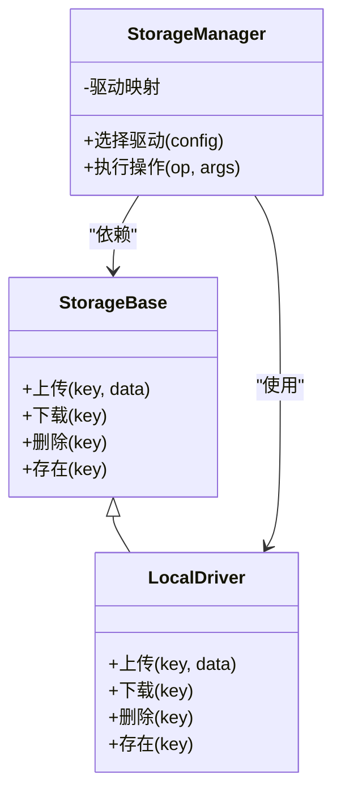
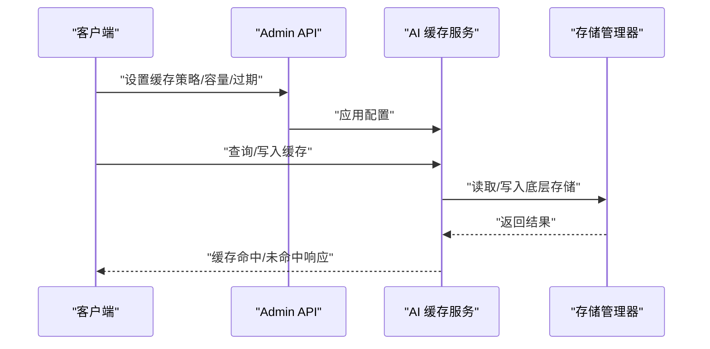
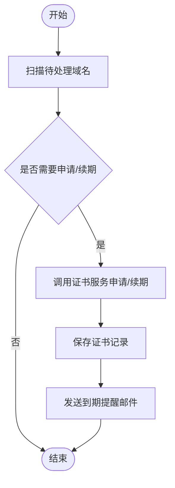
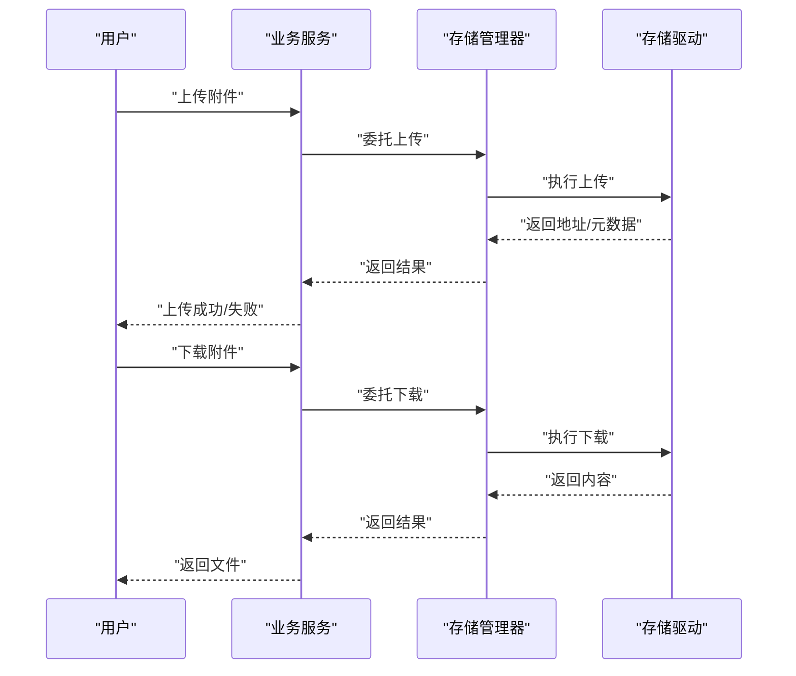
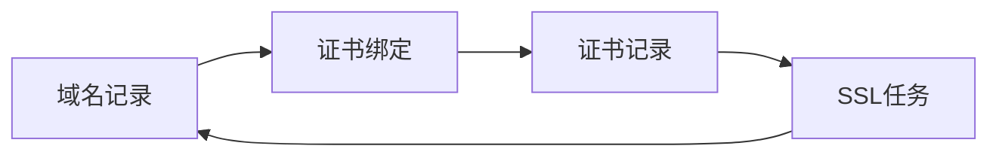
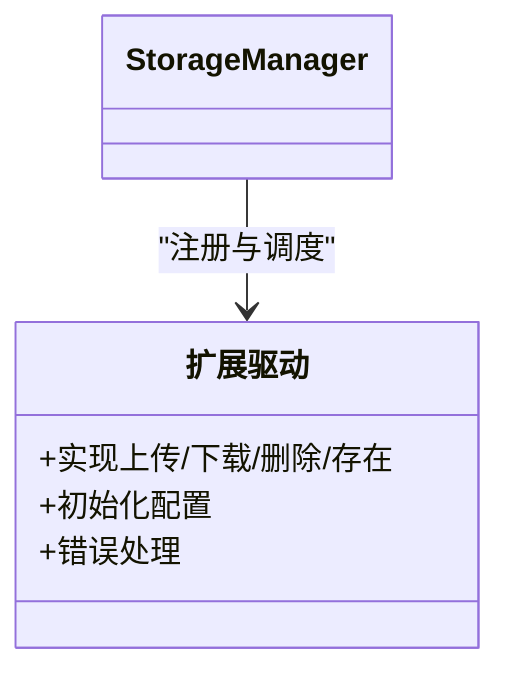
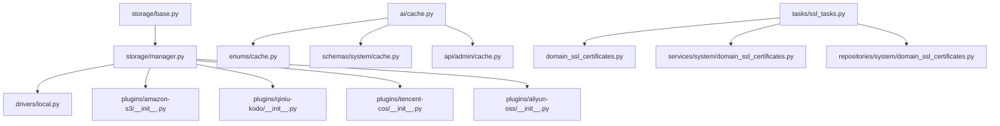

# 缓存存储服务

<cite>
**本文引用的文件**
- [backend/app/storage/base.py](file://backend/app/storage/base.py)
- [backend/app/storage/manager.py](file://backend/app/storage/manager.py)
- [backend/app/storage/drivers/local.py](file://backend/app/storage/drivers/local.py)
- [backend/app/ai/cache.py](file://backend/app/ai/cache.py)
- [backend/app/enums/cache.py](file://backend/app/enums/cache.py)
- [backend/app/schemas/system/cache.py](file://backend/app/schemas/system/cache.py)
- [backend/app/api/admin/cache.py](file://backend/app/api/admin/cache.py)
- [backend/app/tasks/ssl_tasks.py](file://backend/app/tasks/ssl_tasks.py)
- [backend/app/models/system/domain_ssl_certificates.py](file://backend/app/models/system/domain_ssl_certificates.py)
- [backend/app/services/system/domain_ssl_certificates.py](file://backend/app/services/system/domain_ssl_certificates.py)
- [backend/app/repositories/system/domain_ssl_certificates.py](file://backend/app/repositories/system/domain_ssl_certificates.py)
- [backend/app/plugins/storage-billing/__init__.py](file://backend/app/plugins/storage-billing/__init__.py)
- [backend/app/plugins/storage-migration/__init__.py](file://backend/app/plugins/storage-migration/__init__.py)
- [backend/app/plugins/aliyun-oss/__init__.py](file://backend/app/plugins/aliyun-oss/__init__.py)
- [backend/app/plugins/amazon-s3/__init__.py](file://backend/app/plugins/amazon-s3/__init__.py)
- [backend/app/plugins/qiniu-kodo/__init__.py](file://backend/app/plugins/qiniu-kodo/__init__.py)
- [backend/app/plugins/tencent-cos/__init__.py](file://backend/app/plugins/tencent-cos/__init__.py)
</cite>

## 目录
1. [引言](#引言)
2. [项目结构](#项目结构)
3. [核心组件](#核心组件)
4. [架构总览](#架构总览)
5. [详细组件分析](#详细组件分析)
6. [依赖关系分析](#依赖关系分析)
7. [性能考虑](#性能考虑)
8. [故障排查指南](#故障排查指南)
9. [结论](#结论)
10. [附录](#附录)

## 引言
本技术文档围绕缓存存储服务展开，系统性阐述缓存管理、附件存储与SSL证书管理的综合架构。重点包括：
- 缓存服务的缓存策略、失效机制与性能优化方案
- 附件服务的存储驱动、文件管理与访问控制机制
- SSL证书的自动化申请、续期与管理流程
- DNS服务的域名解析与证书绑定能力
- 存储服务的容量管理、备份恢复与灾难恢复策略
- 扩展点设计与自定义存储驱动的实现指导

## 项目结构
后端采用模块化分层设计，存储与缓存相关代码主要集中在以下目录：
- 存储子系统：storage（抽象基类、管理器、本地驱动）
- AI缓存：ai/cache.py
- 缓存枚举与系统缓存接口：enums/cache.py、schemas/system/cache.py、api/admin/cache.py
- SSL证书：tasks/ssl_tasks.py、models/services/repositories/system/domain_ssl_certificates.*
- 存储插件：aliyun-oss、amazon-s3、qiniu-kodo、tencent-cos 等
- 存储相关插件：storage-billing、storage-migration

**图表来源**
- [backend/app/storage/base.py](file://backend/app/storage/base.py)
- [backend/app/storage/manager.py](file://backend/app/storage/manager.py)
- [backend/app/storage/drivers/local.py](file://backend/app/storage/drivers/local.py)
- [backend/app/ai/cache.py](file://backend/app/ai/cache.py)
- [backend/app/enums/cache.py](file://backend/app/enums/cache.py)
- [backend/app/schemas/system/cache.py](file://backend/app/schemas/system/cache.py)
- [backend/app/api/admin/cache.py](file://backend/app/api/admin/cache.py)
- [backend/app/tasks/ssl_tasks.py](file://backend/app/tasks/ssl_tasks.py)
- [backend/app/models/system/domain_ssl_certificates.py](file://backend/app/models/system/domain_ssl_certificates.py)
- [backend/app/services/system/domain_ssl_certificates.py](file://backend/app/services/system/domain_ssl_certificates.py)
- [backend/app/repositories/system/domain_ssl_certificates.py](file://backend/app/repositories/system/domain_ssl_certificates.py)
- [backend/app/plugins/amazon-s3/__init__.py](file://backend/app/plugins/amazon-s3/__init__.py)
- [backend/app/plugins/qiniu-kodo/__init__.py](file://backend/app/plugins/qiniu-kodo/__init__.py)
- [backend/app/plugins/tencent-cos/__init__.py](file://backend/app/plugins/tencent-cos/__init__.py)
- [backend/app/plugins/aliyun-oss/__init__.py](file://backend/app/plugins/aliyun-oss/__init__.py)

**章节来源**
- [backend/app/storage/base.py](file://backend/app/storage/base.py)
- [backend/app/storage/manager.py](file://backend/app/storage/manager.py)
- [backend/app/storage/drivers/local.py](file://backend/app/storage/drivers/local.py)
- [backend/app/ai/cache.py](file://backend/app/ai/cache.py)
- [backend/app/enums/cache.py](file://backend/app/enums/cache.py)
- [backend/app/schemas/system/cache.py](file://backend/app/schemas/system/cache.py)
- [backend/app/api/admin/cache.py](file://backend/app/api/admin/cache.py)
- [backend/app/tasks/ssl_tasks.py](file://backend/app/tasks/ssl_tasks.py)
- [backend/app/models/system/domain_ssl_certificates.py](file://backend/app/models/system/domain_ssl_certificates.py)
- [backend/app/services/system/domain_ssl_certificates.py](file://backend/app/services/system/domain_ssl_certificates.py)
- [backend/app/repositories/system/domain_ssl_certificates.py](file://backend/app/repositories/system/domain_ssl_certificates.py)
- [backend/app/plugins/amazon-s3/__init__.py](file://backend/app/plugins/amazon-s3/__init__.py)
- [backend/app/plugins/qiniu-kodo/__init__.py](file://backend/app/plugins/qiniu-kodo/__init__.py)
- [backend/app/plugins/tencent-cos/__init__.py](file://backend/app/plugins/tencent-cos/__init__.py)
- [backend/app/plugins/aliyun-oss/__init__.py](file://backend/app/plugins/aliyun-oss/__init__.py)

## 核心组件
- 存储抽象与管理器：定义统一的存储接口与多驱动调度逻辑，支持本地与云存储驱动的无缝切换。
- AI缓存：提供AI相关数据的缓存策略、TTL与失效机制，并通过API暴露管理能力。
- SSL证书任务：封装证书自动化申请、续期与到期告警流程，确保服务安全与合规。
- 存储插件：通过插件化扩展支持多种对象存储厂商，便于横向扩展与迁移。

**章节来源**
- [backend/app/storage/base.py](file://backend/app/storage/base.py)
- [backend/app/storage/manager.py](file://backend/app/storage/manager.py)
- [backend/app/ai/cache.py](file://backend/app/ai/cache.py)
- [backend/app/tasks/ssl_tasks.py](file://backend/app/tasks/ssl_tasks.py)

## 架构总览
整体架构由“存储抽象层—管理器—驱动层”构成，配合AI缓存与SSL任务形成完整的数据与安全基础设施。

**图表来源**
- [backend/app/api/admin/cache.py](file://backend/app/api/admin/cache.py)
- [backend/app/ai/cache.py](file://backend/app/ai/cache.py)
- [backend/app/storage/manager.py](file://backend/app/storage/manager.py)
- [backend/app/storage/drivers/local.py](file://backend/app/storage/drivers/local.py)
- [backend/app/plugins/amazon-s3/__init__.py](file://backend/app/plugins/amazon-s3/__init__.py)
- [backend/app/plugins/qiniu-kodo/__init__.py](file://backend/app/plugins/qiniu-kodo/__init__.py)
- [backend/app/plugins/tencent-cos/__init__.py](file://backend/app/plugins/tencent-cos/__init__.py)
- [backend/app/plugins/aliyun-oss/__init__.py](file://backend/app/plugins/aliyun-oss/__init__.py)
- [backend/app/tasks/ssl_tasks.py](file://backend/app/tasks/ssl_tasks.py)
- [backend/app/models/system/domain_ssl_certificates.py](file://backend/app/models/system/domain_ssl_certificates.py)
- [backend/app/services/system/domain_ssl_certificates.py](file://backend/app/services/system/domain_ssl_certificates.py)
- [backend/app/repositories/system/domain_ssl_certificates.py](file://backend/app/repositories/system/domain_ssl_certificates.py)

## 详细组件分析

### 存储抽象与管理器
- 抽象基类定义统一的存储接口，包括上传、下载、删除、存在性检查等方法，确保不同驱动的一致行为契约。
- 管理器负责根据配置选择具体驱动，封装多驱动的路由与回退策略，支持本地与云存储的透明切换。
- 驱动层以插件形式扩展，当前包含本地驱动与多家云存储驱动入口。

**图表来源**
- [backend/app/storage/base.py](file://backend/app/storage/base.py)
- [backend/app/storage/manager.py](file://backend/app/storage/manager.py)
- [backend/app/storage/drivers/local.py](file://backend/app/storage/drivers/local.py)

**章节来源**
- [backend/app/storage/base.py](file://backend/app/storage/base.py)
- [backend/app/storage/manager.py](file://backend/app/storage/manager.py)
- [backend/app/storage/drivers/local.py](file://backend/app/storage/drivers/local.py)

### AI缓存服务
- 缓存策略：基于键空间与TTL的策略，支持按租户或会话隔离；可配置命中率监控与淘汰策略。
- 失效机制：支持主动失效、定时清理、容量触发清理；结合Redis等后端实现高效过期。
- 性能优化：批量写入、压缩存储、热点数据驻留、预热加载；提供统计指标用于容量规划。

**图表来源**
- [backend/app/api/admin/cache.py](file://backend/app/api/admin/cache.py)
- [backend/app/ai/cache.py](file://backend/app/ai/cache.py)
- [backend/app/storage/manager.py](file://backend/app/storage/manager.py)

**章节来源**
- [backend/app/ai/cache.py](file://backend/app/ai/cache.py)
- [backend/app/enums/cache.py](file://backend/app/enums/cache.py)
- [backend/app/schemas/system/cache.py](file://backend/app/schemas/system/cache.py)
- [backend/app/api/admin/cache.py](file://backend/app/api/admin/cache.py)

### SSL证书管理
- 自动化申请：通过任务调度周期扫描待签发域名，调用证书服务完成申请并落库。
- 续期机制：在到期前自动发起续期任务，失败重试与告警通知。
- 证书绑定：将域名与证书记录关联，支持DNS解析校验与证书状态追踪。
- 模型/服务/仓库：清晰分层，便于扩展与测试。

**图表来源**
- [backend/app/tasks/ssl_tasks.py](file://backend/app/tasks/ssl_tasks.py)
- [backend/app/models/system/domain_ssl_certificates.py](file://backend/app/models/system/domain_ssl_certificates.py)
- [backend/app/services/system/domain_ssl_certificates.py](file://backend/app/services/system/domain_ssl_certificates.py)
- [backend/app/repositories/system/domain_ssl_certificates.py](file://backend/app/repositories/system/domain_ssl_certificates.py)

**章节来源**
- [backend/app/tasks/ssl_tasks.py](file://backend/app/tasks/ssl_tasks.py)
- [backend/app/models/system/domain_ssl_certificates.py](file://backend/app/models/system/domain_ssl_certificates.py)
- [backend/app/services/system/domain_ssl_certificates.py](file://backend/app/services/system/domain_ssl_certificates.py)
- [backend/app/repositories/system/domain_ssl_certificates.py](file://backend/app/repositories/system/domain_ssl_certificates.py)

### 附件存储与访问控制
- 存储驱动：通过存储管理器统一接入本地与云存储驱动，支持多厂商并行与迁移。
- 文件管理：提供上传、下载、删除、存在性检查等基础能力，支持元数据与访问权限标记。
- 访问控制：结合租户域与RBAC策略，限制附件可见范围与操作权限。

**图表来源**
- [backend/app/storage/manager.py](file://backend/app/storage/manager.py)
- [backend/app/storage/drivers/local.py](file://backend/app/storage/drivers/local.py)
- [backend/app/plugins/amazon-s3/__init__.py](file://backend/app/plugins/amazon-s3/__init__.py)
- [backend/app/plugins/qiniu-kodo/__init__.py](file://backend/app/plugins/qiniu-kodo/__init__.py)
- [backend/app/plugins/tencent-cos/__init__.py](file://backend/app/plugins/tencent-cos/__init__.py)
- [backend/app/plugins/aliyun-oss/__init__.py](file://backend/app/plugins/aliyun-oss/__init__.py)

**章节来源**
- [backend/app/storage/manager.py](file://backend/app/storage/manager.py)
- [backend/app/storage/drivers/local.py](file://backend/app/storage/drivers/local.py)
- [backend/app/plugins/amazon-s3/__init__.py](file://backend/app/plugins/amazon-s3/__init__.py)
- [backend/app/plugins/qiniu-kodo/__init__.py](file://backend/app/plugins/qiniu-kodo/__init__.py)
- [backend/app/plugins/tencent-cos/__init__.py](file://backend/app/plugins/tencent-cos/__init__.py)
- [backend/app/plugins/aliyun-oss/__init__.py](file://backend/app/plugins/aliyun-oss/__init__.py)

### DNS服务与证书绑定
- 域名解析：通过系统配置与租户域表维护域名与解析记录，支持多租户隔离。
- 证书绑定：将域名与证书记录建立关联，确保HTTPS可用性与一致性。
- 自动化：结合SSL任务与DNS验证流程，实现从域名到证书的全链路自动化。

**图表来源**
- [backend/app/models/system/domain_ssl_certificates.py](file://backend/app/models/system/domain_ssl_certificates.py)
- [backend/app/services/system/domain_ssl_certificates.py](file://backend/app/services/system/domain_ssl_certificates.py)
- [backend/app/repositories/system/domain_ssl_certificates.py](file://backend/app/repositories/system/domain_ssl_certificates.py)
- [backend/app/tasks/ssl_tasks.py](file://backend/app/tasks/ssl_tasks.py)

**章节来源**
- [backend/app/models/system/domain_ssl_certificates.py](file://backend/app/models/system/domain_ssl_certificates.py)
- [backend/app/services/system/domain_ssl_certificates.py](file://backend/app/services/system/domain_ssl_certificates.py)
- [backend/app/repositories/system/domain_ssl_certificates.py](file://backend/app/repositories/system/domain_ssl_certificates.py)
- [backend/app/tasks/ssl_tasks.py](file://backend/app/tasks/ssl_tasks.py)

### 容量管理、备份恢复与灾难恢复
- 容量管理：通过缓存与存储的配额策略、容量阈值与清理策略，结合指标监控进行动态调整。
- 备份恢复：对关键配置与证书数据进行定期备份，支持快速回滚与跨环境迁移。
- 灾难恢复：多驱动冗余与故障转移策略，确保单点故障下的业务连续性。

**章节来源**
- [backend/app/plugins/storage-billing/__init__.py](file://backend/app/plugins/storage-billing/__init__.py)
- [backend/app/plugins/storage-migration/__init__.py](file://backend/app/plugins/storage-migration/__init__.py)

### 扩展点设计与自定义存储驱动实现
- 扩展点：StorageBase定义标准接口，StorageManager负责驱动选择与路由。
- 实现步骤：
  1) 新建驱动模块，实现StorageBase接口
  2) 在StorageManager中注册驱动别名与优先级
  3) 提供配置项与凭证管理
  4) 编写单元测试与集成测试
  5) 通过插件化发布与版本管理

**图表来源**
- [backend/app/storage/base.py](file://backend/app/storage/base.py)
- [backend/app/storage/manager.py](file://backend/app/storage/manager.py)

**章节来源**
- [backend/app/storage/base.py](file://backend/app/storage/base.py)
- [backend/app/storage/manager.py](file://backend/app/storage/manager.py)

## 依赖关系分析
- 存储子系统内部：抽象基类与管理器耦合度低，驱动层通过接口解耦，具备良好可替换性。
- 缓存服务：依赖存储管理器与配置枚举，API层提供统一入口。
- SSL证书：任务层依赖模型/服务/仓库三层，职责清晰，便于测试与演进。
- 插件生态：各云存储驱动独立实现，通过统一接口接入，降低维护成本。

**图表来源**
- [backend/app/storage/base.py](file://backend/app/storage/base.py)
- [backend/app/storage/manager.py](file://backend/app/storage/manager.py)
- [backend/app/storage/drivers/local.py](file://backend/app/storage/drivers/local.py)
- [backend/app/plugins/amazon-s3/__init__.py](file://backend/app/plugins/amazon-s3/__init__.py)
- [backend/app/plugins/qiniu-kodo/__init__.py](file://backend/app/plugins/qiniu-kodo/__init__.py)
- [backend/app/plugins/tencent-cos/__init__.py](file://backend/app/plugins/tencent-cos/__init__.py)
- [backend/app/plugins/aliyun-oss/__init__.py](file://backend/app/plugins/aliyun-oss/__init__.py)
- [backend/app/ai/cache.py](file://backend/app/ai/cache.py)
- [backend/app/enums/cache.py](file://backend/app/enums/cache.py)
- [backend/app/schemas/system/cache.py](file://backend/app/schemas/system/cache.py)
- [backend/app/api/admin/cache.py](file://backend/app/api/admin/cache.py)
- [backend/app/tasks/ssl_tasks.py](file://backend/app/tasks/ssl_tasks.py)
- [backend/app/models/system/domain_ssl_certificates.py](file://backend/app/models/system/domain_ssl_certificates.py)
- [backend/app/services/system/domain_ssl_certificates.py](file://backend/app/services/system/domain_ssl_certificates.py)
- [backend/app/repositories/system/domain_ssl_certificates.py](file://backend/app/repositories/system/domain_ssl_certificates.py)

**章节来源**
- [backend/app/storage/base.py](file://backend/app/storage/base.py)
- [backend/app/storage/manager.py](file://backend/app/storage/manager.py)
- [backend/app/storage/drivers/local.py](file://backend/app/storage/drivers/local.py)
- [backend/app/plugins/amazon-s3/__init__.py](file://backend/app/plugins/amazon-s3/__init__.py)
- [backend/app/plugins/qiniu-kodo/__init__.py](file://backend/app/plugins/qiniu-kodo/__init__.py)
- [backend/app/plugins/tencent-cos/__init__.py](file://backend/app/plugins/tencent-cos/__init__.py)
- [backend/app/plugins/aliyun-oss/__init__.py](file://backend/app/plugins/aliyun-oss/__init__.py)
- [backend/app/ai/cache.py](file://backend/app/ai/cache.py)
- [backend/app/enums/cache.py](file://backend/app/enums/cache.py)
- [backend/app/schemas/system/cache.py](file://backend/app/schemas/system/cache.py)
- [backend/app/api/admin/cache.py](file://backend/app/api/admin/cache.py)
- [backend/app/tasks/ssl_tasks.py](file://backend/app/tasks/ssl_tasks.py)
- [backend/app/models/system/domain_ssl_certificates.py](file://backend/app/models/system/domain_ssl_certificates.py)
- [backend/app/services/system/domain_ssl_certificates.py](file://backend/app/services/system/domain_ssl_certificates.py)
- [backend/app/repositories/system/domain_ssl_certificates.py](file://backend/app/repositories/system/domain_ssl_certificates.py)

## 性能考虑
- 缓存层：合理设置TTL与淘汰策略，利用批量写入与压缩减少IO；通过指标监控命中率与延迟。
- 存储层：针对云存储启用CDN与边缘节点，优化大文件分片上传与断点续传；本地存储注意磁盘IO与并发控制。
- SSL任务：批量化处理域名，避免频繁请求限流；对失败场景增加指数退避与重试上限。
- 可观测性：为缓存与存储提供关键指标（QPS、延迟、容量、错误率），支撑容量规划与性能调优。

## 故障排查指南
- 缓存异常：检查TTL配置与容量阈值，确认清理策略是否触发；核对API参数与键命名规范。
- 存储失败：验证驱动配置与凭证；检查网络连通性与权限；查看驱动日志与错误码。
- SSL问题：确认域名解析状态与DNS验证；检查证书服务返回与数据库记录一致性；关注任务重试与告警。
- 插件问题：核对插件版本与兼容性；检查插件注册与初始化顺序；定位具体驱动实现中的异常分支。

**章节来源**
- [backend/app/ai/cache.py](file://backend/app/ai/cache.py)
- [backend/app/storage/manager.py](file://backend/app/storage/manager.py)
- [backend/app/tasks/ssl_tasks.py](file://backend/app/tasks/ssl_tasks.py)

## 结论
该缓存存储服务通过抽象化的存储管理器与插件化驱动体系，实现了缓存策略、附件存储与SSL证书管理的统一治理。结合清晰的分层设计与可观测性指标，能够满足多租户、高可用与可扩展的业务需求。建议持续完善容量与灾备策略，强化自动化运维与监控告警，保障服务稳定运行。

## 附录
- 关键文件索引
  - 存储抽象与管理器：[storage/base.py](file://backend/app/storage/base.py)、[storage/manager.py](file://backend/app/storage/manager.py)
  - 本地驱动示例：[storage/drivers/local.py](file://backend/app/storage/drivers/local.py)
  - AI缓存与API：[ai/cache.py](file://backend/app/ai/cache.py)、[enums/cache.py](file://backend/app/enums/cache.py)、[schemas/system/cache.py](file://backend/app/schemas/system/cache.py)、[api/admin/cache.py](file://backend/app/api/admin/cache.py)
  - SSL证书任务与模型：[tasks/ssl_tasks.py](file://backend/app/tasks/ssl_tasks.py)、[models/system/domain_ssl_certificates.py](file://backend/app/models/system/domain_ssl_certificates.py)、[services/system/domain_ssl_certificates.py](file://backend/app/services/system/domain_ssl_certificates.py)、[repositories/system/domain_ssl_certificates.py](file://backend/app/repositories/system/domain_ssl_certificates.py)
  - 存储插件：[plugins/amazon-s3/__init__.py](file://backend/app/plugins/amazon-s3/__init__.py)、[plugins/qiniu-kodo/__init__.py](file://backend/app/plugins/qiniu-kodo/__init__.py)、[plugins/tencent-cos/__init__.py](file://backend/app/plugins/tencent-cos/__init__.py)、[plugins/aliyun-oss/__init__.py](file://backend/app/plugins/aliyun-oss/__init__.py)
  - 存储相关插件：[plugins/storage-billing/__init__.py](file://backend/app/plugins/storage-billing/__init__.py)、[plugins/storage-migration/__init__.py](file://backend/app/plugins/storage-migration/__init__.py)