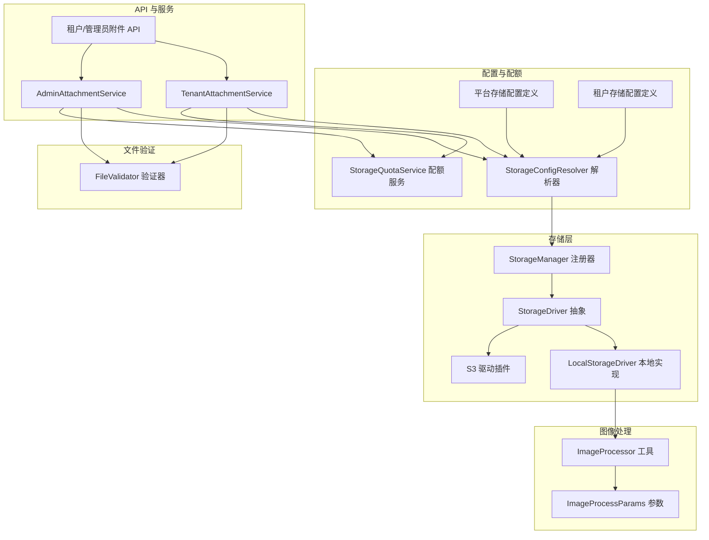
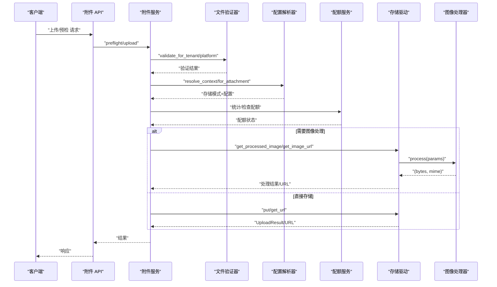
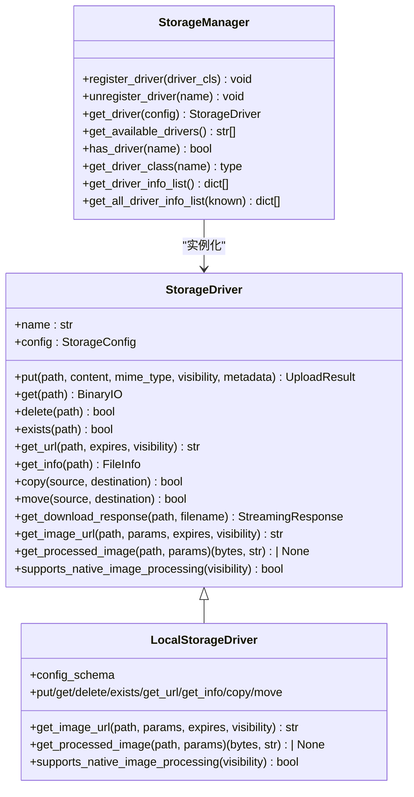
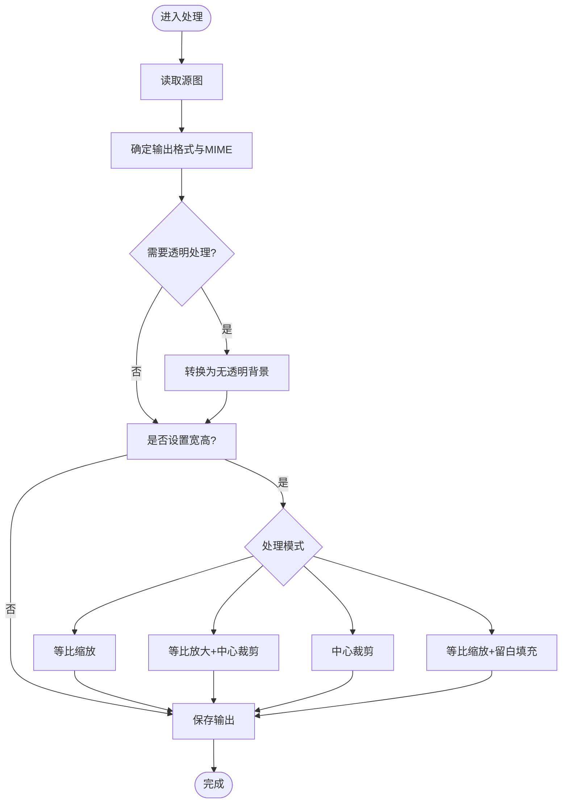
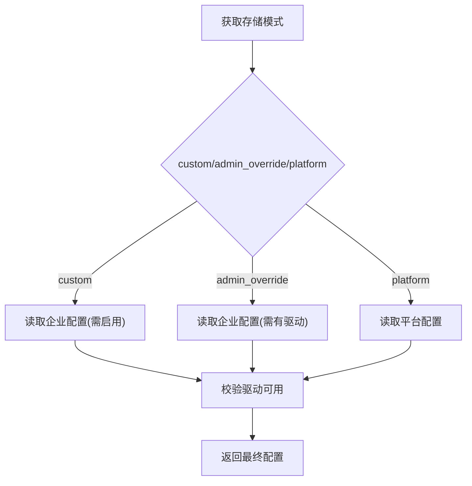
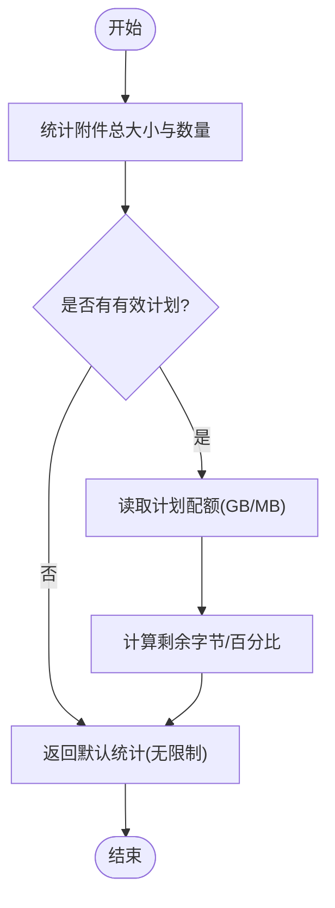
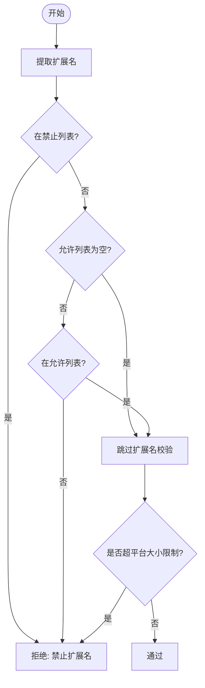
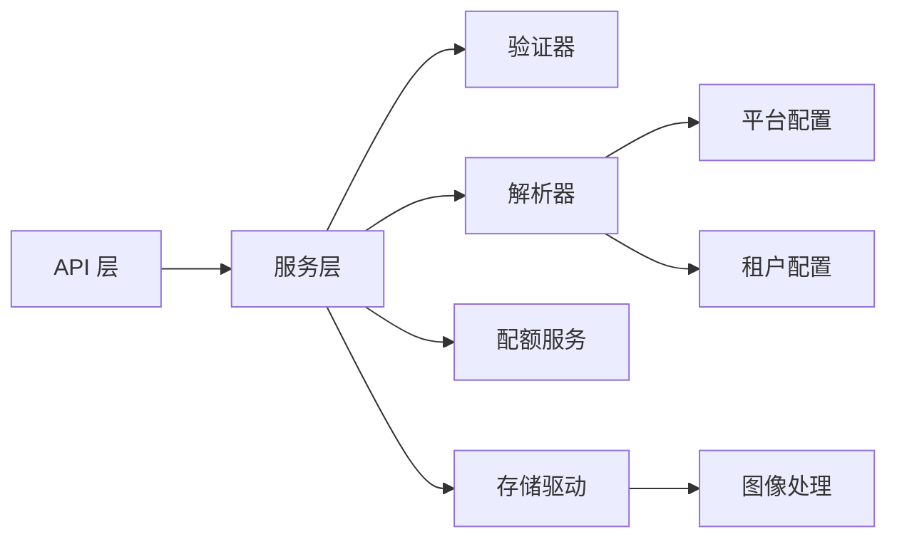

# 文件处理服务

<cite>
**本文引用的文件**
- [backend/app/storage/base.py](file://backend/app/storage/base.py)
- [backend/app/storage/manager.py](file://backend/app/storage/manager.py)
- [backend/app/storage/drivers/local.py](file://backend/app/storage/drivers/local.py)
- [backend/app/utils/image.py](file://backend/app/utils/image.py)
- [backend/app/services/common/storage_config_resolver.py](file://backend/app/services/common/storage_config_resolver.py)
- [backend/app/services/common/storage_quota_service.py](file://backend/app/services/common/storage_quota_service.py)
- [backend/app/services/common/file_validator.py](file://backend/app/services/common/file_validator.py)
- [backend/app/configs/definitions/platform/storage.py](file://backend/app/configs/definitions/platform/storage.py)
- [backend/app/configs/definitions/tenant/storage.py](file://backend/app/configs/definitions/tenant/storage.py)
- [backend/plugins/amazon-s3/backend/driver.py](file://backend/plugins/amazon-s3/backend/driver.py)
- [backend/app/api/tenant/attachments.py](file://backend/app/api/tenant/attachments.py)
- [backend/app/api/admin/attachments.py](file://backend/app/api/admin/attachments.py)
- [backend/app/services/system/attachment_service.py](file://backend/app/services/system/attachment_service.py)
- [backend/app/services/tenant/attachment_service.py](file://backend/app/services/tenant/attachment_service.py)
</cite>

## 目录
1. [简介](#简介)
2. [项目结构](#项目结构)
3. [核心组件](#核心组件)
4. [架构总览](#架构总览)
5. [详细组件分析](#详细组件分析)
6. [依赖关系分析](#依赖关系分析)
7. [性能考量](#性能考量)
8. [故障排查指南](#故障排查指南)
9. [结论](#结论)
10. [附录](#附录)

## 简介
本文件处理服务围绕“文件验证—图像处理—存储管理”三大主线构建，提供统一的文件上传、安全检查、图像格式转换与压缩、存储配额控制以及与多存储驱动的集成方案。系统通过可插拔的存储驱动、集中化的配置解析与配额服务，实现跨平台与多租户的灵活扩展。

## 项目结构
文件处理服务主要分布在以下模块：
- 存储抽象与驱动：定义统一的存储接口、驱动注册与本地驱动实现
- 图像处理工具：基于 Pillow 的图片处理与缓存策略
- 配置解析与配额：平台与租户双层配置解析、统一配额统计与批量查询
- 文件验证：扩展名白黑名单与大小限制的验证逻辑
- API 与服务：上传预检、上传流程、下载与访问控制

图表来源
- [backend/app/storage/base.py:88-272](file://backend/app/storage/base.py#L88-L272)
- [backend/app/storage/manager.py:13-155](file://backend/app/storage/manager.py#L13-L155)
- [backend/app/storage/drivers/local.py:31-446](file://backend/app/storage/drivers/local.py#L31-L446)
- [backend/app/utils/image.py:45-390](file://backend/app/utils/image.py#L45-L390)
- [backend/app/services/common/storage_config_resolver.py:113-429](file://backend/app/services/common/storage_config_resolver.py#L113-L429)
- [backend/app/services/common/storage_quota_service.py:18-284](file://backend/app/services/common/storage_quota_service.py#L18-L284)
- [backend/app/services/common/file_validator.py:40-271](file://backend/app/services/common/file_validator.py#L40-L271)
- [backend/app/configs/definitions/platform/storage.py:1-544](file://backend/app/configs/definitions/platform/storage.py#L1-L544)
- [backend/app/configs/definitions/tenant/storage.py:1-443](file://backend/app/configs/definitions/tenant/storage.py#L1-L443)
- [backend/app/api/tenant/attachments.py:110-137](file://backend/app/api/tenant/attachments.py#L110-L137)
- [backend/app/api/admin/attachments.py:119-145](file://backend/app/api/admin/attachments.py#L119-L145)

章节来源
- [backend/app/storage/base.py:1-273](file://backend/app/storage/base.py#L1-L273)
- [backend/app/storage/manager.py:1-156](file://backend/app/storage/manager.py#L1-L156)
- [backend/app/storage/drivers/local.py:1-446](file://backend/app/storage/drivers/local.py#L1-L446)
- [backend/app/utils/image.py:1-390](file://backend/app/utils/image.py#L1-L390)
- [backend/app/services/common/storage_config_resolver.py:1-430](file://backend/app/services/common/storage_config_resolver.py#L1-L430)
- [backend/app/services/common/storage_quota_service.py:1-285](file://backend/app/services/common/storage_quota_service.py#L1-L285)
- [backend/app/services/common/file_validator.py:1-272](file://backend/app/services/common/file_validator.py#L1-L272)
- [backend/app/configs/definitions/platform/storage.py:1-544](file://backend/app/configs/definitions/platform/storage.py#L1-L544)
- [backend/app/configs/definitions/tenant/storage.py:1-443](file://backend/app/configs/definitions/tenant/storage.py#L1-L443)
- [backend/app/api/tenant/attachments.py:110-137](file://backend/app/api/tenant/attachments.py#L110-L137)
- [backend/app/api/admin/attachments.py:119-145](file://backend/app/api/admin/attachments.py#L119-L145)

## 核心组件
- 存储驱动抽象与注册：统一上传、下载、URL 生成、信息查询与图像处理接口，支持本地与云存储驱动注册与切换
- 图像处理工具：支持缩放、裁剪、填充、格式转换与质量压缩，提供参数校验与缓存键生成
- 配置解析器：按“平台/管理员覆盖/企业自管”三层解析存储配置，确保历史附件可追溯访问
- 配额服务：统一统计企业已用空间、文件数与剩余配额，支持批量查询与计划有效性判断
- 文件验证器：基于扩展名白名单/黑名单与大小限制的验证，支持平台与企业两级配置
- API 与服务：提供预检与上传流程，结合验证、配额与存储上下文完成端到端处理

章节来源
- [backend/app/storage/base.py:88-272](file://backend/app/storage/base.py#L88-L272)
- [backend/app/utils/image.py:45-390](file://backend/app/utils/image.py#L45-L390)
- [backend/app/services/common/storage_config_resolver.py:113-429](file://backend/app/services/common/storage_config_resolver.py#L113-L429)
- [backend/app/services/common/storage_quota_service.py:18-284](file://backend/app/services/common/storage_quota_service.py#L18-L284)
- [backend/app/services/common/file_validator.py:40-271](file://backend/app/services/common/file_validator.py#L40-L271)

## 架构总览
文件处理服务采用“配置解析—验证—存储上下文—驱动执行”的流水线式架构，图像处理在本地驱动中通过缓存与并发线程池优化性能，在云驱动中通过原生处理能力减少本地负担。

图表来源
- [backend/app/api/tenant/attachments.py:110-137](file://backend/app/api/tenant/attachments.py#L110-L137)
- [backend/app/api/admin/attachments.py:119-145](file://backend/app/api/admin/attachments.py#L119-L145)
- [backend/app/services/tenant/attachment_service.py:54-76](file://backend/app/services/tenant/attachment_service.py#L54-L76)
- [backend/app/services/system/attachment_service.py:167-199](file://backend/app/services/system/attachment_service.py#L167-L199)
- [backend/app/services/common/file_validator.py:40-271](file://backend/app/services/common/file_validator.py#L40-L271)
- [backend/app/services/common/storage_config_resolver.py:258-429](file://backend/app/services/common/storage_config_resolver.py#L258-L429)
- [backend/app/services/common/storage_quota_service.py:34-182](file://backend/app/services/common/storage_quota_service.py#L34-L182)
- [backend/app/storage/base.py:106-246](file://backend/app/storage/base.py#L106-L246)
- [backend/app/utils/image.py:202-275](file://backend/app/utils/image.py#L202-L275)

## 详细组件分析

### 存储驱动与管理器
- 抽象接口：统一 put/get/delete/exists/get_url/get_info/copy/move，以及图像处理相关接口
- 本地驱动：支持元数据侧写、URL 生成、图像处理与缓存、变体数量限制
- 云驱动：以插件形式接入，支持原生图像处理与 URL 生成
- 管理器：单例注册与检索驱动，提供驱动信息列表与可用性检测

图表来源
- [backend/app/storage/base.py:88-272](file://backend/app/storage/base.py#L88-L272)
- [backend/app/storage/manager.py:13-155](file://backend/app/storage/manager.py#L13-L155)
- [backend/app/storage/drivers/local.py:31-446](file://backend/app/storage/drivers/local.py#L31-L446)

章节来源
- [backend/app/storage/base.py:88-272](file://backend/app/storage/base.py#L88-L272)
- [backend/app/storage/manager.py:13-155](file://backend/app/storage/manager.py#L13-L155)
- [backend/app/storage/drivers/local.py:31-446](file://backend/app/storage/drivers/local.py#L31-L446)

### 图像处理流水线
- 参数模型：宽高、质量、格式、处理模式（等比缩放、填充、裁剪、留边）
- 处理算法：根据模式选择缩放与裁剪策略，透明通道处理与格式转换
- 缓存策略：本地驱动对每张源图维护变体上限，超过阈值返回原图，避免缓存膨胀
- 并发与线程：处理过程在独立线程执行，避免阻塞事件循环

图表来源
- [backend/app/utils/image.py:202-360](file://backend/app/utils/image.py#L202-L360)

章节来源
- [backend/app/utils/image.py:45-390](file://backend/app/utils/image.py#L45-L390)
- [backend/plugins/amazon-s3/backend/driver.py:383-403](file://backend/plugins/amazon-s3/backend/driver.py#L383-L403)
- [backend/app/storage/drivers/local.py:395-435](file://backend/app/storage/drivers/local.py#L395-L435)

### 存储配置解析与迁移
- 三层解析：custom（企业自管）、admin_override（管理员覆盖）、platform（平台默认）
- 企业自管开关：逐企业控制，不依赖全局开关
- 历史附件兼容：按附件记录的驱动与快照恢复正确配置，避免迁移后无法访问
- 驱动可用性：解析后校验驱动是否已注册，避免错误配置导致 500

图表来源
- [backend/app/services/common/storage_config_resolver.py:124-290](file://backend/app/services/common/storage_config_resolver.py#L124-L290)

章节来源
- [backend/app/services/common/storage_config_resolver.py:113-429](file://backend/app/services/common/storage_config_resolver.py#L113-L429)
- [backend/app/configs/definitions/platform/storage.py:1-544](file://backend/app/configs/definitions/platform/storage.py#L1-L544)
- [backend/app/configs/definitions/tenant/storage.py:1-443](file://backend/app/configs/definitions/tenant/storage.py#L1-L443)

### 存储配额计算逻辑
- 统计维度：已用字节、文件数量、计划配额（GB）、单文件最大大小（MB）
- 批量查询：按租户 ID 列表一次性统计，提升性能
- 配额状态：基于计划有效性与限制值计算剩余字节、使用百分比与是否无限

图表来源
- [backend/app/services/common/storage_quota_service.py:34-182](file://backend/app/services/common/storage_quota_service.py#L34-L182)

章节来源
- [backend/app/services/common/storage_quota_service.py:18-284](file://backend/app/services/common/storage_quota_service.py#L18-L284)

### 文件验证规则
- 扩展名策略：禁止列表优先，允许列表为空表示不限制，否则必须在允许列表内
- 大小策略：平台统一限制，企业侧由配额服务统一校验，验证器不重复校验
- 配置来源：平台与企业分别配置，企业未配置时回退平台

图表来源
- [backend/app/services/common/file_validator.py:141-185](file://backend/app/services/common/file_validator.py#L141-L185)

章节来源
- [backend/app/services/common/file_validator.py:40-271](file://backend/app/services/common/file_validator.py#L40-L271)

### API 与服务集成
- 预检接口：根据哈希快速判定是否已存在，若私有可见性则返回带签名的访问 URL
- 上传流程：验证→解析存储上下文→配额检查→落地存储→返回结果
- 下载与访问：根据可见性与驱动生成直链或签名 URL

章节来源
- [backend/app/api/tenant/attachments.py:110-137](file://backend/app/api/tenant/attachments.py#L110-L137)
- [backend/app/api/admin/attachments.py:119-145](file://backend/app/api/admin/attachments.py#L119-L145)
- [backend/app/services/system/attachment_service.py:167-199](file://backend/app/services/system/attachment_service.py#L167-L199)
- [backend/app/services/tenant/attachment_service.py:54-76](file://backend/app/services/tenant/attachment_service.py#L54-L76)

## 依赖关系分析
- 组件耦合：服务层依赖验证器、解析器与配额服务；驱动层依赖图像处理工具；API 层依赖服务层
- 外部依赖：云存储驱动通过插件接入，本地驱动依赖 Pillow；配置定义通过元数据驱动 UI 渲染
- 循环依赖：未发现循环导入；各模块职责清晰，接口边界明确

图表来源
- [backend/app/api/tenant/attachments.py:110-137](file://backend/app/api/tenant/attachments.py#L110-L137)
- [backend/app/api/admin/attachments.py:119-145](file://backend/app/api/admin/attachments.py#L119-L145)
- [backend/app/services/tenant/attachment_service.py:54-76](file://backend/app/services/tenant/attachment_service.py#L54-L76)
- [backend/app/services/system/attachment_service.py:167-199](file://backend/app/services/system/attachment_service.py#L167-L199)
- [backend/app/services/common/file_validator.py:40-271](file://backend/app/services/common/file_validator.py#L40-L271)
- [backend/app/services/common/storage_config_resolver.py:113-429](file://backend/app/services/common/storage_config_resolver.py#L113-L429)
- [backend/app/services/common/storage_quota_service.py:18-284](file://backend/app/services/common/storage_quota_service.py#L18-L284)
- [backend/app/storage/base.py:88-272](file://backend/app/storage/base.py#L88-L272)
- [backend/app/utils/image.py:45-390](file://backend/app/utils/image.py#L45-L390)
- [backend/app/configs/definitions/platform/storage.py:1-544](file://backend/app/configs/definitions/platform/storage.py#L1-L544)
- [backend/app/configs/definitions/tenant/storage.py:1-443](file://backend/app/configs/definitions/tenant/storage.py#L1-L443)

## 性能考量
- 图像处理并发：使用线程池执行 Pillow 处理，避免阻塞异步事件循环
- 本地缓存与上限：限制同一源图的变体数量与缓存目录，防止磁盘膨胀
- 批量统计：配额服务支持批量查询，降低数据库压力
- 云原生处理：云驱动支持原生图像处理与 URL 生成，减少本地 CPU 与 IO 开销
- 预检去重：基于哈希预检，命中即返回，避免重复上传与存储

## 故障排查指南
- 驱动不可用：解析器在驱动未注册时抛出业务异常，提示插件安装/启用状态
- 本地路径越权：本地驱动对路径进行安全校验，越权访问将触发存储错误
- 图像缓存上限：当变体数量达到上限，自动回退为原图，日志会记录警告
- 云驱动原生处理：部分云驱动对私有可见性可能不支持原生处理，需降级为本地处理或返回带参数 URL
- 验证失败：扩展名不在允许列表或被禁止，或超过平台大小限制，将抛出业务异常

章节来源
- [backend/app/services/common/storage_config_resolver.py:240-256](file://backend/app/services/common/storage_config_resolver.py#L240-L256)
- [backend/app/storage/drivers/local.py:74-79](file://backend/app/storage/drivers/local.py#L74-L79)
- [backend/app/storage/drivers/local.py:406-420](file://backend/app/storage/drivers/local.py#L406-L420)
- [backend/plugins/amazon-s3/backend/driver.py:395-403](file://backend/plugins/amazon-s3/backend/driver.py#L395-L403)
- [backend/app/services/common/file_validator.py:153-171](file://backend/app/services/common/file_validator.py#L153-L171)

## 结论
文件处理服务通过清晰的抽象与分层设计，实现了跨平台、多租户的文件上传与访问控制。验证、图像处理与配额管理形成闭环，配合可插拔的存储驱动与集中配置解析，既保证了安全性与合规性，也兼顾了性能与可扩展性。

## 附录

### 配置参数清单（平台）
- 存储驱动：local/s3/aliyun-oss/qiniu-kodo/tencent-cos
- 根路径与基础 URL：云存储需配置根路径与访问域名
- 选项：按驱动类型配置密钥、区域、端点、前缀等
- 默认可见性：private/public
- 分块大小、最大文件大小、扩展名白名单/黑名单
- 图像处理开关、缓存驱动、TTL、最大宽高、默认质量、变体上限、速率限制
- 企业自管开关与允许的自定义驱动

章节来源
- [backend/app/configs/definitions/platform/storage.py:1-544](file://backend/app/configs/definitions/platform/storage.py#L1-L544)

### 配置参数清单（租户）
- 存储模式：platform/admin_override/custom
- 自管开关：逐企业控制
- 驱动、根路径、基础 URL、选项
- 默认可见性、扩展名白名单/黑名单

章节来源
- [backend/app/configs/definitions/tenant/storage.py:1-443](file://backend/app/configs/definitions/tenant/storage.py#L1-L443)

### 使用示例（流程）
- 预检：传入文件哈希、大小、可见性，服务进行验证与去重查询，返回存在状态与可访问 URL
- 上传：通过解析器获取存储上下文，执行验证与配额检查，落地存储并返回结果

章节来源
- [backend/app/api/tenant/attachments.py:110-137](file://backend/app/api/tenant/attachments.py#L110-L137)
- [backend/app/api/admin/attachments.py:119-145](file://backend/app/api/admin/attachments.py#L119-L145)
- [backend/app/services/system/attachment_service.py:167-199](file://backend/app/services/system/attachment_service.py#L167-L199)

### 扩展接口
- 新增存储驱动：继承 StorageDriver，实现必要接口，并在管理器注册
- 新增图像处理模式：在参数模型中扩展模式枚举并在处理算法中实现
- 新增验证规则：在验证器中扩展扩展名/大小策略

章节来源
- [backend/app/storage/base.py:88-272](file://backend/app/storage/base.py#L88-L272)
- [backend/app/utils/image.py:45-144](file://backend/app/utils/image.py#L45-L144)
- [backend/app/services/common/file_validator.py:141-185](file://backend/app/services/common/file_validator.py#L141-L185)