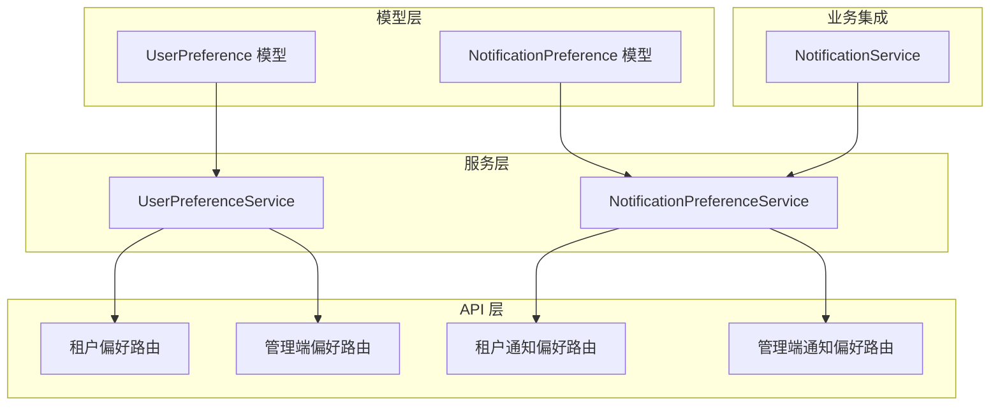
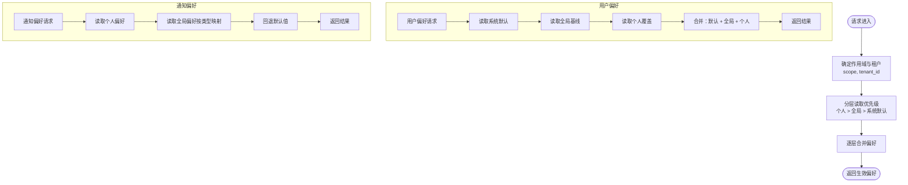
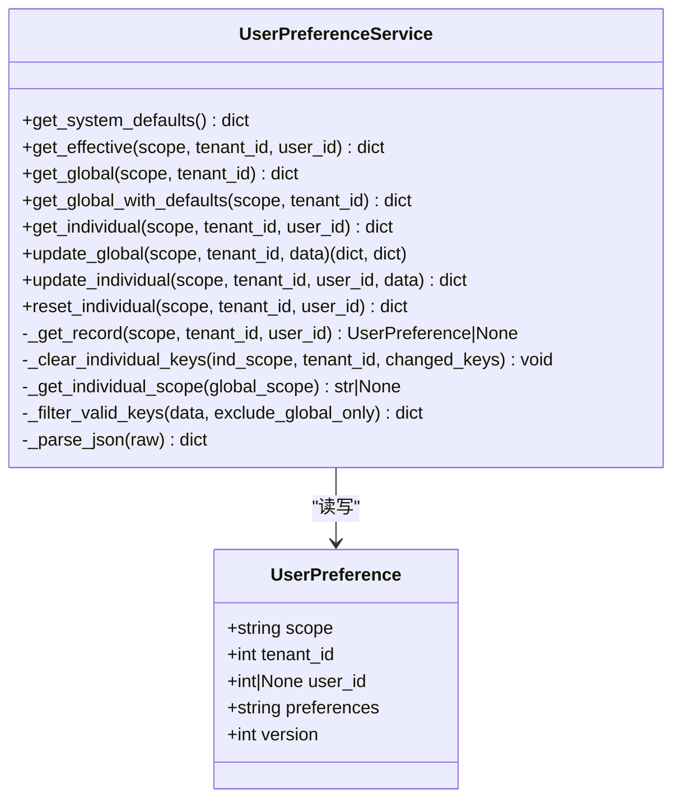
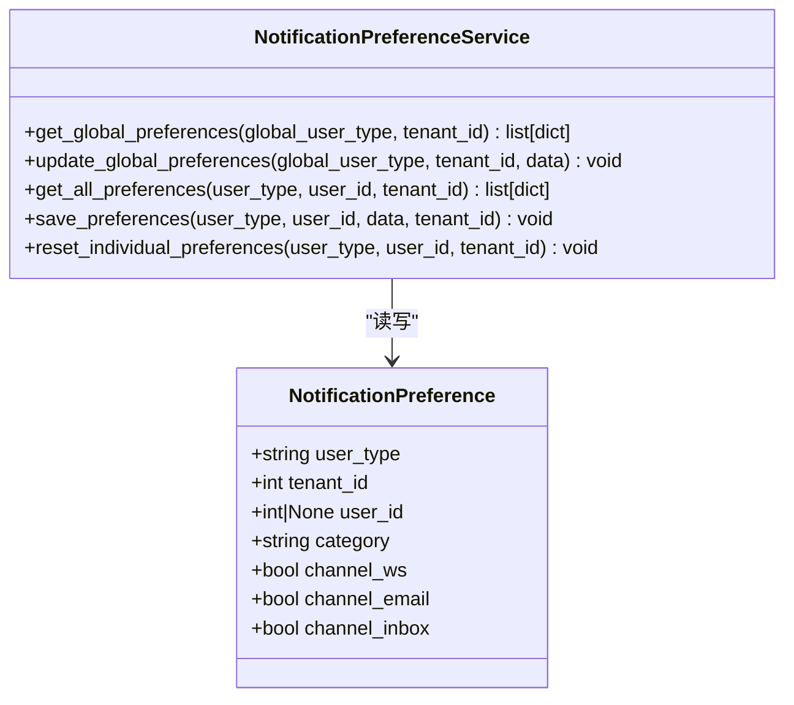
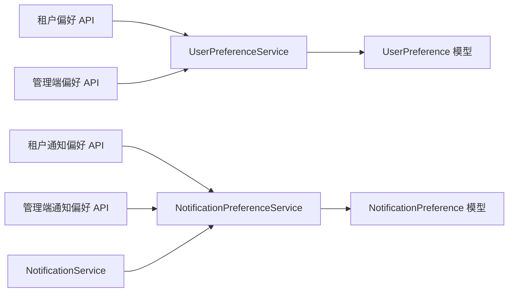

# 用户偏好服务

<cite>
**本文引用的文件**
- [backend/app/services/common/user_preference_service.py](file://backend/app/services/common/user_preference_service.py)
- [backend/app/services/common/notification_preference_service.py](file://backend/app/services/common/notification_preference_service.py)
- [backend/app/models/common/user_preference.py](file://backend/app/models/common/user_preference.py)
- [backend/app/models/common/notification_preference.py](file://backend/app/models/common/notification_preference.py)
- [backend/app/enums/role.py](file://backend/app/enums/role.py)
- [backend/app/api/tenant/preferences.py](file://backend/app/api/tenant/preferences.py)
- [backend/app/api/admin/preferences.py](file://backend/app/api/admin/preferences.py)
- [backend/app/api/tenant/notification_preferences.py](file://backend/app/api/tenant/notification_preferences.py)
- [backend/app/api/admin/notification_preferences.py](file://backend/app/api/admin/notification_preferences.py)
- [backend/app/services/common/notification_service.py](file://backend/app/services/common/notification_service.py)
- [backend/migrations/versions/20260314_0927_add_user_preferences_table.py](file://backend/migrations/versions/20260314_0927_add_user_preferences_table.py)
</cite>

## 目录
1. [简介](#简介)
2. [项目结构](#项目结构)
3. [核心组件](#核心组件)
4. [架构总览](#架构总览)
5. [详细组件分析](#详细组件分析)
6. [依赖关系分析](#依赖关系分析)
7. [性能考量](#性能考量)
8. [故障排查指南](#故障排查指南)
9. [结论](#结论)
10. [附录](#附录)

## 简介
本技术文档围绕“用户偏好服务”展开，系统性阐述两类偏好能力：
- 用户偏好设置：支持系统默认、全局基线与个人覆盖的三层分层合并，具备默认值管理、批量更新与权限控制。
- 通知偏好管理：支持按通知分类的渠道偏好（实时推送、站内信、邮件），并提供全局默认到个人覆盖的继承规则。

文档同时涵盖：
- 偏好数据模型与约束
- 分层继承策略与权限控制机制
- 与认证系统的集成方式与数据一致性保障
- API 接口说明、使用示例与扩展建议

## 项目结构
用户偏好服务主要由以下层次构成：
- 模型层：用户偏好与通知偏好的数据库映射
- 服务层：用户偏好服务与通知偏好服务，负责读取、合并、更新与清理
- API 层：面向租户与管理端的偏好与通知偏好接口
- 业务集成：通知服务在发送前统一查询用户通知偏好

图表来源
- [backend/app/models/common/user_preference.py:15-78](file://backend/app/models/common/user_preference.py#L15-L78)
- [backend/app/models/common/notification_preference.py:16-88](file://backend/app/models/common/notification_preference.py#L16-L88)
- [backend/app/services/common/user_preference_service.py:133-414](file://backend/app/services/common/user_preference_service.py#L133-L414)
- [backend/app/services/common/notification_preference_service.py:38-287](file://backend/app/services/common/notification_preference_service.py#L38-L287)
- [backend/app/api/tenant/preferences.py:1-200](file://backend/app/api/tenant/preferences.py#L1-L200)
- [backend/app/api/admin/preferences.py:1-200](file://backend/app/api/admin/preferences.py#L1-L200)
- [backend/app/api/tenant/notification_preferences.py:1-200](file://backend/app/api/tenant/notification_preferences.py#L1-L200)
- [backend/app/api/admin/notification_preferences.py:1-200](file://backend/app/api/admin/notification_preferences.py#L1-L200)
- [backend/app/services/common/notification_service.py:1-600](file://backend/app/services/common/notification_service.py#L1-L600)

章节来源
- [backend/app/models/common/user_preference.py:1-78](file://backend/app/models/common/user_preference.py#L1-L78)
- [backend/app/models/common/notification_preference.py:1-88](file://backend/app/models/common/notification_preference.py#L1-L88)
- [backend/app/services/common/user_preference_service.py:1-414](file://backend/app/services/common/user_preference_service.py#L1-L414)
- [backend/app/services/common/notification_preference_service.py:1-287](file://backend/app/services/common/notification_preference_service.py#L1-L287)
- [backend/app/api/tenant/preferences.py:1-200](file://backend/app/api/tenant/preferences.py#L1-L200)
- [backend/app/api/admin/preferences.py:1-200](file://backend/app/api/admin/preferences.py#L1-L200)
- [backend/app/api/tenant/notification_preferences.py:1-200](file://backend/app/api/tenant/notification_preferences.py#L1-L200)
- [backend/app/api/admin/notification_preferences.py:1-200](file://backend/app/api/admin/notification_preferences.py#L1-L200)
- [backend/app/services/common/notification_service.py:1-600](file://backend/app/services/common/notification_service.py#L1-L600)

## 核心组件
- 用户偏好服务（UserPreferenceService）
  - 提供系统默认、全局与个人三层合并读取
  - 支持全局更新并精确清理受影响的个人覆盖键
  - 支持个人覆盖更新与重置
- 通知偏好服务（NotificationPreferenceService）
  - 支持按通知分类的渠道偏好（WS/站内信/邮件）
  - 支持全局默认到个人覆盖的继承
  - 支持批量更新与个人偏好重置

章节来源
- [backend/app/services/common/user_preference_service.py:133-414](file://backend/app/services/common/user_preference_service.py#L133-L414)
- [backend/app/services/common/notification_preference_service.py:38-287](file://backend/app/services/common/notification_preference_service.py#L38-L287)

## 架构总览
用户偏好与通知偏好均采用“分层继承 + 权限隔离”的设计：
- 分层继承
  - 用户偏好：系统默认 → 全局基线 → 个人覆盖
  - 通知偏好：个人 → 全局（按用户类型映射）→ 默认值
- 权限隔离
  - 平台级与租户级分别维护独立的全局基线
  - 管理端与租户端分别维护独立的作用域
- 数据一致性
  - 全局更新时，对受影响的个人覆盖键进行精确清理，避免脏合并
  - 通过唯一约束确保同一作用域/租户/用户的偏好记录唯一

图表来源
- [backend/app/services/common/user_preference_service.py:143-166](file://backend/app/services/common/user_preference_service.py#L143-L166)
- [backend/app/services/common/notification_preference_service.py:168-225](file://backend/app/services/common/notification_preference_service.py#L168-L225)

## 详细组件分析

### 用户偏好服务（UserPreferenceService）
- 数据模型
  - 存储字段：scope、tenant_id、user_id、preferences（JSON）、version
  - 唯一约束：scope + tenant_id + user_id
- 分层策略
  - 系统默认：内置默认值集合
  - 全局基线：按 scope 与 tenant_id 查询
  - 个人覆盖：按 scope、tenant_id 与 user_id 查询
- 关键流程
  - 合并读取：系统默认 + 全局基线 + 个人覆盖
  - 全局更新：过滤合法键、计算变更键、更新全局记录、精确清理受影响的个人键
  - 个人更新：过滤全局专属键、更新个人记录
  - 重置个人：清空个人覆盖，返回全局默认

图表来源
- [backend/app/models/common/user_preference.py:15-78](file://backend/app/models/common/user_preference.py#L15-L78)
- [backend/app/services/common/user_preference_service.py:133-414](file://backend/app/services/common/user_preference_service.py#L133-L414)

章节来源
- [backend/app/models/common/user_preference.py:15-78](file://backend/app/models/common/user_preference.py#L15-L78)
- [backend/app/services/common/user_preference_service.py:133-414](file://backend/app/services/common/user_preference_service.py#L133-L414)

### 通知偏好服务（NotificationPreferenceService）
- 数据模型
  - 存储字段：user_type、tenant_id、user_id、category、channel_ws、channel_email、channel_inbox
  - 唯一约束：user_type + tenant_id + user_id + category
- 分类与默认
  - 通知分类：system、ai、task、biz、audit
  - 默认值：WS/站内信默认开启，邮件默认关闭
- 分层策略
  - 个人偏好优先；若不存在则回退到全局偏好（按 user_type 映射）；若仍不存在则使用默认值
- 关键流程
  - 全局更新：批量 upsert、记录变更分类、精确删除受影响的个人行
  - 个人读取：逐分类合并（个人 > 全局 > 默认）
  - 个人更新：批量 upsert
  - 重置个人：删除个人偏好记录，回退到全局默认

图表来源
- [backend/app/models/common/notification_preference.py:16-88](file://backend/app/models/common/notification_preference.py#L16-L88)
- [backend/app/services/common/notification_preference_service.py:38-287](file://backend/app/services/common/notification_preference_service.py#L38-L287)

章节来源
- [backend/app/models/common/notification_preference.py:16-88](file://backend/app/models/common/notification_preference.py#L16-L88)
- [backend/app/services/common/notification_preference_service.py:38-287](file://backend/app/services/common/notification_preference_service.py#L38-L287)

### 角色树与权限控制（概念性说明）
- 角色/组织架构
  - 定义了数据权限范围与节点类型，用于行级数据过滤与权限边界划分
- 与偏好服务的关系
  - 偏好服务本身不直接参与角色树遍历，但其作用域（scope、tenant_id、user_id）天然与 RBAC 的数据范围相契合
  - 在 API 层调用偏好服务时，应结合当前用户的身份与权限进行鉴权与范围校验

章节来源
- [backend/app/enums/role.py:11-47](file://backend/app/enums/role.py#L11-L47)

### 与认证系统集成与数据一致性
- 集成方式
  - API 层在处理偏好请求前进行身份与权限校验（租户/管理端维度）
  - 偏好服务通过作用域与租户 ID 限定可见范围
- 一致性保障
  - 全局更新后，针对变更键精确清理个人覆盖，避免“幽灵覆盖”
  - 通过唯一约束防止重复记录与并发冲突
  - 通知偏好更新时，按分类粒度 upsert，并在必要时删除受影响的个人行

章节来源
- [backend/app/services/common/user_preference_service.py:209-256](file://backend/app/services/common/user_preference_service.py#L209-L256)
- [backend/app/services/common/notification_preference_service.py:84-162](file://backend/app/services/common/notification_preference_service.py#L84-L162)

### API 接口与使用示例（概览）
- 租户偏好
  - GET /tenant/preferences/effective → 获取生效偏好（系统默认 + 全局 + 个人）
  - PUT /tenant/preferences/global → 更新全局偏好（返回完整全局与变更部分）
  - PUT /tenant/preferences/individual → 更新个人覆盖
  - DELETE /tenant/preferences/individual → 重置个人覆盖
- 管理端偏好
  - 类似租户端，作用于平台级全局基线
- 通知偏好
  - GET /tenant/notification-preferences/global → 获取全局通知偏好列表
  - PUT /tenant/notification-preferences/global → 更新全局通知偏好
  - GET /tenant/notification-preferences → 获取个人+全局+默认的合并结果
  - PUT /tenant/notification-preferences → 保存个人通知偏好
  - DELETE /tenant/notification-preferences → 重置个人通知偏好

章节来源
- [backend/app/api/tenant/preferences.py:1-200](file://backend/app/api/tenant/preferences.py#L1-L200)
- [backend/app/api/admin/preferences.py:1-200](file://backend/app/api/admin/preferences.py#L1-L200)
- [backend/app/api/tenant/notification_preferences.py:1-200](file://backend/app/api/tenant/notification_preferences.py#L1-L200)
- [backend/app/api/admin/notification_preferences.py:1-200](file://backend/app/api/admin/notification_preferences.py#L1-L200)

### 扩展指导
- 新增偏好键
  - 在系统默认集中补充键与默认值
  - 若为全局专属键，需在过滤逻辑中排除个人覆盖
- 新增通知分类
  - 在分类集合中新增类别，并在默认值中提供合理缺省
  - 在 API 层同步新增对应路由与校验
- 性能优化
  - 对常用查询建立索引（如 scope/tenant_id/user_id）
  - 批量更新时尽量减少事务次数，合并写入
- 安全加固
  - 在 API 层严格校验用户身份与目标租户
  - 对全局更新操作增加审计日志与变更追踪

## 依赖关系分析
- 服务与模型
  - UserPreferenceService 依赖 UserPreference 模型
  - NotificationPreferenceService 依赖 NotificationPreference 模型
- 服务与 API
  - API 路由调用对应服务方法，传递作用域、租户与用户信息
- 服务与通知
  - NotificationService 在发送通知前查询用户通知偏好，实现按用户偏好的渠道分发

图表来源
- [backend/app/api/tenant/preferences.py:1-200](file://backend/app/api/tenant/preferences.py#L1-L200)
- [backend/app/api/admin/preferences.py:1-200](file://backend/app/api/admin/preferences.py#L1-L200)
- [backend/app/api/tenant/notification_preferences.py:1-200](file://backend/app/api/tenant/notification_preferences.py#L1-L200)
- [backend/app/api/admin/notification_preferences.py:1-200](file://backend/app/api/admin/notification_preferences.py#L1-L200)
- [backend/app/services/common/user_preference_service.py:133-414](file://backend/app/services/common/user_preference_service.py#L133-L414)
- [backend/app/services/common/notification_preference_service.py:38-287](file://backend/app/services/common/notification_preference_service.py#L38-L287)
- [backend/app/services/common/notification_service.py:1-600](file://backend/app/services/common/notification_service.py#L1-L600)

章节来源
- [backend/app/services/common/user_preference_service.py:133-414](file://backend/app/services/common/user_preference_service.py#L133-L414)
- [backend/app/services/common/notification_preference_service.py:38-287](file://backend/app/services/common/notification_preference_service.py#L38-L287)
- [backend/app/services/common/notification_service.py:1-600](file://backend/app/services/common/notification_service.py#L1-L600)

## 性能考量
- 查询路径
  - 用户偏好：一次全局查询 + 一次个人查询，合并成本低
  - 通知偏好：个人查询 + 全局查询 + 默认回退，按分类循环
- 写入路径
  - 全局更新：先读取旧值，计算差异，再 upsert；对受影响的个人记录执行批量清理
  - 通知偏好：批量 upsert，必要时删除受影响的个人行
- 建议
  - 为常用查询字段建立索引
  - 批量更新时尽量减少数据库往返
  - 对高频读取场景考虑缓存（注意与全局版本号的失效策略配合）

## 故障排查指南
- 偏好未生效
  - 检查作用域与租户 ID 是否正确
  - 确认是否存在更高优先级的个人覆盖
- 全局更新后个人偏好异常
  - 核对变更键是否被精确清理
  - 检查唯一约束冲突或并发写入问题
- 通知偏好未按预期分发
  - 核对通知分类与渠道开关
  - 检查通知服务是否正确读取用户偏好

章节来源
- [backend/app/services/common/user_preference_service.py:209-256](file://backend/app/services/common/user_preference_service.py#L209-L256)
- [backend/app/services/common/notification_preference_service.py:84-162](file://backend/app/services/common/notification_preference_service.py#L84-L162)
- [backend/app/services/common/notification_service.py:500-560](file://backend/app/services/common/notification_service.py#L500-L560)

## 结论
用户偏好服务通过清晰的三层继承与严格的权限隔离，实现了灵活且一致的偏好管理。用户偏好服务提供系统默认、全局基线与个人覆盖的合并能力，并在全局更新时精确清理受影响的个人键；通知偏好服务以分类为单位提供渠道偏好继承与默认回退。二者共同支撑前端个性化体验与通知渠道策略的落地，同时与认证与权限系统协同，确保数据一致性与安全性。

## 附录

### 数据模型与约束
- 用户偏好表
  - 唯一键：scope + tenant_id + user_id
  - 字段：scope、tenant_id、user_id、preferences、version
- 通知偏好表
  - 唯一键：user_type + tenant_id + user_id + category
  - 字段：user_type、tenant_id、user_id、category、channel_ws、channel_email、channel_inbox

章节来源
- [backend/app/models/common/user_preference.py:25-78](file://backend/app/models/common/user_preference.py#L25-L78)
- [backend/app/models/common/notification_preference.py:27-88](file://backend/app/models/common/notification_preference.py#L27-L88)

### 默认值与有效键
- 用户偏好默认值
  - 包含外观、布局、导航、标签栏、小部件、页脚、语言、表格、日期时间、快捷键、动画等键集合
  - 全局专属键（如水印）不可在个人覆盖中设置
- 通知偏好默认值
  - 分类：system、ai、task、biz、audit
  - 默认：WS 与站内信开启，邮件关闭

章节来源
- [backend/app/services/common/user_preference_service.py:37-126](file://backend/app/services/common/user_preference_service.py#L37-L126)
- [backend/app/services/common/notification_preference_service.py:19-25](file://backend/app/services/common/notification_preference_service.py#L19-L25)

### 迁移与初始化
- 用户偏好表迁移
  - 创建 user_preferences 表，包含上述字段与唯一约束
- 通知偏好表迁移
  - 创建 notification_preferences 表，包含上述字段与唯一约束

章节来源
- [backend/migrations/versions/20260314_0927_add_user_preferences_table.py:1-60](file://backend/migrations/versions/20260314_0927_add_user_preferences_table.py#L1-L60)