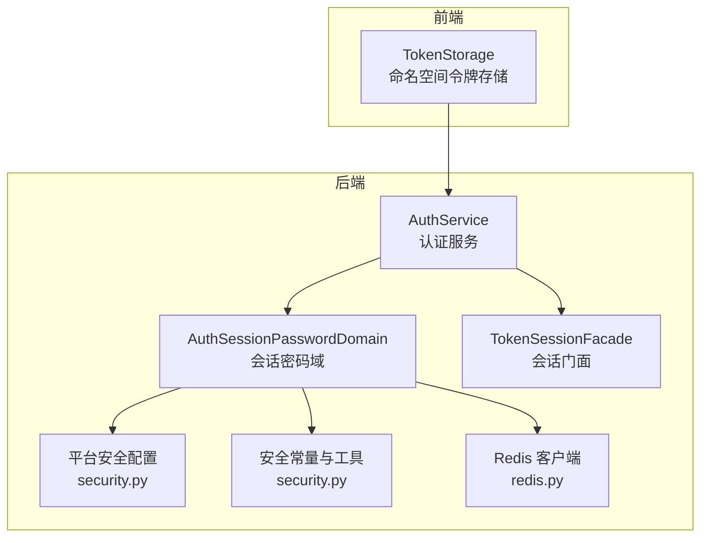
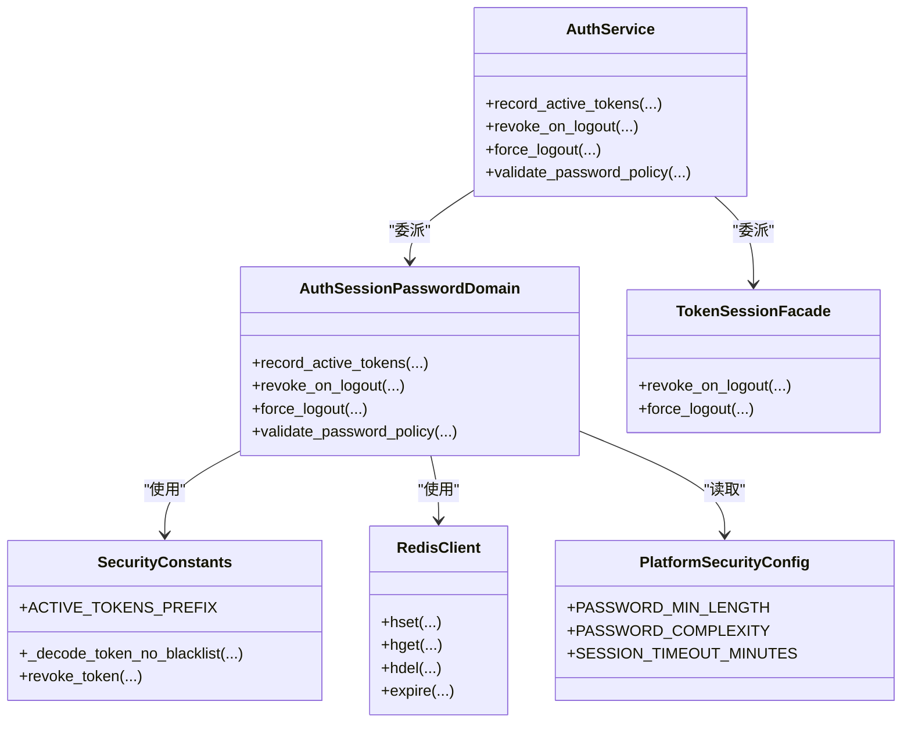
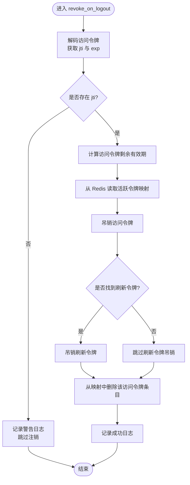
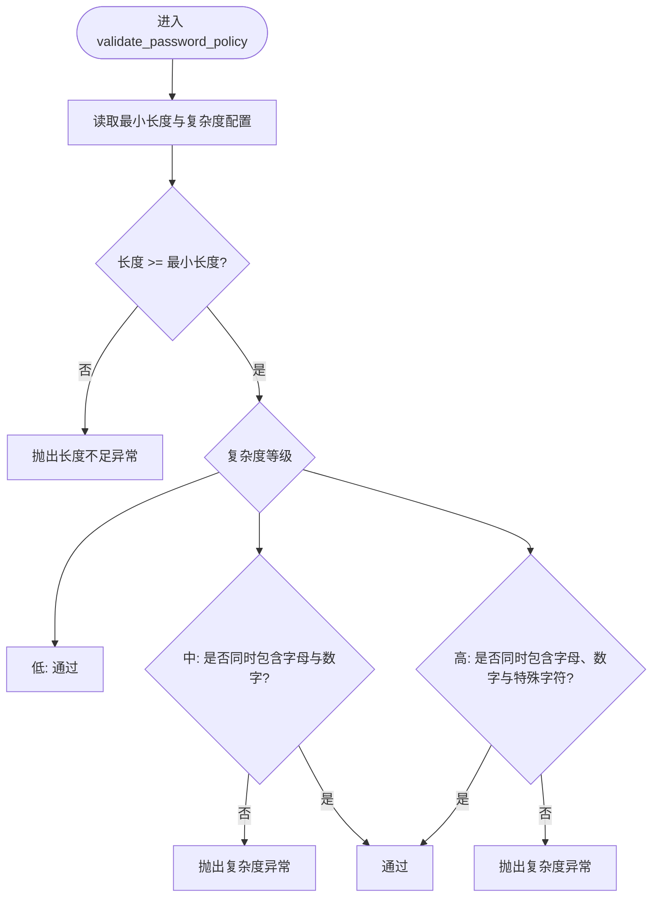
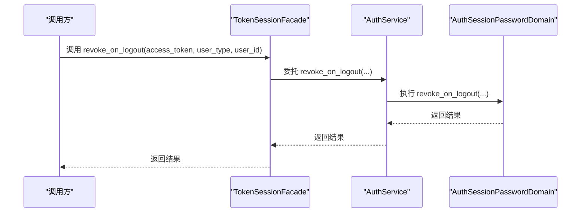
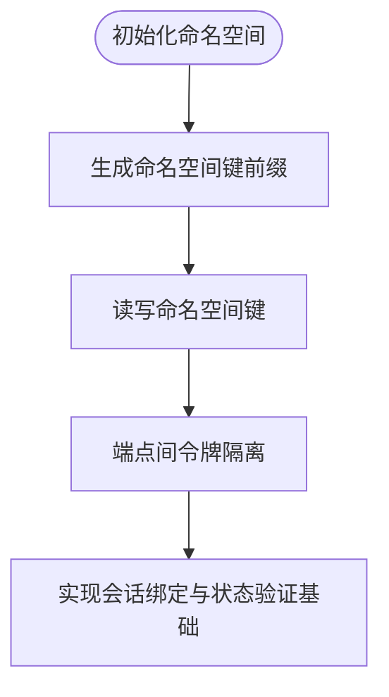
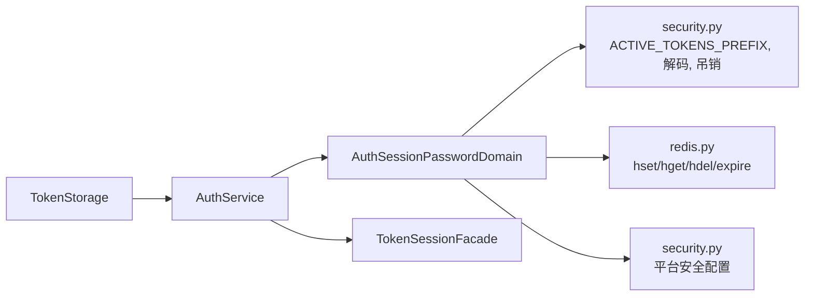

# 会话密码管理

<cite>
**本文引用的文件**
- [backend/app/services/common/auth_domains/session_password.py](file://backend/app/services/common/auth_domains/session_password.py)
- [backend/app/services/common/auth_service.py](file://backend/app/services/common/auth_service.py)
- [backend/app/services/common/auth_domains/facades.py](file://backend/app/services/common/auth_domains/facades.py)
- [backend/app/configs/definitions/platform/security.py](file://backend/app/configs/definitions/platform/security.py)
- [backend/app/core/config.py](file://backend/app/core/config.py)
- [backend/app/core/security.py](file://backend/app/core/security.py)
- [backend/app/core/redis.py](file://backend/app/core/redis.py)
- [backend/app/models/auth/admin.py](file://backend/app/models/auth/admin.py)
- [backend/app/models/auth/tenant_user.py](file://backend/app/models/auth/tenant_user.py)
- [backend/tests/services/test_force_logout.py](file://backend/tests/services/test_force_logout.py)
- [frontend/apps/web-antd/src/store/shared/token-storage.ts](file://frontend/apps/web-antd/src/store/shared/token-storage.ts)
- [frontend/apps/web-antd/src/store/shared/__tests__/token-storage.test.ts](file://frontend/apps/web-antd/src/store/shared/__tests__/token-storage.test.ts)
</cite>

## 目录
1. [简介](#简介)
2. [项目结构](#项目结构)
3. [核心组件](#核心组件)
4. [架构总览](#架构总览)
5. [详细组件分析](#详细组件分析)
6. [依赖关系分析](#依赖关系分析)
7. [性能考量](#性能考量)
8. [故障排查指南](#故障排查指南)
9. [结论](#结论)
10. [附录](#附录)

## 简介
本文件系统性阐述会话密码管理模块的设计与实现，覆盖以下关键主题：
- 会话密码的生成、存储与验证机制
- 会话密码的加密存储、过期管理与安全轮换策略
- 会话密码与用户会话的关联机制（会话绑定、状态验证、安全注销）
- 会话密码管理的API与实现（生成、验证、清理）
- 多设备登录与会话同步的安全考虑
- 配置项、安全策略与用户体验优化
- 部署配置、监控方法与安全最佳实践

## 项目结构
会话密码管理位于后端服务层，围绕认证服务与会话域展开，并通过Redis进行活跃令牌记录与清理。前端提供命名空间化的本地存储以隔离不同端点的令牌。

图表来源
- [backend/app/services/common/auth_service.py:138-187](file://backend/app/services/common/auth_service.py#L138-L187)
- [backend/app/services/common/auth_domains/session_password.py:20-92](file://backend/app/services/common/auth_domains/session_password.py#L20-L92)
- [backend/app/services/common/auth_domains/facades.py:13-33](file://backend/app/services/common/auth_domains/facades.py#L13-L33)
- [backend/app/configs/definitions/platform/security.py:28-71](file://backend/app/configs/definitions/platform/security.py#L28-L71)
- [backend/app/core/security.py:123](file://backend/app/core/security.py#L123)
- [backend/app/core/redis.py](file://backend/app/core/redis.py)
- [frontend/apps/web-antd/src/store/shared/token-storage.ts:71-111](file://frontend/apps/web-antd/src/store/shared/token-storage.ts#L71-L111)

章节来源
- [backend/app/services/common/auth_service.py:138-187](file://backend/app/services/common/auth_service.py#L138-L187)
- [backend/app/services/common/auth_domains/session_password.py:20-92](file://backend/app/services/common/auth_domains/session_password.py#L20-L92)
- [backend/app/services/common/auth_domains/facades.py:13-33](file://backend/app/services/common/auth_domains/facades.py#L13-L33)
- [backend/app/configs/definitions/platform/security.py:28-71](file://backend/app/configs/definitions/platform/security.py#L28-L71)
- [backend/app/core/security.py:123](file://backend/app/core/security.py#L123)
- [backend/app/core/redis.py](file://backend/app/core/redis.py)
- [frontend/apps/web-antd/src/store/shared/token-storage.ts:71-111](file://frontend/apps/web-antd/src/store/shared/token-storage.ts#L71-L111)

## 核心组件
- 会话密码域（AuthSessionPasswordDomain）：负责活跃令牌记录、注销时令牌吊销、强制登出与密码策略校验。
- 认证服务（AuthService）：对外暴露会话与密码管理接口，协调各子域。
- 会话门面（TokenSessionFacade）：封装注销与强制登出的调用入口。
- 平台安全配置：定义密码最小长度、复杂度、会话超时等策略。
- Redis：用于持久化活跃令牌映射与过期控制。
- 前端令牌存储（TokenStorage）：按端点命名空间存储访问令牌与刷新令牌，确保跨端隔离。

章节来源
- [backend/app/services/common/auth_domains/session_password.py:20-92](file://backend/app/services/common/auth_domains/session_password.py#L20-L92)
- [backend/app/services/common/auth_service.py:138-187](file://backend/app/services/common/auth_service.py#L138-L187)
- [backend/app/services/common/auth_domains/facades.py:13-33](file://backend/app/services/common/auth_domains/facades.py#L13-L33)
- [backend/app/configs/definitions/platform/security.py:28-71](file://backend/app/configs/definitions/platform/security.py#L28-L71)
- [backend/app/core/redis.py](file://backend/app/core/redis.py)
- [frontend/apps/web-antd/src/store/shared/token-storage.ts:71-111](file://frontend/apps/web-antd/src/store/shared/token-storage.ts#L71-L111)

## 架构总览
会话密码管理采用“服务-域-基础设施”的分层设计：
- 服务层：AuthService统一对外提供API，内部委派给会话密码域与登录安全域。
- 域层：AuthSessionPasswordDomain处理令牌生命周期与密码策略。
- 基础设施：Redis用于活跃令牌映射；安全常量与工具提供前缀、解码与吊销能力；配置提供策略参数。

图表来源
- [backend/app/services/common/auth_service.py:138-187](file://backend/app/services/common/auth_service.py#L138-L187)
- [backend/app/services/common/auth_domains/session_password.py:20-92](file://backend/app/services/common/auth_domains/session_password.py#L20-L92)
- [backend/app/services/common/auth_domains/facades.py:13-33](file://backend/app/services/common/auth_domains/facades.py#L13-L33)
- [backend/app/core/security.py:123](file://backend/app/core/security.py#L123)
- [backend/app/core/redis.py](file://backend/app/core/redis.py)
- [backend/app/configs/definitions/platform/security.py:28-71](file://backend/app/configs/definitions/platform/security.py#L28-L71)

## 详细组件分析

### 会话密码域（AuthSessionPasswordDomain）
职责与流程
- 活跃令牌记录：将用户类型的活跃访问令牌JTI映射到对应的刷新令牌JTI，并设置键过期时间。
- 注销时令牌吊销：解析访问令牌载荷，若存在JTI则吊销访问令牌与可能存在的刷新令牌，并从活跃映射中移除。
- 强制登出：触发Socket通知与Presence离线，清理活跃令牌映射。
- 密码策略校验：依据平台配置校验密码长度与复杂度。

图表来源
- [backend/app/services/common/auth_domains/session_password.py:42-84](file://backend/app/services/common/auth_domains/session_password.py#L42-L84)

章节来源
- [backend/app/services/common/auth_domains/session_password.py:26-40](file://backend/app/services/common/auth_domains/session_password.py#L26-L40)
- [backend/app/services/common/auth_domains/session_password.py:42-84](file://backend/app/services/common/auth_domains/session_password.py#L42-L84)
- [backend/app/services/common/auth_domains/session_password.py:85-92](file://backend/app/services/common/auth_domains/session_password.py#L85-L92)

### 密码策略校验
- 最小长度：从平台配置读取默认值或显式传入。
- 复杂度等级：
  - 低：仅长度要求
  - 中：必须包含字母与数字
  - 高：必须包含字母、数字与特殊字符
- 不满足条件时抛出业务异常，阻止密码设置或变更。

图表来源
- [backend/app/services/common/auth_domains/session_password.py:166-193](file://backend/app/services/common/auth_domains/session_password.py#L166-L193)
- [backend/app/configs/definitions/platform/security.py:28-71](file://backend/app/configs/definitions/platform/security.py#L28-L71)

章节来源
- [backend/app/services/common/auth_domains/session_password.py:166-193](file://backend/app/services/common/auth_domains/session_password.py#L166-L193)
- [backend/app/configs/definitions/platform/security.py:28-71](file://backend/app/configs/definitions/platform/security.py#L28-L71)

### 认证服务与门面
- AuthService对外提供统一API，内部委派至会话密码域与登录安全域。
- TokenSessionFacade简化外部调用，统一注销与强制登出流程。

图表来源
- [backend/app/services/common/auth_domains/facades.py:19-25](file://backend/app/services/common/auth_domains/facades.py#L19-L25)
- [backend/app/services/common/auth_service.py:152-158](file://backend/app/services/common/auth_service.py#L152-L158)
- [backend/app/services/common/auth_domains/session_password.py:42-84](file://backend/app/services/common/auth_domains/session_password.py#L42-L84)

章节来源
- [backend/app/services/common/auth_service.py:138-187](file://backend/app/services/common/auth_service.py#L138-L187)
- [backend/app/services/common/auth_domains/facades.py:13-33](file://backend/app/services/common/auth_domains/facades.py#L13-L33)

### 前端令牌存储与会话绑定
- 命名空间隔离：按端点（admin/tenant/user）区分令牌键，避免跨端污染。
- 初始化前的行为：未初始化命名空间时，对“裸键”（如 admin_token）不进行读写。
- 初始化后的行为：仅对命名空间键进行读写，保证会话绑定与安全隔离。

图表来源
- [frontend/apps/web-antd/src/store/shared/token-storage.ts:71-111](file://frontend/apps/web-antd/src/store/shared/token-storage.ts#L71-L111)
- [frontend/apps/web-antd/src/store/shared/__tests__/token-storage.test.ts:1-51](file://frontend/apps/web-antd/src/store/shared/__tests__/token-storage.test.ts#L1-51)

章节来源
- [frontend/apps/web-antd/src/store/shared/token-storage.ts:71-111](file://frontend/apps/web-antd/src/store/shared/token-storage.ts#L71-L111)
- [frontend/apps/web-antd/src/store/shared/__tests__/token-storage.test.ts:1-51](file://frontend/apps/web-antd/src/store/shared/__tests__/token-storage.test.ts#L1-51)

## 依赖关系分析
- 会话密码域依赖：
  - 安全常量与工具：ACTIVE_TOKENS_PREFIX、令牌解码与吊销函数
  - Redis客户端：哈希表存储活跃令牌映射与过期控制
  - 平台安全配置：密码策略与会话超时
- 认证服务与门面：
  - 作为上层入口，协调域与基础设施交互
- 前端令牌存储：
  - 与后端Redis活跃映射配合，实现会话绑定与状态验证

图表来源
- [backend/app/services/common/auth_domains/session_password.py:9-13](file://backend/app/services/common/auth_domains/session_password.py#L9-L13)
- [backend/app/core/security.py:123](file://backend/app/core/security.py#L123)
- [backend/app/core/redis.py](file://backend/app/core/redis.py)
- [backend/app/configs/definitions/platform/security.py:28-71](file://backend/app/configs/definitions/platform/security.py#L28-L71)
- [backend/app/services/common/auth_service.py:138-187](file://backend/app/services/common/auth_service.py#L138-L187)
- [backend/app/services/common/auth_domains/facades.py:13-33](file://backend/app/services/common/auth_domains/facades.py#L13-L33)
- [frontend/apps/web-antd/src/store/shared/token-storage.ts:71-111](file://frontend/apps/web-antd/src/store/shared/token-storage.ts#L71-L111)

章节来源
- [backend/app/services/common/auth_domains/session_password.py:9-13](file://backend/app/services/common/auth_domains/session_password.py#L9-L13)
- [backend/app/core/security.py:123](file://backend/app/core/security.py#L123)
- [backend/app/core/redis.py](file://backend/app/core/redis.py)
- [backend/app/configs/definitions/platform/security.py:28-71](file://backend/app/configs/definitions/platform/security.py#L28-L71)
- [backend/app/services/common/auth_service.py:138-187](file://backend/app/services/common/auth_service.py#L138-L187)
- [backend/app/services/common/auth_domains/facades.py:13-33](file://backend/app/services/common/auth_domains/facades.py#L13-L33)
- [frontend/apps/web-antd/src/store/shared/token-storage.ts:71-111](file://frontend/apps/web-antd/src/store/shared/token-storage.ts#L71-L111)

## 性能考量
- Redis哈希表存储：O(1)的hset/hget/hdel操作，适合高频的活跃令牌记录与清理。
- 过期策略：基于REFRESH_TOKEN_EXPIRE_DAYS设置键级TTL，降低内存占用与查询压力。
- 令牌吊销：按需吊销访问与刷新令牌，避免不必要的网络往返。
- 前端命名空间：减少localStorage键冲突与误读写，提升会话绑定效率。

## 故障排查指南
常见问题与定位建议
- 注销失败或未生效
  - 检查访问令牌是否包含jti；若缺失将记录警告并跳过注销。
  - 核查Redis连接与活跃映射键是否存在。
  - 关注吊销异常日志，确认revoke_token调用是否成功。
- 强制登出未触发
  - 确认PresenceManager.set_offline与emit_force_logout调用链是否执行。
  - 检查租户维度参数传递是否正确。
- 密码设置被拒绝
  - 对照平台配置的最小长度与复杂度等级，逐项检查密码是否满足要求。
- 前端令牌未按预期隔离
  - 确认TokenStorage已初始化命名空间；未初始化前不应读写“裸键”。

章节来源
- [backend/app/services/common/auth_domains/session_password.py:48-56](file://backend/app/services/common/auth_domains/session_password.py#L48-L56)
- [backend/app/services/common/auth_domains/session_password.py:76-83](file://backend/app/services/common/auth_domains/session_password.py#L76-L83)
- [backend/tests/services/test_force_logout.py:90-112](file://backend/tests/services/test_force_logout.py#L90-L112)
- [frontend/apps/web-antd/src/store/shared/__tests__/token-storage.test.ts:1-51](file://frontend/apps/web-antd/src/store/shared/__tests__/token-storage.test.ts#L1-51)

## 结论
会话密码管理模块通过明确的分层设计与Redis持久化，实现了活跃令牌的可靠记录与注销时的完整吊销，结合平台安全配置提供了可配置的密码策略。前端命名空间令牌存储进一步强化了会话绑定与跨端隔离。整体方案兼顾安全性、可维护性与用户体验。

## 附录

### API与实现概览
- 会话密码域
  - 记录活跃令牌：record_active_tokens(user_type, user_id, access_jti, refresh_jti)
  - 注销时吊销：revoke_on_logout(access_token, user_type, user_id)
  - 强制登出：force_logout(user_type, user_id, tenant_id)
  - 密码策略校验：validate_password_policy(password, tenant_id)
- 会话门面
  - 注销：revoke_on_logout(access_token, user_type, user_id)
  - 强制登出：force_logout(user_type, user_id, tenant_id)
- 认证服务
  - 统一委派上述能力，供上层控制器调用

章节来源
- [backend/app/services/common/auth_domains/session_password.py:26-40](file://backend/app/services/common/auth_domains/session_password.py#L26-L40)
- [backend/app/services/common/auth_domains/session_password.py:42-84](file://backend/app/services/common/auth_domains/session_password.py#L42-L84)
- [backend/app/services/common/auth_domains/session_password.py:85-92](file://backend/app/services/common/auth_domains/session_password.py#L85-L92)
- [backend/app/services/common/auth_domains/facades.py:19-33](file://backend/app/services/common/auth_domains/facades.py#L19-L33)
- [backend/app/services/common/auth_service.py:138-187](file://backend/app/services/common/auth_service.py#L138-L187)

### 配置项与安全策略
- 密码策略
  - 密码最小长度：platform.security.PASSWORD_MIN_LENGTH
  - 密码复杂度：platform.security.PASSWORD_COMPLEXITY（low/medium/high）
- 会话策略
  - 会话超时（分钟）：platform.security.SESSION_TIMEOUT_MINUTES
- 令牌与过期
  - 刷新令牌过期天数：core.config.REFRESH_TOKEN_EXPIRE_DAYS
  - 活跃令牌前缀：core.security.ACTIVE_TOKENS_PREFIX

章节来源
- [backend/app/configs/definitions/platform/security.py:28-71](file://backend/app/configs/definitions/platform/security.py#L28-L71)
- [backend/app/configs/definitions/platform/security.py:214-236](file://backend/app/configs/definitions/platform/security.py#L214-L236)
- [backend/app/core/config.py:66](file://backend/app/core/config.py#L66)
- [backend/app/core/security.py:123](file://backend/app/core/security.py#L123)

### 多设备登录与会话同步
- 会话绑定：通过Redis哈希表记录每个用户类型的活跃令牌映射，支持按用户维度进行精确控制。
- 会话同步：结合Presence与Socket桥接，强制登出时可向其他端点广播，实现跨设备同步下线。
- 安全考虑：令牌吊销与过期策略共同作用，防止旧令牌在多设备场景下的滥用。

章节来源
- [backend/app/services/common/auth_domains/session_password.py:34-40](file://backend/app/services/common/auth_domains/session_password.py#L34-L40)
- [backend/app/services/common/auth_domains/session_password.py:91-92](file://backend/app/services/common/auth_domains/session_password.py#L91-L92)

### 部署配置、监控与最佳实践
- 部署配置
  - Redis：确保可用性与持久化策略，合理设置键TTL与内存上限。
  - 平台安全配置：根据合规要求调整密码最小长度与复杂度等级。
- 监控方法
  - 认证日志：关注注销成功/失败、警告事件，定位异常路径。
  - Redis指标：监控活跃令牌映射规模与命中率。
- 安全最佳实践
  - 严格启用jti校验，避免无jti令牌的注销风险。
  - 合理设置会话超时与刷新过期天数，平衡安全与体验。
  - 前端命名空间初始化后方可进行令牌读写，避免“裸键”污染。