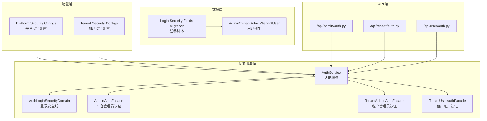
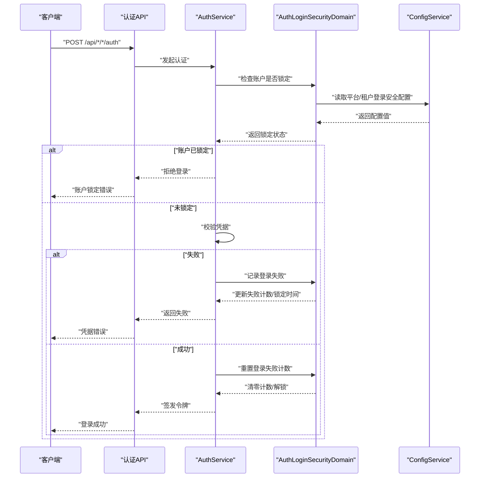
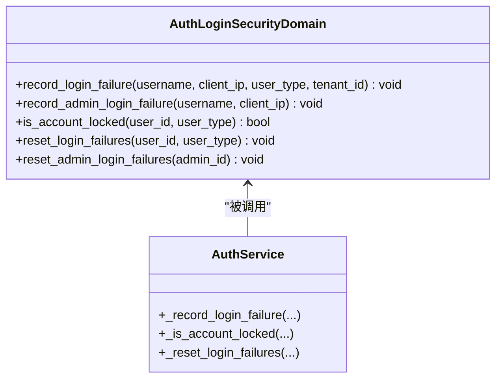
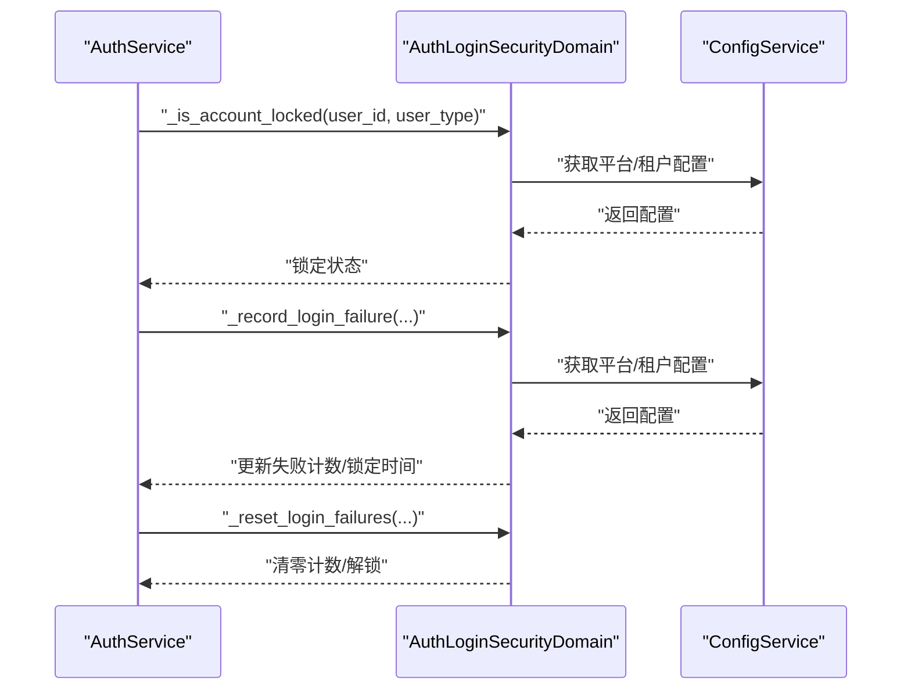
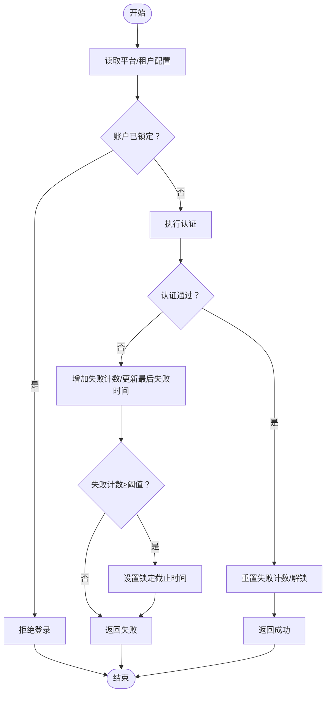
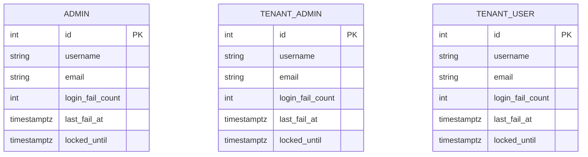
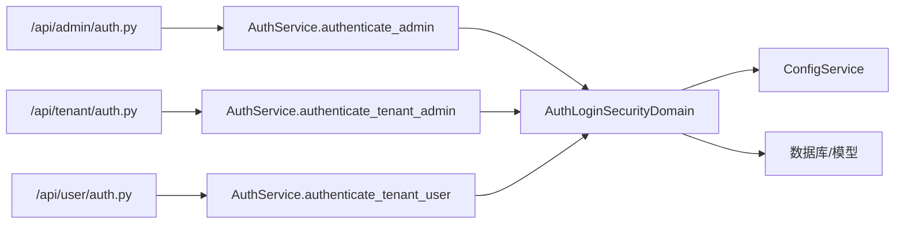

# 登录安全策略

<cite>
**本文引用的文件**
- [backend/app/services/common/auth_domains/login_security.py](file://backend/app/services/common/auth_domains/login_security.py)
- [backend/app/services/common/auth_service.py](file://backend/app/services/common/auth_service.py)
- [backend/app/configs/definitions/platform/security.py](file://backend/app/configs/definitions/platform/security.py)
- [backend/app/configs/definitions/tenant/security.py](file://backend/app/configs/definitions/tenant/security.py)
- [backend/migrations/versions/20260123_0006_add_login_security_fields.py](file://backend/migrations/versions/20260123_0006_add_login_security_fields.py)
- [backend/app/services/common/auth_domains/admin_auth.py](file://backend/app/services/common/auth_domains/admin_auth.py)
- [backend/app/services/common/auth_domains/tenant_admin_auth.py](file://backend/app/services/common/auth_domains/tenant_admin_auth.py)
- [backend/app/services/common/auth_domains/tenant_user_login.py](file://backend/app/services/common/auth_domains/tenant_user_login.py)
- [backend/app/services/common/auth_domains/tenant_user_login_code.py](file://backend/app/services/common/auth_domains/tenant_user_login_code.py)
- [backend/app/api/admin/auth.py](file://backend/app/api/admin/auth.py)
- [backend/app/api/tenant/auth.py](file://backend/app/api/tenant/auth.py)
- [backend/app/api/user/auth.py](file://backend/app/api/user/auth.py)
- [backend/app/schemas/common/auth.py](file://backend/app/schemas/common/auth.py)
- [backend/app/core/security.py](file://backend/app/core/security.py)
- [backend/app/core/logging.py](file://backend/app/core/logging.py)
- [backend/app/core/redis.py](file://backend/app/core/redis.py)
- [backend/app/core/database.py](file://backend/app/core/database.py)
</cite>

## 目录
1. [简介](#简介)
2. [项目结构](#项目结构)
3. [核心组件](#核心组件)
4. [架构总览](#架构总览)
5. [详细组件分析](#详细组件分析)
6. [依赖分析](#依赖分析)
7. [性能考量](#性能考量)
8. [故障排查指南](#故障排查指南)
9. [结论](#结论)
10. [附录](#附录)

## 简介
本文件系统性阐述登录安全策略模块的设计与实现，涵盖登录尝试限制、账户锁定策略、IP 地址监控与异常登录检测的机制与配置。文档重点说明以下方面：
- 登录安全策略的配置参数与触发条件：失败次数上限、时间窗口、自动解锁机制
- 登录安全相关的 API 与中间件实现：登录安全检查中间件、账户状态验证、安全事件记录
- 登录安全策略与认证流程的集成方式与安全边界
- 登录安全策略的配置选项、监控指标与告警机制
- 部署建议、性能考虑与安全最佳实践

## 项目结构
登录安全策略位于后端服务层，围绕认证服务与领域模型展开，主要涉及以下模块：
- 认证服务：统一编排登录安全域、会话域、日志域等
- 登录安全域：负责失败计数、锁定判断与重置
- 配置定义：平台级与租户级登录安全参数
- 数据迁移：为三类用户表增加登录安全字段
- 认证域：在各用户类型的认证流程中调用登录安全域
- API 层：对外暴露登录接口，并在认证过程中执行安全检查

图表来源
- [backend/app/services/common/auth_service.py:46-79](file://backend/app/services/common/auth_service.py#L46-L79)
- [backend/app/services/common/auth_domains/login_security.py:15-20](file://backend/app/services/common/auth_domains/login_security.py#L15-L20)
- [backend/app/configs/definitions/platform/security.py:98-131](file://backend/app/configs/definitions/platform/security.py#L98-L131)
- [backend/app/configs/definitions/tenant/security.py:108-136](file://backend/app/configs/definitions/tenant/security.py#L108-L136)
- [backend/migrations/versions/20260123_0006_add_login_security_fields.py:27-91](file://backend/migrations/versions/20260123_0006_add_login_security_fields.py#L27-L91)
- [backend/app/api/admin/auth.py](file://backend/app/api/admin/auth.py)
- [backend/app/api/tenant/auth.py](file://backend/app/api/tenant/auth.py)
- [backend/app/api/user/auth.py](file://backend/app/api/user/auth.py)

章节来源
- [backend/app/services/common/auth_service.py:46-79](file://backend/app/services/common/auth_service.py#L46-L79)
- [backend/app/services/common/auth_domains/login_security.py:15-20](file://backend/app/services/common/auth_domains/login_security.py#L15-L20)
- [backend/app/configs/definitions/platform/security.py:98-131](file://backend/app/configs/definitions/platform/security.py#L98-L131)
- [backend/app/configs/definitions/tenant/security.py:108-136](file://backend/app/configs/definitions/tenant/security.py#L108-L136)
- [backend/migrations/versions/20260123_0006_add_login_security_fields.py:27-91](file://backend/migrations/versions/20260123_0006_add_login_security_fields.py#L27-L91)

## 核心组件
- 登录安全域（AuthLoginSecurityDomain）：封装登录失败计数、锁定判断与重置逻辑，支持平台级与租户级配置
- 认证服务（AuthService）：在认证流程中调用登录安全域，完成失败记录、锁定检查与成功后的失败计数清零
- 配置定义：平台级与租户级登录安全参数，包括最大失败次数、锁定时长、验证码开关等
- 数据迁移：为管理员、租户管理员、租户用户三类表增加登录安全字段
- 认证域：在平台管理员、租户管理员、租户用户认证流程中集成登录安全检查

章节来源
- [backend/app/services/common/auth_domains/login_security.py:15-152](file://backend/app/services/common/auth_domains/login_security.py#L15-L152)
- [backend/app/services/common/auth_service.py:46-214](file://backend/app/services/common/auth_service.py#L46-L214)
- [backend/app/configs/definitions/platform/security.py:98-131](file://backend/app/configs/definitions/platform/security.py#L98-L131)
- [backend/app/configs/definitions/tenant/security.py:108-136](file://backend/app/configs/definitions/tenant/security.py#L108-L136)
- [backend/migrations/versions/20260123_0006_add_login_security_fields.py:27-91](file://backend/migrations/versions/20260123_0006_add_login_security_fields.py#L27-L91)

## 架构总览
登录安全策略与认证流程的集成路径如下：
- API 层接收登录请求，解析用户名、密码、验证码等参数
- 认证服务在认证前检查账户是否被锁定
- 认证失败时调用登录安全域记录失败并可能触发锁定
- 认证成功时调用登录安全域重置失败计数
- 配置服务根据平台或租户级别读取登录安全参数

图表来源
- [backend/app/api/admin/auth.py](file://backend/app/api/admin/auth.py)
- [backend/app/api/tenant/auth.py](file://backend/app/api/tenant/auth.py)
- [backend/app/api/user/auth.py](file://backend/app/api/user/auth.py)
- [backend/app/services/common/auth_service.py:175-214](file://backend/app/services/common/auth_service.py#L175-L214)
- [backend/app/services/common/auth_domains/login_security.py:21-84](file://backend/app/services/common/auth_domains/login_security.py#L21-L84)
- [backend/app/configs/service.py](file://backend/app/configs/service.py)

## 详细组件分析

### 组件一：登录安全域（AuthLoginSecurityDomain）
职责与行为
- 记录登录失败：根据用户类型与租户上下文读取平台或租户配置，更新失败计数、最后失败时间与锁定截止时间
- 账户锁定检查：查询用户锁定截止时间并与当前时间比较，判断是否处于锁定状态
- 失败计数重置：登录成功或管理员手动干预后，清空失败计数、最后失败时间与锁定截止时间

关键实现要点
- 支持三种用户类型：平台管理员、租户管理员、租户用户
- 租户上下文下优先使用租户配置，否则回退到平台配置
- 锁定截止时间基于“当前时间 + 锁定时长”计算
- 锁定判断以“当前时间早于锁定截止时间”为准

图表来源
- [backend/app/services/common/auth_domains/login_security.py:15-152](file://backend/app/services/common/auth_domains/login_security.py#L15-L152)
- [backend/app/services/common/auth_service.py:175-214](file://backend/app/services/common/auth_service.py#L175-L214)

章节来源
- [backend/app/services/common/auth_domains/login_security.py:21-152](file://backend/app/services/common/auth_domains/login_security.py#L21-L152)
- [backend/app/services/common/auth_service.py:175-214](file://backend/app/services/common/auth_service.py#L175-L214)

### 组件二：认证服务（AuthService）与登录安全域集成
职责与行为
- 在认证入口处调用登录安全域进行锁定检查
- 认证失败时记录失败并可能触发锁定
- 认证成功时重置失败计数
- 通过配置服务动态读取平台/租户级登录安全参数

关键集成点
- 认证前检查：_is_account_locked
- 认证失败记录：_record_login_failure/_record_admin_login_failure
- 成功后重置：_reset_login_failures/_reset_admin_login_failures

图表来源
- [backend/app/services/common/auth_service.py:175-214](file://backend/app/services/common/auth_service.py#L175-L214)
- [backend/app/services/common/auth_domains/login_security.py:21-84](file://backend/app/services/common/auth_domains/login_security.py#L21-L84)

章节来源
- [backend/app/services/common/auth_service.py:175-214](file://backend/app/services/common/auth_service.py#L175-L214)
- [backend/app/services/common/auth_domains/login_security.py:21-84](file://backend/app/services/common/auth_domains/login_security.py#L21-L84)

### 组件三：配置参数与触发条件
平台级配置（平台管理员/租户管理员/租户用户通用）
- 最大失败次数（login_max_attempts）：超过该次数将触发锁定
- 锁定时长（login_lockout_minutes）：锁定持续时间，到期自动解锁
- 验证码开关（login_captcha_enabled）：登录时是否强制验证码

租户级配置（仅对租户管理员/租户用户生效）
- 最大失败次数（tenant_login_max_attempts）
- 锁定时长（tenant_login_lockout_minutes）

触发条件
- 失败计数达到阈值即锁定
- 锁定截止时间晚于当前时间则视为锁定
- 解锁条件：超过锁定截止时间或管理员手动重置

图表来源
- [backend/app/configs/definitions/platform/security.py:98-131](file://backend/app/configs/definitions/platform/security.py#L98-L131)
- [backend/app/configs/definitions/tenant/security.py:108-136](file://backend/app/configs/definitions/tenant/security.py#L108-L136)
- [backend/app/services/common/auth_domains/login_security.py:78-83](file://backend/app/services/common/auth_domains/login_security.py#L78-L83)

章节来源
- [backend/app/configs/definitions/platform/security.py:98-131](file://backend/app/configs/definitions/platform/security.py#L98-L131)
- [backend/app/configs/definitions/tenant/security.py:108-136](file://backend/app/configs/definitions/tenant/security.py#L108-L136)
- [backend/app/services/common/auth_domains/login_security.py:78-83](file://backend/app/services/common/auth_domains/login_security.py#L78-L83)

### 组件四：数据库模型与迁移
迁移脚本为三类用户表新增登录安全字段：
- login_fail_count：登录失败次数，默认 0
- last_fail_at：最后登录失败时间（可为空）
- locked_until：账户锁定截止时间（可为空）

图表来源
- [backend/migrations/versions/20260123_0006_add_login_security_fields.py:27-91](file://backend/migrations/versions/20260123_0006_add_login_security_fields.py#L27-L91)

章节来源
- [backend/migrations/versions/20260123_0006_add_login_security_fields.py:27-91](file://backend/migrations/versions/20260123_0006_add_login_security_fields.py#L27-L91)

### 组件五：认证流程中的安全检查与 API 集成
- 平台管理员认证：在认证前检查锁定状态，失败时记录失败，成功时重置
- 租户管理员认证：同上，支持租户级配置
- 租户用户认证：支持密码与验证码两种登录方式，均集成安全检查
- API 层：对外暴露登录接口，内部调用认证服务完成安全检查与令牌签发

章节来源
- [backend/app/services/common/auth_domains/admin_auth.py:109-117](file://backend/app/services/common/auth_domains/admin_auth.py#L109-L117)
- [backend/app/services/common/auth_domains/tenant_admin_auth.py:195-204](file://backend/app/services/common/auth_domains/tenant_admin_auth.py#L195-L204)
- [backend/app/services/common/auth_domains/tenant_user_login.py:106-115](file://backend/app/services/common/auth_domains/tenant_user_login.py#L106-L115)
- [backend/app/services/common/auth_domains/tenant_user_login_code.py:323-324](file://backend/app/services/common/auth_domains/tenant_user_login_code.py#L323-L324)
- [backend/app/api/admin/auth.py](file://backend/app/api/admin/auth.py)
- [backend/app/api/tenant/auth.py](file://backend/app/api/tenant/auth.py)
- [backend/app/api/user/auth.py](file://backend/app/api/user/auth.py)

## 依赖分析
- 认证服务依赖登录安全域与配置服务，形成“认证决策 → 安全检查 → 配置读取”的链路
- 登录安全域依赖数据库访问与配置服务，用于更新用户状态与读取阈值
- API 层依赖认证服务，认证服务再依赖登录安全域与配置服务

图表来源
- [backend/app/api/admin/auth.py](file://backend/app/api/admin/auth.py)
- [backend/app/api/tenant/auth.py](file://backend/app/api/tenant/auth.py)
- [backend/app/api/user/auth.py](file://backend/app/api/user/auth.py)
- [backend/app/services/common/auth_service.py:301-444](file://backend/app/services/common/auth_service.py#L301-L444)
- [backend/app/services/common/auth_domains/login_security.py:15-20](file://backend/app/services/common/auth_domains/login_security.py#L15-L20)

章节来源
- [backend/app/services/common/auth_service.py:301-444](file://backend/app/services/common/auth_service.py#L301-L444)
- [backend/app/services/common/auth_domains/login_security.py:15-20](file://backend/app/services/common/auth_domains/login_security.py#L15-L20)

## 性能考量
- 查询与写入开销：每次失败记录与锁定检查均为单行读写，复杂度低；建议在用户主键上建立索引以优化查询
- 配置读取缓存：可通过配置服务的缓存机制减少重复读取配置带来的开销
- 并发控制：在高并发场景下，失败计数更新与锁定截止时间设置应确保原子性，避免竞态条件
- 日志与审计：登录安全事件需纳入统一日志体系，避免过多 I/O 压力

## 故障排查指南
常见问题与处理
- 账户被误锁：确认锁定截止时间是否正确，必要时通过管理员接口重置失败计数
- 配置不生效：核对平台/租户配置项是否正确下发，以及认证流程是否按租户上下文读取配置
- 锁定判断异常：检查当前时间与时区处理，确保比较基准一致

章节来源
- [backend/app/services/common/auth_domains/login_security.py:96-121](file://backend/app/services/common/auth_domains/login_security.py#L96-L121)
- [backend/app/services/common/auth_service.py:198-213](file://backend/app/services/common/auth_service.py#L198-L213)

## 结论
登录安全策略通过“配置驱动 + 领域模型 + 认证服务”的设计，在不侵入业务流程的前提下实现了灵活、可扩展的登录保护能力。平台级与租户级配置支持差异化策略，结合失败计数与锁定机制，有效抵御暴力破解与自动化攻击。

## 附录

### 配置选项清单
- 平台级
  - 登录失败锁定次数（login_max_attempts）
  - 账户锁定时长（login_lockout_minutes）
  - 登录验证码开关（login_captcha_enabled）
- 租户级
  - 登录失败锁定次数（tenant_login_max_attempts）
  - 账户锁定时长（tenant_login_lockout_minutes）

章节来源
- [backend/app/configs/definitions/platform/security.py:98-131](file://backend/app/configs/definitions/platform/security.py#L98-L131)
- [backend/app/configs/definitions/tenant/security.py:108-136](file://backend/app/configs/definitions/tenant/security.py#L108-L136)

### 监控指标与告警建议
- 指标
  - 登录失败次数分布
  - 账户锁定触发次数
  - 验证码验证通过率
  - 认证成功率与失败原因分布
- 告警
  - 连续失败次数接近阈值
  - 短时间内大量账户被锁定
  - 验证码错误率异常升高

### 部署建议与安全最佳实践
- 默认启用验证码，生产环境建议开启
- 合理设置失败次数与锁定时长，兼顾安全与用户体验
- 对高风险操作（如密码修改）单独增加额外校验
- 使用强密码策略与定期轮换
- 定期审计登录日志与安全事件