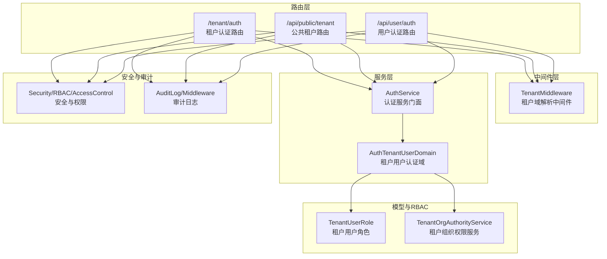
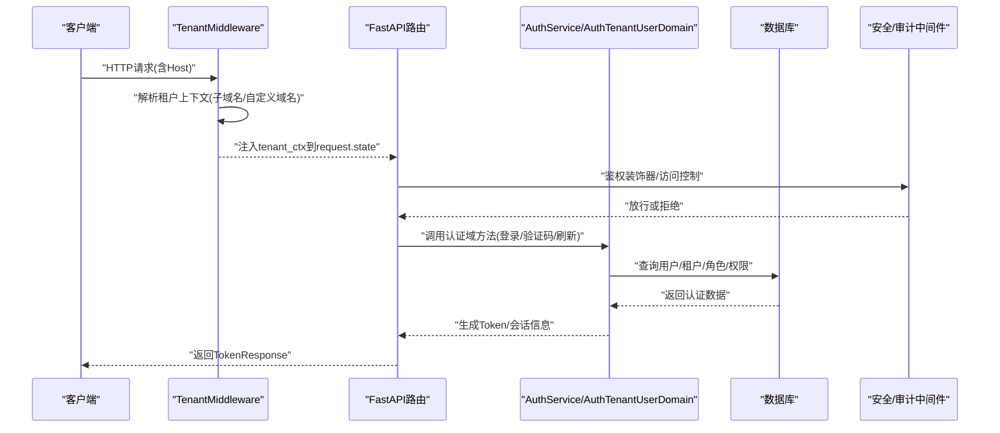
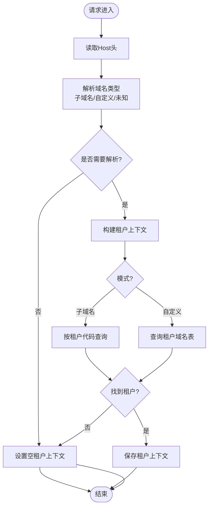
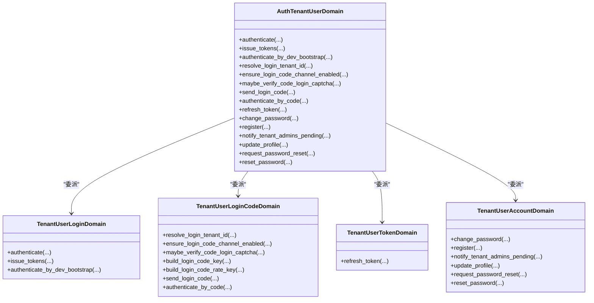
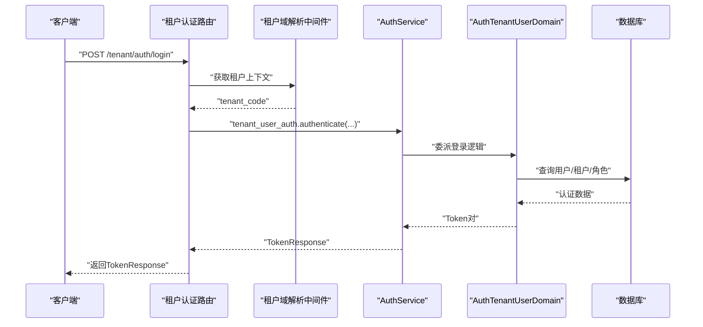
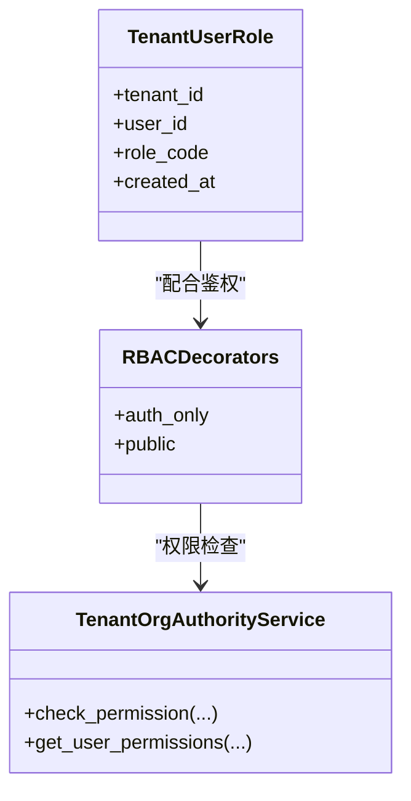
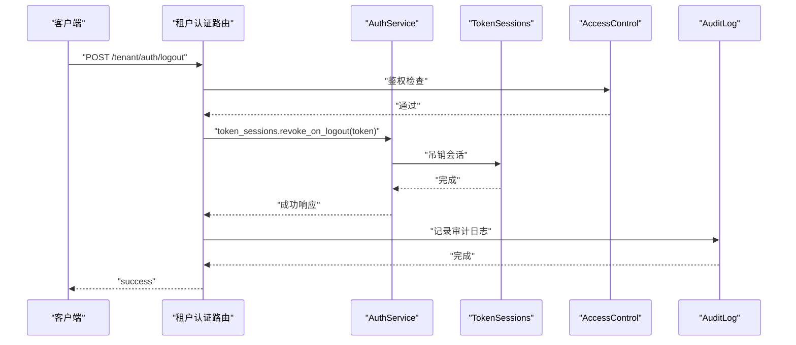
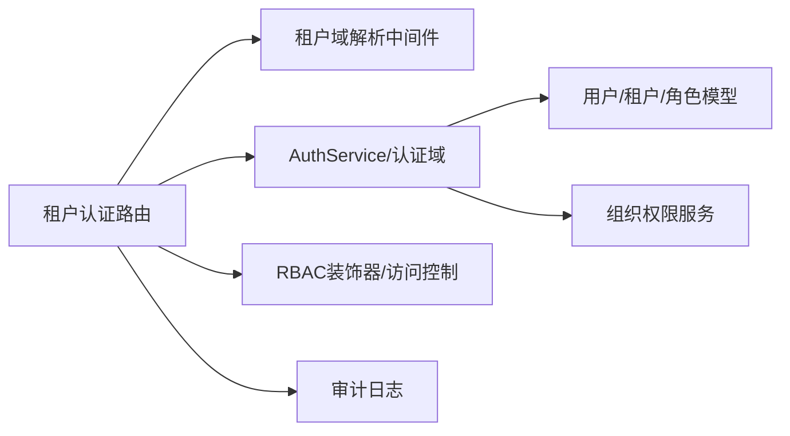

# 租户用户认证

<cite>

**本文引用的文件**
- [backend/app/api/tenant/auth.py](file://backend/app/api/tenant/auth.py)
- [backend/app/services/common/auth_domains/tenant_user_auth.py](file://backend/app/services/common/auth_domains/tenant_user_auth.py)
- [backend/app/middleware/tenant.py](file://backend/app/middleware/tenant.py)
- [backend/app/schemas/common/auth.py](file://backend/app/schemas/common/auth.py)
- [backend/app/models/auth/tenant_user_role.py](file://backend/app/models/auth/tenant_user_role.py)
- [backend/app/services/common/auth_service.py](file://backend/app/services/common/auth_service.py)
- [backend/app/api/public/tenant.py](file://backend/app/api/public/tenant.py)
- [backend/app/api/user/auth.py](file://backend/app/api/user/auth.py)
- [backend/app/core/security.py](file://backend/app/core/security.py)
- [backend/app/core/identity.py](file://backend/app/core/identity.py)
- [backend/app/core/runtime_identity.py](file://backend/app/core/runtime_identity.py)
- [backend/app/middleware/access_control.py](file://backend/app/middleware/access_control.py)
- [backend/app/middleware/audit_log.py](file://backend/app/middleware/audit_log.py)
- [backend/app/middleware/permission.py](file://backend/app/middleware/permission.py)
- [backend/app/rbac/decorators.py](file://backend/app/rbac/decorators.py)
- [backend/app/rbac/registry.py](file://backend/app/rbac/registry.py)
- [backend/app/enums/rbac.py](file://backend/app/enums/rbac.py)
- [backend/app/models/tenant/tenant.py](file://backend/app/models/tenant/tenant.py)
- [backend/app/models/tenant/tenant_domain.py](file://backend/app/models/tenant/tenant_domain.py)
- [backend/app/services/tenant/tenant_org_authority_service.py](file://backend/app/services/tenant/tenant_org_authority_service.py)
- [backend/app/core/org_authority.py](file://backend/app/core/org_authority.py)
- [backend/app/core/scope.py](file://backend/app/core/scope.py)
- [backend/app/core/data_permission.py](file://backend/app/core/data_permission.py)
- [backend/app/core/base_controller.py](file://backend/app/core/base_controller.py)
- [backend/app/core/base_service.py](file://backend/app/core/base_service.py)
- [backend/app/core/base_repository.py](file://backend/app/core/base_repository.py)
- [backend/app/core/database.py](file://backend/app/core/database.py)
- [backend/app/core/config.py](file://backend/app/core/config.py)
- [backend/app/core/logging.py](file://backend/app/core/logging.py)
- [backend/app/core/response.py](file://backend/app/core/response.py)
- [backend/app/core/rate_limit.py](file://backend/app/core/rate_limit.py)
- [backend/app/core/i18n.py](file://backend/app/core/i18n.py)
- [backend/app/core/deps.py](file://backend/app/core/deps.py)
- [backend/app/core/base_schema.py](file://backend/app/core/base_schema.py)
- [backend/app/schemas/tenant/__init__.py](file://backend/app/schemas/tenant/__init__.py)
- [backend/app/schemas/tenant/auth.py](file://backend/app/schemas/tenant/auth.py)
- [backend/app/schemas/user/auth.py](file://backend/app/schemas/user/auth.py)
- [backend/app/schemas/public/tenant.py](file://backend/app/schemas/public/tenant.py)
- [backend/app/schemas/common/__init__.py](file://backend/app/schemas/common/__init__.py)
- [backend/app/schemas/common/response.py](file://backend/app/schemas/common/response.py)
- [backend/app/schemas/common/error.py](file://backend/app/schemas/common/error.py)
- [backend/app/schemas/common/pagination.py](file://backend/app/schemas/common/pagination.py)
- [backend/app/schemas/common/base.py](file://backend/app/schemas/common/base.py)
</cite>

## 目录
1. [引言](#引言)
2. [项目结构](#项目结构)
3. [核心组件](#核心组件)
4. [架构总览](#架构总览)
5. [详细组件分析](#详细组件分析)
6. [依赖分析](#依赖分析)
7. [性能考虑](#性能考虑)
8. [故障排查指南](#故障排查指南)
9. [结论](#结论)
10. [附录](#附录)

## 引言
本技术文档聚焦于“租户用户认证模块”，系统性阐述租户普通用户的认证流程、租户范围权限验证机制、租户域隔离与会话管理设计，并覆盖接口设计与实现要点、角色权限模型、安全策略与审计机制、配置项与最佳实践。读者可据此理解从请求进入系统到完成租户域解析、用户认证、权限校验与会话发放的完整链路。

## 项目结构
租户用户认证涉及以下关键层次：
- 路由层：租户认证路由与公共/用户端认证路由
- 中间件层：租户域解析中间件，提供租户上下文
- 服务层：认证域服务（租户用户认证域），统一对外暴露认证能力
- 模型与RBAC：租户用户角色、组织权限与资源作用域
- 安全与审计：速率限制、鉴权装饰器、审计日志与访问控制

图表来源
- [backend/app/api/tenant/auth.py:43-279](file://backend/app/api/tenant/auth.py#L43-L279)
- [backend/app/api/public/tenant.py](file://backend/app/api/public/tenant.py)
- [backend/app/api/user/auth.py](file://backend/app/api/user/auth.py)
- [backend/app/middleware/tenant.py:93-259](file://backend/app/middleware/tenant.py#L93-L259)
- [backend/app/services/common/auth_domains/tenant_user_auth.py:21-194](file://backend/app/services/common/auth_domains/tenant_user_auth.py#L21-L194)
- [backend/app/services/common/auth_service.py](file://backend/app/services/common/auth_service.py)
- [backend/app/models/auth/tenant_user_role.py](file://backend/app/models/auth/tenant_user_role.py)
- [backend/app/services/tenant/tenant_org_authority_service.py](file://backend/app/services/tenant/tenant_org_authority_service.py)
- [backend/app/middleware/access_control.py](file://backend/app/middleware/access_control.py)
- [backend/app/middleware/audit_log.py](file://backend/app/middleware/audit_log.py)
- [backend/app/middleware/permission.py](file://backend/app/middleware/permission.py)
- [backend/app/rbac/decorators.py](file://backend/app/rbac/decorators.py)
- [backend/app/rbac/registry.py](file://backend/app/rbac/registry.py)
- [backend/app/enums/rbac.py](file://backend/app/enums/rbac.py)

章节来源
- [backend/app/api/tenant/auth.py:43-279](file://backend/app/api/tenant/auth.py#L43-L279)
- [backend/app/middleware/tenant.py:93-259](file://backend/app/middleware/tenant.py#L93-L259)
- [backend/app/services/common/auth_domains/tenant_user_auth.py:21-194](file://backend/app/services/common/auth_domains/tenant_user_auth.py#L21-L194)

## 核心组件
- 租户域解析中间件：负责从请求Host头解析租户上下文，支持子域名与自定义域名两种模式，并将租户信息注入到请求状态中，供后续认证与权限校验使用。
- 租户用户认证域：封装租户用户登录、验证码登录、Token刷新、密码修改、资料更新等能力，统一对外暴露认证域接口。
- 认证服务门面：聚合各认证域能力，协调数据库事务与会话吊销等操作。
- RBAC与组织权限：通过租户用户角色与组织权限服务，实现租户范围内的权限控制与资源作用域约束。
- 安全与审计：速率限制、鉴权装饰器、审计日志中间件与访问控制中间件共同保障认证流程的安全性与可观测性。

章节来源
- [backend/app/middleware/tenant.py:23-259](file://backend/app/middleware/tenant.py#L23-L259)
- [backend/app/services/common/auth_domains/tenant_user_auth.py:21-194](file://backend/app/services/common/auth_domains/tenant_user_auth.py#L21-L194)
- [backend/app/services/common/auth_service.py](file://backend/app/services/common/auth_service.py)
- [backend/app/models/auth/tenant_user_role.py](file://backend/app/models/auth/tenant_user_role.py)
- [backend/app/services/tenant/tenant_org_authority_service.py](file://backend/app/services/tenant/tenant_org_authority_service.py)
- [backend/app/middleware/access_control.py](file://backend/app/middleware/access_control.py)
- [backend/app/middleware/audit_log.py](file://backend/app/middleware/audit_log.py)
- [backend/app/middleware/permission.py](file://backend/app/middleware/permission.py)

## 架构总览
下图展示从HTTP请求进入系统到完成租户域解析、认证与权限校验的关键交互：

图表来源
- [backend/app/middleware/tenant.py:120-164](file://backend/app/middleware/tenant.py#L120-L164)
- [backend/app/api/tenant/auth.py:62-94](file://backend/app/api/tenant/auth.py#L62-L94)
- [backend/app/services/common/auth_domains/tenant_user_auth.py:31-49](file://backend/app/services/common/auth_domains/tenant_user_auth.py#L31-L49)
- [backend/app/middleware/access_control.py](file://backend/app/middleware/access_control.py)
- [backend/app/middleware/audit_log.py](file://backend/app/middleware/audit_log.py)

## 详细组件分析

### 组件A：租户域解析中间件
- 功能职责
  - 从请求Host头解析租户上下文，支持子域名与自定义域名两种模式。
  - 将租户信息注入到请求状态，供后续认证与权限校验使用。
- 关键点
  - 子域名模式：以平台配置的域后缀结尾，提取子域作为租户代码。
  - 自定义域名模式：查询租户域名表，匹配已验证的自定义域名。
  - 路径白名单：仅对特定路径前缀进行租户解析，避免不必要的DB查询。
- 错误与边界
  - 未解析到租户时返回空上下文，下游需显式判空。
  - 平台管理端域名与主域名排除在外，避免误解析。

图表来源
- [backend/app/middleware/tenant.py:120-222](file://backend/app/middleware/tenant.py#L120-L222)

章节来源
- [backend/app/middleware/tenant.py:52-259](file://backend/app/middleware/tenant.py#L52-L259)

### 组件B：租户用户认证域
- 功能职责
  - 提供租户用户登录、验证码登录、Token刷新、密码修改、注册、资料更新等能力。
  - 统一对外暴露认证域接口，内部委派给登录域、验证码域、Token域与账户域。
- 关键点
  - 登录流程：支持用户名+密码与验证码登录，支持开发环境Bootstrap登录。
  - 租户边界：登录时可传入租户代码，用于限定租户范围。
  - 会话管理：支持刷新Token与登出时吊销会话。
- 复杂度与性能
  - 登录与验证码登录均涉及数据库查询与缓存操作，注意速率限制与幂等性。
  - Token域负责签发与刷新，需确保签名算法与过期策略一致。

图表来源
- [backend/app/services/common/auth_domains/tenant_user_auth.py:21-194](file://backend/app/services/common/auth_domains/tenant_user_auth.py#L21-L194)

章节来源
- [backend/app/services/common/auth_domains/tenant_user_auth.py:21-194](file://backend/app/services/common/auth_domains/tenant_user_auth.py#L21-L194)

### 组件C：租户认证路由（登录/刷新/登出/资料）
- 功能职责
  - 提供租户用户登录、开发环境Bootstrap登录、Token刷新、登出、获取当前用户信息、修改密码、更新个人资料等接口。
  - 登录时通过租户域解析中间件确定租户边界，调用认证域完成认证与会话发放。
- 关键点
  - 登录接口：支持速率限制、图形验证码参数传递。
  - 开发环境Bootstrap登录：仅在开发环境启用，返回标准Token对。
  - 登出接口：根据Authorization头中的Token进行会话吊销。
  - 资料更新：返回最新用户信息，前端据此刷新UI。
- 错误处理
  - 速率限制：超过阈值返回受限响应。
  - 参数校验：基于Pydantic模型进行字段校验。
  - 国际化：成功/失败消息采用i18n。

图表来源
- [backend/app/api/tenant/auth.py:62-94](file://backend/app/api/tenant/auth.py#L62-L94)
- [backend/app/middleware/tenant.py:50-59](file://backend/app/middleware/tenant.py#L50-L59)
- [backend/app/services/common/auth_domains/tenant_user_auth.py:31-49](file://backend/app/services/common/auth_domains/tenant_user_auth.py#L31-L49)

章节来源
- [backend/app/api/tenant/auth.py:62-279](file://backend/app/api/tenant/auth.py#L62-L279)

### 组件D：租户用户角色与权限验证
- 角色模型
  - 租户用户角色模型定义了用户在租户维度的权限集合。
- 权限验证
  - 通过RBAC装饰器与组织权限服务，实现对资源与操作的细粒度控制。
  - 结合租户域解析中间件，确保权限验证在正确租户范围内生效。
- 数据范围与作用域
  - 通过作用域与数据权限模块，限制用户可见与可操作的数据范围。

图表来源
- [backend/app/models/auth/tenant_user_role.py](file://backend/app/models/auth/tenant_user_role.py)
- [backend/app/rbac/decorators.py](file://backend/app/rbac/decorators.py)
- [backend/app/services/tenant/tenant_org_authority_service.py](file://backend/app/services/tenant/tenant_org_authority_service.py)

章节来源
- [backend/app/models/auth/tenant_user_role.py](file://backend/app/models/auth/tenant_user_role.py)
- [backend/app/rbac/decorators.py](file://backend/app/rbac/decorators.py)
- [backend/app/services/tenant/tenant_org_authority_service.py](file://backend/app/services/tenant/tenant_org_authority_service.py)

### 组件E：租户范围权限检查与会话管理
- 会话管理
  - 登出时根据Bearer Token进行会话吊销，确保Token失效。
  - 刷新接口支持使用Refresh Token换取新的Token对。
- 权限检查
  - 通过组织权限服务与RBAC装饰器，结合租户上下文，确保权限验证在租户范围内执行。
- 审计与安全
  - 审计日志中间件记录关键操作，如一键登录、登出等。
  - 速率限制中间件保护登录接口免受暴力破解。

图表来源
- [backend/app/api/tenant/auth.py:146-167](file://backend/app/api/tenant/auth.py#L146-L167)
- [backend/app/middleware/access_control.py](file://backend/app/middleware/access_control.py)
- [backend/app/middleware/audit_log.py](file://backend/app/middleware/audit_log.py)

章节来源
- [backend/app/api/tenant/auth.py:126-208](file://backend/app/api/tenant/auth.py#L126-L208)
- [backend/app/middleware/access_control.py](file://backend/app/middleware/access_control.py)
- [backend/app/middleware/audit_log.py](file://backend/app/middleware/audit_log.py)

## 依赖分析
- 路由依赖中间件：认证路由依赖租户域解析中间件提供的租户上下文。
- 服务依赖模型：认证域依赖用户、租户、角色等模型与组织权限服务。
- 安全依赖装饰器：RBAC装饰器与访问控制中间件共同保证接口安全。
- 数据流依赖：认证流程贯穿数据库查询、缓存与会话存储。

图表来源
- [backend/app/api/tenant/auth.py:43-279](file://backend/app/api/tenant/auth.py#L43-L279)
- [backend/app/middleware/tenant.py:93-259](file://backend/app/middleware/tenant.py#L93-L259)
- [backend/app/services/common/auth_domains/tenant_user_auth.py:21-194](file://backend/app/services/common/auth_domains/tenant_user_auth.py#L21-L194)
- [backend/app/services/tenant/tenant_org_authority_service.py](file://backend/app/services/tenant/tenant_org_authority_service.py)
- [backend/app/middleware/access_control.py](file://backend/app/middleware/access_control.py)
- [backend/app/middleware/audit_log.py](file://backend/app/middleware/audit_log.py)

章节来源
- [backend/app/api/tenant/auth.py:43-279](file://backend/app/api/tenant/auth.py#L43-L279)
- [backend/app/middleware/tenant.py:93-259](file://backend/app/middleware/tenant.py#L93-L259)
- [backend/app/services/common/auth_domains/tenant_user_auth.py:21-194](file://backend/app/services/common/auth_domains/tenant_user_auth.py#L21-L194)

## 性能考虑
- 速率限制：登录接口实施速率限制，防止暴力破解与滥用。
- 缓存与异步：验证码发送与登录验证码校验建议结合缓存与异步队列，降低DB压力。
- 路径白名单：租户域解析仅对必要路径生效，减少无效查询。
- 事务与回滚：认证成功后及时提交事务，失败时回滚，避免脏数据。

## 故障排查指南
- 登录失败
  - 检查租户域解析是否正确，确认Host头与租户代码匹配。
  - 核对用户名/密码或验证码参数是否正确。
  - 查看速率限制是否触发。
- 会话异常
  - 登出后Token仍有效：确认会话吊销逻辑是否执行。
  - 刷新失败：确认Refresh Token是否过期或被吊销。
- 权限问题
  - 检查用户角色与组织权限配置，确认租户范围内的权限映射。
  - 确认RBAC装饰器与访问控制中间件是否正确应用。

章节来源
- [backend/app/middleware/tenant.py:120-164](file://backend/app/middleware/tenant.py#L120-L164)
- [backend/app/core/rate_limit.py](file://backend/app/core/rate_limit.py)
- [backend/app/middleware/access_control.py](file://backend/app/middleware/access_control.py)
- [backend/app/middleware/audit_log.py](file://backend/app/middleware/audit_log.py)

## 结论
租户用户认证模块通过“租户域解析中间件 + 认证域服务 + RBAC与组织权限”的组合，实现了租户范围内的用户认证、权限验证与会话管理。其设计强调租户域隔离、安全审计与可扩展性，适合在多租户场景下提供稳定可靠的认证能力。

## 附录

### 接口设计与实现要点
- 租户用户登录
  - 路径：POST /tenant/auth/login
  - 参数：用户名/邮箱、密码、可选验证码参数
  - 行为：速率限制、租户域解析、认证域登录、发放Token
- 开发环境Bootstrap登录
  - 路径：POST /tenant/auth/dev/bootstrap
  - 参数：Bootstrap密钥
  - 行为：仅开发环境可用，返回标准Token对
- Token刷新
  - 路径：POST /tenant/auth/refresh
  - 参数：Refresh Token
  - 行为：签发新的Token对
- 登出
  - 路径：POST /tenant/auth/logout
  - 行为：根据Bearer Token吊销会话
- 获取当前用户信息
  - 路径：GET /tenant/auth/me
  - 行为：返回用户详情（含套餐标识）
- 修改密码
  - 路径：PUT /tenant/auth/password
  - 行为：旧密码校验后更新新密码
- 更新个人资料
  - 路径：PUT /tenant/auth/profile
  - 行为：更新昵称、头像、邮箱、电话等

章节来源
- [backend/app/api/tenant/auth.py:62-279](file://backend/app/api/tenant/auth.py#L62-L279)
- [backend/app/schemas/common/auth.py:13-50](file://backend/app/schemas/common/auth.py#L13-L50)

### 租户域隔离与权限验证过程
- 租户域隔离
  - 通过中间件解析租户上下文，确保后续认证与权限在正确租户内执行。
- 权限验证
  - RBAC装饰器与组织权限服务结合，实现对资源与操作的细粒度控制。
- 作用域与数据权限
  - 通过作用域与数据权限模块，限制用户可见与可操作的数据范围。

章节来源
- [backend/app/middleware/tenant.py:23-50](file://backend/app/middleware/tenant.py#L23-L50)
- [backend/app/rbac/decorators.py](file://backend/app/rbac/decorators.py)
- [backend/app/services/tenant/tenant_org_authority_service.py](file://backend/app/services/tenant/tenant_org_authority_service.py)
- [backend/app/core/scope.py](file://backend/app/core/scope.py)
- [backend/app/core/data_permission.py](file://backend/app/core/data_permission.py)

### 安全策略与审计机制
- 安全策略
  - 速率限制、鉴权装饰器、访问控制中间件、会话吊销。
- 审计机制
  - 审计日志中间件记录关键操作，如一键登录、登出等。
- 国际化与响应格式
  - 成功/失败消息采用i18n，统一响应格式。

章节来源
- [backend/app/core/rate_limit.py](file://backend/app/core/rate_limit.py)
- [backend/app/middleware/access_control.py](file://backend/app/middleware/access_control.py)
- [backend/app/middleware/audit_log.py](file://backend/app/middleware/audit_log.py)
- [backend/app/core/i18n.py](file://backend/app/core/i18n.py)
- [backend/app/core/response.py](file://backend/app/core/response.py)

### 配置选项与最佳实践
- 配置项
  - 平台域名后缀、平台管理端域名列表、开发环境开关等。
- 最佳实践
  - 明确租户域解析规则，避免误解析。
  - 对登录接口实施严格的速率限制与验证码策略。
  - 登出即刻吊销会话，确保Token生命周期可控。
  - 使用RBAC与组织权限服务，最小权限原则与职责分离。

章节来源
- [backend/app/middleware/tenant.py:52-91](file://backend/app/middleware/tenant.py#L52-L91)
- [backend/app/core/config.py](file://backend/app/core/config.py)
- [backend/app/core/rate_limit.py](file://backend/app/core/rate_limit.py)
- [backend/app/middleware/access_control.py](file://backend/app/middleware/access_control.py)