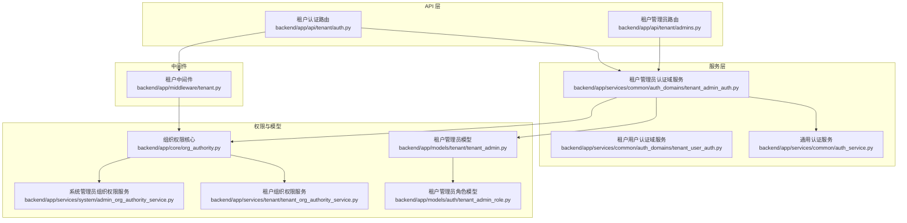
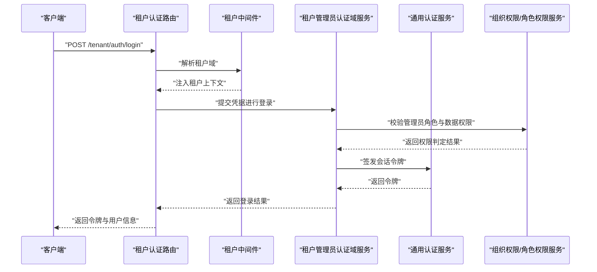
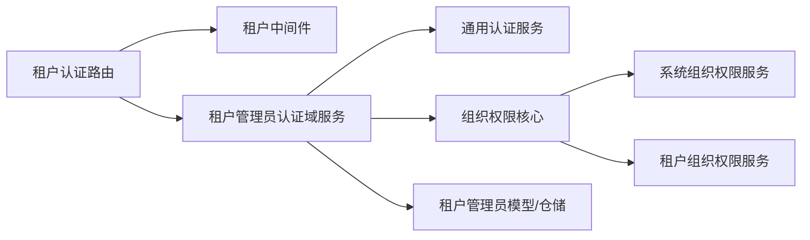

# 租户管理员认证

<cite>
**本文引用的文件**
- [backend/app/api/tenant/auth.py](file://backend/app/api/tenant/auth.py)
- [backend/app/api/tenant/admins.py](file://backend/app/api/tenant/admins.py)
- [backend/app/services/common/auth_domains/tenant_admin_auth.py](file://backend/app/services/common/auth_domains/tenant_admin_auth.py)
- [backend/app/services/common/auth_domains/tenant_user_auth.py](file://backend/app/services/common/auth_domains/tenant_user_auth.py)
- [backend/app/services/common/auth_service.py](file://backend/app/services/common/auth_service.py)
- [backend/app/middleware/tenant.py](file://backend/app/middleware/tenant.py)
- [backend/app/core/org_authority.py](file://backend/app/core/org_authority.py)
- [backend/app/services/system/admin_org_authority_service.py](file://backend/app/services/system/admin_org_authority_service.py)
- [backend/app/services/tenant/tenant_org_authority_service.py](file://backend/app/services/tenant/tenant_org_authority_service.py)
- [backend/app/models/tenant/tenant_admin.py](file://backend/app/models/tenant/tenant_admin.py)
- [backend/app/models/auth/tenant_admin_role.py](file://backend/app/models/auth/tenant_admin_role.py)
- [backend/app/repositories/tenant/tenant_admin_repository.py](file://backend/app/repositories/tenant/tenant_admin_repository.py)
- [backend/app/schemas/tenant/admin.py](file://backend/app/schemas/tenant/admin.py)
- [backend/app/migrations/versions/20260325_org_authority_rebuild.py](file://backend/app/migrations/versions/20260325_org_authority_rebuild.py)
- [backend/tests/api/test_tenant_auth.py](file://backend/tests/api/test_tenant_auth.py)
- [backend/tests/api/test_tenant_auth_profile_contract.py](file://backend/tests/api/test_tenant_auth_profile_contract.py)
- [backend/tests/api/test_tenant_auth_tenant_resolution.py](file://backend/tests/api/test_tenant_auth_tenant_resolution.py)
- [backend/tests/services/test_auth_service.py](file://backend/tests/services/test_auth_service.py)
- [backend/tests/services/test_auth_logging.py](file://backend/tests/services/test_auth_logging.py)
</cite>

## 目录
1. [简介](#简介)
2. [项目结构](#项目结构)
3. [核心组件](#核心组件)
4. [架构总览](#架构总览)
5. [详细组件分析](#详细组件分析)
6. [依赖关系分析](#依赖关系分析)
7. [性能考量](#性能考量)
8. [故障排查指南](#故障排查指南)
9. [结论](#结论)
10. [附录](#附录)

## 简介
本技术文档聚焦于租户管理员认证模块，系统性阐述租户管理员账户的创建、登录验证、租户范围权限检查与会话管理机制。文档覆盖租户域解析、租户范围权限模型、RBAC 角色与数据权限、安全策略与审计日志，并给出接口设计与实现要点、错误处理策略、配置项说明、使用示例与安全最佳实践。

## 项目结构
租户管理员认证相关代码主要分布在以下区域：
- API 层：租户认证与管理员相关路由
- 服务层：认证域服务（tenant_admin_auth、tenant_user_auth）、通用认证服务
- 中间件：租户域解析中间件
- 核心权限：组织权限与角色权限服务
- 模型与仓库：租户管理员实体、角色、仓储
- 测试：认证、租户解析、权限日志等测试用例

图表来源
- [backend/app/api/tenant/auth.py](file://backend/app/api/tenant/auth.py)
- [backend/app/api/tenant/admins.py](file://backend/app/api/tenant/admins.py)
- [backend/app/services/common/auth_domains/tenant_admin_auth.py](file://backend/app/services/common/auth_domains/tenant_admin_auth.py)
- [backend/app/services/common/auth_domains/tenant_user_auth.py](file://backend/app/services/common/auth_domains/tenant_user_auth.py)
- [backend/app/services/common/auth_service.py](file://backend/app/services/common/auth_service.py)
- [backend/app/middleware/tenant.py](file://backend/app/middleware/tenant.py)
- [backend/app/core/org_authority.py](file://backend/app/core/org_authority.py)
- [backend/app/services/system/admin_org_authority_service.py](file://backend/app/services/system/admin_org_authority_service.py)
- [backend/app/services/tenant/tenant_org_authority_service.py](file://backend/app/services/tenant/tenant_org_authority_service.py)
- [backend/app/models/tenant/tenant_admin.py](file://backend/app/models/tenant/tenant_admin.py)
- [backend/app/models/auth/tenant_admin_role.py](file://backend/app/models/auth/tenant_admin_role.py)

章节来源
- [backend/app/api/tenant/auth.py](file://backend/app/api/tenant/auth.py)
- [backend/app/api/tenant/admins.py](file://backend/app/api/tenant/admins.py)
- [backend/app/middleware/tenant.py](file://backend/app/middleware/tenant.py)
- [backend/app/services/common/auth_domains/tenant_admin_auth.py](file://backend/app/services/common/auth_domains/tenant_admin_auth.py)
- [backend/app/services/common/auth_domains/tenant_user_auth.py](file://backend/app/services/common/auth_domains/tenant_user_auth.py)
- [backend/app/services/common/auth_service.py](file://backend/app/services/common/auth_service.py)
- [backend/app/core/org_authority.py](file://backend/app/core/org_authority.py)
- [backend/app/services/system/admin_org_authority_service.py](file://backend/app/services/system/admin_org_authority_service.py)
- [backend/app/services/tenant/tenant_org_authority_service.py](file://backend/app/services/tenant/tenant_org_authority_service.py)
- [backend/app/models/tenant/tenant_admin.py](file://backend/app/models/tenant/tenant_admin.py)
- [backend/app/models/auth/tenant_admin_role.py](file://backend/app/models/auth/tenant_admin_role.py)

## 核心组件
- 租户认证路由：负责租户域解析与登录流程入口
- 租户管理员认证域服务：执行租户管理员登录、权限校验与会话发放
- 通用认证服务：提供令牌签发、刷新、注销等通用能力
- 租户中间件：在请求进入时解析租户域并注入租户上下文
- 组织权限与角色权限服务：提供基于组织树与角色的数据权限判定
- 租户管理员模型与仓储：承载管理员实体、角色与持久化操作
- 测试用例：覆盖认证流程、租户解析与权限日志

章节来源
- [backend/app/api/tenant/auth.py](file://backend/app/api/tenant/auth.py)
- [backend/app/services/common/auth_domains/tenant_admin_auth.py](file://backend/app/services/common/auth_domains/tenant_admin_auth.py)
- [backend/app/services/common/auth_service.py](file://backend/app/services/common/auth_service.py)
- [backend/app/middleware/tenant.py](file://backend/app/middleware/tenant.py)
- [backend/app/core/org_authority.py](file://backend/app/core/org_authority.py)
- [backend/app/services/system/admin_org_authority_service.py](file://backend/app/services/system/admin_org_authority_service.py)
- [backend/app/services/tenant/tenant_org_authority_service.py](file://backend/app/services/tenant/tenant_org_authority_service.py)
- [backend/app/models/tenant/tenant_admin.py](file://backend/app/models/tenant/tenant_admin.py)
- [backend/app/models/auth/tenant_admin_role.py](file://backend/app/models/auth/tenant_admin_role.py)
- [backend/tests/api/test_tenant_auth.py](file://backend/tests/api/test_tenant_auth.py)
- [backend/tests/api/test_tenant_auth_tenant_resolution.py](file://backend/tests/api/test_tenant_auth_tenant_resolution.py)
- [backend/tests/services/test_auth_service.py](file://backend/tests/services/test_auth_service.py)
- [backend/tests/services/test_auth_logging.py](file://backend/tests/services/test_auth_logging.py)

## 架构总览
租户管理员认证采用“中间件解析租户域 + 认证域服务执行登录与权限校验 + 通用认证服务发放会话”的分层架构。租户域解析确保后续所有业务逻辑在正确的租户上下文中运行；认证域服务负责管理员身份验证与权限判定；通用认证服务统一管理令牌生命周期；组织权限与角色权限服务提供细粒度的数据访问控制。

图表来源
- [backend/app/api/tenant/auth.py](file://backend/app/api/tenant/auth.py)
- [backend/app/middleware/tenant.py](file://backend/app/middleware/tenant.py)
- [backend/app/services/common/auth_domains/tenant_admin_auth.py](file://backend/app/services/common/auth_domains/tenant_admin_auth.py)
- [backend/app/services/common/auth_service.py](file://backend/app/services/common/auth_service.py)
- [backend/app/core/org_authority.py](file://backend/app/core/org_authority.py)
- [backend/app/services/system/admin_org_authority_service.py](file://backend/app/services/system/admin_org_authority_service.py)
- [backend/app/services/tenant/tenant_org_authority_service.py](file://backend/app/services/tenant/tenant_org_authority_service.py)

## 详细组件分析

### 租户认证路由与登录流程
- 路由职责：接收租户域下的登录请求，调用认证域服务完成登录，并通过通用认证服务发放会话
- 关键点：在进入业务逻辑前先解析租户域，保证后续权限与数据访问均在正确租户上下文中执行
- 输出：成功返回令牌与管理员信息；失败返回明确错误码与消息

章节来源
- [backend/app/api/tenant/auth.py](file://backend/app/api/tenant/auth.py)
- [backend/app/middleware/tenant.py](file://backend/app/middleware/tenant.py)

### 租户管理员认证域服务
- 登录验证：校验管理员凭据，结合组织权限与角色权限判定是否允许登录
- 权限检查：基于组织树与角色数据权限，确保管理员仅能访问其授权范围内的资源
- 会话管理：委托通用认证服务签发与管理会话令牌
- 错误处理：对凭据无效、权限不足、租户解析失败等情况返回标准化错误

章节来源
- [backend/app/services/common/auth_domains/tenant_admin_auth.py](file://backend/app/services/common/auth_domains/tenant_admin_auth.py)
- [backend/app/core/org_authority.py](file://backend/app/core/org_authority.py)
- [backend/app/services/system/admin_org_authority_service.py](file://backend/app/services/system/admin_org_authority_service.py)
- [backend/app/services/tenant/tenant_org_authority_service.py](file://backend/app/services/tenant/tenant_org_authority_service.py)

### 通用认证服务
- 职责：统一处理令牌签发、刷新、注销与失效清理
- 安全策略：支持令牌过期时间、刷新窗口、单点登录限制等配置
- 会话生命周期：在登录成功后生成会话令牌，在登出或过期后回收

章节来源
- [backend/app/services/common/auth_service.py](file://backend/app/services/common/auth_service.py)

### 租户中间件
- 职责：从请求中解析租户域，构建租户上下文并注入到后续处理链
- 作用：确保所有业务请求在正确的租户命名空间内执行，避免跨租户数据泄露

章节来源
- [backend/app/middleware/tenant.py](file://backend/app/middleware/tenant.py)

### 组织权限与角色权限服务
- 组织权限核心：提供基于组织树的权限判定与继承规则
- 系统与租户服务：分别面向系统级与租户级管理员，提供差异化的权限边界
- 数据权限：结合角色与资源范围，实现最小权限原则

章节来源
- [backend/app/core/org_authority.py](file://backend/app/core/org_authority.py)
- [backend/app/services/system/admin_org_authority_service.py](file://backend/app/services/system/admin_org_authority_service.py)
- [backend/app/services/tenant/tenant_org_authority_service.py](file://backend/app/services/tenant/tenant_org_authority_service.py)
- [backend/app/migrations/versions/20260325_org_authority_rebuild.py](file://backend/app/migrations/versions/20260325_org_authority_rebuild.py)

### 租户管理员模型与仓储
- 模型：定义租户管理员实体及其关联角色
- 仓储：提供管理员查询、更新、删除等持久化操作
- 配合：与认证域服务协作完成管理员身份与权限的加载与校验

章节来源
- [backend/app/models/tenant/tenant_admin.py](file://backend/app/models/tenant/tenant_admin.py)
- [backend/app/models/auth/tenant_admin_role.py](file://backend/app/models/auth/tenant_admin_role.py)
- [backend/app/repositories/tenant/tenant_admin_repository.py](file://backend/app/repositories/tenant/tenant_admin_repository.py)
- [backend/app/schemas/tenant/admin.py](file://backend/app/schemas/tenant/admin.py)

### 租户管理员路由
- 职责：提供租户管理员相关的管理接口（如列表、详情、更新等）
- 安全：依赖中间件与认证域服务保障租户域与权限边界

章节来源
- [backend/app/api/tenant/admins.py](file://backend/app/api/tenant/admins.py)

### 租户用户认证域服务（对比参考）
- 用于理解租户用户与租户管理员在认证域上的差异，便于把握租户范围权限的边界

章节来源
- [backend/app/services/common/auth_domains/tenant_user_auth.py](file://backend/app/services/common/auth_domains/tenant_user_auth.py)

## 依赖关系分析
- 路由依赖中间件以解析租户域，再调用认证域服务
- 认证域服务依赖通用认证服务进行会话管理，并依赖组织权限与角色权限服务进行权限判定
- 模型与仓储为认证域服务提供数据支撑
- 测试覆盖认证流程、租户解析与权限日志

图表来源
- [backend/app/api/tenant/auth.py](file://backend/app/api/tenant/auth.py)
- [backend/app/middleware/tenant.py](file://backend/app/middleware/tenant.py)
- [backend/app/services/common/auth_domains/tenant_admin_auth.py](file://backend/app/services/common/auth_domains/tenant_admin_auth.py)
- [backend/app/services/common/auth_service.py](file://backend/app/services/common/auth_service.py)
- [backend/app/core/org_authority.py](file://backend/app/core/org_authority.py)
- [backend/app/services/system/admin_org_authority_service.py](file://backend/app/services/system/admin_org_authority_service.py)
- [backend/app/services/tenant/tenant_org_authority_service.py](file://backend/app/services/tenant/tenant_org_authority_service.py)
- [backend/app/models/tenant/tenant_admin.py](file://backend/app/models/tenant/tenant_admin.py)
- [backend/app/repositories/tenant/tenant_admin_repository.py](file://backend/app/repositories/tenant/tenant_admin_repository.py)

章节来源
- [backend/app/api/tenant/auth.py](file://backend/app/api/tenant/auth.py)
- [backend/app/middleware/tenant.py](file://backend/app/middleware/tenant.py)
- [backend/app/services/common/auth_domains/tenant_admin_auth.py](file://backend/app/services/common/auth_domains/tenant_admin_auth.py)
- [backend/app/services/common/auth_service.py](file://backend/app/services/common/auth_service.py)
- [backend/app/core/org_authority.py](file://backend/app/core/org_authority.py)
- [backend/app/services/system/admin_org_authority_service.py](file://backend/app/services/system/admin_org_authority_service.py)
- [backend/app/services/tenant/tenant_org_authority_service.py](file://backend/app/services/tenant/tenant_org_authority_service.py)
- [backend/app/models/tenant/tenant_admin.py](file://backend/app/models/tenant/tenant_admin.py)
- [backend/app/repositories/tenant/tenant_admin_repository.py](file://backend/app/repositories/tenant/tenant_admin_repository.py)

## 性能考量
- 令牌签发与校验：建议缓存常用权限判定结果，降低数据库压力
- 租户域解析：中间件应尽量轻量，避免阻塞请求链路
- 权限判定：组织树与角色权限判定应走索引优化查询，必要时引入本地缓存
- 并发控制：登录与会话刷新需考虑并发场景，避免竞态

## 故障排查指南
- 登录失败
  - 检查租户域解析是否正确，确认中间件已注入租户上下文
  - 核对管理员凭据与角色权限，确认未越权访问
  - 查看认证域服务与通用认证服务的日志输出
- 权限异常
  - 核对组织权限与角色权限服务的判定逻辑
  - 检查迁移脚本对权限模型的影响（如组织权限重建）
- 会话问题
  - 检查令牌过期与刷新策略配置
  - 确认会话回收与注销流程是否正常执行

章节来源
- [backend/tests/api/test_tenant_auth.py](file://backend/tests/api/test_tenant_auth.py)
- [backend/tests/api/test_tenant_auth_tenant_resolution.py](file://backend/tests/api/test_tenant_auth_tenant_resolution.py)
- [backend/tests/services/test_auth_service.py](file://backend/tests/services/test_auth_service.py)
- [backend/tests/services/test_auth_logging.py](file://backend/tests/services/test_auth_logging.py)
- [backend/app/migrations/versions/20260325_org_authority_rebuild.py](file://backend/app/migrations/versions/20260325_org_authority_rebuild.py)

## 结论
租户管理员认证模块通过“中间件解析租户域 + 认证域服务 + 通用认证服务 + 组织权限与角色权限服务”的协同，实现了租户范围内的强隔离与细粒度权限控制。配合完善的测试与审计机制，可有效保障租户管理员在正确域内的安全访问与操作。

## 附录

### 接口设计与实现要点
- 租户登录 API
  - 请求：携带租户域与管理员凭据
  - 处理：中间件解析租户域 → 认证域服务校验凭据与权限 → 通用认证服务签发会话
  - 响应：返回令牌与管理员信息
- 租户权限验证 API
  - 请求：携带会话令牌与目标资源标识
  - 处理：认证域服务结合组织权限与角色权限判定
  - 响应：返回授权结果
- 租户会话管理 API
  - 支持：会话刷新、注销、失效回收
  - 安全：严格控制过期时间与刷新窗口

章节来源
- [backend/app/api/tenant/auth.py](file://backend/app/api/tenant/auth.py)
- [backend/app/services/common/auth_domains/tenant_admin_auth.py](file://backend/app/services/common/auth_domains/tenant_admin_auth.py)
- [backend/app/services/common/auth_service.py](file://backend/app/services/common/auth_service.py)

### 租户域隔离与权限验证过程
- 租户域隔离：中间件在请求入口解析并注入租户上下文，后续所有业务逻辑均在该上下文中执行
- 权限验证：认证域服务联合组织权限与角色权限服务，确保管理员仅能访问授权范围内的资源

章节来源
- [backend/app/middleware/tenant.py](file://backend/app/middleware/tenant.py)
- [backend/app/services/common/auth_domains/tenant_admin_auth.py](file://backend/app/services/common/auth_domains/tenant_admin_auth.py)
- [backend/app/core/org_authority.py](file://backend/app/core/org_authority.py)

### 错误处理与安全审计
- 错误处理：对凭据无效、权限不足、租户解析失败等场景返回标准化错误码与消息
- 安全审计：记录登录、权限变更、会话状态等关键事件，便于追踪与合规

章节来源
- [backend/tests/services/test_auth_logging.py](file://backend/tests/services/test_auth_logging.py)

### 配置选项与使用示例
- 配置项（示例维度）
  - 令牌过期时间、刷新窗口
  - 租户域解析策略
  - 权限判定缓存策略
- 使用示例（流程维度）
  - 租户管理员登录 → 获取会话令牌 → 在租户域内访问受控资源 → 刷新或注销会话

章节来源
- [backend/app/services/common/auth_service.py](file://backend/app/services/common/auth_service.py)
- [backend/app/api/tenant/auth.py](file://backend/app/api/tenant/auth.py)

### 租户安全最佳实践
- 最小权限原则：管理员仅授予完成工作所需的最小权限集合
- 租户域强隔离：确保不同租户间无交叉访问可能
- 会话安全：短令牌、定期刷新、异常登出与失效回收
- 审计留痕：完整记录关键操作，支持追溯与合规检查