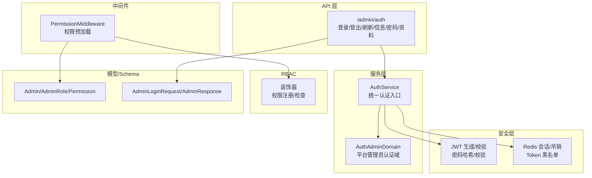
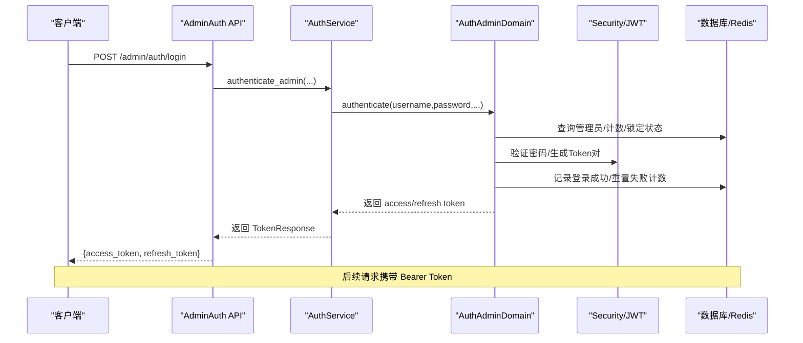
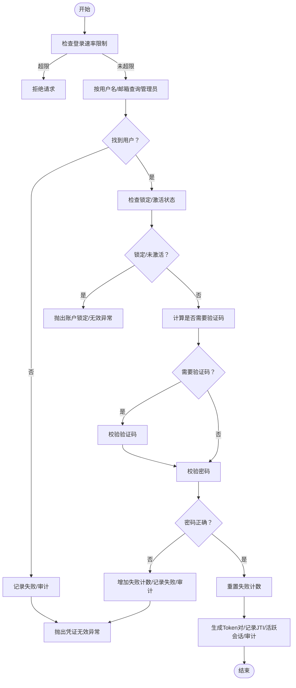
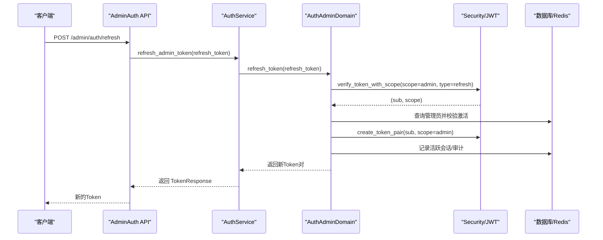
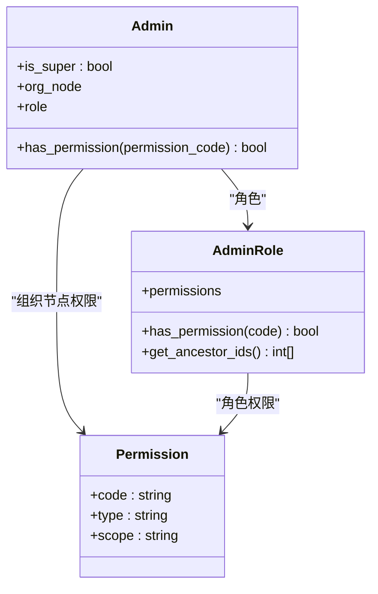
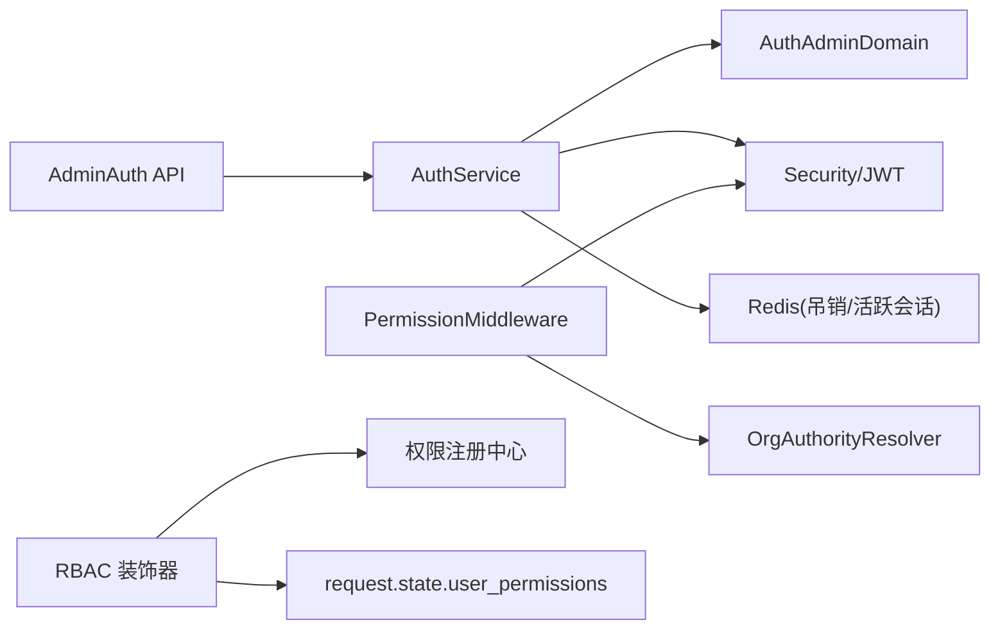

# 管理员认证

<cite>
**本文档引用的文件**
- [backend/app/api/admin/auth.py](file://backend/app/api/admin/auth.py)
- [backend/app/services/common/auth_service.py](file://backend/app/services/common/auth_service.py)
- [backend/app/services/common/auth_domains/admin_auth.py](file://backend/app/services/common/auth_domains/admin_auth.py)
- [backend/app/core/security.py](file://backend/app/core/security.py)
- [backend/app/middleware/permission.py](file://backend/app/middleware/permission.py)
- [backend/app/rbac/decorators.py](file://backend/app/rbac/decorators.py)
- [backend/app/models/system/admin.py](file://backend/app/models/system/admin.py)
- [backend/app/models/auth/admin_role.py](file://backend/app/models/auth/admin_role.py)
- [backend/app/models/auth/permission.py](file://backend/app/models/auth/permission.py)
- [backend/app/schemas/system/admin.py](file://backend/app/schemas/system/admin.py)
- [backend/tests/api/test_admin_auth.py](file://backend/tests/api/test_admin_auth.py)
</cite>

## 目录
1. [简介](#简介)
2. [项目结构](#项目结构)
3. [核心组件](#核心组件)
4. [架构总览](#架构总览)
5. [详细组件分析](#详细组件分析)
6. [依赖分析](#依赖分析)
7. [性能考虑](#性能考虑)
8. [故障排查指南](#故障排查指南)
9. [结论](#结论)
10. [附录](#附录)

## 简介
本文件面向平台管理员认证模块，系统性阐述管理员账户的创建、登录验证、权限检查与会话管理流程；详述安全策略、令牌生成与验证机制；文档化登录、权限验证与会话管理接口设计与实现；解释管理员角色的权限边界与安全控制；并提供错误处理、安全审计与防护机制说明、配置项、使用示例与安全最佳实践。

## 项目结构
管理员认证相关代码主要分布在以下层次：
- API 层：提供 /admin/auth 接口，负责登录、登出、Token 刷新、获取当前管理员信息、修改密码与更新个人信息。
- 服务层：AuthService 作为统一入口，委派给 AuthAdminDomain 等领域对象完成具体逻辑。
- 安全层：提供 JWT 令牌生成/校验、密码哈希、吊销黑名单、Impersonate 一键登录等能力。
- 中间件：PermissionMiddleware 在请求进入路由前预加载权限与数据权限上下文。
- RBAC 装饰器：声明式权限注册与运行时检查。
- 模型层：Admin、AdminRole、Permission 等实体定义与权限判定逻辑。
- Schema 层：AdminLoginRequest、AdminResponse 等数据结构。

图表来源
- [backend/app/api/admin/auth.py:26-209](file://backend/app/api/admin/auth.py#L26-L209)
- [backend/app/services/common/auth_service.py:46-526](file://backend/app/services/common/auth_service.py#L46-L526)
- [backend/app/services/common/auth_domains/admin_auth.py:21-302](file://backend/app/services/common/auth_domains/admin_auth.py#L21-L302)
- [backend/app/core/security.py:38-503](file://backend/app/core/security.py#L38-L503)
- [backend/app/middleware/permission.py:31-272](file://backend/app/middleware/permission.py#L31-L272)
- [backend/app/rbac/decorators.py:35-551](file://backend/app/rbac/decorators.py#L35-L551)
- [backend/app/models/system/admin.py:18-196](file://backend/app/models/system/admin.py#L18-L196)
- [backend/app/models/auth/admin_role.py:36-322](file://backend/app/models/auth/admin_role.py#L36-L322)
- [backend/app/models/auth/permission.py:15-159](file://backend/app/models/auth/permission.py#L15-L159)
- [backend/app/schemas/system/admin.py:50-169](file://backend/app/schemas/system/admin.py#L50-L169)

章节来源
- [backend/app/api/admin/auth.py:26-209](file://backend/app/api/admin/auth.py#L26-L209)
- [backend/app/services/common/auth_service.py:46-526](file://backend/app/services/common/auth_service.py#L46-L526)

## 核心组件
- 平台管理员认证 API：提供登录、开发环境引导登录、刷新 Token、登出、获取当前管理员信息、修改密码、更新个人信息等接口。
- 认证服务（AuthService）：封装平台管理员认证、企业管理员/用户认证、Token 刷新、密码修改、会话与安全域操作。
- 平台管理员认证域（AuthAdminDomain）：实现登录、开发环境引导登录、Token 刷新、修改密码等核心逻辑。
- 安全模块（security）：提供 JWT 令牌生成/验证、密码哈希/校验、吊销与黑名单、Impersonate 一键登录等。
- 权限中间件（PermissionMiddleware）：在请求进入路由前预加载当前用户权限集合与数据权限上下文。
- RBAC 装饰器：声明式权限注册与运行时检查，支持通配符与资源通配符。
- 模型与 Schema：Admin/AdminRole/Permission 定义与权限判定；AdminLoginRequest/AdminResponse 等数据结构。

章节来源
- [backend/app/api/admin/auth.py:29-206](file://backend/app/api/admin/auth.py#L29-L206)
- [backend/app/services/common/auth_service.py:46-341](file://backend/app/services/common/auth_service.py#L46-L341)
- [backend/app/services/common/auth_domains/admin_auth.py:21-302](file://backend/app/services/common/auth_domains/admin_auth.py#L21-L302)
- [backend/app/core/security.py:38-503](file://backend/app/core/security.py#L38-L503)
- [backend/app/middleware/permission.py:31-272](file://backend/app/middleware/permission.py#L31-L272)
- [backend/app/rbac/decorators.py:35-551](file://backend/app/rbac/decorators.py#L35-L551)
- [backend/app/models/system/admin.py:165-187](file://backend/app/models/system/admin.py#L165-L187)
- [backend/app/models/auth/admin_role.py:289-314](file://backend/app/models/auth/admin_role.py#L289-L314)
- [backend/app/models/auth/permission.py:15-159](file://backend/app/models/auth/permission.py#L15-L159)
- [backend/app/schemas/system/admin.py:50-169](file://backend/app/schemas/system/admin.py#L50-L169)

## 架构总览
管理员认证采用“API → 服务 → 安全/会话/登录安全域”的分层设计，配合中间件与 RBAC 装饰器实现鉴权与权限控制。

图表来源
- [backend/app/api/admin/auth.py:29-60](file://backend/app/api/admin/auth.py#L29-L60)
- [backend/app/services/common/auth_service.py:301-317](file://backend/app/services/common/auth_service.py#L301-L317)
- [backend/app/services/common/auth_domains/admin_auth.py:71-174](file://backend/app/services/common/auth_domains/admin_auth.py#L71-L174)
- [backend/app/core/security.py:38-115](file://backend/app/core/security.py#L38-L115)

## 详细组件分析

### 登录流程（管理员）
- 输入参数：用户名/邮箱、密码、可选验证码挑战/解、验证码提供商标识。
- 速率限制：登录前检查登录速率限制，超限直接拒绝。
- 用户查询与状态校验：按用户名或邮箱查找管理员，排除已删除用户；若不存在触发失败记录与审计日志。
- 账户锁定与激活：若账户被锁定或未激活，抛出相应异常。
- 验证码策略：根据配置与失败次数决定是否需要验证码；若需要则进行验证码校验。
- 密码校验与失败计数：密码错误则记录失败、更新失败计数与时间；成功则重置失败计数。
- 令牌签发：生成 access/refresh Token 对，记录 JTI 到 Redis，写入活跃会话；记录登录成功审计事件。
- 返回：TokenResponse（包含 access_token、refresh_token、token_type）。

图表来源
- [backend/app/services/common/auth_domains/admin_auth.py:71-174](file://backend/app/services/common/auth_domains/admin_auth.py#L71-L174)
- [backend/app/services/common/auth_domains/admin_auth.py:142-171](file://backend/app/services/common/auth_domains/admin_auth.py#L142-L171)

章节来源
- [backend/app/api/admin/auth.py:29-60](file://backend/app/api/admin/auth.py#L29-L60)
- [backend/app/services/common/auth_domains/admin_auth.py:71-174](file://backend/app/services/common/auth_domains/admin_auth.py#L71-L174)

### Token 刷新流程（管理员）
- 参数：refresh_token。
- 校验：使用 verify_token_with_scope 校验 scope 与类型，失败则记录审计并抛出异常。
- 用户状态：查询管理员是否存在且激活，否则抛出异常。
- 重新签发：生成新的 access/refresh Token 对，记录 JTI 到 Redis，写入活跃会话；记录成功审计事件。
- 返回：新的 TokenResponse。

图表来源
- [backend/app/api/admin/auth.py:92-107](file://backend/app/api/admin/auth.py#L92-L107)
- [backend/app/services/common/auth_domains/admin_auth.py:236-286](file://backend/app/services/common/auth_domains/admin_auth.py#L236-L286)
- [backend/app/core/security.py:238-272](file://backend/app/core/security.py#L238-L272)

章节来源
- [backend/app/api/admin/auth.py:92-107](file://backend/app/api/admin/auth.py#L92-L107)
- [backend/app/services/common/auth_domains/admin_auth.py:236-286](file://backend/app/services/common/auth_domains/admin_auth.py#L236-L286)

### 登出与会话管理
- 登出接口：从 Authorization 头部提取 Bearer Token，调用 revoke_on_logout，将 access/refresh Token 加入黑名单（基于 JTI 与剩余 TTL）。
- 会话记录：登录时记录 active_tokens，刷新时更新；登出时可选择强制吊销。
- 审计：记录登录/刷新/登出/失败等事件，便于安全审计。

章节来源
- [backend/app/api/admin/auth.py:110-128](file://backend/app/api/admin/auth.py#L110-L128)
- [backend/app/services/common/auth_service.py:152-166](file://backend/app/services/common/auth_service.py#L152-L166)
- [backend/app/core/security.py:127-177](file://backend/app/core/security.py#L127-L177)

### 当前管理员信息与密码/资料更新
- 获取当前管理员信息：预加载权限与数据权限上下文，返回 AdminResponse，包含角色名称、AI 可用性与原因等扩展字段。
- 修改密码：校验旧密码，校验新密码策略，更新密码哈希。
- 更新个人信息：支持昵称、头像、邮箱、手机等字段更新，唯一性冲突时返回业务异常。

章节来源
- [backend/app/api/admin/auth.py:131-206](file://backend/app/api/admin/auth.py#L131-L206)
- [backend/app/services/common/auth_domains/admin_auth.py:288-302](file://backend/app/services/common/auth_domains/admin_auth.py#L288-L302)
- [backend/app/schemas/system/admin.py:60-169](file://backend/app/schemas/system/admin.py#L60-L169)

### 权限检查与数据权限
- 权限中间件：从 Token 解析 scope 与 sub，按 scope 加载平台/企业管理员或用户权限集合；超级管理员获得通配符权限；组织权限与数据权限上下文写入 request.state。
- RBAC 装饰器：支持声明式权限注册与运行时检查，支持 “*”、“资源:*” 通配符；控制器类与方法均可声明权限。
- 管理员权限判定：Admin.has_permission 优先判断 is_super，其次组织节点权限，再其次角色权限；AdminRole.has_permission 仅检查角色自身权限（不含继承）。

图表来源
- [backend/app/models/system/admin.py:165-187](file://backend/app/models/system/admin.py#L165-L187)
- [backend/app/models/auth/admin_role.py:289-314](file://backend/app/models/auth/admin_role.py#L289-L314)
- [backend/app/models/auth/permission.py:15-159](file://backend/app/models/auth/permission.py#L15-L159)

章节来源
- [backend/app/middleware/permission.py:70-151](file://backend/app/middleware/permission.py#L70-L151)
- [backend/app/rbac/decorators.py:340-358](file://backend/app/rbac/decorators.py#L340-L358)
- [backend/app/models/system/admin.py:165-187](file://backend/app/models/system/admin.py#L165-L187)
- [backend/app/models/auth/admin_role.py:289-314](file://backend/app/models/auth/admin_role.py#L289-L314)

### 安全策略与令牌机制
- 令牌类型与作用域：Access Token（短期）、Refresh Token（长期），scope 区分 admin/tenant_admin/tenant_user。
- 令牌生成：create_access_token/create_refresh_token，包含 sub、scope、exp、iat、type、jti。
- 令牌验证：decode_token/verify_token_with_scope，校验签名、过期、类型与 scope；is_token_revoked 检查黑名单。
- 密码策略：bcrypt 哈希与校验；密码强度策略由会话/安全域校验。
- 会话与吊销：active_tokens 记录 JTI，revoke_token 将 JTI 加入黑名单并设置 TTL；登出时可吊销当前会话。
- Impersonate 一键登录：用于平台/企业管理员快速登录到目标作用域，带过期时间与目标 scope 校验。

章节来源
- [backend/app/core/security.py:22-36](file://backend/app/core/security.py#L22-L36)
- [backend/app/core/security.py:38-115](file://backend/app/core/security.py#L38-L115)
- [backend/app/core/security.py:127-273](file://backend/app/core/security.py#L127-L273)
- [backend/app/core/security.py:359-428](file://backend/app/core/security.py#L359-L428)

### 接口设计与实现要点
- 登录接口：POST /admin/auth/login，支持验证码挑战/解与提供商标识。
- 刷新接口：POST /admin/auth/refresh，传入 refresh_token。
- 登出接口：POST /admin/auth/logout，从 Authorization 头提取 Bearer Token。
- 获取当前管理员信息：GET /admin/auth/me。
- 修改密码：PUT /admin/auth/password。
- 更新个人信息：PUT /admin/auth/profile。
- 开发环境引导登录：POST /admin/auth/dev/bootstrap（仅 development 环境）。

章节来源
- [backend/app/api/admin/auth.py:29-206](file://backend/app/api/admin/auth.py#L29-L206)

## 依赖分析
- API 依赖 AuthService 完成认证与会话管理。
- AuthService 依赖多个领域与安全模块：AuthAdminDomain、Security/JWT、Redis 缓存/吊销。
- 权限中间件依赖 Security.decode_token 与 OrgAuthorityResolver 解析权限与数据权限上下文。
- RBAC 装饰器依赖权限注册中心与 request.state 用户权限集合。

图表来源
- [backend/app/api/admin/auth.py:29-206](file://backend/app/api/admin/auth.py#L29-L206)
- [backend/app/services/common/auth_service.py:46-78](file://backend/app/services/common/auth_service.py#L46-L78)
- [backend/app/middleware/permission.py:70-151](file://backend/app/middleware/permission.py#L70-L151)
- [backend/app/rbac/decorators.py:277-337](file://backend/app/rbac/decorators.py#L277-L337)

章节来源
- [backend/app/api/admin/auth.py:29-206](file://backend/app/api/admin/auth.py#L29-L206)
- [backend/app/services/common/auth_service.py:46-78](file://backend/app/services/common/auth_service.py#L46-L78)
- [backend/app/middleware/permission.py:70-151](file://backend/app/middleware/permission.py#L70-L151)
- [backend/app/rbac/decorators.py:277-337](file://backend/app/rbac/decorators.py#L277-L337)

## 性能考虑
- 令牌生成/校验：使用高效的 JWT 库与 bcrypt；建议合理设置 ACCESS/REFRESH 过期时间以平衡安全与性能。
- Redis 交互：活跃会话与黑名单使用 Redis，建议开启持久化与合理 TTL；失败时降级（黑名单检查失败不阻断）。
- 权限预加载：中间件在请求进入路由前一次性加载权限与数据权限上下文，减少路由处理时的重复查询。
- 数据库查询：登录与刷新尽量减少 N+1 查询，使用 selectinload 预加载关联权限。

## 故障排查指南
- 登录失败（401）：检查用户名/密码、账户是否锁定/未激活、验证码是否必需；查看审计日志定位失败原因。
- 刷新失败（401）：确认 refresh_token 有效、scope 与类型匹配、管理员状态正常。
- 权限不足（403）：确认装饰器声明的权限与用户实际权限集合；检查通配符与资源通配符使用。
- 唯一性冲突（邮箱）：更新个人信息时邮箱冲突，需修正输入或联系支持。
- Token 已过期 vs 无效：区分 TokenExpiredError 与无效 Token，前者需刷新流程，后者需重新登录。

章节来源
- [backend/tests/api/test_admin_auth.py:76-218](file://backend/tests/api/test_admin_auth.py#L76-L218)
- [backend/app/core/security.py:118-119](file://backend/app/core/security.py#L118-L119)
- [backend/app/api/admin/auth.py:194-200](file://backend/app/api/admin/auth.py#L194-L200)

## 结论
管理员认证模块通过清晰的分层设计与完善的安全部署，实现了高安全性与可维护性的管理员身份认证与权限控制。登录、刷新、登出、权限检查与数据权限上下文加载形成闭环，结合审计与防护机制，满足生产环境的安全要求。

## 附录

### 接口一览（摘要）
- POST /admin/auth/login：登录，返回 access/refresh token。
- POST /admin/auth/dev/bootstrap（开发环境）：引导登录，返回标准 token 对。
- POST /admin/auth/refresh：使用 refresh_token 获取新 token 对。
- POST /admin/auth/logout：登出，吊销当前会话。
- GET /admin/auth/me：获取当前管理员信息。
- PUT /admin/auth/password：修改密码。
- PUT /admin/auth/profile：更新个人信息。

章节来源
- [backend/app/api/admin/auth.py:29-206](file://backend/app/api/admin/auth.py#L29-L206)

### 配置项与安全最佳实践
- 配置项：ACCESS_TOKEN_EXPIRE_MINUTES、REFRESH_TOKEN_EXPIRE_DAYS、SECRET_KEY、ALGORITHM、开发环境引导开关与密钥等。
- 最佳实践：
  - 强密码策略与定期轮换；
  - 启用验证码阈值与失败锁定；
  - 合理设置会话超时与自动刷新；
  - 使用 HTTPS 传输与安全存储密钥；
  - 审计日志保留与监控告警；
  - 严格最小权限原则与角色继承设计。