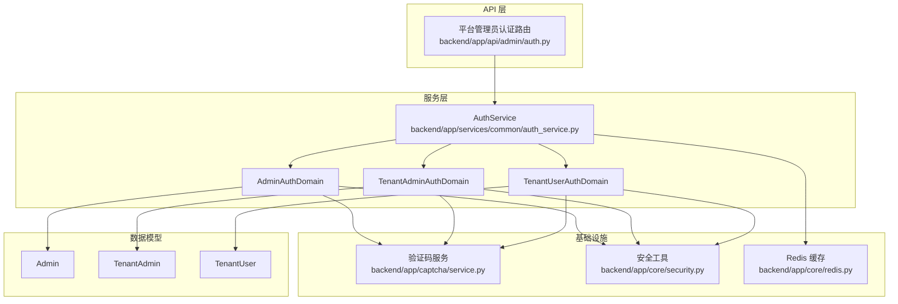
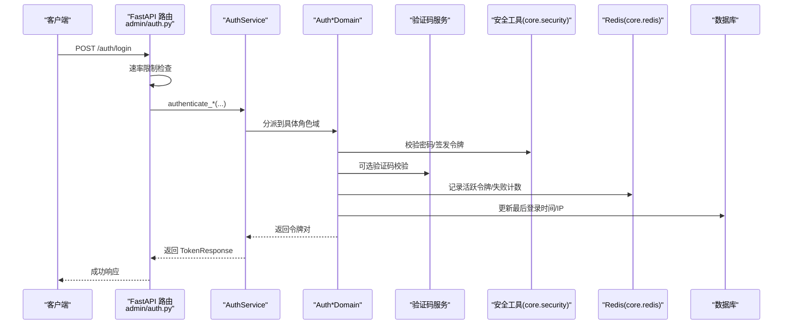
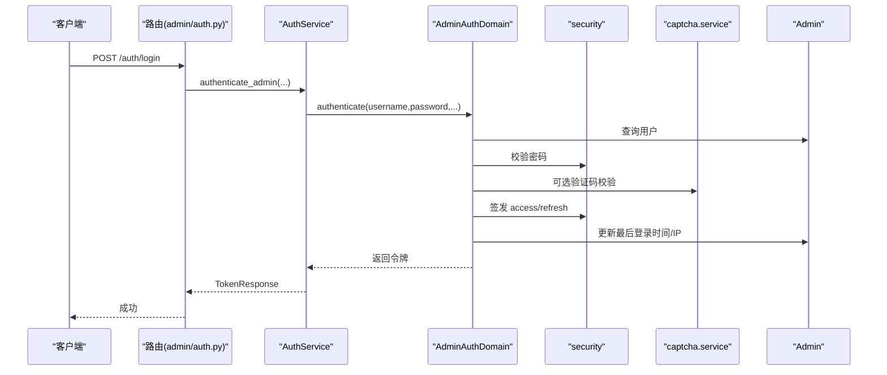
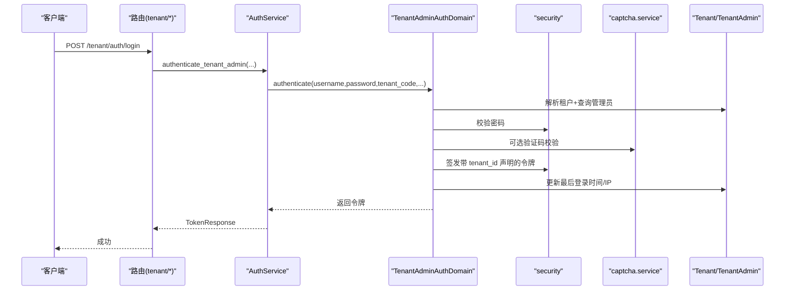
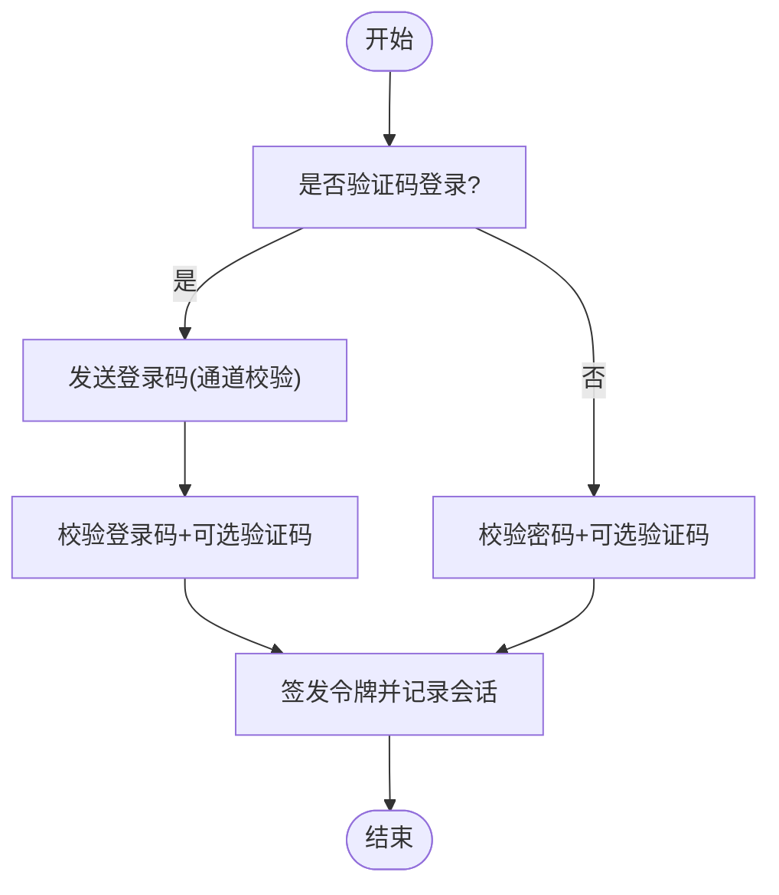
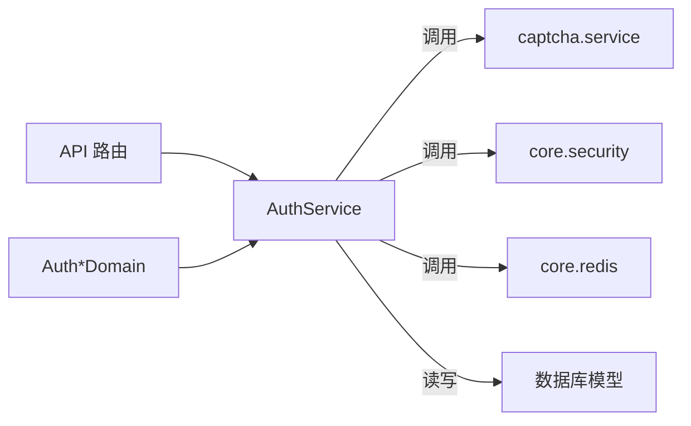

# 认证服务

<cite>
**本文引用的文件**
- [backend/app/services/common/auth_service.py](file://backend/app/services/common/auth_service.py)
- [backend/app/services/common/auth_domains/admin_auth.py](file://backend/app/services/common/auth_domains/admin_auth.py)
- [backend/app/services/common/auth_domains/tenant_admin_auth.py](file://backend/app/services/common/auth_domains/tenant_admin_auth.py)
- [backend/app/services/common/auth_domains/tenant_user_auth.py](file://backend/app/services/common/auth_domains/tenant_user_auth.py)
- [backend/app/api/admin/auth.py](file://backend/app/api/admin/auth.py)
- [backend/app/captcha/service.py](file://backend/app/captcha/service.py)
- [backend/app/core/security.py](file://backend/app/core/security.py)
- [backend/app/core/redis.py](file://backend/app/core/redis.py)
- [backend/app/models/auth/admin.py](file://backend/app/models/auth/admin.py)
- [backend/app/models/auth/tenant_admin.py](file://backend/app/models/auth/tenant_admin.py)
- [backend/app/models/auth/tenant_user.py](file://backend/app/models/auth/tenant_user.py)
- [backend/app/migrations/versions/20260123_0006_add_login_security_fields.py](file://backend/app/migrations/versions/20260123_0006_add_login_security_fields.py)
- [backend/app/migrations/versions/20260325_org_authority_rebuild.py](file://backend/app/migrations/versions/20260325_org_authority_rebuild.py)
- [backend/app/middleware/audit_log.py](file://backend/app/middleware/audit_log.py)
- [backend/app/middleware/access_control.py](file://backend/app/middleware/access_control.py)
- [backend/app/rbac/decorators.py](file://backend/app/rbac/decorators.py)
- [backend/app/schemas/common/auth.py](file://backend/app/schemas/common/auth.py)
- [backend/app/schemas/system/admin.py](file://backend/app/schemas/system/admin.py)
- [backend/app/schemas/tenant/tenant_admin.py](file://backend/app/schemas/tenant/tenant_admin.py)
- [backend/app/schemas/user/tenant_user.py](file://backend/app/schemas/user/tenant_user.py)
</cite>

## 目录
1. [简介](#简介)
2. [项目结构](#项目结构)
3. [核心组件](#核心组件)
4. [架构总览](#架构总览)
5. [详细组件分析](#详细组件分析)
6. [依赖分析](#依赖分析)
7. [性能考虑](#性能考虑)
8. [故障排查指南](#故障排查指南)
9. [结论](#结论)
10. [附录](#附录)

## 简介
本文件面向认证服务，系统性阐述平台级与租户级多角色认证体系：平台管理员、企业管理者、企业用户。文档覆盖验证码验证、登录安全策略、会话与密码管理、令牌生命周期、权限校验与审计日志、失败处理与防护措施，并给出接口设计、配置项、使用示例与安全最佳实践。

## 项目结构
认证服务采用“API 控制器 → 认证服务 → 领域域”的分层设计，配合验证码、安全工具、Redis 缓存与数据库模型，形成可扩展、可配置、可观测的认证子系统。

图表来源
- [backend/app/api/admin/auth.py:1-209](file://backend/app/api/admin/auth.py#L1-L209)
- [backend/app/services/common/auth_service.py:1-526](file://backend/app/services/common/auth_service.py#L1-L526)
- [backend/app/services/common/auth_domains/admin_auth.py:1-302](file://backend/app/services/common/auth_domains/admin_auth.py#L1-L302)
- [backend/app/services/common/auth_domains/tenant_admin_auth.py:1-567](file://backend/app/services/common/auth_domains/tenant_admin_auth.py#L1-L567)
- [backend/app/services/common/auth_domains/tenant_user_auth.py:1-194](file://backend/app/services/common/auth_domains/tenant_user_auth.py#L1-L194)
- [backend/app/captcha/service.py](file://backend/app/captcha/service.py)
- [backend/app/core/security.py](file://backend/app/core/security.py)
- [backend/app/core/redis.py](file://backend/app/core/redis.py)
- [backend/app/models/auth/admin.py](file://backend/app/models/auth/admin.py)
- [backend/app/models/auth/tenant_admin.py](file://backend/app/models/auth/tenant_admin.py)
- [backend/app/models/auth/tenant_user.py](file://backend/app/models/auth/tenant_user.py)

章节来源
- [backend/app/api/admin/auth.py:1-209](file://backend/app/api/admin/auth.py#L1-L209)
- [backend/app/services/common/auth_service.py:1-526](file://backend/app/services/common/auth_service.py#L1-L526)

## 核心组件
- 认证服务（AuthService）：统一编排三大角色认证、验证码校验、令牌签发与刷新、会话记录、登录安全与审计日志。
- 平台管理员认证域（AdminAuthDomain）：处理平台管理员登录、开发环境引导登录、Token 刷新、密码变更。
- 企业管理者认证域（TenantAdminAuthDomain）：处理租户管理员登录、租户解析、开发环境引导登录、Token 刷新、密码变更、资料更新、模拟登录（Impersonation）。
- 企业用户认证域（TenantUserAuthDomain）：封装登录、验证码登录、Token 刷新、账户操作（注册、改密、资料更新、重置密码）、登录码通道与风控。
- 安全工具（core.security）：提供 JWT 签发/校验、密码哈希、模拟登录令牌校验、作用域校验。
- Redis 缓存（core.redis）：用于验证码缓存、活跃令牌记录、登录失败计数等。
- 数据模型（models.auth.*）：Admin、TenantAdmin、TenantUser 的持久化实体。
- 验证码服务（captcha.service）：提供验证码生成、校验与配额控制。
- 中间件与装饰器：审计日志、访问控制、RBAC 装饰器等。

章节来源
- [backend/app/services/common/auth_service.py:46-526](file://backend/app/services/common/auth_service.py#L46-L526)
- [backend/app/services/common/auth_domains/admin_auth.py:21-302](file://backend/app/services/common/auth_domains/admin_auth.py#L21-L302)
- [backend/app/services/common/auth_domains/tenant_admin_auth.py:25-567](file://backend/app/services/common/auth_domains/tenant_admin_auth.py#L25-L567)
- [backend/app/services/common/auth_domains/tenant_user_auth.py:21-194](file://backend/app/services/common/auth_domains/tenant_user_auth.py#L21-L194)

## 架构总览
认证流程遵循“请求进入 API → 速率限制/参数校验 → 调用 AuthService → 分派到对应领域域 → 执行业务校验（验证码/安全策略）→ 生成令牌并记录会话 → 返回响应”的闭环。

图表来源
- [backend/app/api/admin/auth.py:29-61](file://backend/app/api/admin/auth.py#L29-L61)
- [backend/app/services/common/auth_service.py:301-332](file://backend/app/services/common/auth_service.py#L301-L332)
- [backend/app/services/common/auth_domains/admin_auth.py:71-174](file://backend/app/services/common/auth_domains/admin_auth.py#L71-L174)
- [backend/app/captcha/service.py](file://backend/app/captcha/service.py)
- [backend/app/core/security.py](file://backend/app/core/security.py)
- [backend/app/core/redis.py](file://backend/app/core/redis.py)

## 详细组件分析

### 平台管理员认证（Admin）
- 登录流程：支持用户名/邮箱登录；根据配置决定是否强制验证码；失败计数与锁定策略；成功后签发访问/刷新令牌并记录会话。
- 开发环境引导登录：通过预设密钥与主机白名单快速登录，便于本地联调。
- Token 刷新：校验刷新令牌作用域与有效性，重新签发新令牌。
- 密码变更：旧密码校验通过后执行密码策略校验并更新。

图表来源
- [backend/app/api/admin/auth.py:29-61](file://backend/app/api/admin/auth.py#L29-L61)
- [backend/app/services/common/auth_domains/admin_auth.py:71-174](file://backend/app/services/common/auth_domains/admin_auth.py#L71-L174)
- [backend/app/services/common/auth_service.py:301-332](file://backend/app/services/common/auth_service.py#L301-L332)

章节来源
- [backend/app/services/common/auth_domains/admin_auth.py:21-302](file://backend/app/services/common/auth_domains/admin_auth.py#L21-L302)
- [backend/app/api/admin/auth.py:29-129](file://backend/app/api/admin/auth.py#L29-L129)

### 企业管理者认证（TenantAdmin）
- 多租户登录：要求提供租户标识；若同一用户名在多个租户存在需显式指定租户代码；租户禁用时拒绝登录。
- 登录安全：租户级验证码开关与阈值；失败计数与锁定；成功后签发带租户声明的令牌。
- 开发环境引导登录：按租户代码解析目标租户与管理员，校验后签发令牌。
- 模拟登录（Impersonation）：平台管理员以模拟令牌进入租户所有者身份，支持角色限定与审计记录。
- 密码变更：基于租户上下文的密码策略校验。

图表来源
- [backend/app/services/common/auth_domains/tenant_admin_auth.py:126-275](file://backend/app/services/common/auth_domains/tenant_admin_auth.py#L126-L275)
- [backend/app/services/common/auth_service.py:357-390](file://backend/app/services/common/auth_service.py#L357-L390)

章节来源
- [backend/app/services/common/auth_domains/tenant_admin_auth.py:25-567](file://backend/app/services/common/auth_domains/tenant_admin_auth.py#L25-L567)

### 企业用户认证（TenantUser）
- 传统密码登录：支持用户名/邮箱与密码；租户级验证码与失败计数策略。
- 验证码登录：支持邮件/短信等通道发送登录码；登录码键空间与速率限制；可选验证码二次校验。
- Token 刷新：校验刷新令牌并签发新令牌。
- 账户操作：注册、改密、资料更新、密码重置申请与执行。
- 登录租户解析：在未提供租户代码时，依据登录码场景解析目标租户。

图表来源
- [backend/app/services/common/auth_domains/tenant_user_auth.py:31-194](file://backend/app/services/common/auth_domains/tenant_user_auth.py#L31-L194)

章节来源
- [backend/app/services/common/auth_domains/tenant_user_auth.py:21-194](file://backend/app/services/common/auth_domains/tenant_user_auth.py#L21-L194)

### 验证码验证与登录安全
- 验证码触发策略：平台/租户级开关与失败阈值；首次失败即触发或达到阈值后触发。
- 验证码服务：提供挑战/求解与提供商抽象，支持滑动/点选等类型。
- 登录安全：失败计数、账户锁定、IP/主机规则匹配、审计日志与告警字段。

章节来源
- [backend/app/services/common/auth_domains/admin_auth.py:130-153](file://backend/app/services/common/auth_domains/admin_auth.py#L130-L153)
- [backend/app/services/common/auth_domains/tenant_admin_auth.py:218-244](file://backend/app/services/common/auth_domains/tenant_admin_auth.py#L218-L244)
- [backend/app/captcha/service.py](file://backend/app/captcha/service.py)
- [backend/app/migrations/versions/20260123_0006_add_login_security_fields.py](file://backend/app/migrations/versions/20260123_0006_add_login_security_fields.py)

### 令牌管理与会话维护
- 令牌类型：访问令牌（Access Token）与刷新令牌（Refresh Token），支持作用域区分。
- 会话记录：Redis 记录活跃令牌 JTI，支持登出吊销与强制登出。
- 刷新流程：严格校验作用域与用户状态，失败时记录审计事件。
- 会话超时：平台默认与租户优先策略，支持动态配置。

章节来源
- [backend/app/services/common/auth_service.py:138-167](file://backend/app/services/common/auth_service.py#L138-L167)
- [backend/app/services/common/auth_domains/admin_auth.py:236-286](file://backend/app/services/common/auth_domains/admin_auth.py#L236-L286)
- [backend/app/services/common/auth_domains/tenant_admin_auth.py:363-419](file://backend/app/services/common/auth_domains/tenant_admin_auth.py#L363-L419)
- [backend/app/core/security.py](file://backend/app/core/security.py)
- [backend/app/core/redis.py](file://backend/app/core/redis.py)

### 权限验证与审计
- RBAC 装饰器：@auth_only/@public 等，约束接口访问范围。
- 审计中间件：统一记录登录/登出、刷新、模拟登录等事件。
- 组织权限重建：迁移脚本确保组织与权限树一致性，避免越权风险。

章节来源
- [backend/app/rbac/decorators.py](file://backend/app/rbac/decorators.py)
- [backend/app/middleware/audit_log.py](file://backend/app/middleware/audit_log.py)
- [backend/app/migrations/versions/20260325_org_authority_rebuild.py](file://backend/app/migrations/versions/20260325_org_authority_rebuild.py)

## 依赖分析
- 组件内聚：AuthService 将验证码、安全、会话、日志等横切能力聚合，各领域域专注角色业务。
- 外部依赖：Redis 用于高并发下的令牌与计数存储；数据库用于用户状态与审计；验证码服务提供图形/行为类验证。
- 风险点：验证码与登录失败计数的原子性、令牌吊销的幂等性、租户解析的歧义处理。

图表来源
- [backend/app/services/common/auth_service.py:15-43](file://backend/app/services/common/auth_service.py#L15-L43)
- [backend/app/api/admin/auth.py:26-209](file://backend/app/api/admin/auth.py#L26-L209)

章节来源
- [backend/app/services/common/auth_service.py:15-43](file://backend/app/services/common/auth_service.py#L15-L43)

## 性能考虑
- 速率限制：API 层对登录入口进行速率限制，降低暴力破解压力。
- 缓存命中：验证码与失败计数走 Redis，减少数据库热点。
- 令牌签发：JWT 无状态，避免频繁查库；刷新时仅做必要校验。
- 异步事务：数据库操作异步化，配合批量提交减少锁竞争。

## 故障排查指南
- 登录失败
  - 用户不存在/被禁用：检查用户状态与租户激活状态。
  - 验证码错误：确认验证码提供商配置与阈值设置。
  - 账户锁定：查看失败计数与锁定策略。
- 刷新失败
  - 令牌无效/作用域不符：核对令牌来源与作用域。
  - 用户被禁用：检查用户状态。
- 登出/强制登出
  - 确认 Redis 中活跃令牌记录已清理。
  - 检查审计日志中是否记录了成功吊销事件。
- 审计与防护
  - 关注审计中间件输出，定位异常 IP/主机。
  - 组织权限重建迁移后，确认权限树一致性。

章节来源
- [backend/app/services/common/auth_domains/admin_auth.py:88-118](file://backend/app/services/common/auth_domains/admin_auth.py#L88-L118)
- [backend/app/services/common/auth_domains/tenant_admin_auth.py:363-419](file://backend/app/services/common/auth_domains/tenant_admin_auth.py#L363-L419)
- [backend/app/middleware/audit_log.py](file://backend/app/middleware/audit_log.py)

## 结论
该认证服务以 AuthService 为核心，结合 Admin/TenantAdmin/TenantUser 三大领域域，实现了跨层级、可配置、可观测的认证体系。通过验证码、登录安全策略、令牌与会话管理、RBAC 与审计，满足生产级安全与可用性需求。

## 附录

### 接口设计（示例）
- 平台管理员认证
  - POST /auth/login：用户名/邮箱 + 密码（可选验证码）
  - POST /auth/dev/bootstrap：开发环境引导登录
  - POST /auth/refresh：刷新令牌
  - POST /auth/logout：登出（吊销令牌）
  - GET /auth/me：获取当前管理员信息
  - PUT /auth/password：修改密码
  - PUT /auth/profile：修改个人信息
- 企业管理者认证（路径前缀 /tenant/auth）
  - POST /login：支持租户代码与验证码
  - POST /refresh：刷新令牌
  - PUT /password：修改密码
  - PUT /profile：更新资料
  - POST /impersonate：模拟登录（平台管理员）
- 企业用户认证（路径前缀 /tenant/user/auth）
  - POST /login：密码登录
  - POST /login/code/send：发送登录码
  - POST /login/code/verify：验证码登录
  - POST /refresh：刷新令牌
  - POST /register：注册
  - PUT /password/change：改密
  - PUT /password/reset/request：申请重置
  - PUT /password/reset/confirm：确认重置

章节来源
- [backend/app/api/admin/auth.py:29-209](file://backend/app/api/admin/auth.py#L29-L209)
- [backend/app/schemas/system/admin.py](file://backend/app/schemas/system/admin.py)
- [backend/app/schemas/tenant/tenant_admin.py](file://backend/app/schemas/tenant/tenant_admin.py)
- [backend/app/schemas/user/tenant_user.py](file://backend/app/schemas/user/tenant_user.py)

### 配置选项（关键）
- 平台级
  - session_timeout_minutes：默认会话超时（分钟）
  - login_captcha_enabled：登录验证码开关
  - captcha_enable_threshold_admin：管理员验证码阈值
- 租户级
  - tenant_captcha_enabled：租户验证码开关
  - tenant_captcha_enable_threshold：租户验证码阈值
  - tenant_session_timeout：租户会话超时（优先于平台）

章节来源
- [backend/app/services/common/auth_domains/admin_auth.py:37-40](file://backend/app/services/common/auth_domains/admin_auth.py#L37-L40)
- [backend/app/services/common/auth_domains/tenant_admin_auth.py:81-90](file://backend/app/services/common/auth_domains/tenant_admin_auth.py#L81-L90)

### 使用示例（步骤）
- 管理员登录
  - 调用 /auth/login，传入 username/password（必要时附带验证码）
  - 成功后获得 access_token/refresh_token
- 企业用户验证码登录
  - 先调用 /tenant/user/auth/login/code/send 发送登录码
  - 再调用 /tenant/user/auth/login/code/verify 提交验证码
- 刷新令牌
  - 使用 refresh_token 调用 /auth/refresh 或 /tenant/auth/refresh
- 登出
  - 调用 /auth/logout，携带 Bearer access_token

章节来源
- [backend/app/api/admin/auth.py:29-129](file://backend/app/api/admin/auth.py#L29-L129)
- [backend/app/services/common/auth_service.py:478-482](file://backend/app/services/common/auth_service.py#L478-L482)

### 安全最佳实践
- 强制验证码：在失败阈值较低或高风险区域启用验证码。
- 最小权限：RBAC 严格控制接口访问，避免越权。
- 会话安全：短会话超时、定期刷新、登出立即吊销。
- 审计留痕：所有关键事件均记录审计日志，保留追踪证据。
- 密码策略：启用复杂度与历史密码限制，定期轮换。
- 网络隔离：开发环境引导登录仅在受控主机启用，密钥严格保密。