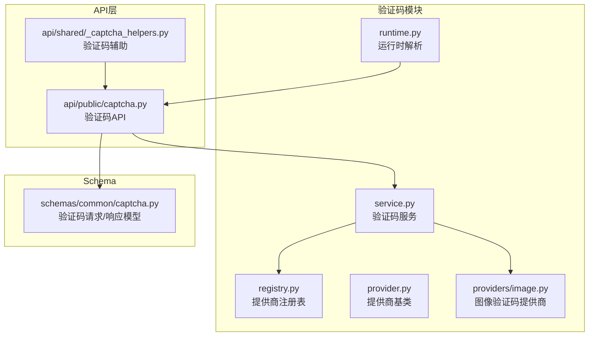
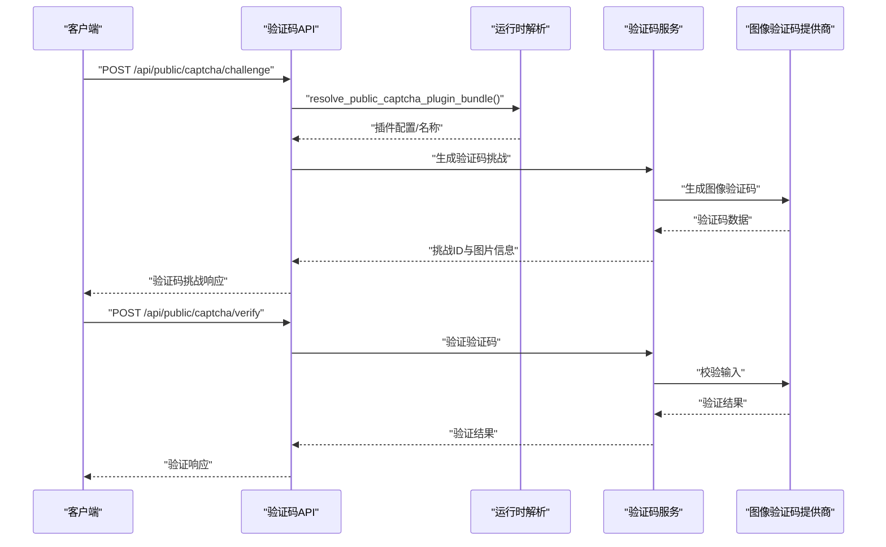
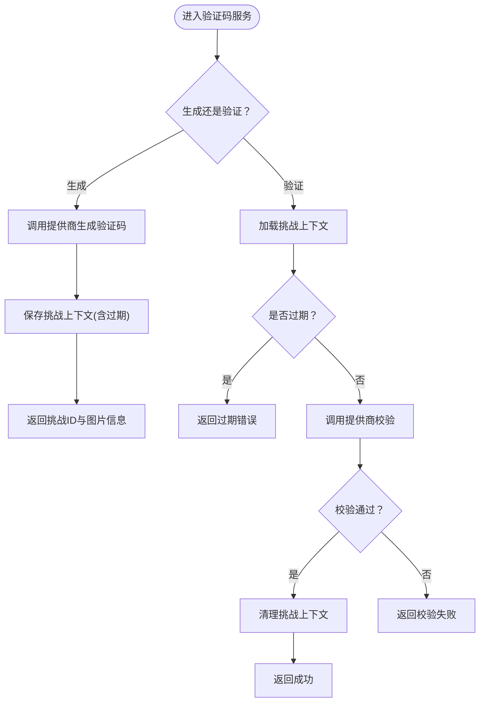
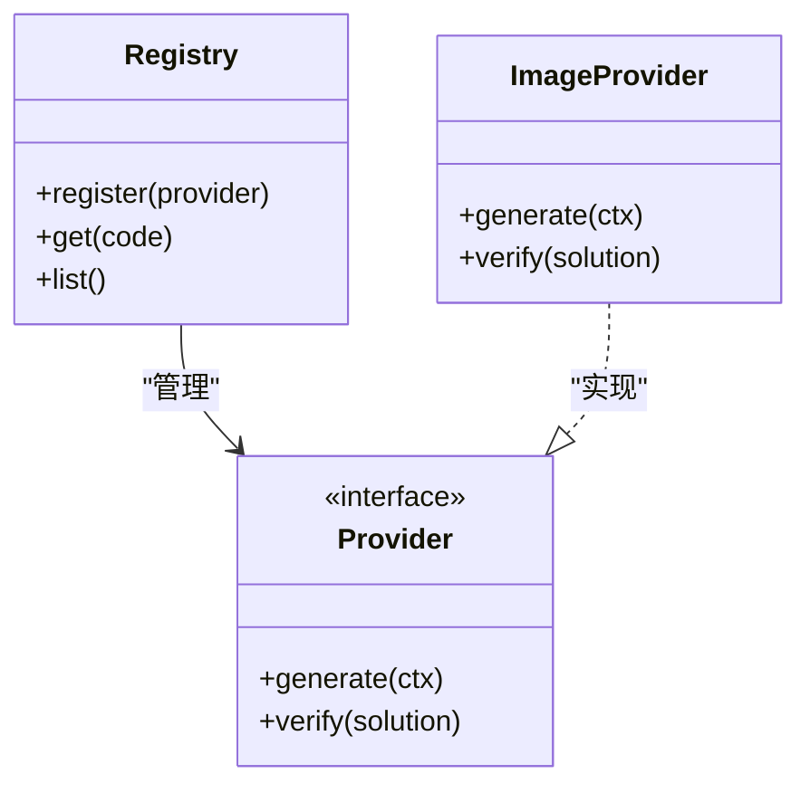
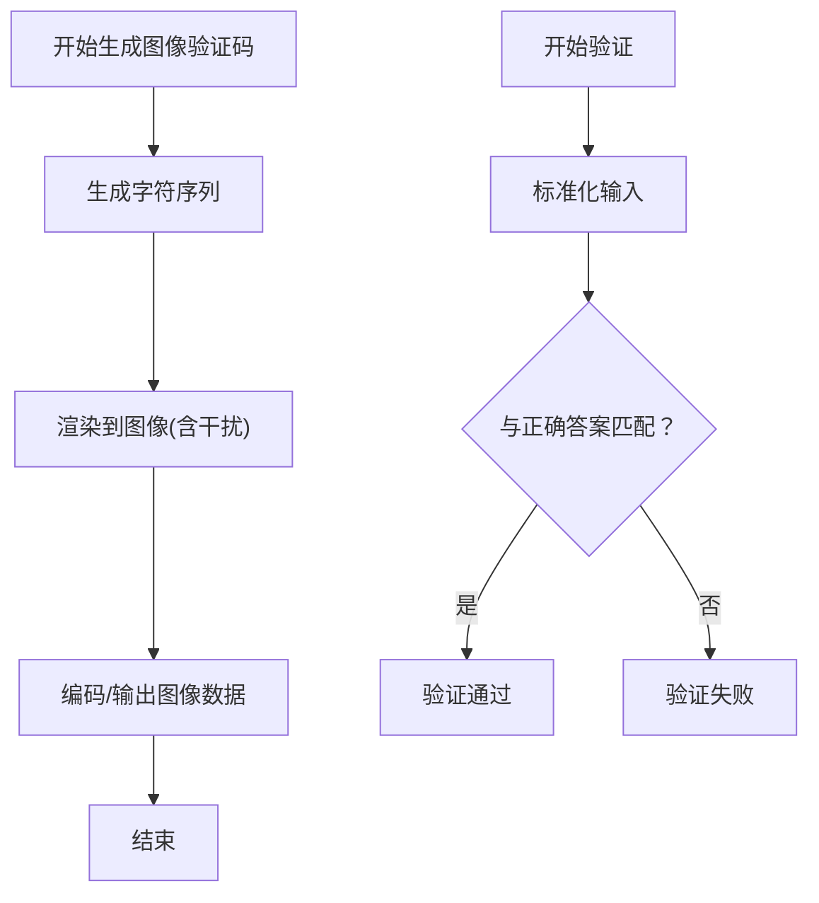
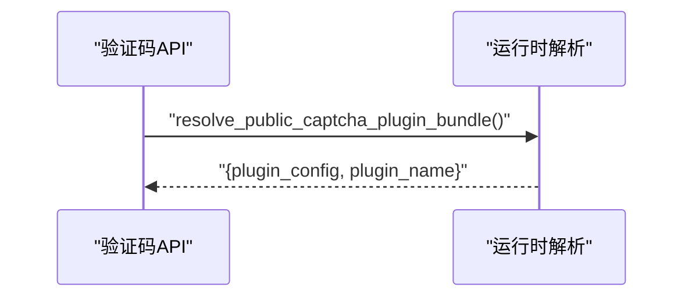
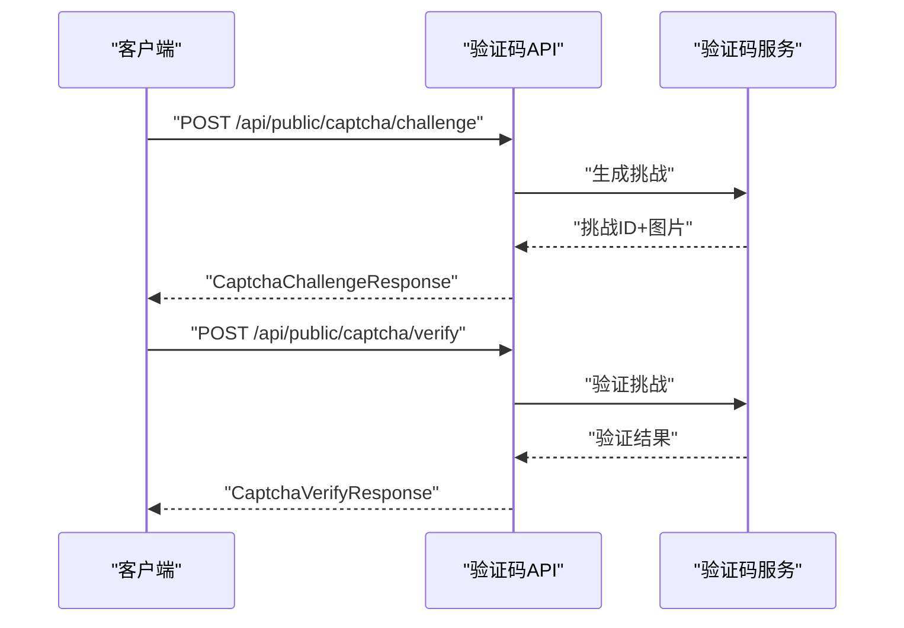
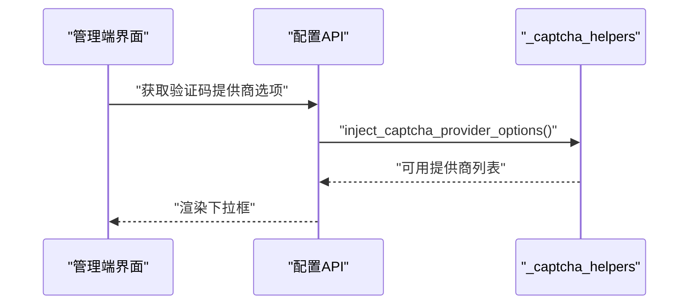
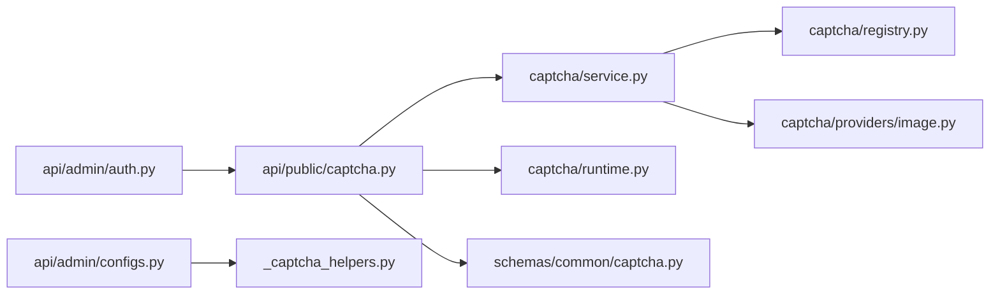

# 验证码验证

<cite>
**本文引用的文件**
- [backend/app/captcha/provider.py](file://backend/app/captcha/provider.py)
- [backend/app/captcha/registry.py](file://backend/app/captcha/registry.py)
- [backend/app/captcha/runtime.py](file://backend/app/captcha/runtime.py)
- [backend/app/captcha/service.py](file://backend/app/captcha/service.py)
- [backend/app/captcha/providers/image.py](file://backend/app/captcha/providers/image.py)
- [backend/app/api/public/captcha.py](file://backend/app/api/public/captcha.py)
- [backend/app/api/shared/_captcha_helpers.py](file://backend/app/api/shared/_captcha_helpers.py)
- [backend/app/schemas/common/captcha.py](file://backend/app/schemas/common/captcha.py)
- [backend/app/api/admin/auth.py](file://backend/app/api/admin/auth.py)
- [backend/app/api/admin/configs.py](file://backend/app/api/admin/configs.py)
</cite>

## 目录
1. [简介](#简介)
2. [项目结构](#项目结构)
3. [核心组件](#核心组件)
4. [架构总览](#架构总览)
5. [详细组件分析](#详细组件分析)
6. [依赖关系分析](#依赖关系分析)
7. [性能与可用性](#性能与可用性)
8. [故障排查指南](#故障排查指南)
9. [结论](#结论)
10. [附录](#附录)

## 简介
本技术文档围绕验证码验证模块进行系统化说明，覆盖验证码生成、验证与管理的完整流程，重点阐述图形验证码的生成算法、验证逻辑与安全策略；详解验证码服务的实现机制（存储、过期处理、防暴力破解）；文档化验证码API设计与实现（获取验证码挑战、验证验证码、清理机制）；解释安全边界与防护措施（频率限制、IP限制、用户行为分析）；并提供错误处理、性能优化与用户体验建议，以及配置项、集成示例与安全最佳实践。

## 项目结构
验证码模块位于后端应用目录下，采用“服务层 + 提供商插件 + 运行时解析 + API路由”的分层组织方式：
- 服务层：负责验证码生命周期管理（生成、验证、清理）
- 提供商插件：当前包含图像验证码提供商
- 运行时解析：根据上下文解析可用的验证码插件包
- API路由：对外暴露验证码挑战获取与验证接口

图表来源
- [backend/app/captcha/service.py](file://backend/app/captcha/service.py)
- [backend/app/captcha/registry.py](file://backend/app/captcha/registry.py)
- [backend/app/captcha/runtime.py](file://backend/app/captcha/runtime.py)
- [backend/app/captcha/provider.py](file://backend/app/captcha/provider.py)
- [backend/app/captcha/providers/image.py](file://backend/app/captcha/providers/image.py)
- [backend/app/api/public/captcha.py](file://backend/app/api/public/captcha.py)
- [backend/app/api/shared/_captcha_helpers.py](file://backend/app/api/shared/_captcha_helpers.py)
- [backend/app/schemas/common/captcha.py](file://backend/app/schemas/common/captcha.py)

章节来源
- [backend/app/captcha/service.py](file://backend/app/captcha/service.py)
- [backend/app/captcha/registry.py](file://backend/app/captcha/registry.py)
- [backend/app/captcha/runtime.py](file://backend/app/captcha/runtime.py)
- [backend/app/captcha/provider.py](file://backend/app/captcha/provider.py)
- [backend/app/captcha/providers/image.py](file://backend/app/captcha/providers/image.py)
- [backend/app/api/public/captcha.py](file://backend/app/api/public/captcha.py)
- [backend/app/api/shared/_captcha_helpers.py](file://backend/app/api/shared/_captcha_helpers.py)
- [backend/app/schemas/common/captcha.py](file://backend/app/schemas/common/captcha.py)

## 核心组件
- 验证码服务（service.py）：封装验证码生成、验证与清理的业务逻辑，协调提供商与存储
- 提供商注册表（registry.py）：集中管理可插拔的验证码提供商
- 图像验证码提供商（providers/image.py）：实现图形验证码的生成与校验
- 运行时解析（runtime.py）：在请求上下文中解析并返回可用的验证码插件配置
- 公共API（api/public/captcha.py）：对外提供验证码挑战获取与验证接口
- Schema（schemas/common/captcha.py）：定义验证码请求/响应的数据结构
- 辅助工具（api/shared/_captcha_helpers.py）：为管理端配置注入验证码提供商选项
- 登录集成（api/admin/auth.py）：在登录流程中调用验证码验证
- 管理端配置（api/admin/configs.py）：展示与选择验证码提供商

章节来源
- [backend/app/captcha/service.py](file://backend/app/captcha/service.py)
- [backend/app/captcha/registry.py](file://backend/app/captcha/registry.py)
- [backend/app/captcha/providers/image.py](file://backend/app/captcha/providers/image.py)
- [backend/app/captcha/runtime.py](file://backend/app/captcha/runtime.py)
- [backend/app/api/public/captcha.py](file://backend/app/api/public/captcha.py)
- [backend/app/schemas/common/captcha.py](file://backend/app/schemas/common/captcha.py)
- [backend/app/api/shared/_captcha_helpers.py](file://backend/app/api/shared/_captcha_helpers.py)
- [backend/app/api/admin/auth.py](file://backend/app/api/admin/auth.py)
- [backend/app/api/admin/configs.py](file://backend/app/api/admin/configs.py)

## 架构总览
验证码模块遵循“服务-提供商-运行时-API”的分层架构，通过注册表实现多提供商扩展，运行时解析决定具体使用的提供商，API层提供统一的外部接口。

图表来源
- [backend/app/api/public/captcha.py](file://backend/app/api/public/captcha.py)
- [backend/app/captcha/runtime.py](file://backend/app/captcha/runtime.py)
- [backend/app/captcha/service.py](file://backend/app/captcha/service.py)
- [backend/app/captcha/providers/image.py](file://backend/app/captcha/providers/image.py)

## 详细组件分析

### 组件A：验证码服务（service.py）
职责与流程
- 生成验证码挑战：调用提供商生成验证码，并持久化挑战上下文（含过期时间）
- 验证验证码：接收用户输入，调用提供商校验，更新或清理挑战状态
- 清理过期挑战：定期扫描并移除超时未验证的挑战
- 错误处理：对无效输入、过期挑战、校验失败等情况返回明确错误

复杂度与性能
- 生成/验证操作通常为O(1)，主要开销在提供商生成与存储IO
- 建议使用缓存键空间隔离与批量清理降低Redis压力

安全策略
- 挑战ID随机且不可预测
- 严格过期控制与一次性使用
- 防暴力破解：结合频率限制与IP/会话维度统计

图表来源
- [backend/app/captcha/service.py](file://backend/app/captcha/service.py)
- [backend/app/captcha/providers/image.py](file://backend/app/captcha/providers/image.py)

章节来源
- [backend/app/captcha/service.py](file://backend/app/captcha/service.py)

### 组件B：提供商注册表（registry.py）
职责与流程
- 注册与发现：维护可用的验证码提供商列表
- 选择策略：根据上下文或配置选择合适的提供商实例
- 扩展点：新增提供商时仅需实现提供商接口并注册

图表来源
- [backend/app/captcha/registry.py](file://backend/app/captcha/registry.py)
- [backend/app/captcha/provider.py](file://backend/app/captcha/provider.py)
- [backend/app/captcha/providers/image.py](file://backend/app/captcha/providers/image.py)

章节来源
- [backend/app/captcha/registry.py](file://backend/app/captcha/registry.py)
- [backend/app/captcha/provider.py](file://backend/app/captcha/provider.py)
- [backend/app/captcha/providers/image.py](file://backend/app/captcha/providers/image.py)

### 组件C：图像验证码提供商（providers/image.py）
职责与流程
- 生成算法：生成带干扰元素的图像验证码，包含字符集、扭曲、噪声等
- 验证逻辑：对用户输入进行大小写不敏感比较与容差处理
- 安全策略：字符集与长度控制、抗机器识别的渲染参数、防爆破的过期与尝试上限

图表来源
- [backend/app/captcha/providers/image.py](file://backend/app/captcha/providers/image.py)

章节来源
- [backend/app/captcha/providers/image.py](file://backend/app/captcha/providers/image.py)

### 组件D：运行时解析（runtime.py）
职责与流程
- 解析公共场景下的验证码插件包：返回插件配置与名称
- 与API协作：在挑战/验证请求中注入插件上下文

图表来源
- [backend/app/captcha/runtime.py](file://backend/app/captcha/runtime.py)
- [backend/app/api/public/captcha.py](file://backend/app/api/public/captcha.py)

章节来源
- [backend/app/captcha/runtime.py](file://backend/app/captcha/runtime.py)
- [backend/app/api/public/captcha.py](file://backend/app/api/public/captcha.py)

### 组件E：公共API（api/public/captcha.py）
职责与流程
- 获取验证码挑战：返回挑战ID与图片信息，支持按提供商代码选择
- 验证验证码：接收挑战ID与用户输入，返回验证结果
- 插件上下文：在响应中注入插件配置与名称

图表来源
- [backend/app/api/public/captcha.py](file://backend/app/api/public/captcha.py)
- [backend/app/captcha/service.py](file://backend/app/captcha/service.py)

章节来源
- [backend/app/api/public/captcha.py](file://backend/app/api/public/captcha.py)
- [backend/app/schemas/common/captcha.py](file://backend/app/schemas/common/captcha.py)

### 组件F：Schema（schemas/common/captcha.py）
职责与流程
- 定义验证码挑战请求/响应模型
- 定义验证码验证请求/响应模型
- 保证API输入输出的类型一致性与校验

章节来源
- [backend/app/schemas/common/captcha.py](file://backend/app/schemas/common/captcha.py)

### 组件G：辅助与集成（api/shared/_captcha_helpers.py、api/admin/auth.py、api/admin/configs.py）
职责与流程
- 辅助工具：为管理端配置页面注入验证码提供商选项
- 登录集成：在登录流程中传入挑战ID、解决方案与提供商代码
- 管理端配置：展示与选择验证码提供商

图表来源
- [backend/app/api/shared/_captcha_helpers.py](file://backend/app/api/shared/_captcha_helpers.py)
- [backend/app/api/admin/configs.py](file://backend/app/api/admin/configs.py)

章节来源
- [backend/app/api/shared/_captcha_helpers.py](file://backend/app/api/shared/_captcha_helpers.py)
- [backend/app/api/admin/auth.py](file://backend/app/api/admin/auth.py)
- [backend/app/api/admin/configs.py](file://backend/app/api/admin/configs.py)

## 依赖关系分析
- API层依赖验证码服务与运行时解析
- 服务层依赖提供商注册表与具体提供商实现
- Schema为API与服务层提供数据契约
- 管理端配置与辅助工具用于插件选项注入

图表来源
- [backend/app/api/public/captcha.py](file://backend/app/api/public/captcha.py)
- [backend/app/captcha/service.py](file://backend/app/captcha/service.py)
- [backend/app/captcha/runtime.py](file://backend/app/captcha/runtime.py)
- [backend/app/captcha/registry.py](file://backend/app/captcha/registry.py)
- [backend/app/captcha/providers/image.py](file://backend/app/captcha/providers/image.py)
- [backend/app/schemas/common/captcha.py](file://backend/app/schemas/common/captcha.py)
- [backend/app/api/shared/_captcha_helpers.py](file://backend/app/api/shared/_captcha_helpers.py)
- [backend/app/api/admin/auth.py](file://backend/app/api/admin/auth.py)
- [backend/app/api/admin/configs.py](file://backend/app/api/admin/configs.py)

章节来源
- [backend/app/api/public/captcha.py](file://backend/app/api/public/captcha.py)
- [backend/app/captcha/service.py](file://backend/app/captcha/service.py)
- [backend/app/captcha/runtime.py](file://backend/app/captcha/runtime.py)
- [backend/app/captcha/registry.py](file://backend/app/captcha/registry.py)
- [backend/app/captcha/providers/image.py](file://backend/app/captcha/providers/image.py)
- [backend/app/schemas/common/captcha.py](file://backend/app/schemas/common/captcha.py)
- [backend/app/api/shared/_captcha_helpers.py](file://backend/app/api/shared/_captcha_helpers.py)
- [backend/app/api/admin/auth.py](file://backend/app/api/admin/auth.py)
- [backend/app/api/admin/configs.py](file://backend/app/api/admin/configs.py)

## 性能与可用性
- 存储与过期：建议使用带TTL的键值存储，设置合理过期时间与清理周期
- 缓存策略：对频繁访问的挑战元数据进行缓存，减少数据库压力
- 并发与锁：验证时采用原子操作或分布式锁避免竞态
- 资源渲染：图像验证码生成应限制并发与内存占用，必要时启用异步队列
- 用户体验：提供刷新挑战、错误提示与重试机制；对移动端适配图片尺寸与交互

## 故障排查指南
常见问题与处理
- 验证码过期：检查服务端过期时间与客户端刷新策略
- 验证失败：确认输入标准化与容差设置；核对挑战ID有效性
- 插件不可用：确认运行时解析返回的插件配置与名称
- 频繁失败导致封禁：结合频率限制与IP白名单策略

章节来源
- [backend/app/captcha/service.py](file://backend/app/captcha/service.py)
- [backend/app/captcha/runtime.py](file://backend/app/captcha/runtime.py)
- [backend/app/api/public/captcha.py](file://backend/app/api/public/captcha.py)

## 结论
验证码模块通过清晰的分层设计与插件化架构，实现了可扩展、可配置、可审计的验证码能力。服务层承担核心业务逻辑，提供商层抽象渲染与校验细节，运行时解析与API层提供灵活接入。配合完善的Schema与管理端集成，可在保障安全性的同时提升用户体验。

## 附录

### 验证码API设计与实现要点
- 获取验证码挑战
  - 请求：包含提供商代码（可选）
  - 响应：挑战ID、图片信息、插件配置
- 验证验证码
  - 请求：挑战ID、用户输入、提供商代码
  - 响应：验证结果（通过/失败/过期）
- 清理机制
  - 自动清理：过期挑战定时清理
  - 主动清理：验证通过后立即清理

章节来源
- [backend/app/api/public/captcha.py](file://backend/app/api/public/captcha.py)
- [backend/app/schemas/common/captcha.py](file://backend/app/schemas/common/captcha.py)

### 安全边界与防护措施
- 频率限制：基于IP/会话/账号维度限制请求速率
- IP限制：对异常来源进行临时封禁或增强校验
- 用户行为分析：检测自动化脚本与异常模式
- 传输安全：HTTPS强制、响应头安全策略
- 存储安全：挑战数据加密、最小化保留时间

### 配置选项与集成示例
- 配置项
  - 验证码提供商代码与名称
  - 图像验证码字符集、长度、字体、干扰强度
  - 过期时间、最大尝试次数
  - 频率限制阈值与窗口
- 集成示例
  - 管理端配置页面注入提供商选项
  - 登录流程中携带挑战ID与解决方案
  - 前端轮询刷新挑战与提交验证

章节来源
- [backend/app/api/shared/_captcha_helpers.py](file://backend/app/api/shared/_captcha_helpers.py)
- [backend/app/api/admin/configs.py](file://backend/app/api/admin/configs.py)
- [backend/app/api/admin/auth.py](file://backend/app/api/admin/auth.py)