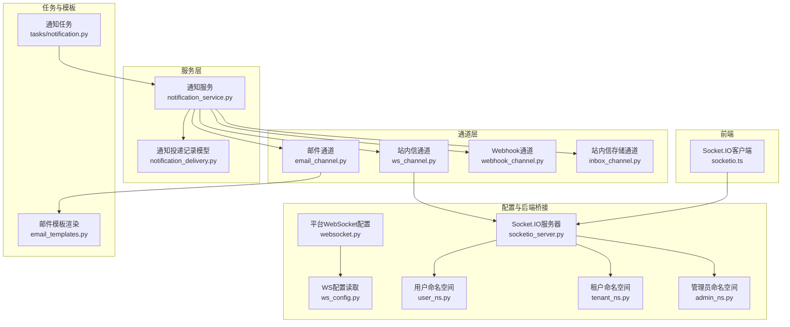
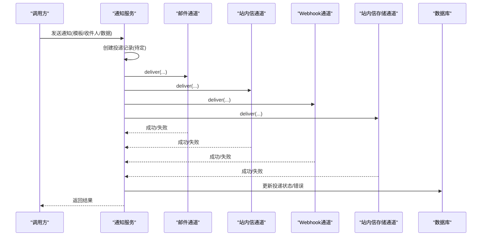
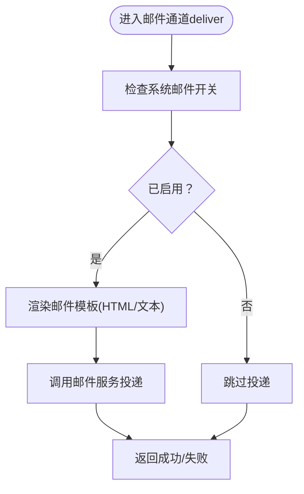
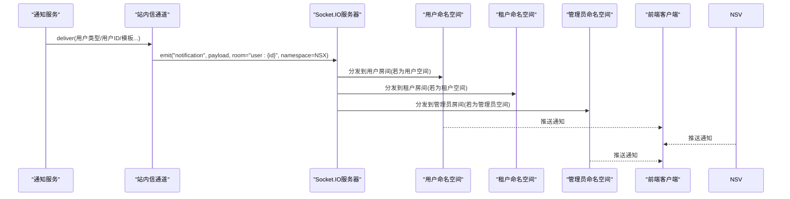
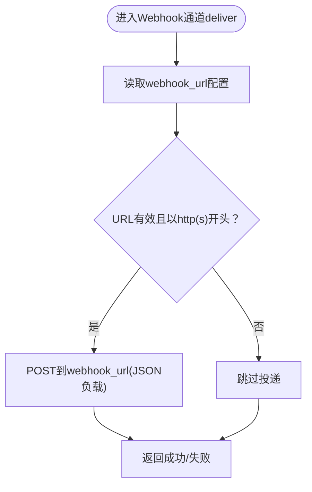
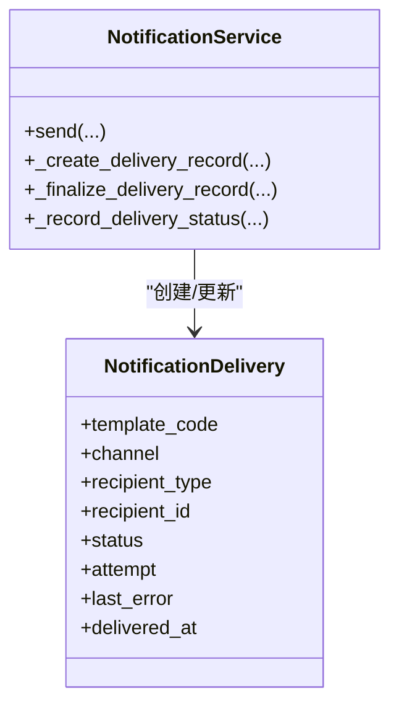
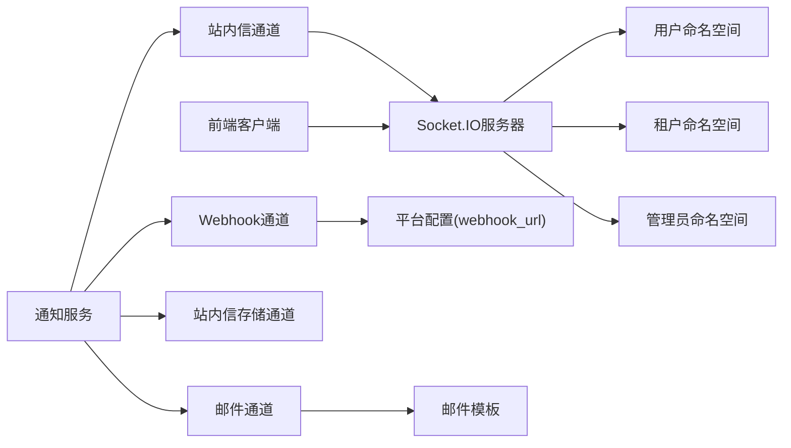

# 消息通道

<cite>
**本文引用的文件**
- [backend/app/services/common/channels/email_channel.py](file://backend/app/services/common/channels/email_channel.py)
- [backend/app/services/common/channels/ws_channel.py](file://backend/app/services/common/channels/ws_channel.py)
- [backend/app/services/common/channels/webhook_channel.py](file://backend/app/services/common/channels/webhook_channel.py)
- [backend/app/services/common/channels/inbox_channel.py](file://backend/app/services/common/channels/inbox_channel.py)
- [backend/app/services/common/notification_service.py](file://backend/app/services/common/notification_service.py)
- [backend/app/models/common/notification_delivery.py](file://backend/app/models/common/notification_delivery.py)
- [backend/app/configs/definitions/platform/websocket.py](file://backend/app/configs/definitions/platform/websocket.py)
- [backend/app/sio/user_ns.py](file://backend/app/sio/user_ns.py)
- [backend/app/sio/tenant_ns.py](file://backend/app/sio/tenant_ns.py)
- [backend/app/sio/admin_ns.py](file://backend/app/sio/admin_ns.py)
- [backend/app/sio/ws_config.py](file://backend/app/sio/ws_config.py)
- [backend/app/core/socketio_server.py](file://backend/app/core/socketio_server.py)
- [backend/app/tasks/notification.py](file://backend/app/tasks/notification.py)
- [backend/app/services/common/email_templates.py](file://backend/app/services/common/email_templates.py)
- [frontend/apps/web-antd/src/store/shared/socketio.ts](file://frontend/apps/web-antd/src/store/shared/socketio.ts)
</cite>

## 目录
1. [引言](#引言)
2. [项目结构](#项目结构)
3. [核心组件](#核心组件)
4. [架构总览](#架构总览)
5. [详细组件分析](#详细组件分析)
6. [依赖关系分析](#依赖关系分析)
7. [性能考量](#性能考量)
8. [故障排查指南](#故障排查指南)
9. [结论](#结论)
10. [附录](#附录)

## 引言
本技术文档聚焦于消息通道系统，涵盖邮件通道、站内信通道、Webhook通道与WebSocket通道的实现架构与运行机制。文档从消息格式、传输协议、可靠性保障、命名空间设计、路由策略、负载均衡与故障转移、配置最佳实践、性能优化与安全注意事项等方面进行系统化说明，并提供自定义通道的开发指南与集成示例。

## 项目结构
消息通道系统主要由以下层次构成：
- 通道层：负责具体投递实现（邮件、站内信、Webhook、WebSocket）
- 服务层：通知服务编排通道选择、投递执行与状态记录
- 配置层：平台级 WebSocket 与通道开关配置
- 前端层：Socket.IO 客户端连接与事件处理
- 任务层：异步通知任务调度与清理
- 数据模型层：通知投递记录与失败追踪

图表来源
- [backend/app/services/common/channels/email_channel.py](file://backend/app/services/common/channels/email_channel.py)
- [backend/app/services/common/channels/ws_channel.py](file://backend/app/services/common/channels/ws_channel.py)
- [backend/app/services/common/channels/webhook_channel.py](file://backend/app/services/common/channels/webhook_channel.py)
- [backend/app/services/common/channels/inbox_channel.py](file://backend/app/services/common/channels/inbox_channel.py)
- [backend/app/services/common/notification_service.py](file://backend/app/services/common/notification_service.py)
- [backend/app/models/common/notification_delivery.py](file://backend/app/models/common/notification_delivery.py)
- [backend/app/configs/definitions/platform/websocket.py](file://backend/app/configs/definitions/platform/websocket.py)
- [backend/app/sio/user_ns.py](file://backend/app/sio/user_ns.py)
- [backend/app/sio/tenant_ns.py](file://backend/app/sio/tenant_ns.py)
- [backend/app/sio/admin_ns.py](file://backend/app/sio/admin_ns.py)
- [backend/app/sio/ws_config.py](file://backend/app/sio/ws_config.py)
- [backend/app/core/socketio_server.py](file://backend/app/core/socketio_server.py)
- [backend/app/tasks/notification.py](file://backend/app/tasks/notification.py)
- [backend/app/services/common/email_templates.py](file://backend/app/services/common/email_templates.py)
- [frontend/apps/web-antd/src/store/shared/socketio.ts](file://frontend/apps/web-antd/src/store/shared/socketio.ts)

章节来源
- [backend/app/services/common/channels/email_channel.py](file://backend/app/services/common/channels/email_channel.py)
- [backend/app/services/common/channels/ws_channel.py](file://backend/app/services/common/channels/ws_channel.py)
- [backend/app/services/common/channels/webhook_channel.py](file://backend/app/services/common/channels/webhook_channel.py)
- [backend/app/services/common/channels/inbox_channel.py](file://backend/app/services/common/channels/inbox_channel.py)
- [backend/app/services/common/notification_service.py](file://backend/app/services/common/notification_service.py)
- [backend/app/models/common/notification_delivery.py](file://backend/app/models/common/notification_delivery.py)
- [backend/app/configs/definitions/platform/websocket.py](file://backend/app/configs/definitions/platform/websocket.py)
- [backend/app/sio/user_ns.py](file://backend/app/sio/user_ns.py)
- [backend/app/sio/tenant_ns.py](file://backend/app/sio/tenant_ns.py)
- [backend/app/sio/admin_ns.py](file://backend/app/sio/admin_ns.py)
- [backend/app/sio/ws_config.py](file://backend/app/sio/ws_config.py)
- [backend/app/core/socketio_server.py](file://backend/app/core/socketio_server.py)
- [backend/app/tasks/notification.py](file://backend/app/tasks/notification.py)
- [backend/app/services/common/email_templates.py](file://backend/app/services/common/email_templates.py)
- [frontend/apps/web-antd/src/store/shared/socketio.ts](file://frontend/apps/web-antd/src/store/shared/socketio.ts)

## 核心组件
- 通知服务：统一编排通道投递、创建投递记录、更新投递状态与错误信息
- 通道实现：
  - 邮件通道：基于系统配置开关与模板渲染，投递至外部邮件服务
  - 站内信通道：通过 Socket.IO 向指定用户与命名空间推送实时消息
  - Webhook通道：按配置向指定URL发起HTTP请求投递
  - 站内信存储通道：将通知写入数据库以便后续检索与展示
- 配置与命名空间：平台级 WebSocket 开关与参数，以及用户/租户/管理员三类命名空间
- 前端客户端：自动连接、事件绑定、断线重连与登出重置
- 任务与模板：异步通知任务与邮件HTML/文本模板渲染

章节来源
- [backend/app/services/common/notification_service.py](file://backend/app/services/common/notification_service.py)
- [backend/app/services/common/channels/email_channel.py](file://backend/app/services/common/channels/email_channel.py)
- [backend/app/services/common/channels/ws_channel.py](file://backend/app/services/common/channels/ws_channel.py)
- [backend/app/services/common/channels/webhook_channel.py](file://backend/app/services/common/channels/webhook_channel.py)
- [backend/app/services/common/channels/inbox_channel.py](file://backend/app/services/common/channels/inbox_channel.py)
- [backend/app/configs/definitions/platform/websocket.py](file://backend/app/configs/definitions/platform/websocket.py)
- [backend/app/sio/user_ns.py](file://backend/app/sio/user_ns.py)
- [backend/app/sio/tenant_ns.py](file://backend/app/sio/tenant_ns.py)
- [backend/app/sio/admin_ns.py](file://backend/app/sio/admin_ns.py)
- [frontend/apps/web-antd/src/store/shared/socketio.ts](file://frontend/apps/web-antd/src/store/shared/socketio.ts)

## 架构总览
消息通道系统采用“服务编排 + 多通道并行”的架构模式。通知服务根据模板与接收者选择通道，通道各自完成投递并返回结果；服务层统一记录投递状态与错误，便于审计与重试。

图表来源
- [backend/app/services/common/notification_service.py](file://backend/app/services/common/notification_service.py)
- [backend/app/services/common/channels/email_channel.py](file://backend/app/services/common/channels/email_channel.py)
- [backend/app/services/common/channels/ws_channel.py](file://backend/app/services/common/channels/ws_channel.py)
- [backend/app/services/common/channels/webhook_channel.py](file://backend/app/services/common/channels/webhook_channel.py)
- [backend/app/services/common/channels/inbox_channel.py](file://backend/app/services/common/channels/inbox_channel.py)
- [backend/app/models/common/notification_delivery.py](file://backend/app/models/common/notification_delivery.py)

## 详细组件分析

### 邮件通道
- 功能职责：基于系统配置判断是否启用，使用模板渲染生成HTML/文本内容，投递至外部邮件服务
- 消息格式：
  - 主题：来自模板渲染
  - 正文：HTML与纯文本双版本
  - 附加字段：优先级、链接、业务数据等
- 传输协议：通过邮件服务接口（具体实现由邮件适配器负责），不直接暴露在通道代码中
- 可靠性保证：
  - 通道级开关控制
  - 通知服务记录投递状态与错误
- 性能与安全：
  - 使用模板渲染避免重复逻辑
  - 邮件模板支持国际化
  - 错误与重试由上层服务统一处理

图表来源
- [backend/app/services/common/channels/email_channel.py](file://backend/app/services/common/channels/email_channel.py)
- [backend/app/services/common/email_templates.py](file://backend/app/services/common/email_templates.py)

章节来源
- [backend/app/services/common/channels/email_channel.py](file://backend/app/services/common/channels/email_channel.py)
- [backend/app/services/common/email_templates.py](file://backend/app/services/common/email_templates.py)

### 站内信通道（WebSocket）
- 功能职责：通过 Socket.IO 向指定用户与命名空间推送实时通知
- 消息格式：
  - 事件名："notification"
  - 负载字段：type（模板编码）、category（模板前缀）、title、body、data、link、priority
- 传输协议：Socket.IO（基于WebSocket），房间订阅 user:{userId}
- 命名空间设计：
  - 用户空间：/user
  - 租户空间：/tenant
  - 管理员空间：/admin
- 可靠性保证：
  - 通道返回布尔结果，失败时由通知服务记录错误
  - 前端具备断线重连与处理器重绑能力
- 性能与安全：
  - 房间粒度精确投递，避免广播风暴
  - 命名空间隔离不同角色权限域

图表来源
- [backend/app/services/common/channels/ws_channel.py](file://backend/app/services/common/channels/ws_channel.py)
- [backend/app/sio/user_ns.py](file://backend/app/sio/user_ns.py)
- [backend/app/sio/tenant_ns.py](file://backend/app/sio/tenant_ns.py)
- [backend/app/sio/admin_ns.py](file://backend/app/sio/admin_ns.py)
- [backend/app/core/socketio_server.py](file://backend/app/core/socketio_server.py)
- [frontend/apps/web-antd/src/store/shared/socketio.ts](file://frontend/apps/web-antd/src/store/shared/socketio.ts)

章节来源
- [backend/app/services/common/channels/ws_channel.py](file://backend/app/services/common/channels/ws_channel.py)
- [backend/app/sio/user_ns.py](file://backend/app/sio/user_ns.py)
- [backend/app/sio/tenant_ns.py](file://backend/app/sio/tenant_ns.py)
- [backend/app/sio/admin_ns.py](file://backend/app/sio/admin_ns.py)
- [backend/app/core/socketio_server.py](file://backend/app/core/socketio_server.py)
- [frontend/apps/web-antd/src/store/shared/socketio.ts](file://frontend/apps/web-antd/src/store/shared/socketio.ts)

### Webhook通道
- 功能职责：按配置向指定URL发起HTTP请求投递通知
- 消息格式：与站内信通道一致的通知负载（JSON）
- 传输协议：HTTP(S) POST
- 可靠性保证：
  - 通道级开关与URL校验
  - 失败时由通知服务记录错误
- 性能与安全：
  - URL白名单与长度限制
  - 建议配合幂等与重试策略

图表来源
- [backend/app/services/common/channels/webhook_channel.py](file://backend/app/services/common/channels/webhook_channel.py)
- [backend/app/configs/definitions/platform/websocket.py](file://backend/app/configs/definitions/platform/websocket.py)

章节来源
- [backend/app/services/common/channels/webhook_channel.py](file://backend/app/services/common/channels/webhook_channel.py)
- [backend/app/configs/definitions/platform/websocket.py](file://backend/app/configs/definitions/platform/websocket.py)

### 站内信存储通道
- 功能职责：将通知写入数据库，供前端拉取或后续处理
- 可靠性保证：与通知服务协同记录投递状态
- 适用场景：需要持久化、离线查看或二次处理的通知

章节来源
- [backend/app/services/common/channels/inbox_channel.py](file://backend/app/services/common/channels/inbox_channel.py)

### 通知服务与投递记录
- 路由策略：根据模板与接收者选择通道集合，逐个执行投递
- 负载均衡：通道间并行投递，互不影响
- 故障转移：任一通道失败不影响其他通道；最终由服务层汇总状态
- 记录与追踪：创建投递记录、更新状态、记录错误与尝试次数

图表来源
- [backend/app/services/common/notification_service.py](file://backend/app/services/common/notification_service.py)
- [backend/app/models/common/notification_delivery.py](file://backend/app/models/common/notification_delivery.py)

章节来源
- [backend/app/services/common/notification_service.py](file://backend/app/services/common/notification_service.py)
- [backend/app/models/common/notification_delivery.py](file://backend/app/models/common/notification_delivery.py)

### 平台WebSocket配置与命名空间
- 配置项：启用开关、心跳间隔、超时、每用户最大连接数、通知总开关、保留天数、最大数量、Webhook开关与URL
- 命名空间映射：admin → /admin；tenant_admin → /tenant；tenant_user → /user
- 前端连接：根据当前页面路径自动检测端点类型，支持断线重连与处理器重绑

章节来源
- [backend/app/configs/definitions/platform/websocket.py](file://backend/app/configs/definitions/platform/websocket.py)
- [backend/app/sio/ws_config.py](file://backend/app/sio/ws_config.py)
- [backend/app/sio/user_ns.py](file://backend/app/sio/user_ns.py)
- [backend/app/sio/tenant_ns.py](file://backend/app/sio/tenant_ns.py)
- [backend/app/sio/admin_ns.py](file://backend/app/sio/admin_ns.py)
- [frontend/apps/web-antd/src/store/shared/socketio.ts](file://frontend/apps/web-antd/src/store/shared/socketio.ts)

## 依赖关系分析
- 通知服务依赖各通道实现与投递记录模型
- 站内信通道依赖Socket.IO服务器与命名空间模块
- Webhook通道依赖平台配置
- 邮件通道依赖邮件模板渲染
- 前端客户端依赖Socket.IO服务器

图表来源
- [backend/app/services/common/notification_service.py](file://backend/app/services/common/notification_service.py)
- [backend/app/services/common/channels/email_channel.py](file://backend/app/services/common/channels/email_channel.py)
- [backend/app/services/common/channels/ws_channel.py](file://backend/app/services/common/channels/ws_channel.py)
- [backend/app/services/common/channels/webhook_channel.py](file://backend/app/services/common/channels/webhook_channel.py)
- [backend/app/services/common/channels/inbox_channel.py](file://backend/app/services/common/channels/inbox_channel.py)
- [backend/app/core/socketio_server.py](file://backend/app/core/socketio_server.py)
- [backend/app/sio/user_ns.py](file://backend/app/sio/user_ns.py)
- [backend/app/sio/tenant_ns.py](file://backend/app/sio/tenant_ns.py)
- [backend/app/sio/admin_ns.py](file://backend/app/sio/admin_ns.py)
- [backend/app/configs/definitions/platform/websocket.py](file://backend/app/configs/definitions/platform/websocket.py)
- [backend/app/services/common/email_templates.py](file://backend/app/services/common/email_templates.py)
- [frontend/apps/web-antd/src/store/shared/socketio.ts](file://frontend/apps/web-antd/src/store/shared/socketio.ts)

章节来源
- [backend/app/services/common/notification_service.py](file://backend/app/services/common/notification_service.py)
- [backend/app/services/common/channels/email_channel.py](file://backend/app/services/common/channels/email_channel.py)
- [backend/app/services/common/channels/ws_channel.py](file://backend/app/services/common/channels/ws_channel.py)
- [backend/app/services/common/channels/webhook_channel.py](file://backend/app/services/common/channels/webhook_channel.py)
- [backend/app/services/common/channels/inbox_channel.py](file://backend/app/services/common/channels/inbox_channel.py)
- [backend/app/core/socketio_server.py](file://backend/app/core/socketio_server.py)
- [backend/app/sio/user_ns.py](file://backend/app/sio/user_ns.py)
- [backend/app/sio/tenant_ns.py](file://backend/app/sio/tenant_ns.py)
- [backend/app/sio/admin_ns.py](file://backend/app/sio/admin_ns.py)
- [backend/app/configs/definitions/platform/websocket.py](file://backend/app/configs/definitions/platform/websocket.py)
- [backend/app/services/common/email_templates.py](file://backend/app/services/common/email_templates.py)
- [frontend/apps/web-antd/src/store/shared/socketio.ts](file://frontend/apps/web-antd/src/store/shared/socketio.ts)

## 性能考量
- 并行投递：通知服务对多个通道并行投递，提升整体吞吐
- 房间与命名空间：站内信按用户房间与命名空间分发，避免广播风暴
- 配置限流：每用户最大连接数、通知保留天数与最大数量可限制资源占用
- 异步任务：通知任务与清理任务分离，降低主流程阻塞
- 模板复用：邮件模板统一渲染，减少重复计算

## 故障排查指南
- 通道失败：检查通道返回值与通知服务的错误记录
- WebSocket不可达：确认命名空间映射、房间是否存在、前端是否连接
- Webhook失败：核对URL配置、网络可达性与目标服务幂等性
- 邮件未达：检查系统邮件开关与模板渲染结果
- 投递记录异常：查看投递记录的状态、尝试次数与最后错误

章节来源
- [backend/app/services/common/notification_service.py](file://backend/app/services/common/notification_service.py)
- [backend/app/models/common/notification_delivery.py](file://backend/app/models/common/notification_delivery.py)
- [backend/app/services/common/channels/ws_channel.py](file://backend/app/services/common/channels/ws_channel.py)
- [backend/app/services/common/channels/webhook_channel.py](file://backend/app/services/common/channels/webhook_channel.py)
- [backend/app/services/common/channels/email_channel.py](file://backend/app/services/common/channels/email_channel.py)

## 结论
消息通道系统通过清晰的分层与多通道并行投递，实现了高可用、可扩展的通知能力。WebSocket命名空间设计满足多角色隔离需求；平台配置与通道开关提供了灵活的治理手段；通知服务统一记录与追踪，便于审计与故障定位。结合异步任务与模板复用，系统在性能与可维护性方面表现良好。

## 附录

### 配置最佳实践
- 平台级开关：统一开启/关闭通知与Webhook，避免误投
- URL与长度：Webhook URL应以http(s)开头，长度不超过限制
- 心跳与超时：合理设置心跳间隔与超时，平衡延迟与资源消耗
- 连接数限制：控制每用户最大连接数，防止资源耗尽
- 保留策略：设置通知保留天数与最大数量，避免无限增长

章节来源
- [backend/app/configs/definitions/platform/websocket.py](file://backend/app/configs/definitions/platform/websocket.py)

### 自定义通道开发指南
- 实现通道接口：提供 is_enabled 与 deliver 方法
- 消息格式：遵循统一通知负载结构（type/category/title/body/data/link/priority）
- 错误处理：捕获异常并返回布尔结果，让通知服务记录错误
- 配置集成：如需平台配置，参考现有配置定义方式注册键值
- 测试与验证：编写单元测试覆盖启用判断与投递流程

章节来源
- [backend/app/services/common/channels/email_channel.py](file://backend/app/services/common/channels/email_channel.py)
- [backend/app/services/common/channels/ws_channel.py](file://backend/app/services/common/channels/ws_channel.py)
- [backend/app/services/common/channels/webhook_channel.py](file://backend/app/services/common/channels/webhook_channel.py)
- [backend/app/services/common/channels/inbox_channel.py](file://backend/app/services/common/channels/inbox_channel.py)

### 集成示例（概念性）
- 站内信集成：前端根据当前端点自动连接对应命名空间，注册通知事件处理器，断线重连时重新绑定
- Webhook集成：在平台配置中填写合法URL，通道按模板负载发起HTTP请求
- 邮件集成：启用系统邮件开关，使用模板渲染生成HTML/文本内容

章节来源
- [frontend/apps/web-antd/src/store/shared/socketio.ts](file://frontend/apps/web-antd/src/store/shared/socketio.ts)
- [backend/app/configs/definitions/platform/websocket.py](file://backend/app/configs/definitions/platform/websocket.py)
- [backend/app/services/common/email_templates.py](file://backend/app/services/common/email_templates.py)