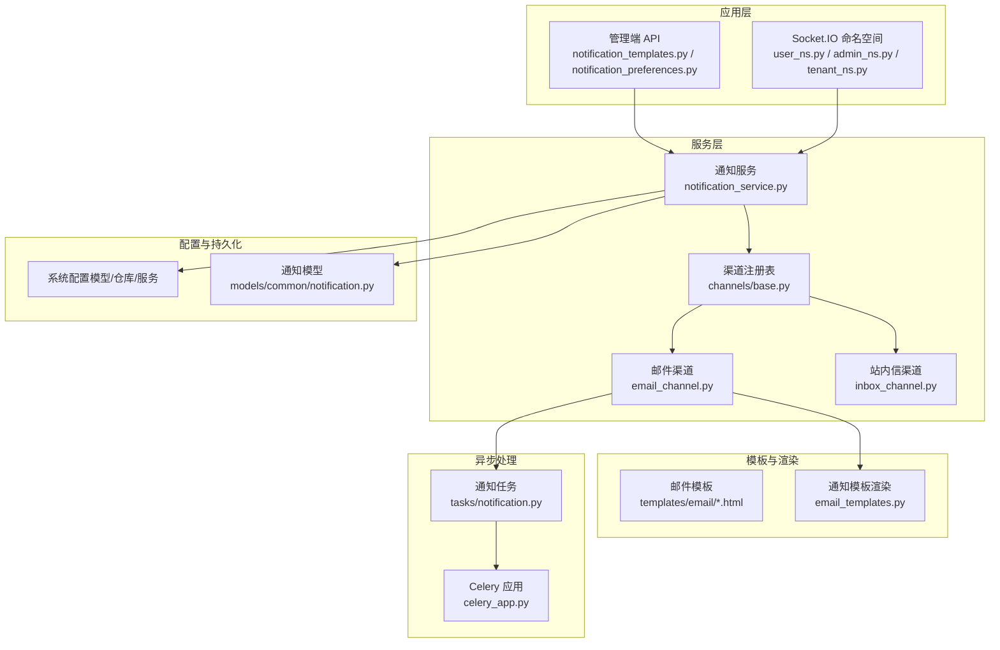
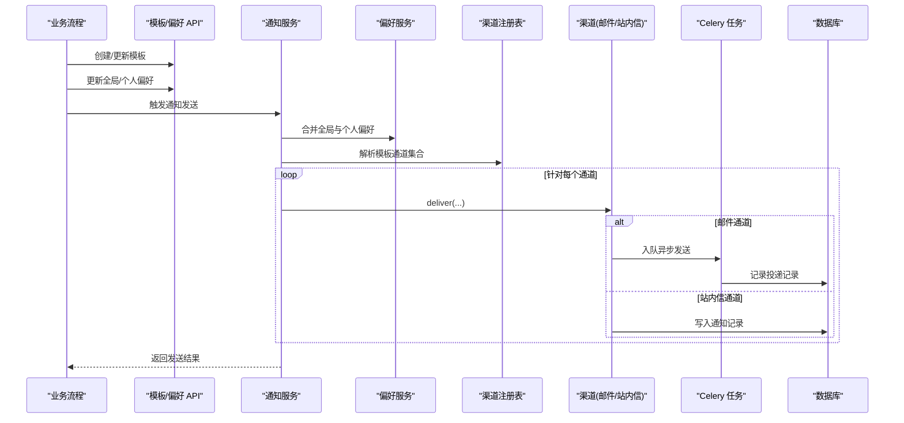
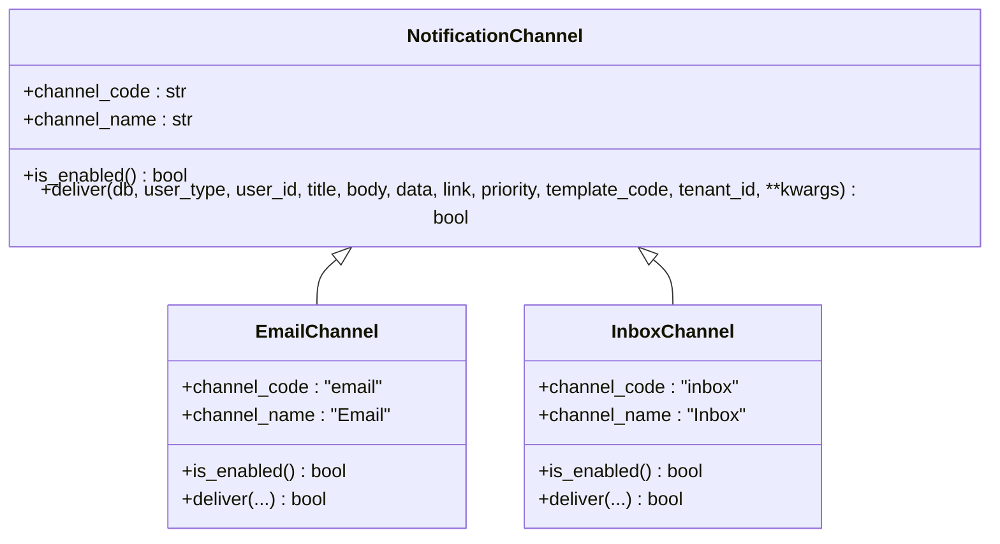
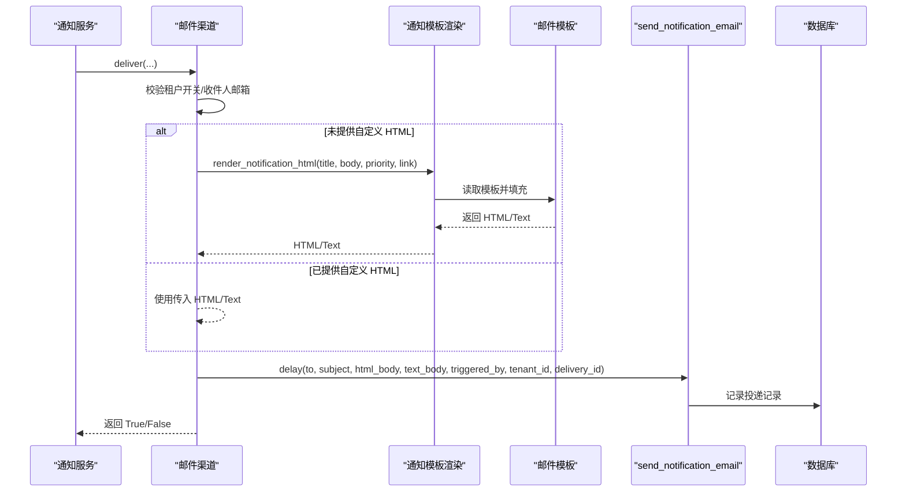
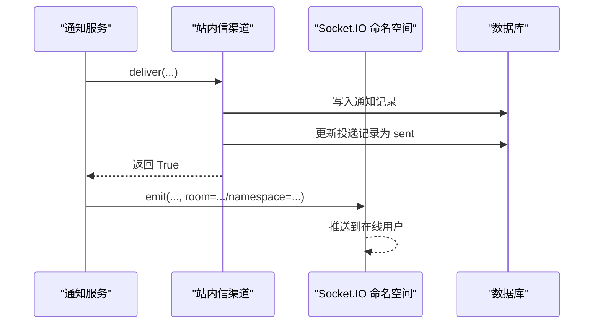
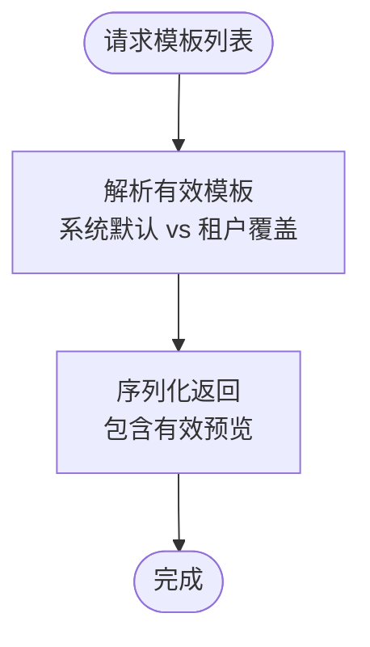
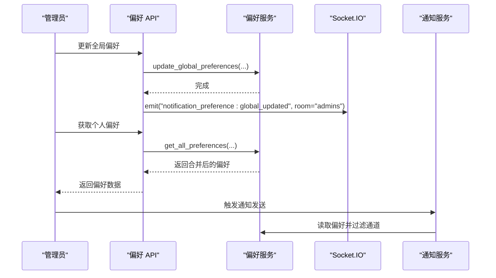
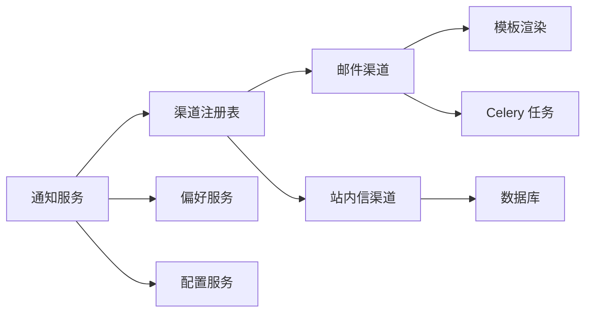

# 通信服务

<cite>

**本文引用的文件**
- [backend/app/services/common/channels/base.py](file://backend/app/services/common/channels/base.py)
- [backend/app/services/common/channels/email_channel.py](file://backend/app/services/common/channels/email_channel.py)
- [backend/app/services/common/channels/inbox_channel.py](file://backend/app/services/common/channels/inbox_channel.py)
- [backend/app/services/common/notification_service.py](file://backend/app/services/common/notification_service.py)
- [backend/app/api/admin/notification_templates.py](file://backend/app/api/admin/notification_templates.py)
- [backend/app/api/admin/notification_preferences.py](file://backend/app/api/admin/notification_preferences.py)
- [backend/app/tasks/notification.py](file://backend/app/tasks/notification.py)
- [backend/app/models/common/notification.py](file://backend/app/models/common/notification.py)
- [backend/app/templates/email/base.html](file://backend/app/templates/email/base.html)
- [backend/app/templates/email/notification.html](file://backend/app/templates/email/notification.html)
- [backend/app/services/common/email_templates.py](file://backend/app/services/common/email_templates.py)
- [backend/app/sio/user_ns.py](file://backend/app/sio/user_ns.py)
- [backend/app/sio/admin_ns.py](file://backend/app/sio/admin_ns.py)
- [backend/app/sio/tenant_ns.py](file://backend/app/sio/tenant_ns.py)
- [backend/app/sio/ws_config.py](file://backend/app/sio/ws_config.py)
- [backend/app/schemas/system/config.py](file://backend/app/schemas/system/config.py)
- [backend/app/models/system/config.py](file://backend/app/models/system/config.py)
- [backend/app/repositories/system/config.py](file://backend/app/repositories/system/config.py)
- [backend/app/services/system/config.py](file://backend/app/services/system/config.py)
- [backend/app/celery_app.py](file://backend/app/celery_app.py)
- [backend/app/main.py](file://backend/app/main.py)
- [backend/app/middleware/tenant.py](file://backend/app/middleware/tenant.py)
- [backend/app/middleware/trace.py](file://backend/app/middleware/trace.py)
- [backend/app/middleware/prometheus_metrics.py](file://backend/app/middleware/prometheus_metrics.py)
- [backend/app/middleware/i18n.py](file://backend/app/middleware/i18n.py)
- [backend/app/middleware/access_control.py](file://backend/app/middleware/access_control.py)
- [backend/app/middleware/audit_log.py](file://backend/app/middleware/audit_log.py)
- [backend/app/middleware/nocache.py](file://backend/app/middleware/nocache.py)
- [backend/app/middleware/dynamic_cors.py](file://backend/app/middleware/dynamic_cors.py)
- [backend/app/middleware/permission.py](file://backend/app/middleware/permission.py)
- [backend/app/middleware/maintenance.py](file://backend/app/middleware/maintenance.py)
- [backend/app/middleware/security.py](file://backend/app/middleware/security.py)
- [backend/app/middleware/sio_auth.py](file://backend/app/middleware/sio_auth.py)
- [backend/app/middleware/sse.py](file://backend/app/middleware/sse.py)
- [backend/app/middleware/rate_limit.py](file://backend/app/middleware/rate_limit.py)
- [backend/app/middleware/host_helper.py](file://backend/app/middleware/host_helper.py)
- [backend/app/middleware/hosts_helper.py](file://backend/app/middleware/hosts_helper.py)
- [backend/app/middleware/sio_bridge.py](file://backend/app/middleware/sio_bridge.py)
- [backend/app/middleware/socketio_server.py](file://backend/app/middleware/socketio_server.py)
</cite>

## 目录
1. [简介](#简介)
2. [项目结构](#项目结构)
3. [核心组件](#核心组件)
4. [架构总览](#架构总览)
5. [详细组件分析](#详细组件分析)
6. [依赖关系分析](#依赖关系分析)
7. [性能考量](#性能考量)
8. [故障排查指南](#故障排查指南)
9. [结论](#结论)
10. [附录](#附录)

## 简介
本文件面向通信服务的技术文档，聚焦邮件服务、通知服务与多渠道通信系统的设计与实现。内容涵盖：
- 邮件模板管理与渲染机制
- 通知偏好设置与个性化策略
- 多渠道消息路由与投递
- 邮件发送流程与异步处理
- 通知推送策略与消息持久化
- 与业务流程的集成方式与可靠性保障
- 使用示例、性能优化与故障恢复策略

## 项目结构
通信服务相关模块主要分布在以下目录：
- 通知渠道与服务：backend/app/services/common/channels、backend/app/services/common/notification_service.py
- 通知模板与偏好：backend/app/api/admin/notification_templates.py、backend/app/api/admin/notification_preferences.py
- 邮件模板与渲染：backend/app/templates/email、backend/app/services/common/email_templates.py
- 异步任务与队列：backend/app/tasks/notification.py、backend/app/celery_app.py
- Socket.IO 推送：backend/app/sio/*
- 配置与系统设置：backend/app/models/system/config.py、backend/app/repositories/system/config.py、backend/app/services/system/config.py
- 数据模型：backend/app/models/common/notification.py

图表来源
- [backend/app/services/common/channels/base.py:18-81](file://backend/app/services/common/channels/base.py#L18-L81)
- [backend/app/services/common/channels/email_channel.py:21-185](file://backend/app/services/common/channels/email_channel.py#L21-L185)
- [backend/app/services/common/channels/inbox_channel.py:57-91](file://backend/app/services/common/channels/inbox_channel.py#L57-L91)
- [backend/app/services/common/notification_service.py](file://backend/app/services/common/notification_service.py)
- [backend/app/api/admin/notification_templates.py:63-118](file://backend/app/api/admin/notification_templates.py#L63-L118)
- [backend/app/api/admin/notification_preferences.py:43-84](file://backend/app/api/admin/notification_preferences.py#L43-L84)
- [backend/app/tasks/notification.py](file://backend/app/tasks/notification.py)
- [backend/app/celery_app.py](file://backend/app/celery_app.py)
- [backend/app/models/common/notification.py](file://backend/app/models/common/notification.py)
- [backend/app/services/common/email_templates.py](file://backend/app/services/common/email_templates.py)
- [backend/app/templates/email/base.html](file://backend/app/templates/email/base.html)
- [backend/app/templates/email/notification.html](file://backend/app/templates/email/notification.html)

章节来源
- [backend/app/services/common/channels/base.py:1-81](file://backend/app/services/common/channels/base.py#L1-L81)
- [backend/app/services/common/channels/email_channel.py:1-185](file://backend/app/services/common/channels/email_channel.py#L1-L185)
- [backend/app/services/common/channels/inbox_channel.py:57-91](file://backend/app/services/common/channels/inbox_channel.py#L57-L91)
- [backend/app/services/common/notification_service.py](file://backend/app/services/common/notification_service.py)
- [backend/app/api/admin/notification_templates.py:63-118](file://backend/app/api/admin/notification_templates.py#L63-L118)
- [backend/app/api/admin/notification_preferences.py:43-84](file://backend/app/api/admin/notification_preferences.py#L43-L84)
- [backend/app/tasks/notification.py](file://backend/app/tasks/notification.py)
- [backend/app/celery_app.py](file://backend/app/celery_app.py)
- [backend/app/models/common/notification.py](file://backend/app/models/common/notification.py)
- [backend/app/services/common/email_templates.py](file://backend/app/services/common/email_templates.py)
- [backend/app/templates/email/base.html](file://backend/app/templates/email/base.html)
- [backend/app/templates/email/notification.html](file://backend/app/templates/email/notification.html)

## 核心组件
- 通知渠道基类：定义统一的渠道接口，约束渠道标识、启用状态检查与投递方法。
- 邮件渠道：基于 Celery 异步任务投递邮件，支持租户级开关与模板渲染。
- 站内信渠道：将通知写入数据库，用于后续前端拉取或推送。
- 通知服务：负责模板解析、偏好过滤、渠道选择与投递编排。
- 通知模板与偏好 API：提供模板管理与全局/个人偏好的读写接口。
- 异步任务与队列：Celery 任务封装邮件发送，支持重试与跟踪。
- Socket.IO 命名空间：向在线用户实时推送通知。
- 配置系统：提供系统与租户配置读取，支撑渠道可用性判断。

章节来源
- [backend/app/services/common/channels/base.py:18-81](file://backend/app/services/common/channels/base.py#L18-L81)
- [backend/app/services/common/channels/email_channel.py:21-185](file://backend/app/services/common/channels/email_channel.py#L21-L185)
- [backend/app/services/common/channels/inbox_channel.py:57-91](file://backend/app/services/common/channels/inbox_channel.py#L57-L91)
- [backend/app/services/common/notification_service.py](file://backend/app/services/common/notification_service.py)
- [backend/app/api/admin/notification_templates.py:63-118](file://backend/app/api/admin/notification_templates.py#L63-L118)
- [backend/app/api/admin/notification_preferences.py:43-84](file://backend/app/api/admin/notification_preferences.py#L43-L84)
- [backend/app/tasks/notification.py](file://backend/app/tasks/notification.py)
- [backend/app/sio/user_ns.py](file://backend/app/sio/user_ns.py)
- [backend/app/sio/admin_ns.py](file://backend/app/sio/admin_ns.py)
- [backend/app/sio/tenant_ns.py](file://backend/app/sio/tenant_ns.py)
- [backend/app/sio/ws_config.py](file://backend/app/sio/ws_config.py)
- [backend/app/models/system/config.py](file://backend/app/models/system/config.py)
- [backend/app/repositories/system/config.py](file://backend/app/repositories/system/config.py)
- [backend/app/services/system/config.py](file://backend/app/services/system/config.py)

## 架构总览
通信服务采用“模板驱动 + 渠道编排”的设计，围绕通知服务进行统一调度：
- 模板层：模板代码与优先级、通道集合由模板管理 API 维护；运行时通过通知服务解析有效模板。
- 偏好层：全局与个人偏好决定是否接收及可选通道。
- 渠道层：邮件、站内信、WebSocket 等渠道实现统一接口，按策略投递。
- 异步层：邮件通过 Celery 队列异步发送，确保主流程非阻塞。
- 持久化层：通知与投递记录写入数据库，便于审计与重试。

图表来源
- [backend/app/services/common/notification_service.py](file://backend/app/services/common/notification_service.py)
- [backend/app/api/admin/notification_templates.py:63-118](file://backend/app/api/admin/notification_templates.py#L63-L118)
- [backend/app/api/admin/notification_preferences.py:43-84](file://backend/app/api/admin/notification_preferences.py#L43-L84)
- [backend/app/services/common/channels/base.py:18-81](file://backend/app/services/common/channels/base.py#L18-L81)
- [backend/app/services/common/channels/email_channel.py:21-185](file://backend/app/services/common/channels/email_channel.py#L21-L185)
- [backend/app/services/common/channels/inbox_channel.py:57-91](file://backend/app/services/common/channels/inbox_channel.py#L57-L91)
- [backend/app/tasks/notification.py](file://backend/app/tasks/notification.py)
- [backend/app/models/common/notification.py](file://backend/app/models/common/notification.py)

## 详细组件分析

### 通知渠道基类与注册
- 统一接口：channel_code、channel_name、is_enabled、deliver。
- 设计要点：新渠道只需继承并实现接口，注册到渠道注册表即可参与路由。

图表来源
- [backend/app/services/common/channels/base.py:18-81](file://backend/app/services/common/channels/base.py#L18-L81)
- [backend/app/services/common/channels/email_channel.py:21-31](file://backend/app/services/common/channels/email_channel.py#L21-L31)
- [backend/app/services/common/channels/inbox_channel.py:57-91](file://backend/app/services/common/channels/inbox_channel.py#L57-L91)

章节来源
- [backend/app/services/common/channels/base.py:18-81](file://backend/app/services/common/channels/base.py#L18-L81)

### 邮件服务与模板渲染
- 渠道特性：邮件通道通过 Celery 异步发送，使用专用队列；支持租户级开关与收件人邮箱校验。
- 模板渲染：若未提供自定义 HTML，自动以通知 HTML 模板包装标题、正文、优先级与链接；失败则降级为纯文本。
- 发送流程：构建主题、HTML/文本体，入队 Celery 任务，并在投递记录中标记状态与任务 ID。

图表来源
- [backend/app/services/common/channels/email_channel.py:91-185](file://backend/app/services/common/channels/email_channel.py#L91-L185)
- [backend/app/services/common/email_templates.py](file://backend/app/services/common/email_templates.py)
- [backend/app/templates/email/base.html](file://backend/app/templates/email/base.html)
- [backend/app/templates/email/notification.html](file://backend/app/templates/email/notification.html)
- [backend/app/tasks/notification.py](file://backend/app/tasks/notification.py)

章节来源
- [backend/app/services/common/channels/email_channel.py:91-185](file://backend/app/services/common/channels/email_channel.py#L91-L185)
- [backend/app/services/common/email_templates.py](file://backend/app/services/common/email_templates.py)
- [backend/app/templates/email/base.html](file://backend/app/templates/email/base.html)
- [backend/app/templates/email/notification.html](file://backend/app/templates/email/notification.html)
- [backend/app/tasks/notification.py](file://backend/app/tasks/notification.py)

### 站内信与 WebSocket 推送
- 站内信：直接写入通知记录，包含模板编码、分类、标题、正文、数据、链接与优先级；同时更新投递记录状态。
- WebSocket：通过 Socket.IO 命名空间向在线用户推送；命名空间与鉴权中间件确保安全与隔离。

图表来源
- [backend/app/services/common/channels/inbox_channel.py:57-91](file://backend/app/services/common/channels/inbox_channel.py#L57-L91)
- [backend/app/sio/user_ns.py](file://backend/app/sio/user_ns.py)
- [backend/app/sio/admin_ns.py](file://backend/app/sio/admin_ns.py)
- [backend/app/sio/tenant_ns.py](file://backend/app/sio/tenant_ns.py)
- [backend/app/sio/ws_config.py](file://backend/app/sio/ws_config.py)

章节来源
- [backend/app/services/common/channels/inbox_channel.py:57-91](file://backend/app/services/common/channels/inbox_channel.py#L57-L91)
- [backend/app/sio/user_ns.py](file://backend/app/sio/user_ns.py)
- [backend/app/sio/admin_ns.py](file://backend/app/sio/admin_ns.py)
- [backend/app/sio/tenant_ns.py](file://backend/app/sio/tenant_ns.py)
- [backend/app/sio/ws_config.py](file://backend/app/sio/ws_config.py)

### 通知模板管理与生效规则
- 模板字段：代码、分类、标题/正文模板、通道集合、优先级、作用域、来源、是否启用等。
- 生效策略：模板按租户覆盖系统默认，API 提供“有效预览”以展示最终生效模板。
- 管理接口：支持分页查询、编辑、锁定字段、查看有效预览等。

图表来源
- [backend/app/api/admin/notification_templates.py:63-118](file://backend/app/api/admin/notification_templates.py#L63-L118)

章节来源
- [backend/app/api/admin/notification_templates.py:63-118](file://backend/app/api/admin/notification_templates.py#L63-L118)

### 通知偏好设置与个性化
- 全局偏好：平台级配置，影响管理员个人覆盖；更新后广播给管理员房间。
- 个人偏好：管理员针对分类的覆盖，与全局偏好合并后生效。
- 服务侧合并：通知服务在投递前合并全局与个人偏好，决定是否接收及可选通道。

图表来源
- [backend/app/api/admin/notification_preferences.py:43-84](file://backend/app/api/admin/notification_preferences.py#L43-L84)
- [backend/app/sio/admin_ns.py](file://backend/app/sio/admin_ns.py)

章节来源
- [backend/app/api/admin/notification_preferences.py:43-84](file://backend/app/api/admin/notification_preferences.py#L43-L84)
- [backend/app/sio/admin_ns.py](file://backend/app/sio/admin_ns.py)

### 配置管理与渠道可用性
- 系统配置：通过系统配置模型/仓库/服务读取；邮件通道在投递前检查 SMTP 开关与租户级开关。
- 租户开关：若租户关闭邮件通知，则跳过投递并记录原因。

章节来源
- [backend/app/services/common/channels/email_channel.py:91-111](file://backend/app/services/common/channels/email_channel.py#L91-L111)
- [backend/app/models/system/config.py](file://backend/app/models/system/config.py)
- [backend/app/repositories/system/config.py](file://backend/app/repositories/system/config.py)
- [backend/app/services/system/config.py](file://backend/app/services/system/config.py)

### 消息持久化与投递记录
- 通知记录：站内信渠道直接写入；邮件渠道通过 Celery 任务写入。
- 投递记录：包含模板 ID/Code、渠道、租户、收件人、状态、尝试次数、错误信息、任务 ID、投递时间等。
- 数据模型：通知与投递记录模型定义字段与约束。

章节来源
- [backend/app/models/common/notification.py](file://backend/app/models/common/notification.py)
- [backend/app/services/common/channels/inbox_channel.py:57-91](file://backend/app/services/common/channels/inbox_channel.py#L57-L91)
- [backend/app/tasks/notification.py](file://backend/app/tasks/notification.py)

## 依赖关系分析
- 低耦合高内聚：渠道通过统一基类解耦，新增渠道无需修改其他模块。
- 依赖方向：通知服务依赖渠道注册表与偏好服务；邮件通道依赖模板渲染与 Celery 任务；站内信通道依赖数据库写入。
- 外部依赖：Celery 作为消息队列；Socket.IO 作为实时推送；数据库作为持久化存储。

图表来源
- [backend/app/services/common/notification_service.py](file://backend/app/services/common/notification_service.py)
- [backend/app/services/common/channels/base.py:18-81](file://backend/app/services/common/channels/base.py#L18-L81)
- [backend/app/services/common/channels/email_channel.py:21-185](file://backend/app/services/common/channels/email_channel.py#L21-L185)
- [backend/app/services/common/channels/inbox_channel.py:57-91](file://backend/app/services/common/channels/inbox_channel.py#L57-L91)
- [backend/app/services/common/email_templates.py](file://backend/app/services/common/email_templates.py)
- [backend/app/tasks/notification.py](file://backend/app/tasks/notification.py)
- [backend/app/models/common/notification.py](file://backend/app/models/common/notification.py)
- [backend/app/services/system/config.py](file://backend/app/services/system/config.py)

## 性能考量
- 异步投递：邮件通过 Celery 异步发送，避免阻塞主流程，提升吞吐量。
- 模板渲染缓存：建议对常用模板渲染结果进行缓存，减少重复计算。
- 批量投递：对同一模板的多用户投递可合并任务或批量入队，降低队列压力。
- 数据库索引：为通知与投递记录的关键字段建立索引，加速查询与清理。
- 限流与重试：结合速率限制与指数退避重试，平衡可靠性与资源占用。

## 故障排查指南
- 邮件未送达
  - 检查系统与租户级邮件开关是否开启。
  - 查看投递记录状态与错误信息，确认是否因收件人缺失或模板渲染失败导致跳过。
  - 核对 Celery 任务队列与工作进程状态。
- 站内信未显示
  - 确认通知记录已写入且未被清理。
  - 检查用户在线状态与房间订阅情况。
- 偏好未生效
  - 确认全局偏好更新后是否广播到管理员房间。
  - 检查个人偏好覆盖是否正确合并。

章节来源
- [backend/app/services/common/channels/email_channel.py:91-185](file://backend/app/services/common/channels/email_channel.py#L91-L185)
- [backend/app/services/common/channels/inbox_channel.py:57-91](file://backend/app/services/common/channels/inbox_channel.py#L57-L91)
- [backend/app/api/admin/notification_preferences.py:43-84](file://backend/app/api/admin/notification_preferences.py#L43-L84)
- [backend/app/tasks/notification.py](file://backend/app/tasks/notification.py)

## 结论
通信服务通过“模板 + 偏好 + 渠道”的解耦设计，实现了邮件、站内信与 WebSocket 的统一编排。借助 Celery 异步队列与 Socket.IO 实时推送，系统在保证可靠性的同时具备良好的扩展性与可维护性。建议在生产环境中配合缓存、索引与监控体系，持续优化性能与稳定性。

## 附录
- 使用示例（路径参考）
  - 创建通知模板：[backend/app/api/admin/notification_templates.py:63-118](file://backend/app/api/admin/notification_templates.py#L63-L118)
  - 更新全局偏好：[backend/app/api/admin/notification_preferences.py:43-84](file://backend/app/api/admin/notification_preferences.py#L43-L84)
  - 触发通知发送：[backend/app/services/common/notification_service.py](file://backend/app/services/common/notification_service.py)
  - 邮件发送任务：[backend/app/tasks/notification.py](file://backend/app/tasks/notification.py)
  - 邮件模板与渲染：[backend/app/services/common/email_templates.py](file://backend/app/services/common/email_templates.py)，[backend/app/templates/email/base.html](file://backend/app/templates/email/base.html)，[backend/app/templates/email/notification.html](file://backend/app/templates/email/notification.html)
  - 渠道实现与注册：[backend/app/services/common/channels/base.py:18-81](file://backend/app/services/common/channels/base.py#L18-L81)，[backend/app/services/common/channels/email_channel.py:21-185](file://backend/app/services/common/channels/email_channel.py#L21-L185)，[backend/app/services/common/channels/inbox_channel.py:57-91](file://backend/app/services/common/channels/inbox_channel.py#L57-L91)
  - Socket.IO 命名空间：[backend/app/sio/user_ns.py](file://backend/app/sio/user_ns.py)，[backend/app/sio/admin_ns.py](file://backend/app/sio/admin_ns.py)，[backend/app/sio/tenant_ns.py](file://backend/app/sio/tenant_ns.py)，[backend/app/sio/ws_config.py](file://backend/app/sio/ws_config.py)
  - 配置系统：[backend/app/models/system/config.py](file://backend/app/models/system/config.py)，[backend/app/repositories/system/config.py](file://backend/app/repositories/system/config.py)，[backend/app/services/system/config.py](file://backend/app/services/system/config.py)
  - 应用入口与中间件：[backend/app/main.py](file://backend/app/main.py)，[backend/app/middleware/tenant.py](file://backend/app/middleware/tenant.py)，[backend/app/middleware/trace.py](file://backend/app/middleware/trace.py)，[backend/app/middleware/prometheus_metrics.py](file://backend/app/middleware/prometheus_metrics.py)，[backend/app/middleware/i18n.py](file://backend/app/middleware/i18n.py)，[backend/app/middleware/access_control.py](file://backend/app/middleware/access_control.py)，[backend/app/middleware/audit_log.py](file://backend/app/middleware/audit_log.py)，[backend/app/middleware/nocache.py](file://backend/app/middleware/nocache.py)，[backend/app/middleware/dynamic_cors.py](file://backend/app/middleware/dynamic_cors.py)，[backend/app/middleware/permission.py](file://backend/app/middleware/permission.py)，[backend/app/middleware/maintenance.py](file://backend/app/middleware/maintenance.py)，[backend/app/middleware/security.py](file://backend/app/middleware/security.py)，[backend/app/middleware/sio_auth.py](file://backend/app/middleware/sio_auth.py)，[backend/app/middleware/sse.py](file://backend/app/middleware/sse.py)，[backend/app/middleware/rate_limit.py](file://backend/app/middleware/rate_limit.py)，[backend/app/middleware/host_helper.py](file://backend/app/middleware/host_helper.py)，[backend/app/middleware/hosts_helper.py](file://backend/app/middleware/hosts_helper.py)，[backend/app/middleware/sio_bridge.py](file://backend/app/middleware/sio_bridge.py)，[backend/app/middleware/socketio_server.py](file://backend/app/middleware/socketio_server.py)