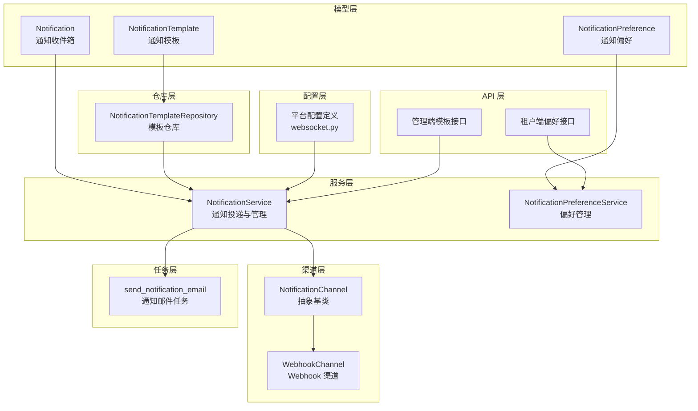
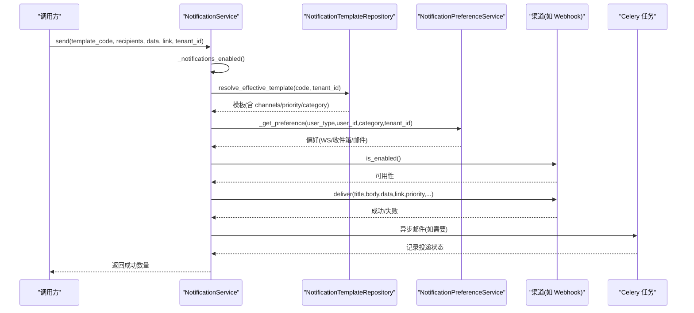
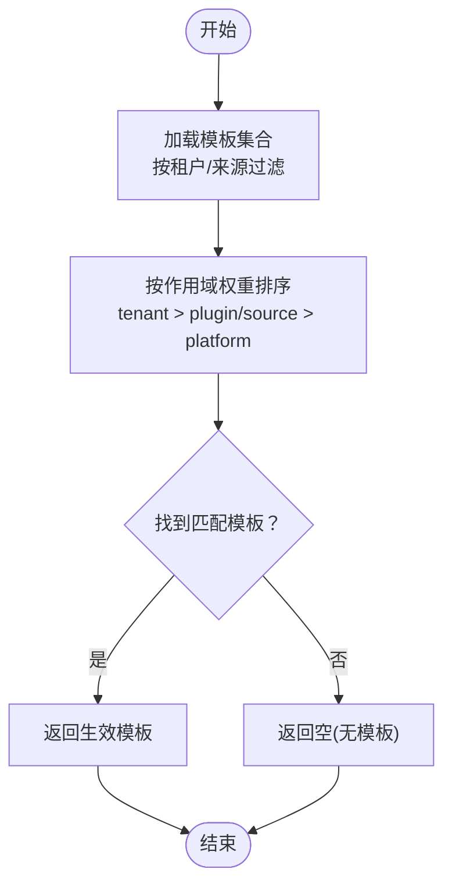
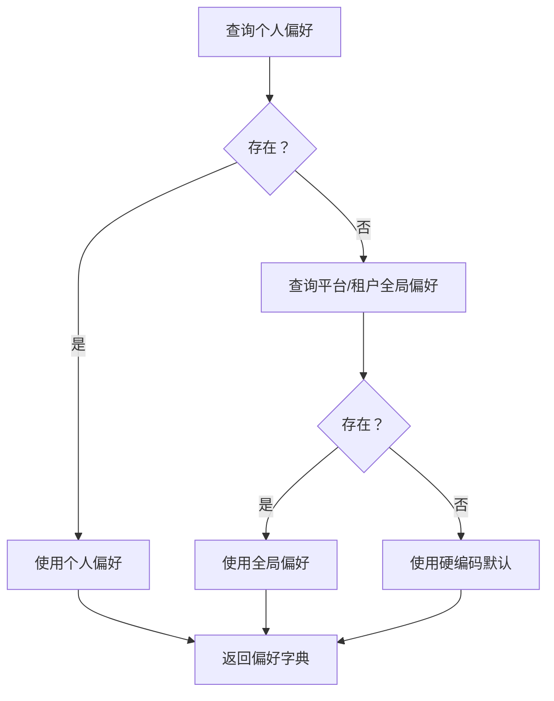
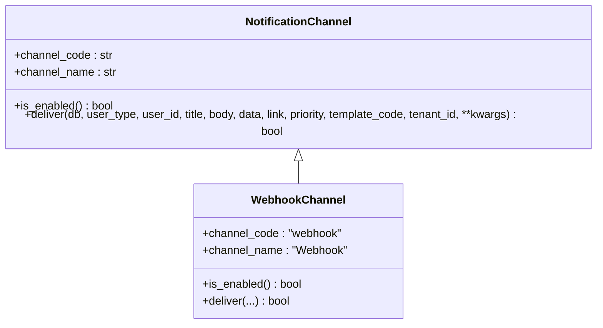
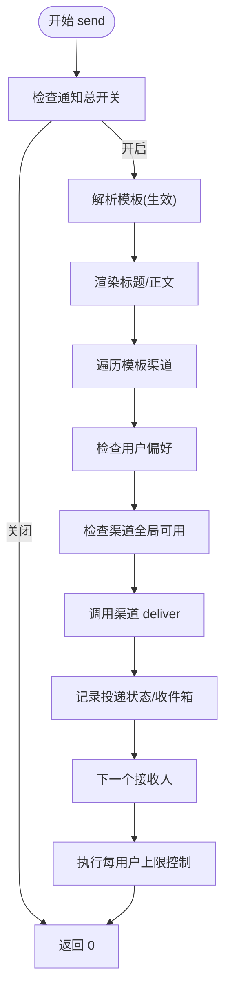
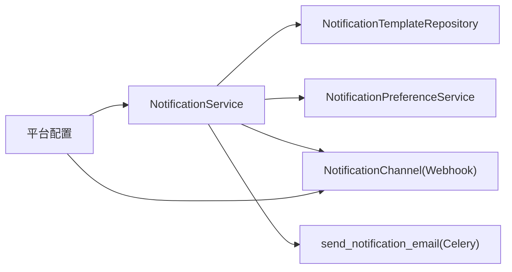
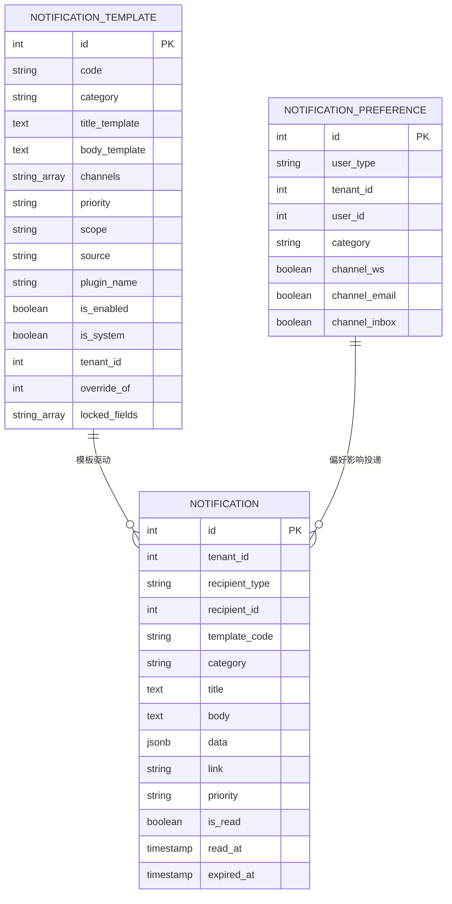

# 通知服务

<cite>
**本文引用的文件**
- [backend/app/models/common/notification.py](file://backend/app/models/common/notification.py)
- [backend/app/models/common/notification_preference.py](file://backend/app/models/common/notification_preference.py)
- [backend/app/models/common/notification_template.py](file://backend/app/models/common/notification_template.py)
- [backend/app/services/common/notification_service.py](file://backend/app/services/common/notification_service.py)
- [backend/app/services/common/notification_preference_service.py](file://backend/app/services/common/notification_preference_service.py)
- [backend/app/repositories/common/notification_template_repository.py](file://backend/app/repositories/common/notification_template_repository.py)
- [backend/app/services/common/channels/base.py](file://backend/app/services/common/channels/base.py)
- [backend/app/services/common/channels/webhook_channel.py](file://backend/app/services/common/channels/webhook_channel.py)
- [backend/app/tasks/notification.py](file://backend/app/tasks/notification.py)
- [backend/app/configs/definitions/platform/websocket.py](file://backend/app/configs/definitions/platform/websocket.py)
- [backend/app/api/admin/notification_templates.py](file://backend/app/api/admin/notification_templates.py)
- [backend/app/api/tenant/notification_preferences.py](file://backend/app/api/tenant/notification_preferences.py)
- [frontend/apps/web-antd/src/api/admin/notification-templates.ts](file://frontend/apps/web-antd/src/api/admin/notification-templates.ts)
- [backend/migrations/versions/20260221_6b4fe69b2efc_add_notification_tables.py](file://backend/migrations/versions/20260221_6b4fe69b2efc_add_notification_tables.py)
- [backend/migrations/versions/20260314_0949_notification_pref_add_global_layer.py](file://backend/migrations/versions/20260314_0949_notification_pref_add_global_layer.py)
</cite>

## 目录
1. [简介](#简介)
2. [项目结构](#项目结构)
3. [核心组件](#核心组件)
4. [架构总览](#架构总览)
5. [详细组件分析](#详细组件分析)
6. [依赖关系分析](#依赖关系分析)
7. [性能考量](#性能考量)
8. [故障排查指南](#故障排查指南)
9. [结论](#结论)
10. [附录](#附录)

## 简介
本技术文档面向通知服务，系统性阐述其整体架构与实现细节，涵盖通知模板管理、用户偏好设置、多渠道推送机制、消息路由与优先级处理、批量推送策略、配置管理、渠道扩展方法以及性能监控方案，并给出通知模板开发规范与用户交互最佳实践。

## 项目结构
通知服务由“模型-仓库-服务-渠道-任务-配置-API”多层协同构成：
- 模型层：通知、偏好、模板三类核心实体，定义数据结构与索引约束。
- 仓库层：模板解析与查询，支持租户覆盖、插件/source、平台默认的解析顺序。
- 服务层：统一投递入口、偏好解析、收件箱上限控制、WS payload 构建、查询与操作。
- 渠道层：抽象通道接口与具体实现（Webhook），支持扩展新渠道。
- 任务层：Celery 异步邮件发送，独立队列保障稳定性。
- 配置层：平台级配置项（如通知总开关、Webhook 开关与地址、收件箱上限等）。
- API 层：管理端与租户端的模板与偏好管理接口。

图表来源
- [backend/app/models/common/notification.py:17-118](file://backend/app/models/common/notification.py#L17-L118)
- [backend/app/models/common/notification_preference.py:16-88](file://backend/app/models/common/notification_preference.py#L16-L88)
- [backend/app/models/common/notification_template.py:15-186](file://backend/app/models/common/notification_template.py#L15-L186)
- [backend/app/repositories/common/notification_template_repository.py:17-168](file://backend/app/repositories/common/notification_template_repository.py#L17-L168)
- [backend/app/services/common/notification_service.py:28-803](file://backend/app/services/common/notification_service.py#L28-L803)
- [backend/app/services/common/notification_preference_service.py:38-287](file://backend/app/services/common/notification_preference_service.py#L38-L287)
- [backend/app/services/common/channels/base.py:18-82](file://backend/app/services/common/channels/base.py#L18-L82)
- [backend/app/services/common/channels/webhook_channel.py:22-112](file://backend/app/services/common/channels/webhook_channel.py#L22-L112)
- [backend/app/tasks/notification.py:18-242](file://backend/app/tasks/notification.py#L18-L242)
- [backend/app/configs/definitions/platform/websocket.py:127-172](file://backend/app/configs/definitions/platform/websocket.py#L127-L172)
- [backend/app/api/admin/notification_templates.py:63-82](file://backend/app/api/admin/notification_templates.py#L63-L82)
- [backend/app/api/tenant/notification_preferences.py:42-72](file://backend/app/api/tenant/notification_preferences.py#L42-L72)

章节来源
- [backend/app/models/common/notification.py:17-118](file://backend/app/models/common/notification.py#L17-L118)
- [backend/app/models/common/notification_preference.py:16-88](file://backend/app/models/common/notification_preference.py#L16-L88)
- [backend/app/models/common/notification_template.py:15-186](file://backend/app/models/common/notification_template.py#L15-L186)
- [backend/app/repositories/common/notification_template_repository.py:17-168](file://backend/app/repositories/common/notification_template_repository.py#L17-L168)
- [backend/app/services/common/notification_service.py:28-803](file://backend/app/services/common/notification_service.py#L28-L803)
- [backend/app/services/common/notification_preference_service.py:38-287](file://backend/app/services/common/notification_preference_service.py#L38-L287)
- [backend/app/services/common/channels/base.py:18-82](file://backend/app/services/common/channels/base.py#L18-L82)
- [backend/app/services/common/channels/webhook_channel.py:22-112](file://backend/app/services/common/channels/webhook_channel.py#L22-L112)
- [backend/app/tasks/notification.py:18-242](file://backend/app/tasks/notification.py#L18-L242)
- [backend/app/configs/definitions/platform/websocket.py:127-172](file://backend/app/configs/definitions/platform/websocket.py#L127-L172)
- [backend/app/api/admin/notification_templates.py:63-82](file://backend/app/api/admin/notification_templates.py#L63-L82)
- [backend/app/api/tenant/notification_preferences.py:42-72](file://backend/app/api/tenant/notification_preferences.py#L42-L72)

## 核心组件
- 通知模板（NotificationTemplate）：定义模板编码、分类、标题/正文模板、渠道列表、优先级、作用域与来源、是否启用/系统内置、租户覆盖关系与锁定字段。
- 通知偏好（NotificationPreference）：四类用户类型（平台全局、租户全局、管理员个人、租户管理员个人），支持对 WS、收件箱、邮件三个渠道的布尔开关。
- 通知收件箱（Notification）：持久化通知，支持按租户隔离、按接收人与已读状态筛选、过期时间与优先级。
- 通知服务（NotificationService）：统一投递入口，负责模板解析、偏好查询、渠道选择与投递、收件箱上限控制、WS payload 构建、查询与操作。
- 偏好服务（NotificationPreferenceService）：提供全局与个人偏好的增删改查、继承回退与批量更新。
- 模板仓库（NotificationTemplateRepository）：按租户覆盖 → 插件/source → 平台默认的顺序解析生效模板，并提供默认模板查找与排序。
- 渠道基类（NotificationChannel）：定义渠道接口；WebhookChannel 为外部系统集成提供 HTTP POST 投递能力。
- 通知任务（send_notification_email）：Celery 通知专用队列，异步发送邮件并记录日志与投递状态。
- 平台配置（websocket.py）：定义通知总开关、Webhook 开关与地址、收件箱保留天数与每用户上限等。

章节来源
- [backend/app/models/common/notification_template.py:15-186](file://backend/app/models/common/notification_template.py#L15-L186)
- [backend/app/models/common/notification_preference.py:16-88](file://backend/app/models/common/notification_preference.py#L16-L88)
- [backend/app/models/common/notification.py:17-118](file://backend/app/models/common/notification.py#L17-L118)
- [backend/app/services/common/notification_service.py:28-803](file://backend/app/services/common/notification_service.py#L28-L803)
- [backend/app/services/common/notification_preference_service.py:38-287](file://backend/app/services/common/notification_preference_service.py#L38-L287)
- [backend/app/repositories/common/notification_template_repository.py:77-164](file://backend/app/repositories/common/notification_template_repository.py#L77-L164)
- [backend/app/services/common/channels/base.py:18-82](file://backend/app/services/common/channels/base.py#L18-L82)
- [backend/app/services/common/channels/webhook_channel.py:22-112](file://backend/app/services/common/channels/webhook_channel.py#L22-L112)
- [backend/app/tasks/notification.py:18-242](file://backend/app/tasks/notification.py#L18-L242)
- [backend/app/configs/definitions/platform/websocket.py:127-172](file://backend/app/configs/definitions/platform/websocket.py#L127-L172)

## 架构总览
通知服务采用“模板驱动 + 偏好控制 + 渠道扩展”的架构模式：
- 模板驱动：以模板为中心，定义标题/正文、渠道与优先级，支持租户覆盖与来源层级。
- 偏好控制：用户偏好（个人优先）→ 全局默认（平台/租户）→ 硬编码默认，形成清晰的继承链。
- 渠道扩展：通过抽象基类统一接口，新增渠道仅需实现 is_enabled 与 deliver 两个方法。
- 异步处理：邮件等长耗时任务放入专用队列，确保主流程快速响应。
- 配置中心：平台配置集中管理，动态影响渠道可用性与系统行为。

图表来源
- [backend/app/services/common/notification_service.py:48-210](file://backend/app/services/common/notification_service.py#L48-L210)
- [backend/app/repositories/common/notification_template_repository.py:77-164](file://backend/app/repositories/common/notification_template_repository.py#L77-L164)
- [backend/app/services/common/notification_preference_service.py:514-557](file://backend/app/services/common/notification_preference_service.py#L514-L557)
- [backend/app/services/common/channels/webhook_channel.py:33-112](file://backend/app/services/common/channels/webhook_channel.py#L33-L112)
- [backend/app/tasks/notification.py:18-158](file://backend/app/tasks/notification.py#L18-L158)

## 详细组件分析

### 通知模板管理
- 存储结构：模板按 code 唯一，支持平台/租户/插件/source 多作用域，支持 override_of 与 locked_fields 字段，便于企业覆盖与锁定关键字段。
- 解析策略：优先租户覆盖（精确匹配租户），其次插件/source，最后平台默认；通过排序权重确定生效模板。
- 前端预览：管理端接口提供模板预览 payload，包含标题/正文模板、渠道列表与优先级，前端据此渲染有效模板。

图表来源
- [backend/app/repositories/common/notification_template_repository.py:77-164](file://backend/app/repositories/common/notification_template_repository.py#L77-L164)
- [backend/app/api/admin/notification_templates.py:63-82](file://backend/app/api/admin/notification_templates.py#L63-L82)
- [frontend/apps/web-antd/src/api/admin/notification-templates.ts:103-116](file://frontend/apps/web-antd/src/api/admin/notification-templates.ts#L103-L116)

章节来源
- [backend/app/models/common/notification_template.py:15-186](file://backend/app/models/common/notification_template.py#L15-L186)
- [backend/app/repositories/common/notification_template_repository.py:77-164](file://backend/app/repositories/common/notification_template_repository.py#L77-L164)
- [backend/app/api/admin/notification_templates.py:63-82](file://backend/app/api/admin/notification_templates.py#L63-L82)
- [frontend/apps/web-antd/src/api/admin/notification-templates.ts:103-116](file://frontend/apps/web-antd/src/api/admin/notification-templates.ts#L103-L116)

### 用户偏好设置与继承规则
- 偏好模型：支持四类 user_type，每个分类对 WS、收件箱、邮件三个渠道分别开关。
- 继承规则：个人偏好优先；若不存在则回退到平台/租户全局偏好；若仍不存在则使用硬编码默认值。
- 批量更新：支持一次性更新多个分类的偏好，并在全局变更时精确清除受影响的个人覆盖项。
- 重置策略：支持将个人偏好重置为全局默认，便于快速恢复。

图表来源
- [backend/app/services/common/notification_preference_service.py:514-557](file://backend/app/services/common/notification_preference_service.py#L514-L557)
- [backend/app/models/common/notification_preference.py:16-88](file://backend/app/models/common/notification_preference.py#L16-L88)

章节来源
- [backend/app/models/common/notification_preference.py:16-88](file://backend/app/models/common/notification_preference.py#L16-L88)
- [backend/app/services/common/notification_preference_service.py:38-287](file://backend/app/services/common/notification_preference_service.py#L38-L287)
- [backend/migrations/versions/20260314_0949_notification_pref_add_global_layer.py](file://backend/migrations/versions/20260314_0949_notification_pref_add_global_layer.py)

### 多渠道推送机制
- 渠道抽象：NotificationChannel 定义 channel_code、channel_name、is_enabled、deliver 四要素。
- Webhook 渠道：基于平台配置检查开关与 URL，构造 payload 并通过 HTTP POST 投递，记录成功/失败与状态。
- 扩展方法：新增渠道只需继承基类，实现 is_enabled 与 deliver，并注册到渠道工厂或映射中即可参与投递。

图表来源
- [backend/app/services/common/channels/base.py:18-82](file://backend/app/services/common/channels/base.py#L18-L82)
- [backend/app/services/common/channels/webhook_channel.py:22-112](file://backend/app/services/common/channels/webhook_channel.py#L22-L112)

章节来源
- [backend/app/services/common/channels/base.py:18-82](file://backend/app/services/common/channels/base.py#L18-L82)
- [backend/app/services/common/channels/webhook_channel.py:22-112](file://backend/app/services/common/channels/webhook_channel.py#L22-L112)

### 消息路由逻辑、优先级处理与批量推送
- 路由逻辑：统一入口 send() 先检查系统总开关，再解析模板，渲染标题/正文，遍历模板定义的渠道，结合用户偏好与渠道全局可用性进行投递。
- 优先级处理：模板优先级直接透传至各渠道；WS payload 构建同样使用模板优先级，若模板缺失则回退到传入的优先级参数。
- 批量推送：对每个接收人逐条投递，支持批量创建收件箱记录并在合适时机提交；对收件箱渠道执行每用户上限控制，超出时优先清理最早已读通知。

图表来源
- [backend/app/services/common/notification_service.py:48-210](file://backend/app/services/common/notification_service.py#L48-L210)
- [backend/app/services/common/notification_service.py:559-620](file://backend/app/services/common/notification_service.py#L559-L620)

章节来源
- [backend/app/services/common/notification_service.py:48-210](file://backend/app/services/common/notification_service.py#L48-L210)
- [backend/app/services/common/notification_service.py:559-620](file://backend/app/services/common/notification_service.py#L559-L620)

### 配置管理与渠道扩展
- 平台配置：定义通知总开关、Webhook 开关与 URL、收件箱保留天数、每用户上限等；通过配置组统一注册与展示。
- 渠道扩展：新增渠道只需实现 is_enabled 与 deliver，接入配置校验与日志记录，即可参与统一投递流程。

章节来源
- [backend/app/configs/definitions/platform/websocket.py:127-172](file://backend/app/configs/definitions/platform/websocket.py#L127-L172)
- [backend/app/services/common/channels/base.py:18-82](file://backend/app/services/common/channels/base.py#L18-L82)
- [backend/app/services/common/channels/webhook_channel.py:33-112](file://backend/app/services/common/channels/webhook_channel.py#L33-L112)

### 性能监控方案
- 日志记录：投递成功/失败、渠道不可用、模板缺失、URL 无效等均记录日志，便于追踪。
- 投递状态：通过 NotificationDelivery 记录每次投递尝试次数、状态、错误信息与时间戳，支持后续审计与重试。
- 队列隔离：邮件发送使用专用通知队列，避免与其它任务争抢资源。
- 上限控制：每用户收件箱数量上限，防止无限增长导致查询与存储压力。

章节来源
- [backend/app/services/common/notification_service.py:431-501](file://backend/app/services/common/notification_service.py#L431-L501)
- [backend/app/tasks/notification.py:160-239](file://backend/app/tasks/notification.py#L160-L239)

## 依赖关系分析
- 低耦合高内聚：服务层依赖仓库层解析模板，依赖偏好服务查询用户偏好，依赖渠道层进行投递；渠道层与配置层解耦，通过配置读取器间接感知。
- 关键依赖链：
  - NotificationService → NotificationTemplateRepository（解析模板）
  - NotificationService → NotificationPreferenceService（查询偏好）
  - NotificationService → NotificationChannel（渠道投递）
  - NotificationService → Celery 任务（异步邮件）
  - 平台配置 → 渠道可用性与系统行为

图表来源
- [backend/app/services/common/notification_service.py:48-210](file://backend/app/services/common/notification_service.py#L48-L210)
- [backend/app/repositories/common/notification_template_repository.py:77-164](file://backend/app/repositories/common/notification_template_repository.py#L77-L164)
- [backend/app/services/common/notification_preference_service.py:514-557](file://backend/app/services/common/notification_preference_service.py#L514-L557)
- [backend/app/services/common/channels/webhook_channel.py:33-112](file://backend/app/services/common/channels/webhook_channel.py#L33-L112)
- [backend/app/tasks/notification.py:18-158](file://backend/app/tasks/notification.py#L18-L158)
- [backend/app/configs/definitions/platform/websocket.py:127-172](file://backend/app/configs/definitions/platform/websocket.py#L127-L172)

章节来源
- [backend/app/services/common/notification_service.py:48-210](file://backend/app/services/common/notification_service.py#L48-L210)
- [backend/app/repositories/common/notification_template_repository.py:77-164](file://backend/app/repositories/common/notification_template_repository.py#L77-L164)
- [backend/app/services/common/notification_preference_service.py:514-557](file://backend/app/services/common/notification_preference_service.py#L514-L557)
- [backend/app/services/common/channels/webhook_channel.py:33-112](file://backend/app/services/common/channels/webhook_channel.py#L33-L112)
- [backend/app/tasks/notification.py:18-158](file://backend/app/tasks/notification.py#L18-L158)
- [backend/app/configs/definitions/platform/websocket.py:127-172](file://backend/app/configs/definitions/platform/websocket.py#L127-L172)

## 性能考量
- 模板解析：通过仓库层一次查询并排序，避免多次往返数据库。
- 偏好查询：按用户类型与分类一次性查询，减少重复 IO。
- 渠道可用性：在 recipients 循环前预缓存渠道启用状态，降低重复查询成本。
- 收件箱上限：定期清理最早已读通知，控制存储规模与查询复杂度。
- 异步邮件：使用 Celery 专用队列，避免阻塞主流程。

## 故障排查指南
- 通知未送达：
  - 检查系统总开关与模板是否启用。
  - 核对用户偏好是否禁用相应渠道。
  - 核查渠道全局可用性（如 Webhook URL 是否配置正确）。
- Webhook 失败：
  - 查看日志中的 HTTP 状态码与响应体片段。
  - 确认 URL 以 http:// 或 https:// 开头且可达。
- 邮件发送异常：
  - 查看通知投递记录状态与错误信息。
  - 检查邮件配置是否完整，必要时查看邮件日志。
- 收件箱过多：
  - 检查每用户上限配置与清理策略是否生效。

章节来源
- [backend/app/services/common/channels/webhook_channel.py:65-112](file://backend/app/services/common/channels/webhook_channel.py#L65-L112)
- [backend/app/tasks/notification.py:160-239](file://backend/app/tasks/notification.py#L160-L239)
- [backend/app/services/common/notification_service.py:559-620](file://backend/app/services/common/notification_service.py#L559-L620)

## 结论
通知服务通过“模板驱动 + 偏好继承 + 渠道扩展”的设计，实现了灵活的企业级通知体系。模板解析与偏好查询清晰明确，渠道扩展简单可靠，异步任务与配置管理进一步提升了稳定性与可观测性。建议在生产环境中配合完善的监控与告警，持续优化模板与偏好策略，提升用户体验与运营效率。

## 附录

### 通知模板开发规范
- 编码规范：模板 code 使用点分法命名，首段作为分类；标题/正文模板使用占位符，确保渲染安全。
- 渠道与优先级：根据业务紧急程度选择优先级；谨慎选择渠道，避免过度打扰。
- 覆盖与锁定：企业覆盖模板时注意锁定字段，保证关键信息不被随意修改。
- 前端预览：管理端应提供有效模板预览，确保编辑体验一致。

章节来源
- [backend/app/models/common/notification_template.py:15-186](file://backend/app/models/common/notification_template.py#L15-L186)
- [backend/app/api/admin/notification_templates.py:63-82](file://backend/app/api/admin/notification_templates.py#L63-L82)
- [frontend/apps/web-antd/src/api/admin/notification-templates.ts:103-116](file://frontend/apps/web-antd/src/api/admin/notification-templates.ts#L103-L116)

### 用户交互最佳实践
- 偏好引导：首次登录或关键事件后引导用户完善通知偏好，减少默认偏好带来的噪音。
- 分类管理：按分类维度组织偏好，帮助用户聚焦重要通知。
- 退订与重置：提供一键重置为全局默认的能力，简化用户操作。
- 通知中心：提供通知中心页面，支持分类筛选、已读/未读切换与批量操作。

章节来源
- [backend/app/api/tenant/notification_preferences.py:42-72](file://backend/app/api/tenant/notification_preferences.py#L42-L72)
- [backend/app/services/common/notification_preference_service.py:268-283](file://backend/app/services/common/notification_preference_service.py#L268-L283)

### 数据模型概览

图表来源
- [backend/app/models/common/notification_template.py:15-186](file://backend/app/models/common/notification_template.py#L15-L186)
- [backend/app/models/common/notification_preference.py:16-88](file://backend/app/models/common/notification_preference.py#L16-L88)
- [backend/app/models/common/notification.py:17-118](file://backend/app/models/common/notification.py#L17-L118)