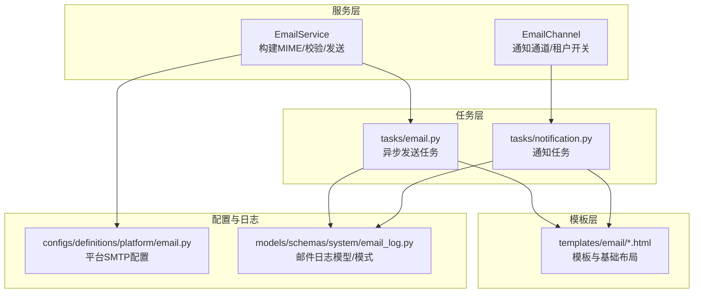
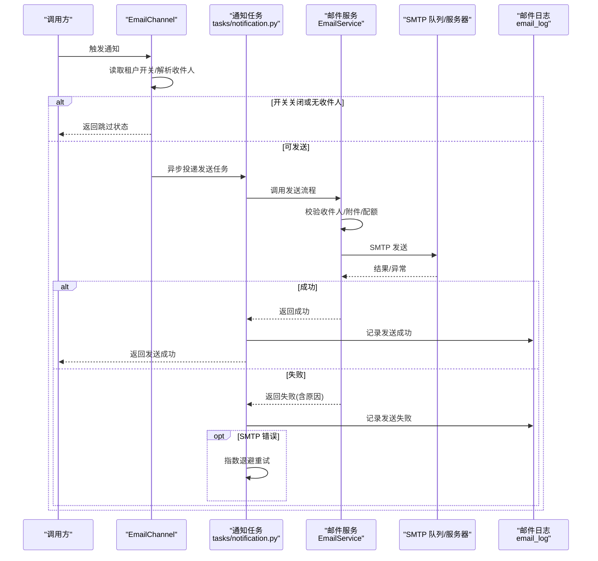
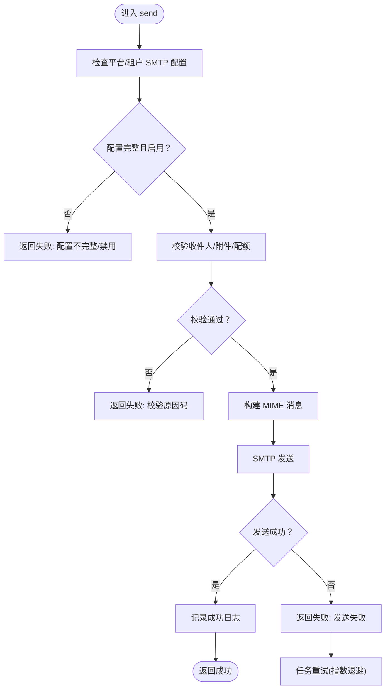
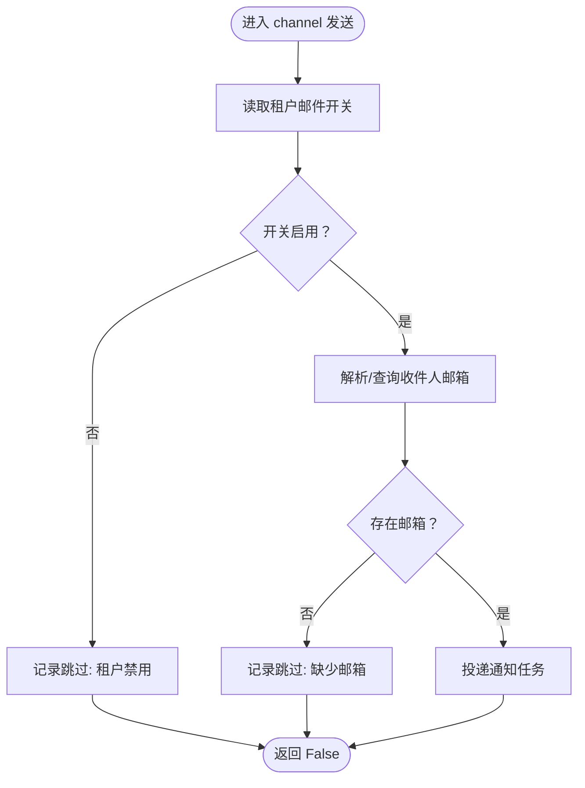
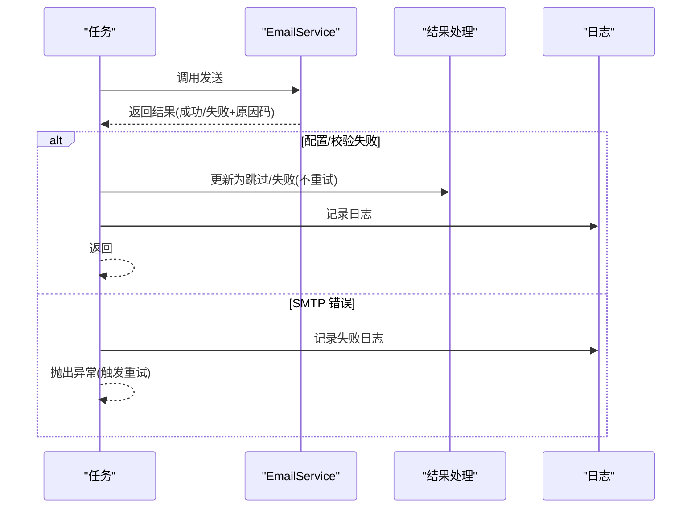
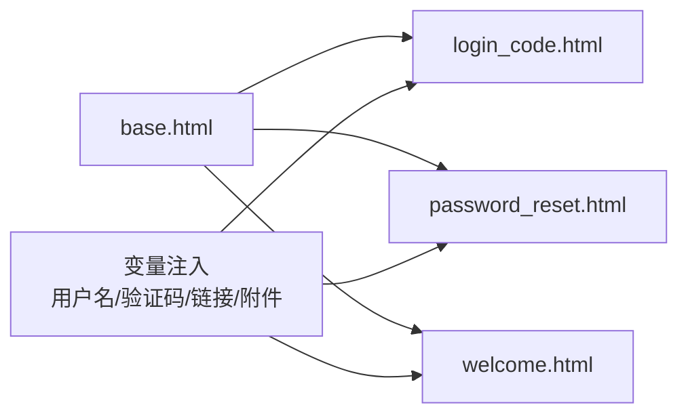
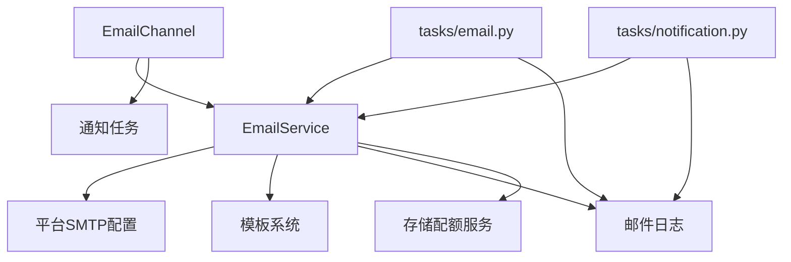
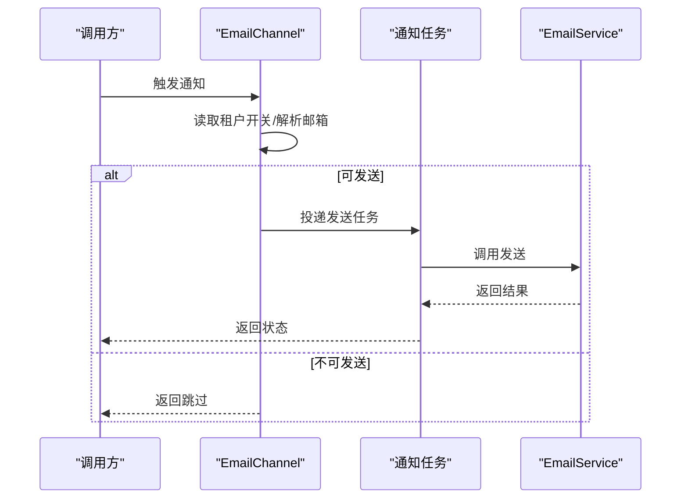

# 邮件服务

<cite>
**本文引用的文件**
- [backend/app/services/common/email_service.py](file://backend/app/services/common/email_service.py)
- [backend/app/services/common/channels/email_channel.py](file://backend/app/services/common/channels/email_channel.py)
- [backend/app/tasks/email.py](file://backend/app/tasks/email.py)
- [backend/app/tasks/notification.py](file://backend/app/tasks/notification.py)
- [backend/app/templates/email/base.html](file://backend/app/templates/email/base.html)
- [backend/app/templates/email/login_code.html](file://backend/app/templates/email/login_code.html)
- [backend/app/templates/email/password_reset.html](file://backend/app/templates/email/password_reset.html)
- [backend/app/templates/email/welcome.html](file://backend/app/templates/email/welcome.html)
- [backend/app/models/system/email_log.py](file://backend/app/models/system/email_log.py)
- [backend/app/schemas/system/email_log.py](file://backend/app/schemas/system/email_log.py)
- [backend/app/configs/definitions/platform/email.py](file://backend/app/configs/definitions/platform/email.py)
- [backend/app/services/common/storage_quota_service.py](file://backend/app/services/common/storage_quota_service.py)
- [backend/app/services/tenant/quota_service.py](file://backend/app/services/tenant/quota_service.py)
- [backend/tests/services/test_email_service.py](file://backend/tests/services/test_email_service.py)
</cite>

## 目录
1. [简介](#简介)
2. [项目结构](#项目结构)
3. [核心组件](#核心组件)
4. [架构总览](#架构总览)
5. [详细组件分析](#详细组件分析)
6. [依赖关系分析](#依赖关系分析)
7. [性能考虑](#性能考虑)
8. [故障排查指南](#故障排查指南)
9. [结论](#结论)
10. [附录](#附录)

## 简介
本文件面向邮件服务的技术文档，系统性阐述邮件服务的核心架构与实现要点，覆盖以下主题：
- SMTP 配置管理：平台级与租户级配置项、启用开关与默认值
- 邮件模板渲染：模板继承体系、变量替换、HTML 渲染与附件处理
- 批量邮件发送：任务编排、队列管理、重试机制与错误处理
- 存储配额集成：与附件大小与数量的配额联动
- 性能优化与监控：日志记录、重试退避、状态跟踪与告警建议

## 项目结构
邮件服务在后端采用“服务层 + 通道层 + 任务层 + 模板层”的分层设计，并通过 Celery 任务进行异步发送。关键目录与文件如下：
- 服务层：负责构建 MIME 消息、调用 SMTP 发送、执行校验与配额检查
- 通道层：封装通知通道逻辑，按租户维度控制是否允许发送
- 任务层：Celery 任务封装发送流程，统一处理成功/失败/跳过状态与重试
- 模板层：Jinja2 模板与基础布局，支持变量注入与附件渲染
- 配置定义：平台级 SMTP 配置项
- 日志模型：记录邮件发送的明细与错误
- 配额服务：存储配额统计与检查

图表来源
- [backend/app/services/common/email_service.py](file://backend/app/services/common/email_service.py)
- [backend/app/services/common/channels/email_channel.py](file://backend/app/services/common/channels/email_channel.py)
- [backend/app/tasks/email.py](file://backend/app/tasks/email.py)
- [backend/app/tasks/notification.py](file://backend/app/tasks/notification.py)
- [backend/app/templates/email/base.html](file://backend/app/templates/email/base.html)
- [backend/app/configs/definitions/platform/email.py](file://backend/app/configs/definitions/platform/email.py)
- [backend/app/models/system/email_log.py](file://backend/app/models/system/email_log.py)
- [backend/app/schemas/system/email_log.py](file://backend/app/schemas/system/email_log.py)

章节来源
- [backend/app/services/common/email_service.py](file://backend/app/services/common/email_service.py)
- [backend/app/services/common/channels/email_channel.py](file://backend/app/services/common/channels/email_channel.py)
- [backend/app/tasks/email.py](file://backend/app/tasks/email.py)
- [backend/app/tasks/notification.py](file://backend/app/tasks/notification.py)
- [backend/app/templates/email/base.html](file://backend/app/templates/email/base.html)
- [backend/app/configs/definitions/platform/email.py](file://backend/app/configs/definitions/platform/email.py)
- [backend/app/models/system/email_log.py](file://backend/app/models/system/email_log.py)
- [backend/app/schemas/system/email_log.py](file://backend/app/schemas/system/email_log.py)

## 核心组件
- 邮件服务（EmailService）
  - 负责消息构建、收件人与附件校验、SMTP 发送、错误映射与结果返回
  - 与平台配置交互，确保 SMTP 参数完整且启用
- 邮件通道（EmailChannel）
  - 在通知场景中按租户维度检查开关，若关闭则直接跳过并记录状态
  - 从用户或租户上下文解析目标邮箱地址
- 异步任务（tasks/email.py 与 tasks/notification.py）
  - 封装发送流程，区分“配置/校验失败”与“SMTP 运行时错误”
  - 对运行时错误进行指数退避重试；对配置类失败不重试
  - 记录邮件日志并更新通知投递状态
- 模板系统（templates/email/*.html）
  - 基于基础模板（base.html）派生各业务模板
  - 支持变量注入与 HTML 渲染，附件以独立模板片段渲染
- 平台配置（configs/definitions/platform/email.py）
  - 定义 SMTP 主机、端口、认证、发件人等平台级参数
- 日志与状态（models/schemas/system/email_log.py）
  - 记录每次发送的 to/cc/bcc/subject/状态/错误等信息
- 配额服务（services/common/storage_quota_service.py 与 services/tenant/quota_service.py）
  - 提供存储使用量与配额上限查询，用于附件大小与数量的约束

章节来源
- [backend/app/services/common/email_service.py](file://backend/app/services/common/email_service.py)
- [backend/app/services/common/channels/email_channel.py](file://backend/app/services/common/channels/email_channel.py)
- [backend/app/tasks/email.py](file://backend/app/tasks/email.py)
- [backend/app/tasks/notification.py](file://backend/app/tasks/notification.py)
- [backend/app/templates/email/base.html](file://backend/app/templates/email/base.html)
- [backend/app/configs/definitions/platform/email.py](file://backend/app/configs/definitions/platform/email.py)
- [backend/app/models/system/email_log.py](file://backend/app/models/system/email_log.py)
- [backend/app/schemas/system/email_log.py](file://backend/app/schemas/system/email_log.py)
- [backend/app/services/common/storage_quota_service.py](file://backend/app/services/common/storage_quota_service.py)
- [backend/app/services/tenant/quota_service.py](file://backend/app/services/tenant/quota_service.py)

## 架构总览
下图展示从通道到任务再到服务与模板的整体调用链路，以及与配置、日志与配额的交互。

图表来源
- [backend/app/services/common/channels/email_channel.py](file://backend/app/services/common/channels/email_channel.py)
- [backend/app/tasks/notification.py](file://backend/app/tasks/notification.py)
- [backend/app/services/common/email_service.py](file://backend/app/services/common/email_service.py)
- [backend/app/models/system/email_log.py](file://backend/app/models/system/email_log.py)

## 详细组件分析

### 邮件服务（EmailService）
职责与流程
- 输入：收件人列表、主题、HTML 正文、可选文本正文与附件
- 校验：收件人数上限、邮箱格式、附件大小/数量限制
- 配置：读取平台 SMTP 配置，确保启用且参数完整
- 构建：生成 MIME 消息（含附件）
- 发送：通过 SMTP 发送，捕获异常并映射为失败原因
- 结果：返回成功/失败与原因码，包含已送达的收件人列表

关键点
- 失败原因码：如“租户禁用”“配置不完整”“无收件人”“收件人过多”“邮箱格式无效”“附件过大”等
- 成功路径：记录日志、返回成功与收件人列表
- 异常路径：区分“配置/校验失败”与“SMTP 运行时错误”，后者触发任务重试

图表来源
- [backend/app/services/common/email_service.py](file://backend/app/services/common/email_service.py)
- [backend/app/tasks/email.py](file://backend/app/tasks/email.py)

章节来源
- [backend/app/services/common/email_service.py](file://backend/app/services/common/email_service.py)
- [backend/app/tasks/email.py](file://backend/app/tasks/email.py)
- [backend/tests/services/test_email_service.py](file://backend/tests/services/test_email_service.py)

### 邮件通道（EmailChannel）
职责与流程
- 读取租户级开关（如“tenant_email_notification”），若关闭则直接跳过并记录状态
- 解析用户类型与用户 ID，查询对应邮箱地址
- 若无邮箱或开关关闭，记录跳过原因并返回
- 若可发送，则投递到通知任务（send_notification_email）

图表来源
- [backend/app/services/common/channels/email_channel.py](file://backend/app/services/common/channels/email_channel.py)

章节来源
- [backend/app/services/common/channels/email_channel.py](file://backend/app/services/common/channels/email_channel.py)

### 异步任务（tasks/email.py 与 tasks/notification.py）
职责与流程
- 统一封装发送入口，区分“配置/校验失败”与“SMTP 运行时错误”
- 对“配置/校验失败”不重试，直接记录日志并返回
- 对“SMTP 运行时错误”抛出异常，由 Celery 指数退避重试
- 成功时更新通知投递状态，失败时记录日志并更新状态

图表来源
- [backend/app/tasks/email.py](file://backend/app/tasks/email.py)
- [backend/app/tasks/notification.py](file://backend/app/tasks/notification.py)

章节来源
- [backend/app/tasks/email.py](file://backend/app/tasks/email.py)
- [backend/app/tasks/notification.py](file://backend/app/tasks/notification.py)

### 邮件模板系统
模板组织
- 基础模板：base.html，定义通用布局、样式与占位符
- 业务模板：login_code.html、password_reset.html、welcome.html 等，继承基础模板并通过变量注入内容
- 附件渲染：模板中包含附件列表片段，用于在 HTML 中展示与下载链接

变量替换与渲染
- 通过 Jinja2 注入变量（如用户名、验证码、链接等）
- HTML 渲染后作为邮件正文，附件以独立片段渲染

图表来源
- [backend/app/templates/email/base.html](file://backend/app/templates/email/base.html)
- [backend/app/templates/email/login_code.html](file://backend/app/templates/email/login_code.html)
- [backend/app/templates/email/password_reset.html](file://backend/app/templates/email/password_reset.html)
- [backend/app/templates/email/welcome.html](file://backend/app/templates/email/welcome.html)

章节来源
- [backend/app/templates/email/base.html](file://backend/app/templates/email/base.html)
- [backend/app/templates/email/login_code.html](file://backend/app/templates/email/login_code.html)
- [backend/app/templates/email/password_reset.html](file://backend/app/templates/email/password_reset.html)
- [backend/app/templates/email/welcome.html](file://backend/app/templates/email/welcome.html)

### 平台 SMTP 配置管理
- 平台级 SMTP 参数：主机、端口、加密方式、认证凭据、默认发件人等
- 配置来源：平台配置定义文件，供邮件服务读取
- 启用控制：服务启动前需确保配置完整且启用；否则返回“配置不完整/禁用”失败

章节来源
- [backend/app/configs/definitions/platform/email.py](file://backend/app/configs/definitions/platform/email.py)
- [backend/app/services/common/email_service.py](file://backend/app/services/common/email_service.py)

### 邮件日志与状态
- 日志模型：记录 to/cc/bcc/subject/触发来源/租户ID/成功/错误/正文摘要等
- 通知任务：根据发送结果更新通知投递状态（sent/skipped/failed）
- 便于审计与排障：通过日志快速定位失败原因与重试轨迹

章节来源
- [backend/app/models/system/email_log.py](file://backend/app/models/system/email_log.py)
- [backend/app/schemas/system/email_log.py](file://backend/app/schemas/system/email_log.py)
- [backend/app/tasks/notification.py](file://backend/app/tasks/notification.py)

### 存储配额与附件处理
- 存储配额统计：查询附件总大小与数量，结合租户计划获取配额上限
- 配额检查：在发送前对附件大小与数量进行校验，避免超过限制
- 配额服务：提供按租户维度的配额检查与剩余空间计算

章节来源
- [backend/app/services/common/storage_quota_service.py](file://backend/app/services/common/storage_quota_service.py)
- [backend/app/services/tenant/quota_service.py](file://backend/app/services/tenant/quota_service.py)
- [backend/app/services/common/email_service.py](file://backend/app/services/common/email_service.py)

## 依赖关系分析
- 服务层依赖：配置定义、模板引擎、日志模型、配额服务
- 通道层依赖：配置服务、用户/租户邮箱解析、通知任务
- 任务层依赖：服务层、日志模型、通知状态更新
- 模板层依赖：Jinja2 模板与基础布局
- 配置与日志：贯穿所有层，提供运行时依据与可观测性

图表来源
- [backend/app/services/common/email_service.py](file://backend/app/services/common/email_service.py)
- [backend/app/services/common/channels/email_channel.py](file://backend/app/services/common/channels/email_channel.py)
- [backend/app/tasks/email.py](file://backend/app/tasks/email.py)
- [backend/app/tasks/notification.py](file://backend/app/tasks/notification.py)
- [backend/app/configs/definitions/platform/email.py](file://backend/app/configs/definitions/platform/email.py)
- [backend/app/models/system/email_log.py](file://backend/app/models/system/email_log.py)
- [backend/app/services/common/storage_quota_service.py](file://backend/app/services/common/storage_quota_service.py)

章节来源
- [backend/app/services/common/email_service.py](file://backend/app/services/common/email_service.py)
- [backend/app/services/common/channels/email_channel.py](file://backend/app/services/common/channels/email_channel.py)
- [backend/app/tasks/email.py](file://backend/app/tasks/email.py)
- [backend/app/tasks/notification.py](file://backend/app/tasks/notification.py)
- [backend/app/configs/definitions/platform/email.py](file://backend/app/configs/definitions/platform/email.py)
- [backend/app/models/system/email_log.py](file://backend/app/models/system/email_log.py)
- [backend/app/services/common/storage_quota_service.py](file://backend/app/services/common/storage_quota_service.py)

## 性能考虑
- 异步发送：通过 Celery 任务解耦，避免阻塞请求线程
- 指数退避重试：对 SMTP 运行时错误采用退避策略，降低瞬时故障影响
- 日志与状态：集中记录发送状态，便于快速定位瓶颈与失败原因
- 模板渲染：模板变量注入与静态资源分离，减少动态拼接开销
- 配额前置：在发送前进行配额检查，避免无效 IO

## 故障排查指南
常见失败原因与处理
- 配置不完整/禁用：检查平台 SMTP 配置是否完整且启用
- 无收件人/收件人过多/邮箱格式无效：核对收件人列表与格式
- 附件过大/数量超限：检查附件大小与数量是否超过配额
- SMTP 连接/认证失败：检查主机、端口、凭据与网络连通性
- 任务重试：观察日志中的重试次数与退避间隔，确认是否为瞬时故障

定位步骤
- 查看邮件日志：确认 to/cc/bcc/subject/错误信息
- 查看通知投递状态：判断是否被跳过或失败
- 回放发送流程：在测试环境中复现相同输入，验证模板与配置
- 核对配额：确认附件大小与数量未超过租户配额

章节来源
- [backend/app/tasks/email.py](file://backend/app/tasks/email.py)
- [backend/app/tasks/notification.py](file://backend/app/tasks/notification.py)
- [backend/app/models/system/email_log.py](file://backend/app/models/system/email_log.py)
- [backend/tests/services/test_email_service.py](file://backend/tests/services/test_email_service.py)

## 结论
邮件服务通过清晰的分层设计实现了高可用与可观测性：服务层专注构建与发送，通道层负责租户级控制，任务层统一处理重试与状态，模板系统支持灵活的变量注入与附件渲染，平台配置与日志模型保障了运行时的可控与可追溯。配合存储配额检查，有效避免资源滥用，提升整体稳定性与性能。

## 附录

### 配置示例（平台 SMTP）
- 主机、端口、加密方式、认证凭据、默认发件人等参数应完整配置
- 配置文件位置参考：configs/definitions/platform/email.py

章节来源
- [backend/app/configs/definitions/platform/email.py](file://backend/app/configs/definitions/platform/email.py)

### 模板开发指南
- 基础布局：base.html
- 业务模板：login_code.html、password_reset.html、welcome.html 等
- 变量注入：在渲染时传入用户名、验证码、链接等变量
- 附件渲染：在模板中插入附件列表片段，支持下载链接

章节来源
- [backend/app/templates/email/base.html](file://backend/app/templates/email/base.html)
- [backend/app/templates/email/login_code.html](file://backend/app/templates/email/login_code.html)
- [backend/app/templates/email/password_reset.html](file://backend/app/templates/email/password_reset.html)
- [backend/app/templates/email/welcome.html](file://backend/app/templates/email/welcome.html)

### 邮件通道调用序列（概念示意）

[此图为概念示意，不直接映射具体源码文件，故不提供图表来源]