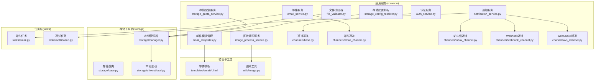
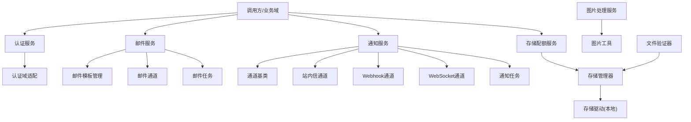
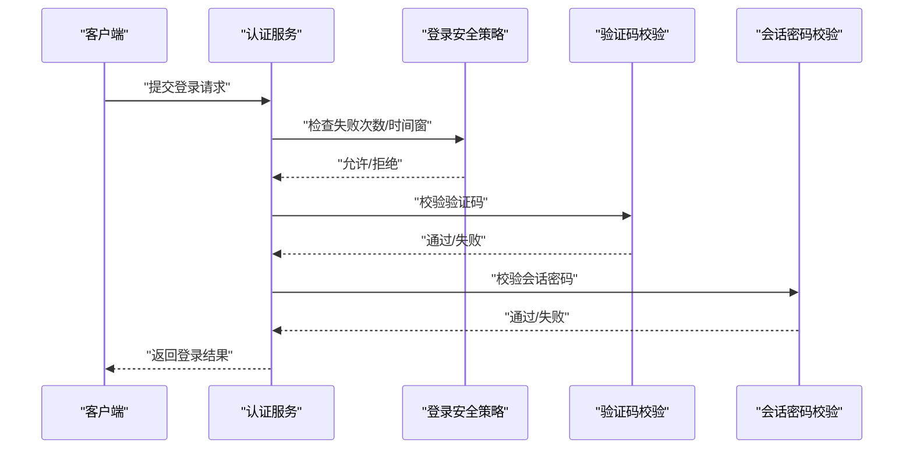
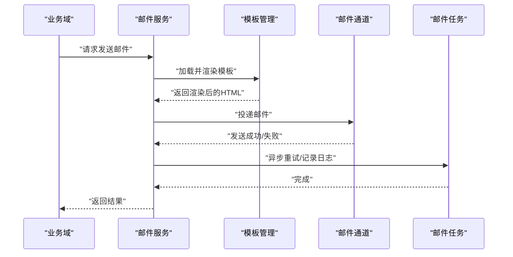
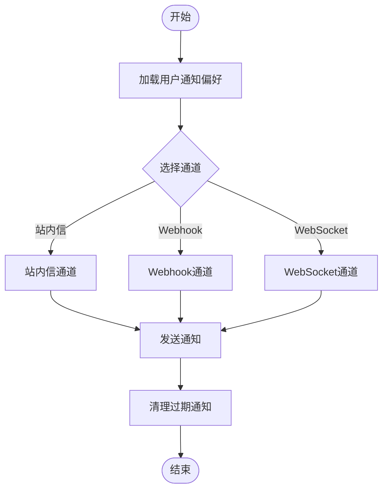
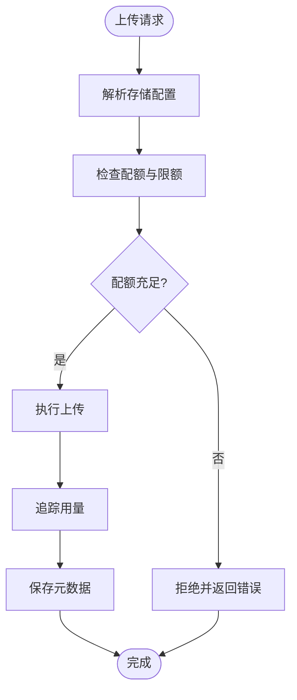
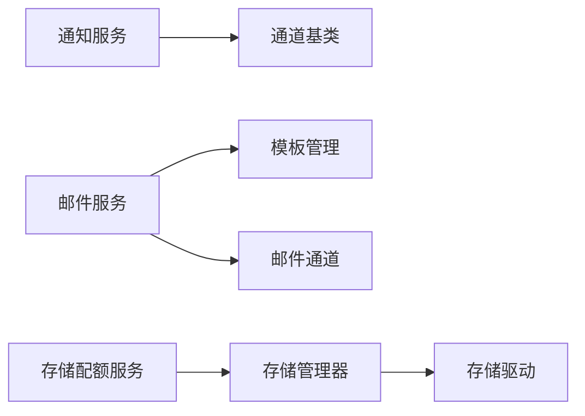

# 通用业务服务

<cite>

**本文引用的文件**
- [auth_service.py](file://backend/app/services/common/auth_service.py)
- [email_service.py](file://backend/app/services/common/email_service.py)
- [notification_service.py](file://backend/app/services/common/notification_service.py)
- [storage_quota_service.py](file://backend/app/services/common/storage_quota_service.py)
- [email_templates.py](file://backend/app/services/common/email_templates.py)
- [image_process_service.py](file://backend/app/services/common/image_process_service.py)
- [file_validator.py](file://backend/app/services/common/file_validator.py)
- [storage_config_resolver.py](file://backend/app/services/common/storage_config_resolver.py)
- [channels/base.py](file://backend/app/services/common/channels/base.py)
- [channels/email_channel.py](file://backend/app/services/common/channels/email_channel.py)
- [channels/inbox_channel.py](file://backend/app/services/common/channels/inbox_channel.py)
- [channels/webhook_channel.py](file://backend/app/services/common/channels/webhook_channel.py)
- [channels/ws_channel.py](file://backend/app/services/common/channels/ws_channel.py)
- [auth_domains/admin_auth.py](file://backend/app/services/common/auth_domains/admin_auth.py)
- [auth_domains/tenant_user_auth.py](file://backend/app/services/common/auth_domains/tenant_user_auth.py)
- [auth_domains/tenant_user_login.py](file://backend/app/services/common/auth_domains/tenant_user_login.py)
- [auth_domains/tenant_user_login_code.py](file://backend/app/services/common/auth_domains/tenant_user_login_code.py)
- [auth_domains/captcha_verification.py](file://backend/app/services/common/auth_domains/captcha_verification.py)
- [auth_domains/session_password.py](file://backend/app/services/common/auth_domains/session_password.py)
- [auth_domains/login_security.py](file://backend/app/services/common/auth_domains/login_security.py)
- [auth_domains/logging_bootstrap.py](file://backend/app/services/common/auth_domains/logging_bootstrap.py)
- [storage/manager.py](file://backend/app/storage/manager.py)
- [storage/base.py](file://backend/app/storage/base.py)
- [storage/drivers/local.py](file://backend/app/storage/drivers/local.py)
- [tasks/email.py](file://backend/app/tasks/email.py)
- [tasks/notification.py](file://backend/app/tasks/notification.py)
- [templates/email/base.html](file://backend/app/templates/email/base.html)
- [templates/email/login_code.html](file://backend/app/templates/email/login_code.html)
- [templates/email/password_reset.html](file://backend/app/templates/email/password_reset.html)
- [templates/email/verification_code.html](file://backend/app/templates/email/verification_code.html)
- [templates/email/welcome.html](file://backend/app/templates/email/welcome.html)
- [utils/image.py](file://backend/app/utils/image.py)
- [exceptions/base.py](file://backend/app/exceptions/base.py)
- [exceptions/storage.py](file://backend/app/exceptions/storage.py)
- [core/security.py](file://backend/app/core/security.py)
- [core/rate_limit.py](file://backend/app/core/rate_limit.py)
- [core/runtime_identity.py](file://backend/app/core/runtime_identity.py)
- [core/redis.py](file://backend/app/core/redis.py)
- [core/database.py](file://backend/app/core/database.py)
- [core/logging.py](file://backend/app/core/logging.py)
- [core/scope.py](file://backend/app/core/scope.py)
- [core/deps.py](file://backend/app/core/deps.py)
- [core/config.py](file://backend/app/core/config.py)
- [core/base_service.py](file://backend/app/core/base_service.py)
- [core/identity.py](file://backend/app/core/identity.py)
- [core/query_parser.py](file://backend/app/core/query_parser.py)
- [core/cors.py](file://backend/app/core/cors.py)
- [core/i18n.py](file://backend/app/core/i18n.py)
- [core/org_authority.py](file://backend/app/core/org_authority.py)
- [core/data_permission.py](file://backend/app/core/data_permission.py)
- [core/recycle_bin.py](file://backend/app/core/recycle_bin.py)
- [core/response.py](file://backend/app/core/response.py)
- [core/socketio_server.py](file://backend/app/core/socketio_server.py)
- [core/sse.py](file://backend/app/core/sse.py)
- [core/sio_bridge.py](file://backend/app/core/sio_bridge.py)
- [core/host_read_facade.py](file://backend/app/core/host_read_facade.py)
- [core/github_source_policy.py](file://backend/app/core/github_source_policy.py)
- [core/hosts_helper.py](file://backend/app/core/hosts_helper.py)
- [core/tenant.py](file://backend/app/core/tenant.py)
- [core/audit_log.py](file://backend/app/core/audit_log.py)
- [core/middleware/trace.py](file://backend/app/middleware/trace.py)
- [core/middleware/permission.py](file://backend/app/middleware/permission.py)
- [core/middleware/tenant.py](file://backend/app/middleware/tenant.py)
- [core/middleware/dynamic_cors.py](file://backend/app/middleware/dynamic_cors.py)
- [core/middleware/prometheus_metrics.py](file://backend/app/core/middleware/prometheus_metrics.py)
- [core/middleware/audit_log.py](file://backend/app/middleware/audit_log.py)
- [core/middleware/i18n.py](file://backend/app/middleware/i18n.py)
- [core/middleware/access_control.py](file://backend/app/middleware/access_control.py)
- [core/middleware/nocache.py](file://backend/app/middleware/nocache.py)
- [core/middleware/maintenance.py](file://backend/app/middleware/maintenance.py)
- [core/middleware/prometheus_metrics.py](file://backend/app/middleware/prometheus_metrics.py)
</cite>

## 目录
1. [简介](#简介)
2. [项目结构](#项目结构)
3. [核心组件](#核心组件)
4. [架构总览](#架构总览)
5. [详细组件分析](#详细组件分析)
6. [依赖分析](#依赖分析)
7. [性能考虑](#性能考虑)
8. [故障排查指南](#故障排查指南)
9. [结论](#结论)
10. [附录](#附录)

## 简介
本文件系统性梳理通用业务服务的设计原则与实现模式，覆盖认证服务、邮件服务、通知服务、存储配额管理等跨领域能力，并对公共接口、安全机制、数据验证规则进行文档化。同时阐述邮件模板管理、图片处理流程与文件验证策略，说明通用服务与各业务域的集成方式与依赖关系，给出配置管理、错误处理与性能优化策略，并提供使用示例与扩展指导。

## 项目结构
通用业务服务主要位于后端应用的服务层 common 包中，围绕认证、邮件、通知、存储配额、通道分发、模板与工具展开；存储子系统独立于通用服务但被其复用；任务层负责异步处理邮件与通知；模板目录提供邮件 HTML 模板；工具模块提供图片处理能力。

**图表来源**
- [auth_service.py](file://backend/app/services/common/auth_service.py)
- [email_service.py](file://backend/app/services/common/email_service.py)
- [notification_service.py](file://backend/app/services/common/notification_service.py)
- [storage_quota_service.py](file://backend/app/services/common/storage_quota_service.py)
- [email_templates.py](file://backend/app/services/common/email_templates.py)
- [image_process_service.py](file://backend/app/services/common/image_process_service.py)
- [file_validator.py](file://backend/app/services/common/file_validator.py)
- [storage_config_resolver.py](file://backend/app/services/common/storage_config_resolver.py)
- [channels/base.py](file://backend/app/services/common/channels/base.py)
- [channels/email_channel.py](file://backend/app/services/common/channels/email_channel.py)
- [channels/inbox_channel.py](file://backend/app/services/common/channels/inbox_channel.py)
- [channels/webhook_channel.py](file://backend/app/services/common/channels/webhook_channel.py)
- [channels/ws_channel.py](file://backend/app/services/common/channels/ws_channel.py)
- [storage/manager.py](file://backend/app/storage/manager.py)
- [storage/base.py](file://backend/app/storage/base.py)
- [storage/drivers/local.py](file://backend/app/storage/drivers/local.py)
- [tasks/email.py](file://backend/app/tasks/email.py)
- [tasks/notification.py](file://backend/app/tasks/notification.py)
- [templates/email/base.html](file://backend/app/templates/email/base.html)
- [utils/image.py](file://backend/app/utils/image.py)

**章节来源**
- [auth_service.py](file://backend/app/services/common/auth_service.py)
- [email_service.py](file://backend/app/services/common/email_service.py)
- [notification_service.py](file://backend/app/services/common/notification_service.py)
- [storage_quota_service.py](file://backend/app/services/common/storage_quota_service.py)
- [email_templates.py](file://backend/app/services/common/email_templates.py)
- [image_process_service.py](file://backend/app/services/common/image_process_service.py)
- [file_validator.py](file://backend/app/services/common/file_validator.py)
- [storage_config_resolver.py](file://backend/app/services/common/storage_config_resolver.py)
- [channels/base.py](file://backend/app/services/common/channels/base.py)
- [channels/email_channel.py](file://backend/app/services/common/channels/email_channel.py)
- [channels/inbox_channel.py](file://backend/app/services/common/channels/inbox_channel.py)
- [channels/webhook_channel.py](file://backend/app/services/common/channels/webhook_channel.py)
- [channels/ws_channel.py](file://backend/app/services/common/channels/ws_channel.py)
- [storage/manager.py](file://backend/app/storage/manager.py)
- [storage/base.py](file://backend/app/storage/base.py)
- [storage/drivers/local.py](file://backend/app/storage/drivers/local.py)
- [tasks/email.py](file://backend/app/tasks/email.py)
- [tasks/notification.py](file://backend/app/tasks/notification.py)
- [templates/email/base.html](file://backend/app/templates/email/base.html)
- [utils/image.py](file://backend/app/utils/image.py)

## 核心组件
- 认证服务：统一登录态管理、会话密码校验、登录安全策略、验证码校验与登录域适配（管理员域、租户用户域）。
- 邮件服务：邮件发送、模板渲染、模板管理、异步任务编排。
- 通知服务：多通道分发（站内信、Webhook、WebSocket），偏好与清理策略。
- 存储配额服务：配额计算、限额检查、用量追踪与回收站联动。
- 图片处理服务：缩略图生成、尺寸裁剪、格式转换与水印等。
- 文件验证器：类型白名单、大小限制、内容安全扫描。
- 存储配置解析：按租户/环境选择存储驱动与参数。
- 通道体系：抽象通道基类与具体通道实现，支持扩展与组合。

**章节来源**
- [auth_service.py](file://backend/app/services/common/auth_service.py)
- [email_service.py](file://backend/app/services/common/email_service.py)
- [notification_service.py](file://backend/app/services/common/notification_service.py)
- [storage_quota_service.py](file://backend/app/services/common/storage_quota_service.py)
- [email_templates.py](file://backend/app/services/common/email_templates.py)
- [image_process_service.py](file://backend/app/services/common/image_process_service.py)
- [file_validator.py](file://backend/app/services/common/file_validator.py)
- [storage_config_resolver.py](file://backend/app/services/common/storage_config_resolver.py)
- [channels/base.py](file://backend/app/services/common/channels/base.py)
- [channels/email_channel.py](file://backend/app/services/common/channels/email_channel.py)
- [channels/inbox_channel.py](file://backend/app/services/common/channels/inbox_channel.py)
- [channels/webhook_channel.py](file://backend/app/services/common/channels/webhook_channel.py)
- [channels/ws_channel.py](file://backend/app/services/common/channels/ws_channel.py)

## 架构总览
通用服务通过“服务层 + 通道层 + 存储层 + 任务层 + 模板层 + 工具层”的协作，形成可插拔、可扩展的跨域通用能力。认证域适配不同登录场景；邮件与通知通过通道分发到多种下游；存储配额与文件验证贯穿上传链路；图片处理与模板渲染提升用户体验。

**图表来源**
- [auth_service.py](file://backend/app/services/common/auth_service.py)
- [email_service.py](file://backend/app/services/common/email_service.py)
- [notification_service.py](file://backend/app/services/common/notification_service.py)
- [storage_quota_service.py](file://backend/app/services/common/storage_quota_service.py)
- [email_templates.py](file://backend/app/services/common/email_templates.py)
- [channels/base.py](file://backend/app/services/common/channels/base.py)
- [channels/email_channel.py](file://backend/app/services/common/channels/email_channel.py)
- [channels/inbox_channel.py](file://backend/app/services/common/channels/inbox_channel.py)
- [channels/webhook_channel.py](file://backend/app/services/common/channels/webhook_channel.py)
- [channels/ws_channel.py](file://backend/app/services/common/channels/ws_channel.py)
- [storage/manager.py](file://backend/app/storage/manager.py)
- [storage/drivers/local.py](file://backend/app/storage/drivers/local.py)
- [tasks/email.py](file://backend/app/tasks/email.py)
- [tasks/notification.py](file://backend/app/tasks/notification.py)
- [image_process_service.py](file://backend/app/services/common/image_process_service.py)
- [utils/image.py](file://backend/app/utils/image.py)
- [file_validator.py](file://backend/app/services/common/file_validator.py)

## 详细组件分析

### 认证服务
- 设计原则：最小暴露面、强会话、弱凭证；登录态与会话密码分离；登录安全策略与验证码校验解耦。
- 关键能力：
  - 登录态管理与会话密码校验
  - 登录安全策略（失败次数、时间窗、锁定）
  - 验证码校验与登录域适配（管理员域、租户用户域）
- 公共接口要点（路径参考）：
  - 登录态与会话密码校验：[auth_service.py](file://backend/app/services/common/auth_service.py)
  - 登录安全策略：[auth_domains/login_security.py](file://backend/app/services/common/auth_domains/login_security.py)
  - 验证码校验：[auth_domains/captcha_verification.py](file://backend/app/services/common/auth_domains/captcha_verification.py)
  - 会话密码校验：[auth_domains/session_password.py](file://backend/app/services/common/auth_domains/session_password.py)
  - 租户用户登录域：[auth_domains/tenant_user_login.py](file://backend/app/services/common/auth_domains/tenant_user_login.py)
  - 租户用户登录码：[auth_domains/tenant_user_login_code.py](file://backend/app/services/common/auth_domains/tenant_user_login_code.py)
  - 管理员域与租户用户域适配：[auth_domains/admin_auth.py](file://backend/app/services/common/auth_domains/admin_auth.py), [auth_domains/tenant_user_auth.py](file://backend/app/services/common/auth_domains/tenant_user_auth.py)
- 安全机制：
  - 强制会话密码校验与登录安全策略
  - 验证码校验与登录域隔离
  - 日志引导与审计（登录域日志引导）：[auth_domains/logging_bootstrap.py](file://backend/app/services/common/auth_domains/logging_bootstrap.py)

**图表来源**
- [auth_service.py](file://backend/app/services/common/auth_service.py)
- [auth_domains/login_security.py](file://backend/app/services/common/auth_domains/login_security.py)
- [auth_domains/captcha_verification.py](file://backend/app/services/common/auth_domains/captcha_verification.py)
- [auth_domains/session_password.py](file://backend/app/services/common/auth_domains/session_password.py)

**章节来源**
- [auth_service.py](file://backend/app/services/common/auth_service.py)
- [auth_domains/login_security.py](file://backend/app/services/common/auth_domains/login_security.py)
- [auth_domains/captcha_verification.py](file://backend/app/services/common/auth_domains/captcha_verification.py)
- [auth_domains/session_password.py](file://backend/app/services/common/auth_domains/session_password.py)
- [auth_domains/tenant_user_login.py](file://backend/app/services/common/auth_domains/tenant_user_login.py)
- [auth_domains/tenant_user_login_code.py](file://backend/app/services/common/auth_domains/tenant_user_login_code.py)
- [auth_domains/admin_auth.py](file://backend/app/services/common/auth_domains/admin_auth.py)
- [auth_domains/tenant_user_auth.py](file://backend/app/services/common/auth_domains/tenant_user_auth.py)
- [auth_domains/logging_bootstrap.py](file://backend/app/services/common/auth_domains/logging_bootstrap.py)

### 邮件服务
- 设计原则：模板与逻辑分离、异步发送、通道可插拔、安全渲染。
- 关键能力：
  - 邮件发送与模板渲染
  - 邮件模板管理与继承
  - 异步任务编排与重试
- 公共接口要点（路径参考）：
  - 邮件服务入口：[email_service.py](file://backend/app/services/common/email_service.py)
  - 邮件模板管理：[email_templates.py](file://backend/app/services/common/email_templates.py)
  - 邮件通道：[channels/email_channel.py](file://backend/app/services/common/channels/email_channel.py)
  - 邮件任务：[tasks/email.py](file://backend/app/tasks/email.py)
  - 邮件模板 HTML：[templates/email/base.html](file://backend/app/templates/email/base.html), [templates/email/login_code.html](file://backend/app/templates/email/login_code.html), [templates/email/password_reset.html](file://backend/app/templates/email/password_reset.html), [templates/email/verification_code.html](file://backend/app/templates/email/verification_code.html), [templates/email/welcome.html](file://backend/app/templates/email/welcome.html)

**图表来源**
- [email_service.py](file://backend/app/services/common/email_service.py)
- [email_templates.py](file://backend/app/services/common/email_templates.py)
- [channels/email_channel.py](file://backend/app/services/common/channels/email_channel.py)
- [tasks/email.py](file://backend/app/tasks/email.py)
- [templates/email/base.html](file://backend/app/templates/email/base.html)

**章节来源**
- [email_service.py](file://backend/app/services/common/email_service.py)
- [email_templates.py](file://backend/app/services/common/email_templates.py)
- [channels/email_channel.py](file://backend/app/services/common/channels/email_channel.py)
- [tasks/email.py](file://backend/app/tasks/email.py)
- [templates/email/base.html](file://backend/app/templates/email/base.html)
- [templates/email/login_code.html](file://backend/app/templates/email/login_code.html)
- [templates/email/password_reset.html](file://backend/app/templates/email/password_reset.html)
- [templates/email/verification_code.html](file://backend/app/templates/email/verification_code.html)
- [templates/email/welcome.html](file://backend/app/templates/email/welcome.html)

### 通知服务
- 设计原则：多通道分发、偏好控制、清理策略、实时性与可靠性平衡。
- 关键能力：
  - 站内信、Webhook、WebSocket 多通道分发
  - 通知偏好与清理策略
  - 通道抽象与扩展
- 公共接口要点（路径参考）：
  - 通知服务入口：[notification_service.py](file://backend/app/services/common/notification_service.py)
  - 通道基类：[channels/base.py](file://backend/app/services/common/channels/base.py)
  - 站内信通道：[channels/inbox_channel.py](file://backend/app/services/common/channels/inbox_channel.py)
  - Webhook 通道：[channels/webhook_channel.py](file://backend/app/services/common/channels/webhook_channel.py)
  - WebSocket 通道：[channels/ws_channel.py](file://backend/app/services/common/channels/ws_channel.py)
  - 通知任务：[tasks/notification.py](file://backend/app/tasks/notification.py)

**图表来源**
- [notification_service.py](file://backend/app/services/common/notification_service.py)
- [channels/base.py](file://backend/app/services/common/channels/base.py)
- [channels/inbox_channel.py](file://backend/app/services/common/channels/inbox_channel.py)
- [channels/webhook_channel.py](file://backend/app/services/common/channels/webhook_channel.py)
- [channels/ws_channel.py](file://backend/app/services/common/channels/ws_channel.py)
- [tasks/notification.py](file://backend/app/tasks/notification.py)

**章节来源**
- [notification_service.py](file://backend/app/services/common/notification_service.py)
- [channels/base.py](file://backend/app/services/common/channels/base.py)
- [channels/inbox_channel.py](file://backend/app/services/common/channels/inbox_channel.py)
- [channels/webhook_channel.py](file://backend/app/services/common/channels/webhook_channel.py)
- [channels/ws_channel.py](file://backend/app/services/common/channels/ws_channel.py)
- [tasks/notification.py](file://backend/app/tasks/notification.py)

### 存储配额服务
- 设计原则：透明配额、自动追踪、回收站联动、可配置阈值。
- 关键能力：
  - 配额计算与限额检查
  - 用量追踪与回收站联动
  - 存储配置解析与驱动选择
- 公共接口要点（路径参考）：
  - 存储配额服务：[storage_quota_service.py](file://backend/app/services/common/storage_quota_service.py)
  - 存储配置解析：[storage_config_resolver.py](file://backend/app/services/common/storage_config_resolver.py)
  - 存储管理器：[storage/manager.py](file://backend/app/storage/manager.py)
  - 存储基类与驱动：[storage/base.py](file://backend/app/storage/base.py), [storage/drivers/local.py](file://backend/app/storage/drivers/local.py)

**图表来源**
- [storage_quota_service.py](file://backend/app/services/common/storage_quota_service.py)
- [storage_config_resolver.py](file://backend/app/services/common/storage_config_resolver.py)
- [storage/manager.py](file://backend/app/storage/manager.py)
- [storage/base.py](file://backend/app/storage/base.py)
- [storage/drivers/local.py](file://backend/app/storage/drivers/local.py)

**章节来源**
- [storage_quota_service.py](file://backend/app/services/common/storage_quota_service.py)
- [storage_config_resolver.py](file://backend/app/services/common/storage_config_resolver.py)
- [storage/manager.py](file://backend/app/storage/manager.py)
- [storage/base.py](file://backend/app/storage/base.py)
- [storage/drivers/local.py](file://backend/app/storage/drivers/local.py)

### 图片处理服务
- 设计原则：无损处理、可配置参数、与存储驱动解耦。
- 关键能力：
  - 缩略图生成、尺寸裁剪、格式转换
  - 水印与质量控制
- 公共接口要点（路径参考）：
  - 图片处理服务：[image_process_service.py](file://backend/app/services/common/image_process_service.py)
  - 图片工具：[utils/image.py](file://backend/app/utils/image.py)

**章节来源**
- [image_process_service.py](file://backend/app/services/common/image_process_service.py)
- [utils/image.py](file://backend/app/utils/image.py)

### 文件验证器
- 设计原则：白名单策略、大小限制、内容安全扫描。
- 关键能力：
  - 类型白名单与 MIME 校验
  - 大小限制与重复文件检测
  - 内容安全扫描与病毒库对接
- 公共接口要点（路径参考）：
  - 文件验证器：[file_validator.py](file://backend/app/services/common/file_validator.py)

**章节来源**
- [file_validator.py](file://backend/app/services/common/file_validator.py)

## 依赖分析
- 组件耦合与内聚：
  - 通知服务与通道层松耦合，通过通道基类扩展新通道。
  - 邮件服务与模板层、通道层、任务层解耦，职责清晰。
  - 存储配额服务与存储管理器、回收站联动，边界明确。
- 外部依赖与集成点：
  - 存储驱动（本地/云存储插件）通过存储管理器抽象接入。
  - 任务队列用于异步邮件与通知处理。
  - 中间件与安全模块提供统一的权限、审计、追踪能力。
- 接口契约与实现细节：
  - 通道基类定义统一接口，具体通道实现遵循该接口。
  - 存储配置解析器根据租户与环境返回合适的驱动参数。

**图表来源**
- [notification_service.py](file://backend/app/services/common/notification_service.py)
- [channels/base.py](file://backend/app/services/common/channels/base.py)
- [email_service.py](file://backend/app/services/common/email_service.py)
- [email_templates.py](file://backend/app/services/common/email_templates.py)
- [channels/email_channel.py](file://backend/app/services/common/channels/email_channel.py)
- [storage_quota_service.py](file://backend/app/services/common/storage_quota_service.py)
- [storage/manager.py](file://backend/app/storage/manager.py)
- [storage/drivers/local.py](file://backend/app/storage/drivers/local.py)

**章节来源**
- [notification_service.py](file://backend/app/services/common/notification_service.py)
- [channels/base.py](file://backend/app/services/common/channels/base.py)
- [email_service.py](file://backend/app/services/common/email_service.py)
- [email_templates.py](file://backend/app/services/common/email_templates.py)
- [channels/email_channel.py](file://backend/app/services/common/channels/email_channel.py)
- [storage_quota_service.py](file://backend/app/services/common/storage_quota_service.py)
- [storage/manager.py](file://backend/app/storage/manager.py)
- [storage/drivers/local.py](file://backend/app/storage/drivers/local.py)

## 性能考虑
- 异步化：邮件与通知通过任务队列异步处理，降低请求延迟。
- 缓存与限流：结合中间件与速率限制模块，控制并发与请求频率。
- 存储优化：配额与用量追踪采用批量更新与缓存，减少数据库压力。
- 图片处理：按需生成缩略图与压缩，避免不必要的大图传输。
- 模板渲染：模板静态化与缓存，减少重复渲染开销。

## 故障排查指南
- 常见错误与定位：
  - 存储相关错误：参考存储异常基类与存储模块，定位驱动与配额问题。
  - 通道发送失败：检查通道实现与下游可用性，查看任务队列状态。
  - 认证失败：核对登录安全策略、验证码与会话密码校验日志。
- 错误处理与恢复：
  - 使用统一异常基类与错误码规范，便于前端与监控系统识别。
  - 任务重试与死信队列策略，确保消息不丢失。
- 调试建议：
  - 启用追踪中间件与审计日志，定位请求链路。
  - 在开发环境开启详细日志，观察模板渲染与通道投递过程。

**章节来源**
- [exceptions/base.py](file://backend/app/exceptions/base.py)
- [exceptions/storage.py](file://backend/app/exceptions/storage.py)
- [tasks/email.py](file://backend/app/tasks/email.py)
- [tasks/notification.py](file://backend/app/tasks/notification.py)
- [core/middleware/trace.py](file://backend/app/middleware/trace.py)
- [core/middleware/audit_log.py](file://backend/app/middleware/audit_log.py)

## 结论
通用业务服务以“通道化、模板化、任务化、配额化”为核心设计思想，实现了认证、邮件、通知、存储配额等跨域能力的高内聚低耦合封装。通过严格的接口契约、安全机制与性能优化策略，为上层业务域提供稳定、可扩展、可观测的通用能力。

## 附录
- 使用示例与扩展指导（路径参考）：
  - 认证登录流程：[auth_service.py](file://backend/app/services/common/auth_service.py), [auth_domains/tenant_user_login.py](file://backend/app/services/common/auth_domains/tenant_user_login.py)
  - 发送邮件：[email_service.py](file://backend/app/services/common/email_service.py), [tasks/email.py](file://backend/app/tasks/email.py)
  - 分发通知：[notification_service.py](file://backend/app/services/common/notification_service.py), [channels/inbox_channel.py](file://backend/app/services/common/channels/inbox_channel.py), [channels/webhook_channel.py](file://backend/app/services/common/channels/webhook_channel.py), [channels/ws_channel.py](file://backend/app/services/common/channels/ws_channel.py)
  - 存储配额检查与上传：[storage_quota_service.py](file://backend/app/services/common/storage_quota_service.py), [storage/manager.py](file://backend/app/storage/manager.py)
  - 图片处理：[image_process_service.py](file://backend/app/services/common/image_process_service.py), [utils/image.py](file://backend/app/utils/image.py)
  - 文件验证：[file_validator.py](file://backend/app/services/common/file_validator.py)
  - 配置解析：[storage_config_resolver.py](file://backend/app/services/common/storage_config_resolver.py)