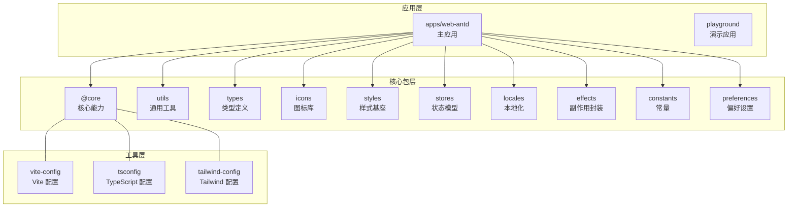
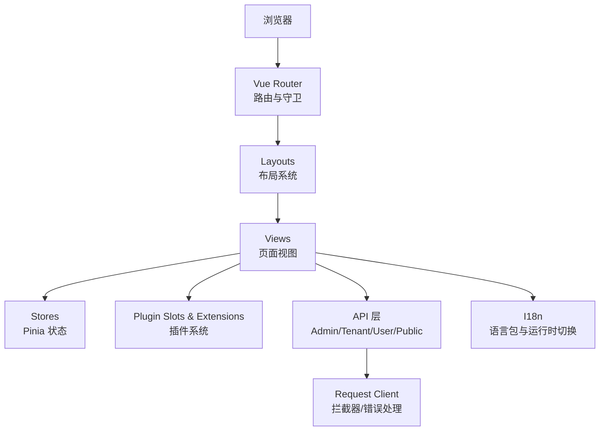
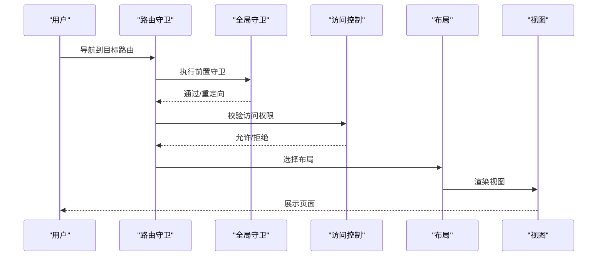
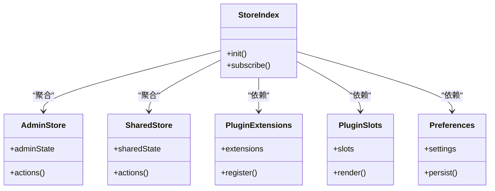
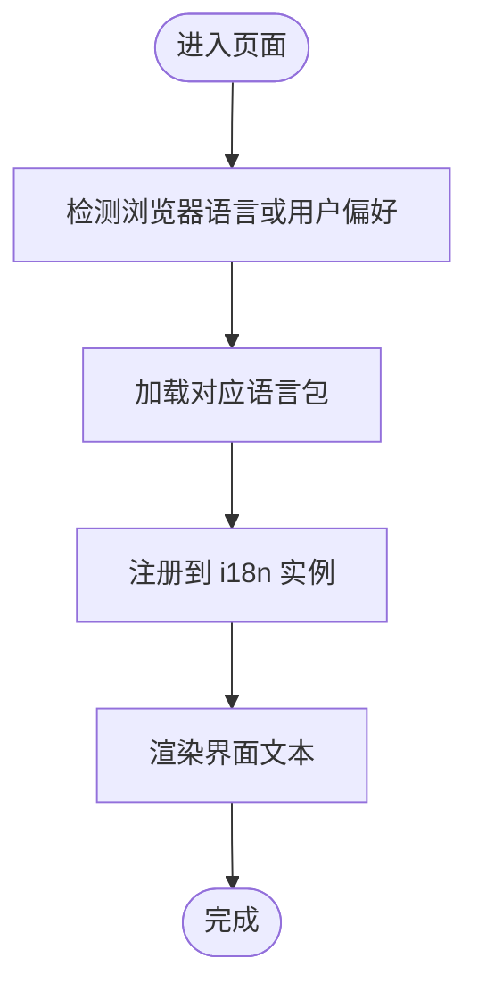
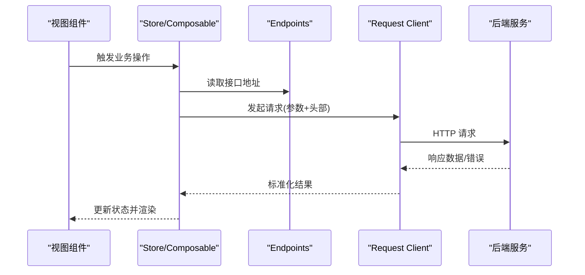
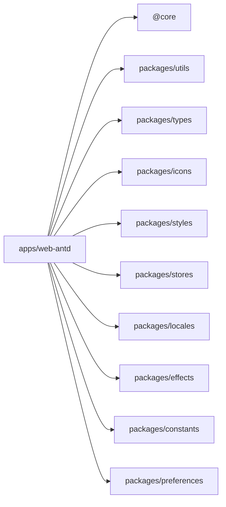

# 前端应用架构

<cite>
**本文引用的文件**
- [apps/web-antd/src/main.ts](file://apps/web-antd/src/main.ts)
- [apps/web-antd/src/app.vue](file://apps/web-antd/src/app.vue)
- [apps/web-antd/src/bootstrap.ts](file://apps/web-antd/src/bootstrap.ts)
- [apps/web-antd/src/router/index.ts](file://apps/web-antd/src/router/index.ts)
- [apps/web-antd/src/router/guard.ts](file://apps/web-antd/src/router/guard.ts)
- [apps/web-antd/src/router/access.ts](file://apps/web-antd/src/router/access.ts)
- [apps/web-antd/src/layouts/index.ts](file://apps/web-antd/src/layouts/index.ts)
- [apps/web-antd/src/layouts/basic.vue](file://apps/web-antd/src/layouts/basic.vue)
- [apps/web-antd/src/layouts/user.vue](file://apps/web-antd/src/layouts/user.vue)
- [apps/web-antd/src/layouts/admin-auth.vue](file://apps/web-antd/src/layouts/admin-auth.vue)
- [apps/web-antd/src/store/index.ts](file://apps/web-antd/src/store/index.ts)
- [apps/web-antd/src/store/admin/index.ts](file://apps/web-antd/src/store/admin/index.ts)
- [apps/web-antd/src/store/shared/index.ts](file://apps/web-antd/src/store/shared/index.ts)
- [apps/web-antd/src/stores/plugin-extensions.ts](file://apps/web-antd/src/stores/plugin-extensions.ts)
- [apps/web-antd/src/stores/plugin-slots.ts](file://apps/web-antd/src/stores/plugin-slots.ts)
- [apps/web-antd/src/constants/endpoints.ts](file://apps/web-antd/src/constants/endpoints.ts)
- [apps/web-antd/src/utils/request/index.ts](file://apps/web-antd/src/utils/request/index.ts)
- [apps/web-antd/src/utils/request/client.ts](file://apps/web-antd/src/utils/request/client.ts)
- [apps/web-antd/src/utils/error-helpers.ts](file://apps/web-antd/src/utils/error-helpers.ts)
- [apps/web-antd/src/composables/use-socketio.ts](file://apps/web-antd/src/composables/use-socketio.ts)
- [apps/web-antd/src/directives/access.ts](file://apps/web-antd/src/directives/access.ts)
- [apps/web-antd/src/components/AppErrorBoundary.vue](file://apps/web-antd/src/components/AppErrorBoundary.vue)
- [apps/web-antd/src/locales/index.ts](file://apps/web-antd/src/locales/index.ts)
- [apps/web-antd/src/locales/runtime-locale.ts](file://apps/web-antd/src/locales/runtime-locale.ts)
- [apps/web-antd/src/locales/langs/en.ts](file://apps/web-antd/src/locales/langs/en.ts)
- [apps/web-antd/src/locales/langs/zh_CN.ts](file://apps/web-antd/src/locales/langs/zh_CN.ts)
- [apps/web-antd/src/views/admin/dashboard/index.vue](file://apps/web-antd/src/views/admin/dashboard/index.vue)
- [apps/web-antd/src/views/user/dashboard/index.vue](file://apps/web-antd/src/views/user/dashboard/index.vue)
- [apps/web-antd/src/views/public/platform-home/index.vue](file://apps/web-antd/src/views/public/platform-home/index.vue)
- [apps/web-antd/src/preferences.ts](file://apps/web-antd/src/preferences.ts)
- [apps/web-antd/vite.config.mts](file://apps/web-antd/vite.config.mts)
- [apps/web-antd/package.json](file://apps/web-antd/package.json)
- [packages/@core/package.json](file://packages/@core/package.json)
- [packages/utils/package.json](file://packages/utils/package.json)
- [packages/types/package.json](file://packages/types/package.json)
- [packages/icons/package.json](file://packages/icons/package.json)
- [packages/styles/package.json](file://packages/styles/package.json)
- [packages/stores/package.json](file://packages/stores/package.json)
- [packages/locales/package.json](file://packages/locales/package.json)
- [packages/effects/package.json](file://packages/effects/package.json)
- [packages/constants/package.json](file://packages/constants/package.json)
- [packages/preferences/package.json](file://packages/preferences/package.json)
- [internal/vite-config/src/index.ts](file://internal/vite-config/src/index.ts)
- [internal/tsconfig/base.json](file://internal/tsconfig/base.json)
- [internal/tsconfig/web.json](file://internal/tsconfig/web.json)
- [internal/tailwind-config/src/index.ts](file://internal/tailwind-config/src/index.ts)
- [scripts/deploy/build-local-docker-image.sh](file://scripts/deploy/build-local-docker-image.sh)
- [scripts/deploy/nginx.conf](file://scripts/deploy/nginx.conf)
- [docker-compose.dev.yml](file://docker-compose.dev.yml)
- [docker-compose.prod.yml](file://docker-compose.prod.yml)
- [README.md](file://README.md)
</cite>

## 目录
1. [引言](#引言)
2. [项目结构](#项目结构)
3. [核心组件](#核心组件)
4. [架构总览](#架构总览)
5. [详细组件分析](#详细组件分析)
6. [依赖关系分析](#依赖关系分析)
7. [性能考虑](#性能考虑)
8. [故障排查指南](#故障排查指南)
9. [结论](#结论)
10. [附录](#附录)

## 引言
本文件面向前端应用架构，围绕 Vue.js 应用的结构、组件设计模式、状态管理、路由系统、国际化与样式架构进行系统化技术文档化；同时覆盖 UI 组件库设计原则、通用组件与工具函数、前后端集成模式（API 调用与错误处理）、性能优化（代码分割与懒加载）、开发工具链与构建部署策略，并补充响应式设计、无障碍与跨浏览器兼容性建议及组件开发最佳实践。

## 项目结构
前端采用多包工作区（pnpm workspace）组织，核心应用位于 apps/web-antd，配套内部包与工具在 packages/* 与 internal/* 下，形成可复用的基础设施层。整体结构遵循“应用层 + 核心包层 + 工具层”的分层设计，便于扩展与维护。

图表来源
- [apps/web-antd/src/main.ts](file://apps/web-antd/src/main.ts)
- [packages/@core/package.json](file://packages/@core/package.json)
- [packages/utils/package.json](file://packages/utils/package.json)
- [packages/types/package.json](file://packages/types/package.json)
- [packages/icons/package.json](file://packages/icons/package.json)
- [packages/styles/package.json](file://packages/styles/package.json)
- [packages/stores/package.json](file://packages/stores/package.json)
- [packages/locales/package.json](file://packages/locales/package.json)
- [packages/effects/package.json](file://packages/effects/package.json)
- [packages/constants/package.json](file://packages/constants/package.json)
- [packages/preferences/package.json](file://packages/preferences/package.json)
- [internal/vite-config/src/index.ts](file://internal/vite-config/src/index.ts)
- [internal/tsconfig/base.json](file://internal/tsconfig/base.json)
- [internal/tailwind-config/src/index.ts](file://internal/tailwind-config/src/index.ts)

章节来源
- [apps/web-antd/src/main.ts](file://apps/web-antd/src/main.ts)
- [apps/web-antd/package.json](file://apps/web-antd/package.json)
- [packages/@core/package.json](file://packages/@core/package.json)
- [packages/utils/package.json](file://packages/utils/package.json)
- [packages/types/package.json](file://packages/types/package.json)
- [packages/icons/package.json](file://packages/icons/package.json)
- [packages/styles/package.json](file://packages/styles/package.json)
- [packages/stores/package.json](file://packages/stores/package.json)
- [packages/locales/package.json](file://packages/locales/package.json)
- [packages/effects/package.json](file://packages/effects/package.json)
- [packages/constants/package.json](file://packages/constants/package.json)
- [packages/preferences/package.json](file://packages/preferences/package.json)
- [internal/vite-config/src/index.ts](file://internal/vite-config/src/index.ts)
- [internal/tsconfig/base.json](file://internal/tsconfig/base.json)
- [internal/tailwind-config/src/index.ts](file://internal/tailwind-config/src/index.ts)

## 核心组件
- 应用入口与引导：应用通过 main.ts 初始化，app.vue 作为根组件，bootstrap.ts 承载启动逻辑与插件初始化。
- 路由与守卫：router/index.ts 定义路由表，guard.ts 实现全局前置守卫与权限控制，access.ts 提供细粒度访问控制。
- 布局系统：layouts 提供基础布局与认证相关布局，支持不同角色与场景的页面骨架。
- 状态管理：store 与 stores 提供应用级与插件级状态，admin 与 shared 子模块按领域拆分。
- 国际化：locales 提供语言注册与运行时切换，langs 存放语言资源。
- 请求与错误处理：utils/request 封装请求客户端与拦截器，error-helpers 提供统一错误处理策略。
- 指令与组件：directives 提供权限指令，components 包含业务组件与错误边界组件。
- 视图层：views 下按 admin/user/public 等域划分视图，体现清晰的职责分离。

章节来源
- [apps/web-antd/src/app.vue](file://apps/web-antd/src/app.vue)
- [apps/web-antd/src/bootstrap.ts](file://apps/web-antd/src/bootstrap.ts)
- [apps/web-antd/src/router/index.ts](file://apps/web-antd/src/router/index.ts)
- [apps/web-antd/src/router/guard.ts](file://apps/web-antd/src/router/guard.ts)
- [apps/web-antd/src/router/access.ts](file://apps/web-antd/src/router/access.ts)
- [apps/web-antd/src/layouts/index.ts](file://apps/web-antd/src/layouts/index.ts)
- [apps/web-antd/src/store/index.ts](file://apps/web-antd/src/store/index.ts)
- [apps/web-antd/src/store/admin/index.ts](file://apps/web-antd/src/store/admin/index.ts)
- [apps/web-antd/src/store/shared/index.ts](file://apps/web-antd/src/store/shared/index.ts)
- [apps/web-antd/src/stores/plugin-extensions.ts](file://apps/web-antd/src/stores/plugin-extensions.ts)
- [apps/web-antd/src/stores/plugin-slots.ts](file://apps/web-antd/src/stores/plugin-slots.ts)
- [apps/web-antd/src/locales/index.ts](file://apps/web-antd/src/locales/index.ts)
- [apps/web-antd/src/locales/runtime-locale.ts](file://apps/web-antd/src/locales/runtime-locale.ts)
- [apps/web-antd/src/utils/request/index.ts](file://apps/web-antd/src/utils/request/index.ts)
- [apps/web-antd/src/utils/error-helpers.ts](file://apps/web-antd/src/utils/error-helpers.ts)
- [apps/web-antd/src/directives/access.ts](file://apps/web-antd/src/directives/access.ts)
- [apps/web-antd/src/components/AppErrorBoundary.vue](file://apps/web-antd/src/components/AppErrorBoundary.vue)

## 架构总览
应用采用“单页应用 + 插件化扩展 + 多包复用”的架构。核心要点：
- 单页应用：基于 Vue Router 的前端路由，结合守卫实现鉴权与导航控制。
- 插件化扩展：通过 stores/plugin-extensions 与 stores/plugin-slots 管理插件生态，实现功能动态装配。
- 多包复用：核心包（@core、utils、types、icons、styles、stores、locales、effects、constants、preferences）在工作区内共享，降低重复与耦合。
- 请求与状态：统一的请求客户端与错误处理，结合 Pinia 状态管理，按域拆分 store。
- 国际化：静态语言包与运行时切换相结合，支持多语言环境。

图表来源
- [apps/web-antd/src/router/index.ts](file://apps/web-antd/src/router/index.ts)
- [apps/web-antd/src/router/guard.ts](file://apps/web-antd/src/router/guard.ts)
- [apps/web-antd/src/layouts/basic.vue](file://apps/web-antd/src/layouts/basic.vue)
- [apps/web-antd/src/store/index.ts](file://apps/web-antd/src/store/index.ts)
- [apps/web-antd/src/stores/plugin-extensions.ts](file://apps/web-antd/src/stores/plugin-extensions.ts)
- [apps/web-antd/src/stores/plugin-slots.ts](file://apps/web-antd/src/stores/plugin-slots.ts)
- [apps/web-antd/src/api/admin/index.ts](file://apps/web-antd/src/api/admin/index.ts)
- [apps/web-antd/src/api/tenant/index.ts](file://apps/web-antd/src/api/tenant/index.ts)
- [apps/web-antd/src/api/user/index.ts](file://apps/web-antd/src/api/user/index.ts)
- [apps/web-antd/src/api/public/index.ts](file://apps/web-antd/src/api/public/index.ts)
- [apps/web-antd/src/utils/request/index.ts](file://apps/web-antd/src/utils/request/index.ts)
- [apps/web-antd/src/locales/index.ts](file://apps/web-antd/src/locales/index.ts)

## 详细组件分析

### 路由系统与权限控制
- 路由定义：router/index.ts 组织路由表，按域与页面划分。
- 全局守卫：router/guard.ts 实现登录态校验、租户域切换、角色权限等前置逻辑。
- 访问控制：router/access.ts 提供细粒度访问控制，结合后端策略与前端指令使用。
- 导航与标题同步：layouts 中包含文档标题同步与语言导航同步逻辑，提升用户体验。

图表来源
- [apps/web-antd/src/router/guard.ts](file://apps/web-antd/src/router/guard.ts)
- [apps/web-antd/src/router/access.ts](file://apps/web-antd/src/router/access.ts)
- [apps/web-antd/src/layouts/basic.vue](file://apps/web-antd/src/layouts/basic.vue)
- [apps/web-antd/src/views/admin/dashboard/index.vue](file://apps/web-antd/src/views/admin/dashboard/index.vue)

章节来源
- [apps/web-antd/src/router/index.ts](file://apps/web-antd/src/router/index.ts)
- [apps/web-antd/src/router/guard.ts](file://apps/web-antd/src/router/guard.ts)
- [apps/web-antd/src/router/access.ts](file://apps/web-antd/src/router/access.ts)
- [apps/web-antd/src/layouts/index.ts](file://apps/web-antd/src/layouts/index.ts)

### 状态管理（Pinia）
- 应用级 Store：store/index.ts 统一导出与聚合。
- 领域拆分：store/admin 与 store/shared 按管理域与共享域拆分，职责清晰。
- 插件状态：stores/plugin-extensions 与 stores/plugin-slots 支持插件生态的状态管理。
- 偏好设置：preferences.ts 提供用户偏好持久化与同步机制。

图表来源
- [apps/web-antd/src/store/index.ts](file://apps/web-antd/src/store/index.ts)
- [apps/web-antd/src/store/admin/index.ts](file://apps/web-antd/src/store/admin/index.ts)
- [apps/web-antd/src/store/shared/index.ts](file://apps/web-antd/src/store/shared/index.ts)
- [apps/web-antd/src/stores/plugin-extensions.ts](file://apps/web-antd/src/stores/plugin-extensions.ts)
- [apps/web-antd/src/stores/plugin-slots.ts](file://apps/web-antd/src/stores/plugin-slots.ts)
- [apps/web-antd/src/preferences.ts](file://apps/web-antd/src/preferences.ts)

章节来源
- [apps/web-antd/src/store/index.ts](file://apps/web-antd/src/store/index.ts)
- [apps/web-antd/src/store/admin/index.ts](file://apps/web-antd/src/store/admin/index.ts)
- [apps/web-antd/src/store/shared/index.ts](file://apps/web-antd/src/store/shared/index.ts)
- [apps/web-antd/src/stores/plugin-extensions.ts](file://apps/web-antd/src/stores/plugin-extensions.ts)
- [apps/web-antd/src/stores/plugin-slots.ts](file://apps/web-antd/src/stores/plugin-slots.ts)
- [apps/web-antd/src/preferences.ts](file://apps/web-antd/src/preferences.ts)

### 国际化（i18n）
- 语言注册：locales/index.ts 注册语言包，runtime-locale.ts 提供运行时切换。
- 语言资源：langs/en.ts 与 langs/zh_CN.ts 提供英文与简中资源。
- 使用方式：在组件与工具中通过统一的 i18n 接口进行文本渲染与提示。

图表来源
- [apps/web-antd/src/locales/index.ts](file://apps/web-antd/src/locales/index.ts)
- [apps/web-antd/src/locales/runtime-locale.ts](file://apps/web-antd/src/locales/runtime-locale.ts)
- [apps/web-antd/src/locales/langs/en.ts](file://apps/web-antd/src/locales/langs/en.ts)
- [apps/web-antd/src/locales/langs/zh_CN.ts](file://apps/web-antd/src/locales/langs/zh_CN.ts)

章节来源
- [apps/web-antd/src/locales/index.ts](file://apps/web-antd/src/locales/index.ts)
- [apps/web-antd/src/locales/runtime-locale.ts](file://apps/web-antd/src/locales/runtime-locale.ts)
- [apps/web-antd/src/locales/langs/en.ts](file://apps/web-antd/src/locales/langs/en.ts)
- [apps/web-antd/src/locales/langs/zh_CN.ts](file://apps/web-antd/src/locales/langs/zh_CN.ts)

### 样式架构与响应式设计
- Tailwind 配置：internal/tailwind-config 提供主题与工具类定制。
- 样式基座：packages/styles 提供全局样式与变量。
- 响应式：通过 Tailwind 断点与自定义媒体查询实现响应式布局。
- 可访问性：语义化标签、ARIA 属性与键盘导航优先策略贯穿组件设计。

章节来源
- [internal/tailwind-config/src/index.ts](file://internal/tailwind-config/src/index.ts)
- [packages/styles/package.json](file://packages/styles/package.json)

### UI 组件库设计原则与通用组件
- 设计原则：单一职责、可组合、可复用、可测试。
- 通用组件：在 components 下沉淀基础与业务组件，通过 index.ts 统一导出。
- 错误边界：AppErrorBoundary.vue 提供全局错误捕获与降级展示。
- 权限指令：directives/access.ts 提供基于角色的 DOM 级别可见性控制。

章节来源
- [apps/web-antd/src/components/AppErrorBoundary.vue](file://apps/web-antd/src/components/AppErrorBoundary.vue)
- [apps/web-antd/src/directives/access.ts](file://apps/web-antd/src/directives/access.ts)

### 工具函数与通用能力
- 请求封装：utils/request 提供统一客户端、拦截器与错误处理。
- 业务工具：utils 下包含附件、格式化、菜单导航、插件加载等工具。
- 通用能力：composables 提供可复用的组合式逻辑（如 CRUD、SocketIO、诊断策略等）。

章节来源
- [apps/web-antd/src/utils/request/index.ts](file://apps/web-antd/src/utils/request/index.ts)
- [apps/web-antd/src/utils/request/client.ts](file://apps/web-antd/src/utils/request/client.ts)
- [apps/web-antd/src/utils/error-helpers.ts](file://apps/web-antd/src/utils/error-helpers.ts)
- [apps/web-antd/src/composables/use-socketio.ts](file://apps/web-antd/src/composables/use-socketio.ts)

### 前后端集成模式与 API 调用
- API 分层：api/admin、api/tenant、api/user、api/public 按域划分，统一入口 index.ts 导出。
- 终结点常量：constants/endpoints.ts 维护所有后端接口地址，集中管理。
- 调用流程：视图通过 store/composables 调用 API，经 request client 发送请求，统一处理响应与错误。

图表来源
- [apps/web-antd/src/api/admin/index.ts](file://apps/web-antd/src/api/admin/index.ts)
- [apps/web-antd/src/api/tenant/index.ts](file://apps/web-antd/src/api/tenant/index.ts)
- [apps/web-antd/src/api/user/index.ts](file://apps/web-antd/src/api/user/index.ts)
- [apps/web-antd/src/api/public/index.ts](file://apps/web-antd/src/api/public/index.ts)
- [apps/web-antd/src/constants/endpoints.ts](file://apps/web-antd/src/constants/endpoints.ts)
- [apps/web-antd/src/utils/request/index.ts](file://apps/web-antd/src/utils/request/index.ts)
- [apps/web-antd/src/utils/request/client.ts](file://apps/web-antd/src/utils/request/client.ts)

章节来源
- [apps/web-antd/src/api/admin/index.ts](file://apps/web-antd/src/api/admin/index.ts)
- [apps/web-antd/src/api/tenant/index.ts](file://apps/web-antd/src/api/tenant/index.ts)
- [apps/web-antd/src/api/user/index.ts](file://apps/web-antd/src/api/user/index.ts)
- [apps/web-antd/src/api/public/index.ts](file://apps/web-antd/src/api/public/index.ts)
- [apps/web-antd/src/constants/endpoints.ts](file://apps/web-antd/src/constants/endpoints.ts)
- [apps/web-antd/src/utils/request/index.ts](file://apps/web-antd/src/utils/request/index.ts)
- [apps/web-antd/src/utils/request/client.ts](file://apps/web-antd/src/utils/request/client.ts)

### 性能优化与懒加载
- 代码分割：路由级懒加载与组件级动态导入，减少首屏体积。
- 资源优化：Vite 配置启用压缩、预优化与按需加载。
- 缓存策略：请求层与状态层结合缓存与失效策略，避免重复请求。
- 图片与附件：utils/image 与 utils/attachment-presentation 提供优化与懒加载策略。

章节来源
- [apps/web-antd/vite.config.mts](file://apps/web-antd/vite.config.mts)
- [apps/web-antd/src/utils/image.ts](file://apps/web-antd/src/utils/image.ts)
- [apps/web-antd/src/utils/attachment-presentation.ts](file://apps/web-antd/src/utils/attachment-presentation.ts)

### 开发工具配置与构建部署
- TypeScript：internal/tsconfig 提供 base/web 等配置，确保类型安全。
- Vite：internal/vite-config 提供统一构建与开发服务器配置。
- ESLint/Prettier/Stylelint：根目录配置保证代码风格一致。
- 构建与部署：scripts/deploy 提供本地镜像构建与 Nginx 配置；docker-compose.dev.yml 与 docker-compose.prod.yml 定义开发与生产编排。

章节来源
- [internal/tsconfig/base.json](file://internal/tsconfig/base.json)
- [internal/tsconfig/web.json](file://internal/tsconfig/web.json)
- [internal/vite-config/src/index.ts](file://internal/vite-config/src/index.ts)
- [eslint.config.mjs](file://eslint.config.mjs)
- [scripts/deploy/build-local-docker-image.sh](file://scripts/deploy/build-local-docker-image.sh)
- [scripts/deploy/nginx.conf](file://scripts/deploy/nginx.conf)
- [docker-compose.dev.yml](file://docker-compose.dev.yml)
- [docker-compose.prod.yml](file://docker-compose.prod.yml)

## 依赖关系分析
- 应用对核心包的依赖：apps/web-antd 依赖 packages/* 与 internal/*，形成稳定的基础设施层。
- 包间耦合：核心包之间低耦合，通过明确的导出与职责边界降低相互影响。
- 外部依赖：Vue、Vue Router、Pinia、Tailwind、Axios 等主流库，版本管理通过 pnpm workspace 统一。

图表来源
- [apps/web-antd/src/main.ts](file://apps/web-antd/src/main.ts)
- [packages/@core/package.json](file://packages/@core/package.json)
- [packages/utils/package.json](file://packages/utils/package.json)
- [packages/types/package.json](file://packages/types/package.json)
- [packages/icons/package.json](file://packages/icons/package.json)
- [packages/styles/package.json](file://packages/styles/package.json)
- [packages/stores/package.json](file://packages/stores/package.json)
- [packages/locales/package.json](file://packages/locales/package.json)
- [packages/effects/package.json](file://packages/effects/package.json)
- [packages/constants/package.json](file://packages/constants/package.json)
- [packages/preferences/package.json](file://packages/preferences/package.json)

章节来源
- [apps/web-antd/package.json](file://apps/web-antd/package.json)
- [packages/@core/package.json](file://packages/@core/package.json)
- [packages/utils/package.json](file://packages/utils/package.json)
- [packages/types/package.json](file://packages/types/package.json)
- [packages/icons/package.json](file://packages/icons/package.json)
- [packages/styles/package.json](file://packages/styles/package.json)
- [packages/stores/package.json](file://packages/stores/package.json)
- [packages/locales/package.json](file://packages/locales/package.json)
- [packages/effects/package.json](file://packages/effects/package.json)
- [packages/constants/package.json](file://packages/constants/package.json)
- [packages/preferences/package.json](file://packages/preferences/package.json)

## 性能考虑
- 代码分割：按路由与组件进行动态导入，减少初始包体。
- 资源预加载：利用 Vite 的预优化与静态资源缓存策略。
- 状态缓存：store 层引入缓存与失效策略，避免重复请求。
- 图片与媒体：按尺寸与格式优化，支持懒加载与 WebP。
- 运行时监控：composables 中的诊断策略用于性能观测与告警。

## 故障排查指南
- 错误边界：AppErrorBoundary.vue 捕获渲染错误，提供降级 UI。
- 统一错误处理：error-helpers 提供标准化错误分类与提示。
- 请求错误：request/client.ts 中拦截器统一处理网络异常与业务错误码。
- 日志过滤：console-filter 控制开发与生产日志输出级别。
- SocketIO：use-socketio 提供连接状态与重连策略，便于定位实时通信问题。

章节来源
- [apps/web-antd/src/components/AppErrorBoundary.vue](file://apps/web-antd/src/components/AppErrorBoundary.vue)
- [apps/web-antd/src/utils/error-helpers.ts](file://apps/web-antd/src/utils/error-helpers.ts)
- [apps/web-antd/src/utils/request/client.ts](file://apps/web-antd/src/utils/request/client.ts)
- [apps/web-antd/src/composables/use-socketio.ts](file://apps/web-antd/src/composables/use-socketio.ts)

## 结论
该前端架构以 Vue 生态为核心，结合多包工作区与插件化扩展，实现了高内聚、低耦合的可维护体系。通过统一的路由、状态、国际化与请求层，配合完善的工具链与部署策略，能够支撑复杂业务场景下的快速迭代与稳定交付。建议持续完善组件库与测试覆盖，强化可访问性与跨浏览器兼容性，进一步提升用户体验与工程效率。

## 附录
- 组件开发最佳实践
  - 单一职责：每个组件聚焦一个功能点。
  - 可组合：通过 props、events、slots 提供灵活组合。
  - 可测试：为关键逻辑编写单元测试与快照测试。
  - 文档化：为公共组件提供使用说明与变更记录。
- 响应式设计与无障碍
  - 使用语义化 HTML 与 ARIA 属性。
  - 关注焦点顺序与键盘可达性。
  - 在移动端与桌面端保持一致交互体验。
- 跨浏览器兼容性
  - 使用 Babel 与 Polyfills 处理旧版浏览器。
  - Tailwind 的自动前缀与最小化特性集确保兼容性。
- 部署与运维
  - 使用 docker-compose 进行本地与生产编排。
  - Nginx 静态资源缓存与 HTTPS 配置。
  - CI/CD 流水线自动化构建与发布。