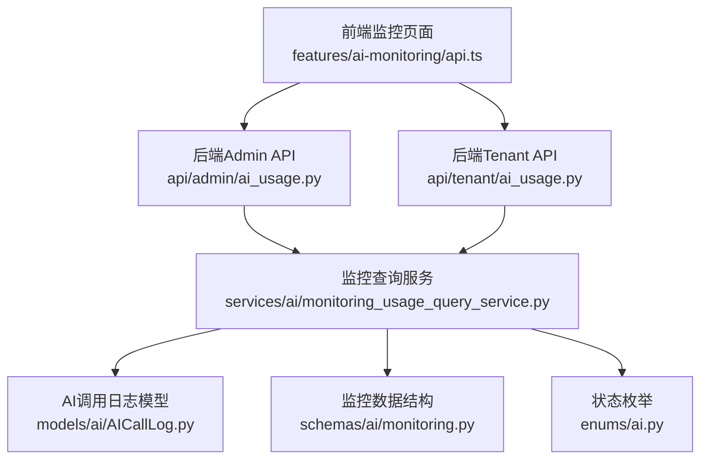
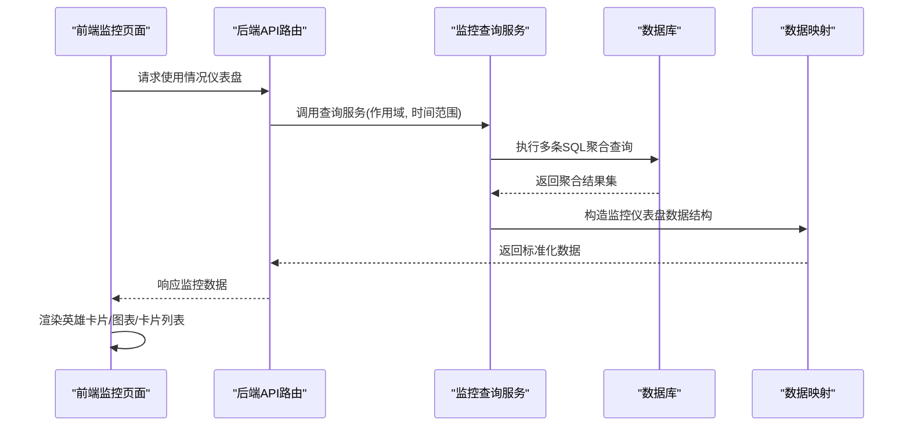
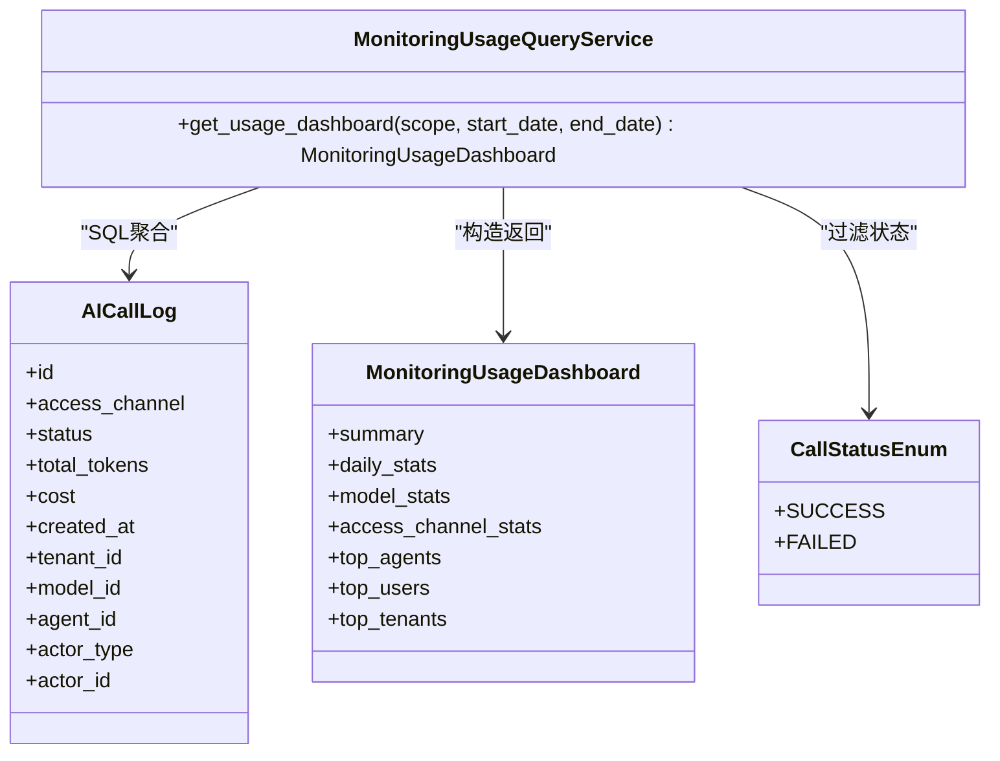

# AI使用情况监控

<cite>
**本文引用的文件**
- [backend/app/services/ai/monitoring_usage_query_service.py](file://backend/app/services/ai/monitoring_usage_query_service.py)
- [backend/app/api/admin/ai_usage.py](file://backend/app/api/admin/ai_usage.py)
- [backend/app/api/tenant/ai_usage.py](file://backend/app/api/tenant/ai_usage.py)
- [frontend/apps/web-antd/src/features/ai-monitoring/api.ts](file://frontend/apps/web-antd/src/features/ai-monitoring/api.ts)
- [backend/app/models/ai/AICallLog.py](file://backend/app/models/ai/AICallLog.py)
- [backend/app/schemas/ai/monitoring.py](file://backend/app/schemas/ai/monitoring.py)
- [backend/app/enums/ai.py](file://backend/app/enums/ai.py)
- [backend/app/services/system/dashboard_service_parts/tenant.py](file://backend/app/services/system/dashboard_service_parts/tenant.py)
- [backend/tests/services/test_monitoring_service.py](file://backend/tests/services/test_monitoring_service.py)
</cite>

## 目录
1. [简介](#简介)
2. [项目结构](#项目结构)
3. [核心组件](#核心组件)
4. [架构总览](#架构总览)
5. [详细组件分析](#详细组件分析)
6. [依赖关系分析](#依赖关系分析)
7. [性能考虑](#性能考虑)
8. [故障排查指南](#故障排查指南)
9. [结论](#结论)
10. [附录](#附录)

## 简介
本技术文档围绕AI使用情况监控功能展开，系统性阐述使用情况监控页面的架构设计与实现细节，包括使用情况英雄卡片、访问渠道卡片、图表展示以及“前十租户”卡片的实现；同时文档化使用情况数据的聚合算法、时间序列数据处理逻辑、图表组件渲染机制；并详细说明访问渠道卡片的数据分类、图表卡片的可视化实现、租户使用情况的排名算法；最后给出数据刷新机制、缓存策略与性能优化方案，并提供业务指标解读与趋势分析方法。

## 项目结构
AI使用情况监控功能由后端查询服务、API路由层、前端类型定义与调用接口共同组成，覆盖从数据采集、聚合、排序到前端展示的完整链路。

图示来源
- [backend/app/services/ai/monitoring_usage_query_service.py](file://backend/app/services/ai/monitoring_usage_query_service.py)
- [backend/app/api/admin/ai_usage.py](file://backend/app/api/admin/ai_usage.py)
- [backend/app/api/tenant/ai_usage.py](file://backend/app/api/tenant/ai_usage.py)
- [frontend/apps/web-antd/src/features/ai-monitoring/api.ts](file://frontend/apps/web-antd/src/features/ai-monitoring/api.ts)
- [backend/app/models/ai/AICallLog.py](file://backend/app/models/ai/AICallLog.py)
- [backend/app/schemas/ai/monitoring.py](file://backend/app/schemas/ai/monitoring.py)
- [backend/app/enums/ai.py](file://backend/app/enums/ai.py)

章节来源
- [backend/app/services/ai/monitoring_usage_query_service.py](file://backend/app/services/ai/monitoring_usage_query_service.py)
- [backend/app/api/admin/ai_usage.py](file://backend/app/api/admin/ai_usage.py)
- [backend/app/api/tenant/ai_usage.py](file://backend/app/api/tenant/ai_usage.py)
- [frontend/apps/web-antd/src/features/ai-monitoring/api.ts](file://frontend/apps/web-antd/src/features/ai-monitoring/api.ts)

## 核心组件
- 监控查询服务：负责根据作用域（平台/租户）与时间范围过滤，执行SQL聚合查询，生成使用情况仪表盘数据结构。
- API路由层：Admin与Tenant两条API路径，分别面向平台管理员与租户视角，统一调用查询服务并返回前端所需数据。
- 前端类型定义：定义了监控仪表盘的数据结构、分组项、时间序列点等类型，确保前后端契约一致。
- 数据模型与枚举：基于AICallLog模型与CallStatusEnum进行聚合与过滤，保证数据一致性与可扩展性。

章节来源
- [backend/app/services/ai/monitoring_usage_query_service.py](file://backend/app/services/ai/monitoring_usage_query_service.py)
- [backend/app/api/admin/ai_usage.py](file://backend/app/api/admin/ai_usage.py)
- [backend/app/api/tenant/ai_usage.py](file://backend/app/api/tenant/ai_usage.py)
- [frontend/apps/web-antd/src/features/ai-monitoring/api.ts](file://frontend/apps/web-antd/src/features/ai-monitoring/api.ts)
- [backend/app/models/ai/AICallLog.py](file://backend/app/models/ai/AICallLog.py)
- [backend/app/enums/ai.py](file://backend/app/enums/ai.py)

## 架构总览
监控数据流从API入口进入，经由查询服务构建SQL聚合，再映射为前端类型定义的数据结构，最终由前端组件渲染为英雄卡片、访问渠道卡片、图表与“前十租户”卡片。

图示来源
- [backend/app/api/admin/ai_usage.py](file://backend/app/api/admin/ai_usage.py)
- [backend/app/api/tenant/ai_usage.py](file://backend/app/api/tenant/ai_usage.py)
- [backend/app/services/ai/monitoring_usage_query_service.py](file://backend/app/services/ai/monitoring_usage_query_service.py)
- [frontend/apps/web-antd/src/features/ai-monitoring/api.ts](file://frontend/apps/web-antd/src/features/ai-monitoring/api.ts)

## 详细组件分析

### 使用情况英雄卡片
英雄卡片用于展示总体使用概览，包含成功调用数、失败调用数、成功率、总Token数、输入/输出Token、总费用等关键指标。查询服务通过一次聚合查询计算出这些指标，并在返回的summary中呈现。

- 关键字段与含义
  - 总调用数：所有符合条件的日志计数
  - 成功调用数：按状态枚举过滤后的成功数量
  - 失败调用数：按状态枚举过滤后的失败数量
  - 成功率：成功调用数 / 总调用数 × 100%
  - 总Token数：输入Token与输出Token之和
  - 输入Token数、输出Token数：按模型或渠道聚合的Token汇总
  - 总费用：按调用记录聚合的费用总和

- 聚合算法要点
  - 使用SQL的COUNT、SUM、CASE WHEN条件聚合，避免在Python侧做二次聚合
  - 对空值使用COALESCE兜底，确保数值安全
  - 日期维度以created_at截断至Date，支持按自然日聚合

- 可视化建议
  - 成功率建议采用进度条或百分比徽标展示
  - Token与费用建议采用带单位的数值卡片，必要时提供对比趋势

章节来源
- [backend/app/services/ai/monitoring_usage_query_service.py](file://backend/app/services/ai/monitoring_usage_query_service.py)
- [backend/app/enums/ai.py](file://backend/app/enums/ai.py)

### 访问渠道卡片
访问渠道卡片用于展示不同访问渠道（如聊天、工具调用、RAG检索等）的调用次数、Token消耗、费用与成功率。查询服务按access_channel分组聚合，排序规则为Token消耗降序。

- 数据分类
  - 分组键：access_channel
  - 统计指标：call_count、total_tokens、total_cost、success_calls、failed_calls
  - 排序依据：total_tokens降序，确保高消耗渠道优先展示

- 可视化实现
  - 建议采用柱状图或堆叠条形图，X轴为渠道，Y轴为调用量/Token/费用
  - 成功率可用小图标或百分比标注
  - 支持点击切换不同指标维度（调用次数/Token/费用）

- 业务解读
  - 高调用次数但低Token消耗：可能为工具类调用
  - 高Token消耗：可能为长对话或复杂推理场景
  - 成功率异常偏低：需检查渠道配置或上游模型稳定性

章节来源
- [backend/app/services/ai/monitoring_usage_query_service.py](file://backend/app/services/ai/monitoring_usage_query_service.py)

### 图表展示（时间序列）
时间序列图表用于展示每日调用量、Token消耗、费用与成功率随时间的变化。查询服务按日期分组，生成连续日期的时间序列点。

- 时间序列处理逻辑
  - 日期维度：对created_at按Date截断，形成自然日维度
  - 连续性：若某日无数据，应在前端补零，避免折线断裂
  - 指标：call_count、total_tokens、input_tokens、output_tokens、total_cost、success_calls、failed_calls

- 渲染机制
  - 建议采用折线图叠加面积图，区分调用量与Token消耗
  - 提供时间选择器（近7天/近30天/自定义），动态刷新
  - 支持悬浮提示框显示具体数值与占比

- 趋势分析方法
  - 移动平均：对7日/30日窗口计算移动平均，识别长期趋势
  - 同比/环比：与上一周期对比，观察增长或回落
  - 异常检测：基于标准差或阈值法识别异常波动

章节来源
- [backend/app/services/ai/monitoring_usage_query_service.py](file://backend/app/services/ai/monitoring_usage_query_service.py)

### “前十租户”卡片
“前十租户”卡片用于展示租户维度的使用排行，支持平台管理员查看各租户的调用次数、Token消耗、费用与成功率。

- 排名算法
  - 聚合维度：tenant_id
  - 排名依据：total_tokens（或total_cost）降序
  - 限制：仅取前10名，其余合并为“其他”

- 数据来源
  - 查询服务通过join或子查询获取租户名称与有效使用量
  - 若为租户视角，当前租户名称可直接加载

- 可视化建议
  - 采用排行榜表格或条形图，突出Top1
  - 提供筛选器按时间范围调整排行

章节来源
- [backend/app/services/ai/monitoring_usage_query_service.py](file://backend/app/services/ai/monitoring_usage_query_service.py)

### 其他卡片：模型统计与用户/智能体Top
- 模型统计：按模型分组聚合，展示各模型的调用次数与Token消耗，辅助模型选择与成本控制
- 用户Top：按用户维度聚合，结合快照信息展示用户头像、显示名、组织节点与角色
- 智能体Top：按Agent分组聚合，便于评估智能体使用效率

章节来源
- [backend/app/services/ai/monitoring_usage_query_service.py](file://backend/app/services/ai/monitoring_usage_query_service.py)

## 依赖关系分析
监控查询服务依赖于以下模块与数据结构：

图示来源
- [backend/app/services/ai/monitoring_usage_query_service.py](file://backend/app/services/ai/monitoring_usage_query_service.py)
- [backend/app/models/ai/AICallLog.py](file://backend/app/models/ai/AICallLog.py)
- [backend/app/schemas/ai/monitoring.py](file://backend/app/schemas/ai/monitoring.py)
- [backend/app/enums/ai.py](file://backend/app/enums/ai.py)

章节来源
- [backend/app/services/ai/monitoring_usage_query_service.py](file://backend/app/services/ai/monitoring_usage_query_service.py)
- [backend/app/models/ai/AICallLog.py](file://backend/app/models/ai/AICallLog.py)
- [backend/app/schemas/ai/monitoring.py](file://backend/app/schemas/ai/monitoring.py)
- [backend/app/enums/ai.py](file://backend/app/enums/ai.py)

## 性能考虑
- SQL聚合优化
  - 在access_channel、status、tenant_id、model_id、agent_id、actor_type/actor_id等常用过滤字段建立索引
  - 使用COALESCE与CASE WHEN减少NULL值处理开销
  - 对日期字段使用Date截断，避免函数包裹导致索引失效
- 分页与TopN
  - TopN（如Top10租户）在数据库侧完成排序与LIMIT，避免返回大量数据
- 缓存策略
  - 对高频查询（如最近7天/30天）设置短期缓存（如5-15分钟），降低数据库压力
  - 缓存Key包含作用域、时间范围与租户ID，避免跨作用域污染
- 并发与限流
  - 前端请求去抖与节流，避免频繁刷新
  - 后端对同一作用域+时间范围的查询进行并发控制与队列化
- 冷启动与懒加载
  - 首屏仅加载必要指标，图表与详细列表采用懒加载
- 监控与告警
  - 记录慢查询与超时事件，持续优化热点查询

## 故障排查指南
- 数据为空或不完整
  - 检查时间范围是否正确，确认created_at字段与数据库时区一致
  - 核对作用域过滤条件（平台/租户）是否匹配预期
- 成功率异常
  - 检查CallStatusEnum映射是否正确，确认FAILED/SUCCESS状态是否被正确识别
  - 对比失败调用详情，定位上游错误原因
- 排名异常
  - 确认聚合字段（如total_tokens）是否包含预期数据
  - 检查租户名称加载逻辑，避免空值导致排序异常
- 前端渲染问题
  - 对比前端类型定义与后端返回结构，确保字段一一对应
  - 检查时间序列连续性，缺失日期需在前端补零

章节来源
- [backend/tests/services/test_monitoring_service.py](file://backend/tests/services/test_monitoring_service.py)
- [frontend/apps/web-antd/src/features/ai-monitoring/api.ts](file://frontend/apps/web-antd/src/features/ai-monitoring/api.ts)

## 结论
AI使用情况监控通过清晰的分层架构与严谨的SQL聚合，实现了从原始调用日志到可视化仪表盘的高效转换。英雄卡片、访问渠道卡片、时间序列图表与“前十租户”卡片共同构成完整的使用洞察体系。配合合理的缓存与性能优化策略，可在大规模数据下保持稳定与低延迟。建议持续完善异常检测与趋势分析能力，进一步提升运营决策效率。

## 附录
- 业务指标解读
  - 成功率：衡量系统稳定性与模型质量，异常下降需重点排查
  - Token消耗：反映推理复杂度与上下文长度，可用于成本控制
  - 费用：结合模型单价与Token消耗，评估成本结构
- 趋势分析方法
  - 周期性：识别工作日/节假日对调用量的影响
  - 聚合维度：按渠道、模型、租户、用户等多维交叉分析
  - 预测：基于历史序列拟合趋势，设定预警阈值