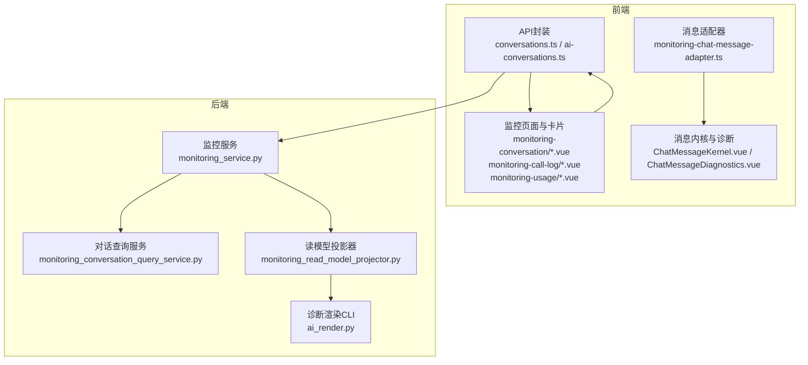
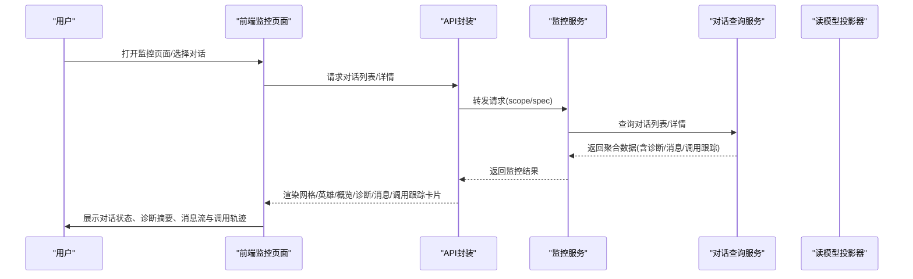
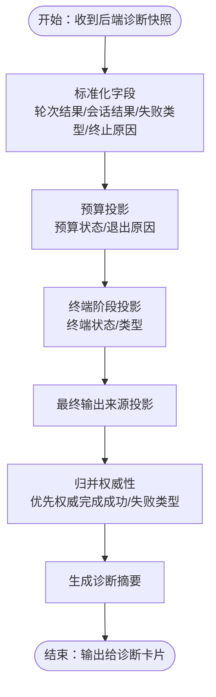
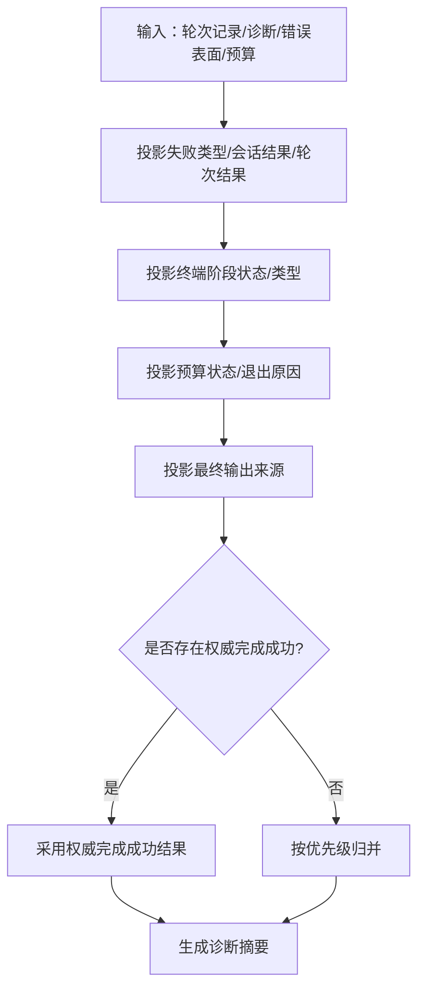
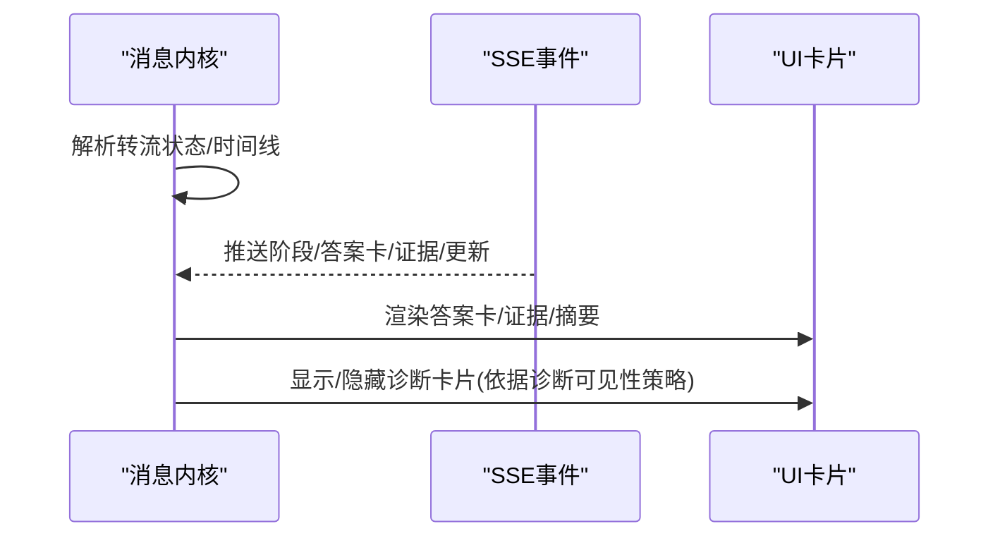
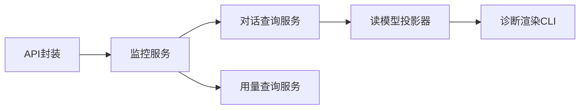

# AI对话监控

<cite>
**本文引用的文件**
- [api.ts](file://frontend/apps/web-antd/src/features/ai-monitoring/api.ts)
- [monitoring-conversation-drawer.css](file://frontend/apps/web-antd/src/features/ai-monitoring/pages/monitoring-conversation/monitoring-conversation-drawer.css)
- [monitoring-chat-message-adapter.ts](file://frontend/apps/web-antd/src/features/ai-monitoring/pages/monitoring-conversation/monitoring-chat-message-adapter.ts)
- [MonitoringConversationHero.vue](file://frontend/apps/web-antd/src/features/ai-monitoring/pages/monitoring-conversation/MonitoringConversationHero.vue)
- [MonitoringConversationOverviewCard.vue](file://frontend/apps/web-antd/src/features/ai-monitoring/pages/monitoring-conversation/MonitoringConversationOverviewCard.vue)
- [MonitoringConversationDiagnosticsCard.vue](file://frontend/apps/web-antd/src/features/ai-monitoring/pages/monitoring-conversation/MonitoringConversationDiagnosticsCard.vue)
- [MonitoringConversationMessagesCard.vue](file://frontend/apps/web-antd/src/features/ai-monitoring/pages/monitoring-conversation/MonitoringConversationMessagesCard.vue)
- [MonitoringConversationCallTraceCard.vue](file://frontend/apps/web-antd/src/features/ai-monitoring/pages/monitoring-conversation/MonitoringConversationCallTraceCard.vue)
- [MonitoringConversationsGridCard.vue](file://frontend/apps/web-antd/src/features/ai-monitoring/pages/monitoring-conversation/MonitoringConversationsGridCard.vue)
- [MonitoringCallLogHero.vue](file://frontend/apps/web-antd/src/features/ai-monitoring/pages/monitoring-call-log/MonitoringCallLogHero.vue)
- [MonitoringCallLogOverviewCard.vue](file://frontend/apps/web-antd/src/features/ai-monitoring/pages/monitoring-call-log/MonitoringCallLogOverviewCard.vue)
- [MonitoringCallLogPayloadCard.vue](file://frontend/apps/web-antd/src/features/ai-monitoring/pages/monitoring-call-log/MonitoringCallLogPayloadCard.vue)
- [MonitoringCallLogRootCauseCard.vue](file://frontend/apps/web-antd/src/features/ai-monitoring/pages/monitoring-call-log/MonitoringCallLogRootCauseCard.vue)
- [MonitoringCallLogsGridCard.vue](file://frontend/apps/web-antd/src/features/ai-monitoring/pages/monitoring-call-log/MonitoringCallLogsGridCard.vue)
- [monitoring-call-log-presentation.ts](file://frontend/apps/web-antd/src/features/ai-monitoring/pages/monitoring-call-log/monitoring-call-log-presentation.ts)
- [MonitoringUsageAccessChannelCard.vue](file://frontend/apps/web-antd/src/features/ai-monitoring/pages/monitoring-usage/MonitoringUsageAccessChannelCard.vue)
- [MonitoringUsageCharts.vue](file://frontend/apps/web-antd/src/features/ai-monitoring/pages/monitoring-usage/MonitoringUsageCharts.vue)
- [MonitoringUsageHero.vue](file://frontend/apps/web-antd/src/features/ai-monitoring/pages/monitoring-usage/MonitoringUsageHero.vue)
- [MonitoringUsageTopSectionCard.vue](file://frontend/apps/web-antd/src/features/ai-monitoring/pages/monitoring-usage/MonitoringUsageTopSectionCard.vue)
- [MonitoringUsageTopTenantsCard.vue](file://frontend/apps/web-antd/src/features/ai-monitoring/pages/monitoring-usage/MonitoringUsageTopTenantsCard.vue)
- [use-monitoring-usage-dashboard.ts](file://frontend/apps/web-antd/src/features/ai-monitoring/pages/monitoring-usage/use-monitoring-usage-dashboard.ts)
- [monitoring-usage-page.css](file://frontend/apps/web-antd/src/features/ai-monitoring/pages/monitoring-usage/monitoring-usage-page.css)
- [conversations.ts](file://frontend/apps/web-antd/src/api/tenant/conversations.ts)
- [ai-conversations.ts](file://frontend/apps/web-antd/src/api/admin/ai-conversations.ts)
- [monitoring_service.py](file://backend/app/services/ai/monitoring_service.py)
- [monitoring_conversation_query_service.py](file://backend/app/services/ai/monitoring_conversation_query_service.py)
- [monitoring_read_model_projector.py](file://backend/app/services/ai/monitoring_read_model_projector.py)
- [ai_render.py](file://backend/app/cli_commands/ai_render.py)
- [test_monitoring_service.py](file://backend/tests/services/test_monitoring_service.py)
- [ChatMessageKernel.vue](file://frontend/apps/web-antd/src/components/business/ai-chat-panel/ChatMessageKernel.vue)
- [ChatMessageDiagnostics.vue](file://frontend/apps/web-antd/src/components/business/ai-chat-panel/ChatMessageDiagnostics.vue)
- [use-ai-chat-streaming-request-recovery.ts](file://frontend/apps/web-antd/src/components/business/ai-chat-panel/use-ai-chat-streaming-request-recovery.ts)
- [use-ai-chat-streaming-request-lifecycle.ts](file://frontend/apps/web-antd/src/components/business/ai-chat-panel/use-ai-chat-streaming-request-lifecycle.ts)
- [use-ai-chat-streaming-request-sse.ts](file://frontend/apps/web-antd/src/components/business/ai-chat-panel/use-ai-chat-streaming-request-sse.ts)
- [use-ai-chat-conversations.ts](file://frontend/apps/web-antd/src/components/business/ai-chat-panel/use-ai-chat-conversations.ts)
- [conversation-binding.ts](file://frontend/apps/web-antd/src/components/business/ai-chat-panel/conversation-binding.ts)
- [use-ai-chat-history.ts](file://frontend/apps/web-antd/src/components/business/ai-chat-panel/use-ai-chat-history.ts)
- [ai-chat.spec.ts](file://frontend/apps/web-antd/__tests__/e2e/ai-chat.spec.ts)
- [ai-conversation-latest-turn-status.spec.ts](file://frontend/apps/web-antd/__tests__/e2e/ai-conversation-latest-turn-status.spec.ts)
</cite>

## 目录
1. [引言](#引言)
2. [项目结构](#项目结构)
3. [核心组件](#核心组件)
4. [架构总览](#架构总览)
5. [组件详解](#组件详解)
6. [依赖关系分析](#依赖关系分析)
7. [性能考量](#性能考量)
8. [故障排查指南](#故障排查指南)
9. [结论](#结论)
10. [附录](#附录)

## 引言
本技术文档围绕“AI对话监控”功能，系统性阐述前端监控页面的架构设计与后端服务支撑，重点覆盖以下方面：
- 对话监控页面的四大卡片体系：对话网格卡片、英雄卡片、概览卡片、诊断卡片的实现与交互。
- 对话消息适配器的设计模式与转流投影器的工作原理及转流状态管理机制。
- 对话诊断卡片的故障分析算法、消息卡片的渲染逻辑与调用跟踪卡片的数据展示。
- 权限控制、数据过滤与状态同步的实现细节。
- 用户体验优化与性能监控策略。

## 项目结构
AI对话监控功能由前端页面与后端服务共同构成，前后端通过API契约进行数据交换。前端采用Vue单文件组件（SFC）组织页面与卡片，后端提供查询与投影服务，CLI工具支持诊断文本渲染。

图表来源
- [conversations.ts](file://frontend/apps/web-antd/src/api/tenant/conversations.ts)
- [ai-conversations.ts](file://frontend/apps/web-antd/src/api/admin/ai-conversations.ts)
- [monitoring_service.py](file://backend/app/services/ai/monitoring_service.py)
- [monitoring_conversation_query_service.py](file://backend/app/services/ai/monitoring_conversation_query_service.py)
- [monitoring_read_model_projector.py](file://backend/app/services/ai/monitoring_read_model_projector.py)
- [ai_render.py](file://backend/app/cli_commands/ai_render.py)

章节来源
- [conversations.ts](file://frontend/apps/web-antd/src/api/tenant/conversations.ts)
- [ai-conversations.ts](file://frontend/apps/web-antd/src/api/admin/ai-conversations.ts)
- [monitoring_service.py](file://backend/app/services/ai/monitoring_service.py)
- [monitoring_conversation_query_service.py](file://backend/app/services/ai/monitoring_conversation_query_service.py)
- [monitoring_read_model_projector.py](file://backend/app/services/ai/monitoring_read_model_projector.py)
- [ai_render.py](file://backend/app/cli_commands/ai_render.py)

## 核心组件
- 前端监控页面与卡片
  - 对话监控页：监控对话网格卡片、英雄卡片、概览卡片、诊断卡片、消息卡片、调用跟踪卡片等。
  - 调用日志页：调用日志网格卡片、英雄卡片、概览卡片、负载卡片、根因卡片等。
  - 使用量页：使用量仪表盘、访问渠道卡片、图表、顶部区域卡片、顶级租户卡片等。
- 后端监控服务
  - 监控服务：统一入口，委派到查询与用量查询服务。
  - 对话查询服务：负责列表、详情、最新轮次诊断等数据聚合。
  - 读模型投影器：对失败、预算、终止原因等进行投影与归并，生成诊断摘要。
- CLI诊断渲染：将快照转换为可读的诊断文本，辅助排障。

章节来源
- [monitoring-conversation-drawer.css](file://frontend/apps/web-antd/src/features/ai-monitoring/pages/monitoring-conversation/monitoring-conversation-drawer.css)
- [monitoring-chat-message-adapter.ts](file://frontend/apps/web-antd/src/features/ai-monitoring/pages/monitoring-conversation/monitoring-chat-message-adapter.ts)
- [MonitoringConversationHero.vue](file://frontend/apps/web-antd/src/features/ai-monitoring/pages/monitoring-conversation/MonitoringConversationHero.vue)
- [MonitoringConversationOverviewCard.vue](file://frontend/apps/web-antd/src/features/ai-monitoring/pages/monitoring-conversation/MonitoringConversationOverviewCard.vue)
- [MonitoringConversationDiagnosticsCard.vue](file://frontend/apps/web-antd/src/features/ai-monitoring/pages/monitoring-conversation/MonitoringConversationDiagnosticsCard.vue)
- [MonitoringConversationMessagesCard.vue](file://frontend/apps/web-antd/src/features/ai-monitoring/pages/monitoring-conversation/MonitoringConversationMessagesCard.vue)
- [MonitoringConversationCallTraceCard.vue](file://frontend/apps/web-antd/src/features/ai-monitoring/pages/monitoring-conversation/MonitoringConversationCallTraceCard.vue)
- [MonitoringConversationsGridCard.vue](file://frontend/apps/web-antd/src/features/ai-monitoring/pages/monitoring-conversation/MonitoringConversationsGridCard.vue)
- [MonitoringCallLogHero.vue](file://frontend/apps/web-antd/src/features/ai-monitoring/pages/monitoring-call-log/MonitoringCallLogHero.vue)
- [MonitoringCallLogOverviewCard.vue](file://frontend/apps/web-antd/src/features/ai-monitoring/pages/monitoring-call-log/MonitoringCallLogOverviewCard.vue)
- [MonitoringCallLogPayloadCard.vue](file://frontend/apps/web-antd/src/features/ai-monitoring/pages/monitoring-call-log/MonitoringCallLogPayloadCard.vue)
- [MonitoringCallLogRootCauseCard.vue](file://frontend/apps/web-antd/src/features/ai-monitoring/pages/monitoring-call-log/MonitoringCallLogRootCauseCard.vue)
- [MonitoringCallLogsGridCard.vue](file://frontend/apps/web-antd/src/features/ai-monitoring/pages/monitoring-call-log/MonitoringCallLogsGridCard.vue)
- [monitoring-call-log-presentation.ts](file://frontend/apps/web-antd/src/features/ai-monitoring/pages/monitoring-call-log/monitoring-call-log-presentation.ts)
- [MonitoringUsageAccessChannelCard.vue](file://frontend/apps/web-antd/src/features/ai-monitoring/pages/monitoring-usage/MonitoringUsageAccessChannelCard.vue)
- [MonitoringUsageCharts.vue](file://frontend/apps/web-antd/src/features/ai-monitoring/pages/monitoring-usage/MonitoringUsageCharts.vue)
- [MonitoringUsageHero.vue](file://frontend/apps/web-antd/src/features/ai-monitoring/pages/monitoring-usage/MonitoringUsageHero.vue)
- [MonitoringUsageTopSectionCard.vue](file://frontend/apps/web-antd/src/features/ai-monitoring/pages/monitoring-usage/MonitoringUsageTopSectionCard.vue)
- [MonitoringUsageTopTenantsCard.vue](file://frontend/apps/web-antd/src/features/ai-monitoring/pages/monitoring-usage/MonitoringUsageTopTenantsCard.vue)
- [use-monitoring-usage-dashboard.ts](file://frontend/apps/web-antd/src/features/ai-monitoring/pages/monitoring-usage/use-monitoring-usage-dashboard.ts)
- [monitoring-usage-page.css](file://frontend/apps/web-antd/src/features/ai-monitoring/pages/monitoring-usage/monitoring-usage-page.css)
- [monitoring_service.py](file://backend/app/services/ai/monitoring_service.py)
- [monitoring_conversation_query_service.py](file://backend/app/services/ai/monitoring_conversation_query_service.py)
- [monitoring_read_model_projector.py](file://backend/app/services/ai/monitoring_read_model_projector.py)
- [ai_render.py](file://backend/app/cli_commands/ai_render.py)

## 架构总览
前端通过API封装调用后端监控服务，后端服务根据查询规范委派到对话查询服务或用量查询服务；对话详情中包含诊断信息与消息列表，调用跟踪卡片展示链路信息。CLI工具用于将诊断快照渲染为文本，便于人工审计与排障。

图表来源
- [monitoring_service.py](file://backend/app/services/ai/monitoring_service.py)
- [monitoring_conversation_query_service.py](file://backend/app/services/ai/monitoring_conversation_query_service.py)
- [monitoring_read_model_projector.py](file://backend/app/services/ai/monitoring_read_model_projector.py)
- [conversations.ts](file://frontend/apps/web-antd/src/api/tenant/conversations.ts)
- [ai-conversations.ts](file://frontend/apps/web-antd/src/api/admin/ai-conversations.ts)

## 组件详解

### 对话监控页面卡片体系
- 对话网格卡片（Grid）
  - 展示对话的基本元信息与最新轮次状态，支持筛选与排序。
  - 关键字段：租户名、代理名称/头像、标题、状态、生命周期状态、显示状态、最新轮次状态/结果/失败类型/终止原因、错误信息、消息数、调用数、成本、Token数等。
- 英雄卡片（Hero）
  - 展示当前选中对话的全局概览，如代理信息、时间线、成本与Token统计等。
- 概览卡片（Overview）
  - 提供对话维度的关键指标汇总，如成功率、失败率、平均耗时、错误分布等。
- 诊断卡片（Diagnostics）
  - 基于读模型投影器生成的诊断摘要，包含轮次结果、会话结果、失败类型、终止原因、预算状态/退出原因、最终输出来源、已选工具/技能/上下文来源等。
- 消息卡片（Messages）
  - 展示消息列表，支持分页加载与实时流式更新；消息内核渲染答案卡、证据、时间线阶段等。
- 调用跟踪卡片（Call Trace）
  - 展示一次对话的调用链路，包含请求元数据、诊断、终端状态/类型等。

章节来源
- [MonitoringConversationsGridCard.vue](file://frontend/apps/web-antd/src/features/ai-monitoring/pages/monitoring-conversation/MonitoringConversationsGridCard.vue)
- [MonitoringConversationHero.vue](file://frontend/apps/web-antd/src/features/ai-monitoring/pages/monitoring-conversation/MonitoringConversationHero.vue)
- [MonitoringConversationOverviewCard.vue](file://frontend/apps/web-antd/src/features/ai-monitoring/pages/monitoring-conversation/MonitoringConversationOverviewCard.vue)
- [MonitoringConversationDiagnosticsCard.vue](file://frontend/apps/web-antd/src/features/ai-monitoring/pages/monitoring-conversation/MonitoringConversationDiagnosticsCard.vue)
- [MonitoringConversationMessagesCard.vue](file://frontend/apps/web-antd/src/features/ai-monitoring/pages/monitoring-conversation/MonitoringConversationMessagesCard.vue)
- [MonitoringConversationCallTraceCard.vue](file://frontend/apps/web-antd/src/features/ai-monitoring/pages/monitoring-conversation/MonitoringConversationCallTraceCard.vue)
- [MonitoringCallLogsGridCard.vue](file://frontend/apps/web-antd/src/features/ai-monitoring/pages/monitoring-call-log/MonitoringCallLogsGridCard.vue)
- [MonitoringCallLogHero.vue](file://frontend/apps/web-antd/src/features/ai-monitoring/pages/monitoring-call-log/MonitoringCallLogHero.vue)
- [MonitoringCallLogOverviewCard.vue](file://frontend/apps/web-antd/src/features/ai-monitoring/pages/monitoring-call-log/MonitoringCallLogOverviewCard.vue)
- [MonitoringCallLogPayloadCard.vue](file://frontend/apps/web-antd/src/features/ai-monitoring/pages/monitoring-call-log/MonitoringCallLogPayloadCard.vue)
- [MonitoringCallLogRootCauseCard.vue](file://frontend/apps/web-antd/src/features/ai-monitoring/pages/monitoring-call-log/MonitoringCallLogRootCauseCard.vue)
- [MonitoringUsageAccessChannelCard.vue](file://frontend/apps/web-antd/src/features/ai-monitoring/pages/monitoring-usage/MonitoringUsageAccessChannelCard.vue)
- [MonitoringUsageCharts.vue](file://frontend/apps/web-antd/src/features/ai-monitoring/pages/monitoring-usage/MonitoringUsageCharts.vue)
- [MonitoringUsageHero.vue](file://frontend/apps/web-antd/src/features/ai-monitoring/pages/monitoring-usage/MonitoringUsageHero.vue)
- [MonitoringUsageTopSectionCard.vue](file://frontend/apps/web-antd/src/features/ai-monitoring/pages/monitoring-usage/MonitoringUsageTopSectionCard.vue)
- [MonitoringUsageTopTenantsCard.vue](file://frontend/apps/web-antd/src/features/ai-monitoring/pages/monitoring-usage/MonitoringUsageTopTenantsCard.vue)

### 对话消息适配器与转流投影器
- 设计模式
  - 适配器模式：将后端返回的原始消息与诊断数据，映射为前端消息卡片所需的统一结构，屏蔽数据差异。
  - 投影器模式：对失败、预算、终止原因、最终输出来源等进行投影与归并，形成稳定的诊断摘要。
- 转流状态管理
  - 前端通过生命周期钩子与SSE事件处理，维护发送中、流式传输、中断、完成等状态，并在完成后触发对话列表刷新与锚点记忆。
  - 流式事件包括清空内容、答案卡、证据、阶段事件与阶段更新等，均在消息内核中进行可视化处理。

图表来源
- [monitoring_read_model_projector.py](file://backend/app/services/ai/monitoring_read_model_projector.py)
- [monitoring-chat-message-adapter.ts](file://frontend/apps/web-antd/src/features/ai-monitoring/pages/monitoring-chat-message-adapter.ts)
- [use-ai-chat-streaming-request-lifecycle.ts](file://frontend/apps/web-antd/src/components/business/ai-chat-panel/use-ai-chat-streaming-request-lifecycle.ts)
- [use-ai-chat-streaming-request-sse.ts](file://frontend/apps/web-antd/src/components/business/ai-chat-panel/use-ai-chat-streaming-request-sse.ts)
- [use-ai-chat-streaming-request-recovery.ts](file://frontend/apps/web-antd/src/components/business/ai-chat-panel/use-ai-chat-streaming-request-recovery.ts)

章节来源
- [monitoring_read_model_projector.py](file://backend/app/services/ai/monitoring_read_model_projector.py)
- [monitoring-chat-message-adapter.ts](file://frontend/apps/web-antd/src/features/ai-monitoring/pages/monitoring-chat-message-adapter.ts)
- [use-ai-chat-streaming-request-lifecycle.ts](file://frontend/apps/web-antd/src/components/business/ai-chat-panel/use-ai-chat-streaming-request-lifecycle.ts)
- [use-ai-chat-streaming-request-sse.ts](file://frontend/apps/web-antd/src/components/business/ai-chat-panel/use-ai-chat-streaming-request-sse.ts)
- [use-ai-chat-streaming-request-recovery.ts](file://frontend/apps/web-antd/src/components/business/ai-chat-panel/use-ai-chat-streaming-request-recovery.ts)

### 诊断卡片的故障分析算法
- 算法要点
  - 字段优先级：失败投影 > 诊断 > 错误表面 > 元数据载荷。
  - 归并策略：权威完成成功的优先级最高；否则按轮次/会话结果、失败类型、终止原因、预算状态/退出原因、最终输出来源等逐步归并。
  - 终端阶段：从终端阶段获取终端状态与类型，作为最终判定依据之一。
- 输出
  - 诊断摘要包含：轮次结果、会话结果、失败类型、终止原因、预算状态/退出原因、最终输出来源、已选工具/技能/上下文来源等。

图表来源
- [monitoring_read_model_projector.py](file://backend/app/services/ai/monitoring_read_model_projector.py)

章节来源
- [monitoring_read_model_projector.py](file://backend/app/services/ai/monitoring_read_model_projector.py)

### 消息卡片渲染逻辑
- 内核渲染
  - 根据消息的转流状态与时间线阶段，决定是否渲染答案卡、证据、摘要体等。
  - 对于正在流式中的消息，若存在可装配的答案阶段且未出错/跳过，则显示装配进度。
- 诊断可见性
  - 诊断卡片仅在存在诊断信息时显示，并遵循策略开关与强制显示标志。

图表来源
- [ChatMessageKernel.vue](file://frontend/apps/web-antd/src/components/business/ai-chat-panel/ChatMessageKernel.vue)
- [ChatMessageDiagnostics.vue](file://frontend/apps/web-antd/src/components/business/ai-chat-panel/ChatMessageDiagnostics.vue)
- [use-ai-chat-streaming-request-sse.ts](file://frontend/apps/web-antd/src/components/business/ai-chat-panel/use-ai-chat-streaming-request-sse.ts)

章节来源
- [ChatMessageKernel.vue](file://frontend/apps/web-antd/src/components/business/ai-chat-panel/ChatMessageKernel.vue)
- [ChatMessageDiagnostics.vue](file://frontend/apps/web-antd/src/components/business/ai-chat-panel/ChatMessageDiagnostics.vue)
- [use-ai-chat-streaming-request-sse.ts](file://frontend/apps/web-antd/src/components/business/ai-chat-panel/use-ai-chat-streaming-request-sse.ts)

### 调用跟踪卡片的数据展示
- 数据来源
  - 后端查询服务返回的调用跟踪项，包含请求元数据、诊断、终端状态/类型等。
- 展示要点
  - 结构化呈现请求路径、协议路径、执行路径、失败类型、预算状态/退出原因、最终输出来源、已选工具/技能/上下文来源等。
  - 支持展开/折叠与复制能力，便于人工审计。

章节来源
- [monitoring-call-log-presentation.ts](file://frontend/apps/web-antd/src/features/ai-monitoring/pages/monitoring-call-log/monitoring-call-log-presentation.ts)
- [MonitoringCallLogPayloadCard.vue](file://frontend/apps/web-antd/src/features/ai-monitoring/pages/monitoring-call-log/MonitoringCallLogPayloadCard.vue)
- [MonitoringCallLogRootCauseCard.vue](file://frontend/apps/web-antd/src/features/ai-monitoring/pages/monitoring-call-log/MonitoringCallLogRootCauseCard.vue)
- [monitoring_conversation_query_service.py](file://backend/app/services/ai/monitoring_conversation_query_service.py)

### 权限控制、数据过滤与状态同步
- 权限控制
  - 租户域与管理员域分别提供API封装，确保不同角色只能访问授权范围内的对话数据。
- 数据过滤
  - 查询规范支持按生命周期状态、显示状态、失败类型、终止原因、预算状态等进行过滤。
- 状态同步
  - 流式传输结束后，根据中断/提交状态触发对话列表刷新与锚点记忆，保证UI与后端一致。

章节来源
- [conversations.ts](file://frontend/apps/web-antd/src/api/tenant/conversations.ts)
- [ai-conversations.ts](file://frontend/apps/web-antd/src/api/admin/ai-conversations.ts)
- [monitoring_service.py](file://backend/app/services/ai/monitoring_service.py)
- [monitoring_conversation_query_service.py](file://backend/app/services/ai/monitoring_conversation_query_service.py)
- [use-ai-chat-streaming-request-recovery.ts](file://frontend/apps/web-antd/src/components/business/ai-chat-panel/use-ai-chat-streaming-request-recovery.ts)
- [use-ai-chat-conversations.ts](file://frontend/apps/web-antd/src/components/business/ai-chat-panel/use-ai-chat-conversations.ts)

### 用户体验优化
- 历史可见性规则：空对话在一定时间窗口内仍可见，避免用户丢失进行中的会话。
- 会话绑定：根据当前代理与目标代理判断是否需要分叉新会话，提升交互一致性。
- 滚动与锚点：保持滚动位置与会话锚点记忆，改善长对话阅读体验。
- 最新轮次状态回归测试：通过端到端测试保障状态渲染正确性。

章节来源
- [use-ai-chat-history.ts](file://frontend/apps/web-antd/src/components/business/ai-chat-panel/use-ai-chat-history.ts)
- [conversation-binding.ts](file://frontend/apps/web-antd/src/components/business/ai-chat-panel/conversation-binding.ts)
- [use-ai-chat-conversations.ts](file://frontend/apps/web-antd/src/components/business/ai-chat-panel/use-ai-chat-conversations.ts)
- [ai-conversation-latest-turn-status.spec.ts](file://frontend/apps/web-antd/__tests__/e2e/ai-conversation-latest-turn-status.spec.ts)

## 依赖关系分析
- 前端依赖
  - API封装依赖监控服务返回的统一数据结构。
  - 卡片组件依赖消息适配器与消息内核，以获得一致的渲染行为。
- 后端依赖
  - 监控服务委派到对话查询服务与用量查询服务。
  - 读模型投影器依赖失败投影、预算投影、终端阶段等子投影函数。

图表来源
- [monitoring_service.py](file://backend/app/services/ai/monitoring_service.py)
- [monitoring_conversation_query_service.py](file://backend/app/services/ai/monitoring_conversation_query_service.py)
- [monitoring_read_model_projector.py](file://backend/app/services/ai/monitoring_read_model_projector.py)
- [ai_render.py](file://backend/app/cli_commands/ai_render.py)

章节来源
- [monitoring_service.py](file://backend/app/services/ai/monitoring_service.py)
- [monitoring_conversation_query_service.py](file://backend/app/services/ai/monitoring_conversation_query_service.py)
- [monitoring_read_model_projector.py](file://backend/app/services/ai/monitoring_read_model_projector.py)
- [ai_render.py](file://backend/app/cli_commands/ai_render.py)

## 性能考量
- 分页与懒加载：消息卡片支持分页加载，降低初始渲染压力。
- 流式传输：SSE事件驱动增量渲染，减少全量刷新。
- 缓存与锚点：会话锚点与滚动位置缓存，避免重复计算与抖动。
- 过滤与查询：后端查询规范支持多维过滤，前端按需传递参数，减少无效数据传输。

## 故障排查指南
- 诊断文本渲染
  - 使用CLI命令将诊断快照渲染为文本，便于人工审计与问题定位。
- 单元与集成测试
  - 后端服务委托关系与查询行为有单元测试覆盖，可快速定位服务层问题。
- 端到端测试
  - 针对最新轮次状态渲染的回归测试，确保状态显示正确。

章节来源
- [ai_render.py](file://backend/app/cli_commands/ai_render.py)
- [test_monitoring_service.py](file://backend/tests/services/test_monitoring_service.py)
- [ai-conversation-latest-turn-status.spec.ts](file://frontend/apps/web-antd/__tests__/e2e/ai-conversation-latest-turn-status.spec.ts)

## 结论
AI对话监控功能通过前后端协同，实现了从对话网格到英雄/概览/诊断/消息/调用跟踪的完整视图。后端以查询与投影为核心，前端以适配器与消息内核为支撑，结合权限控制、数据过滤与状态同步，提供了稳定可靠的监控体验。配合CLI诊断渲染与端到端测试，进一步增强了可观测性与可维护性。

## 附录
- 数据契约参考
  - 对话信息与详情接口定义，包含诊断、消息列表、调用跟踪等字段。

章节来源
- [api.ts](file://frontend/apps/web-antd/src/features/ai-monitoring/api.ts)