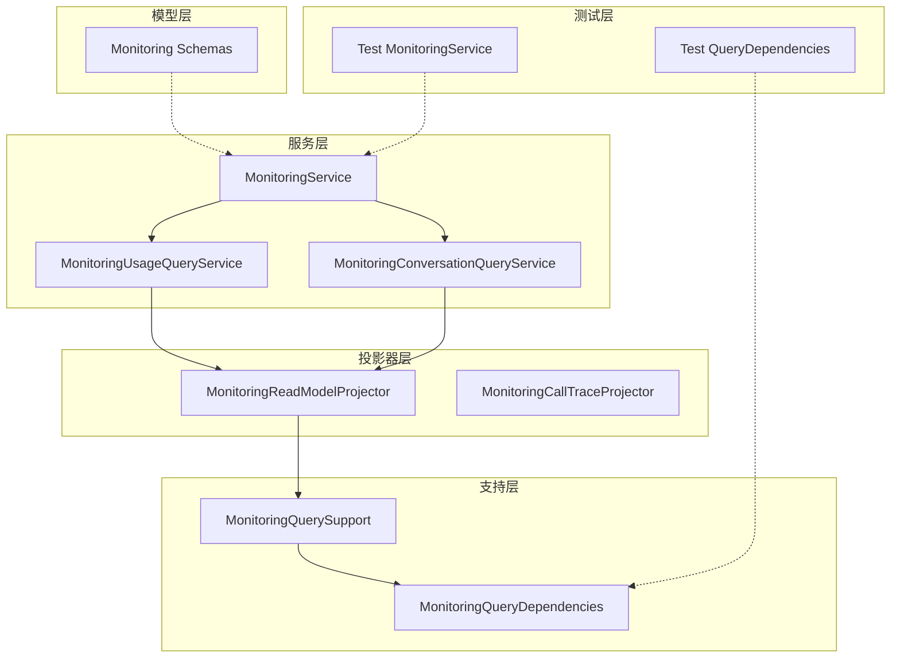
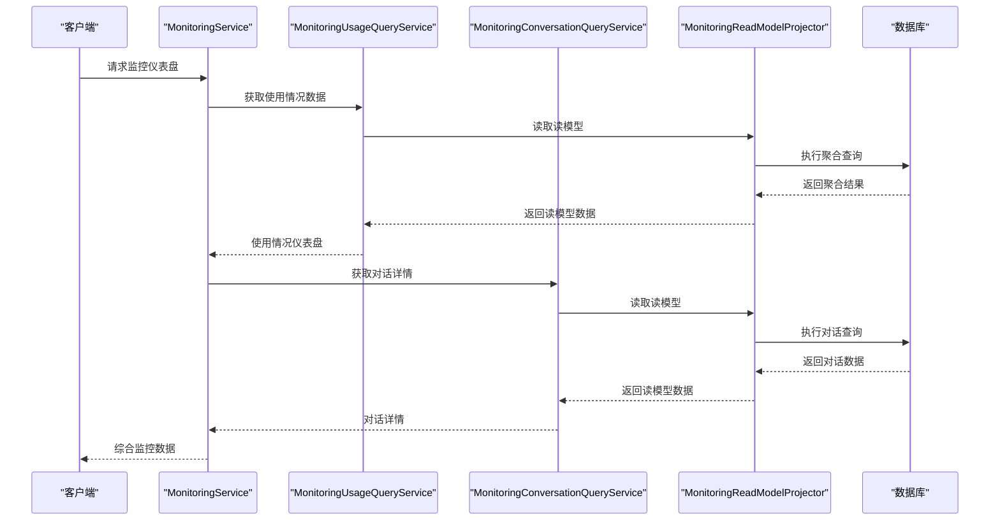
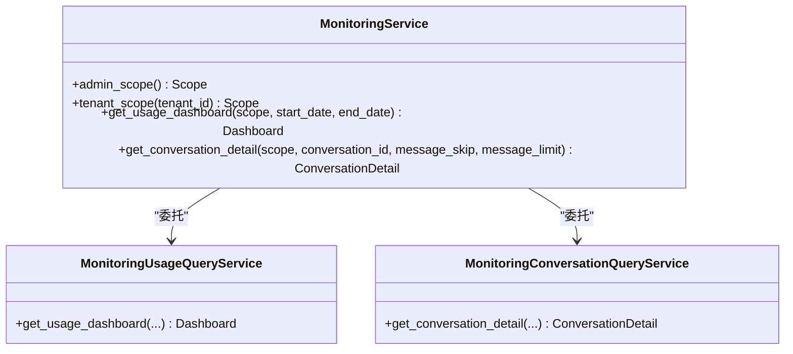
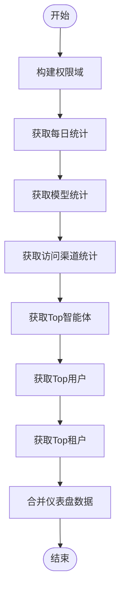
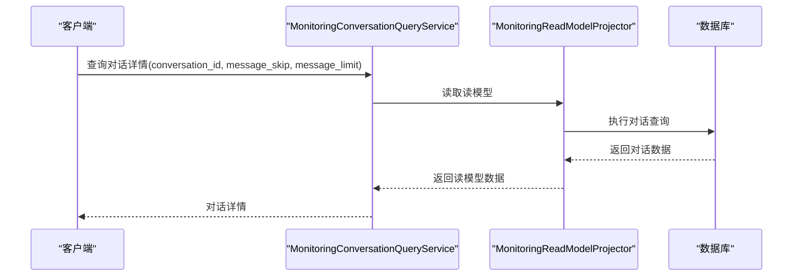
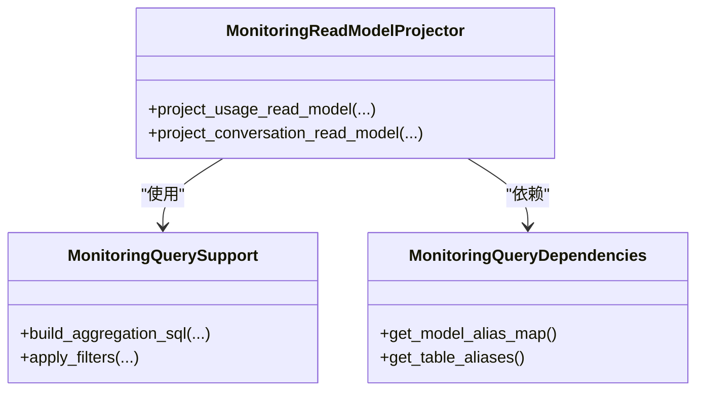
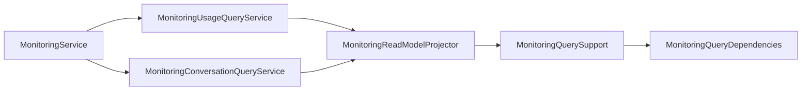

# AI监控模块

<cite>
**本文档引用的文件**
- [monitoring_service.py](file://backend/app/services/ai/monitoring_service.py)
- [monitoring_usage_query_service.py](file://backend/app/services/ai/monitoring_usage_query_service.py)
- [monitoring_conversation_query_service.py](file://backend/app/services/ai/monitoring_conversation_query_service.py)
- [monitoring_read_model_projector.py](file://backend/app/services/ai/monitoring_read_model_projector.py)
- [monitoring_call_trace_projector.py](file://backend/app/services/ai/monitoring_call_trace_projector.py)
- [monitoring_query_support.py](file://backend/app/services/ai/monitoring_query_support.py)
- [monitoring_query_dependencies.py](file://backend/app/services/ai/monitoring_query_dependencies.py)
- [monitoring.py](file://backend/app/schemas/ai/monitoring.py)
- [test_monitoring_service.py](file://backend/tests/services/test_monitoring_service.py)
- [test_monitoring_query_dependencies.py](file://backend/tests/services/test_monitoring_query_dependencies.py)
- [dashboard_service_parts_tenant.py](file://backend/app/services/system/dashboard_service_parts/tenant.py)
- [test_ai_gateway_platform_logging.py](file://backend/tests/services/test_ai_gateway_platform_logging.py)
- [test_call_log_service.py](file://backend/tests/services/test_call_log_service.py)
</cite>

## 目录
1. [简介](#简介)
2. [项目结构](#项目结构)
3. [核心组件](#核心组件)
4. [架构总览](#架构总览)
5. [详细组件分析](#详细组件分析)
6. [依赖关系分析](#依赖关系分析)
7. [性能考虑](#性能考虑)
8. [故障排除指南](#故障排除指南)
9. [结论](#结论)

## 简介
本技术文档面向AI监控模块，系统性阐述AI调用日志监控、对话监控与使用情况监控的实现架构与设计模式。文档覆盖监控页面组件的数据流与状态管理、监控卡片组件的复用机制、数据格式化工具与图表展示组件，并提供实时更新机制、错误处理策略与性能优化方案。同时，文档涵盖监控权限控制、数据过滤与导出功能的实现细节，帮助开发者与运维人员快速理解并高效维护该模块。

## 项目结构
AI监控模块位于后端服务层，采用分层架构与职责分离设计：
- 服务层：监控主服务、使用情况查询服务、对话查询服务
- 投影器层：读模型投影器、调用轨迹投影器
- 支持层：查询支持、查询依赖
- 模型层：监控相关Schema定义
- 测试层：针对监控服务与查询依赖的单元测试

**图示来源**
- [monitoring_service.py](file://backend/app/services/ai/monitoring_service.py)
- [monitoring_usage_query_service.py](file://backend/app/services/ai/monitoring_usage_query_service.py)
- [monitoring_conversation_query_service.py](file://backend/app/services/ai/monitoring_conversation_query_service.py)
- [monitoring_read_model_projector.py](file://backend/app/services/ai/monitoring_read_model_projector.py)
- [monitoring_call_trace_projector.py](file://backend/app/services/ai/monitoring_call_trace_projector.py)
- [monitoring_query_support.py](file://backend/app/services/ai/monitoring_query_support.py)
- [monitoring_query_dependencies.py](file://backend/app/services/ai/monitoring_query_dependencies.py)
- [monitoring.py](file://backend/app/schemas/ai/monitoring.py)
- [test_monitoring_service.py](file://backend/tests/services/test_monitoring_service.py)
- [test_monitoring_query_dependencies.py](file://backend/tests/services/test_monitoring_query_dependencies.py)

**章节来源**
- [monitoring_service.py](file://backend/app/services/ai/monitoring_service.py)
- [monitoring_usage_query_service.py](file://backend/app/services/ai/monitoring_usage_query_service.py)
- [monitoring_conversation_query_service.py](file://backend/app/services/ai/monitoring_conversation_query_service.py)
- [monitoring_read_model_projector.py](file://backend/app/services/ai/monitoring_read_model_projector.py)
- [monitoring_call_trace_projector.py](file://backend/app/services/ai/monitoring_call_trace_projector.py)
- [monitoring_query_support.py](file://backend/app/services/ai/monitoring_query_support.py)
- [monitoring_query_dependencies.py](file://backend/app/services/ai/monitoring_query_dependencies.py)
- [monitoring.py](file://backend/app/schemas/ai/monitoring.py)

## 核心组件
- 监控主服务（MonitoringService）：统一入口，负责权限域构建、委托到具体查询服务、聚合监控仪表盘数据。
- 使用情况查询服务（MonitoringUsageQueryService）：负责生成使用仪表盘，包括总调用次数、成功率、每日统计、模型统计、访问渠道统计、Top实体等。
- 对话查询服务（MonitoringConversationQueryService）：负责对话详情查询与分页，支持消息跳过与限制。
- 读模型投影器（MonitoringReadModelProjector）：将写模型转换为监控读模型，支撑查询服务。
- 调用轨迹投影器（MonitoringCallTraceProjector）：追踪调用链路与诊断信息，用于问题定位。
- 查询支持与依赖（MonitoringQuerySupport、MonitoringQueryDependencies）：提供SQL查询支持与依赖注入。
- Schema定义：监控相关数据结构定义，确保前后端契约一致。

**章节来源**
- [monitoring_service.py](file://backend/app/services/ai/monitoring_service.py)
- [monitoring_usage_query_service.py](file://backend/app/services/ai/monitoring_usage_query_service.py)
- [monitoring_conversation_query_service.py](file://backend/app/services/ai/monitoring_conversation_query_service.py)
- [monitoring_read_model_projector.py](file://backend/app/services/ai/monitoring_read_model_projector.py)
- [monitoring_call_trace_projector.py](file://backend/app/services/ai/monitoring_call_trace_projector.py)
- [monitoring_query_support.py](file://backend/app/services/ai/monitoring_query_support.py)
- [monitoring_query_dependencies.py](file://backend/app/services/ai/monitoring_query_dependencies.py)
- [monitoring.py](file://backend/app/schemas/ai/monitoring.py)

## 架构总览
AI监控模块采用“服务-投影-查询-支持”的分层架构，通过读模型投影器将写模型转换为监控专用读模型，查询服务基于查询支持与依赖进行数据聚合与过滤，最终由监控主服务统一输出仪表盘数据。

**图示来源**
- [monitoring_service.py](file://backend/app/services/ai/monitoring_service.py)
- [monitoring_usage_query_service.py](file://backend/app/services/ai/monitoring_usage_query_service.py)
- [monitoring_conversation_query_service.py](file://backend/app/services/ai/monitoring_conversation_query_service.py)
- [monitoring_read_model_projector.py](file://backend/app/services/ai/monitoring_read_model_projector.py)

## 详细组件分析

### 监控主服务（MonitoringService）
- 职责：构建权限域（admin/tenant），委托到使用情况查询服务与对话查询服务，聚合仪表盘数据。
- 设计模式：门面模式（Facade），统一对外接口；工厂模式（admin_scope/tenant_scope）用于权限域构建。
- 数据流：接收请求→构建scope→调用子服务→合并结果→返回响应。
- 权限控制：通过scope参数限定数据可见范围，支持平台级与租户级视图。

**图示来源**
- [monitoring_service.py](file://backend/app/services/ai/monitoring_service.py)
- [monitoring_usage_query_service.py](file://backend/app/services/ai/monitoring_usage_query_service.py)
- [monitoring_conversation_query_service.py](file://backend/app/services/ai/monitoring_conversation_query_service.py)

**章节来源**
- [monitoring_service.py](file://backend/app/services/ai/monitoring_service.py)
- [test_monitoring_service.py](file://backend/tests/services/test_monitoring_service.py)

### 使用情况查询服务（MonitoringUsageQueryService）
- 职责：生成使用仪表盘，包括总调用次数、成功率、每日统计、模型统计、访问渠道统计、Top实体等。
- 数据聚合：基于读模型投影器执行多维聚合查询，支持时间范围过滤与维度切片。
- 输出结构：仪表盘摘要、每日统计、模型统计、访问渠道统计、Top实体列表等。

**图示来源**
- [monitoring_usage_query_service.py](file://backend/app/services/ai/monitoring_usage_query_service.py)
- [test_monitoring_service.py](file://backend/tests/services/test_monitoring_service.py)

**章节来源**
- [monitoring_usage_query_service.py](file://backend/app/services/ai/monitoring_usage_query_service.py)
- [test_monitoring_service.py](file://backend/tests/services/test_monitoring_service.py)

### 对话查询服务（MonitoringConversationQueryService）
- 职责：根据会话ID查询对话详情，支持消息跳过与限制，确保大对话的可分页浏览。
- 错误处理：当会话不存在时抛出异常，便于上层统一处理。
- 数据格式化：返回结构化的对话详情，包含消息列表与分页参数。

**图示来源**
- [monitoring_conversation_query_service.py](file://backend/app/services/ai/monitoring_conversation_query_service.py)
- [monitoring_read_model_projector.py](file://backend/app/services/ai/monitoring_read_model_projector.py)
- [test_monitoring_service.py](file://backend/tests/services/test_monitoring_service.py)

**章节来源**
- [monitoring_conversation_query_service.py](file://backend/app/services/ai/monitoring_conversation_query_service.py)
- [test_monitoring_service.py](file://backend/tests/services/test_monitoring_service.py)

### 读模型投影器（MonitoringReadModelProjector）
- 职责：将写模型转换为监控专用读模型，提供高效的聚合查询能力。
- 依赖：依赖查询支持与查询依赖，确保SQL构建与参数绑定正确。
- 性能：通过预聚合与索引友好的查询结构，降低复杂度。

**图示来源**
- [monitoring_read_model_projector.py](file://backend/app/services/ai/monitoring_read_model_projector.py)
- [monitoring_query_support.py](file://backend/app/services/ai/monitoring_query_support.py)
- [monitoring_query_dependencies.py](file://backend/app/services/ai/monitoring_query_dependencies.py)

**章节来源**
- [monitoring_read_model_projector.py](file://backend/app/services/ai/monitoring_read_model_projector.py)
- [monitoring_query_support.py](file://backend/app/services/ai/monitoring_query_support.py)
- [monitoring_query_dependencies.py](file://backend/app/services/ai/monitoring_query_dependencies.py)

### 调用轨迹投影器（MonitoringCallTraceProjector）
- 职责：追踪调用链路与诊断信息，辅助问题定位与性能分析。
- 数据来源：结合调用日志与网关记录，生成详细的调用轨迹。
- 应用场景：在监控页面中展示调用失败原因、协议回退信息等。

**章节来源**
- [monitoring_call_trace_projector.py](file://backend/app/services/ai/monitoring_call_trace_projector.py)
- [test_ai_gateway_platform_logging.py](file://backend/tests/services/test_ai_gateway_platform_logging.py)

### Schema定义（监控相关）
- 职责：定义监控仪表盘、使用情况、对话详情等数据结构，确保前后端契约一致。
- 内容：包括仪表盘摘要、每日统计、模型统计、访问渠道统计、Top实体、对话详情等Schema。

**章节来源**
- [monitoring.py](file://backend/app/schemas/ai/monitoring.py)

## 依赖关系分析
监控模块的依赖关系清晰，遵循“服务-投影-查询-支持”的分层原则，避免循环依赖，增强可测试性与可维护性。

**图示来源**
- [monitoring_service.py](file://backend/app/services/ai/monitoring_service.py)
- [monitoring_usage_query_service.py](file://backend/app/services/ai/monitoring_usage_query_service.py)
- [monitoring_conversation_query_service.py](file://backend/app/services/ai/monitoring_conversation_query_service.py)
- [monitoring_read_model_projector.py](file://backend/app/services/ai/monitoring_read_model_projector.py)
- [monitoring_query_support.py](file://backend/app/services/ai/monitoring_query_support.py)
- [monitoring_query_dependencies.py](file://backend/app/services/ai/monitoring_query_dependencies.py)

**章节来源**
- [monitoring_service.py](file://backend/app/services/ai/monitoring_service.py)
- [monitoring_usage_query_service.py](file://backend/app/services/ai/monitoring_usage_query_service.py)
- [monitoring_conversation_query_service.py](file://backend/app/services/ai/monitoring_conversation_query_service.py)
- [monitoring_read_model_projector.py](file://backend/app/services/ai/monitoring_read_model_projector.py)
- [monitoring_query_support.py](file://backend/app/services/ai/monitoring_query_support.py)
- [monitoring_query_dependencies.py](file://backend/app/services/ai/monitoring_query_dependencies.py)

## 性能考虑
- 读模型投影：通过预聚合与索引友好的查询结构，减少复杂度与查询时间。
- 分页与过滤：对话详情支持消息跳过与限制，避免一次性加载大量数据。
- 缓存策略：建议对高频查询（如Top实体、每日统计）引入缓存，降低数据库压力。
- 异步处理：调用日志记录采用异步任务，避免阻塞主流程。
- 监控面板：卡片组件复用与懒加载，提升渲染性能。

[本节为通用性能指导，不直接分析具体文件]

## 故障排除指南
- 调用日志记录失败：检查异步任务队列与数据库事务，确保异常被捕获并记录。
- 对话不存在：在查询服务中捕获异常并返回明确错误信息，便于前端提示。
- 平台级监控：确认权限域构建正确，避免越权访问。
- 数据一致性：校验读模型投影器与查询支持的SQL构建逻辑，确保聚合结果准确。

**章节来源**
- [test_ai_gateway_platform_logging.py](file://backend/tests/services/test_ai_gateway_platform_logging.py)
- [test_monitoring_service.py](file://backend/tests/services/test_monitoring_service.py)
- [test_call_log_service.py](file://backend/tests/services/test_call_log_service.py)

## 结论
AI监控模块通过清晰的分层架构与职责分离，实现了调用日志监控、对话监控与使用情况监控的统一管理。监控主服务作为门面，委托到具体的查询服务，读模型投影器提供高效的聚合能力，配合完善的测试与错误处理策略，确保了系统的稳定性与可维护性。建议在实际部署中结合缓存与异步处理进一步优化性能，并持续完善权限控制与数据过滤能力以满足不同租户的需求。