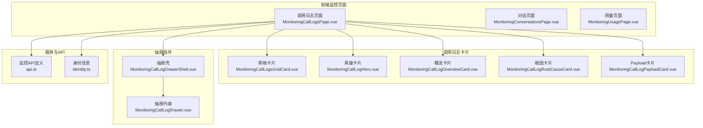
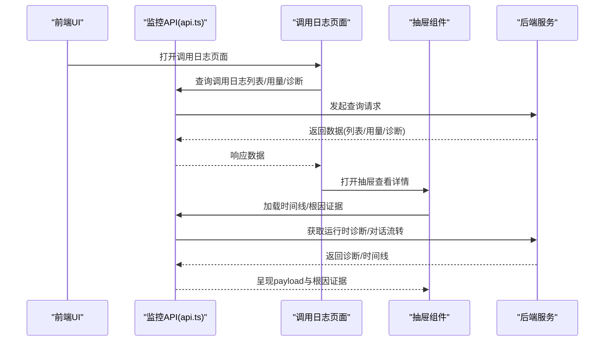
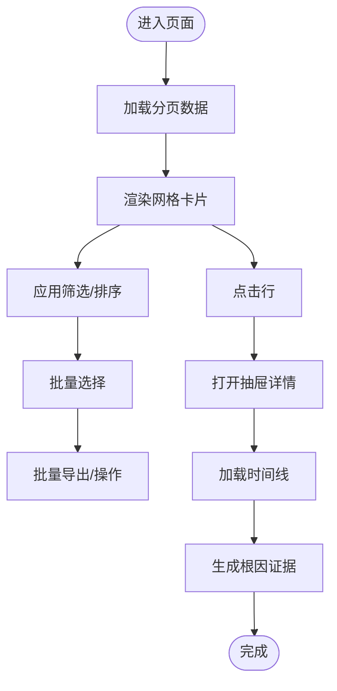
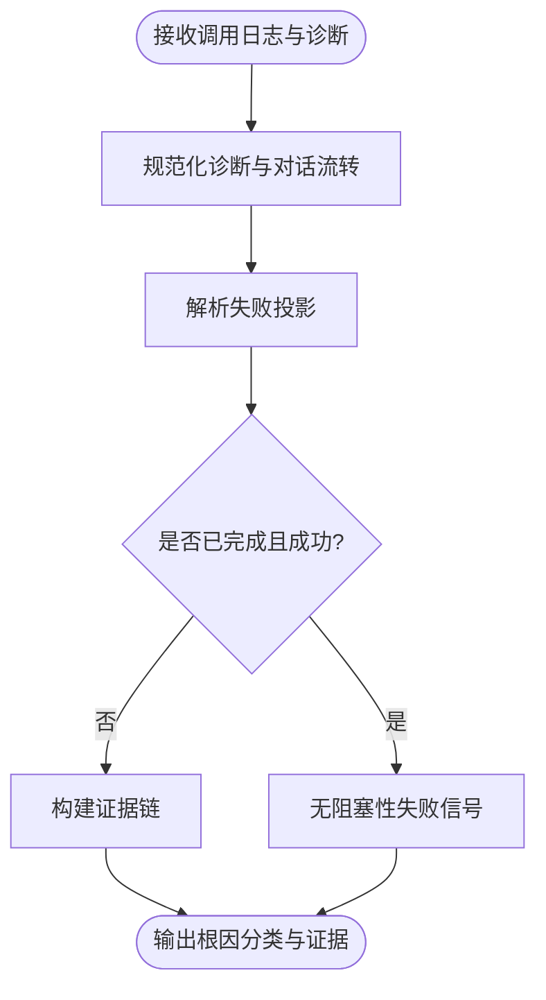
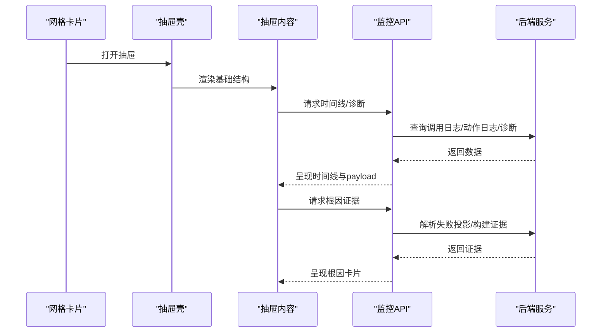
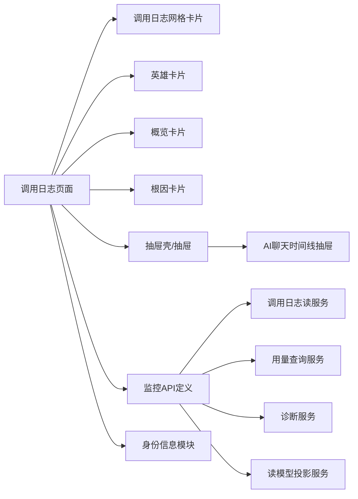

# AI调用日志监控

<cite>
**本文引用的文件**
- [MonitoringCallLogHero.vue](file://frontend/apps/web-antd/src/features/ai-monitoring/pages/monitoring-call-log/MonitoringCallLogHero.vue)
- [MonitoringCallLogOverviewCard.vue](file://frontend/apps/web-antd/src/features/ai-monitoring/pages/monitoring-call-log/MonitoringCallLogOverviewCard.vue)
- [MonitoringCallLogsGridCard.vue](file://frontend/apps/web-antd/src/features/ai-monitoring/pages/monitoring-call-log/MonitoringCallLogsGridCard.vue)
- [MonitoringCallLogPayloadCard.vue](file://frontend/apps/web-antd/src/features/ai-monitoring/pages/monitoring-call-log/MonitoringCallLogPayloadCard.vue)
- [MonitoringCallLogRootCauseCard.vue](file://frontend/apps/web-antd/src/features/ai-monitoring/pages/monitoring-call-log/MonitoringCallLogRootCauseCard.vue)
- [MonitoringCallLogDrawer.vue](file://frontend/apps/web-antd/src/features/ai-monitoring/pages/MonitoringCallLogDrawer.vue)
- [MonitoringCallLogDrawerShell.vue](file://frontend/apps/web-antd/src/features/ai-monitoring/pages/MonitoringCallLogDrawerShell.vue)
- [MonitoringCallLogsPage.vue](file://frontend/apps/web-antd/src/features/ai-monitoring/pages/MonitoringCallLogsPage.vue)
- [MonitoringCallLogsPageShell.vue](file://frontend/apps/web-antd/src/features/ai-monitoring/pages/MonitoringCallLogsPageShell.vue)
- [MonitoringUsageAccessChannelCard.vue](file://frontend/apps/web-antd/src/features/ai-monitoring/pages/monitoring-usage/MonitoringUsageAccessChannelCard.vue)
- [MonitoringUsageCharts.vue](file://frontend/apps/web-antd/src/features/ai-monitoring/pages/monitoring-usage/MonitoringUsageCharts.vue)
- [MonitoringUsageHero.vue](file://frontend/apps/web-antd/src/features/ai-monitoring/pages/monitoring-usage/MonitoringUsageHero.vue)
- [MonitoringUsageTopSectionCard.vue](file://frontend/apps/web-antd/src/features/ai-monitoring/pages/monitoring-usage/MonitoringUsageTopSectionCard.vue)
- [MonitoringUsageTopTenantsCard.vue](file://frontend/apps/web-antd/src/features/ai-monitoring/pages/monitoring-usage/MonitoringUsageTopTenantsCard.vue)
- [use-monitoring-usage-dashboard.ts](file://frontend/apps/web-antd/src/features/ai-monitoring/pages/monitoring-usage/use-monitoring-usage-dashboard.ts)
- [api.ts](file://frontend/apps/web-antd/src/features/ai-monitoring/api.ts)
- [identity.ts](file://frontend/apps/web-antd/src/features/ai-monitoring/identity.ts)
- [AIChatTimelineDrawer.vue](file://frontend/apps/web-antd/src/components/business/ai-slide-panel/AIChatTimelineDrawer.vue)
- [call_log.py](file://backend/app/models/ai/call_log.py)
- [call_log_repository.py](file://backend/app/repositories/ai/call_log_repository.py)
- [call_log_read_service.py](file://backend/app/services/ai/call_log_read_service.py)
- [call_log_service.py](file://backend/app/services/ai/call_log_service.py)
- [call_log_write_service.py](file://backend/app/services/ai/call_log_write_service.py)
- [call_log_projection_service.py](file://backend/app/services/ai/call_log_projection_service.py)
- [runtime_diagnostics_service.py](file://backend/app/services/ai/runtime_diagnostics_service.py)
- [runtime_root_cause_projector.py](file://backend/app/services/ai/runtime_root_cause_projector.py)
- [monitoring_service.py](file://backend/app/services/ai/monitoring_service.py)
- [monitoring_usage_query_service.py](file://backend/app/services/ai/monitoring_usage_query_service.py)
- [monitoring_read_model_projector.py](file://backend/app/services/ai/monitoring_read_model_projector.py)
- [monitoring_query_support.py](file://backend/app/services/ai/monitoring_query_support.py)
- [monitoring_conversation_query_service.py](file://backend/app/services/ai/monitoring_conversation_query_service.py)
- [conversation_timeline_service.py](file://backend/app/services/ai/conversation_timeline_service.py)
- [ai_call_logs.py](file://backend/app/api/admin/ai_call_logs.py)
- [ai_call_logs.py](file://backend/app/api/tenant/ai_call_logs.py)
- [call_log_bridge.py](file://backend/app/ai/gateway_support/call_log_bridge.py)
- [call_log.py](file://backend/app/schemas/ai/call_log.py)
- [monitoring.py](file://backend/app/schemas/ai/monitoring.py)
</cite>

## 目录
1. [简介](#简介)
2. [项目结构](#项目结构)
3. [核心组件](#核心组件)
4. [架构总览](#架构总览)
5. [详细组件分析](#详细组件分析)
6. [依赖关系分析](#依赖关系分析)
7. [性能考虑](#性能考虑)
8. [故障排查指南](#故障排查指南)
9. [结论](#结论)
10. [附录](#附录)

## 简介
本技术文档围绕“AI调用日志监控”功能，系统性阐述前端监控页面的架构设计与实现要点，涵盖监控网格卡片、英雄卡片、概览卡片与根因分析卡片的职责与交互；同时文档化调用日志的数据结构、状态管理与实时更新机制，详解调用日志抽屉组件的数据展示逻辑、payload卡片的内容解析策略，以及根因分析的算法实现路径。此外，文档还包含筛选条件、排序与批量操作的实现细节，并给出最佳实践与性能优化建议。

## 项目结构
前端监控模块位于 web-antd 应用中，采用按页面与功能分层组织：
- 页面层：监控调用日志页、监控对话页、监控用量页
- 卡片层：各卡片组件（网格、英雄、概览、根因等）
- 抽屉层：调用日志抽屉与壳组件
- 服务与API：统一的监控API接口定义与身份信息处理
- 后端服务：调用日志读写、投影、诊断、用量统计与查询支持

图表来源
- [MonitoringCallLogsPage.vue](file://frontend/apps/web-antd/src/features/ai-monitoring/pages/MonitoringCallLogsPage.vue)
- [MonitoringCallLogsGridCard.vue](file://frontend/apps/web-antd/src/features/ai-monitoring/pages/monitoring-call-log/MonitoringCallLogsGridCard.vue)
- [MonitoringCallLogHero.vue](file://frontend/apps/web-antd/src/features/ai-monitoring/pages/monitoring-call-log/MonitoringCallLogHero.vue)
- [MonitoringCallLogOverviewCard.vue](file://frontend/apps/web-antd/src/features/ai-monitoring/pages/monitoring-call-log/MonitoringCallLogOverviewCard.vue)
- [MonitoringCallLogRootCauseCard.vue](file://frontend/apps/web-antd/src/features/ai-monitoring/pages/monitoring-call-log/MonitoringCallLogRootCauseCard.vue)
- [MonitoringCallLogPayloadCard.vue](file://frontend/apps/web-antd/src/features/ai-monitoring/pages/monitoring-call-log/MonitoringCallLogPayloadCard.vue)
- [MonitoringCallLogDrawerShell.vue](file://frontend/apps/web-antd/src/features/ai-monitoring/pages/MonitoringCallLogDrawerShell.vue)
- [MonitoringCallLogDrawer.vue](file://frontend/apps/web-antd/src/features/ai-monitoring/pages/MonitoringCallLogDrawer.vue)
- [api.ts](file://frontend/apps/web-antd/src/features/ai-monitoring/api.ts)
- [identity.ts](file://frontend/apps/web-antd/src/features/ai-monitoring/identity.ts)

章节来源
- [MonitoringCallLogsPage.vue](file://frontend/apps/web-antd/src/features/ai-monitoring/pages/MonitoringCallLogsPage.vue)
- [MonitoringCallLogsPageShell.vue](file://frontend/apps/web-antd/src/features/ai-monitoring/pages/MonitoringCallLogsPageShell.vue)
- [MonitoringConversationsPage.vue](file://frontend/apps/web-antd/src/features/ai-monitoring/pages/MonitoringConversationsPage.vue)
- [MonitoringUsagePage.vue](file://frontend/apps/web-antd/src/features/ai-monitoring/pages/MonitoringUsagePage.vue)

## 核心组件
- 调用日志网格卡片：负责分页列表渲染、筛选与排序、批量选择与操作入口
- 英雄卡片：展示关键指标（成功率、调用次数、Token总量、费用）的汇总视图
- 概览卡片：提供时间序列与维度拆解（渠道、模型、租户、用户）的概览
- 根因分析卡片：基于运行时诊断与对话流转，输出失败归类与证据链
- 抽屉组件：承载详情面板，包含时间线、payload解析与根因证据

章节来源
- [MonitoringCallLogsGridCard.vue](file://frontend/apps/web-antd/src/features/ai-monitoring/pages/monitoring-call-log/MonitoringCallLogsGridCard.vue)
- [MonitoringCallLogHero.vue](file://frontend/apps/web-antd/src/features/ai-monitoring/pages/monitoring-call-log/MonitoringCallLogHero.vue)
- [MonitoringCallLogOverviewCard.vue](file://frontend/apps/web-antd/src/features/ai-monitoring/pages/monitoring-call-log/MonitoringCallLogOverviewCard.vue)
- [MonitoringCallLogRootCauseCard.vue](file://frontend/apps/web-antd/src/features/ai-monitoring/pages/monitoring-call-log/MonitoringCallLogRootCauseCard.vue)
- [MonitoringCallLogDrawer.vue](file://frontend/apps/web-antd/src/features/ai-monitoring/pages/MonitoringCallLogDrawer.vue)
- [MonitoringCallLogDrawerShell.vue](file://frontend/apps/web-antd/src/features/ai-monitoring/pages/MonitoringCallLogDrawerShell.vue)

## 架构总览
前端通过统一API定义与身份信息模块，向后端服务发起查询与操作请求；后端服务负责从数据库读取调用日志、投影运行时诊断、计算用量统计，并返回给前端渲染。

图表来源
- [api.ts](file://frontend/apps/web-antd/src/features/ai-monitoring/api.ts)
- [MonitoringCallLogsPage.vue](file://frontend/apps/web-antd/src/features/ai-monitoring/pages/MonitoringCallLogsPage.vue)
- [MonitoringCallLogDrawer.vue](file://frontend/apps/web-antd/src/features/ai-monitoring/pages/MonitoringCallLogDrawer.vue)
- [runtime_diagnostics_service.py](file://backend/app/services/ai/runtime_diagnostics_service.py)
- [monitoring_usage_query_service.py](file://backend/app/services/ai/monitoring_usage_query_service.py)

## 详细组件分析

### 调用日志网格卡片
职责与实现要点：
- 列表渲染：基于分页查询结果渲染行，支持列宽自适应与响应式布局
- 筛选与排序：通过查询规范对象传递过滤器与排序字段，后端按需构建SQL
- 批量操作：多选行集合，提供批量导出、标记等操作入口
- 交互行为：点击行打开抽屉，展示时间线与根因证据

图表来源
- [MonitoringCallLogsGridCard.vue](file://frontend/apps/web-antd/src/features/ai-monitoring/pages/monitoring-call-log/MonitoringCallLogsGridCard.vue)
- [MonitoringCallLogDrawer.vue](file://frontend/apps/web-antd/src/features/ai-monitoring/pages/MonitoringCallLogDrawer.vue)

章节来源
- [MonitoringCallLogsGridCard.vue](file://frontend/apps/web-antd/src/features/ai-monitoring/pages/monitoring-call-log/MonitoringCallLogsGridCard.vue)

### 英雄卡片
职责与实现要点：
- 展示关键指标：成功/失败次数、成功率、总调用数、输入/输出Token、总成本
- 数据来源：后端用量聚合服务返回的摘要数据
- 可视化：以数字与趋势结合的方式呈现，便于快速掌握整体状况

章节来源
- [MonitoringCallLogHero.vue](file://frontend/apps/web-antd/src/features/ai-monitoring/pages/monitoring-call-log/MonitoringCallLogHero.vue)
- [MonitoringUsageHero.vue](file://frontend/apps/web-antd/src/features/ai-monitoring/pages/monitoring-usage/MonitoringUsageHero.vue)

### 概览卡片
职责与实现要点：
- 时间序列：按日粒度展示调用次数、Token、成本等指标
- 维度拆解：访问渠道、模型、租户、用户等Top N排行
- 交互：支持切换时间范围与维度，联动更新图表与表格

章节来源
- [MonitoringCallLogOverviewCard.vue](file://frontend/apps/web-antd/src/features/ai-monitoring/pages/monitoring-call-log/MonitoringCallLogOverviewCard.vue)
- [MonitoringUsageAccessChannelCard.vue](file://frontend/apps/web-antd/src/features/ai-monitoring/pages/monitoring-usage/MonitoringUsageAccessChannelCard.vue)
- [MonitoringUsageTopSectionCard.vue](file://frontend/apps/web-antd/src/features/ai-monitoring/pages/monitoring-usage/MonitoringUsageTopSectionCard.vue)
- [MonitoringUsageTopTenantsCard.vue](file://frontend/apps/web-antd/src/features/ai-monitoring/pages/monitoring-usage/MonitoringUsageTopTenantsCard.vue)
- [MonitoringUsageCharts.vue](file://frontend/apps/web-antd/src/features/ai-monitoring/pages/monitoring-usage/MonitoringUsageCharts.vue)
- [use-monitoring-usage-dashboard.ts](file://frontend/apps/web-antd/src/features/ai-monitoring/pages/monitoring-usage/use-monitoring-usage-dashboard.ts)

### 根因分析卡片
职责与实现要点：
- 输入：调用日志、运行时诊断、对话流转
- 处理：规范化诊断、解析失败投影、构建证据链
- 输出：失败类别、置信度、证据项列表
- 展示：在抽屉中以结构化方式呈现，支持展开/折叠

图表来源
- [runtime_diagnostics_service.py](file://backend/app/services/ai/runtime_diagnostics_service.py)
- [runtime_root_cause_projector.py](file://backend/app/services/ai/runtime_root_cause_projector.py)

章节来源
- [MonitoringCallLogRootCauseCard.vue](file://frontend/apps/web-antd/src/features/ai-monitoring/pages/monitoring-call-log/MonitoringCallLogRootCauseCard.vue)
- [runtime_diagnostics_service.py](file://backend/app/services/ai/runtime_diagnostics_service.py)
- [runtime_root_cause_projector.py](file://backend/app/services/ai/runtime_root_cause_projector.py)

### 调用日志抽屉组件
职责与实现要点：
- 数据展示：时间线（调用日志与动作日志）、payload解析、根因证据
- 内容解析：对复杂JSON进行格式化展示，避免大段文本溢出
- 实时刷新：支持手动刷新按钮，触发重新拉取最新数据

图表来源
- [MonitoringCallLogDrawerShell.vue](file://frontend/apps/web-antd/src/features/ai-monitoring/pages/MonitoringCallLogDrawerShell.vue)
- [MonitoringCallLogDrawer.vue](file://frontend/apps/web-antd/src/features/ai-monitoring/pages/MonitoringCallLogDrawer.vue)
- [AIChatTimelineDrawer.vue](file://frontend/apps/web-antd/src/components/business/ai-slide-panel/AIChatTimelineDrawer.vue)
- [conversation_timeline_service.py](file://backend/app/services/ai/conversation_timeline_service.py)

章节来源
- [MonitoringCallLogDrawerShell.vue](file://frontend/apps/web-antd/src/features/ai-monitoring/pages/MonitoringCallLogDrawerShell.vue)
- [MonitoringCallLogDrawer.vue](file://frontend/apps/web-antd/src/features/ai-monitoring/pages/MonitoringCallLogDrawer.vue)
- [AIChatTimelineDrawer.vue](file://frontend/apps/web-antd/src/components/business/ai-slide-panel/AIChatTimelineDrawer.vue)

### 调用日志数据结构与状态管理
- 数据结构：前端API定义了用量摘要、维度拆解项、时间序列点等接口类型，用于强类型约束与IDE提示
- 状态管理：页面通过查询参数与本地状态组合维护筛选、排序、分页与选中集；抽屉组件独立维护加载与刷新状态
- 实时更新：通过定时轮询或手动刷新触发重新拉取，抽屉内提供刷新按钮

章节来源
- [api.ts](file://frontend/apps/web-antd/src/features/ai-monitoring/api.ts)
- [MonitoringCallLogsPage.vue](file://frontend/apps/web-antd/src/features/ai-monitoring/pages/MonitoringCallLogsPage.vue)
- [MonitoringCallLogDrawer.vue](file://frontend/apps/web-antd/src/features/ai-monitoring/pages/MonitoringCallLogDrawer.vue)

### 调用日志抽屉的payload卡片内容解析
- 结构化展示：对诊断与调用元数据进行JSON格式化，控制缩进与换行
- 防溢出策略：限制最大高度并提供滚动条，避免大段文本影响布局
- 可读性优化：对空值、空数组、空对象进行过滤与占位显示

章节来源
- [MonitoringCallLogPayloadCard.vue](file://frontend/apps/web-antd/src/features/ai-monitoring/pages/monitoring-call-log/MonitoringCallLogPayloadCard.vue)
- [AIChatTimelineDrawer.vue](file://frontend/apps/web-antd/src/components/business/ai-slide-panel/AIChatTimelineDrawer.vue)

### 根因分析算法实现
- 规范化：清洗与标准化诊断与对话流转数据，剔除无效引用
- 投影：解析失败投影，识别阻塞性失败信号
- 分类：根据投影结果与权威输出状态，输出失败类别与置信度
- 证据：构建证据链，包含标签与值，过滤无意义值

章节来源
- [runtime_root_cause_projector.py](file://backend/app/services/ai/runtime_root_cause_projector.py)
- [runtime_diagnostics_service.py](file://backend/app/services/ai/runtime_diagnostics_service.py)

### 筛选条件、排序与批量操作
- 筛选条件：通过查询规范对象传递过滤器，后端按需拆分运行时过滤（如provider_id、model_id），其余过滤器参与通用查询
- 排序：支持多字段排序，后端按指定顺序生成SQL
- 批量操作：网格卡片维护选中集，提供批量导出与标记等操作入口

章节来源
- [monitoring_query_support.py](file://backend/app/services/ai/monitoring_query_support.py)
- [MonitoringCallLogsGridCard.vue](file://frontend/apps/web-antd/src/features/ai-monitoring/pages/monitoring-call-log/MonitoringCallLogsGridCard.vue)

## 依赖关系分析
前端组件与后端服务之间的依赖关系如下：

图表来源
- [MonitoringCallLogsPage.vue](file://frontend/apps/web-antd/src/features/ai-monitoring/pages/MonitoringCallLogsPage.vue)
- [MonitoringCallLogsGridCard.vue](file://frontend/apps/web-antd/src/features/ai-monitoring/pages/monitoring-call-log/MonitoringCallLogsGridCard.vue)
- [MonitoringCallLogHero.vue](file://frontend/apps/web-antd/src/features/ai-monitoring/pages/monitoring-call-log/MonitoringCallLogHero.vue)
- [MonitoringCallLogOverviewCard.vue](file://frontend/apps/web-antd/src/features/ai-monitoring/pages/monitoring-call-log/MonitoringCallLogOverviewCard.vue)
- [MonitoringCallLogRootCauseCard.vue](file://frontend/apps/web-antd/src/features/ai-monitoring/pages/monitoring-call-log/MonitoringCallLogRootCauseCard.vue)
- [MonitoringCallLogDrawerShell.vue](file://frontend/apps/web-antd/src/features/ai-monitoring/pages/MonitoringCallLogDrawerShell.vue)
- [MonitoringCallLogDrawer.vue](file://frontend/apps/web-antd/src/features/ai-monitoring/pages/MonitoringCallLogDrawer.vue)
- [AIChatTimelineDrawer.vue](file://frontend/apps/web-antd/src/components/business/ai-slide-panel/AIChatTimelineDrawer.vue)
- [api.ts](file://frontend/apps/web-antd/src/features/ai-monitoring/api.ts)
- [identity.ts](file://frontend/apps/web-antd/src/features/ai-monitoring/identity.ts)
- [call_log_read_service.py](file://backend/app/services/ai/call_log_read_service.py)
- [monitoring_usage_query_service.py](file://backend/app/services/ai/monitoring_usage_query_service.py)
- [runtime_diagnostics_service.py](file://backend/app/services/ai/runtime_diagnostics_service.py)
- [monitoring_read_model_projector.py](file://backend/app/services/ai/monitoring_read_model_projector.py)

章节来源
- [call_log_read_service.py](file://backend/app/services/ai/call_log_read_service.py)
- [monitoring_usage_query_service.py](file://backend/app/services/ai/monitoring_usage_query_service.py)
- [runtime_diagnostics_service.py](file://backend/app/services/ai/runtime_diagnostics_service.py)
- [monitoring_read_model_projector.py](file://backend/app/services/ai/monitoring_read_model_projector.py)

## 性能考虑
- 前端
  - 列表虚拟化：对长列表启用虚拟滚动，减少DOM节点数量
  - 懒加载：抽屉内容按需加载，避免一次性渲染过多数据
  - 缓存策略：对常用筛选条件与排序结果进行缓存，降低重复请求
  - 图表优化：时间序列数据分页或采样，避免一次性渲染过多点
- 后端
  - 查询优化：合理使用索引与分区，避免全表扫描；对聚合查询使用物化视图或缓存
  - 连接池与并发：控制数据库连接数与超时，避免阻塞
  - 诊断投影：对大规模日志进行批处理与异步化，避免阻塞主流程

## 故障排查指南
- 无法加载调用日志
  - 检查筛选条件与排序是否正确传递到后端
  - 查看网络面板确认请求URL与参数
- 根因分析为空
  - 确认调用日志是否包含有效诊断与对话流转
  - 检查后端诊断服务是否正常工作
- 抽屉内容不显示
  - 确认抽屉已打开且数据已返回
  - 检查payload解析是否报错或数据为空
- 用量图表异常
  - 检查时间范围与维度切换是否正确
  - 确认后端用量聚合服务返回数据格式一致

章节来源
- [MonitoringCallLogDrawer.vue](file://frontend/apps/web-antd/src/features/ai-monitoring/pages/MonitoringCallLogDrawer.vue)
- [runtime_diagnostics_service.py](file://backend/app/services/ai/runtime_diagnostics_service.py)
- [monitoring_usage_query_service.py](file://backend/app/services/ai/monitoring_usage_query_service.py)

## 结论
本方案通过前后端协同，实现了调用日志监控的完整闭环：从前端网格与卡片的可视化展示，到抽屉中的深度解析与根因分析，再到后端的高效查询与聚合。通过合理的筛选、排序与批量操作，配合性能优化与故障排查策略，能够满足生产环境下的可观测性需求。

## 附录
- 数据模型与API类型定义可参考前端API定义文件与后端模型/Schema文件
- 运行时诊断与根因投影的实现细节可参考后端诊断服务与投影器

章节来源
- [api.ts](file://frontend/apps/web-antd/src/features/ai-monitoring/api.ts)
- [call_log.py](file://backend/app/models/ai/call_log.py)
- [call_log.py](file://backend/app/schemas/ai/call_log.py)
- [monitoring.py](file://backend/app/schemas/ai/monitoring.py)