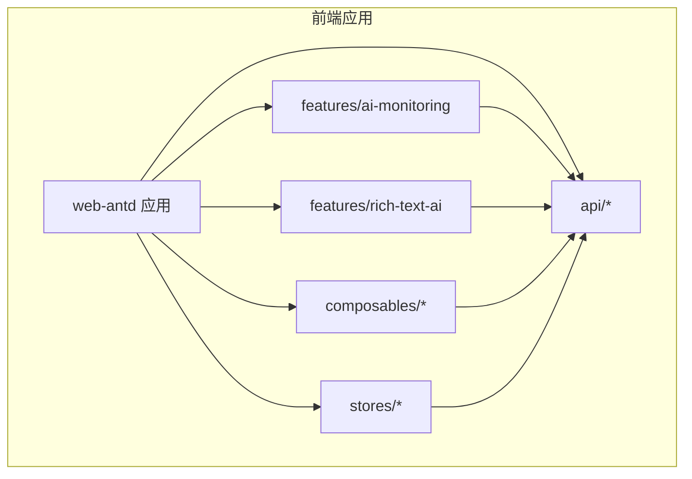
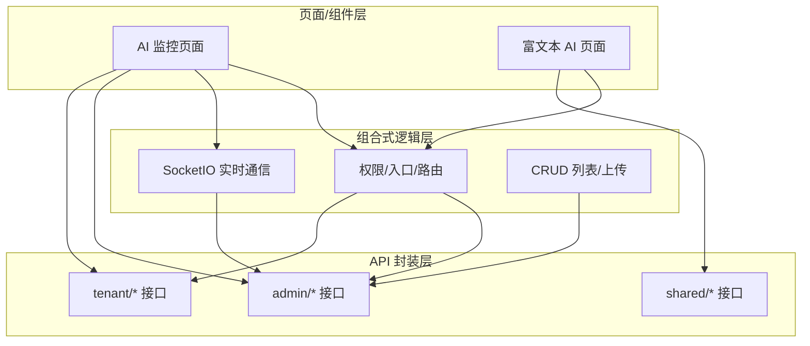
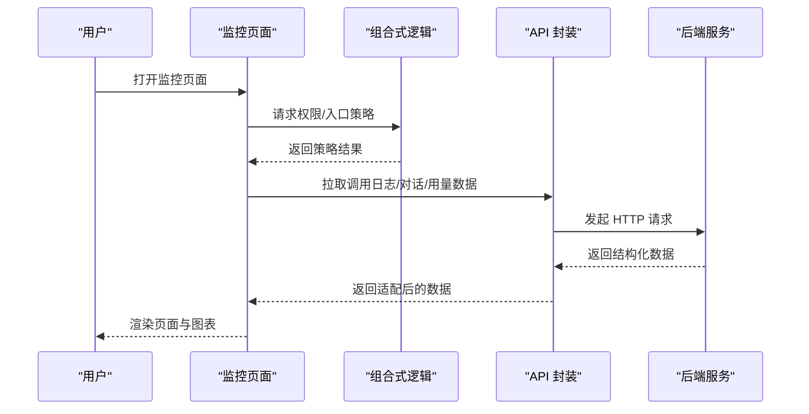
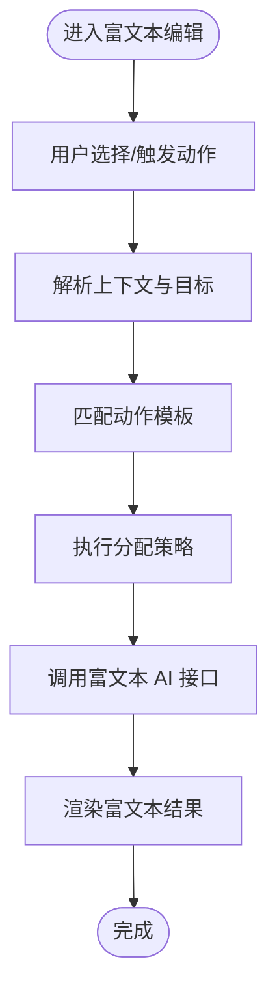
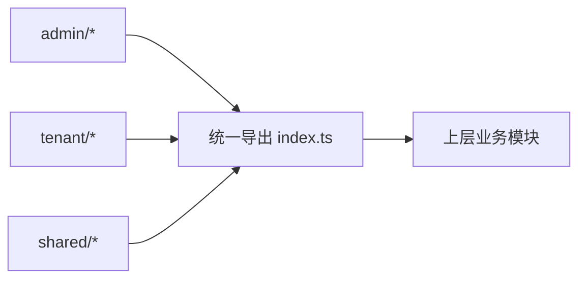
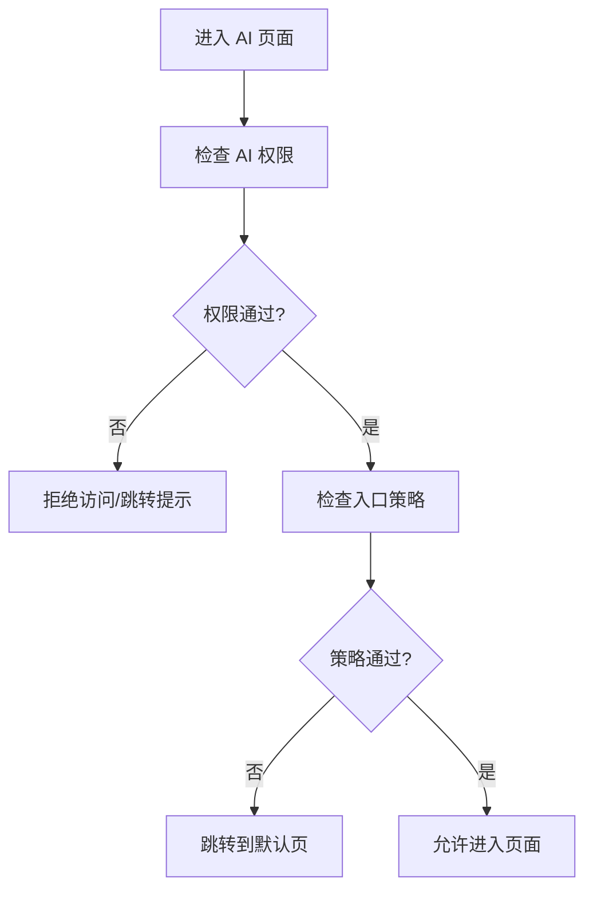
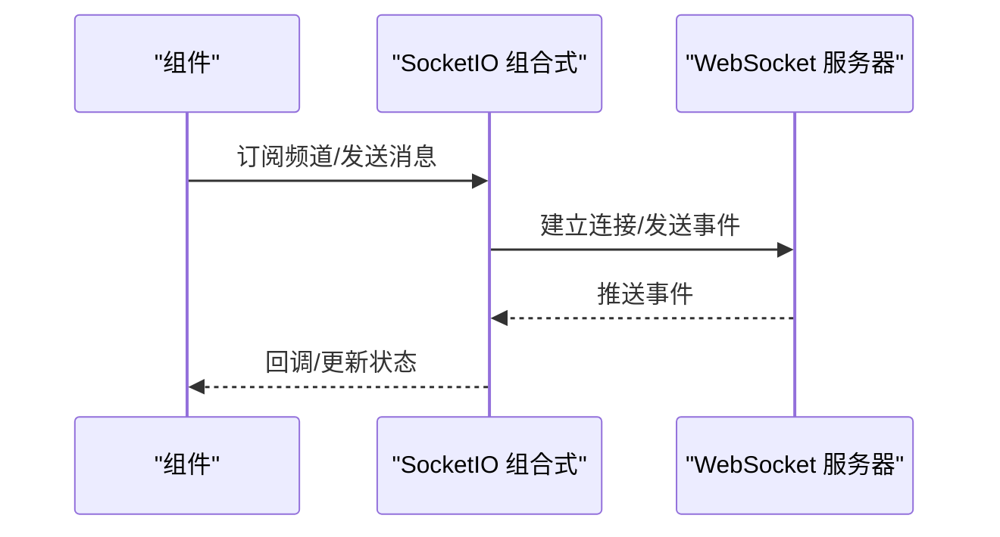
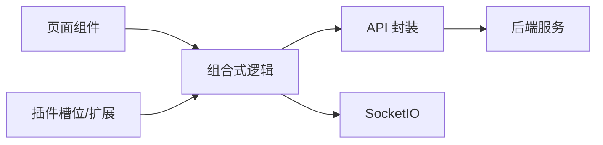

# 功能模块

<cite>
**本文引用的文件**
- [api.ts](file://frontend/apps/web-antd/src/features/ai-monitoring/api.ts)
- [identity.ts](file://frontend/apps/web-antd/src/features/ai-monitoring/identity.ts)
- [index.ts](file://frontend/apps/web-antd/src/features/ai-monitoring/index.ts)
- [use-rich-text-ai-assignment.ts](file://frontend/apps/web-antd/src/features/rich-text-ai/use-rich-text-ai-assignment.ts)
- [action-templates.ts](file://frontend/apps/web-antd/src/features/rich-text-ai/action-templates.ts)
- [types.ts](file://frontend/apps/web-antd/src/features/rich-text-ai/types.ts)
- [index.ts](file://frontend/apps/web-antd/src/features/rich-text-ai/index.ts)
- [api.ts](file://frontend/apps/web-antd/src/api/admin/ai-call-logs.ts)
- [api.ts](file://frontend/apps/web-antd/src/api/admin/ai-conversations.ts)
- [api.ts](file://frontend/apps/web-antd/src/api/admin/analytics.ts)
- [api.ts](file://frontend/apps/web-antd/src/api/tenant/analytics.ts)
- [api.ts](file://frontend/apps/web-antd/src/api/shared/ai-chat.ts)
- [api.ts](file://frontend/apps/web-antd/src/api/shared/rich-text-ai.ts)
- [use-crud-list.ts](file://frontend/apps/web-antd/src/composables/use-crud-list.ts)
- [use-socketio.ts](file://frontend/apps/web-antd/src/composables/use-socketio.ts)
- [use-ai-permission.ts](file://frontend/apps/web-antd/src/composables/use-ai-permission.ts)
- [use-ai-entry-policy.ts](file://frontend/apps/web-antd/src/composables/use-ai-entry-policy.ts)
- [use-agent-routing.ts](file://frontend/apps/web-antd/src/composables/use-agent-routing.ts)
- [plugin-extensions.ts](file://frontend/apps/web-antd/src/stores/plugin-extensions.ts)
- [plugin-slots.ts](file://frontend/apps/web-antd/src/stores/plugin-slots.ts)
- [index.ts](file://frontend/apps/web-antd/src/api/index.ts)
- [index.ts](file://frontend/apps/web-antd/src/composables/index.ts)
- [index.ts](file://frontend/apps/web-antd/src/stores/index.ts)
</cite>

## 目录
1. [简介](#简介)
2. [项目结构](#项目结构)
3. [核心组件](#核心组件)
4. [架构总览](#架构总览)
5. [详细组件分析](#详细组件分析)
6. [依赖分析](#依赖分析)
7. [性能考虑](#性能考虑)
8. [故障排查指南](#故障排查指南)
9. [结论](#结论)
10. [附录](#附录)

## 简介
本技术文档聚焦于前端功能模块，系统性阐述以下能力与实现：
- AI 监控功能：覆盖调用日志、对话监控、用量仪表盘与根因分析的前端实现与数据流。
- 富文本 AI 功能：包括动作模板、分配策略与类型约束，支撑在富文本编辑场景下的智能辅助。
- 其他业务功能：围绕权限策略、入口策略、代理路由、SocketIO 实时通信与通用 CRUD 列表等能力的模块化封装。

文档同时梳理 API 模块组织、常量与类型定义、业务逻辑封装方式，并给出模块间通信、状态共享与性能优化的实现建议，以及最佳实践、测试策略与维护指南。

## 项目结构
前端采用多应用与多包的组织方式，核心功能集中在 web-antd 应用中，通过 features、api、composables、stores 等目录分层管理：
- features：按业务域划分的功能模块（如 ai-monitoring、rich-text-ai）。
- api：按角色/域划分的后端接口封装（admin、tenant、shared）。
- composables：可复用的组合式逻辑（权限、列表、上传、SocketIO 等）。
- stores：插件扩展与槽位的状态管理。

**图表来源**
- [index.ts](file://frontend/apps/web-antd/src/features/ai-monitoring/index.ts)
- [index.ts](file://frontend/apps/web-antd/src/features/rich-text-ai/index.ts)
- [index.ts](file://frontend/apps/web-antd/src/api/index.ts)
- [index.ts](file://frontend/apps/web-antd/src/composables/index.ts)
- [index.ts](file://frontend/apps/web-antd/src/stores/index.ts)

**章节来源**
- [index.ts](file://frontend/apps/web-antd/src/features/ai-monitoring/index.ts)
- [index.ts](file://frontend/apps/web-antd/src/features/rich-text-ai/index.ts)
- [index.ts](file://frontend/apps/web-antd/src/api/index.ts)
- [index.ts](file://frontend/apps/web-antd/src/composables/index.ts)
- [index.ts](file://frontend/apps/web-antd/src/stores/index.ts)

## 核心组件
- AI 监控模块：提供调用日志、对话详情、用量仪表盘与根因分析等页面级组件与数据适配。
- 富文本 AI 模块：提供动作模板、分配策略与类型定义，支撑富文本场景的智能辅助。
- API 封装：按 admin/tenant/shared 维度组织接口，统一导出便于上层调用。
- 权限与策略：封装 AI 权限、入口策略与代理路由，保障访问控制与导航一致性。
- 实时通信：基于 SocketIO 的组合式封装，支持订阅与事件处理。
- 通用能力：CRUD 列表、文件上传、知识库工具等可复用逻辑。

**章节来源**
- [api.ts](file://frontend/apps/web-antd/src/features/ai-monitoring/api.ts)
- [identity.ts](file://frontend/apps/web-antd/src/features/ai-monitoring/identity.ts)
- [use-rich-text-ai-assignment.ts](file://frontend/apps/web-antd/src/features/rich-text-ai/use-rich-text-ai-assignment.ts)
- [action-templates.ts](file://frontend/apps/web-antd/src/features/rich-text-ai/action-templates.ts)
- [types.ts](file://frontend/apps/web-antd/src/features/rich-text-ai/types.ts)
- [api.ts](file://frontend/apps/web-antd/src/api/admin/ai-call-logs.ts)
- [api.ts](file://frontend/apps/web-antd/src/api/admin/ai-conversations.ts)
- [api.ts](file://frontend/apps/web-antd/src/api/admin/analytics.ts)
- [api.ts](file://frontend/apps/web-antd/src/api/tenant/analytics.ts)
- [api.ts](file://frontend/apps/web-antd/src/api/shared/ai-chat.ts)
- [api.ts](file://frontend/apps/web-antd/src/api/shared/rich-text-ai.ts)
- [use-crud-list.ts](file://frontend/apps/web-antd/src/composables/use-crud-list.ts)
- [use-socketio.ts](file://frontend/apps/web-antd/src/composables/use-socketio.ts)
- [use-ai-permission.ts](file://frontend/apps/web-antd/src/composables/use-ai-permission.ts)
- [use-ai-entry-policy.ts](file://frontend/apps/web-antd/src/composables/use-ai-entry-policy.ts)
- [use-agent-routing.ts](file://frontend/apps/web-antd/src/composables/use-agent-routing.ts)
- [plugin-extensions.ts](file://frontend/apps/web-antd/src/stores/plugin-extensions.ts)
- [plugin-slots.ts](file://frontend/apps/web-antd/src/stores/plugin-slots.ts)

## 架构总览
前端功能模块遵循“页面/组件层 → 组合式逻辑层 → API 封装层 → 数据/状态层”的分层架构。AI 监控与富文本 AI 作为业务域模块，分别通过各自的 API 适配器与页面组件进行数据拉取与展示；权限、策略与路由由组合式逻辑统一管理；实时通信与通用 CRUD 能力由可复用组合式函数提供。

**图表来源**
- [api.ts](file://frontend/apps/web-antd/src/api/admin/ai-call-logs.ts)
- [api.ts](file://frontend/apps/web-antd/src/api/admin/ai-conversations.ts)
- [api.ts](file://frontend/apps/web-antd/src/api/admin/analytics.ts)
- [api.ts](file://frontend/apps/web-antd/src/api/tenant/analytics.ts)
- [api.ts](file://frontend/apps/web-antd/src/api/shared/ai-chat.ts)
- [api.ts](file://frontend/apps/web-antd/src/api/shared/rich-text-ai.ts)
- [use-ai-permission.ts](file://frontend/apps/web-antd/src/composables/use-ai-permission.ts)
- [use-ai-entry-policy.ts](file://frontend/apps/web-antd/src/composables/use-ai-entry-policy.ts)
- [use-agent-routing.ts](file://frontend/apps/web-antd/src/composables/use-agent-routing.ts)
- [use-socketio.ts](file://frontend/apps/web-antd/src/composables/use-socketio.ts)
- [use-crud-list.ts](file://frontend/apps/web-antd/src/composables/use-crud-list.ts)

## 详细组件分析

### AI 监控功能
AI 监控模块提供三类核心页面：
- 调用日志：展示调用记录、概览、负载与根因分析卡片。
- 对话监控：展示对话列表、详情、消息与诊断卡片。
- 用量仪表盘：展示用量汇总、日趋势、模型/通道/租户/用户维度拆分。

模块化设计要点：
- 页面级组件：每个页面由多个卡片组件构成，职责单一、可复用。
- 数据适配：提供适配器与格式化工具，将后端返回的数据转换为页面所需结构。
- 身份与标识：提供身份信息与标识生成逻辑，用于区分不同维度的监控对象。

**图表来源**
- [api.ts](file://frontend/apps/web-antd/src/api/admin/ai-call-logs.ts)
- [api.ts](file://frontend/apps/web-antd/src/api/admin/ai-conversations.ts)
- [api.ts](file://frontend/apps/web-antd/src/api/admin/analytics.ts)
- [use-ai-permission.ts](file://frontend/apps/web-antd/src/composables/use-ai-permission.ts)
- [use-ai-entry-policy.ts](file://frontend/apps/web-antd/src/composables/use-ai-entry-policy.ts)

**章节来源**
- [api.ts](file://frontend/apps/web-antd/src/features/ai-monitoring/api.ts)
- [identity.ts](file://frontend/apps/web-antd/src/features/ai-monitoring/identity.ts)
- [index.ts](file://frontend/apps/web-antd/src/features/ai-monitoring/index.ts)

### 富文本 AI 功能
富文本 AI 模块提供：
- 动作模板：预置的动作模板集合，用于在富文本场景下触发特定 AI 行为。
- 分配策略：根据上下文或用户选择，动态分配合适的动作模板。
- 类型定义：对输入输出、动作参数与上下文进行强类型约束，确保调用安全与一致性。

模块化设计要点：
- 模板与策略解耦：模板负责“做什么”，策略负责“何时做”和“如何做”。
- 类型驱动：通过 TypeScript 类型定义保证调用契约，降低运行时错误。
- 可扩展：新增模板与策略无需改动现有调用方，遵循开放封闭原则。

**图表来源**
- [use-rich-text-ai-assignment.ts](file://frontend/apps/web-antd/src/features/rich-text-ai/use-rich-text-ai-assignment.ts)
- [action-templates.ts](file://frontend/apps/web-antd/src/features/rich-text-ai/action-templates.ts)
- [types.ts](file://frontend/apps/web-antd/src/features/rich-text-ai/types.ts)

**章节来源**
- [use-rich-text-ai-assignment.ts](file://frontend/apps/web-antd/src/features/rich-text-ai/use-rich-text-ai-assignment.ts)
- [action-templates.ts](file://frontend/apps/web-antd/src/features/rich-text-ai/action-templates.ts)
- [types.ts](file://frontend/apps/web-antd/src/features/rich-text-ai/types.ts)
- [index.ts](file://frontend/apps/web-antd/src/features/rich-text-ai/index.ts)

### API 模块组织与常量定义
API 模块按角色/域划分，统一导出便于上层调用：
- admin：管理员域接口（如 AI 调用日志、对话、分析、配额等）。
- tenant：租户域接口（如租户分析、配置、知识库等）。
- shared：共享接口（如聊天、富文本 AI、菜单转换等）。

常量与类型：
- 常量：如 HTTP 方法、URL 片段、分页参数等集中定义，便于维护与复用。
- 类型：请求/响应类型、枚举、联合类型等，确保前后端契约一致。

**图表来源**
- [index.ts](file://frontend/apps/web-antd/src/api/index.ts)
- [api.ts](file://frontend/apps/web-antd/src/api/admin/ai-call-logs.ts)
- [api.ts](file://frontend/apps/web-antd/src/api/admin/ai-conversations.ts)
- [api.ts](file://frontend/apps/web-antd/src/api/admin/analytics.ts)
- [api.ts](file://frontend/apps/web-antd/src/api/tenant/analytics.ts)
- [api.ts](file://frontend/apps/web-antd/src/api/shared/ai-chat.ts)
- [api.ts](file://frontend/apps/web-antd/src/api/shared/rich-text-ai.ts)

**章节来源**
- [index.ts](file://frontend/apps/web-antd/src/api/index.ts)
- [api.ts](file://frontend/apps/web-antd/src/api/admin/ai-call-logs.ts)
- [api.ts](file://frontend/apps/web-antd/src/api/admin/ai-conversations.ts)
- [api.ts](file://frontend/apps/web-antd/src/api/admin/analytics.ts)
- [api.ts](file://frontend/apps/web-antd/src/api/tenant/analytics.ts)
- [api.ts](file://frontend/apps/web-antd/src/api/shared/ai-chat.ts)
- [api.ts](file://frontend/apps/web-antd/src/api/shared/rich-text-ai.ts)

### 权限策略与入口控制
- AI 权限：校验用户是否具备访问 AI 能力的权限，避免越权操作。
- 入口策略：根据租户/系统策略决定是否允许进入 AI 相关页面或功能。
- 代理路由：在权限不足或策略不满足时，重定向至提示页或默认页。

**图表来源**
- [use-ai-permission.ts](file://frontend/apps/web-antd/src/composables/use-ai-permission.ts)
- [use-ai-entry-policy.ts](file://frontend/apps/web-antd/src/composables/use-ai-entry-policy.ts)
- [use-agent-routing.ts](file://frontend/apps/web-antd/src/composables/use-agent-routing.ts)

**章节来源**
- [use-ai-permission.ts](file://frontend/apps/web-antd/src/composables/use-ai-permission.ts)
- [use-ai-entry-policy.ts](file://frontend/apps/web-antd/src/composables/use-ai-entry-policy.ts)
- [use-agent-routing.ts](file://frontend/apps/web-antd/src/composables/use-agent-routing.ts)

### 实时通信与状态共享
- SocketIO：提供统一的连接、订阅与事件处理封装，简化实时数据接入。
- 插件扩展与槽位：通过插件扩展与槽位管理，实现前端模块的动态注册与状态共享。

**图表来源**
- [use-socketio.ts](file://frontend/apps/web-antd/src/composables/use-socketio.ts)
- [plugin-extensions.ts](file://frontend/apps/web-antd/src/stores/plugin-extensions.ts)
- [plugin-slots.ts](file://frontend/apps/web-antd/src/stores/plugin-slots.ts)

**章节来源**
- [use-socketio.ts](file://frontend/apps/web-antd/src/composables/use-socketio.ts)
- [plugin-extensions.ts](file://frontend/apps/web-antd/src/stores/plugin-extensions.ts)
- [plugin-slots.ts](file://frontend/apps/web-antd/src/stores/plugin-slots.ts)

## 依赖分析
- 模块内聚：AI 监控与富文本 AI 作为独立功能域，内部组件高内聚、职责清晰。
- 模块耦合：页面组件依赖组合式逻辑与 API 封装，组合式逻辑依赖 API 封装，形成单向依赖链。
- 外部依赖：SocketIO、HTTP 客户端、路由与状态管理库等，均通过组合式封装屏蔽细节。
- 循环依赖：未见明显循环依赖，依赖方向清晰。

**图表来源**
- [use-socketio.ts](file://frontend/apps/web-antd/src/composables/use-socketio.ts)
- [plugin-extensions.ts](file://frontend/apps/web-antd/src/stores/plugin-extensions.ts)
- [plugin-slots.ts](file://frontend/apps/web-antd/src/stores/plugin-slots.ts)
- [api.ts](file://frontend/apps/web-antd/src/api/admin/analytics.ts)
- [api.ts](file://frontend/apps/web-antd/src/api/shared/ai-chat.ts)

**章节来源**
- [use-socketio.ts](file://frontend/apps/web-antd/src/composables/use-socketio.ts)
- [plugin-extensions.ts](file://frontend/apps/web-antd/src/stores/plugin-extensions.ts)
- [plugin-slots.ts](file://frontend/apps/web-antd/src/stores/plugin-slots.ts)
- [api.ts](file://frontend/apps/web-antd/src/api/admin/analytics.ts)
- [api.ts](file://frontend/apps/web-antd/src/api/shared/ai-chat.ts)

## 性能考虑
- 懒加载与分页：对列表类数据采用懒加载与分页策略，减少首屏压力。
- 缓存与去抖：对高频查询与实时事件进行去抖与缓存，避免重复请求。
- 组件拆分：页面组件按卡片拆分，按需渲染，降低整体重绘成本。
- 网络优化：统一的 API 封装支持拦截器与超时控制，提升网络稳定性。
- 图表优化：用量与趋势图采用虚拟滚动与增量更新，避免大数据量渲染卡顿。

## 故障排查指南
- 权限问题：若无法进入 AI 页面，检查权限与入口策略组合式逻辑返回值。
- 数据为空：确认 API 封装的请求参数与后端契约一致，检查分页与过滤条件。
- 实时数据异常：检查 SocketIO 连接状态与订阅频道，确认事件回调是否正确处理。
- 插件扩展异常：核对插件扩展与槽位注册流程，确保状态同步与生命周期钩子正常。

**章节来源**
- [use-ai-permission.ts](file://frontend/apps/web-antd/src/composables/use-ai-permission.ts)
- [use-ai-entry-policy.ts](file://frontend/apps/web-antd/src/composables/use-ai-entry-policy.ts)
- [use-socketio.ts](file://frontend/apps/web-antd/src/composables/use-socketio.ts)
- [plugin-extensions.ts](file://frontend/apps/web-antd/src/stores/plugin-extensions.ts)
- [plugin-slots.ts](file://frontend/apps/web-antd/src/stores/plugin-slots.ts)

## 结论
该前端功能模块以“页面/组件层 → 组合式逻辑层 → API 封装层”的分层架构实现，AI 监控与富文本 AI 两大业务域具备清晰的模块边界与可复用能力。通过权限策略、入口策略、代理路由与 SocketIO 实时通信的组合，实现了从访问控制到数据交互的完整闭环。建议持续完善测试策略与性能优化方案，确保在复杂业务场景下的稳定性与可维护性。

## 附录
- 最佳实践
  - 使用组合式逻辑封装跨页面的通用能力，保持页面组件的简洁。
  - 通过统一的 API 封装与类型定义，确保前后端契约稳定。
  - 对高频交互进行节流/去抖与缓存，提升用户体验。
- 测试策略
  - 单元测试：针对组合式逻辑与工具函数进行断言测试。
  - 集成测试：模拟页面与 API 的交互，验证数据流与渲染。
  - 端到端测试：覆盖关键业务流程（如监控页面、富文本 AI 场景）。
- 维护指南
  - 新增功能优先考虑复用现有组合式逻辑与 API 封装。
  - 对外暴露的类型与常量需保持向后兼容，必要时提供迁移指引。
  - 定期审查插件扩展与槽位的注册与清理逻辑，避免内存泄漏。