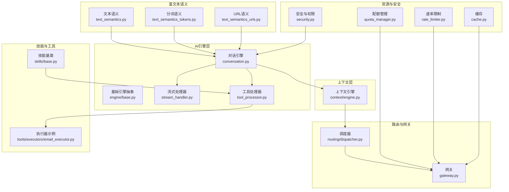
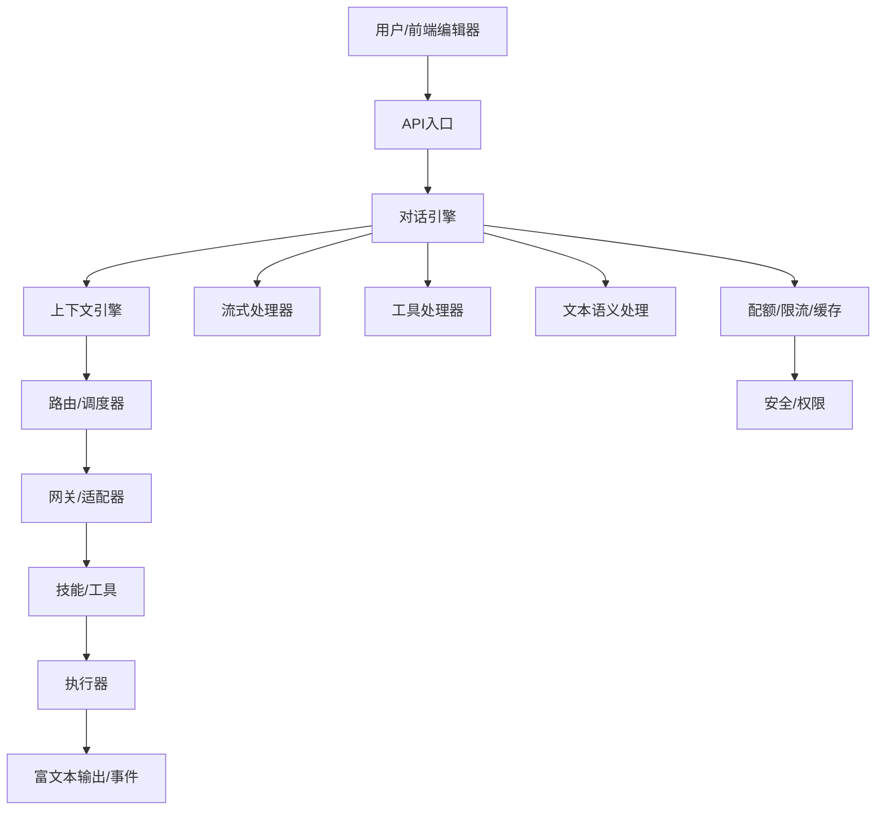
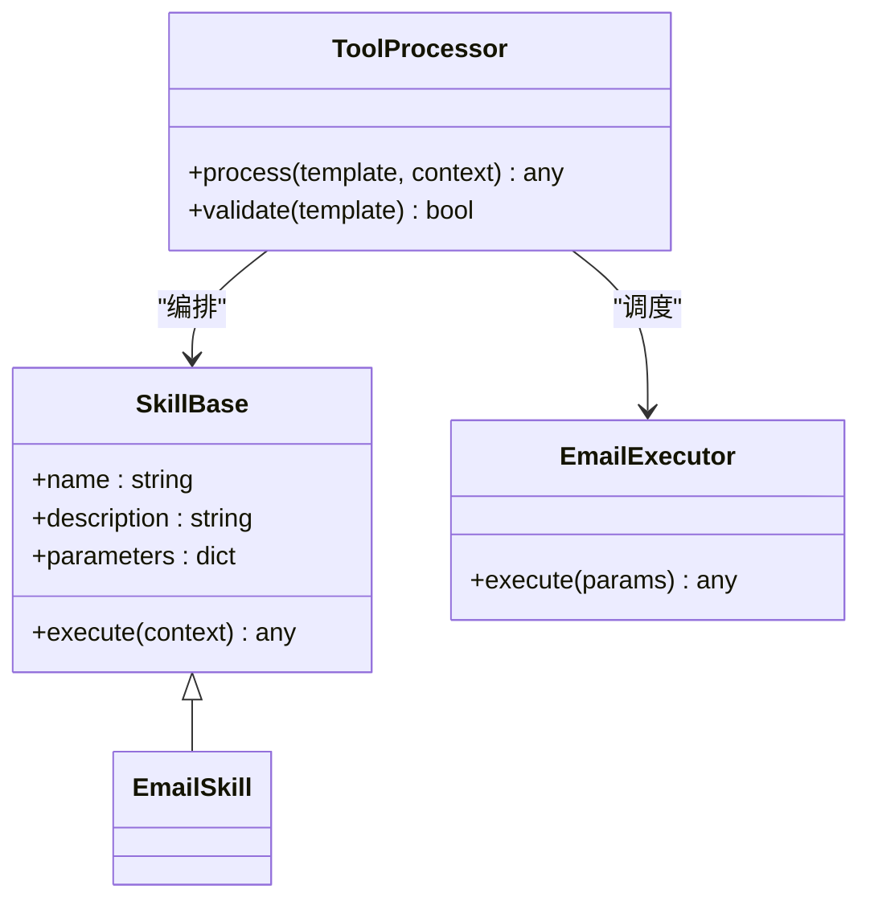
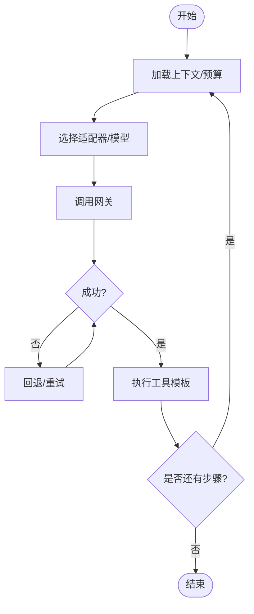
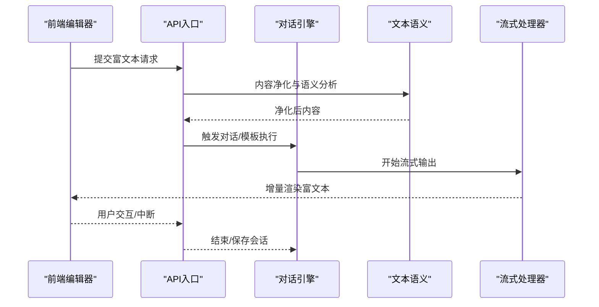
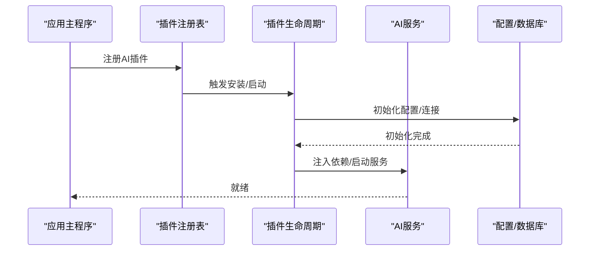
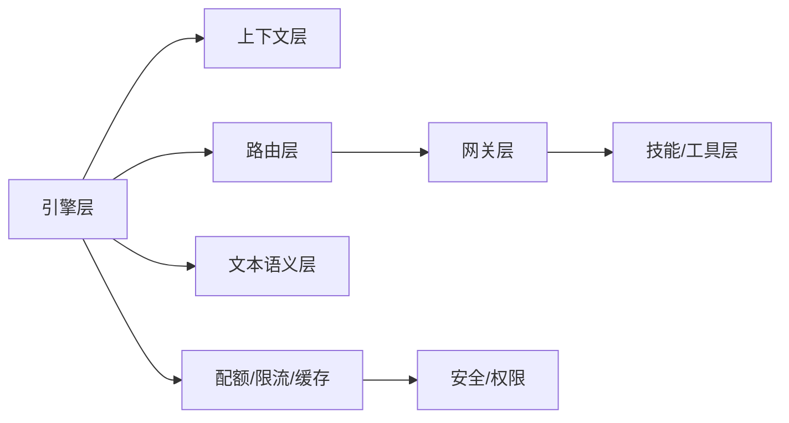

# 富文本AI模块

<cite>
**本文引用的文件**
- [backend/app/ai/types.py](file://backend/app/ai/types.py)
- [backend/app/ai/context/engine.py](file://backend/app/ai/context/engine.py)
- [backend/app/ai/engine/conversation.py](file://backend/app/ai/engine/conversation.py)
- [backend/app/ai/engine/base.py](file://backend/app/ai/engine/base.py)
- [backend/app/ai/engine/stream_handler.py](file://backend/app/ai/engine/stream_handler.py)
- [backend/app/ai/engine/tool_processor.py](file://backend/app/ai/engine/tool_processor.py)
- [backend/app/ai/skills/base.py](file://backend/app/ai/skills/base.py)
- [backend/app/ai/tools/executors/email_executor.py](file://backend/app/ai/tools/executors/email_executor.py)
- [backend/app/ai/routing/dispatcher.py](file://backend/app/ai/routing/dispatcher.py)
- [backend/app/ai/gateway.py](file://backend/app/ai/gateway.py)
- [backend/app/ai/internal_ai_service.py](file://backend/app/ai/internal_ai_service.py)
- [backend/app/ai/quota_manager.py](file://backend/app/ai/quota_manager.py)
- [backend/app/ai/rate_limiter.py](file://backend/app/ai/rate_limiter.py)
- [backend/app/ai/cache.py](file://backend/app/ai/cache.py)
- [backend/app/ai/text_semantics.py](file://backend/app/ai/text_semantics.py)
- [backend/app/ai/text_semantics_tokens.py](file://backend/app/ai/text_semantics_tokens.py)
- [backend/app/ai/text_semantics_urls.py](file://backend/app/ai/text_semantics_urls.py)
- [backend/app/ai/constants.py](file://backend/app/ai/constants.py)
- [backend/app/ai/exceptions.py](file://backend/app/ai/exceptions.py)
- [backend/app/ai/utils/config_html_sanitize.py](file://backend/app/ai/utils/config_html_sanitize.py)
- [backend/app/main.py](file://backend/app/main.py)
- [backend/app/plugins/lifecycle.py](file://backend/app/plugins/lifecycle.py)
- [backend/app/plugins/registry.py](file://backend/app/plugins/registry.py)
- [backend/app/plugins/dependencies.py](file://backend/app/plugins/dependencies.py)
- [backend/app/core/config.py](file://backend/app/core/config.py)
- [backend/app/core/database.py](file://backend/app/core/database.py)
- [backend/app/core/security.py](file://backend/app/core/security.py)
- [backend/app/middleware/access_control.py](file://backend/app/middleware/access_control.py)
- [backend/app/middleware/permission.py](file://backend/app/middleware/permission.py)
- [backend/app/rbac/registry.py](file://backend/app/rbac/registry.py)
- [backend/app/rbac/decorators.py](file://backend/app/rbac/decorators.py)
- [backend/app/models/ai/action_logs.py](file://backend/app/models/ai/action_logs.py)
- [backend/app/repositories/ai/action_logs_repo.py](file://backend/app/repositories/ai/action_logs_repo.py)
- [backend/app/services/ai/action_logs_service.py](file://backend/app/services/ai/action_logs_service.py)
- [backend/app/api/admin/ai_action_logs.py](file://backend/app/api/admin/ai_action_logs.py)
</cite>

## 目录
1. [简介](#简介)
2. [项目结构](#项目结构)
3. [核心组件](#核心组件)
4. [架构总览](#架构总览)
5. [详细组件分析](#详细组件分析)
6. [依赖关系分析](#依赖关系分析)
7. [性能考虑](#性能考虑)
8. [故障排查指南](#故障排查指南)
9. [结论](#结论)
10. [附录](#附录)

## 简介
本技术文档面向富文本AI模块，系统性阐述其“操作模板系统”的设计原理与实现机制，覆盖AI操作分配逻辑、类型定义、组合式API使用方式；并给出富文本编辑器与AI功能的集成模式、操作模板的配置与扩展机制。同时，文档提供权限控制、安全策略与性能优化方案，并说明模块初始化流程、依赖注入与生命周期管理。

## 项目结构
富文本AI模块位于后端应用的AI子系统中，采用分层与领域驱动设计相结合的方式组织代码：引擎层负责对话与意图规划、工具执行与流式输出；上下文层负责运行时状态组装与预算管理；路由层负责适配器与网关调度；技能与工具层提供可插拔的操作能力；配额与限流保障资源安全；文本语义处理支持富文本内容解析与安全净化。

图示来源
- [backend/app/ai/engine/conversation.py](file://backend/app/ai/engine/conversation.py)
- [backend/app/ai/engine/base.py](file://backend/app/ai/engine/base.py)
- [backend/app/ai/engine/stream_handler.py](file://backend/app/ai/engine/stream_handler.py)
- [backend/app/ai/engine/tool_processor.py](file://backend/app/ai/engine/tool_processor.py)
- [backend/app/ai/context/engine.py](file://backend/app/ai/context/engine.py)
- [backend/app/ai/routing/dispatcher.py](file://backend/app/ai/routing/dispatcher.py)
- [backend/app/ai/gateway.py](file://backend/app/ai/gateway.py)
- [backend/app/ai/skills/base.py](file://backend/app/ai/skills/base.py)
- [backend/app/ai/tools/executors/email_executor.py](file://backend/app/ai/tools/executors/email_executor.py)
- [backend/app/ai/quota_manager.py](file://backend/app/ai/quota_manager.py)
- [backend/app/ai/rate_limiter.py](file://backend/app/ai/rate_limiter.py)
- [backend/app/ai/cache.py](file://backend/app/ai/cache.py)
- [backend/app/ai/text_semantics.py](file://backend/app/ai/text_semantics.py)
- [backend/app/ai/text_semantics_tokens.py](file://backend/app/ai/text_semantics_tokens.py)
- [backend/app/ai/text_semantics_urls.py](file://backend/app/ai/text_semantics_urls.py)
- [backend/app/core/security.py](file://backend/app/core/security.py)

章节来源
- [backend/app/ai/engine/conversation.py](file://backend/app/ai/engine/conversation.py)
- [backend/app/ai/context/engine.py](file://backend/app/ai/context/engine.py)
- [backend/app/ai/routing/dispatcher.py](file://backend/app/ai/routing/dispatcher.py)
- [backend/app/ai/gateway.py](file://backend/app/ai/gateway.py)
- [backend/app/ai/skills/base.py](file://backend/app/ai/skills/base.py)
- [backend/app/ai/tools/executors/email_executor.py](file://backend/app/ai/tools/executors/email_executor.py)
- [backend/app/ai/quota_manager.py](file://backend/app/ai/quota_manager.py)
- [backend/app/ai/rate_limiter.py](file://backend/app/ai/rate_limiter.py)
- [backend/app/ai/cache.py](file://backend/app/ai/cache.py)
- [backend/app/ai/text_semantics.py](file://backend/app/ai/text_semantics.py)
- [backend/app/ai/text_semantics_tokens.py](file://backend/app/ai/text_semantics_tokens.py)
- [backend/app/ai/text_semantics_urls.py](file://backend/app/ai/text_semantics_urls.py)
- [backend/app/core/security.py](file://backend/app/core/security.py)

## 核心组件
- 类型与常量：统一定义AI操作、模型、策略等类型与默认值，确保跨模块一致性。
- 对话引擎：封装富文本场景下的意图识别、上下文组装、工具调用与结果投影。
- 上下文引擎：负责预算、长程记忆、裁剪与提示拼装，支撑运行期状态管理。
- 路由与网关：适配多供应商与模型族，实现负载均衡、故障转移与回退策略。
- 技能与工具：以“操作模板”形式提供可组合的能力单元，支持扩展与复用。
- 配额与限流：保障资源使用边界，防止滥用与过载。
- 文本语义：对富文本进行分词、URL识别与安全净化，降低风险面。
- 安全与权限：结合中间件与RBAC，实现细粒度访问控制与审计追踪。

章节来源
- [backend/app/ai/types.py](file://backend/app/ai/types.py)
- [backend/app/ai/constants.py](file://backend/app/ai/constants.py)
- [backend/app/ai/engine/conversation.py](file://backend/app/ai/engine/conversation.py)
- [backend/app/ai/context/engine.py](file://backend/app/ai/context/engine.py)
- [backend/app/ai/routing/dispatcher.py](file://backend/app/ai/routing/dispatcher.py)
- [backend/app/ai/gateway.py](file://backend/app/ai/gateway.py)
- [backend/app/ai/skills/base.py](file://backend/app/ai/skills/base.py)
- [backend/app/ai/quota_manager.py](file://backend/app/ai/quota_manager.py)
- [backend/app/ai/rate_limiter.py](file://backend/app/ai/rate_limiter.py)
- [backend/app/ai/text_semantics.py](file://backend/app/ai/text_semantics.py)
- [backend/app/ai/text_semantics_tokens.py](file://backend/app/ai/text_semantics_tokens.py)
- [backend/app/ai/text_semantics_urls.py](file://backend/app/ai/text_semantics_urls.py)
- [backend/app/core/security.py](file://backend/app/core/security.py)

## 架构总览
富文本AI模块通过“引擎-上下文-路由-网关-技能/工具-资源/安全”的分层架构，实现从用户输入到富文本输出的完整闭环。引擎层负责对话与意图规划，上下文层负责运行期状态与预算，路由层负责适配器选择与网关调度，技能/工具层提供可插拔的操作模板，配额/限流/缓存保障资源与性能，文本语义处理确保内容安全与质量。

图示来源
- [backend/app/ai/engine/conversation.py](file://backend/app/ai/engine/conversation.py)
- [backend/app/ai/context/engine.py](file://backend/app/ai/context/engine.py)
- [backend/app/ai/engine/stream_handler.py](file://backend/app/ai/engine/stream_handler.py)
- [backend/app/ai/engine/tool_processor.py](file://backend/app/ai/engine/tool_processor.py)
- [backend/app/ai/routing/dispatcher.py](file://backend/app/ai/routing/dispatcher.py)
- [backend/app/ai/gateway.py](file://backend/app/ai/gateway.py)
- [backend/app/ai/skills/base.py](file://backend/app/ai/skills/base.py)
- [backend/app/ai/tools/executors/email_executor.py](file://backend/app/ai/tools/executors/email_executor.py)
- [backend/app/ai/quota_manager.py](file://backend/app/ai/quota_manager.py)
- [backend/app/ai/rate_limiter.py](file://backend/app/ai/rate_limiter.py)
- [backend/app/ai/cache.py](file://backend/app/ai/cache.py)
- [backend/app/ai/text_semantics.py](file://backend/app/ai/text_semantics.py)
- [backend/app/core/security.py](file://backend/app/core/security.py)

## 详细组件分析

### 操作模板系统（技能与工具）
- 设计原理：以“技能”为能力单元，“工具”为具体动作，二者共同构成“操作模板”。模板通过统一接口注册、编排与执行，支持参数化、条件分支与回退策略。
- 实现机制：技能基类提供模板契约，工具处理器负责解析与调度工具，执行器承载实际业务逻辑（如邮件发送）。
- 组合式API：通过上下文引擎与路由层，将多个模板按顺序或并行组合，形成复杂工作流。

图示来源
- [backend/app/ai/skills/base.py](file://backend/app/ai/skills/base.py)
- [backend/app/ai/engine/tool_processor.py](file://backend/app/ai/engine/tool_processor.py)
- [backend/app/ai/tools/executors/email_executor.py](file://backend/app/ai/tools/executors/email_executor.py)

章节来源
- [backend/app/ai/skills/base.py](file://backend/app/ai/skills/base.py)
- [backend/app/ai/engine/tool_processor.py](file://backend/app/ai/engine/tool_processor.py)
- [backend/app/ai/tools/executors/email_executor.py](file://backend/app/ai/tools/executors/email_executor.py)

### AI操作分配逻辑与类型定义
- 类型定义：统一定义操作类型、模型族、策略枚举、预算单位等，保证跨模块一致的数据契约。
- 分配逻辑：路由层根据上下文与策略选择适配器与模型，网关层执行调用并回传结果；失败时触发回退与重试。
- 组合式API：通过上下文组装与预算管理，将多个操作模板串联，形成复合任务。

图示来源
- [backend/app/ai/context/engine.py](file://backend/app/ai/context/engine.py)
- [backend/app/ai/routing/dispatcher.py](file://backend/app/ai/routing/dispatcher.py)
- [backend/app/ai/gateway.py](file://backend/app/ai/gateway.py)
- [backend/app/ai/engine/tool_processor.py](file://backend/app/ai/engine/tool_processor.py)

章节来源
- [backend/app/ai/types.py](file://backend/app/ai/types.py)
- [backend/app/ai/constants.py](file://backend/app/ai/constants.py)
- [backend/app/ai/context/engine.py](file://backend/app/ai/context/engine.py)
- [backend/app/ai/routing/dispatcher.py](file://backend/app/ai/routing/dispatcher.py)
- [backend/app/ai/gateway.py](file://backend/app/ai/gateway.py)
- [backend/app/ai/engine/tool_processor.py](file://backend/app/ai/engine/tool_processor.py)

### 富文本编辑器集成模式
- 输入预处理：利用文本语义模块对富文本进行分词、URL识别与安全净化，过滤潜在风险内容。
- 输出渲染：通过流式处理器将AI生成内容逐步写入编辑器，支持增量渲染与中断恢复。
- 会话持久化：对话引擎记录上下文与历史，确保富文本编辑过程的连贯性与可追溯性。

图示来源
- [backend/app/ai/engine/conversation.py](file://backend/app/ai/engine/conversation.py)
- [backend/app/ai/engine/stream_handler.py](file://backend/app/ai/engine/stream_handler.py)
- [backend/app/ai/text_semantics.py](file://backend/app/ai/text_semantics.py)
- [backend/app/ai/text_semantics_tokens.py](file://backend/app/ai/text_semantics_tokens.py)
- [backend/app/ai/text_semantics_urls.py](file://backend/app/ai/text_semantics_urls.py)

章节来源
- [backend/app/ai/engine/conversation.py](file://backend/app/ai/engine/conversation.py)
- [backend/app/ai/engine/stream_handler.py](file://backend/app/ai/engine/stream_handler.py)
- [backend/app/ai/text_semantics.py](file://backend/app/ai/text_semantics.py)
- [backend/app/ai/text_semantics_tokens.py](file://backend/app/ai/text_semantics_tokens.py)
- [backend/app/ai/text_semantics_urls.py](file://backend/app/ai/text_semantics_urls.py)

### 模块初始化、依赖注入与生命周期
- 初始化流程：应用启动时，注册AI服务、加载路由与网关配置、建立数据库与缓存连接。
- 依赖注入：通过插件系统与依赖注册表，将AI引擎、上下文引擎、配额/限流等组件注入到运行时。
- 生命周期管理：在插件生命周期钩子中完成AI模块的安装、启动、维护与卸载。

图示来源
- [backend/app/main.py](file://backend/app/main.py)
- [backend/app/plugins/registry.py](file://backend/app/plugins/registry.py)
- [backend/app/plugins/lifecycle.py](file://backend/app/plugins/lifecycle.py)
- [backend/app/plugins/dependencies.py](file://backend/app/plugins/dependencies.py)
- [backend/app/core/config.py](file://backend/app/core/config.py)
- [backend/app/core/database.py](file://backend/app/core/database.py)

章节来源
- [backend/app/main.py](file://backend/app/main.py)
- [backend/app/plugins/registry.py](file://backend/app/plugins/registry.py)
- [backend/app/plugins/lifecycle.py](file://backend/app/plugins/lifecycle.py)
- [backend/app/plugins/dependencies.py](file://backend/app/plugins/dependencies.py)
- [backend/app/core/config.py](file://backend/app/core/config.py)
- [backend/app/core/database.py](file://backend/app/core/database.py)

## 依赖关系分析
- 强内聚弱耦合：引擎层与上下文层职责清晰，通过明确接口交互；路由与网关解耦于具体适配器，便于扩展。
- 外部依赖：数据库、缓存、第三方AI服务；内部依赖：插件系统、RBAC、中间件。
- 循环依赖规避：通过接口抽象与依赖注入避免直接循环引用。

图示来源
- [backend/app/ai/engine/base.py](file://backend/app/ai/engine/base.py)
- [backend/app/ai/context/engine.py](file://backend/app/ai/context/engine.py)
- [backend/app/ai/routing/dispatcher.py](file://backend/app/ai/routing/dispatcher.py)
- [backend/app/ai/gateway.py](file://backend/app/ai/gateway.py)
- [backend/app/ai/skills/base.py](file://backend/app/ai/skills/base.py)
- [backend/app/ai/quota_manager.py](file://backend/app/ai/quota_manager.py)
- [backend/app/ai/rate_limiter.py](file://backend/app/ai/rate_limiter.py)
- [backend/app/ai/cache.py](file://backend/app/ai/cache.py)
- [backend/app/ai/text_semantics.py](file://backend/app/ai/text_semantics.py)
- [backend/app/core/security.py](file://backend/app/core/security.py)

章节来源
- [backend/app/ai/engine/base.py](file://backend/app/ai/engine/base.py)
- [backend/app/ai/context/engine.py](file://backend/app/ai/context/engine.py)
- [backend/app/ai/routing/dispatcher.py](file://backend/app/ai/routing/dispatcher.py)
- [backend/app/ai/gateway.py](file://backend/app/ai/gateway.py)
- [backend/app/ai/skills/base.py](file://backend/app/ai/skills/base.py)
- [backend/app/ai/quota_manager.py](file://backend/app/ai/quota_manager.py)
- [backend/app/ai/rate_limiter.py](file://backend/app/ai/rate_limiter.py)
- [backend/app/ai/cache.py](file://backend/app/ai/cache.py)
- [backend/app/ai/text_semantics.py](file://backend/app/ai/text_semantics.py)
- [backend/app/core/security.py](file://backend/app/core/security.py)

## 性能考虑
- 流式输出：通过流式处理器逐步返回结果，减少首字节延迟，提升富文本编辑器的交互体验。
- 缓存策略：对热点提示与中间结果进行缓存，降低重复计算与外部调用开销。
- 配额与限流：基于租户/用户维度设置并发与QPS上限，避免资源争用与雪崩效应。
- 文本语义优化：在进入引擎前进行内容净化与分词，减少无效或高风险内容带来的额外处理成本。
- 批处理与并行：工具执行支持批量与并行，结合预算管理避免超支。

## 故障排查指南
- 错误分类与诊断：引擎层提供失败分类与诊断辅助，定位LLM调用、工具执行与合同违约等问题。
- 回退与重试：网关层具备回退与重试策略，结合重试服务与故障转移，提升可用性。
- 审计与追踪：通过动作日志模型、仓库与服务，记录操作轨迹，便于问题复盘与合规审计。
- 安全与权限：结合中间件与RBAC，检查访问控制与权限校验，防止未授权调用。

章节来源
- [backend/app/ai/engine/failure_classifier.py](file://backend/app/ai/engine/failure_classifier.py)
- [backend/app/ai/engine/contract_diagnostics_helpers.py](file://backend/app/ai/engine/contract_diagnostics_helpers.py)
- [backend/app/ai/retry_service.py](file://backend/app/ai/retry_service.py)
- [backend/app/ai/gateway_support/failover_orchestrator.py](file://backend/app/ai/gateway_support/failover_orchestrator.py)
- [backend/app/models/ai/action_logs.py](file://backend/app/models/ai/action_logs.py)
- [backend/app/repositories/ai/action_logs_repo.py](file://backend/app/repositories/ai/action_logs_repo.py)
- [backend/app/services/ai/action_logs_service.py](file://backend/app/services/ai/action_logs_service.py)
- [backend/app/middleware/access_control.py](file://backend/app/middleware/access_control.py)
- [backend/app/middleware/permission.py](file://backend/app/middleware/permission.py)
- [backend/app/rbac/registry.py](file://backend/app/rbac/registry.py)
- [backend/app/rbac/decorators.py](file://backend/app/rbac/decorators.py)

## 结论
富文本AI模块通过“操作模板系统”实现了能力的可插拔与可组合，配合上下文引擎、路由与网关、配额与限流以及文本语义处理，构建了从输入到富文本输出的完整闭环。该架构既满足了富文本编辑场景的实时性与安全性需求，又为后续扩展与演进提供了清晰的接口与治理框架。

## 附录
- 权限控制与安全策略：结合中间件与RBAC，实现基于角色的访问控制与审计；对富文本内容进行安全净化，降低XSS与恶意内容风险。
- 性能优化建议：优先采用流式输出、缓存热点数据、合理设置配额与限流阈值；在工具执行层面启用批处理与并行。
- 初始化与生命周期：遵循插件生命周期钩子，确保配置加载、依赖注入与服务启动的顺序正确；在维护模式下平滑降级与恢复。