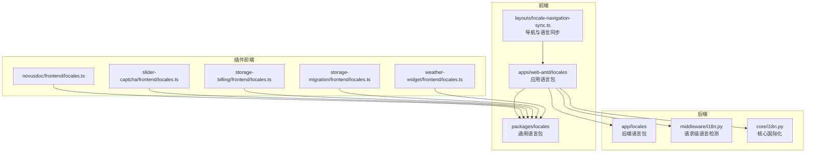
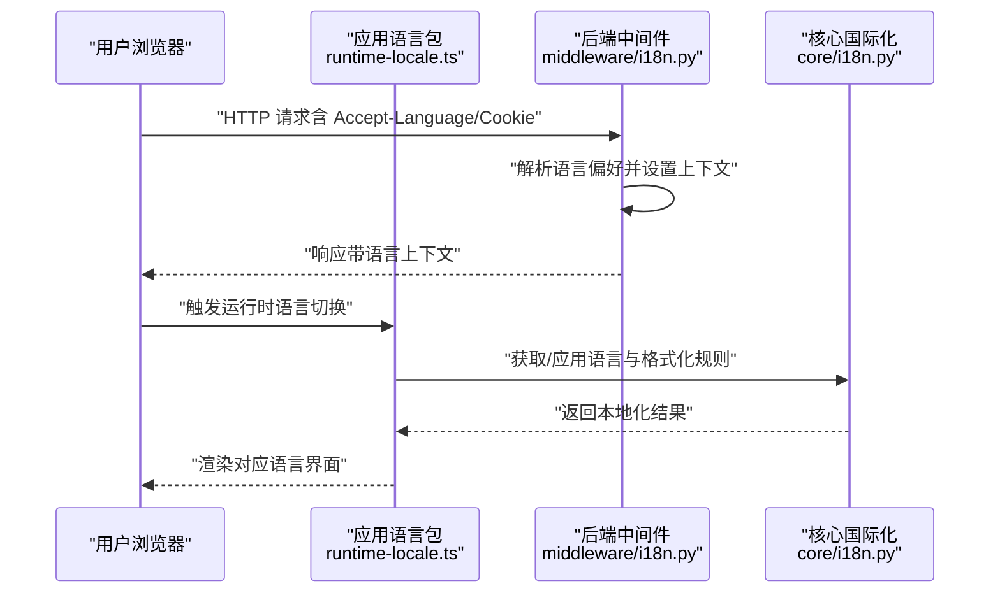
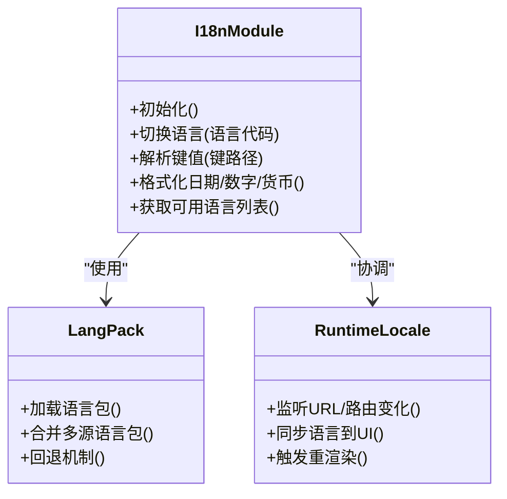
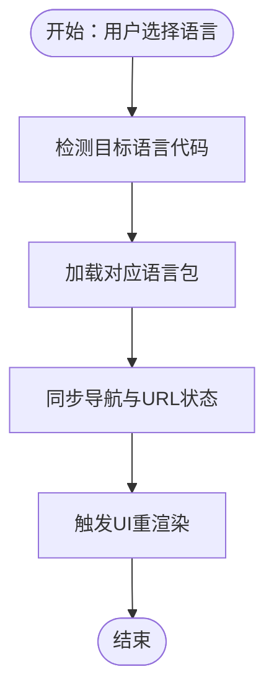
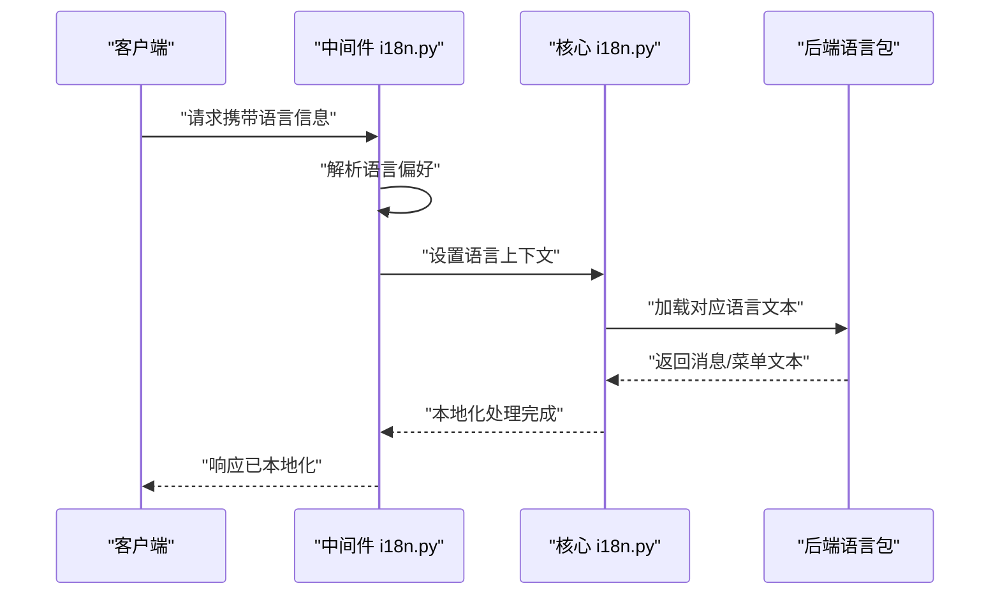
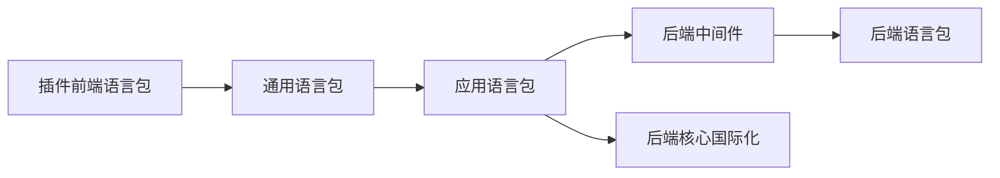

# 国际化系统

<cite>
**本文引用的文件**
- [frontend/packages/locales/src/i18n.ts](file://frontend/packages/locales/src/i18n.ts)
- [frontend/packages/locales/src/index.ts](file://frontend/packages/locales/src/index.ts)
- [frontend/packages/locales/src/typing.ts](file://frontend/packages/locales/src/typing.ts)
- [frontend/apps/web-antd/src/locales/index.ts](file://frontend/apps/web-antd/src/locales/index.ts)
- [frontend/apps/web-antd/src/locales/runtime-locale.ts](file://frontend/apps/web-antd/src/locales/runtime-locale.ts)
- [frontend/apps/web-antd/src/locales/README.md](file://frontend/apps/web-antd/src/locales/README.md)
- [frontend/apps/web-antd/src/layouts/locale-navigation-sync.ts](file://frontend/apps/web-antd/src/layouts/locale-navigation-sync.ts)
- [backend/app/locales/__init__.py](file://backend/app/locales/__init__.py)
- [backend/app/locales/en/messages.json](file://backend/app/locales/en/messages.json)
- [backend/app/locales/zh_CN/messages.json](file://backend/app/locales/zh_CN/messages.json)
- [backend/app/middleware/i18n.py](file://backend/app/middleware/i18n.py)
- [backend/app/core/i18n.py](file://backend/app/core/i18n.py)
- [backend/plugins/novusdoc/frontend/src/locales.ts](file://backend/plugins/novusdoc/frontend/src/locales.ts)
- [backend/plugins/slider-captcha/frontend/src/locales.ts](file://backend/plugins/slider-captcha/frontend/src/locales.ts)
- [backend/plugins/storage-billing/frontend/src/locales.ts](file://backend/plugins/storage-billing/frontend/src/locales.ts)
- [backend/plugins/storage-migration/frontend/src/locales.ts](file://backend/plugins/storage-migration/frontend/src/locales.ts)
- [backend/plugins/weather-widget/frontend/src/locales.ts](file://backend/plugins/weather-widget/frontend/src/locales.ts)
</cite>

## 目录
1. [简介](#简介)
2. [项目结构](#项目结构)
3. [核心组件](#核心组件)
4. [架构总览](#架构总览)
5. [详细组件分析](#详细组件分析)
6. [依赖关系分析](#依赖关系分析)
7. [性能考虑](#性能考虑)
8. [故障排查指南](#故障排查指南)
9. [结论](#结论)
10. [附录](#附录)

## 简介
本文件面向前端国际化系统，系统性阐述多语言支持、语言包管理、动态语言切换、语言检测、本地化格式化与RTL支持、配置与翻译键值管理、文本提取流程、语言回退策略、运行时切换、最佳实践、翻译维护与性能优化、以及本地化测试实现。该系统由前端语言包与后端语言包两部分构成：前端通过独立的语言包模块提供UI文案与页面内容；后端通过中间件与核心模块实现请求级语言检测与回退，并在插件前端侧提供各自的语言资源。

## 项目结构
国际化系统主要分布在以下位置：
- 前端通用语言包：frontend/packages/locales/src
- 前端应用语言包：frontend/apps/web-antd/src/locales
- 后端语言包：backend/app/locales
- 后端国际化中间件与核心模块：backend/app/middleware/i18n.py、backend/app/core/i18n.py
- 插件前端语言包：backend/plugins/*/frontend/src/locales.ts

图表来源
- [frontend/packages/locales/src/index.ts](file://frontend/packages/locales/src/index.ts)
- [frontend/apps/web-antd/src/locales/index.ts](file://frontend/apps/web-antd/src/locales/index.ts)
- [backend/app/locales/__init__.py](file://backend/app/locales/__init__.py)
- [backend/app/middleware/i18n.py](file://backend/app/middleware/i18n.py)
- [backend/app/core/i18n.py](file://backend/app/core/i18n.py)
- [frontend/apps/web-antd/src/layouts/locale-navigation-sync.ts](file://frontend/apps/web-antd/src/layouts/locale-navigation-sync.ts)
- [backend/plugins/novusdoc/frontend/src/locales.ts](file://backend/plugins/novusdoc/frontend/src/locales.ts)
- [backend/plugins/slider-captcha/frontend/src/locales.ts](file://backend/plugins/slider-captcha/frontend/src/locales.ts)
- [backend/plugins/storage-billing/frontend/src/locales.ts](file://backend/plugins/storage-billing/frontend/src/locales.ts)
- [backend/plugins/storage-migration/frontend/src/locales.ts](file://backend/plugins/storage-migration/frontend/src/locales.ts)
- [backend/plugins/weather-widget/frontend/src/locales.ts](file://backend/plugins/weather-widget/frontend/src/locales.ts)

章节来源
- [frontend/packages/locales/src/index.ts](file://frontend/packages/locales/src/index.ts)
- [frontend/apps/web-antd/src/locales/index.ts](file://frontend/apps/web-antd/src/locales/index.ts)
- [backend/app/locales/__init__.py](file://backend/app/locales/__init__.py)
- [backend/app/middleware/i18n.py](file://backend/app/middleware/i18n.py)
- [backend/app/core/i18n.py](file://backend/app/core/i18n.py)
- [frontend/apps/web-antd/src/layouts/locale-navigation-sync.ts](file://frontend/apps/web-antd/src/layouts/locale-navigation-sync.ts)
- [backend/plugins/novusdoc/frontend/src/locales.ts](file://backend/plugins/novusdoc/frontend/src/locales.ts)
- [backend/plugins/slider-captcha/frontend/src/locales.ts](file://backend/plugins/slider-captcha/frontend/src/locales.ts)
- [backend/plugins/storage-billing/frontend/src/locales.ts](file://backend/plugins/storage-billing/frontend/src/locales.ts)
- [backend/plugins/storage-migration/frontend/src/locales.ts](file://backend/plugins/storage-migration/frontend/src/locales.ts)
- [backend/plugins/weather-widget/frontend/src/locales.ts](file://backend/plugins/weather-widget/frontend/src/locales.ts)

## 核心组件
- 前端通用语言包模块：提供基础语言能力与类型定义，集中管理UI与通用文案。
- 应用语言包：按页面/功能域拆分，覆盖admin、shared、tenant、user等命名空间。
- 后端语言包：提供后端消息与菜单等文本，支持en与zh_CN。
- 国际化中间件：从请求头或Cookie中解析语言偏好，设置当前语言环境。
- 核心国际化模块：提供语言回退、区域格式化、日期/数字/货币等本地化工具。
- 插件前端语言包：各插件在前端侧注册自身语言资源，与通用语言包协同工作。
- 导航与语言同步：确保UI语言与URL/路由状态一致，支持运行时切换。

章节来源
- [frontend/packages/locales/src/i18n.ts](file://frontend/packages/locales/src/i18n.ts)
- [frontend/packages/locales/src/index.ts](file://frontend/packages/locales/src/index.ts)
- [frontend/packages/locales/src/typing.ts](file://frontend/packages/locales/src/typing.ts)
- [frontend/apps/web-antd/src/locales/index.ts](file://frontend/apps/web-antd/src/locales/index.ts)
- [frontend/apps/web-antd/src/locales/runtime-locale.ts](file://frontend/apps/web-antd/src/locales/runtime-locale.ts)
- [backend/app/locales/en/messages.json](file://backend/app/locales/en/messages.json)
- [backend/app/locales/zh_CN/messages.json](file://backend/app/locales/zh_CN/messages.json)
- [backend/app/middleware/i18n.py](file://backend/app/middleware/i18n.py)
- [backend/app/core/i18n.py](file://backend/app/core/i18n.py)
- [frontend/apps/web-antd/src/layouts/locale-navigation-sync.ts](file://frontend/apps/web-antd/src/layouts/locale-navigation-sync.ts)

## 架构总览
前端国际化采用“通用语言包 + 应用语言包”的双层结构，应用语言包按领域拆分，便于维护与增量扩展。后端通过中间件与核心模块实现请求级语言检测与回退，同时插件前端可注册自身语言资源，形成统一的多语言生态。

图表来源
- [frontend/apps/web-antd/src/locales/runtime-locale.ts](file://frontend/apps/web-antd/src/locales/runtime-locale.ts)
- [backend/app/middleware/i18n.py](file://backend/app/middleware/i18n.py)
- [backend/app/core/i18n.py](file://backend/app/core/i18n.py)

## 详细组件分析

### 前端通用语言包模块
- 职责：提供国际化初始化、语言切换、键值解析、类型约束与本地化格式化工具。
- 关键点：
  - 语言包加载与合并策略
  - 键值命名规范与层级组织
  - 类型安全与自动补全支持
  - 运行时切换与缓存策略

图表来源
- [frontend/packages/locales/src/i18n.ts](file://frontend/packages/locales/src/i18n.ts)
- [frontend/packages/locales/src/index.ts](file://frontend/packages/locales/src/index.ts)
- [frontend/packages/locales/src/typing.ts](file://frontend/packages/locales/src/typing.ts)
- [frontend/apps/web-antd/src/locales/runtime-locale.ts](file://frontend/apps/web-antd/src/locales/runtime-locale.ts)

章节来源
- [frontend/packages/locales/src/i18n.ts](file://frontend/packages/locales/src/i18n.ts)
- [frontend/packages/locales/src/index.ts](file://frontend/packages/locales/src/index.ts)
- [frontend/packages/locales/src/typing.ts](file://frontend/packages/locales/src/typing.ts)

### 应用语言包与导航同步
- 职责：按功能域组织语言资源，确保UI与URL语言一致，支持运行时切换。
- 关键点：
  - 语言包目录结构与命名空间划分
  - 导航栏与语言选择联动
  - 切换后的路由与面包屑一致性

图表来源
- [frontend/apps/web-antd/src/locales/index.ts](file://frontend/apps/web-antd/src/locales/index.ts)
- [frontend/apps/web-antd/src/locales/runtime-locale.ts](file://frontend/apps/web-antd/src/locales/runtime-locale.ts)
- [frontend/apps/web-antd/src/layouts/locale-navigation-sync.ts](file://frontend/apps/web-antd/src/layouts/locale-navigation-sync.ts)

章节来源
- [frontend/apps/web-antd/src/locales/index.ts](file://frontend/apps/web-antd/src/locales/index.ts)
- [frontend/apps/web-antd/src/locales/runtime-locale.ts](file://frontend/apps/web-antd/src/locales/runtime-locale.ts)
- [frontend/apps/web-antd/src/layouts/locale-navigation-sync.ts](file://frontend/apps/web-antd/src/layouts/locale-navigation-sync.ts)

### 后端语言包与中间件
- 职责：从请求中提取语言偏好，设置会话/上下文语言，提供后端消息与菜单文本。
- 关键点：
  - 语言检测顺序（Accept-Language、Cookie、Header）
  - 语言回退策略（如 zh_CN -> zh -> en）
  - 与前端语言包的边界与协作

图表来源
- [backend/app/middleware/i18n.py](file://backend/app/middleware/i18n.py)
- [backend/app/core/i18n.py](file://backend/app/core/i18n.py)
- [backend/app/locales/en/messages.json](file://backend/app/locales/en/messages.json)
- [backend/app/locales/zh_CN/messages.json](file://backend/app/locales/zh_CN/messages.json)

章节来源
- [backend/app/middleware/i18n.py](file://backend/app/middleware/i18n.py)
- [backend/app/core/i18n.py](file://backend/app/core/i18n.py)
- [backend/app/locales/__init__.py](file://backend/app/locales/__init__.py)
- [backend/app/locales/en/messages.json](file://backend/app/locales/en/messages.json)
- [backend/app/locales/zh_CN/messages.json](file://backend/app/locales/zh_CN/messages.json)

### 插件前端语言包
- 职责：插件在前端侧注册自身语言资源，与通用语言包协同，保证插件UI文案的本地化。
- 关键点：
  - 语言资源注册与合并
  - 与主应用语言包的优先级与冲突处理
  - 插件间语言资源隔离与共享

章节来源
- [backend/plugins/novusdoc/frontend/src/locales.ts](file://backend/plugins/novusdoc/frontend/src/locales.ts)
- [backend/plugins/slider-captcha/frontend/src/locales.ts](file://backend/plugins/slider-captcha/frontend/src/locales.ts)
- [backend/plugins/storage-billing/frontend/src/locales.ts](file://backend/plugins/storage-billing/frontend/src/locales.ts)
- [backend/plugins/storage-migration/frontend/src/locales.ts](file://backend/plugins/storage-migration/frontend/src/locales.ts)
- [backend/plugins/weather-widget/frontend/src/locales.ts](file://backend/plugins/weather-widget/frontend/src/locales.ts)

## 依赖关系分析
- 前端应用语言包依赖通用语言包模块，形成“通用能力 + 应用定制”的分层。
- 应用语言包与后端语言包解耦，前端负责UI与页面文案，后端负责服务端消息与菜单。
- 中间件与核心模块为后端提供语言检测与回退，确保API响应的本地化一致性。
- 插件前端语言包与通用语言包并行存在，通过注册机制实现扩展。

图表来源
- [frontend/packages/locales/src/index.ts](file://frontend/packages/locales/src/index.ts)
- [frontend/apps/web-antd/src/locales/index.ts](file://frontend/apps/web-antd/src/locales/index.ts)
- [backend/app/middleware/i18n.py](file://backend/app/middleware/i18n.py)
- [backend/app/core/i18n.py](file://backend/app/core/i18n.py)
- [backend/app/locales/__init__.py](file://backend/app/locales/__init__.py)
- [backend/plugins/novusdoc/frontend/src/locales.ts](file://backend/plugins/novusdoc/frontend/src/locales.ts)

章节来源
- [frontend/packages/locales/src/index.ts](file://frontend/packages/locales/src/index.ts)
- [frontend/apps/web-antd/src/locales/index.ts](file://frontend/apps/web-antd/src/locales/index.ts)
- [backend/app/middleware/i18n.py](file://backend/app/middleware/i18n.py)
- [backend/app/core/i18n.py](file://backend/app/core/i18n.py)
- [backend/app/locales/__init__.py](file://backend/app/locales/__init__.py)
- [backend/plugins/novusdoc/frontend/src/locales.ts](file://backend/plugins/novusdoc/frontend/src/locales.ts)

## 性能考虑
- 语言包按需加载与懒加载，避免一次性加载全部语言包导致首屏延迟。
- 运行时切换语言时，仅更新当前语言包并触发必要组件重渲染，减少全局刷新。
- 缓存已加载语言包与键值解析结果，降低重复查询成本。
- 合理拆分语言包目录，减少单文件体积，提升打包与传输效率。
- 对于后端响应，尽量复用已解析的本地化文本，避免重复格式化。

## 故障排查指南
- 语言切换无效：检查运行时语言模块是否正确监听URL/路由变化，确认语言包已加载且键值存在。
- 文案缺失或回退异常：核对语言回退链路与键值拼写，确保目标语言包包含对应键值。
- 导航与语言不同步：检查导航同步逻辑，确保切换后URL与UI状态一致。
- 后端响应非预期语言：检查中间件的语言检测顺序与Cookie/Header解析逻辑。
- 插件语言资源未生效：确认插件前端语言包注册流程与合并策略。

章节来源
- [frontend/apps/web-antd/src/locales/runtime-locale.ts](file://frontend/apps/web-antd/src/locales/runtime-locale.ts)
- [frontend/apps/web-antd/src/layouts/locale-navigation-sync.ts](file://frontend/apps/web-antd/src/layouts/locale-navigation-sync.ts)
- [backend/app/middleware/i18n.py](file://backend/app/middleware/i18n.py)

## 结论
该国际化系统通过“前端通用语言包 + 应用语言包 + 后端语言包 + 中间件与核心模块”的分层设计，实现了从前端UI到后端服务的全链路本地化。系统支持运行时语言切换、语言回退、导航同步与插件扩展，具备良好的可维护性与扩展性。建议在实际落地中遵循键值命名规范、完善测试与监控，持续优化加载与渲染性能。

## 附录
- 语言检测与回退策略示例路径：[backend/app/middleware/i18n.py](file://backend/app/middleware/i18n.py)
- 前端运行时语言切换示例路径：[frontend/apps/web-antd/src/locales/runtime-locale.ts](file://frontend/apps/web-antd/src/locales/runtime-locale.ts)
- 应用语言包入口与组织方式：[frontend/apps/web-antd/src/locales/index.ts](file://frontend/apps/web-antd/src/locales/index.ts)
- 通用语言包模块与类型定义：[frontend/packages/locales/src/index.ts](file://frontend/packages/locales/src/index.ts), [frontend/packages/locales/src/typing.ts](file://frontend/packages/locales/src/typing.ts)
- 后端语言包样例：[backend/app/locales/en/messages.json](file://backend/app/locales/en/messages.json), [backend/app/locales/zh_CN/messages.json](file://backend/app/locales/zh_CN/messages.json)
- 插件前端语言包注册示例：[backend/plugins/novusdoc/frontend/src/locales.ts](file://backend/plugins/novusdoc/frontend/src/locales.ts)