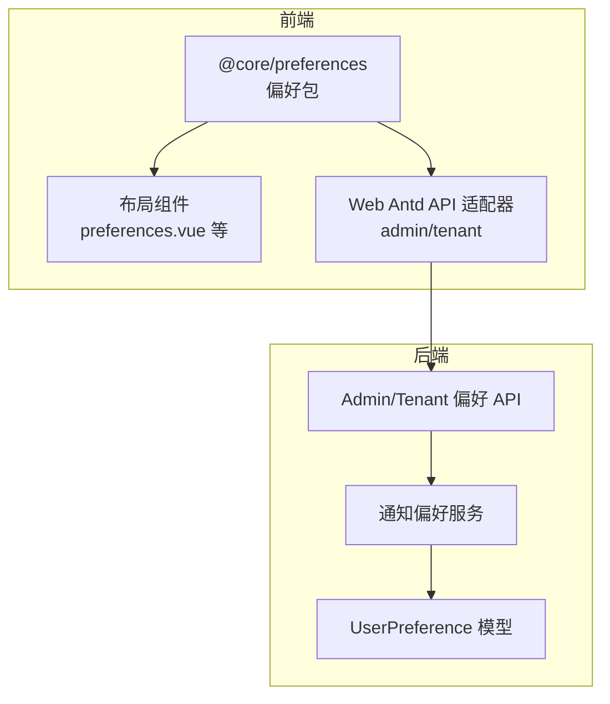
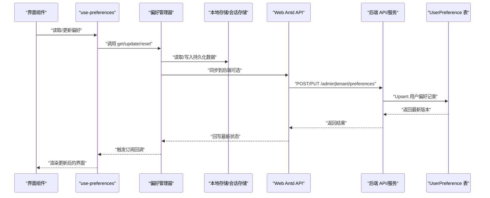
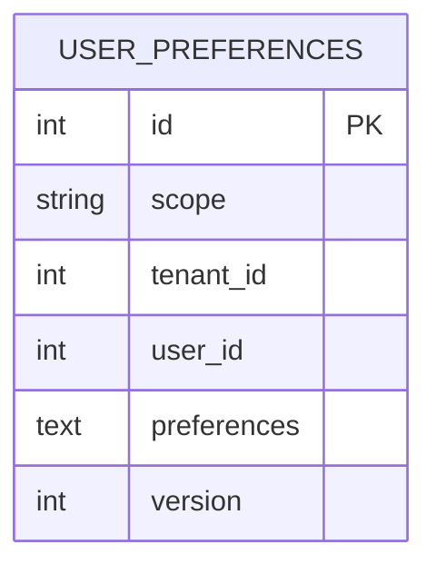
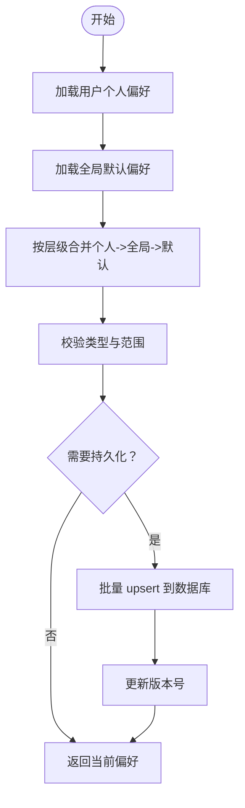
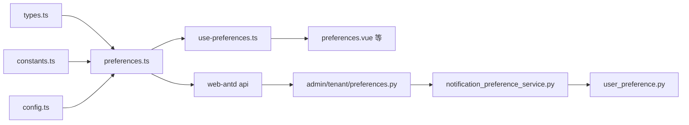

# 偏好设置包 (preferences)

<cite>
**本文引用的文件**
- [backend/app/models/common/user_preference.py](file://backend/app/models/common/user_preference.py)
- [backend/app/services/common/notification_preference_service.py](file://backend/app/services/common/notification_preference_service.py)
- [backend/migrations/versions/20260314_0927_add_user_preferences_table.py](file://backend/migrations/versions/20260314_0927_add_user_preferences_table.py)
- [frontend/packages/@core/preferences/src/preferences.ts](file://frontend/packages/@core/preferences/src/preferences.ts)
- [frontend/packages/@core/preferences/src/use-preferences.ts](file://frontend/packages/@core/preferences/src/use-preferences.ts)
- [frontend/packages/@core/preferences/src/types.ts](file://frontend/packages/@core/preferences/src/types.ts)
- [frontend/packages/@core/preferences/src/config.ts](file://frontend/packages/@core/preferences/src/config.ts)
- [frontend/packages/@core/preferences/src/constants.ts](file://frontend/packages/@core/preferences/src/constants.ts)
- [frontend/packages/@core/preferences/src/update-css-variables.ts](file://frontend/packages/@core/preferences/src/update-css-variables.ts)
- [frontend/packages/@core/preferences/src/index.ts](file://frontend/packages/@core/preferences/src/index.ts)
- [frontend/apps/web-antd/src/preferences.ts](file://frontend/apps/web-antd/src/preferences.ts)
- [frontend/packages/effects/layouts/src/widgets/preferences/preferences.vue](file://frontend/packages/effects/layouts/src/widgets/preferences/preferences.vue)
- [frontend/packages/effects/layouts/src/widgets/preferences/preferences-drawer.vue](file://frontend/packages/effects/layouts/src/widgets/preferences/preferences-drawer.vue)
- [frontend/packages/effects/layouts/src/widgets/preferences/preferences-button.vue](file://frontend/packages/effects/layouts/src/widgets/preferences/preferences-button.vue)
- [frontend/packages/locales/src/langs/zh-CN/preferences.json](file://frontend/packages/locales/src/langs/zh-CN/preferences.json)
- [frontend/packages/locales/src/langs/en-US/preferences.json](file://frontend/packages/locales/src/langs/en-US/preferences.json)
- [backend/app/api/admin/preferences.py](file://backend/app/api/admin/preferences.py)
- [backend/app/api/tenant/preferences.py](file://backend/app/api/tenant/preferences.py)
- [frontend/apps/web-antd/src/api/admin/preferences.ts](file://frontend/apps/web-antd/src/api/admin/preferences.ts)
- [frontend/apps/web-antd/src/api/tenant/preferences.ts](file://frontend/apps/web-antd/src/api/tenant/preferences.ts)
- [frontend/packages/@core/preferences/__tests__/preferences.test.ts](file://frontend/packages/@core/preferences/__tests__/preferences.test.ts)
</cite>

## 目录
1. [简介](#简介)
2. [项目结构](#项目结构)
3. [核心组件](#核心组件)
4. [架构总览](#架构总览)
5. [详细组件分析](#详细组件分析)
6. [依赖关系分析](#依赖关系分析)
7. [性能考虑](#性能考虑)
8. [故障排查指南](#故障排查指南)
9. [结论](#结论)
10. [附录](#附录)

## 简介
本技术文档围绕偏好设置包（preferences）进行系统化梳理，覆盖用户偏好设置在前端与后端的存储、管理与同步机制。文档重点包括：
- 数据结构与默认值配置
- 持久化策略与版本迁移
- 读取、更新与监听方法
- 使用示例与扩展建议
- 冲突解决与性能优化策略

## 项目结构
偏好设置包横跨前端与后端两部分：
- 前端：@core/preferences 包含偏好状态管理、类型定义、默认配置与主题变量更新；页面侧通过布局组件与 API 适配器进行集成。
- 后端：数据库模型定义了用户偏好表结构，服务层实现通知类偏好的分层继承与批量写入，API 层提供管理员与租户维度的偏好接口。

图表来源
- [frontend/packages/@core/preferences/src/index.ts:1-200](file://frontend/packages/@core/preferences/src/index.ts#L1-L200)
- [frontend/packages/effects/layouts/src/widgets/preferences/preferences.vue:1-200](file://frontend/packages/effects/layouts/src/widgets/preferences/preferences.vue#L1-L200)
- [frontend/apps/web-antd/src/api/admin/preferences.ts:1-200](file://frontend/apps/web-antd/src/api/admin/preferences.ts#L1-L200)
- [backend/app/models/common/user_preference.py:1-120](file://backend/app/models/common/user_preference.py#L1-L120)
- [backend/app/services/common/notification_preference_service.py:1-200](file://backend/app/services/common/notification_preference_service.py#L1-L200)
- [backend/app/api/admin/preferences.py:1-200](file://backend/app/api/admin/preferences.py#L1-L200)

章节来源
- [frontend/packages/@core/preferences/src/index.ts:1-200](file://frontend/packages/@core/preferences/src/index.ts#L1-L200)
- [backend/app/models/common/user_preference.py:1-120](file://backend/app/models/common/user_preference.py#L1-L120)

## 核心组件
- 前端偏好管理器（preferences.ts）
  - 负责初始化、合并默认值、应用更新、监听变更与持久化。
  - 提供 getPreferences、updatePreferences、resetPreferences、initPreferences 等方法。
- 前端 Hook（use-preferences.ts）
  - 将偏好状态与组件生命周期绑定，支持响应式更新。
- 类型与常量（types.ts、constants.ts、config.ts）
  - 定义偏好键、默认值、作用域与持久化策略。
- CSS 变量更新（update-css-variables.ts）
  - 将主题等偏好映射到 CSS 自定义属性，驱动样式即时生效。
- 后端模型（user_preference.py）
  - 定义偏好记录的结构：scope、tenant_id、user_id、preferences、version。
- 后端服务（notification_preference_service.py）
  - 实现“个人 -> 全局 -> 默认”的分层继承与批量 upsert。
- 后端 API（admin/tenant/preferences.py）
  - 提供管理员与租户维度的偏好读写接口。

章节来源
- [frontend/packages/@core/preferences/src/preferences.ts:1-200](file://frontend/packages/@core/preferences/src/preferences.ts#L1-L200)
- [frontend/packages/@core/preferences/src/use-preferences.ts:1-200](file://frontend/packages/@core/preferences/src/use-preferences.ts#L1-L200)
- [frontend/packages/@core/preferences/src/types.ts:1-200](file://frontend/packages/@core/preferences/src/types.ts#L1-L200)
- [frontend/packages/@core/preferences/src/config.ts:1-200](file://frontend/packages/@core/preferences/src/config.ts#L1-L200)
- [frontend/packages/@core/preferences/src/constants.ts:1-200](file://frontend/packages/@core/preferences/src/constants.ts#L1-L200)
- [frontend/packages/@core/preferences/src/update-css-variables.ts:1-200](file://frontend/packages/@core/preferences/src/update-css-variables.ts#L1-L200)
- [backend/app/models/common/user_preference.py:1-120](file://backend/app/models/common/user_preference.py#L1-L120)
- [backend/app/services/common/notification_preference_service.py:1-200](file://backend/app/services/common/notification_preference_service.py#L1-L200)
- [backend/app/api/admin/preferences.py:1-200](file://backend/app/api/admin/preferences.py#L1-L200)
- [backend/app/api/tenant/preferences.py:1-200](file://backend/app/api/tenant/preferences.py#L1-L200)

## 架构总览
偏好设置在前后端的交互流程如下：

图表来源
- [frontend/packages/@core/preferences/src/preferences.ts:1-200](file://frontend/packages/@core/preferences/src/preferences.ts#L1-L200)
- [frontend/packages/@core/preferences/src/use-preferences.ts:1-200](file://frontend/packages/@core/preferences/src/use-preferences.ts#L1-L200)
- [frontend/apps/web-antd/src/api/admin/preferences.ts:1-200](file://frontend/apps/web-antd/src/api/admin/preferences.ts#L1-L200)
- [frontend/apps/web-antd/src/api/tenant/preferences.ts:1-200](file://frontend/apps/web-antd/src/api/tenant/preferences.ts#L1-L200)
- [backend/app/api/admin/preferences.py:1-200](file://backend/app/api/admin/preferences.py#L1-L200)
- [backend/app/api/tenant/preferences.py:1-200](file://backend/app/api/tenant/preferences.py#L1-L200)
- [backend/app/models/common/user_preference.py:1-120](file://backend/app/models/common/user_preference.py#L1-L120)

## 详细组件分析

### 前端偏好管理器（preferences.ts）
- 初始化与默认值
  - 支持通过 initPreferences 注入覆盖项，在启动阶段合并默认配置。
- 更新与合并
  - updatePreferences 对嵌套对象进行深/浅合并，严格校验类型，避免无效更新。
- 监听与订阅
  - 通过内部事件机制对外暴露变更回调，便于 UI 组件响应。
- 持久化策略
  - 优先使用本地存储（localStorage/sessionStorage），支持选择性同步至后端。
- 主题与样式
  - 结合 update-css-variables 将主题模式、颜色模式等映射到 CSS 变量，实现无刷新切换。

章节来源
- [frontend/packages/@core/preferences/src/preferences.ts:1-200](file://frontend/packages/@core/preferences/src/preferences.ts#L1-L200)
- [frontend/packages/@core/preferences/src/update-css-variables.ts:1-200](file://frontend/packages/@core/preferences/src/update-css-variables.ts#L1-L200)

### 前端 Hook（use-preferences.ts）
- 将偏好状态与组件生命周期绑定，自动订阅变更并触发重渲染。
- 提供便捷的读取与更新入口，降低组件耦合度。

章节来源
- [frontend/packages/@core/preferences/src/use-preferences.ts:1-200](file://frontend/packages/@core/preferences/src/use-preferences.ts#L1-L200)

### 类型与常量（types.ts、constants.ts、config.ts）
- types.ts
  - 定义偏好键、层级结构与可选值集合，确保类型安全。
- constants.ts
  - 定义默认值、作用域枚举（平台级、租户级、管理员级等）与版本号。
- config.ts
  - 配置持久化策略（如是否启用远程同步）、防抖间隔与回滚策略。

章节来源
- [frontend/packages/@core/preferences/src/types.ts:1-200](file://frontend/packages/@core/preferences/src/types.ts#L1-L200)
- [frontend/packages/@core/preferences/src/constants.ts:1-200](file://frontend/packages/@core/preferences/src/constants.ts#L1-L200)
- [frontend/packages/@core/preferences/src/config.ts:1-200](file://frontend/packages/@core/preferences/src/config.ts#L1-L200)

### 后端模型与迁移（user_preference.py、20260314_0927_add_user_preferences_table.py）
- 模型字段
  - scope：作用域标识（平台全局、租户全局、管理员、租户管理员）。
  - tenant_id：企业 ID，0 表示平台级。
  - user_id：用户 ID，为空表示全局记录。
  - preferences：JSON 字符串，存储偏好键值对，默认空对象。
  - version：全局记录变更版本号，用于冲突检测与并发控制。
- 迁移脚本
  - 创建 user_preferences 表，包含主键、索引与约束，确保查询与写入性能。

图表来源
- [backend/app/models/common/user_preference.py:1-120](file://backend/app/models/common/user_preference.py#L1-L120)
- [backend/migrations/versions/20260314_0927_add_user_preferences_table.py:1-120](file://backend/migrations/versions/20260314_0927_add_user_preferences_table.py#L1-L120)

章节来源
- [backend/app/models/common/user_preference.py:1-120](file://backend/app/models/common/user_preference.py#L1-L120)
- [backend/migrations/versions/20260314_0927_add_user_preferences_table.py:1-120](file://backend/migrations/versions/20260314_0927_add_user_preferences_table.py#L1-L120)

### 后端服务（notification_preference_service.py）
- 分层继承规则
  - 个人偏好（user）-> 全局偏好（global）-> 硬编码默认值。
- 批量 upsert
  - 支持一次性写入多条记录，减少网络往返与锁竞争。
- 版本与冲突
  - 通过 version 字段实现乐观并发控制，避免覆盖最新变更。
- 清理与回退
  - 提供清除个人偏好以恢复全局默认的能力。

图表来源
- [backend/app/services/common/notification_preference_service.py:1-200](file://backend/app/services/common/notification_preference_service.py#L1-L200)

章节来源
- [backend/app/services/common/notification_preference_service.py:1-200](file://backend/app/services/common/notification_preference_service.py#L1-L200)

### 后端 API（admin/tenant/preferences.py）
- 管理员偏好
  - 提供平台级与租户级的统一读写接口，支持批量导入导出。
- 租户偏好
  - 面向租户维度的个性化配置，隔离不同租户间的偏好差异。
- 权限与审计
  - 严格的 RBAC 控制与操作日志记录，确保合规与可追溯。

章节来源
- [backend/app/api/admin/preferences.py:1-200](file://backend/app/api/admin/preferences.py#L1-L200)
- [backend/app/api/tenant/preferences.py:1-200](file://backend/app/api/tenant/preferences.py#L1-L200)

### 前端集成与界面组件
- 布局组件
  - preferences.vue、preferences-drawer.vue、preferences-button.vue 提供统一的偏好弹窗与按钮入口。
- Web Antd API 适配器
  - admin/tenant/preferences.ts 封装请求与响应格式，屏蔽后端细节。
- 多语言
  - zh-CN、en-US 的偏好词条，支持国际化展示。

章节来源
- [frontend/packages/effects/layouts/src/widgets/preferences/preferences.vue:1-200](file://frontend/packages/effects/layouts/src/widgets/preferences/preferences.vue#L1-L200)
- [frontend/packages/effects/layouts/src/widgets/preferences/preferences-drawer.vue:1-200](file://frontend/packages/effects/layouts/src/widgets/preferences/preferences-drawer.vue#L1-L200)
- [frontend/packages/effects/layouts/src/widgets/preferences/preferences-button.vue:1-200](file://frontend/packages/effects/layouts/src/widgets/preferences/preferences-button.vue#L1-L200)
- [frontend/apps/web-antd/src/api/admin/preferences.ts:1-200](file://frontend/apps/web-antd/src/api/admin/preferences.ts#L1-L200)
- [frontend/apps/web-antd/src/api/tenant/preferences.ts:1-200](file://frontend/apps/web-antd/src/api/tenant/preferences.ts#L1-L200)
- [frontend/packages/locales/src/langs/zh-CN/preferences.json:1-200](file://frontend/packages/locales/src/langs/zh-CN/preferences.json#L1-L200)
- [frontend/packages/locales/src/langs/en-US/preferences.json:1-200](file://frontend/packages/locales/src/langs/en-US/preferences.json#L1-L200)

### 测试与验证（preferences.test.ts）
- 功能覆盖
  - 初始化覆盖、主题模式切换、颜色模式、重置为默认、类型校验与嵌套合并。
- 行为验证
  - 确保偏好更新立即生效且不会破坏默认值；错误类型被忽略；合并逻辑正确。

章节来源
- [frontend/packages/@core/preferences/__tests__/preferences.test.ts:1-250](file://frontend/packages/@core/preferences/__tests__/preferences.test.ts#L1-L250)

## 依赖关系分析
- 前端偏好包依赖关系
  - preferences.ts 依赖 types.ts、constants.ts、config.ts、update-css-variables.ts。
  - use-preferences.ts 依赖 preferences.ts。
  - 布局组件依赖 use-preferences 与 API 适配器。
- 后端依赖关系
  - API 依赖服务层；服务层依赖模型与数据库；模型由迁移脚本创建。

图表来源
- [frontend/packages/@core/preferences/src/preferences.ts:1-200](file://frontend/packages/@core/preferences/src/preferences.ts#L1-L200)
- [frontend/packages/@core/preferences/src/types.ts:1-200](file://frontend/packages/@core/preferences/src/types.ts#L1-L200)
- [frontend/packages/@core/preferences/src/constants.ts:1-200](file://frontend/packages/@core/preferences/src/constants.ts#L1-L200)
- [frontend/packages/@core/preferences/src/config.ts:1-200](file://frontend/packages/@core/preferences/src/config.ts#L1-L200)
- [frontend/packages/@core/preferences/src/use-preferences.ts:1-200](file://frontend/packages/@core/preferences/src/use-preferences.ts#L1-L200)
- [frontend/packages/effects/layouts/src/widgets/preferences/preferences.vue:1-200](file://frontend/packages/effects/layouts/src/widgets/preferences/preferences.vue#L1-L200)
- [frontend/apps/web-antd/src/api/admin/preferences.ts:1-200](file://frontend/apps/web-antd/src/api/admin/preferences.ts#L1-L200)
- [frontend/apps/web-antd/src/api/tenant/preferences.ts:1-200](file://frontend/apps/web-antd/src/api/tenant/preferences.ts#L1-L200)
- [backend/app/api/admin/preferences.py:1-200](file://backend/app/api/admin/preferences.py#L1-L200)
- [backend/app/api/tenant/preferences.py:1-200](file://backend/app/api/tenant/preferences.py#L1-L200)
- [backend/app/services/common/notification_preference_service.py:1-200](file://backend/app/services/common/notification_preference_service.py#L1-L200)
- [backend/app/models/common/user_preference.py:1-120](file://backend/app/models/common/user_preference.py#L1-L120)

## 性能考虑
- 前端
  - 防抖与批处理：对频繁更新进行防抖与合并，减少渲染与持久化开销。
  - 懒加载与按需订阅：仅在需要时订阅偏好变化，避免全局监听。
  - CSS 变量切换：通过 CSS 变量而非重绘组件，提升主题切换性能。
- 后端
  - 批量 upsert：减少事务次数与锁竞争。
  - 索引优化：scope、tenant_id、user_id 建立复合索引，加速查询与去重。
  - 版本号乐观锁：避免写入冲突导致的回滚与重试。

## 故障排查指南
- 前端
  - 偏好未生效：检查 update-css-variables 是否执行；确认 use-preferences 订阅是否正确。
  - 类型错误导致更新失败：查看类型校验逻辑，确保传入值符合 types.ts 定义。
  - 重置后仍保留旧值：确认 resetPreferences 是否调用，以及默认值是否正确注入。
- 后端
  - 写入冲突：检查 version 字段是否递增；必要时回滚或提示用户重试。
  - 查询缓慢：确认索引是否命中；避免全表扫描。
  - 权限不足：核对 RBAC 规则与审计日志。

章节来源
- [frontend/packages/@core/preferences/src/preferences.ts:1-200](file://frontend/packages/@core/preferences/src/preferences.ts#L1-L200)
- [frontend/packages/@core/preferences/src/use-preferences.ts:1-200](file://frontend/packages/@core/preferences/src/use-preferences.ts#L1-L200)
- [backend/app/services/common/notification_preference_service.py:1-200](file://backend/app/services/common/notification_preference_service.py#L1-L200)

## 结论
偏好设置包通过“前端状态管理 + 后端分层继承 + 数据库版本控制”实现了高可用、可扩展的用户偏好体系。前端提供灵活的初始化、更新与监听能力，后端保障一致性与安全性。配合完善的测试与性能优化策略，可在复杂业务场景中稳定运行。

## 附录
- 使用示例（路径指引）
  - 初始化与覆盖：[frontend/packages/@core/preferences/__tests__/preferences.test.ts:1-250](file://frontend/packages/@core/preferences/__tests__/preferences.test.ts#L1-L250)
  - 主题模式切换：[frontend/packages/@core/preferences/__tests__/preferences.test.ts:1-250](file://frontend/packages/@core/preferences/__tests__/preferences.test.ts#L1-L250)
  - 重置为默认：[frontend/packages/@core/preferences/__tests__/preferences.test.ts:1-250](file://frontend/packages/@core/preferences/__tests__/preferences.test.ts#L1-L250)
  - 类型校验与合并：[frontend/packages/@core/preferences/__tests__/preferences.test.ts:1-250](file://frontend/packages/@core/preferences/__tests__/preferences.test.ts#L1-L250)
- 扩展建议
  - 新增偏好键：在 types.ts 中声明新键与默认值；在 constants.ts 中补充默认值；在前端组件中添加对应控件。
  - 引入分组与权限：在后端模型中增加 group 字段，并在服务层实现按组的权限控制。
  - 导入导出：在 API 层新增导入导出接口，支持批量迁移与备份。