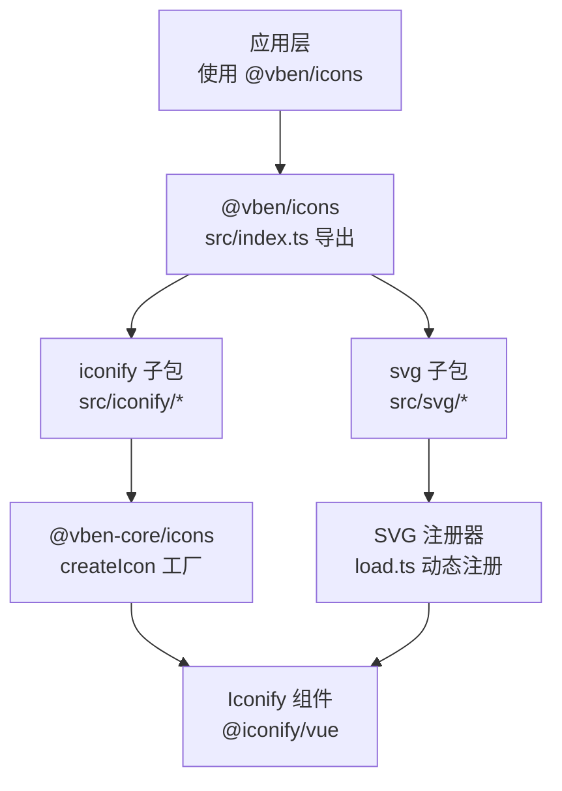
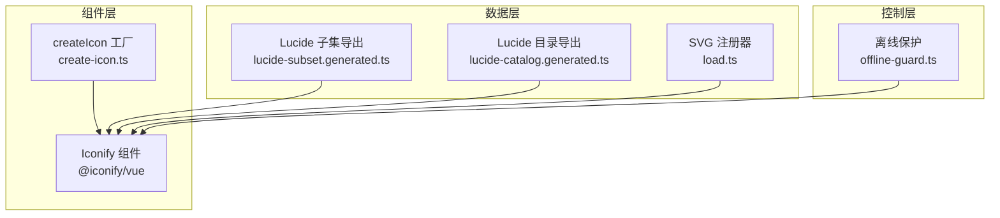
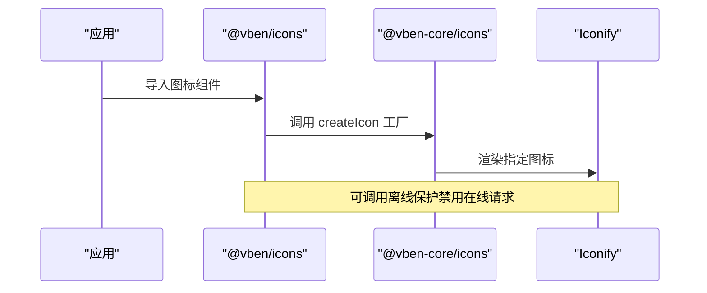
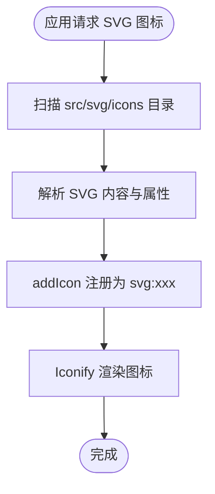
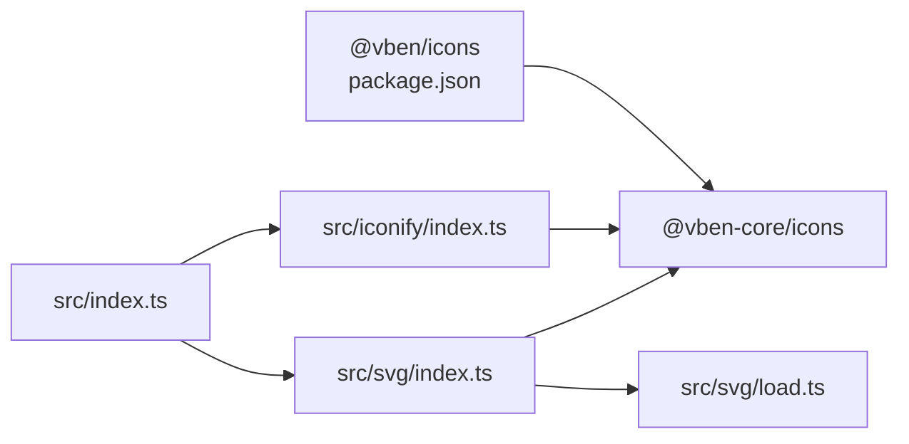

# 图标包（icons）

<cite>
**本文引用的文件**
- [frontend/packages/icons/src/index.ts](file://frontend/packages/icons/src/index.ts)
- [frontend/packages/icons/README.md](file://frontend/packages/icons/README.md)
- [frontend/packages/icons/package.json](file://frontend/packages/icons/package.json)
- [frontend/packages/icons/src/iconify/index.ts](file://frontend/packages/icons/src/iconify/index.ts)
- [frontend/packages/icons/src/iconify/lucide-catalog.generated.ts](file://frontend/packages/icons/src/iconify/lucide-catalog.generated.ts)
- [frontend/packages/icons/src/iconify/lucide-subset.generated.ts](file://frontend/packages/icons/src/iconify/lucide-subset.generated.ts)
- [frontend/packages/icons/src/svg/index.ts](file://frontend/packages/icons/src/svg/index.ts)
- [frontend/packages/icons/src/svg/load.ts](file://frontend/packages/icons/src/svg/load.ts)
- [frontend/packages/icons/src/icons/empty-icon.vue](file://frontend/packages/icons/src/icons/empty-icon.vue)
- [frontend/packages/@core/base/icons/src/index.ts](file://frontend/packages/@core/base/icons/src/index.ts)
- [frontend/packages/@core/base/icons/src/create-icon.ts](file://frontend/packages/@core/base/icons/src/create-icon.ts)
- [frontend/packages/@core/base/icons/src/lucide.ts](file://frontend/packages/@core/base/icons/src/lucide.ts)
- [frontend/packages/@core/base/icons/src/offline-guard.ts](file://frontend/packages/@core/base/icons/src/offline-guard.ts)
- [frontend/scripts/generate-lucide-subset.mjs](file://frontend/scripts/generate-lucide-subset.mjs)
</cite>

## 目录
1. [简介](#简介)
2. [项目结构](#项目结构)
3. [核心组件](#核心组件)
4. [架构总览](#架构总览)
5. [组件详解](#组件详解)
6. [依赖关系分析](#依赖关系分析)
7. [性能与优化](#性能与优化)
8. [可访问性与无障碍](#可访问性与无障碍)
9. [版本与发布管理](#版本与发布管理)
10. [故障排查指南](#故障排查指南)
11. [结论](#结论)

## 简介
本文件为图标包（@vben/icons）的全面技术文档，覆盖以下方面：
- SVG 图标组件的实现与使用方式
- 图标库的组织结构、命名规范与版本管理
- 图标组件的属性配置、样式定制与主题支持
- 图标使用的最佳实践与性能优化建议
- 图标懒加载、缓存策略与可访问性支持

图标包在本仓库中位于前端工作区的 packages/icons，向上复用核心图标能力（@vben-core/icons），向下为多应用共享图标资源。

## 项目结构
图标包采用“分层导出 + 按需加载”的组织方式：
- 导出入口：统一从 src/index.ts 导出 iconify 图标、SVG 图标与空图标
- 图标来源：
  - Lucide 子集图标：通过生成文件导出，按需引入
  - SVG 图标：运行时扫描并注册，形成 svg: 前缀的动态图标集合
- 核心能力：基于 @vben-core/icons 的 createIcon 组件工厂与 Iconify 集成

图表来源
- [frontend/packages/icons/src/index.ts:1-4](file://frontend/packages/icons/src/index.ts#L1-L4)
- [frontend/packages/icons/src/iconify/index.ts:1-8](file://frontend/packages/icons/src/iconify/index.ts#L1-L8)
- [frontend/packages/icons/src/svg/index.ts:1-38](file://frontend/packages/icons/src/svg/index.ts#L1-L38)
- [frontend/packages/icons/src/svg/load.ts:1-80](file://frontend/packages/icons/src/svg/load.ts#L1-L80)
- [frontend/packages/@core/base/icons/src/create-icon.ts:1-15](file://frontend/packages/@core/base/icons/src/create-icon.ts#L1-L15)

章节来源
- [frontend/packages/icons/src/index.ts:1-4](file://frontend/packages/icons/src/index.ts#L1-L4)
- [frontend/packages/icons/README.md:1-20](file://frontend/packages/icons/README.md#L1-L20)
- [frontend/packages/icons/package.json:1-23](file://frontend/packages/icons/package.json#L1-L23)

## 核心组件
- 统一导出入口：集中导出 iconify、svg 与空图标，便于按需引入
- Iconify 图标子包：提供 Lucide 子集与在线请求禁用能力
- SVG 图标子包：自动扫描并注册本地 SVG 文件为图标
- 空图标组件：用于占位或无数据状态展示

章节来源
- [frontend/packages/icons/src/index.ts:1-4](file://frontend/packages/icons/src/index.ts#L1-L4)
- [frontend/packages/icons/src/iconify/index.ts:1-8](file://frontend/packages/icons/src/iconify/index.ts#L1-L8)
- [frontend/packages/icons/src/svg/index.ts:1-38](file://frontend/packages/icons/src/svg/index.ts#L1-L38)
- [frontend/packages/icons/src/icons/empty-icon.vue:1-28](file://frontend/packages/icons/src/icons/empty-icon.vue#L1-L28)

## 架构总览
图标系统由三层组成：
- 组件层：通过 createIcon 工厂将 Iconify 组件包装为 Vue 组件
- 数据层：Iconify 提供图标数据与渲染；SVG 注册器将本地 SVG 转换为 Iconify 图标
- 控制层：离线保护模块可禁用在线请求，确保内网/离线环境可用

图表来源
- [frontend/packages/@core/base/icons/src/create-icon.ts:1-15](file://frontend/packages/@core/base/icons/src/create-icon.ts#L1-L15)
- [frontend/packages/@core/base/icons/src/lucide.ts:1-71](file://frontend/packages/@core/base/icons/src/lucide.ts#L1-L71)
- [frontend/packages/icons/src/iconify/lucide-subset.generated.ts:1-200](file://frontend/packages/icons/src/iconify/lucide-subset.generated.ts#L1-L200)
- [frontend/packages/icons/src/iconify/lucide-catalog.generated.ts:1-200](file://frontend/packages/icons/src/iconify/lucide-catalog.generated.ts#L1-L200)
- [frontend/packages/icons/src/svg/load.ts:1-80](file://frontend/packages/icons/src/svg/load.ts#L1-L80)
- [frontend/packages/@core/base/icons/src/offline-guard.ts:1-78](file://frontend/packages/@core/base/icons/src/offline-guard.ts#L1-L78)

## 组件详解

### Iconify 图标子包
- 导出方式：通过 createIcon 工厂创建 Vue 组件，并以命名导出形式暴露
- Lucide 子集：仅导出常用图标，减少打包体积
- 在线请求禁用：提供离线保护函数，阻止 Iconify 发起在线请求

图表来源
- [frontend/packages/icons/src/iconify/index.ts:1-8](file://frontend/packages/icons/src/iconify/index.ts#L1-L8)
- [frontend/packages/@core/base/icons/src/create-icon.ts:1-15](file://frontend/packages/@core/base/icons/src/create-icon.ts#L1-L15)
- [frontend/packages/@core/base/icons/src/offline-guard.ts:47-75](file://frontend/packages/@core/base/icons/src/offline-guard.ts#L47-L75)

章节来源
- [frontend/packages/icons/src/iconify/index.ts:1-8](file://frontend/packages/icons/src/iconify/index.ts#L1-L8)
- [frontend/packages/icons/src/iconify/lucide-subset.generated.ts:1-200](file://frontend/packages/icons/src/iconify/lucide-subset.generated.ts#L1-L200)
- [frontend/packages/icons/src/iconify/lucide-catalog.generated.ts:1-200](file://frontend/packages/icons/src/iconify/lucide-catalog.generated.ts#L1-L200)
- [frontend/packages/@core/base/icons/src/offline-guard.ts:1-78](file://frontend/packages/@core/base/icons/src/offline-guard.ts#L1-L78)

### SVG 图标子包
- 自动注册：构建时扫描 src/svg/icons 下的 SVG 文件，按文件名注册为 svg: 前缀图标
- 解析逻辑：解析 viewBox、fill/stroke 等根属性，生成 Iconify 结构体
- 按需加载：首次使用时完成注册，避免重复初始化

图表来源
- [frontend/packages/icons/src/svg/load.ts:59-80](file://frontend/packages/icons/src/svg/load.ts#L59-L80)
- [frontend/packages/icons/src/svg/load.ts:11-52](file://frontend/packages/icons/src/svg/load.ts#L11-L52)

章节来源
- [frontend/packages/icons/src/svg/index.ts:1-38](file://frontend/packages/icons/src/svg/index.ts#L1-L38)
- [frontend/packages/icons/src/svg/load.ts:1-80](file://frontend/packages/icons/src/svg/load.ts#L1-L80)

### 空图标组件
- 用途：用于占位、无数据或加载中场景
- 设计：内置 viewBox 与路径，适配主题色变量

章节来源
- [frontend/packages/icons/src/icons/empty-icon.vue:1-28](file://frontend/packages/icons/src/icons/empty-icon.vue#L1-L28)

## 依赖关系分析
- @vben/icons 依赖 @vben-core/icons，复用 createIcon 工厂与 Iconify 集成
- 图标导出通过 src/index.ts 统一聚合，便于上层应用按需导入
- SVG 注册器在模块初始化时执行一次，避免重复注册

图表来源
- [frontend/packages/icons/package.json:19-21](file://frontend/packages/icons/package.json#L19-L21)
- [frontend/packages/icons/src/index.ts:1-4](file://frontend/packages/icons/src/index.ts#L1-L4)
- [frontend/packages/icons/src/iconify/index.ts:1-8](file://frontend/packages/icons/src/iconify/index.ts#L1-L8)
- [frontend/packages/icons/src/svg/index.ts:1-38](file://frontend/packages/icons/src/svg/index.ts#L1-L38)
- [frontend/packages/icons/src/svg/load.ts:1-10](file://frontend/packages/icons/src/svg/load.ts#L1-L10)

章节来源
- [frontend/packages/icons/package.json:1-23](file://frontend/packages/icons/package.json#L1-L23)
- [frontend/packages/icons/src/index.ts:1-4](file://frontend/packages/icons/src/index.ts#L1-L4)

## 性能与优化
- 图标体积控制
  - Lucide 子集：仅导出高频图标，显著降低包体
  - 生成脚本：通过前端脚本生成子集与目录清单，保证一致性
- 按需加载
  - SVG 图标按需注册，避免一次性加载全部图标
  - Iconify 图标按需引入，减少初始渲染压力
- 主题与样式
  - 支持通过 CSS 变量与类名覆盖颜色、尺寸等样式
  - SVG 图标解析时保留 fill/stroke 等根属性，便于主题继承
- 缓存策略
  - Iconify 图标可利用浏览器缓存与 CDN 加速
  - SVG 图标注册后可被多次复用，避免重复解析
- 离线可用
  - 可启用离线保护，禁用在线请求，确保内网/离线环境稳定

章节来源
- [frontend/packages/icons/src/iconify/lucide-subset.generated.ts:1-200](file://frontend/packages/icons/src/iconify/lucide-subset.generated.ts#L1-L200)
- [frontend/packages/icons/src/svg/load.ts:1-80](file://frontend/packages/icons/src/svg/load.ts#L1-L80)
- [frontend/packages/@core/base/icons/src/offline-guard.ts:47-75](file://frontend/packages/@core/base/icons/src/offline-guard.ts#L47-L75)
- [frontend/scripts/generate-lucide-subset.mjs](file://frontend/scripts/generate-lucide-subset.mjs)

## 可访问性与无障碍
- 语义化建议
  - 为图标设置合适的替代文本（如关闭按钮使用“关闭”）
  - 对于装饰性图标，可通过隐藏文本或 aria-hidden 处理
- 交互一致性
  - 确保图标点击区域足够大，符合可点触面积要求
  - 与文字组合时保持一致的对比度与对齐
- 屏幕阅读器友好
  - 为可操作图标提供可读的标签
  - 避免仅依赖颜色传达信息，增加文本提示

[本节为通用指导，不直接分析具体文件]

## 版本与发布管理
- 包版本：当前版本号在包元数据中声明
- 发布流程：通过包管理工具安装与更新
- 版本兼容：图标导出接口保持稳定，升级时注意新增图标与命名变更

章节来源
- [frontend/packages/icons/package.json:1-23](file://frontend/packages/icons/package.json#L1-L23)

## 故障排查指南
- 图标不显示
  - 检查是否正确使用 svg: 前缀或已注册的图标名称
  - 确认 SVG 注册器已执行且未重复初始化
- 在线请求失败
  - 如需离线环境，请调用离线保护函数禁用在线请求
- 图标样式异常
  - 检查主题变量与 CSS 类覆盖是否生效
  - 确认 SVG 根属性（如 fill/stroke）是否被正确继承

章节来源
- [frontend/packages/icons/src/svg/load.ts:5-10](file://frontend/packages/icons/src/svg/load.ts#L5-L10)
- [frontend/packages/@core/base/icons/src/offline-guard.ts:47-75](file://frontend/packages/@core/base/icons/src/offline-guard.ts#L47-L75)

## 结论
本图标包通过“Iconify + SVG”的双通道设计，兼顾了通用性与可控性：
- Iconify 提供丰富的矢量图标生态与按需加载能力
- SVG 注册器让自有图标无缝接入统一渲染管线
- 离线保护与子集生成保障了性能与稳定性
- 统一导出与清晰的命名规范降低了使用成本

建议在实际项目中：
- 优先使用 Lucide 子集图标，减少包体
- 将自有图标放入 src/svg/icons 并遵循命名规范
- 在内网/离线环境启用离线保护
- 通过 CSS 变量与类名进行主题化定制