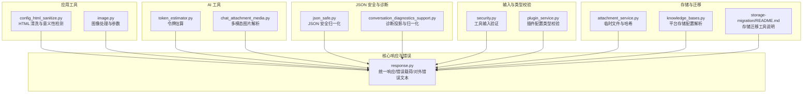
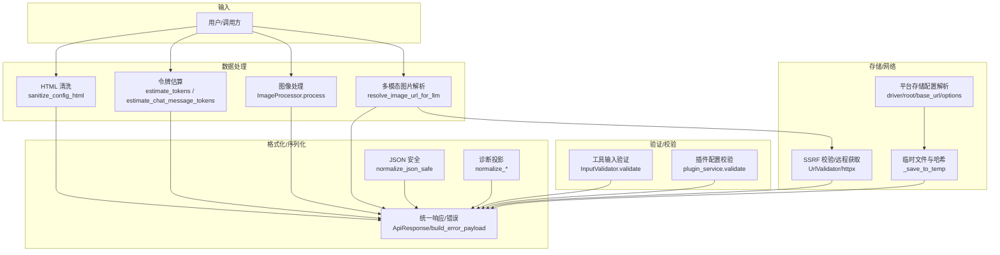
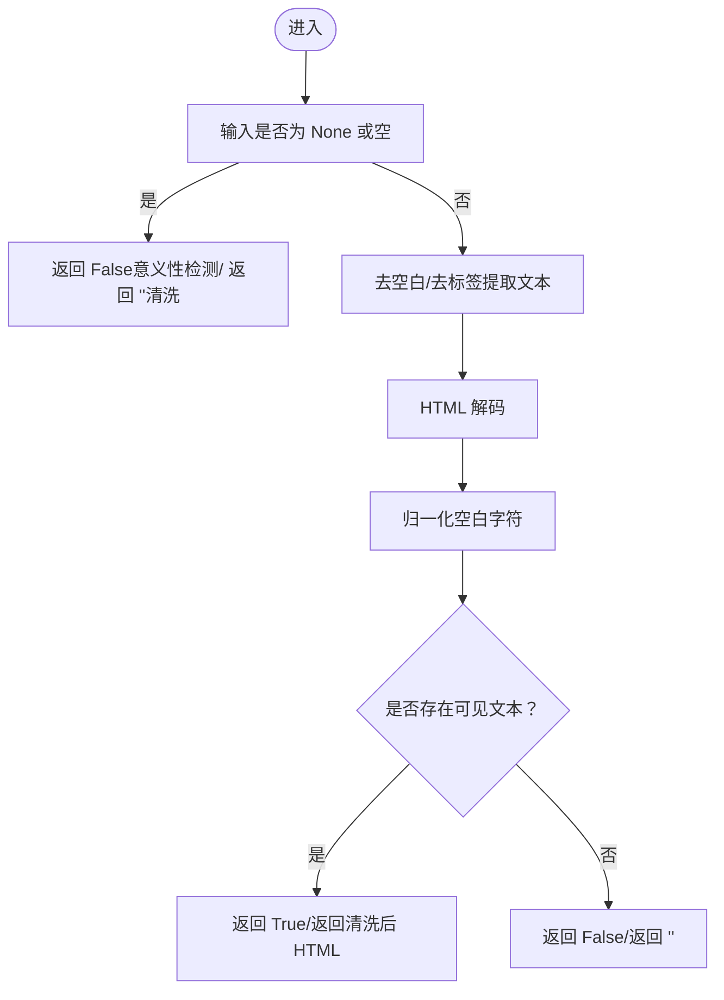
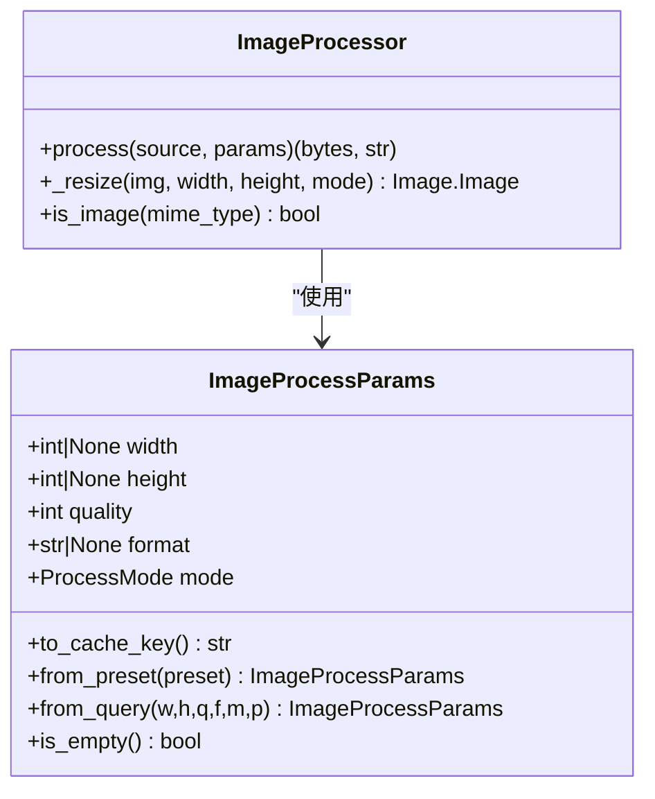
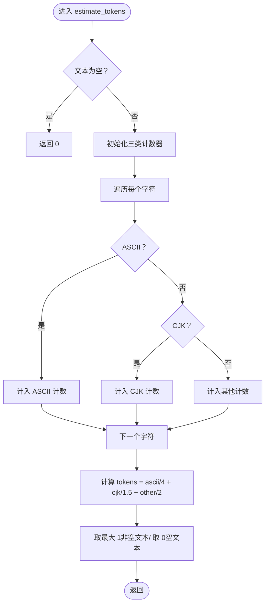
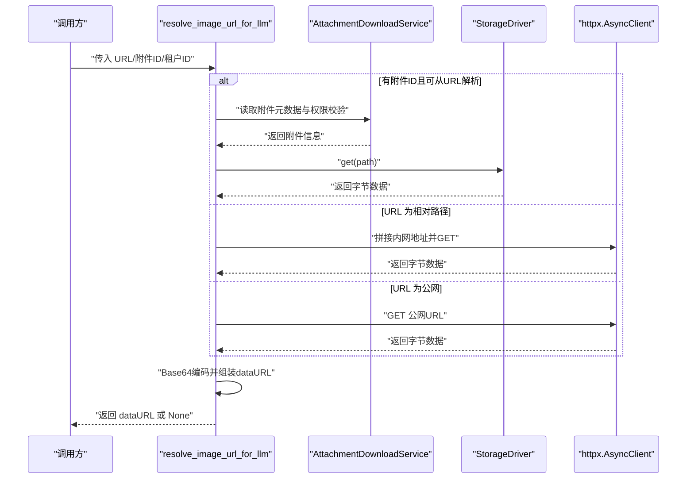
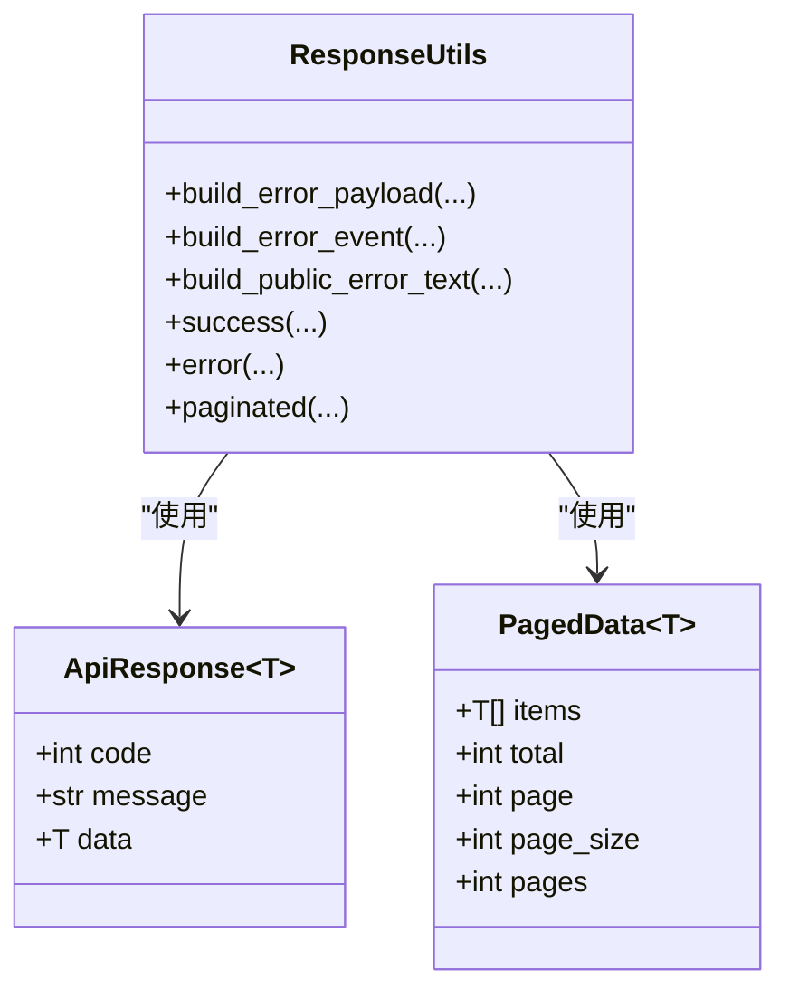
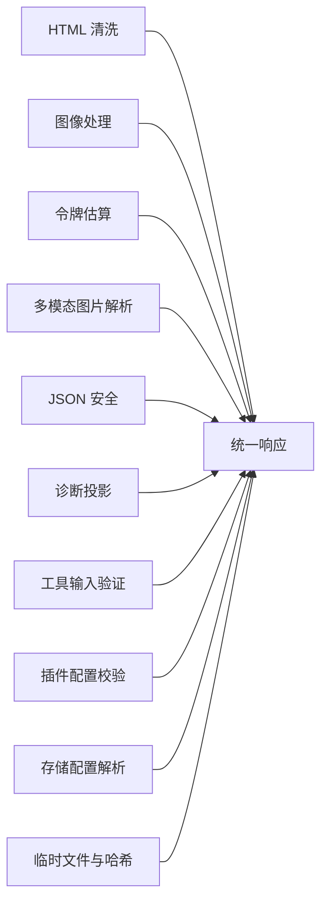

# 工具函数 (utils)

<cite>
**本文引用的文件**
- [config_html_sanitize.py](file://backend/app/utils/config_html_sanitize.py)
- [image.py](file://backend/app/utils/image.py)
- [token_estimator.py](file://backend/app/ai/utils/token_estimator.py)
- [chat_attachment_media.py](file://backend/app/ai/utils/chat_attachment_media.py)
- [response.py](file://backend/app/core/response.py)
- [json_safe.py](file://backend/app/ai/json_safe.py)
- [conversation_diagnostics_support.py](file://backend/app/services/ai/conversation_diagnostics_support.py)
- [tool_processor_args.py](file://backend/app/ai/engine/tool_processor_args.py)
- [security.py](file://backend/app/ai/tools/security.py)
- [plugin_service.py](file://backend/app/services/system/plugin_service.py)
- [stream_tool_batch_runtime.py](file://backend/app/ai/engine/stream_tool_batch_runtime.py)
- [toolkit_executor.py](file://backend/app/ai/tools/executors/toolkit_executor.py)
- [sandbox.py](file://backend/app/ai/tools/sandbox.py)
- [protocol_recovery_policy.py](file://backend/app/ai/runtime/protocol_recovery_policy.py)
- [conversation_sync_result_support.py](file://backend/app/ai/engine/conversation_sync_result_support.py)
- [attachment_service.py](file://backend/app/services/system/attachment_service.py)
- [knowledge_bases.py](file://backend/app/api/admin/knowledge_bases.py)
- [storage-migration/README.md](file://backend/plugins/storage-migration/README.md)
</cite>

## 目录
1. [简介](#简介)
2. [项目结构](#项目结构)
3. [核心组件](#核心组件)
4. [架构总览](#架构总览)
5. [详细组件分析](#详细组件分析)
6. [依赖关系分析](#依赖关系分析)
7. [性能考量](#性能考量)
8. [故障排查指南](#故障排查指南)
9. [结论](#结论)
10. [附录](#附录)

## 简介
本文件为工具函数（utils）包的全面技术文档，覆盖以下主题：
- 数据处理与格式化：HTML 清洗、JSON 安全序列化、日期时间序列化、分页模型
- 文本与令牌估算：针对 CJK 的更精确估算策略
- 图像处理：基于 Pillow 的缩放、裁剪、格式转换与缓存键生成
- 多模态图片解析：将附件 URL 解析为 LLM 可用的 data URL
- 网络请求辅助：URL 校验、SSRF 防护、远程图片获取
- 存储操作工具：平台存储配置解析、临时文件写入与哈希、驱动选择
- 错误处理工具：统一错误载荷、对外安全错误文本、Socket 连接拒绝异常
- 输入验证与类型检查：工具输入校验、插件配置类型校验
- 诊断与恢复：运行时诊断投影、协议恢复策略、异常分类与恢复决策

## 项目结构
utils 相关代码分布在多个子模块中：
- 后端应用层工具：HTML 清洗、图像处理
- AI 辅助工具：令牌估算、聊天附件媒体解析
- 核心响应与错误处理：统一响应模型、错误载荷构建、对外错误文本
- JSON 安全与诊断：JSON 安全归一化、对话诊断投影
- 输入与类型校验：工具输入验证、插件配置校验
- 存储与迁移：平台存储配置、驱动选择、存储迁移工具说明

图表来源
- [config_html_sanitize.py:1-49](file://backend/app/utils/config_html_sanitize.py#L1-L49)
- [image.py:1-390](file://backend/app/utils/image.py#L1-L390)
- [token_estimator.py:1-94](file://backend/app/ai/utils/token_estimator.py#L1-L94)
- [chat_attachment_media.py:1-227](file://backend/app/ai/utils/chat_attachment_media.py#L1-L227)
- [response.py:1-588](file://backend/app/core/response.py#L1-L588)
- [json_safe.py:1-40](file://backend/app/ai/json_safe.py#L1-L40)
- [conversation_diagnostics_support.py:48-91](file://backend/app/services/ai/conversation_diagnostics_support.py#L48-L91)
- [security.py:99-134](file://backend/app/ai/tools/security.py#L99-L134)
- [plugin_service.py:85-115](file://backend/app/services/system/plugin_service.py#L85-L115)
- [attachment_service.py:384-402](file://backend/app/services/system/attachment_service.py#L384-L402)
- [knowledge_bases.py:481-514](file://backend/app/api/admin/knowledge_bases.py#L481-L514)
- [storage-migration/README.md:1-39](file://backend/plugins/storage-migration/README.md#L1-L39)

章节来源
- [config_html_sanitize.py:1-49](file://backend/app/utils/config_html_sanitize.py#L1-L49)
- [image.py:1-390](file://backend/app/utils/image.py#L1-L390)
- [token_estimator.py:1-94](file://backend/app/ai/utils/token_estimator.py#L1-L94)
- [chat_attachment_media.py:1-227](file://backend/app/ai/utils/chat_attachment_media.py#L1-L227)
- [response.py:1-588](file://backend/app/core/response.py#L1-L588)
- [json_safe.py:1-40](file://backend/app/ai/json_safe.py#L1-L40)
- [conversation_diagnostics_support.py:48-91](file://backend/app/services/ai/conversation_diagnostics_support.py#L48-L91)
- [security.py:99-134](file://backend/app/ai/tools/security.py#L99-L134)
- [plugin_service.py:85-115](file://backend/app/services/system/plugin_service.py#L85-L115)
- [attachment_service.py:384-402](file://backend/app/services/system/attachment_service.py#L384-L402)
- [knowledge_bases.py:481-514](file://backend/app/api/admin/knowledge_bases.py#L481-L514)
- [storage-migration/README.md:1-39](file://backend/plugins/storage-migration/README.md#L1-L39)

## 核心组件
- HTML 清洗与意义性检测：提供系统配置中 HTML 的安全清洗与“是否有实质内容”的判断，避免空编辑器占位误判。
- 图像处理与参数：封装 Pillow 的缩放、裁剪、格式转换；支持多种输出格式与处理模式；提供参数到缓存键的哈希生成。
- 令牌估算：针对 CJK 字符采用更精确的估算系数，避免按 ASCII 估算导致的严重低估。
- 多模态图片解析：将附件 URL 或相对路径解析为 data URL，支持数据库直读与 HTTP 回退，并进行 SSRF 校验与大小限制。
- 统一响应与错误处理：提供统一的响应模型、错误载荷、对外安全错误文本、Socket 连接拒绝异常等。
- JSON 安全与诊断：将运行时对象归一化为 JSON 可序列化类型，支撑 SSE、持久化与诊断输出。
- 输入验证与类型校验：工具输入参数的必填与类型校验、插件配置字段类型与枚举校验。
- 存储配置与临时文件：解析平台存储配置、写入临时文件并计算哈希、驱动选择与上传。

章节来源
- [config_html_sanitize.py:16-48](file://backend/app/utils/config_html_sanitize.py#L16-L48)
- [image.py:45-191](file://backend/app/utils/image.py#L45-L191)
- [token_estimator.py:14-94](file://backend/app/ai/utils/token_estimator.py#L14-L94)
- [chat_attachment_media.py:34-227](file://backend/app/ai/utils/chat_attachment_media.py#L34-L227)
- [response.py:64-295](file://backend/app/core/response.py#L64-L295)
- [json_safe.py:18-40](file://backend/app/ai/json_safe.py#L18-L40)
- [security.py:99-134](file://backend/app/ai/tools/security.py#L99-L134)
- [plugin_service.py:85-115](file://backend/app/services/system/plugin_service.py#L85-L115)
- [attachment_service.py:384-402](file://backend/app/services/system/attachment_service.py#L384-L402)
- [knowledge_bases.py:481-514](file://backend/app/api/admin/knowledge_bases.py#L481-L514)

## 架构总览
工具函数围绕“数据处理—格式化—验证—转换—错误处理—存储/网络”形成闭环，服务于 AI 引擎、API 控制器与存储服务。

图表来源
- [config_html_sanitize.py:32-48](file://backend/app/utils/config_html_sanitize.py#L32-L48)
- [token_estimator.py:39-94](file://backend/app/ai/utils/token_estimator.py#L39-L94)
- [image.py:194-390](file://backend/app/utils/image.py#L194-L390)
- [chat_attachment_media.py:145-227](file://backend/app/ai/utils/chat_attachment_media.py#L145-L227)
- [response.py:64-295](file://backend/app/core/response.py#L64-L295)
- [json_safe.py:18-40](file://backend/app/ai/json_safe.py#L18-L40)
- [conversation_diagnostics_support.py:48-91](file://backend/app/services/ai/conversation_diagnostics_support.py#L48-L91)
- [security.py:99-134](file://backend/app/ai/tools/security.py#L99-L134)
- [plugin_service.py:85-115](file://backend/app/services/system/plugin_service.py#L85-L115)
- [attachment_service.py:384-402](file://backend/app/services/system/attachment_service.py#L384-L402)
- [knowledge_bases.py:481-514](file://backend/app/api/admin/knowledge_bases.py#L481-L514)

## 详细组件分析

### HTML 清洗与意义性检测
- 功能要点
  - 清洗系统配置中的 HTML，剔除不安全标签与属性，空输入返回空字符串。
  - 判断“站内法律页”是否包含实质可见文本，避免空编辑器占位误判为有正文。
- 关键函数
  - sanitize_config_html：使用 nh3 清洗 HTML。
  - tenant_legal_html_has_meaningful_body：去除标签与空白后判断是否存在可见文本。
- 设计原则
  - 安全优先：默认白名单清理策略，确保输出安全。
  - 可见性优先：过滤空标签与空白，保留真实内容。
- 性能考虑
  - 正则替换与 HTML 解码为 O(n)，整体线性复杂度；建议在缓存层复用结果。

图表来源
- [config_html_sanitize.py:16-48](file://backend/app/utils/config_html_sanitize.py#L16-L48)

章节来源
- [config_html_sanitize.py:16-48](file://backend/app/utils/config_html_sanitize.py#L16-L48)

### 图像处理与参数
- 功能要点
  - 支持缩放（fit）、填充（fill）、裁剪（crop）、留边（pad）四种模式。
  - 支持 jpg、png、webp、gif 输出格式，自动处理透明通道与色彩模式。
  - 提供参数到缓存键的哈希生成，便于 CDN 缓存与二次请求复用。
  - 提供预设（thumb/avatar/preview/banner/small/medium/large）以简化调用。
- 关键类与函数
  - ImageProcessParams：参数校验、归一化、缓存键生成、从预设/查询参数创建。
  - ImageProcessor.process：异步执行图像处理，返回字节数据与 MIME 类型。
  - ImageProcessor._resize：根据模式执行缩放与裁剪。
  - ImageProcessor.is_image：判断 MIME 类型是否为支持的图片格式。
- 设计原则
  - 参数安全：限定宽高与质量范围，格式白名单。
  - 模式明确：不同模式下尺寸与留白策略清晰。
  - 线程安全：CPU 密集处理通过线程池执行，避免阻塞事件循环。
- 性能考虑
  - Pillow 缩放使用高质量重采样；大图处理建议限制最大尺寸。
  - 缓存键基于参数组合，减少重复处理与网络传输。

图表来源
- [image.py:45-390](file://backend/app/utils/image.py#L45-L390)

章节来源
- [image.py:45-390](file://backend/app/utils/image.py#L45-L390)

### 令牌估算（CJK 更精确）
- 功能要点
  - 针对 ASCII、CJK 统一表意文字与其他 Unicode 字符采用不同估算系数。
  - 支持结构化数据（JSON 序列化后）的令牌估算，用于消息附件与工具调用。
- 关键函数
  - estimate_tokens：按字符类型估算令牌数。
  - estimate_chat_message_tokens：结合内容、附件与工具调用估算。
- 设计原则
  - 准确性：避免按固定规则（如 len//4）对 CJK 严重低估。
  - 可扩展：结构化数据统一序列化后估算，保证一致性。
- 性能考虑
  - 单次遍历 O(n)，适合在消息聚合阶段批量估算。

图表来源
- [token_estimator.py:39-94](file://backend/app/ai/utils/token_estimator.py#L39-L94)

章节来源
- [token_estimator.py:14-94](file://backend/app/ai/utils/token_estimator.py#L14-L94)

### 多模态图片解析（LLM）
- 功能要点
  - 将相对路径或完整 URL 解析为 data:image/...;base64,...，供 LLM 多模态 API 使用。
  - 支持从数据库+存储驱动读取私有文件（租户匹配或 JWT 校验），或 HTTP(S) 回退。
  - 进行 SSRF 校验、内容长度限制与 MIME 类型修正。
- 关键函数
  - resolve_image_url_for_llm：主流程入口，支持多种来源与回退策略。
  - _read_attachment_bytes_via_db/_retrieve_remote_image_bytes：内部读取与获取。
- 设计原则
  - 安全优先：SSRF 校验与大小限制，避免滥用与资源耗尽。
  - 可靠回退：相对路径走内网回退，失败再尝试公网。
- 性能考虑
  - 异步 HTTP 客户端，超时控制；过大图片直接拒绝，避免内存压力。

图表来源
- [chat_attachment_media.py:145-227](file://backend/app/ai/utils/chat_attachment_media.py#L145-L227)

章节来源
- [chat_attachment_media.py:34-227](file://backend/app/ai/utils/chat_attachment_media.py#L34-L227)

### 统一响应与错误处理
- 功能要点
  - ApiResponse/PagedData：统一响应结构与分页模型。
  - build_error_payload/build_error_event：构建统一错误载荷与 SSE/Socket 事件。
  - build_public_error_text：构建对外安全错误文本，支持 trace_id 与调试细节开关。
  - success/error/created/updated/deleted/paginated/no_content：常用响应封装。
- 设计原则
  - 一致对外：所有错误与成功响应遵循统一结构。
  - 安全披露：生产环境默认隐藏调试细节，开发环境可开启。
  - 可追踪：自动注入 trace_id，便于问题定位。
- 性能考虑
  - 序列化时统一处理 datetime 与时区，避免前后端误解。

图表来源
- [response.py:64-588](file://backend/app/core/response.py#L64-L588)

章节来源
- [response.py:64-588](file://backend/app/core/response.py#L64-L588)

### JSON 安全与诊断投影
- 功能要点
  - normalize_json_safe：递归将运行时对象（Decimal、datetime、UUID、bytes、dataclass 等）归一化为 JSON 可序列化类型。
  - 诊断投影：将上下文来源、意图计划、重试事件、供应商事件等归一化，支撑 SSE 与持久化。
- 设计原则
  - 可序列化：确保跨组件（SSE、持久化、诊断）的数据一致性。
  - 可读性：时间与枚举等类型转换为人类可读字符串。
- 性能考虑
  - 递归归一化为 O(n)，注意大数据结构的内存占用。

章节来源
- [json_safe.py:18-40](file://backend/app/ai/json_safe.py#L18-L40)
- [conversation_diagnostics_support.py:48-91](file://backend/app/services/ai/conversation_diagnostics_support.py#L48-L91)

### 输入验证与类型校验
- 工具输入验证
  - 必填字段检查、类型匹配校验，抛出工具输入验证异常。
- 插件配置校验
  - 字段类型与枚举值校验，未知字段直接报错。
- 设计原则
  - 明确边界：提前发现参数错误，降低运行期开销。
  - 可维护性：通过 schema 驱动校验逻辑，易于扩展。

章节来源
- [security.py:99-134](file://backend/app/ai/tools/security.py#L99-L134)
- [plugin_service.py:85-115](file://backend/app/services/system/plugin_service.py#L85-L115)

### 存储配置与临时文件
- 平台存储配置解析
  - 从配置服务读取驱动、根路径、基础 URL 与选项，构造存储配置。
- 临时文件与哈希
  - 将二进制流写入临时文件，分块读取并计算 SHA256，返回路径、大小与摘要。
- 设计原则
  - 配置即代码：统一从平台配置读取，避免硬编码。
  - 安全可靠：临时文件自动清理，哈希用于完整性校验。
- 性能考虑
  - 分块读取（8KB）平衡内存与 IO；线程池执行避免阻塞。

章节来源
- [knowledge_bases.py:481-514](file://backend/app/api/admin/knowledge_bases.py#L481-L514)
- [attachment_service.py:384-402](file://backend/app/services/system/attachment_service.py#L384-L402)

### 存储迁移工具（概念说明）
- 功能概览
  - 影响分析、双向迁移、批量并发、断点续传、回滚与源文件清理。
- 使用场景
  - 切换存储驱动前评估影响；大规模文件迁移与恢复。
- 设计原则
  - 可观测：进度、失败项、回滚路径清晰。
  - 可靠：失败重试、暂停/恢复、原子性保障。

章节来源
- [storage-migration/README.md:1-39](file://backend/plugins/storage-migration/README.md#L1-L39)

## 依赖关系分析
- 组件耦合
  - 图像处理依赖 Pillow 与 anyio 线程池；与响应模块解耦，仅返回字节与 MIME。
  - 多模态图片解析依赖存储管理器、附件下载服务、URL 校验与 httpx。
  - 令牌估算依赖消息类型定义；JSON 安全与诊断投影依赖运行时对象类型。
  - 错误处理工具被广泛使用，作为统一出口，耦合度高但职责单一。
- 外部依赖
  - nh3（HTML 清洗）、Pillow（图像处理）、httpx（网络请求）、SQLAlchemy（数据库会话）。
- 潜在循环依赖
  - 工具函数间无直接循环；错误处理工具被上层控制器与引擎广泛依赖，属于“低耦合高复用”。

图表来源
- [config_html_sanitize.py:32-48](file://backend/app/utils/config_html_sanitize.py#L32-L48)
- [image.py:194-390](file://backend/app/utils/image.py#L194-L390)
- [token_estimator.py:39-94](file://backend/app/ai/utils/token_estimator.py#L39-L94)
- [chat_attachment_media.py:145-227](file://backend/app/ai/utils/chat_attachment_media.py#L145-L227)
- [response.py:64-588](file://backend/app/core/response.py#L64-L588)
- [json_safe.py:18-40](file://backend/app/ai/json_safe.py#L18-L40)
- [conversation_diagnostics_support.py:48-91](file://backend/app/services/ai/conversation_diagnostics_support.py#L48-L91)
- [security.py:99-134](file://backend/app/ai/tools/security.py#L99-L134)
- [plugin_service.py:85-115](file://backend/app/services/system/plugin_service.py#L85-L115)
- [attachment_service.py:384-402](file://backend/app/services/system/attachment_service.py#L384-L402)
- [knowledge_bases.py:481-514](file://backend/app/api/admin/knowledge_bases.py#L481-L514)

## 性能考量
- CPU 密集型
  - 图像处理与令牌估算为 CPU 密集任务，建议在生产环境启用线程池与合理的并发上限。
- IO 密集型
  - 多模态图片解析与存储读取为 IO 密集，建议设置合理超时与连接池。
- 内存与带宽
  - 大图与大文件处理需限制最大尺寸与体积，避免内存溢出与带宽占用。
- 缓存与复用
  - 图像处理参数到缓存键的哈希可显著减少重复处理；HTML 清洗结果可在缓存层复用。
- 序列化与传输
  - 统一的 JSON 安全归一化与响应序列化，减少跨组件的数据不一致与解析成本。

## 故障排查指南
- 多模态图片解析失败
  - 检查 URL 是否为相对路径且已配置内网基址；确认 SSRF 校验与大小限制。
  - 查看附件可见性与 JWT 校验是否通过；关注存储驱动读取异常日志。
- 工具执行错误
  - 参数不匹配：查看工具输入验证错误；核对 schema 与类型。
  - 运行时异常：通过统一错误文本与 trace_id 定位；必要时开启调试载荷。
- 存储相关
  - 临时文件写入失败：检查磁盘空间与权限；确认分块读取与哈希计算过程。
  - 配置不生效：核对平台存储配置项（驱动、根路径、基础 URL、选项）。
- 错误分类与恢复
  - 通过协议恢复策略提取状态码与失败原因；根据部分失败原因决定是否跳过同步救援。

章节来源
- [chat_attachment_media.py:145-227](file://backend/app/ai/utils/chat_attachment_media.py#L145-L227)
- [toolkit_executor.py:217-246](file://backend/app/ai/tools/executors/toolkit_executor.py#L217-L246)
- [sandbox.py:430-449](file://backend/app/ai/tools/sandbox.py#L430-L449)
- [protocol_recovery_policy.py:112-151](file://backend/app/ai/runtime/protocol_recovery_policy.py#L112-L151)
- [conversation_sync_result_support.py:180-218](file://backend/app/ai/engine/conversation_sync_result_support.py#L180-L218)
- [attachment_service.py:384-402](file://backend/app/services/system/attachment_service.py#L384-L402)
- [response.py:123-159](file://backend/app/core/response.py#L123-L159)

## 结论
工具函数（utils）包通过“安全清洗、格式化、验证、转换、错误处理、存储与网络”六大维度，为 AI 引擎与后端服务提供了稳定、可维护、高性能的基础设施。其设计强调：
- 安全优先：HTML 清洗、SSRF 校验、对外错误文本脱敏。
- 可观测性：统一响应、trace_id、调试载荷、诊断投影。
- 可扩展性：参数化与预设、类型校验、插件配置 schema。
- 可靠性：线程池执行、超时与大小限制、回退策略与回滚机制。

## 附录
- 常用使用场景
  - 系统配置页面 HTML 清洗与内容检测
  - 用户头像/预览图的缩放与格式转换
  - 多模态消息中图片 URL 的解析与 dataURL 生成
  - 工具调用前的输入参数校验
  - 插件配置的类型与枚举校验
  - 平台存储驱动切换前的影响分析与迁移