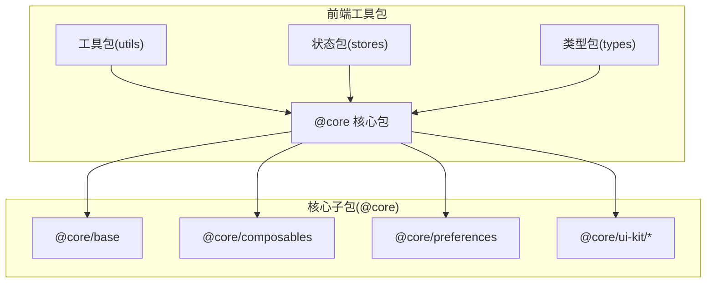
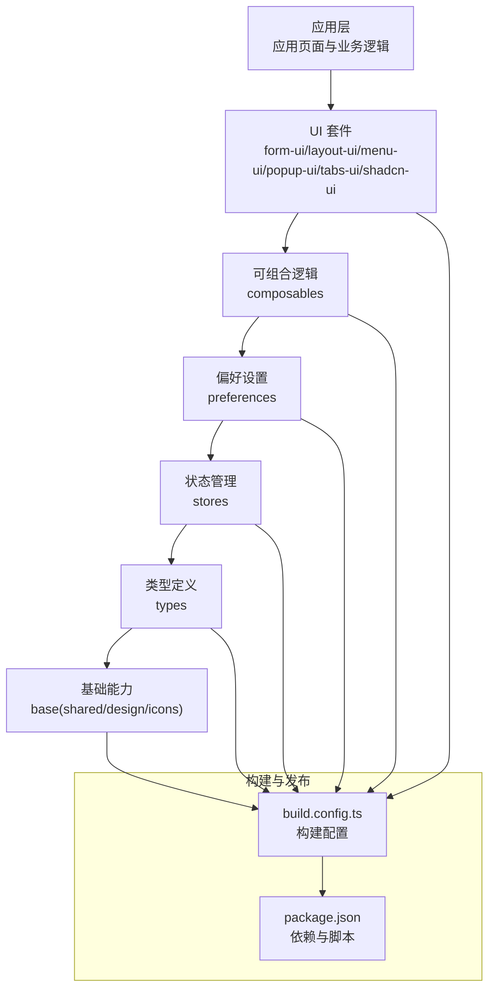
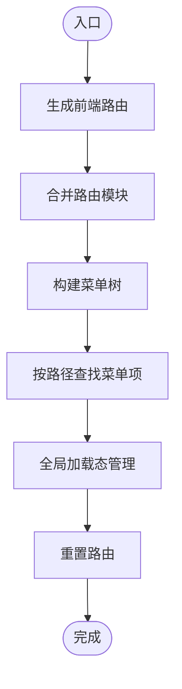
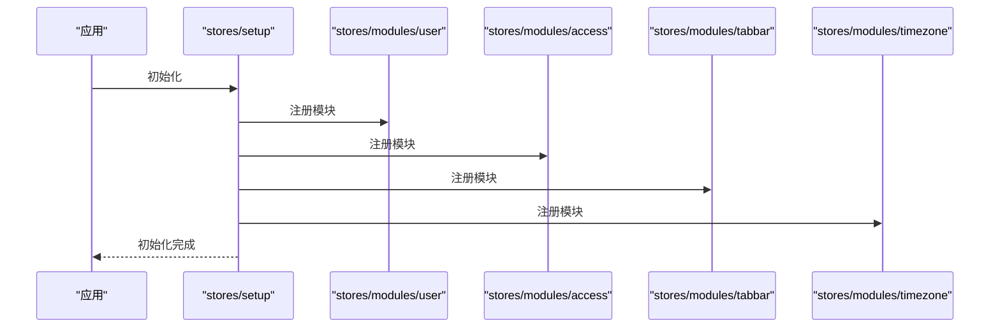
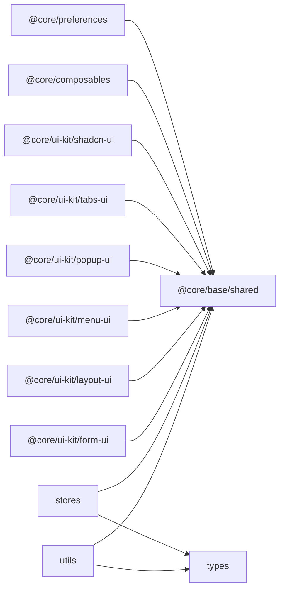

# 工具包系统

<cite>
**本文档引用的文件**
- [frontend/packages/utils/src/index.ts](file://frontend/packages/utils/src/index.ts)
- [frontend/packages/utils/src/helpers/index.ts](file://frontend/packages/utils/src/helpers/index.ts)
- [frontend/packages/utils/src/helpers/generate-routes-frontend.ts](file://frontend/packages/utils/src/helpers/generate-routes-frontend.ts)
- [frontend/packages/utils/src/helpers/generate-menus.ts](file://frontend/packages/utils/src/helpers/generate-menus.ts)
- [frontend/packages/utils/src/helpers/find-menu-by-path.ts](file://frontend/packages/utils/src/helpers/find-menu-by-path.ts)
- [frontend/packages/utils/src/helpers/merge-route-modules.ts](file://frontend/packages/utils/src/helpers/merge-route-modules.ts)
- [frontend/packages/utils/src/helpers/reset-routes.ts](file://frontend/packages/utils/src/helpers/reset-routes.ts)
- [frontend/packages/utils/src/helpers/unmount-global-loading.ts](file://frontend/packages/utils/src/helpers/unmount-global-loading.ts)
- [frontend/packages/types/src/index.ts](file://frontend/packages/types/src/index.ts)
- [frontend/packages/types/src/user.ts](file://frontend/packages/types/src/user.ts)
- [frontend/packages/stores/src/index.ts](file://frontend/packages/stores/src/index.ts)
- [frontend/packages/stores/src/modules/user.ts](file://frontend/packages/stores/src/modules/user.ts)
- [frontend/packages/stores/src/modules/access.ts](file://frontend/packages/stores/src/modules/access.ts)
- [frontend/packages/stores/src/modules/tabbar.ts](file://frontend/packages/stores/src/modules/tabbar.ts)
- [frontend/packages/stores/src/modules/timezone.ts](file://frontend/packages/stores/src/modules/timezone.ts)
- [frontend/packages/stores/src/setup.ts](file://frontend/packages/stores/src/setup.ts)
- [frontend/packages/@core/base/shared/src/store.ts](file://frontend/packages/@core/base/shared/src/store.ts)
- [frontend/packages/@core/composables/src/use-is-mobile.ts](file://frontend/packages/@core/composables/src/use-is-mobile.ts)
- [frontend/packages/@core/composables/src/use-layout-style.ts](file://frontend/packages/@core/composables/src/use-layout-style.ts)
- [frontend/packages/@core/composables/src/use-namespace.ts](file://frontend/packages/@core/composables/src/use-namespace.ts)
- [frontend/packages/@core/composables/src/use-priority-value.ts](file://frontend/packages/@core/composables/src/use-priority-value.ts)
- [frontend/packages/@core/composables/src/use-scroll-lock.ts](file://frontend/packages/@core/composables/src/use-scroll-lock.ts)
- [frontend/packages/@core/preferences/src/preferences.ts](file://frontend/packages/@core/preferences/src/preferences.ts)
- [frontend/packages/@core/preferences/src/config.ts](file://frontend/packages/@core/preferences/src/config.ts)
- [frontend/packages/@core/preferences/src/use-preferences.ts](file://frontend/packages/@core/preferences/src/use-preferences.ts)
- [frontend/packages/@core/ui-kit/form-ui/src/form-api.ts](file://frontend/packages/@core/ui-kit/form-ui/src/form-api.ts)
- [frontend/packages/@core/ui-kit/form-ui/src/config.ts](file://frontend/packages/@core/ui-kit/form-ui/src/config.ts)
- [frontend/packages/@core/ui-kit/layout-ui/src/index.ts](file://frontend/packages/@core/ui-kit/layout-ui/src/index.ts)
- [frontend/packages/@core/ui-kit/menu-ui/src/index.ts](file://frontend/packages/@core/ui-kit/menu-ui/src/index.ts)
- [frontend/packages/@core/ui-kit/popup-ui/src/index.ts](file://frontend/packages/@core/ui-kit/popup-ui/src/index.ts)
- [frontend/packages/@core/ui-kit/tabs-ui/src/index.ts](file://frontend/packages/@core/ui-kit/tabs-ui/src/index.ts)
- [frontend/packages/@core/ui-kit/shadcn-ui/src/index.ts](file://frontend/packages/@core/ui-kit/shadcn-ui/src/index.ts)
- [frontend/package.json](file://frontend/package.json)
- [frontend/packages/utils/package.json](file://frontend/packages/utils/package.json)
- [frontend/packages/types/package.json](file://frontend/packages/types/package.json)
- [frontend/packages/stores/package.json](file://frontend/packages/stores/package.json)
- [frontend/packages/@core/base/shared/build.config.ts](file://frontend/packages/@core/base/shared/build.config.ts)
- [frontend/packages/@core/composables/build.config.ts](file://frontend/packages/@core/composables/build.config.ts)
- [frontend/packages/@core/preferences/build.config.ts](file://frontend/packages/@core/preferences/build.config.ts)
- [frontend/packages/@core/ui-kit/form-ui/build.config.ts](file://frontend/packages/@core/ui-kit/form-ui/build.config.ts)
- [frontend/packages/@core/ui-kit/layout-ui/build.config.ts](file://frontend/packages/@core/ui-kit/layout-ui/build.config.ts)
- [frontend/packages/@core/ui-kit/menu-ui/build.config.ts](file://frontend/packages/@core/ui-kit/menu-ui/build.config.ts)
- [frontend/packages/@core/ui-kit/popup-ui/build.config.ts](file://frontend/packages/@core/ui-kit/popup-ui/build.config.ts)
- [frontend/packages/@core/ui-kit/tabs-ui/build.config.ts](file://frontend/packages/@core/ui-kit/tabs-ui/build.config.ts)
- [frontend/packages/@core/ui-kit/shadcn-ui/build.config.ts](file://frontend/packages/@core/ui-kit/shadcn-ui/build.config.ts)
</cite>

## 目录
1. [简介](#简介)
2. [项目结构](#项目结构)
3. [核心组件](#核心组件)
4. [架构总览](#架构总览)
5. [详细组件分析](#详细组件分析)
6. [依赖关系分析](#依赖关系分析)
7. [性能考虑](#性能考虑)
8. [故障排除指南](#故障排除指南)
9. [结论](#结论)
10. [附录](#附录)

## 简介
本文件为前端工具包系统的全面技术文档，聚焦于通用工具函数、类型定义与核心包设计，系统性地梳理了路由生成与菜单构建、状态管理与偏好设置、UI 组件库与可组合逻辑等模块。文档同时覆盖 API 封装、错误处理与数据格式化工具的实现思路，并提供插件工具、存储工具与网络请求工具的实践建议。最后总结工具包开发的最佳实践、模块化设计与版本管理策略，以及类型安全、代码复用与性能优化的要点。

## 项目结构
前端工具包位于 `frontend/packages` 目录下，采用多包（monorepo）结构，按功能域拆分为多个独立包：
- `@core`：核心基础能力，包括基础设计、图标、共享工具、类型声明、可组合逻辑、偏好设置与 UI 套件
- `utils`：通用工具函数集合，提供路由生成、菜单构建、全局加载卸载等辅助能力
- `types`：类型定义集中地，确保跨包类型一致性
- `stores`：基于 Pinia 的状态管理模块，提供用户、权限、标签页、时区等状态域

图表来源
- [frontend/packages/utils/package.json](file://frontend/packages/utils/package.json)
- [frontend/packages/types/package.json](file://frontend/packages/types/package.json)
- [frontend/packages/stores/package.json](file://frontend/packages/stores/package.json)
- [frontend/packages/@core/base/shared/build.config.ts](file://frontend/packages/@core/base/shared/build.config.ts)
- [frontend/packages/@core/composables/build.config.ts](file://frontend/packages/@core/composables/build.config.ts)
- [frontend/packages/@core/preferences/build.config.ts](file://frontend/packages/@core/preferences/build.config.ts)
- [frontend/packages/@core/ui-kit/form-ui/build.config.ts](file://frontend/packages/@core/ui-kit/form-ui/build.config.ts)

章节来源
- [frontend/packages/utils/package.json](file://frontend/packages/utils/package.json)
- [frontend/packages/types/package.json](file://frontend/packages/types/package.json)
- [frontend/packages/stores/package.json](file://frontend/packages/stores/package.json)

## 核心组件
- 通用工具函数（utils）
  - 路由生成与合并：支持前端路由模块的动态生成与合并，便于模块化路由组织
  - 菜单生成与查找：根据路由或配置生成菜单树，并支持按路径快速定位菜单项
  - 全局加载与卸载：统一管理全局加载态，避免重复挂载与内存泄漏
  - 路由重置：在应用切换或登录态变化时重置路由，保证状态一致性
- 类型定义（types）
  - 用户类型与扩展：集中定义用户相关类型，确保跨模块一致的类型约束
- 状态管理（stores）
  - 用户、权限、标签页、时区等状态域，通过模块化设计提升可维护性
  - 全局 Store 初始化：集中注册与初始化各状态模块
- 可组合逻辑（composables）
  - 移动端检测、布局样式、命名空间、优先值、滚动锁定等可复用逻辑
- 偏好设置（preferences）
  - 主题与界面偏好配置、CSS 变量更新、偏好读写与响应式 Hook
- UI 套件（ui-kit）
  - 表单渲染、布局、菜单、弹窗、标签页、Shadcn 风格组件等模块化 UI 组件

章节来源
- [frontend/packages/utils/src/helpers/index.ts](file://frontend/packages/utils/src/helpers/index.ts)
- [frontend/packages/types/src/index.ts](file://frontend/packages/types/src/index.ts)
- [frontend/packages/stores/src/index.ts](file://frontend/packages/stores/src/index.ts)
- [frontend/packages/@core/composables/src/index.ts](file://frontend/packages/@core/composables/src/index.ts)
- [frontend/packages/@core/preferences/src/index.ts](file://frontend/packages/@core/preferences/src/index.ts)
- [frontend/packages/@core/ui-kit/form-ui/src/index.ts](file://frontend/packages/@core/ui-kit/form-ui/src/index.ts)

## 架构总览
工具包整体采用“分层+模块化”架构：
- 分层：基础层（design/icons/shared）、能力层（composables/preferences）、应用层（ui-kit）、业务层（stores/types/utils）
- 模块化：每个包独立发布，通过 build.config.ts 定义构建规则，通过 package.json 管理依赖与脚本
- 类型安全：types 包集中导出类型，其他包以严格类型约束进行交互
- 可组合性：composables 提供可复用的逻辑钩子；ui-kit 提供可组合的 UI 组件

图表来源
- [frontend/packages/@core/base/shared/build.config.ts](file://frontend/packages/@core/base/shared/build.config.ts)
- [frontend/packages/@core/composables/build.config.ts](file://frontend/packages/@core/composables/build.config.ts)
- [frontend/packages/@core/preferences/build.config.ts](file://frontend/packages/@core/preferences/build.config.ts)
- [frontend/packages/@core/ui-kit/form-ui/build.config.ts](file://frontend/packages/@core/ui-kit/form-ui/build.config.ts)
- [frontend/packages/@core/ui-kit/layout-ui/build.config.ts](file://frontend/packages/@core/ui-kit/layout-ui/build.config.ts)
- [frontend/packages/@core/ui-kit/menu-ui/build.config.ts](file://frontend/packages/@core/ui-kit/menu-ui/build.config.ts)
- [frontend/packages/@core/ui-kit/popup-ui/build.config.ts](file://frontend/packages/@core/ui-kit/popup-ui/build.config.ts)
- [frontend/packages/@core/ui-kit/tabs-ui/build.config.ts](file://frontend/packages/@core/ui-kit/tabs-ui/build.config.ts)
- [frontend/packages/@core/ui-kit/shadcn-ui/build.config.ts](file://frontend/packages/@core/ui-kit/shadcn-ui/build.config.ts)

## 详细组件分析

### 通用工具函数（utils）
- 路由生成与合并
  - 功能：从模块化路由配置生成前端路由表，并支持多模块合并，便于按功能域拆分路由
  - 关键点：模块间解耦、可扩展的路由配置格式、运行时动态注入
- 菜单生成与查找
  - 功能：根据路由或配置生成菜单树，并提供按路径查找菜单项的能力
  - 关键点：层级结构规范化、路径匹配算法、菜单项元数据标准化
- 全局加载与卸载
  - 功能：统一管理全局加载态，避免重复挂载与内存泄漏
  - 关键点：生命周期管理、唯一实例控制、异常兜底
- 路由重置
  - 功能：在应用切换或登录态变化时重置路由，保证状态一致性
  - 关键点：路由表清理、守卫重置、历史记录处理

图表来源
- [frontend/packages/utils/src/helpers/generate-routes-frontend.ts](file://frontend/packages/utils/src/helpers/generate-routes-frontend.ts)
- [frontend/packages/utils/src/helpers/merge-route-modules.ts](file://frontend/packages/utils/src/helpers/merge-route-modules.ts)
- [frontend/packages/utils/src/helpers/generate-menus.ts](file://frontend/packages/utils/src/helpers/generate-menus.ts)
- [frontend/packages/utils/src/helpers/find-menu-by-path.ts](file://frontend/packages/utils/src/helpers/find-menu-by-path.ts)
- [frontend/packages/utils/src/helpers/unmount-global-loading.ts](file://frontend/packages/utils/src/helpers/unmount-global-loading.ts)
- [frontend/packages/utils/src/helpers/reset-routes.ts](file://frontend/packages/utils/src/helpers/reset-routes.ts)

章节来源
- [frontend/packages/utils/src/helpers/index.ts](file://frontend/packages/utils/src/helpers/index.ts)
- [frontend/packages/utils/src/helpers/generate-routes-frontend.ts](file://frontend/packages/utils/src/helpers/generate-routes-frontend.ts)
- [frontend/packages/utils/src/helpers/generate-menus.ts](file://frontend/packages/utils/src/helpers/generate-menus.ts)
- [frontend/packages/utils/src/helpers/find-menu-by-path.ts](file://frontend/packages/utils/src/helpers/find-menu-by-path.ts)
- [frontend/packages/utils/src/helpers/merge-route-modules.ts](file://frontend/packages/utils/src/helpers/merge-route-modules.ts)
- [frontend/packages/utils/src/helpers/reset-routes.ts](file://frontend/packages/utils/src/helpers/reset-routes.ts)
- [frontend/packages/utils/src/helpers/unmount-global-loading.ts](file://frontend/packages/utils/src/helpers/unmount-global-loading.ts)

### 类型定义（types）
- 用户类型与扩展
  - 功能：集中定义用户相关类型，确保跨模块一致的类型约束
  - 关键点：类型收敛、可选字段与必填字段明确、扩展性预留

章节来源
- [frontend/packages/types/src/index.ts](file://frontend/packages/types/src/index.ts)
- [frontend/packages/types/src/user.ts](file://frontend/packages/types/src/user.ts)

### 状态管理（stores）
- 模块化设计
  - 用户、权限、标签页、时区等状态域独立模块，降低耦合度
- 全局初始化
  - 在 setup 中集中注册与初始化各状态模块，保证应用启动时的状态一致性

图表来源
- [frontend/packages/stores/src/setup.ts](file://frontend/packages/stores/src/setup.ts)
- [frontend/packages/stores/src/modules/user.ts](file://frontend/packages/stores/src/modules/user.ts)
- [frontend/packages/stores/src/modules/access.ts](file://frontend/packages/stores/src/modules/access.ts)
- [frontend/packages/stores/src/modules/tabbar.ts](file://frontend/packages/stores/src/modules/tabbar.ts)
- [frontend/packages/stores/src/modules/timezone.ts](file://frontend/packages/stores/src/modules/timezone.ts)

章节来源
- [frontend/packages/stores/src/index.ts](file://frontend/packages/stores/src/index.ts)
- [frontend/packages/stores/src/setup.ts](file://frontend/packages/stores/src/setup.ts)
- [frontend/packages/stores/src/modules/user.ts](file://frontend/packages/stores/src/modules/user.ts)
- [frontend/packages/stores/src/modules/access.ts](file://frontend/packages/stores/src/modules/access.ts)
- [frontend/packages/stores/src/modules/tabbar.ts](file://frontend/packages/stores/src/modules/tabbar.ts)
- [frontend/packages/stores/src/modules/timezone.ts](file://frontend/packages/stores/src/modules/timezone.ts)

### 可组合逻辑（composables）
- 移动端检测、布局样式、命名空间、优先值、滚动锁定等可复用逻辑
- 设计原则：无副作用、纯函数式、可测试性强

章节来源
- [frontend/packages/@core/composables/src/use-is-mobile.ts](file://frontend/packages/@core/composables/src/use-is-mobile.ts)
- [frontend/packages/@core/composables/src/use-layout-style.ts](file://frontend/packages/@core/composables/src/use-layout-style.ts)
- [frontend/packages/@core/composables/src/use-namespace.ts](file://frontend/packages/@core/composables/src/use-namespace.ts)
- [frontend/packages/@core/composables/src/use-priority-value.ts](file://frontend/packages/@core/composables/src/use-priority-value.ts)
- [frontend/packages/@core/composables/src/use-scroll-lock.ts](file://frontend/packages/@core/composables/src/use-scroll-lock.ts)

### 偏好设置（preferences）
- 主题与界面偏好配置、CSS 变量更新、偏好读写与响应式 Hook
- 设计原则：配置中心化、持久化、响应式更新

章节来源
- [frontend/packages/@core/preferences/src/preferences.ts](file://frontend/packages/@core/preferences/src/preferences.ts)
- [frontend/packages/@core/preferences/src/config.ts](file://frontend/packages/@core/preferences/src/config.ts)
- [frontend/packages/@core/preferences/src/use-preferences.ts](file://frontend/packages/@core/preferences/src/use-preferences.ts)

### UI 套件（ui-kit）
- 表单渲染、布局、菜单、弹窗、标签页、Shadcn 风格组件等模块化 UI 组件
- 设计原则：可组合、可定制、可测试、可维护

章节来源
- [frontend/packages/@core/ui-kit/form-ui/src/form-api.ts](file://frontend/packages/@core/ui-kit/form-ui/src/form-api.ts)
- [frontend/packages/@core/ui-kit/form-ui/src/config.ts](file://frontend/packages/@core/ui-kit/form-ui/src/config.ts)
- [frontend/packages/@core/ui-kit/layout-ui/src/index.ts](file://frontend/packages/@core/ui-kit/layout-ui/src/index.ts)
- [frontend/packages/@core/ui-kit/menu-ui/src/index.ts](file://frontend/packages/@core/ui-kit/menu-ui/src/index.ts)
- [frontend/packages/@core/ui-kit/popup-ui/src/index.ts](file://frontend/packages/@core/ui-kit/popup-ui/src/index.ts)
- [frontend/packages/@core/ui-kit/tabs-ui/src/index.ts](file://frontend/packages/@core/ui-kit/tabs-ui/src/index.ts)
- [frontend/packages/@core/ui-kit/shadcn-ui/src/index.ts](file://frontend/packages/@core/ui-kit/shadcn-ui/src/index.ts)

## 依赖关系分析
- 内部依赖
  - utils 依赖 @core 的共享工具与类型
  - stores 依赖 @core 的共享工具与类型
  - @core/ui-kit 各子包依赖 @core/base/shared 与 @core/composables
- 外部依赖
  - Vue 生态（Vue、Vue Router、Pinia）
  - UI 生态（Ant Design Vue、Shadcn 风格组件）
  - 构建生态（Vite、Rollup、TypeScript）

图表来源
- [frontend/packages/utils/package.json](file://frontend/packages/utils/package.json)
- [frontend/packages/stores/package.json](file://frontend/packages/stores/package.json)
- [frontend/packages/@core/base/shared/build.config.ts](file://frontend/packages/@core/base/shared/build.config.ts)
- [frontend/packages/@core/composables/build.config.ts](file://frontend/packages/@core/composables/build.config.ts)
- [frontend/packages/@core/preferences/build.config.ts](file://frontend/packages/@core/preferences/build.config.ts)
- [frontend/packages/@core/ui-kit/form-ui/build.config.ts](file://frontend/packages/@core/ui-kit/form-ui/build.config.ts)
- [frontend/packages/@core/ui-kit/layout-ui/build.config.ts](file://frontend/packages/@core/ui-kit/layout-ui/build.config.ts)
- [frontend/packages/@core/ui-kit/menu-ui/build.config.ts](file://frontend/packages/@core/ui-kit/menu-ui/build.config.ts)
- [frontend/packages/@core/ui-kit/popup-ui/build.config.ts](file://frontend/packages/@core/ui-kit/popup-ui/build.config.ts)
- [frontend/packages/@core/ui-kit/tabs-ui/build.config.ts](file://frontend/packages/@core/ui-kit/tabs-ui/build.config.ts)
- [frontend/packages/@core/ui-kit/shadcn-ui/build.config.ts](file://frontend/packages/@core/ui-kit/shadcn-ui/build.config.ts)

章节来源
- [frontend/packages/utils/package.json](file://frontend/packages/utils/package.json)
- [frontend/packages/stores/package.json](file://frontend/packages/stores/package.json)
- [frontend/packages/@core/base/shared/build.config.ts](file://frontend/packages/@core/base/shared/build.config.ts)
- [frontend/packages/@core/composables/build.config.ts](file://frontend/packages/@core/composables/build.config.ts)
- [frontend/packages/@core/preferences/build.config.ts](file://frontend/packages/@core/preferences/build.config.ts)
- [frontend/packages/@core/ui-kit/form-ui/build.config.ts](file://frontend/packages/@core/ui-kit/form-ui/build.config.ts)
- [frontend/packages/@core/ui-kit/layout-ui/build.config.ts](file://frontend/packages/@core/ui-kit/layout-ui/build.config.ts)
- [frontend/packages/@core/ui-kit/menu-ui/build.config.ts](file://frontend/packages/@core/ui-kit/menu-ui/build.config.ts)
- [frontend/packages/@core/ui-kit/popup-ui/build.config.ts](file://frontend/packages/@core/ui-kit/popup-ui/build.config.ts)
- [frontend/packages/@core/ui-kit/tabs-ui/build.config.ts](file://frontend/packages/@core/ui-kit/tabs-ui/build.config.ts)
- [frontend/packages/@core/ui-kit/shadcn-ui/build.config.ts](file://frontend/packages/@core/ui-kit/shadcn-ui/build.config.ts)

## 性能考虑
- 模块化与懒加载
  - 将大型工具函数与 UI 组件按需引入，减少首屏体积
- 缓存与去抖
  - 对高频计算与网络请求结果进行缓存，对输入进行去抖处理
- 渲染优化
  - 使用浅层响应式与不可变数据结构，减少不必要的重渲染
- 构建优化
  - 利用 Vite/Rollup 的 Tree Shaking 与代码分割，确保最小化打包体积

## 故障排除指南
- 路由生成异常
  - 检查路由模块合并逻辑与配置格式是否正确
  - 确认模块间依赖顺序与命名冲突
- 菜单查找失败
  - 核对菜单树构建逻辑与路径匹配规则
  - 确保菜单元数据标准化与层级结构正确
- 全局加载态异常
  - 检查加载态生命周期管理与唯一实例控制
  - 确认异常兜底与资源释放
- 状态初始化失败
  - 核对 stores/setup 的注册顺序与依赖关系
  - 确认模块间状态隔离与默认值设置

章节来源
- [frontend/packages/utils/src/helpers/generate-routes-frontend.ts](file://frontend/packages/utils/src/helpers/generate-routes-frontend.ts)
- [frontend/packages/utils/src/helpers/merge-route-modules.ts](file://frontend/packages/utils/src/helpers/merge-route-modules.ts)
- [frontend/packages/utils/src/helpers/generate-menus.ts](file://frontend/packages/utils/src/helpers/generate-menus.ts)
- [frontend/packages/utils/src/helpers/find-menu-by-path.ts](file://frontend/packages/utils/src/helpers/find-menu-by-path.ts)
- [frontend/packages/utils/src/helpers/unmount-global-loading.ts](file://frontend/packages/utils/src/helpers/unmount-global-loading.ts)
- [frontend/packages/stores/src/setup.ts](file://frontend/packages/stores/src/setup.ts)

## 结论
该工具包系统通过清晰的分层与模块化设计，实现了通用工具函数、类型定义、状态管理与 UI 套件的高内聚低耦合。配合严格的类型约束与可组合逻辑，提升了代码复用与可维护性。建议在后续迭代中持续完善 API 封装与错误处理机制，强化网络请求工具与插件工具的抽象，以进一步提升系统的稳定性与扩展性。

## 附录
- 最佳实践
  - 类型安全：统一在 types 包中定义类型，其他包以严格类型约束进行交互
  - 代码复用：将通用逻辑抽象为 composables 与 utils，避免重复实现
  - 版本管理：采用语义化版本与变更日志，确保包间兼容性
- 模块化设计
  - 每个包独立发布，通过 build.config.ts 定义构建规则，通过 package.json 管理依赖与脚本
- 版本管理策略
  - 基于 Git Tag 与 NPM 发布，遵循语义化版本规范，保持向后兼容性