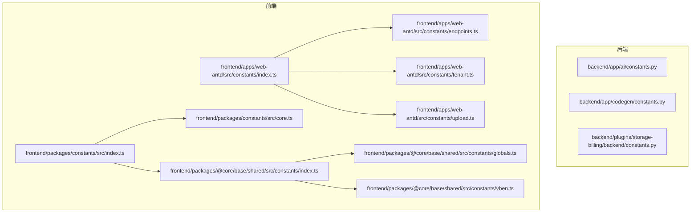
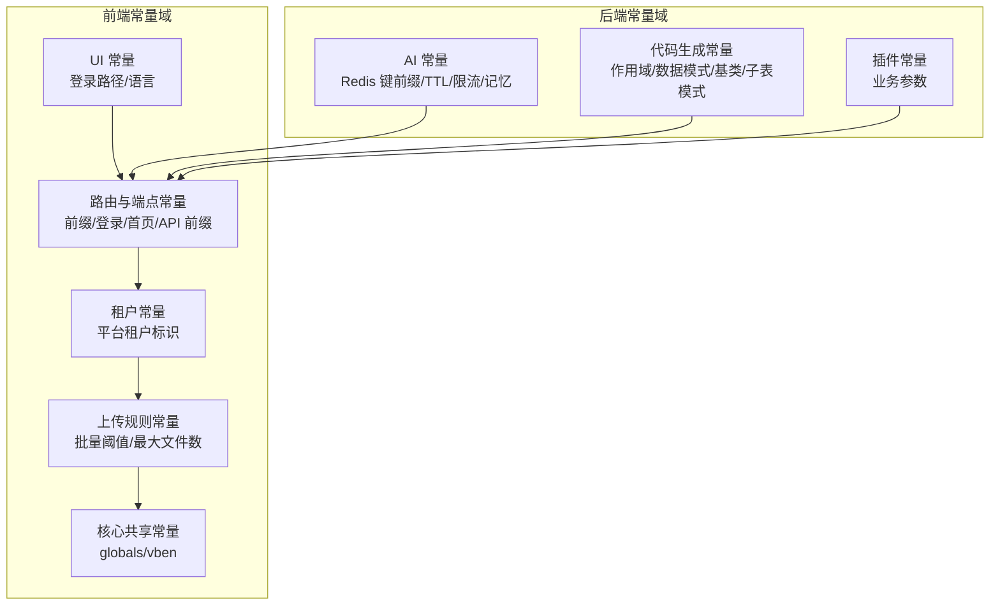
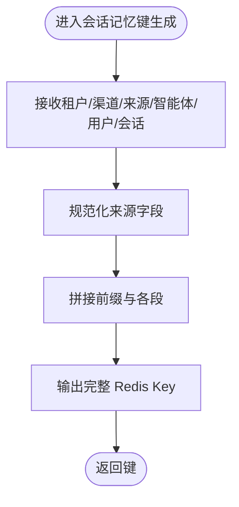
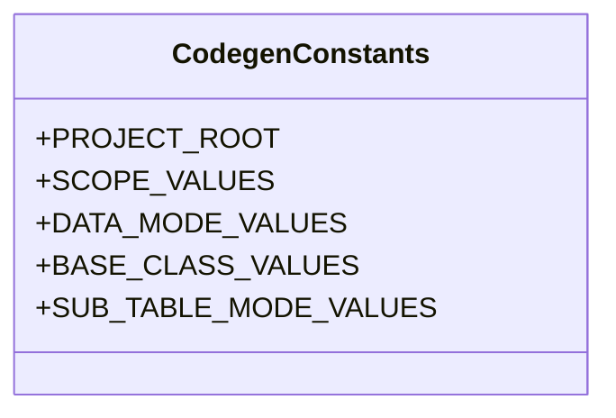
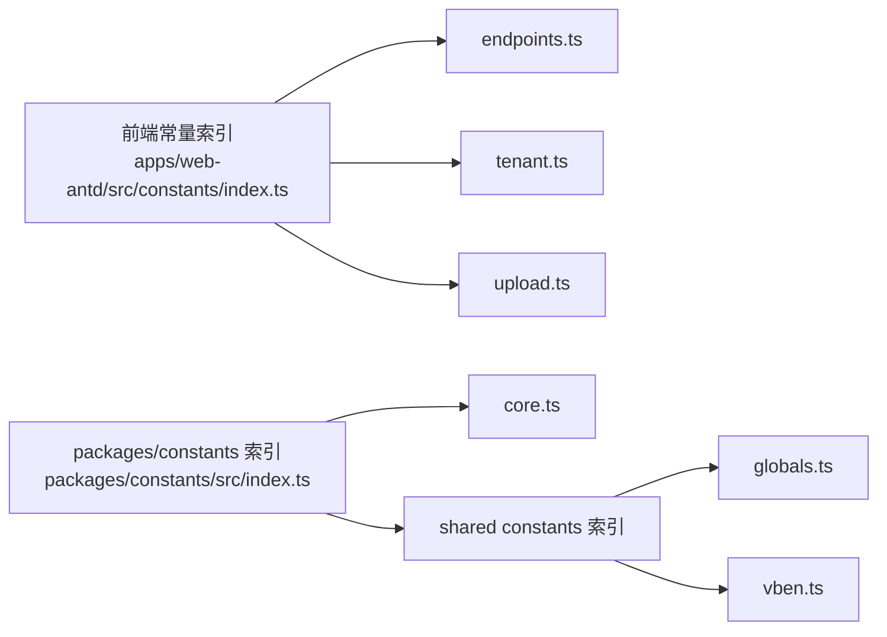

# 常量包 (constants)

<cite>
**本文引用的文件**
- [backend/app/ai/constants.py](file://backend/app/ai/constants.py)
- [backend/app/codegen/constants.py](file://backend/app/codegen/constants.py)
- [backend/plugins/storage-billing/backend/constants.py](file://backend/plugins/storage-billing/backend/constants.py)
- [frontend/apps/web-antd/src/constants/index.ts](file://frontend/apps/web-antd/src/constants/index.ts)
- [frontend/apps/web-antd/src/constants/endpoints.ts](file://frontend/apps/web-antd/src/constants/endpoints.ts)
- [frontend/apps/web-antd/src/constants/tenant.ts](file://frontend/apps/web-antd/src/constants/tenant.ts)
- [frontend/apps/web-antd/src/constants/upload.ts](file://frontend/apps/web-antd/src/constants/upload.ts)
- [frontend/packages/constants/src/index.ts](file://frontend/packages/constants/src/index.ts)
- [frontend/packages/constants/src/core.ts](file://frontend/packages/constants/src/core.ts)
- [frontend/packages/@core/base/shared/src/constants/globals.ts](file://frontend/packages/@core/base/shared/src/constants/globals.ts)
- [frontend/packages/@core/base/shared/src/constants/index.ts](file://frontend/packages/@core/base/shared/src/constants/index.ts)
- [frontend/packages/@core/base/shared/src/constants/vben.ts](file://frontend/packages/@core/base/shared/src/constants/vben.ts)
</cite>

## 目录
1. [引言](#引言)
2. [项目结构](#项目结构)
3. [核心组件](#核心组件)
4. [架构总览](#架构总览)
5. [详细组件分析](#详细组件分析)
6. [依赖分析](#依赖分析)
7. [性能考虑](#性能考虑)
8. [故障排查指南](#故障排查指南)
9. [结论](#结论)
10. [附录](#附录)

## 引言
本文件系统性梳理并文档化常量包（constants）在后端与前端的组织方式与使用规范，覆盖配置常量、UI常量、API常量与业务常量的分类与职责边界；明确命名规范、模块化管理策略、热更新支持与国际化处理建议，并提供最佳实践与注意事项，帮助团队在多模块、多语言、多租户场景下稳定地维护与扩展常量体系。

## 项目结构
常量包在前后端分别以“模块化 + 分类”的方式组织：
- 后端按功能域拆分常量文件，如 AI 模块、代码生成模块、插件模块等，便于职责隔离与变更影响面控制。
- 前端将常量按领域进一步细分（如端点路由、租户、上传规则），并通过统一出口导出，提升可发现性与一致性。

**图表来源**
- [frontend/apps/web-antd/src/constants/index.ts:1-13](file://frontend/apps/web-antd/src/constants/index.ts#L1-L13)
- [frontend/packages/constants/src/index.ts:1-3](file://frontend/packages/constants/src/index.ts#L1-L3)
- [backend/app/ai/constants.py:1-113](file://backend/app/ai/constants.py#L1-L113)
- [backend/app/codegen/constants.py:1-21](file://backend/app/codegen/constants.py#L1-L21)
- [backend/plugins/storage-billing/backend/constants.py](file://backend/plugins/storage-billing/backend/constants.py)

**章节来源**
- [frontend/apps/web-antd/src/constants/index.ts:1-13](file://frontend/apps/web-antd/src/constants/index.ts#L1-L13)
- [frontend/packages/constants/src/index.ts:1-3](file://frontend/packages/constants/src/index.ts#L1-L3)

## 核心组件
- 后端常量
  - AI 模块常量：集中定义 Redis Key 前缀、TTL、默认限流阈值、会话记忆场景与通道、会话内存键生成与匹配模式等。
  - 代码生成常量：定义项目根路径、端点作用域合法值、数据模式、基类选择、子表模式等。
  - 插件常量：以插件维度定义业务常量，便于插件独立演进与配置。
- 前端常量
  - 应用层常量：登录页路径、支持语言列表等。
  - 路由与端点常量：管理员/租户/用户前缀、登录与首页路径、API 前缀等。
  - 租户常量：平台租户标识等。
  - 上传规则常量：批量阈值、最大文件数等。
  - 核心共享常量：来自 @core/base/shared 的全局常量与框架常量。

**章节来源**
- [backend/app/ai/constants.py:1-113](file://backend/app/ai/constants.py#L1-L113)
- [backend/app/codegen/constants.py:1-21](file://backend/app/codegen/constants.py#L1-L21)
- [frontend/packages/constants/src/core.ts:1-24](file://frontend/packages/constants/src/core.ts#L1-L24)
- [frontend/apps/web-antd/src/constants/endpoints.ts](file://frontend/apps/web-antd/src/constants/endpoints.ts)
- [frontend/apps/web-antd/src/constants/tenant.ts:1-5](file://frontend/apps/web-antd/src/constants/tenant.ts#L1-L5)
- [frontend/apps/web-antd/src/constants/upload.ts](file://frontend/apps/web-antd/src/constants/upload.ts)
- [frontend/packages/@core/base/shared/src/constants/globals.ts](file://frontend/packages/@core/base/shared/src/constants/globals.ts)
- [frontend/packages/@core/base/shared/src/constants/vben.ts](file://frontend/packages/@core/base/shared/src/constants/vben.ts)

## 架构总览
常量包采用“按域分层 + 统一导出”的架构，确保：
- 变更隔离：不同域的常量独立维护，降低耦合。
- 使用一致：通过统一出口导出，避免散落导入带来的维护成本。
- 国际化与前端共享：前端常量与共享常量分层，便于 i18n 与跨应用复用。

**图表来源**
- [backend/app/ai/constants.py:1-113](file://backend/app/ai/constants.py#L1-L113)
- [backend/app/codegen/constants.py:1-21](file://backend/app/codegen/constants.py#L1-L21)
- [frontend/packages/constants/src/core.ts:1-24](file://frontend/packages/constants/src/core.ts#L1-L24)
- [frontend/apps/web-antd/src/constants/endpoints.ts](file://frontend/apps/web-antd/src/constants/endpoints.ts)
- [frontend/apps/web-antd/src/constants/tenant.ts:1-5](file://frontend/apps/web-antd/src/constants/tenant.ts#L1-L5)
- [frontend/apps/web-antd/src/constants/upload.ts](file://frontend/apps/web-antd/src/constants/upload.ts)
- [frontend/packages/@core/base/shared/src/constants/globals.ts](file://frontend/packages/@core/base/shared/src/constants/globals.ts)
- [frontend/packages/@core/base/shared/src/constants/vben.ts](file://frontend/packages/@core/base/shared/src/constants/vben.ts)

## 详细组件分析

### 后端：AI 模块常量
- 职责边界
  - 集中管理 Redis Key 命名空间、TTL、默认限流阈值与会话记忆键生成逻辑。
  - 提供键模式函数，便于按租户/会话维度进行清理与扫描。
- 关键要素
  - 动作频率限制键前缀与窗口 TTL。
  - 默认动作频率限制阈值。
  - 记忆场景与通道枚举。
  - 会话记忆键前缀、TTL 与生成/匹配函数族。
- 设计要点
  - 使用前缀与占位符约定统一键结构，利于缓存清理与可观测性。
  - 通过模式函数实现按租户或会话维度的批量操作。
  - 通过 __all__ 显式导出，避免误用未暴露的内部常量。

**图表来源**
- [backend/app/ai/constants.py:66-79](file://backend/app/ai/constants.py#L66-L79)

**章节来源**
- [backend/app/ai/constants.py:1-113](file://backend/app/ai/constants.py#L1-L113)

### 后端：代码生成常量
- 职责边界
  - 定义代码生成器的项目根路径与若干枚举集合，保证生成器行为的一致性与可验证性。
- 关键要素
  - 项目根目录定位。
  - 作用域、数据模式、基类、子表模式的合法值集合。

**图表来源**
- [backend/app/codegen/constants.py:1-21](file://backend/app/codegen/constants.py#L1-L21)

**章节来源**
- [backend/app/codegen/constants.py:1-21](file://backend/app/codegen/constants.py#L1-L21)

### 后端：插件常量（示例：storage-billing）
- 职责边界
  - 插件域内业务常量，例如任务执行历史条数上限等。
- 使用建议
  - 与插件生命周期、配置项协同，避免硬编码在业务逻辑中。

**章节来源**
- [backend/plugins/storage-billing/backend/constants.py](file://backend/plugins/storage-billing/backend/constants.py)

### 前端：应用层常量（core）
- 职责边界
  - 应用级基础常量，如登录路径、支持语言列表等。
- 设计要点
  - 语言选项接口化，便于扩展与校验。

**章节来源**
- [frontend/packages/constants/src/core.ts:1-24](file://frontend/packages/constants/src/core.ts#L1-L24)

### 前端：路由与端点常量
- 职责边界
  - 管理管理员、租户、用户三类路由前缀与登录/首页路径，以及 API 前缀。
- 使用建议
  - 所有路由与 API 调用应基于这些常量，避免魔法字符串。

**章节来源**
- [frontend/apps/web-antd/src/constants/endpoints.ts](file://frontend/apps/web-antd/src/constants/endpoints.ts)

### 前端：租户常量
- 职责边界
  - 平台级租户标识常量，用于区分平台租户与其他租户。
- 使用建议
  - 在鉴权与资源隔离处统一引用该常量。

**章节来源**
- [frontend/apps/web-antd/src/constants/tenant.ts:1-5](file://frontend/apps/web-antd/src/constants/tenant.ts#L1-L5)

### 前端：上传规则常量
- 职责边界
  - 上传批量阈值与最大文件数量等规则常量。
- 使用建议
  - 与前端组件与后端策略联动，保持两端一致。

**章节来源**
- [frontend/apps/web-antd/src/constants/upload.ts](file://frontend/apps/web-antd/src/constants/upload.ts)

### 前端：核心共享常量（@core/base/shared）
- 职责边界
  - 全局常量与框架常量，供多应用共享。
- 使用建议
  - 仅在必要时扩展，避免污染全局常量域。

**章节来源**
- [frontend/packages/@core/base/shared/src/constants/globals.ts](file://frontend/packages/@core/base/shared/src/constants/globals.ts)
- [frontend/packages/@core/base/shared/src/constants/vben.ts](file://frontend/packages/@core/base/shared/src/constants/vben.ts)

## 依赖分析
- 导出与聚合
  - 前端通过统一索引导出各领域常量，减少分散导入。
  - 后端通过模块内 __all__ 控制导出范围，避免泄露内部细节。
- 外部依赖
  - 前端共享常量依赖 @core/base/shared，需关注版本升级与兼容性。
- 潜在风险
  - 常量命名冲突、重复定义、跨域滥用（如将后端 Redis 前缀直接用于前端）。

**图表来源**
- [frontend/apps/web-antd/src/constants/index.ts:1-13](file://frontend/apps/web-antd/src/constants/index.ts#L1-L13)
- [frontend/packages/constants/src/index.ts:1-3](file://frontend/packages/constants/src/index.ts#L1-L3)

**章节来源**
- [frontend/apps/web-antd/src/constants/index.ts:1-13](file://frontend/apps/web-antd/src/constants/index.ts#L1-L13)
- [frontend/packages/constants/src/index.ts:1-3](file://frontend/packages/constants/src/index.ts#L1-L3)

## 性能考虑
- Redis 命名规范
  - 使用前缀与占位符，便于批量扫描与清理，降低键空间碎片化风险。
- TTL 与清理
  - 会话记忆 TTL 与定期清理策略需与业务峰值流量匹配，避免内存压力。
- 枚举与集合
  - 使用不可变集合（如 frozenset）约束合法值，减少分支判断与错误传播。

[本节为通用指导，不直接分析具体文件]

## 故障排查指南
- 常量未生效
  - 检查是否从统一索引正确导出与引用。
  - 确认 __all__ 是否包含目标常量（后端）。
- 路由/端点异常
  - 对照端点常量，确认前缀与路径是否一致。
- 国际化显示异常
  - 检查语言选项与 i18n 资源映射，确保值与资源键一致。
- 插件常量不一致
  - 对比插件域内常量与插件配置项，避免硬编码覆盖配置。

**章节来源**
- [frontend/packages/constants/src/core.ts:1-24](file://frontend/packages/constants/src/core.ts#L1-L24)
- [frontend/apps/web-antd/src/constants/endpoints.ts](file://frontend/apps/web-antd/src/constants/endpoints.ts)

## 结论
常量包通过“域内聚、域间分”的策略实现了清晰的职责边界与良好的可维护性。建议持续遵循命名规范、统一导出与最小暴露原则，并结合国际化与共享常量策略，逐步完善热更新与动态配置能力，以支撑多租户、多语言、多插件的复杂场景。

[本节为总结性内容，不直接分析具体文件]

## 附录

### 命名规范与组织结构
- 命名规范
  - 域内前缀：如 ai:、codegen:、plugin-name:，用于区分域与避免冲突。
  - 常量全大写 + 下划线，函数小驼峰，类型接口首字母大写。
- 组织结构
  - 后端：按模块拆分常量文件，模块内 __all__ 明确导出。
  - 前端：按领域拆分文件并通过索引导出，核心共享常量集中管理。

**章节来源**
- [backend/app/ai/constants.py:1-113](file://backend/app/ai/constants.py#L1-L113)
- [frontend/apps/web-antd/src/constants/index.ts:1-13](file://frontend/apps/web-antd/src/constants/index.ts#L1-L13)
- [frontend/packages/constants/src/index.ts:1-3](file://frontend/packages/constants/src/index.ts#L1-L3)

### 维护策略与最佳实践
- 最小暴露：仅导出必要常量，隐藏内部实现细节。
- 一致性：统一前缀、命名与注释风格，跨域保持一致。
- 版本化：涉及共享常量时，注意版本升级与兼容性。
- 测试：对关键常量（如端点、枚举集合）增加单元测试或契约测试。

**章节来源**
- [backend/app/codegen/constants.py:1-21](file://backend/app/codegen/constants.py#L1-L21)
- [frontend/packages/@core/base/shared/src/constants/index.ts](file://frontend/packages/@core/base/shared/src/constants/index.ts)

### 热更新与国际化处理建议
- 热更新
  - 将可变配置迁移到配置中心或数据库，常量仅保留不变值。
  - 对于前端常量，可通过运行时注入或动态加载策略实现有限热更新。
- 国际化
  - 语言选项与文案资源解耦，常量仅承载值与映射关系。
  - 与 i18n 层协作，确保常量值与资源键一一对应。

[本节为通用指导，不直接分析具体文件]