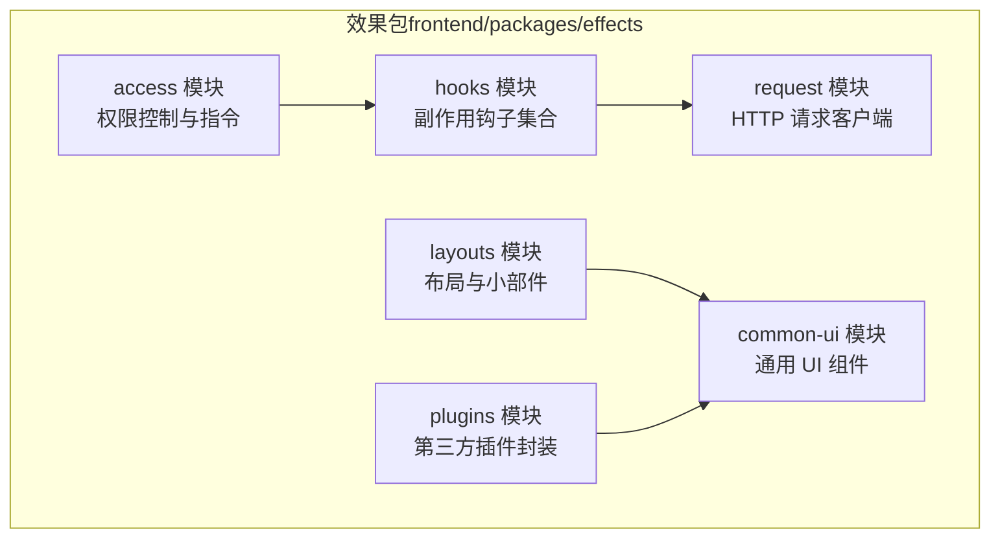
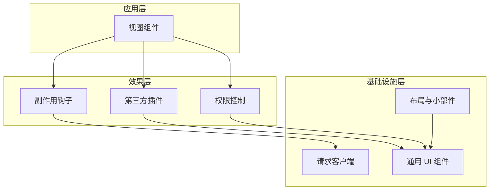
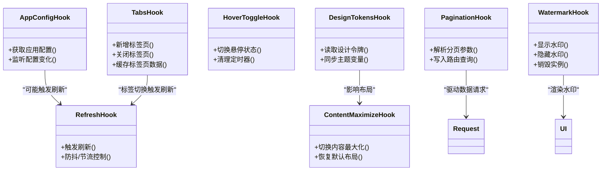
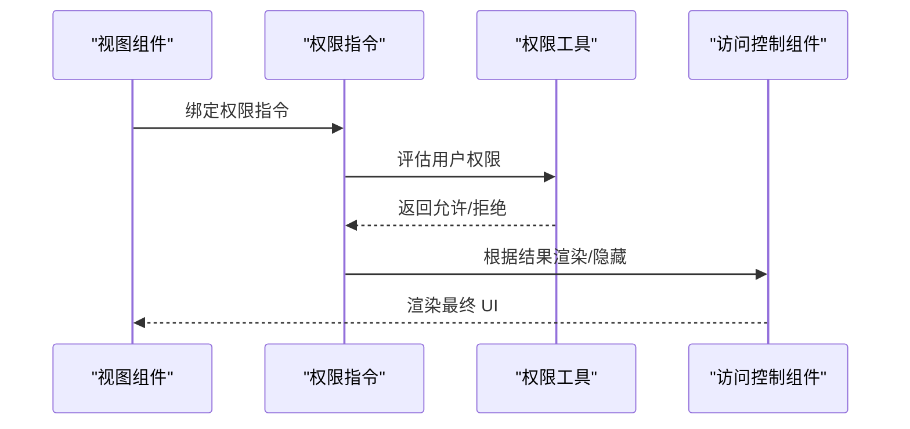
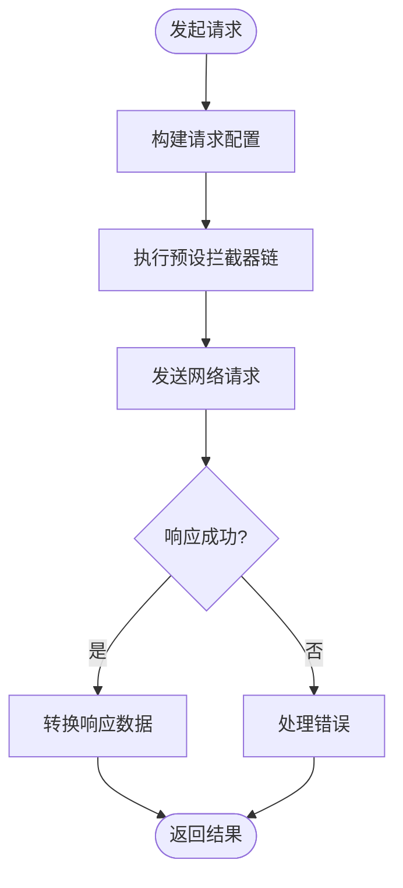
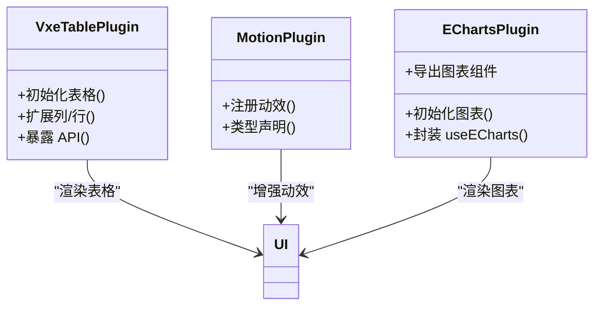

# 效果包（effects）

<cite>
**本文引用的文件**
- [frontend/packages/effects/hooks/src/index.ts](file://frontend/packages/effects/hooks/src/index.ts)
- [frontend/packages/effects/hooks/src/use-app-config.ts](file://frontend/packages/effects/hooks/src/use-app-config.ts)
- [frontend/packages/effects/hooks/src/use-content-maximize.ts](file://frontend/packages/effects/hooks/src/use-content-maximize.ts)
- [frontend/packages/effects/hooks/src/use-design-tokens.ts](file://frontend/packages/effects/hooks/src/use-design-tokens.ts)
- [frontend/packages/effects/hooks/src/use-hover-toggle.ts](file://frontend/packages/effects/hooks/src/use-hover-toggle.ts)
- [frontend/packages/effects/hooks/src/use-pagination.ts](file://frontend/packages/effects/hooks/src/use-pagination.ts)
- [frontend/packages/effects/hooks/src/use-refresh.ts](file://frontend/packages/effects/hooks/src/use-refresh.ts)
- [frontend/packages/effects/hooks/src/use-tabs.ts](file://frontend/packages/effects/hooks/src/use-tabs.ts)
- [frontend/packages/effects/hooks/src/use-watermark.ts](file://frontend/packages/effects/hooks/src/use-watermark.ts)
- [frontend/packages/effects/access/src/index.ts](file://frontend/packages/effects/access/src/index.ts)
- [frontend/packages/effects/access/src/use-access.ts](file://frontend/packages/effects/access/src/use-access.ts)
- [frontend/packages/effects/access/src/directive.ts](file://frontend/packages/effects/access/src/directive.ts)
- [frontend/packages/effects/access/src/accessible.ts](file://frontend/packages/effects/access/src/accessible.ts)
- [frontend/packages/effects/access/src/access-control.vue](file://frontend/packages/effects/access/src/access-control.vue)
- [frontend/packages/effects/request/src/index.ts](file://frontend/packages/effects/request/src/index.ts)
- [frontend/packages/effects/request/src/request-client/request-client.ts](file://frontend/packages/effects/request/src/request-client/request-client.ts)
- [frontend/packages/effects/request/src/request-client/preset-interceptors.ts](file://frontend/packages/effects/request/src/request-client/preset-interceptors.ts)
- [frontend/packages/effects/request/src/request-client/types.ts](file://frontend/packages/effects/request/src/request-client/types.ts)
- [frontend/packages/effects/common-ui/src/index.ts](file://frontend/packages/effects/common-ui/src/index.ts)
- [frontend/packages/effects/common-ui/src/components/loading/index.ts](file://frontend/packages/effects/common-ui/src/components/loading/index.ts)
- [frontend/packages/effects/common-ui/src/components/loading/loading.vue](file://frontend/packages/effects/common-ui/src/components/loading/loading.vue)
- [frontend/packages/effects/common-ui/src/components/page/index.ts](file://frontend/packages/effects/common-ui/src/components/page/index.ts)
- [frontend/packages/effects/common-ui/src/components/page/page.vue](file://frontend/packages/effects/common-ui/src/components/page/page.vue)
- [frontend/packages/effects/common-ui/src/ui/authentication/form.vue](file://frontend/packages/effects/common-ui/src/ui/authentication/form.vue)
- [frontend/packages/effects/common-ui/src/ui/dashboard/index.ts](file://frontend/packages/effects/common-ui/src/ui/dashboard/index.ts)
- [frontend/packages/effects/common-ui/src/ui/fallback/index.ts](file://frontend/packages/effects/common-ui/src/ui/fallback/index.ts)
- [frontend/packages/effects/layouts/src/basic/layout.vue](file://frontend/packages/effects/layouts/src/basic/layout.vue)
- [frontend/packages/effects/layouts/src/basic/content/index.ts](file://frontend/packages/effects/layouts/src/basic/content/index.ts)
- [frontend/packages/effects/layouts/src/basic/content/content.vue](file://frontend/packages/effects/layouts/src/basic/content/content.vue)
- [frontend/packages/effects/layouts/src/widgets/breadcrumb.vue](file://frontend/packages/effects/layouts/src/widgets/breadcrumb.vue)
- [frontend/packages/effects/plugins/src/vxe-table/init.ts](file://frontend/packages/effects/plugins/src/vxe-table/init.ts)
- [frontend/packages/effects/plugins/src/vxe-table/use-vxe-grid.ts](file://frontend/packages/effects/plugins/src/vxe-table/use-vxe-grid.ts)
- [frontend/packages/effects/plugins/src/vxe-table/types.ts](file://frontend/packages/effects/plugins/src/vxe-table/types.ts)
- [frontend/packages/effects/plugins/src/vxe-table/api.ts](file://frontend/packages/effects/plugins/src/vxe-table/api.ts)
- [frontend/packages/effects/plugins/src/vxe-table/extends.ts](file://frontend/packages/effects/plugins/src/vxe-table/extends.ts)
- [frontend/packages/effects/plugins/src/vxe-table/use-vxe-grid.test.ts](file://frontend/packages/effects/plugins/src/vxe-table/use-vxe-grid.test.ts)
- [frontend/packages/effects/plugins/src/motion/index.ts](file://frontend/packages/effects/plugins/src/motion/index.ts)
- [frontend/packages/effects/plugins/src/motion/types.ts](file://frontend/packages/effects/plugins/src/motion/types.ts)
- [frontend/packages/effects/plugins/src/echarts/echarts.ts](file://frontend/packages/effects/plugins/src/echarts/echarts.ts)
- [frontend/packages/effects/plugins/src/echarts/use-echarts.ts](file://frontend/packages/effects/plugins/src/echarts/use-echarts.ts)
- [frontend/packages/effects/plugins/src/echarts/index.ts](file://frontend/packages/effects/plugins/src/echarts/index.ts)
- [frontend/packages/effects/plugins/src/echarts/echarts-ui.vue](file://frontend/packages/effects/plugins/src/echarts/echarts-ui.vue)
- [frontend/packages/effects/README.md](file://frontend/packages/effects/README.md)
</cite>

## 目录
1. [简介](#简介)
2. [项目结构](#项目结构)
3. [核心组件](#核心组件)
4. [架构总览](#架构总览)
5. [详细组件分析](#详细组件分析)
6. [依赖分析](#依赖分析)
7. [性能考虑](#性能考虑)
8. [故障排查指南](#故障排查指南)
9. [结论](#结论)
10. [附录](#附录)

## 简介
本技术文档围绕前端“效果包（effects）”展开，系统性梳理并说明以下方面：
- 副作用处理函数与效果函数的实现与职责边界
- 异步操作、状态变更与副作用管理的工具函数
- 效果函数的生命周期管理、错误处理与取消机制
- 使用示例与集成方法
- 副作用安全处理、性能优化与内存管理策略

效果包位于前端工作区的 packages/effects 目录下，采用模块化组织：hooks 提供可复用的副作用钩子；access 提供权限控制能力；request 提供请求客户端与拦截器；common-ui 提供通用 UI 组件；layouts 提供布局与小部件；plugins 提供第三方插件封装（如 vxe-table、motion、echarts）。

## 项目结构
效果包按功能域划分模块，每个模块独立导出入口与类型定义，便于按需引入与 Tree-shaking。

图表来源
- [frontend/packages/effects/hooks/src/index.ts](file://frontend/packages/effects/hooks/src/index.ts)
- [frontend/packages/effects/access/src/index.ts](file://frontend/packages/effects/access/src/index.ts)
- [frontend/packages/effects/request/src/index.ts](file://frontend/packages/effects/request/src/index.ts)
- [frontend/packages/effects/common-ui/src/index.ts](file://frontend/packages/effects/common-ui/src/index.ts)
- [frontend/packages/effects/layouts/src/basic/layout.vue](file://frontend/packages/effects/layouts/src/basic/layout.vue)
- [frontend/packages/effects/plugins/src/vxe-table/init.ts](file://frontend/packages/effects/plugins/src/vxe-table/init.ts)

章节来源
- [frontend/packages/effects/README.md](file://frontend/packages/effects/README.md)

## 核心组件
本节聚焦 effect 包中的副作用钩子与权限控制模块，说明其职责、典型用法与注意事项。

- 副作用钩子（hooks）
  - 应用配置获取与响应式更新
  - 内容最大化/最小化切换
  - 设计令牌读取与主题联动
  - 鼠标悬停状态切换
  - 分页参数与路由联动
  - 刷新触发与数据重载
  - 标签页管理与缓存
  - 水印显示与隐藏

- 权限控制（access）
  - 权限访问判断与指令绑定
  - 可访问性工具函数
  - 访问控制组件封装

章节来源
- [frontend/packages/effects/hooks/src/use-app-config.ts](file://frontend/packages/effects/hooks/src/use-app-config.ts)
- [frontend/packages/effects/hooks/src/use-content-maximize.ts](file://frontend/packages/effects/hooks/src/use-content-maximize.ts)
- [frontend/packages/effects/hooks/src/use-design-tokens.ts](file://frontend/packages/effects/hooks/src/use-design-tokens.ts)
- [frontend/packages/effects/hooks/src/use-hover-toggle.ts](file://frontend/packages/effects/hooks/src/use-hover-toggle.ts)
- [frontend/packages/effects/hooks/src/use-pagination.ts](file://frontend/packages/effects/hooks/src/use-pagination.ts)
- [frontend/packages/effects/hooks/src/use-refresh.ts](file://frontend/packages/effects/hooks/src/use-refresh.ts)
- [frontend/packages/effects/hooks/src/use-tabs.ts](file://frontend/packages/effects/hooks/src/use-tabs.ts)
- [frontend/packages/effects/hooks/src/use-watermark.ts](file://frontend/packages/effects/hooks/src/use-watermark.ts)
- [frontend/packages/effects/access/src/use-access.ts](file://frontend/packages/effects/access/src/use-access.ts)
- [frontend/packages/effects/access/src/directive.ts](file://frontend/packages/effects/access/src/directive.ts)
- [frontend/packages/effects/access/src/accessible.ts](file://frontend/packages/effects/access/src/accessible.ts)
- [frontend/packages/effects/access/src/access-control.vue](file://frontend/packages/effects/access/src/access-control.vue)

## 架构总览
效果包通过“钩子 + 插件 + 请求 + 权限 + UI”的分层设计，形成可组合、可扩展的前端效果体系。下图展示核心交互关系：

图表来源
- [frontend/packages/effects/hooks/src/index.ts](file://frontend/packages/effects/hooks/src/index.ts)
- [frontend/packages/effects/access/src/index.ts](file://frontend/packages/effects/access/src/index.ts)
- [frontend/packages/effects/request/src/request-client/request-client.ts](file://frontend/packages/effects/request/src/request-client/request-client.ts)
- [frontend/packages/effects/common-ui/src/index.ts](file://frontend/packages/effects/common-ui/src/index.ts)
- [frontend/packages/effects/layouts/src/basic/layout.vue](file://frontend/packages/effects/layouts/src/basic/layout.vue)

## 详细组件分析

### 副作用钩子（hooks）类图
以下类图抽象了 hooks 模块中各钩子的职责与关系，帮助理解副作用的生命周期与协作模式。

图表来源
- [frontend/packages/effects/hooks/src/use-app-config.ts](file://frontend/packages/effects/hooks/src/use-app-config.ts)
- [frontend/packages/effects/hooks/src/use-content-maximize.ts](file://frontend/packages/effects/hooks/src/use-content-maximize.ts)
- [frontend/packages/effects/hooks/src/use-design-tokens.ts](file://frontend/packages/effects/hooks/src/use-design-tokens.ts)
- [frontend/packages/effects/hooks/src/use-hover-toggle.ts](file://frontend/packages/effects/hooks/src/use-hover-toggle.ts)
- [frontend/packages/effects/hooks/src/use-pagination.ts](file://frontend/packages/effects/hooks/src/use-pagination.ts)
- [frontend/packages/effects/hooks/src/use-refresh.ts](file://frontend/packages/effects/hooks/src/use-refresh.ts)
- [frontend/packages/effects/hooks/src/use-tabs.ts](file://frontend/packages/effects/hooks/src/use-tabs.ts)
- [frontend/packages/effects/hooks/src/use-watermark.ts](file://frontend/packages/effects/hooks/src/use-watermark.ts)

章节来源
- [frontend/packages/effects/hooks/src/index.ts](file://frontend/packages/effects/hooks/src/index.ts)

### 权限控制（access）序列图
权限控制模块通过指令与工具函数实现细粒度的可见性与可用性控制，典型流程如下：

图表来源
- [frontend/packages/effects/access/src/directive.ts](file://frontend/packages/effects/access/src/directive.ts)
- [frontend/packages/effects/access/src/accessible.ts](file://frontend/packages/effects/access/src/accessible.ts)
- [frontend/packages/effects/access/src/access-control.vue](file://frontend/packages/effects/access/src/access-control.vue)

章节来源
- [frontend/packages/effects/access/src/index.ts](file://frontend/packages/effects/access/src/index.ts)

### 请求客户端（request）流程图
请求客户端负责统一的网络请求与拦截器链路，支持预设拦截器与类型约束。

图表来源
- [frontend/packages/effects/request/src/request-client/request-client.ts](file://frontend/packages/effects/request/src/request-client/request-client.ts)
- [frontend/packages/effects/request/src/request-client/preset-interceptors.ts](file://frontend/packages/effects/request/src/request-client/preset-interceptors.ts)
- [frontend/packages/effects/request/src/request-client/types.ts](file://frontend/packages/effects/request/src/request-client/types.ts)

章节来源
- [frontend/packages/effects/request/src/index.ts](file://frontend/packages/effects/request/src/index.ts)

### 插件封装（plugins）类图
插件模块对第三方库进行统一封装，提供初始化、类型与 API 扩展能力。

图表来源
- [frontend/packages/effects/plugins/src/vxe-table/init.ts](file://frontend/packages/effects/plugins/src/vxe-table/init.ts)
- [frontend/packages/effects/plugins/src/vxe-table/types.ts](file://frontend/packages/effects/plugins/src/vxe-table/types.ts)
- [frontend/packages/effects/plugins/src/vxe-table/api.ts](file://frontend/packages/effects/plugins/src/vxe-table/api.ts)
- [frontend/packages/effects/plugins/src/motion/index.ts](file://frontend/packages/effects/plugins/src/motion/index.ts)
- [frontend/packages/effects/plugins/src/motion/types.ts](file://frontend/packages/effects/plugins/src/motion/types.ts)
- [frontend/packages/effects/plugins/src/echarts/echarts.ts](file://frontend/packages/effects/plugins/src/echarts/echarts.ts)
- [frontend/packages/effects/plugins/src/echarts/use-echarts.ts](file://frontend/packages/effects/plugins/src/echarts/use-echarts.ts)
- [frontend/packages/effects/plugins/src/echarts/index.ts](file://frontend/packages/effects/plugins/src/echarts/index.ts)
- [frontend/packages/effects/plugins/src/echarts/echarts-ui.vue](file://frontend/packages/effects/plugins/src/echarts/echarts-ui.vue)

章节来源
- [frontend/packages/effects/plugins/src/vxe-table/use-vxe-grid.ts](file://frontend/packages/effects/plugins/src/vxe-table/use-vxe-grid.ts)

## 依赖分析
- 模块内聚与耦合
  - hooks 与 request 存在使用关系，但通过类型约束解耦
  - access 与 common-ui 的访问控制组件存在渲染耦合，但逻辑上可分离
  - plugins 对 UI 与第三方库有直接依赖，建议保持接口稳定以降低升级成本

- 外部依赖与集成点
  - 插件模块依赖第三方库（如表格、图表），版本升级需关注 API 变更
  - 请求客户端依赖拦截器链，新增拦截器需遵循现有顺序与职责划分

- 循环依赖风险
  - 当前结构未发现循环导入；若后续扩展，应避免 hooks 与 plugins 的双向依赖

章节来源
- [frontend/packages/effects/hooks/src/use-refresh.ts](file://frontend/packages/effects/hooks/src/use-refresh.ts)
- [frontend/packages/effects/request/src/request-client/request-client.ts](file://frontend/packages/effects/request/src/request-client/request-client.ts)
- [frontend/packages/effects/plugins/src/vxe-table/init.ts](file://frontend/packages/effects/plugins/src/vxe-table/init.ts)

## 性能考虑
- 副作用钩子
  - 避免在高频事件中直接触发昂贵计算或网络请求，必要时结合防抖/节流
  - 合理使用响应式状态，减少不必要的重渲染

- 请求客户端
  - 利用拦截器链实现统一缓存与去重，降低重复请求
  - 对长列表或大对象传输，优先考虑分页与增量加载

- 插件封装
  - 表格与图表组件应延迟初始化与懒加载，避免首屏阻塞
  - 动效与动画应根据设备性能动态调整

- 权限控制
  - 指令评估尽量轻量化，避免在渲染路径中执行复杂逻辑

## 故障排查指南
- 常见问题与定位
  - 请求失败：检查拦截器链是否正确传递错误信息，确认异常处理分支
  - 权限不生效：核对指令绑定与权限工具的评估结果，确保上下文一致
  - 插件初始化异常：确认初始化顺序与依赖版本，查看控制台错误堆栈

- 调试建议
  - 在 hooks 中增加日志输出，定位状态变更时机
  - 使用浏览器开发者工具监控网络请求与渲染性能
  - 对插件 API 进行单元测试，覆盖边界条件

章节来源
- [frontend/packages/effects/request/src/request-client/preset-interceptors.ts](file://frontend/packages/effects/request/src/request-client/preset-interceptors.ts)
- [frontend/packages/effects/access/src/directive.ts](file://frontend/packages/effects/access/src/directive.ts)
- [frontend/packages/effects/plugins/src/vxe-table/use-vxe-grid.test.ts](file://frontend/packages/effects/plugins/src/vxe-table/use-vxe-grid.test.ts)

## 结论
效果包通过模块化的钩子、权限、请求与插件体系，提供了可复用且易于扩展的前端效果能力。遵循本文档的生命周期管理、错误处理与性能优化建议，可在保证安全性的同时提升开发效率与用户体验。

## 附录
- 使用示例与集成方法
  - 在组件中引入 hooks 并按需调用，例如应用配置、分页、标签页等
  - 使用权限指令快速控制元素可见性与交互能力
  - 通过请求客户端统一处理网络请求，配合拦截器实现横切能力
  - 在需要时引入插件模块，按需初始化第三方库并封装为可复用组件

- 最佳实践
  - 明确副作用钩子的职责边界，避免过度耦合
  - 在插件封装中保持稳定的对外接口，便于版本演进
  - 对关键流程添加可观测性与可调试性，便于问题定位