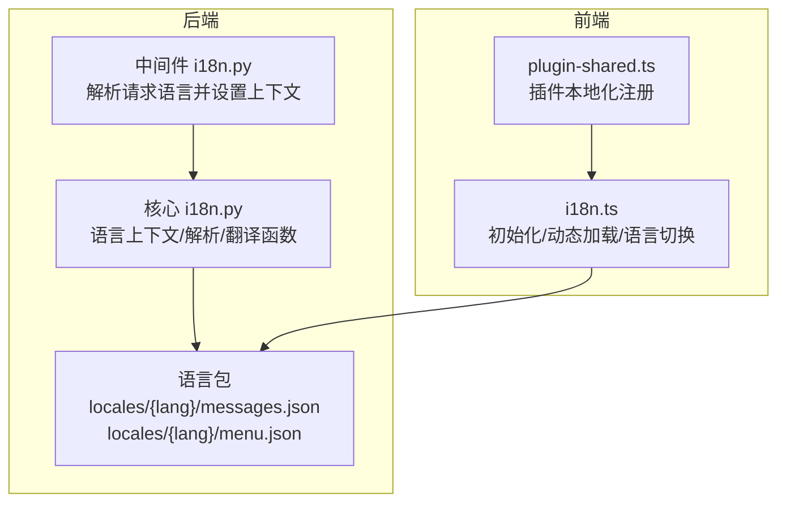
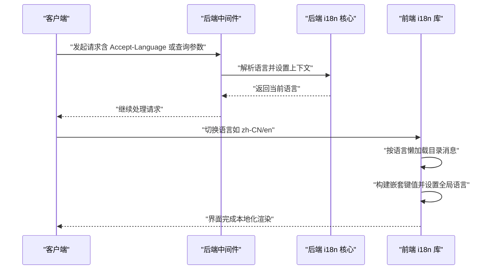
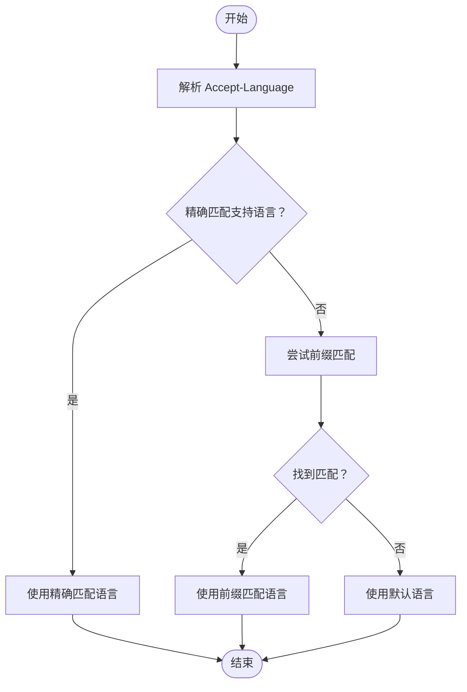
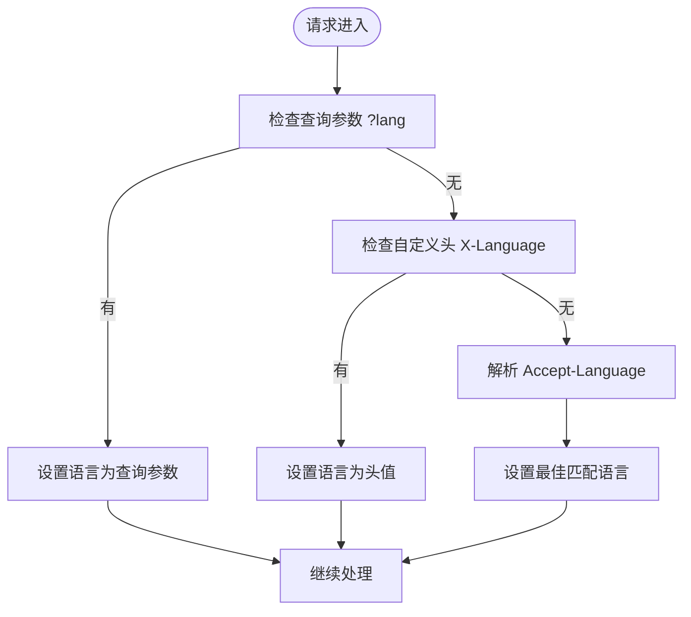
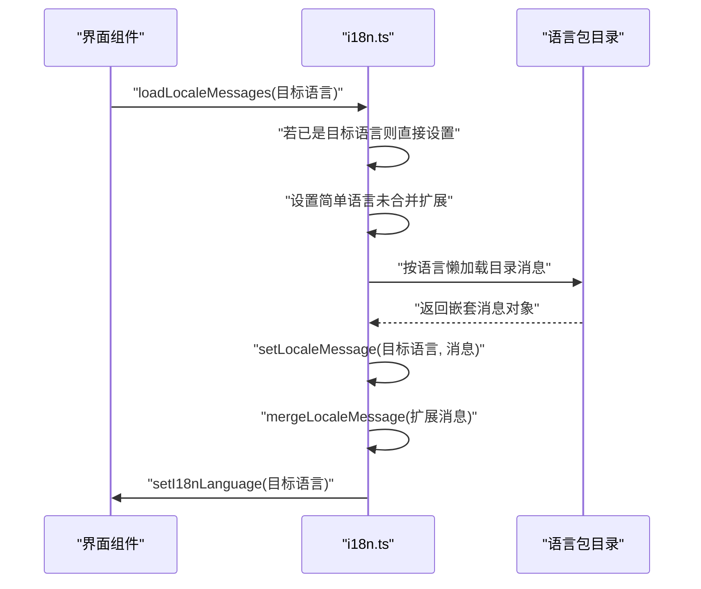
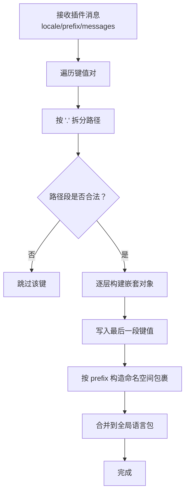
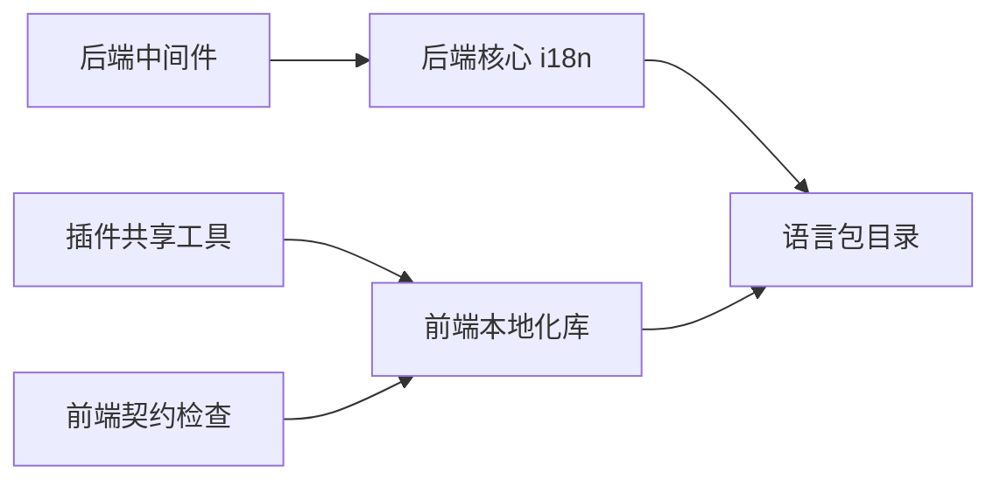

# 本地化包 (locales)

<cite>
**本文引用的文件**
- [backend/app/core/i18n.py](file://backend/app/core/i18n.py)
- [backend/app/middleware/i18n.py](file://backend/app/middleware/i18n.py)
- [backend/app/locales/zh_CN/messages.json](file://backend/app/locales/zh_CN/messages.json)
- [backend/app/locales/zh_CN/menu.json](file://backend/app/locales/zh_CN/menu.json)
- [backend/app/locales/en/messages.json](file://backend/app/locales/en/messages.json)
- [backend/app/locales/en/menu.json](file://backend/app/locales/en/menu.json)
- [frontend/packages/locales/src/i18n.ts](file://frontend/packages/locales/src/i18n.ts)
- [frontend/apps/web-antd/src/utils/plugin-shared.ts](file://frontend/apps/web-antd/src/utils/plugin-shared.ts)
- [backend/app/plugins/frontend_contract_checks.py](file://backend/app/plugins/frontend_contract_checks.py)
</cite>

## 目录
1. [简介](#简介)
2. [项目结构](#项目结构)
3. [核心组件](#核心组件)
4. [架构总览](#架构总览)
5. [详细组件分析](#详细组件分析)
6. [依赖关系分析](#依赖关系分析)
7. [性能考量](#性能考量)
8. [故障排查指南](#故障排查指南)
9. [结论](#结论)
10. [附录](#附录)

## 简介
本文件系统性地记录了后端与前端的本地化（国际化）实现与配置方法，覆盖以下方面：
- 后端多语言支持与语言上下文管理
- 前端基于 Vue I18n 的动态加载与命名空间合并
- 语言包结构与翻译键值管理
- 动态加载机制与插件本地化注册
- 回退机制与最佳实践
- 文本提取与翻译工作流建议
- 语言切换与性能优化策略

## 项目结构
本地化相关文件分布于后端与前端两个部分：
- 后端
  - 核心国际化模块：负责语言解析、上下文管理、翻译函数与文件加载缓存
  - 中间件：从请求中解析语言并注入上下文
  - 语言包：按语言分目录存放菜单与消息两类 JSON 文件
- 前端
  - 本地化库封装：统一的 i18n 初始化、语言切换、动态加载与缺失键处理
  - 插件本地化注册：将插件提供的键值按命名空间合并进全局语言包

**图表来源**
- [backend/app/middleware/i18n.py:1-41](file://backend/app/middleware/i18n.py#L1-L41)
- [backend/app/core/i18n.py:1-289](file://backend/app/core/i18n.py#L1-L289)
- [frontend/packages/locales/src/i18n.ts:52-187](file://frontend/packages/locales/src/i18n.ts#L52-L187)
- [frontend/apps/web-antd/src/utils/plugin-shared.ts:260-297](file://frontend/apps/web-antd/src/utils/plugin-shared.ts#L260-L297)

**章节来源**
- [backend/app/middleware/i18n.py:1-41](file://backend/app/middleware/i18n.py#L1-L41)
- [backend/app/core/i18n.py:1-289](file://backend/app/core/i18n.py#L1-L289)
- [frontend/packages/locales/src/i18n.ts:52-187](file://frontend/packages/locales/src/i18n.ts#L52-L187)
- [frontend/apps/web-antd/src/utils/plugin-shared.ts:260-297](file://frontend/apps/web-antd/src/utils/plugin-shared.ts#L260-L297)

## 核心组件
- 后端核心国际化模块
  - 语言上下文：使用上下文变量保存当前请求语言
  - 支持语言与默认语言：维护支持列表与默认值
  - 语言解析：解析 Accept-Language 头，支持精确与前缀匹配
  - 翻译函数：提供便捷的翻译入口
  - 文件加载与缓存：基于 LRU 缓存加载与合并语言包
- 后端国际化中间件
  - 从查询参数、自定义头、Accept-Language 顺序解析语言
  - 将解析结果写入上下文，供后续服务使用
- 前端本地化库
  - 初始化：挂载 i18n 插件，加载默认语言，设置缺失键处理
  - 动态加载：按语言懒加载对应目录下的消息文件，构建嵌套结构
  - 语言切换：更新全局语言并设置 HTML lang 属性
  - 合并扩展：允许在运行时合并额外消息（如插件）
- 插件本地化注册
  - 将插件提供的扁平键值转换为嵌套结构，并按命名空间合并到全局

**章节来源**
- [backend/app/core/i18n.py:1-289](file://backend/app/core/i18n.py#L1-L289)
- [backend/app/middleware/i18n.py:1-41](file://backend/app/middleware/i18n.py#L1-L41)
- [frontend/packages/locales/src/i18n.ts:52-187](file://frontend/packages/locales/src/i18n.ts#L52-L187)
- [frontend/apps/web-antd/src/utils/plugin-shared.ts:260-297](file://frontend/apps/web-antd/src/utils/plugin-shared.ts#L260-L297)

## 架构总览
后端与前端通过“约定式目录 + 动态加载”的方式实现本地化：
- 后端
  - 中间件在请求进入时解析语言并设置上下文
  - 业务层通过翻译函数获取本地化文本
  - 语言包按语言目录存放，文件名区分用途（消息/菜单）
- 前端
  - 初始化阶段加载默认语言包
  - 切换语言时按需懒加载对应目录的消息文件
  - 插件通过命名空间将自身消息合并到全局

**图表来源**
- [backend/app/middleware/i18n.py:1-41](file://backend/app/middleware/i18n.py#L1-L41)
- [backend/app/core/i18n.py:1-289](file://backend/app/core/i18n.py#L1-L289)
- [frontend/packages/locales/src/i18n.ts:132-187](file://frontend/packages/locales/src/i18n.ts#L132-L187)

## 详细组件分析

### 后端国际化模块（i18n.py）
- 职责
  - 维护支持语言列表与默认语言
  - 解析 Accept-Language 并进行精确/前缀匹配
  - 提供翻译函数与上下文变量
  - 加载并缓存语言包，支持深度合并
- 关键点
  - 上下文变量用于请求级语言隔离
  - LRU 缓存减少重复 IO
  - 深度合并保证父子键不会被简单覆盖
- 性能
  - 缓存命中可显著降低磁盘访问
  - 合并策略避免重复键覆盖

**图表来源**
- [backend/app/core/i18n.py:223-275](file://backend/app/core/i18n.py#L223-L275)

**章节来源**
- [backend/app/core/i18n.py:1-289](file://backend/app/core/i18n.py#L1-L289)

### 后端国际化中间件（i18n.py）
- 职责
  - 从查询参数、自定义头、Accept-Language 顺序解析语言
  - 设置语言上下文，确保异常处理器可用
- 语言检测优先级
  - 查询参数 > 自定义头 > Accept-Language > 默认语言
- 注意
  - 采用纯 ASGI 实现，避免 BaseHTTPMiddleware 对异常处理的影响

**图表来源**
- [backend/app/middleware/i18n.py:13-41](file://backend/app/middleware/i18n.py#L13-L41)

**章节来源**
- [backend/app/middleware/i18n.py:1-41](file://backend/app/middleware/i18n.py#L1-L41)

### 前端本地化库（i18n.ts）
- 职责
  - 初始化 i18n 插件，设置默认语言与缺失键处理
  - 从目录结构动态生成按语言懒加载函数
  - 将嵌套消息设置到全局语言映射
  - 支持运行时合并额外消息（如插件）
- 动态加载流程
  - 通过正则从模块路径提取语言与文件名
  - 将文件路径拆分为层级，构建嵌套对象
  - 返回异步导入函数，按需加载并合并
- 语言切换
  - 更新全局语言
  - 设置 HTML lang 属性，便于 SEO 与辅助技术识别

**图表来源**
- [frontend/packages/locales/src/i18n.ts:132-187](file://frontend/packages/locales/src/i18n.ts#L132-L187)

**章节来源**
- [frontend/packages/locales/src/i18n.ts:52-187](file://frontend/packages/locales/src/i18n.ts#L52-L187)

### 插件本地化注册（plugin-shared.ts）
- 职责
  - 将插件提供的扁平键值转换为嵌套结构
  - 按命名空间包裹后合并到全局语言包
  - 提供安全校验，过滤危险键名
- 流程
  - 遍历键值对，按点号拆分路径
  - 构建嵌套对象，避免非法键名
  - 将命名空间包裹后的对象合并到全局

**图表来源**
- [frontend/apps/web-antd/src/utils/plugin-shared.ts:260-297](file://frontend/apps/web-antd/src/utils/plugin-shared.ts#L260-L297)

**章节来源**
- [frontend/apps/web-antd/src/utils/plugin-shared.ts:260-297](file://frontend/apps/web-antd/src/utils/plugin-shared.ts#L260-L297)

### 语言包结构与键值管理
- 目录组织
  - 后端语言包位于 backend/app/locales/{lang}/
  - 每个语言包含 messages.json 与 menu.json
- 键值规范
  - 建议使用点号分隔的层级结构，便于前端自动合并
  - 插件键值建议以 plugin.{插件名}. 开头，保持命名空间清晰
- 后端加载
  - 通过深度合并策略合并多个文件的键值
- 前端加载
  - 依据文件路径自动构建嵌套结构
  - 支持运行时扩展合并

**章节来源**
- [backend/app/locales/zh_CN/messages.json](file://backend/app/locales/zh_CN/messages.json)
- [backend/app/locales/zh_CN/menu.json](file://backend/app/locales/zh_CN/menu.json)
- [backend/app/locales/en/messages.json](file://backend/app/locales/en/messages.json)
- [backend/app/locales/en/menu.json](file://backend/app/locales/en/menu.json)

### 插件前端本地化契约检查（frontend_contract_checks.py）
- 目的
  - 确保插件在前端注册本地化时使用规范的命名空间前缀
- 行为
  - 提取 registerLocale() 使用的前缀集合
  - 校验是否使用规范前缀（plugin.{name} 或其子命名空间）
  - 对非规范前缀给出错误或警告
- 价值
  - 规范插件本地化命名空间，避免键冲突
  - 保障插件与主应用的本地化一致性

**章节来源**
- [backend/app/plugins/frontend_contract_checks.py:169-214](file://backend/app/plugins/frontend_contract_checks.py#L169-L214)

## 依赖关系分析
- 后端
  - 中间件依赖核心国际化模块进行语言解析与上下文设置
  - 核心模块依赖语言包目录进行文件加载与缓存
- 前端
  - 本地化库依赖语言包目录进行动态加载
  - 插件共享工具依赖前端 i18n 全局实例进行消息合并
- 插件契约
  - 契约检查依赖插件入口脚本内容提取前缀信息

**图表来源**
- [backend/app/middleware/i18n.py:1-41](file://backend/app/middleware/i18n.py#L1-L41)
- [backend/app/core/i18n.py:1-289](file://backend/app/core/i18n.py#L1-L289)
- [frontend/packages/locales/src/i18n.ts:52-187](file://frontend/packages/locales/src/i18n.ts#L52-L187)
- [frontend/apps/web-antd/src/utils/plugin-shared.ts:260-297](file://frontend/apps/web-antd/src/utils/plugin-shared.ts#L260-L297)
- [backend/app/plugins/frontend_contract_checks.py:169-214](file://backend/app/plugins/frontend_contract_checks.py#L169-L214)

**章节来源**
- [backend/app/middleware/i18n.py:1-41](file://backend/app/middleware/i18n.py#L1-L41)
- [backend/app/core/i18n.py:1-289](file://backend/app/core/i18n.py#L1-L289)
- [frontend/packages/locales/src/i18n.ts:52-187](file://frontend/packages/locales/src/i18n.ts#L52-L187)
- [frontend/apps/web-antd/src/utils/plugin-shared.ts:260-297](file://frontend/apps/web-antd/src/utils/plugin-shared.ts#L260-L297)
- [backend/app/plugins/frontend_contract_checks.py:169-214](file://backend/app/plugins/frontend_contract_checks.py#L169-L214)

## 性能考量
- 后端
  - 使用 LRU 缓存加载语言包，减少重复 IO
  - 深度合并避免频繁小对象创建
- 前端
  - 按语言懒加载，仅加载当前语言包
  - 合并扩展消息时尽量增量更新，避免全量替换
- 通用
  - 控制语言包层级深度，避免过深导致查找成本上升
  - 合理拆分 messages 与 menu，避免单文件过大
  - 在开发环境启用缺失键日志，生产关闭以减少开销

## 故障排查指南
- 语言切换无效
  - 检查前端是否正确调用语言切换函数并设置 HTML lang 属性
  - 确认目标语言包已存在且路径正确
- 键值缺失告警
  - 启用缺失键处理并在控制台查看告警
  - 核对键名是否与语言包层级一致
- 插件本地化不生效
  - 检查插件注册时使用的前缀是否符合规范
  - 确认插件消息已按命名空间包裹并成功合并
- 语言解析异常
  - 检查请求头与查询参数是否正确传递
  - 确认 Accept-Language 格式与权重设置

**章节来源**
- [frontend/packages/locales/src/i18n.ts:132-187](file://frontend/packages/locales/src/i18n.ts#L132-L187)
- [frontend/apps/web-antd/src/utils/plugin-shared.ts:260-297](file://frontend/apps/web-antd/src/utils/plugin-shared.ts#L260-L297)
- [backend/app/middleware/i18n.py:1-41](file://backend/app/middleware/i18n.py#L1-L41)

## 结论
本项目通过“约定式目录 + 动态加载 + 命名空间合并”的方式实现了前后端一体化的本地化方案。后端提供语言解析与上下文管理，前端提供动态加载与语言切换能力，插件通过契约与工具实现安全、可控的本地化扩展。配合回退机制与缓存策略，整体具备良好的可维护性与性能表现。

## 附录

### 语言包示例与结构说明
- 后端语言包
  - messages.json：通用消息键值
  - menu.json：菜单相关键值
- 前端语言包
  - 通过目录结构自动构建嵌套键值
  - 支持运行时扩展合并

**章节来源**
- [backend/app/locales/zh_CN/messages.json](file://backend/app/locales/zh_CN/messages.json)
- [backend/app/locales/zh_CN/menu.json](file://backend/app/locales/zh_CN/menu.json)
- [backend/app/locales/en/messages.json](file://backend/app/locales/en/messages.json)
- [backend/app/locales/en/menu.json](file://backend/app/locales/en/menu.json)

### 国际化最佳实践
- 键值设计
  - 使用语义化、层级清晰的键名
  - 插件键值统一使用命名空间前缀
- 工作流
  - 使用工具提取待翻译文本
  - 分离 messages 与 menu，便于团队分工
- 安全
  - 运行时合并需过滤非法键名
  - 契约检查确保插件本地化合规

### 文本提取与翻译工作流（建议）
- 提取
  - 前端：扫描组件与工具类中的翻译调用，导出键名清单
  - 后端：扫描业务层中的翻译调用与模板
- 翻译
  - 使用专业工具（如 POEditor/Transifex/Lokalise）管理翻译
  - 保持键名不变，仅更新值
- 验证
  - 单元测试与集成测试验证键值存在性
  - 契约检查保障插件本地化规范