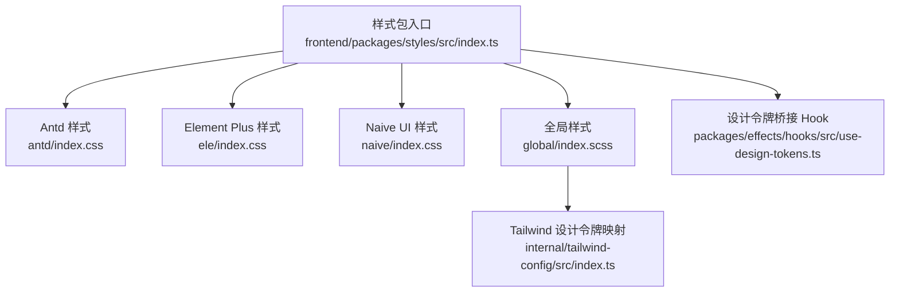
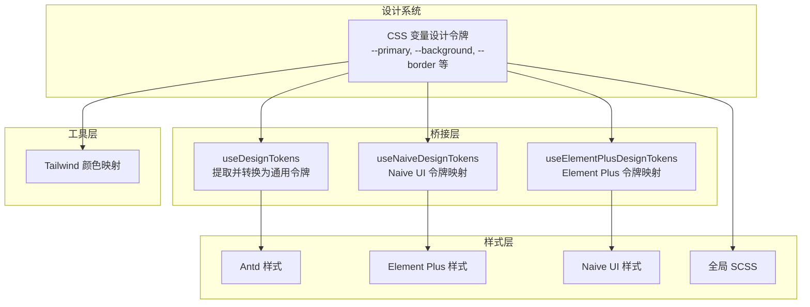
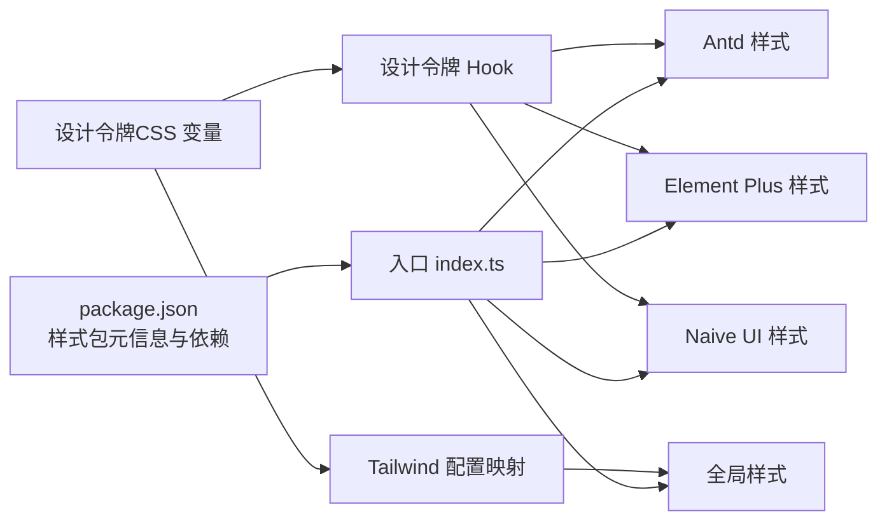

# 样式包 (styles)

<cite>
**本文引用的文件**
- [frontend/packages/styles/src/index.ts](file://frontend/packages/styles/src/index.ts)
- [frontend/packages/styles/src/antd/index.css](file://frontend/packages/styles/src/antd/index.css)
- [frontend/packages/styles/src/ele/index.css](file://frontend/packages/styles/src/ele/index.css)
- [frontend/packages/styles/src/naive/index.css](file://frontend/packages/styles/src/naive/index.css)
- [frontend/packages/styles/src/global/index.scss](file://frontend/packages/styles/src/global/index.scss)
- [frontend/packages/styles/package.json](file://frontend/packages/styles/package.json)
- [frontend/packages/styles/README.md](file://frontend/packages/styles/README.md)
- [frontend/packages/effects/hooks/src/use-design-tokens.ts](file://frontend/packages/effects/hooks/src/use-design-tokens.ts)
- [frontend/internal/tailwind-config/src/index.ts](file://frontend/internal/tailwind-config/src/index.ts)
</cite>

## 目录
1. [简介](#简介)
2. [项目结构](#项目结构)
3. [核心组件](#核心组件)
4. [架构总览](#架构总览)
5. [详细组件分析](#详细组件分析)
6. [依赖关系分析](#依赖关系分析)
7. [性能考量](#性能考量)
8. [故障排查指南](#故障排查指南)
9. [结论](#结论)
10. [附录](#附录)

## 简介
本文件为样式包（styles）的技术文档，面向前端开发者与设计系统使用者，系统性阐述样式库的组织方式、变量体系、工具类与主题系统实现，以及样式模块的导入导出、作用域管理与构建优化策略。同时提供最佳实践、自定义方法与浏览器兼容性建议，帮助在多 UI 框架（Ant Design、Element Plus、Naive UI）下统一风格并提升开发效率。

## 项目结构
样式包位于前端工作区的独立包内，采用按 UI 框架分目录的模块化布局，并提供全局样式入口以统一注入设计令牌与基础样式。

图表来源
- [frontend/packages/styles/src/index.ts](file://frontend/packages/styles/src/index.ts)
- [frontend/packages/styles/src/antd/index.css](file://frontend/packages/styles/src/antd/index.css)
- [frontend/packages/styles/src/ele/index.css](file://frontend/packages/styles/src/ele/index.css)
- [frontend/packages/styles/src/naive/index.css](file://frontend/packages/styles/src/naive/index.css)
- [frontend/packages/styles/src/global/index.scss](file://frontend/packages/styles/src/global/index.scss)
- [frontend/internal/tailwind-config/src/index.ts](file://frontend/internal/tailwind-config/src/index.ts)
- [frontend/packages/effects/hooks/src/use-design-tokens.ts](file://frontend/packages/effects/hooks/src/use-design-tokens.ts)

章节来源
- [frontend/packages/styles/src/index.ts](file://frontend/packages/styles/src/index.ts)
- [frontend/packages/styles/src/antd/index.css](file://frontend/packages/styles/src/antd/index.css)
- [frontend/packages/styles/src/ele/index.css](file://frontend/packages/styles/src/ele/index.css)
- [frontend/packages/styles/src/naive/index.css](file://frontend/packages/styles/src/naive/index.css)
- [frontend/packages/styles/src/global/index.scss](file://frontend/packages/styles/src/global/index.scss)

## 核心组件
- 入口导出：通过单一入口聚合各 UI 框架样式与全局样式，便于按需引入与统一管理。
- UI 框架样式：分别提供 Antd、Element Plus、Naive UI 的基础样式文件，确保组件库默认外观一致。
- 全局样式：提供全局 SCSS 入口，承载设计令牌、重置样式与通用工具类。
- 设计令牌桥接：通过 Hook 将 CSS 变量映射为各 UI 框架可消费的设计令牌，实现主题切换与动态更新。
- Tailwind 集成：将设计令牌映射为 Tailwind 可用的颜色与层级变量，保证原生工具类与设计系统一致。

章节来源
- [frontend/packages/styles/src/index.ts](file://frontend/packages/styles/src/index.ts)
- [frontend/packages/styles/src/global/index.scss](file://frontend/packages/styles/src/global/index.scss)
- [frontend/packages/effects/hooks/src/use-design-tokens.ts](file://frontend/packages/effects/hooks/src/use-design-tokens.ts)
- [frontend/internal/tailwind-config/src/index.ts](file://frontend/internal/tailwind-config/src/index.ts)

## 架构总览
样式系统围绕“设计令牌”为中心，通过 CSS 变量驱动主题，再由 Hook 将其转换为各 UI 框架的内部令牌，最终在全局样式中统一注入。Tailwind 通过设计令牌生成颜色映射，保证原生工具类与组件库风格一致。

图表来源
- [frontend/packages/effects/hooks/src/use-design-tokens.ts](file://frontend/packages/effects/hooks/src/use-design-tokens.ts)
- [frontend/packages/styles/src/antd/index.css](file://frontend/packages/styles/src/antd/index.css)
- [frontend/packages/styles/src/ele/index.css](file://frontend/packages/styles/src/ele/index.css)
- [frontend/packages/styles/src/naive/index.css](file://frontend/packages/styles/src/naive/index.css)
- [frontend/packages/styles/src/global/index.scss](file://frontend/packages/styles/src/global/index.scss)
- [frontend/internal/tailwind-config/src/index.ts](file://frontend/internal/tailwind-config/src/index.ts)

## 详细组件分析

### 组件一：样式入口与模块导出
- 职责：聚合各 UI 框架样式与全局样式，提供统一的导入出口，支持按需引入与全量引入。
- 关键点：
  - 导出路径应与各框架样式目录一一对应，避免重复加载。
  - 全局样式优先于框架样式，确保覆盖与一致性。
  - 提供类型声明以便 IDE 自动补全与静态检查。

章节来源
- [frontend/packages/styles/src/index.ts](file://frontend/packages/styles/src/index.ts)

### 组件二：Antd 样式模块
- 职责：提供 Antd 组件的基础样式，确保默认外观与设计令牌一致。
- 关键点：
  - 仅包含基础样式，不包含业务样式，避免污染。
  - 与全局样式保持顺序，确保覆盖关系正确。
  - 在主题切换时，配合设计令牌桥接实现动态更新。

章节来源
- [frontend/packages/styles/src/antd/index.css](file://frontend/packages/styles/src/antd/index.css)

### 组件三：Element Plus 样式模块
- 职责：提供 Element Plus 组件的基础样式，并通过 Hook 将 CSS 变量映射为 Element Plus 令牌。
- 关键点：
  - 使用 Hook 动态更新 CSS 变量，适配深色/浅色主题。
  - 处理特殊场景（如 Loading 背景色），保证视觉一致性。

章节来源
- [frontend/packages/styles/src/ele/index.css](file://frontend/packages/styles/src/ele/index.css)
- [frontend/packages/effects/hooks/src/use-design-tokens.ts](file://frontend/packages/effects/hooks/src/use-design-tokens.ts)

### 组件四：Naive UI 样式模块
- 职责：提供 Naive UI 组件的基础样式，并通过 Hook 将 CSS 变量映射为 Naive UI 令牌。
- 关键点：
  - 与全局样式协同，确保覆盖与层级正确。
  - 主题切换时，通过监听偏好设置动态刷新样式。

章节来源
- [frontend/packages/styles/src/naive/index.css](file://frontend/packages/styles/src/naive/index.css)
- [frontend/packages/effects/hooks/src/use-design-tokens.ts](file://frontend/packages/effects/hooks/src/use-design-tokens.ts)

### 组件五：全局样式与设计令牌
- 职责：承载设计令牌、重置样式与通用工具类，作为样式系统的“地基”。
- 关键点：
  - 设计令牌以 CSS 变量形式存在，便于运行时修改。
  - Tailwind 配置从设计令牌派生颜色映射，保证工具类与组件库一致。
  - 工具类应语义化命名，避免与框架默认类冲突。

章节来源
- [frontend/packages/styles/src/global/index.scss](file://frontend/packages/styles/src/global/index.scss)
- [frontend/internal/tailwind-config/src/index.ts](file://frontend/internal/tailwind-config/src/index.ts)

### 组件六：设计令牌桥接 Hook
- 职责：将 CSS 变量读取并转换为各 UI 框架可用的令牌对象，支持主题切换与动态更新。
- 关键点：
  - 读取 documentElement 上的 CSS 变量值，必要时进行单位换算（如 rem → px）。
  - 对颜色值进行格式转换，确保 UI 框架能正确解析。
  - 监听主题偏好变化，实时更新令牌并触发样式刷新。

章节来源
- [frontend/packages/effects/hooks/src/use-design-tokens.ts](file://frontend/packages/effects/hooks/src/use-design-tokens.ts)

## 依赖关系分析
样式包与外部系统的耦合主要体现在设计令牌、UI 框架与 Tailwind 配置之间，形成如下依赖链：

图表来源
- [frontend/packages/styles/package.json](file://frontend/packages/styles/package.json)
- [frontend/packages/styles/src/index.ts](file://frontend/packages/styles/src/index.ts)
- [frontend/packages/styles/src/antd/index.css](file://frontend/packages/styles/src/antd/index.css)
- [frontend/packages/styles/src/ele/index.css](file://frontend/packages/styles/src/ele/index.css)
- [frontend/packages/styles/src/naive/index.css](file://frontend/packages/styles/src/naive/index.css)
- [frontend/packages/styles/src/global/index.scss](file://frontend/packages/styles/src/global/index.scss)
- [frontend/packages/effects/hooks/src/use-design-tokens.ts](file://frontend/packages/effects/hooks/src/use-design-tokens.ts)
- [frontend/internal/tailwind-config/src/index.ts](file://frontend/internal/tailwind-config/src/index.ts)

章节来源
- [frontend/packages/styles/package.json](file://frontend/packages/styles/package.json)
- [frontend/packages/styles/src/index.ts](file://frontend/packages/styles/src/index.ts)

## 性能考量
- 按需引入：仅引入当前页面/功能所需的框架样式与全局样式，减少初始包体。
- 作用域隔离：通过样式模块化与命名空间，避免样式泄漏；Tailwind 工具类尽量使用语义化前缀。
- 动态令牌更新：使用 Hook 监听主题变化，避免整页重载；对颜色值转换与缓存进行节流。
- 构建优化：利用构建工具的 Tree Shaking 与 CSS 压缩，确保生产环境体积最小化。
- 缓存策略：对第三方框架样式采用 CDN 或预构建缓存，缩短首屏渲染时间。

## 故障排查指南
- 样式未生效
  - 检查全局样式是否在框架样式之前引入，确保覆盖关系正确。
  - 确认设计令牌是否已注入到 documentElement 的 CSS 变量。
- 主题切换无效
  - 检查 Hook 是否监听到主题偏好变化并触发了样式更新。
  - 确认 CSS 变量命名与 Tailwind 映射一致。
- 颜色或尺寸异常
  - 核对设计令牌的单位换算逻辑（如 rem → px）。
  - 检查 Tailwind 配置中颜色映射是否包含目标变量。
- 构建报错
  - 确认样式文件扩展名与导入路径匹配（.css/.scss）。
  - 检查构建工具对 CSS 变量与 SCSS 的支持配置。

章节来源
- [frontend/packages/styles/src/global/index.scss](file://frontend/packages/styles/src/global/index.scss)
- [frontend/packages/effects/hooks/src/use-design-tokens.ts](file://frontend/packages/effects/hooks/src/use-design-tokens.ts)
- [frontend/internal/tailwind-config/src/index.ts](file://frontend/internal/tailwind-config/src/index.ts)

## 结论
样式包通过“设计令牌 + 框架样式 + 全局样式”的分层架构，实现了跨 UI 框架的一致性与可扩展性。借助 Hook 将 CSS 变量桥接到各框架令牌，结合 Tailwind 的颜色映射，既保证了组件库的默认外观，又保留了原生工具类的灵活性。遵循本文的最佳实践与排障建议，可在多框架环境下高效构建稳定、可维护的样式系统。

## 附录
- 安装与使用
  - 在应用中安装样式包后，按需引入对应框架样式与全局样式。
  - 在应用启动阶段注入设计令牌，确保主题系统正常工作。
- 自定义方法
  - 新增设计令牌：在全局样式中添加新的 CSS 变量，并在 Tailwind 配置中映射。
  - 扩展工具类：在全局样式中新增语义化工具类，避免与框架默认类冲突。
  - 新增 UI 框架支持：仿照现有框架样式模块，新增对应目录与入口导出。
- 浏览器兼容性
  - CSS 变量在现代浏览器中广泛支持，低版本 IE 需要降级方案或 polyfill。
  - Tailwind 工具类按需使用，避免引入不兼容的特性。

章节来源
- [frontend/packages/styles/README.md](file://frontend/packages/styles/README.md)
- [frontend/packages/styles/package.json](file://frontend/packages/styles/package.json)