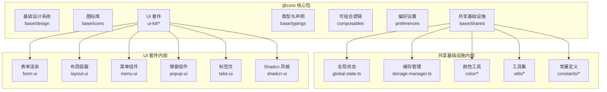
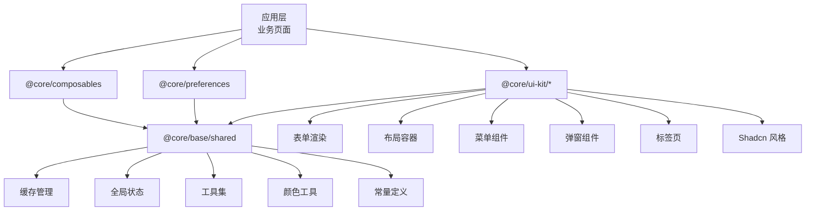
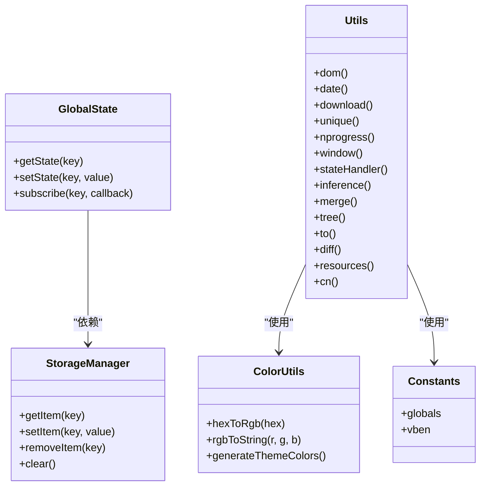
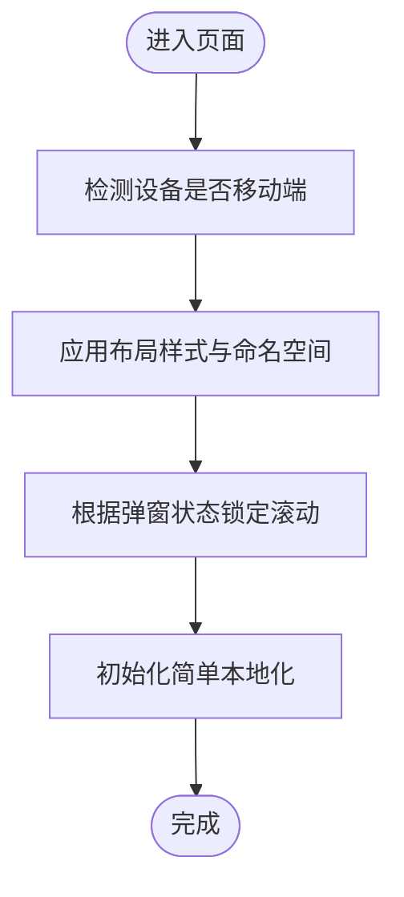
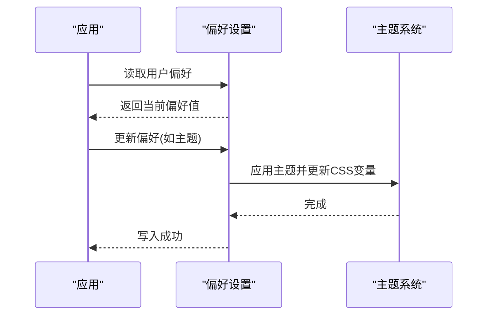
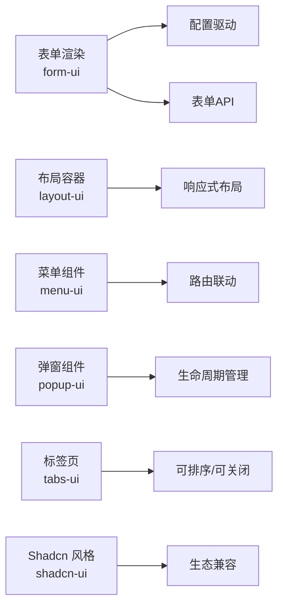
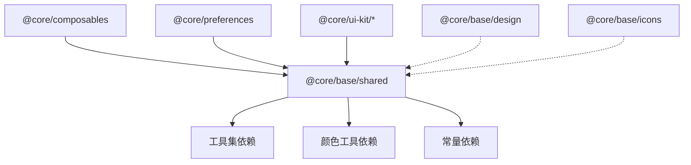

# 核心包 (@core)

<cite>
**本文引用的文件**
- [frontend/packages/@core/README.md](file://frontend/packages/@core/README.md)
- [frontend/packages/@core/base/design/package.json](file://frontend/packages/@core/base/design/package.json)
- [frontend/packages/@core/base/icons/package.json](file://frontend/packages/@core/base/icons/package.json)
- [frontend/packages/@core/base/shared/package.json](file://frontend/packages/@core/base/shared/package.json)
- [frontend/packages/@core/base/typings/package.json](file://frontend/packages/@core/base/typings/package.json)
- [frontend/packages/@core/composables/package.json](file://frontend/packages/@core/composables/package.json)
- [frontend/packages/@core/preferences/package.json](file://frontend/packages/@core/preferences/package.json)
- [frontend/packages/@core/ui-kit/form-ui/package.json](file://frontend/packages/@core/ui-kit/form-ui/package.json)
- [frontend/packages/@core/ui-kit/layout-ui/package.json](file://frontend/packages/@core/ui-kit/layout-ui/package.json)
- [frontend/packages/@core/ui-kit/menu-ui/package.json](file://frontend/packages/@core/ui-kit/menu-ui/package.json)
- [frontend/packages/@core/ui-kit/popup-ui/package.json](file://frontend/packages/@core/ui-kit/popup-ui/package.json)
- [frontend/packages/@core/ui-kit/shadcn-ui/package.json](file://frontend/packages/@core/ui-kit/shadcn-ui/package.json)
- [frontend/packages/@core/ui-kit/tabs-ui/package.json](file://frontend/packages/@core/ui-kit/tabs-ui/package.json)
- [frontend/packages/@core/base/shared/src/index.ts](file://frontend/packages/@core/base/shared/src/index.ts)
- [frontend/packages/@core/base/shared/src/store.ts](file://frontend/packages/@core/base/shared/src/store.ts)
- [frontend/packages/@core/base/shared/src/global-state.ts](file://frontend/packages/@core/base/shared/src/global-state.ts)
- [frontend/packages/@core/base/shared/src/cache/storage-manager.ts](file://frontend/packages/@core/base/shared/src/cache/storage-manager.ts)
- [frontend/packages/@core/base/shared/src/utils/index.ts](file://frontend/packages/@core/base/shared/src/utils/index.ts)
- [frontend/packages/@core/base/shared/src/constants/index.ts](file://frontend/packages/@core/base/shared/src/constants/index.ts)
- [frontend/packages/@core/base/shared/src/color/index.ts](file://frontend/packages/@core/base/shared/src/color/index.ts)
- [frontend/packages/@core/composables/src/index.ts](file://frontend/packages/@core/composables/src/index.ts)
- [frontend/packages/@core/composables/src/use-layout-style.ts](file://frontend/packages/@core/composables/src/use-layout-style.ts)
- [frontend/packages/@core/composables/src/use-namespace.ts](file://frontend/packages/@core/composables/src/use-namespace.ts)
- [frontend/packages/@core/composables/src/use-scroll-lock.ts](file://frontend/packages/@core/composables/src/use-scroll-lock.ts)
- [frontend/packages/@core/composables/src/use-simple-locale/index.ts](file://frontend/packages/@core/composables/src/use-simple-locale/index.ts)
- [frontend/packages/@core/preferences/src/index.ts](file://frontend/packages/@core/preferences/src/index.ts)
- [frontend/packages/@core/preferences/src/preferences.ts](file://frontend/packages/@core/preferences/src/preferences.ts)
- [frontend/packages/@core/preferences/src/use-preferences.ts](file://frontend/packages/@core/preferences/src/use-preferences.ts)
- [frontend/packages/@core/ui-kit/form-ui/src/index.ts](file://frontend/packages/@core/ui-kit/form-ui/src/index.ts)
- [frontend/packages/@core/ui-kit/form-ui/src/form-api.ts](file://frontend/packages/@core/ui-kit/form-ui/src/form-api.ts)
- [frontend/packages/@core/ui-kit/form-ui/src/form-render/index.ts](file://frontend/packages/@core/ui-kit/form-ui/src/form-render/index.ts)
- [frontend/packages/@core/ui-kit/layout-ui/src/index.ts](file://frontend/packages/@core/ui-kit/layout-ui/src/index.ts)
- [frontend/packages/@core/ui-kit/menu-ui/src/index.ts](file://frontend/packages/@core/ui-kit/menu-ui/src/index.ts)
- [frontend/packages/@core/ui-kit/popup-ui/src/index.ts](file://frontend/packages/@core/ui-kit/popup-ui/src/index.ts)
- [frontend/packages/@core/ui-kit/shadcn-ui/src/index.ts](file://frontend/packages/@core/ui-kit/shadcn-ui/src/index.ts)
- [frontend/packages/@core/ui-kit/tabs-ui/src/index.ts](file://frontend/packages/@core/ui-kit/tabs-ui/src/index.ts)
</cite>

## 目录
1. [简介](#简介)
2. [项目结构](#项目结构)
3. [核心组件](#核心组件)
4. [架构总览](#架构总览)
5. [详细组件分析](#详细组件分析)
6. [依赖分析](#依赖分析)
7. [性能考虑](#性能考虑)
8. [故障排除指南](#故障排除指南)
9. [结论](#结论)
10. [附录](#附录)

## 简介
本文件为前端核心包（@core）的系统化技术文档，面向需要在前端工程中复用与扩展通用能力的开发者。该包以“可组合性”“可插拔UI套件”“共享基础设施”三大支柱组织模块，覆盖基础设计系统、图标库、类型与常量、全局状态与缓存、通用工具集、国际化与布局钩子、偏好设置以及多套UI组件库（表单、布局、菜单、弹窗、Tabs、Shadcn风格等）。文档将从整体架构、模块组织、依赖关系、导出结构、版本管理与发布流程、使用示例与最佳实践、集成指南、模块化设计原则、代码组织策略及性能优化等方面进行深入说明。

## 项目结构
@core 包采用“功能域+子包”的分层组织方式，每个子包独立构建与发布，通过统一的 monorepo 工作区管理。主要子包包括：
- 基础设计系统（design）
- 图标库（icons）
- 共享基础设施（shared：全局状态、缓存、颜色、工具集、常量）
- 类型与声明（typings）
- 可组合逻辑（composables：布局样式、命名空间、滚动锁定、简单本地化等）
- 偏好设置（preferences：主题、CSS变量、用户偏好）
- UI 套件（ui-kit：form-ui、layout-ui、menu-ui、popup-ui、tabs-ui、shadcn-ui）

图表来源
- [frontend/packages/@core/base/shared/src/index.ts](file://frontend/packages/@core/base/shared/src/index.ts)
- [frontend/packages/@core/composables/src/index.ts](file://frontend/packages/@core/composables/src/index.ts)
- [frontend/packages/@core/preferences/src/index.ts](file://frontend/packages/@core/preferences/src/index.ts)
- [frontend/packages/@core/ui-kit/form-ui/src/index.ts](file://frontend/packages/@core/ui-kit/form-ui/src/index.ts)
- [frontend/packages/@core/ui-kit/layout-ui/src/index.ts](file://frontend/packages/@core/ui-kit/layout-ui/src/index.ts)
- [frontend/packages/@core/ui-kit/menu-ui/src/index.ts](file://frontend/packages/@core/ui-kit/menu-ui/src/index.ts)
- [frontend/packages/@core/ui-kit/popup-ui/src/index.ts](file://frontend/packages/@core/ui-kit/popup-ui/src/index.ts)
- [frontend/packages/@core/ui-kit/tabs-ui/src/index.ts](file://frontend/packages/@core/ui-kit/tabs-ui/src/index.ts)
- [frontend/packages/@core/ui-kit/shadcn-ui/src/index.ts](file://frontend/packages/@core/ui-kit/shadcn-ui/src/index.ts)

章节来源
- [frontend/packages/@core/README.md](file://frontend/packages/@core/README.md)

## 核心组件
- 共享基础设施（base/shared）
  - 全局状态与持久化存储：提供全局状态管理与存储管理器，支持跨页面/会话的数据保持与恢复。
  - 缓存管理：封装浏览器存储（localStorage/sessionStorage）与内存缓存的统一接口，便于在不同场景选择合适的缓存策略。
  - 颜色工具：提供颜色转换、生成与主题色相关计算能力。
  - 工具集：包含 DOM 操作、日期处理、资源下载、唯一标识、进度条、窗口尺寸监听、状态处理器等常用工具。
  - 常量定义：集中管理全局常量与约定值。
- 可组合逻辑（composables）
  - 布局样式与命名空间：提供布局样式注入与 BEM 命名空间生成，便于一致化的样式组织。
  - 滚动锁定：在弹窗或侧边栏打开时锁定背景滚动，提升交互体验。
  - 简单本地化：提供轻量级多语言支持与消息映射。
- 偏好设置（preferences）
  - 用户偏好与主题：提供偏好读写、主题切换、CSS 变量更新等能力，确保界面一致性与可定制性。
- UI 套件（ui-kit）
  - 表单渲染：基于配置驱动的表单渲染与 API 封装，支持复杂表单场景。
  - 布局容器：提供响应式布局与容器组件。
  - 菜单组件：支持多级菜单与路由联动。
  - 弹窗组件：提供弹窗生命周期与内容渲染能力。
  - Tabs 组件：提供可排序、可关闭的标签页容器。
  - Shadcn 风格：提供与 Shadcn 生态兼容的组件集合。

章节来源
- [frontend/packages/@core/base/shared/src/store.ts](file://frontend/packages/@core/base/shared/src/store.ts)
- [frontend/packages/@core/base/shared/src/cache/storage-manager.ts](file://frontend/packages/@core/base/shared/src/cache/storage-manager.ts)
- [frontend/packages/@core/base/shared/src/color/index.ts](file://frontend/packages/@core/base/shared/src/color/index.ts)
- [frontend/packages/@core/base/shared/src/utils/index.ts](file://frontend/packages/@core/base/shared/src/utils/index.ts)
- [frontend/packages/@core/base/shared/src/constants/index.ts](file://frontend/packages/@core/base/shared/src/constants/index.ts)
- [frontend/packages/@core/composables/src/use-layout-style.ts](file://frontend/packages/@core/composables/src/use-layout-style.ts)
- [frontend/packages/@core/composables/src/use-namespace.ts](file://frontend/packages/@core/composables/src/use-namespace.ts)
- [frontend/packages/@core/composables/src/use-scroll-lock.ts](file://frontend/packages/@core/composables/src/use-scroll-lock.ts)
- [frontend/packages/@core/composables/src/use-simple-locale/index.ts](file://frontend/packages/@core/composables/src/use-simple-locale/index.ts)
- [frontend/packages/@core/preferences/src/preferences.ts](file://frontend/packages/@core/preferences/src/preferences.ts)
- [frontend/packages/@core/preferences/src/use-preferences.ts](file://frontend/packages/@core/preferences/src/use-preferences.ts)
- [frontend/packages/@core/ui-kit/form-ui/src/form-api.ts](file://frontend/packages/@core/ui-kit/form-ui/src/form-api.ts)
- [frontend/packages/@core/ui-kit/form-ui/src/form-render/index.ts](file://frontend/packages/@core/ui-kit/form-ui/src/form-render/index.ts)
- [frontend/packages/@core/ui-kit/layout-ui/src/index.ts](file://frontend/packages/@core/ui-kit/layout-ui/src/index.ts)
- [frontend/packages/@core/ui-kit/menu-ui/src/index.ts](file://frontend/packages/@core/ui-kit/menu-ui/src/index.ts)
- [frontend/packages/@core/ui-kit/popup-ui/src/index.ts](file://frontend/packages/@core/ui-kit/popup-ui/src/index.ts)
- [frontend/packages/@core/ui-kit/tabs-ui/src/index.ts](file://frontend/packages/@core/ui-kit/tabs-ui/src/index.ts)
- [frontend/packages/@core/ui-kit/shadcn-ui/src/index.ts](file://frontend/packages/@core/ui-kit/shadcn-ui/src/index.ts)

## 架构总览
@core 的架构围绕“可组合性”“可插拔 UI 套件”“共享基础设施”展开。各子包通过明确的职责边界与清晰的导出入口相互协作，形成统一的前端开发体验。

图表来源
- [frontend/packages/@core/base/shared/src/index.ts](file://frontend/packages/@core/base/shared/src/index.ts)
- [frontend/packages/@core/composables/src/index.ts](file://frontend/packages/@core/composables/src/index.ts)
- [frontend/packages/@core/preferences/src/index.ts](file://frontend/packages/@core/preferences/src/index.ts)
- [frontend/packages/@core/ui-kit/form-ui/src/index.ts](file://frontend/packages/@core/ui-kit/form-ui/src/index.ts)
- [frontend/packages/@core/ui-kit/layout-ui/src/index.ts](file://frontend/packages/@core/ui-kit/layout-ui/src/index.ts)
- [frontend/packages/@core/ui-kit/menu-ui/src/index.ts](file://frontend/packages/@core/ui-kit/menu-ui/src/index.ts)
- [frontend/packages/@core/ui-kit/popup-ui/src/index.ts](file://frontend/packages/@core/ui-kit/popup-ui/src/index.ts)
- [frontend/packages/@core/ui-kit/tabs-ui/src/index.ts](file://frontend/packages/@core/ui-kit/tabs-ui/src/index.ts)
- [frontend/packages/@core/ui-kit/shadcn-ui/src/index.ts](file://frontend/packages/@core/ui-kit/shadcn-ui/src/index.ts)

## 详细组件分析

### 共享基础设施（base/shared）
- 全局状态与存储
  - 提供全局状态与持久化存储的统一入口，支持跨组件共享与跨页面恢复。
  - 存储管理器封装浏览器存储与内存缓存，提供统一的读写与失效策略。
- 颜色工具
  - 提供颜色转换、生成与主题色相关计算，便于动态主题与配色体系维护。
- 工具集
  - 包含 DOM 操作、日期处理、资源下载、唯一标识、进度条、窗口尺寸监听、状态处理器等高频工具，减少重复造轮子。
- 常量定义
  - 集中管理全局常量与约定值，避免魔法数与分散的配置。

图表来源
- [frontend/packages/@core/base/shared/src/global-state.ts](file://frontend/packages/@core/base/shared/src/global-state.ts)
- [frontend/packages/@core/base/shared/src/cache/storage-manager.ts](file://frontend/packages/@core/base/shared/src/cache/storage-manager.ts)
- [frontend/packages/@core/base/shared/src/color/index.ts](file://frontend/packages/@core/base/shared/src/color/index.ts)
- [frontend/packages/@core/base/shared/src/utils/index.ts](file://frontend/packages/@core/base/shared/src/utils/index.ts)
- [frontend/packages/@core/base/shared/src/constants/index.ts](file://frontend/packages/@core/base/shared/src/constants/index.ts)

章节来源
- [frontend/packages/@core/base/shared/src/store.ts](file://frontend/packages/@core/base/shared/src/store.ts)
- [frontend/packages/@core/base/shared/src/cache/storage-manager.ts](file://frontend/packages/@core/base/shared/src/cache/storage-manager.ts)
- [frontend/packages/@core/base/shared/src/color/index.ts](file://frontend/packages/@core/base/shared/src/color/index.ts)
- [frontend/packages/@core/base/shared/src/utils/index.ts](file://frontend/packages/@core/base/shared/src/utils/index.ts)
- [frontend/packages/@core/base/shared/src/constants/index.ts](file://frontend/packages/@core/base/shared/src/constants/index.ts)

### 可组合逻辑（composables）
- 布局样式与命名空间
  - 提供布局样式注入与 BEM 命名空间生成，便于一致化的样式组织与组件隔离。
- 滚动锁定
  - 在弹窗或侧边栏打开时锁定背景滚动，提升交互体验。
- 简单本地化
  - 提供轻量级多语言支持与消息映射，适合小规模国际化需求。

图表来源
- [frontend/packages/@core/composables/src/use-layout-style.ts](file://frontend/packages/@core/composables/src/use-layout-style.ts)
- [frontend/packages/@core/composables/src/use-namespace.ts](file://frontend/packages/@core/composables/src/use-namespace.ts)
- [frontend/packages/@core/composables/src/use-scroll-lock.ts](file://frontend/packages/@core/composables/src/use-scroll-lock.ts)
- [frontend/packages/@core/composables/src/use-simple-locale/index.ts](file://frontend/packages/@core/composables/src/use-simple-locale/index.ts)

章节来源
- [frontend/packages/@core/composables/src/index.ts](file://frontend/packages/@core/composables/src/index.ts)
- [frontend/packages/@core/composables/src/use-layout-style.ts](file://frontend/packages/@core/composables/src/use-layout-style.ts)
- [frontend/packages/@core/composables/src/use-namespace.ts](file://frontend/packages/@core/composables/src/use-namespace.ts)
- [frontend/packages/@core/composables/src/use-scroll-lock.ts](file://frontend/packages/@core/composables/src/use-scroll-lock.ts)
- [frontend/packages/@core/composables/src/use-simple-locale/index.ts](file://frontend/packages/@core/composables/src/use-simple-locale/index.ts)

### 偏好设置（preferences）
- 用户偏好与主题
  - 提供偏好读写、主题切换、CSS 变量更新等能力，确保界面一致性与可定制性。
- 使用模式
  - 通过组合式函数提供便捷的偏好读取与写入接口，降低耦合度。

图表来源
- [frontend/packages/@core/preferences/src/preferences.ts](file://frontend/packages/@core/preferences/src/preferences.ts)
- [frontend/packages/@core/preferences/src/use-preferences.ts](file://frontend/packages/@core/preferences/src/use-preferences.ts)

章节来源
- [frontend/packages/@core/preferences/src/index.ts](file://frontend/packages/@core/preferences/src/index.ts)
- [frontend/packages/@core/preferences/src/preferences.ts](file://frontend/packages/@core/preferences/src/preferences.ts)
- [frontend/packages/@core/preferences/src/use-preferences.ts](file://frontend/packages/@core/preferences/src/use-preferences.ts)

### UI 套件（ui-kit）
- 表单渲染
  - 基于配置驱动的表单渲染与 API 封装，支持复杂表单场景。
- 布局容器
  - 提供响应式布局与容器组件。
- 菜单组件
  - 支持多级菜单与路由联动。
- 弹窗组件
  - 提供弹窗生命周期与内容渲染能力。
- Tabs 组件
  - 提供可排序、可关闭的标签页容器。
- Shadcn 风格
  - 提供与 Shadcn 生态兼容的组件集合。

图表来源
- [frontend/packages/@core/ui-kit/form-ui/src/form-api.ts](file://frontend/packages/@core/ui-kit/form-ui/src/form-api.ts)
- [frontend/packages/@core/ui-kit/form-ui/src/form-render/index.ts](file://frontend/packages/@core/ui-kit/form-ui/src/form-render/index.ts)
- [frontend/packages/@core/ui-kit/layout-ui/src/index.ts](file://frontend/packages/@core/ui-kit/layout-ui/src/index.ts)
- [frontend/packages/@core/ui-kit/menu-ui/src/index.ts](file://frontend/packages/@core/ui-kit/menu-ui/src/index.ts)
- [frontend/packages/@core/ui-kit/popup-ui/src/index.ts](file://frontend/packages/@core/ui-kit/popup-ui/src/index.ts)
- [frontend/packages/@core/ui-kit/tabs-ui/src/index.ts](file://frontend/packages/@core/ui-kit/tabs-ui/src/index.ts)
- [frontend/packages/@core/ui-kit/shadcn-ui/src/index.ts](file://frontend/packages/@core/ui-kit/shadcn-ui/src/index.ts)

章节来源
- [frontend/packages/@core/ui-kit/form-ui/src/index.ts](file://frontend/packages/@core/ui-kit/form-ui/src/index.ts)
- [frontend/packages/@core/ui-kit/layout-ui/src/index.ts](file://frontend/packages/@core/ui-kit/layout-ui/src/index.ts)
- [frontend/packages/@core/ui-kit/menu-ui/src/index.ts](file://frontend/packages/@core/ui-kit/menu-ui/src/index.ts)
- [frontend/packages/@core/ui-kit/popup-ui/src/index.ts](file://frontend/packages/@core/ui-kit/popup-ui/src/index.ts)
- [frontend/packages/@core/ui-kit/tabs-ui/src/index.ts](file://frontend/packages/@core/ui-kit/tabs-ui/src/index.ts)
- [frontend/packages/@core/ui-kit/shadcn-ui/src/index.ts](file://frontend/packages/@core/ui-kit/shadcn-ui/src/index.ts)

## 依赖分析
- 子包内聚与耦合
  - composable 与 preference 依赖 shared；ui-kit 各子包依赖 shared；design 与 icons 作为基础资源独立存在。
- 外部依赖
  - 各子包通过各自 package.json 声明依赖，遵循工作区统一管理。
- 版本与发布
  - 各子包独立版本与发布，遵循语义化版本控制与工作区发布策略。

图表来源
- [frontend/packages/@core/base/shared/src/index.ts](file://frontend/packages/@core/base/shared/src/index.ts)
- [frontend/packages/@core/composables/src/index.ts](file://frontend/packages/@core/composables/src/index.ts)
- [frontend/packages/@core/preferences/src/index.ts](file://frontend/packages/@core/preferences/src/index.ts)
- [frontend/packages/@core/ui-kit/form-ui/src/index.ts](file://frontend/packages/@core/ui-kit/form-ui/src/index.ts)
- [frontend/packages/@core/base/design/package.json](file://frontend/packages/@core/base/design/package.json)
- [frontend/packages/@core/base/icons/package.json](file://frontend/packages/@core/base/icons/package.json)

章节来源
- [frontend/packages/@core/base/shared/package.json](file://frontend/packages/@core/base/shared/package.json)
- [frontend/packages/@core/composables/package.json](file://frontend/packages/@core/composables/package.json)
- [frontend/packages/@core/preferences/package.json](file://frontend/packages/@core/preferences/package.json)
- [frontend/packages/@core/ui-kit/form-ui/package.json](file://frontend/packages/@core/ui-kit/form-ui/package.json)
- [frontend/packages/@core/ui-kit/layout-ui/package.json](file://frontend/packages/@core/ui-kit/layout-ui/package.json)
- [frontend/packages/@core/ui-kit/menu-ui/package.json](file://frontend/packages/@core/ui-kit/menu-ui/package.json)
- [frontend/packages/@core/ui-kit/popup-ui/package.json](file://frontend/packages/@core/ui-kit/popup-ui/package.json)
- [frontend/packages/@core/ui-kit/tabs-ui/package.json](file://frontend/packages/@core/ui-kit/tabs-ui/package.json)
- [frontend/packages/@core/ui-kit/shadcn-ui/package.json](file://frontend/packages/@core/ui-kit/shadcn-ui/package.json)

## 性能考虑
- 懒加载与按需导入
  - 对体积较大的工具集与 UI 组件建议按需导入，减少首屏负载。
- 缓存策略
  - 利用存储管理器提供的缓存接口，合理设置缓存键与过期时间，避免频繁 IO。
- 组合式函数最小化重渲染
  - 在 composables 中使用稳定引用与浅比较，减少不必要的响应式更新。
- 主题与 CSS 变量
  - 通过偏好设置统一更新 CSS 变量，避免重复样式计算与重排。

## 故障排除指南
- 常见问题
  - 偏好设置未生效：检查偏好写入与 CSS 变量更新流程，确认主题系统已正确应用。
  - 表单渲染异常：核对表单配置与 API 接口，确保字段映射与校验规则一致。
  - 滚动锁定失效：确认弹窗状态与滚动锁定钩子的绑定关系，避免多重锁定导致冲突。
- 调试建议
  - 使用浏览器开发者工具检查全局状态与缓存数据，定位数据流问题。
  - 在 composables 中添加日志输出，追踪状态变化与副作用。

## 结论
@core 通过“可组合性”“可插拔 UI 套件”“共享基础设施”的设计，为前端工程提供了高内聚、低耦合、易扩展的通用能力。遵循本文档的模块化设计原则、代码组织策略与性能优化建议，可在保证一致性的同时提升开发效率与运行性能。

## 附录
- 使用示例与最佳实践
  - 在页面中引入 composables 与 preferences，结合 UI 套件快速搭建界面。
  - 使用 shared 的工具集与缓存管理器，统一处理数据与状态。
- 集成指南
  - 在 monorepo 工作区中安装 @core，并按需引入子包。
  - 遵循各子包的导出入口与类型定义，确保类型安全与可维护性。
- 版本管理与发布
  - 各子包独立版本与发布，遵循语义化版本控制与工作区发布策略。