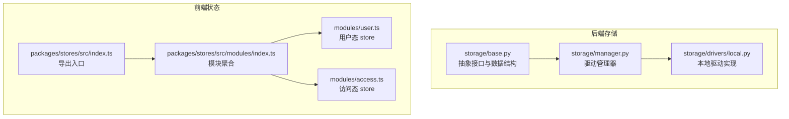
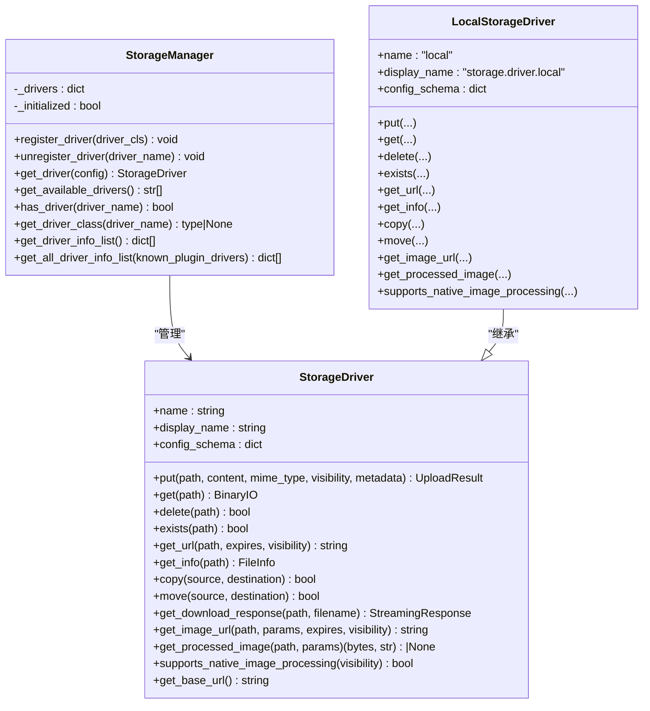
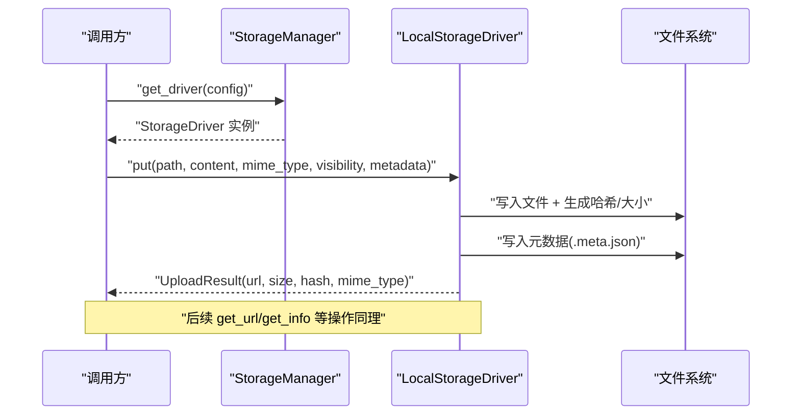
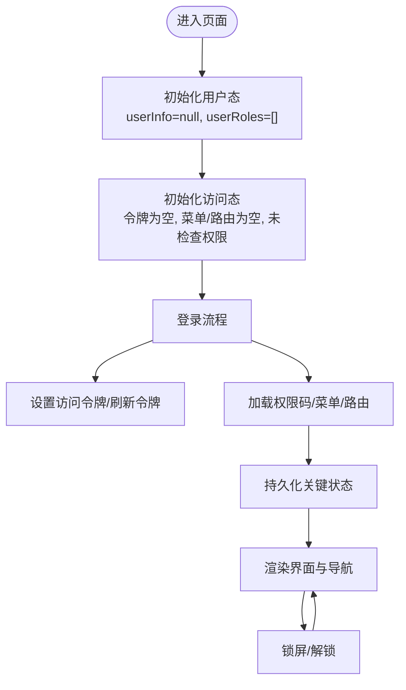
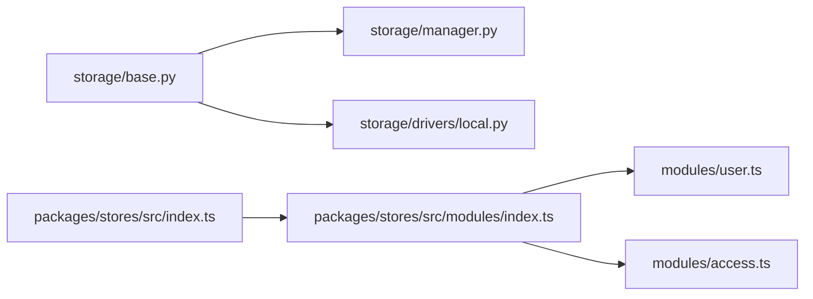

# 状态存储包 (stores)

<cite>
**本文引用的文件**
- [backend/app/storage/base.py](file://backend/app/storage/base.py)
- [backend/app/storage/manager.py](file://backend/app/storage/manager.py)
- [backend/app/storage/drivers/local.py](file://backend/app/storage/drivers/local.py)
- [backend/app/cli_commands/state.py](file://backend/app/cli_commands/state.py)
- [frontend/packages/stores/src/index.ts](file://frontend/packages/stores/src/index.ts)
- [frontend/packages/stores/src/modules/index.ts](file://frontend/packages/stores/src/modules/index.ts)
- [frontend/packages/stores/src/modules/user.ts](file://frontend/packages/stores/src/modules/user.ts)
- [frontend/packages/stores/src/modules/access.ts](file://frontend/packages/stores/src/modules/access.ts)
</cite>

## 目录
1. [简介](#简介)
2. [项目结构](#项目结构)
3. [核心组件](#核心组件)
4. [架构总览](#架构总览)
5. [详细组件分析](#详细组件分析)
6. [依赖关系分析](#依赖关系分析)
7. [性能考量](#性能考量)
8. [故障排查指南](#故障排查指南)
9. [结论](#结论)
10. [附录](#附录)

## 简介
本文件面向“状态存储包(stores)”的主题，系统化梳理后端存储子系统与前端 Pinia 状态模块的设计与实现，覆盖以下方面：
- 后端存储驱动抽象与管理器：统一的存储接口、驱动注册与实例化、URL 生成、元数据管理、图片处理与缓存策略。
- 前端状态模块：基于 Pinia 的用户态与访问态状态模型、持久化策略与 HMR 支持。
- 状态的创建、更新、订阅与清理机制：后端以异步驱动为核心，前端以 store actions/state 为核心。
- 使用示例与最佳实践：如何选择驱动、如何进行图片处理与缓存、如何在前后端协同中正确传递状态。
- 持久化、同步与性能优化：驱动级配置、缓存上限控制、线程池与异步 I/O、错误处理与日志。

## 项目结构
本仓库中与“状态存储”直接相关的代码主要分布在：
- 后端存储子系统：抽象接口、驱动管理器、本地驱动实现。
- 前端状态模块：Pinia store 模块集合，包含用户与访问态。
- CLI 运行时状态辅助：为命令行工具提供运行时状态与配置合并能力（与存储无直接耦合，但体现状态管理思想）。

图表来源
- [backend/app/storage/base.py:1-273](file://backend/app/storage/base.py#L1-L273)
- [backend/app/storage/manager.py:1-156](file://backend/app/storage/manager.py#L1-L156)
- [backend/app/storage/drivers/local.py:1-446](file://backend/app/storage/drivers/local.py#L1-L446)
- [frontend/packages/stores/src/index.ts:1-4](file://frontend/packages/stores/src/index.ts#L1-L4)
- [frontend/packages/stores/src/modules/index.ts:1-5](file://frontend/packages/stores/src/modules/index.ts#L1-L5)
- [frontend/packages/stores/src/modules/user.ts:1-65](file://frontend/packages/stores/src/modules/user.ts#L1-L65)
- [frontend/packages/stores/src/modules/access.ts:1-130](file://frontend/packages/stores/src/modules/access.ts#L1-L130)

章节来源
- [backend/app/storage/base.py:1-273](file://backend/app/storage/base.py#L1-L273)
- [backend/app/storage/manager.py:1-156](file://backend/app/storage/manager.py#L1-L156)
- [backend/app/storage/drivers/local.py:1-446](file://backend/app/storage/drivers/local.py#L1-L446)
- [frontend/packages/stores/src/index.ts:1-4](file://frontend/packages/stores/src/index.ts#L1-L4)
- [frontend/packages/stores/src/modules/index.ts:1-5](file://frontend/packages/stores/src/modules/index.ts#L1-L5)
- [frontend/packages/stores/src/modules/user.ts:1-65](file://frontend/packages/stores/src/modules/user.ts#L1-L65)
- [frontend/packages/stores/src/modules/access.ts:1-130](file://frontend/packages/stores/src/modules/access.ts#L1-L130)

## 核心组件
- 后端存储抽象层
  - 枚举与数据结构：可见性、配置对象、上传结果、文件信息。
  - 抽象驱动接口：put/get/delete/exists/get_url/get_info/copy/move/下载响应、图片处理与原生处理能力声明。
- 驱动管理器
  - 单例注册中心：注册/注销驱动、按配置实例化驱动、查询可用驱动与驱动详情。
- 本地驱动实现
  - 文件系统落地：安全路径校验、元数据侧写、MIME 推断、权限设置、URL 生成策略。
  - 图片处理与缓存：基于参数生成缓存键、限制缓存变体数量、线程池执行处理与落盘。
- 前端状态模块
  - 用户态：用户基本信息与角色集合。
  - 访问态：权限码、可访问菜单/路由、令牌、登录状态与锁屏状态、持久化策略。
- CLI 运行时状态辅助
  - 配置加载与合并、编码与输出、静默模式与日志抑制、异步运行包装。

章节来源
- [backend/app/storage/base.py:20-273](file://backend/app/storage/base.py#L20-L273)
- [backend/app/storage/manager.py:13-156](file://backend/app/storage/manager.py#L13-L156)
- [backend/app/storage/drivers/local.py:31-446](file://backend/app/storage/drivers/local.py#L31-L446)
- [frontend/packages/stores/src/modules/user.ts:1-65](file://frontend/packages/stores/src/modules/user.ts#L1-L65)
- [frontend/packages/stores/src/modules/access.ts:1-130](file://frontend/packages/stores/src/modules/access.ts#L1-L130)
- [backend/app/cli_commands/state.py:1-187](file://backend/app/cli_commands/state.py#L1-L187)

## 架构总览
后端采用“抽象接口 + 管理器 + 具体驱动”的分层设计，前端采用“模块化 store + 持久化”的状态管理模式。二者通过 API 与数据契约协同工作。

图表来源
- [backend/app/storage/base.py:88-264](file://backend/app/storage/base.py#L88-L264)
- [backend/app/storage/manager.py:13-156](file://backend/app/storage/manager.py#L13-L156)
- [backend/app/storage/drivers/local.py:31-446](file://backend/app/storage/drivers/local.py#L31-L446)

## 详细组件分析

### 后端存储抽象与驱动管理
- 抽象接口职责
  - 统一的文件操作契约：上传、下载、删除、存在性检查、URL 生成、文件信息查询、复制/移动。
  - 下载响应与图片处理：提供通用的下载响应构建与图片处理接口，默认不处理，由具体驱动实现。
  - 基础 URL 与前缀拼接：确保与附件记录中的 base_url 拼接形成完整访问地址。
- 管理器职责
  - 单例注册中心：注册/注销驱动、按配置实例化驱动、查询可用驱动与驱动详情。
  - 驱动信息聚合：支持内置与插件驱动的统一展示，包含显示名、配置模式、可用性与插件状态。
- 本地驱动实现要点
  - 路径安全：对相对路径进行清理与根目录校验，防止越权访问。
  - 元数据侧写：以“.meta.json”形式保存 MIME、可见性与自定义元数据。
  - 图片处理与缓存：基于参数生成缓存键，限制缓存变体数量，避免无限增长；线程池执行耗时处理。
  - URL 生成：公开可见性结合 base_url，否则回退到内部路由前缀。

图表来源
- [backend/app/storage/manager.py:62-69](file://backend/app/storage/manager.py#L62-L69)
- [backend/app/storage/drivers/local.py:113-163](file://backend/app/storage/drivers/local.py#L113-L163)

章节来源
- [backend/app/storage/base.py:88-264](file://backend/app/storage/base.py#L88-L264)
- [backend/app/storage/manager.py:13-156](file://backend/app/storage/manager.py#L13-L156)
- [backend/app/storage/drivers/local.py:31-446](file://backend/app/storage/drivers/local.py#L31-L446)

### 前端状态模块（Pinia）
- 用户态模块
  - 数据结构：用户基本信息、角色数组。
  - 行为：设置用户信息自动同步角色；设置角色集合。
- 访问态模块
  - 数据结构：权限码、菜单/路由列表、访问令牌、刷新令牌、登录状态、锁屏状态、检查标记。
  - 行为：设置权限码/菜单/路由/令牌、锁屏/解锁、标记访问检查完成、标记登录过期。
  - 持久化：通过持久化配置挑选关键字段进行持久化，提升用户体验。
- 导出与聚合
  - 模块入口导出 defineStore 与 storeToRefs，模块聚合导出各模块。

图表来源
- [frontend/packages/stores/src/modules/user.ts:41-58](file://frontend/packages/stores/src/modules/user.ts#L41-L58)
- [frontend/packages/stores/src/modules/access.ts:51-123](file://frontend/packages/stores/src/modules/access.ts#L51-L123)

章节来源
- [frontend/packages/stores/src/index.ts:1-4](file://frontend/packages/stores/src/index.ts#L1-L4)
- [frontend/packages/stores/src/modules/index.ts:1-5](file://frontend/packages/stores/src/modules/index.ts#L1-L5)
- [frontend/packages/stores/src/modules/user.ts:1-65](file://frontend/packages/stores/src/modules/user.ts#L1-L65)
- [frontend/packages/stores/src/modules/access.ts:1-130](file://frontend/packages/stores/src/modules/access.ts#L1-L130)

### CLI 运行时状态辅助
- 功能概览
  - 后端目录定位、配置加载（文件/stdin）、深度合并、异步运行包装、JSON 输出与错误结构、静默模式与日志抑制。
- 与状态存储的关系
  - 该模块关注 CLI 生命周期与配置状态，与存储子系统无直接耦合，但体现了统一的状态管理与可观测性理念。

章节来源
- [backend/app/cli_commands/state.py:1-187](file://backend/app/cli_commands/state.py#L1-L187)

## 依赖关系分析
- 后端
  - storage/base.py 定义了抽象接口与数据结构，被 storage/manager.py 与 storage/drivers/local.py 引用。
  - storage/manager.py 作为注册中心，持有驱动类映射，并负责实例化。
  - storage/drivers/local.py 实现具体逻辑，依赖 base.py 的数据结构与异常类型。
- 前端
  - packages/stores/src/index.ts 与 modules/index.ts 聚合导出，user.ts 与 access.ts 作为独立模块。
  - 模块之间解耦，通过应用层组合使用。

图表来源
- [backend/app/storage/base.py:1-273](file://backend/app/storage/base.py#L1-L273)
- [backend/app/storage/manager.py:1-156](file://backend/app/storage/manager.py#L1-L156)
- [backend/app/storage/drivers/local.py:1-446](file://backend/app/storage/drivers/local.py#L1-L446)
- [frontend/packages/stores/src/index.ts:1-4](file://frontend/packages/stores/src/index.ts#L1-L4)
- [frontend/packages/stores/src/modules/index.ts:1-5](file://frontend/packages/stores/src/modules/index.ts#L1-L5)

## 性能考量
- 异步与线程池
  - 后端 I/O 与图片处理通过线程池执行，避免阻塞事件循环，提升吞吐。
- 缓存策略
  - 本地图片处理缓存限制变体数量，防止磁盘膨胀；命中缓存直接返回处理结果。
- 路径与元数据
  - 安全路径校验与元数据侧写，减少无效查询与重复解析。
- 前端持久化
  - 访问态的关键字段持久化，降低刷新成本；模块间状态最小化共享，避免不必要的重渲染。

## 故障排查指南
- 上传失败或找不到文件
  - 检查路径是否越权（安全路径校验），确认根目录与权限设置。
  - 核对可见性与 base_url 配置，确保 URL 生成符合预期。
- 图片处理未生效
  - 确认图片处理参数非空；检查缓存上限与缓存目录权限。
  - 若驱动不支持原生处理，需本地处理流程参与。
- 前端状态未持久化
  - 检查访问态的持久化 pick 列表是否包含所需字段。
  - 确认浏览器存储可用且未被清理。

章节来源
- [backend/app/storage/drivers/local.py:71-79](file://backend/app/storage/drivers/local.py#L71-L79)
- [backend/app/storage/drivers/local.py:406-421](file://backend/app/storage/drivers/local.py#L406-L421)
- [frontend/packages/stores/src/modules/access.ts:102-111](file://frontend/packages/stores/src/modules/access.ts#L102-L111)

## 结论
本“状态存储包(stores)”在后端提供了高内聚的抽象与可扩展的驱动体系，在前端提供了清晰的模块化状态模型与持久化策略。二者通过统一的数据契约与可观测性设计协同工作，既满足功能需求，又兼顾性能与可维护性。建议在实际使用中遵循：
- 明确可见性与 URL 生成规则，确保资源可访问性与安全性。
- 合理配置图片处理缓存上限，平衡存储与性能。
- 在前端按需持久化关键状态，避免过度持久化带来的副作用。
- 通过管理器与模块化设计，保持扩展性与演进空间。

## 附录
- 使用示例（步骤说明）
  - 后端
    - 注册驱动：通过管理器注册本地或其他驱动类。
    - 实例化驱动：根据配置获取驱动实例。
    - 上传文件：调用 put 并传入可见性与元数据。
    - 获取 URL：调用 get_url 或 get_image_url。
  - 前端
    - 初始化：在应用启动时引入 store 并挂载。
    - 更新状态：调用对应 store 的 actions 设置用户信息、令牌、权限等。
    - 订阅状态：在组件中使用 storeToRefs 订阅响应式状态。
    - 清理状态：在登出或切换租户时清空相关状态与持久化数据。

- 最佳实践
  - 后端：统一通过管理器获取驱动实例，避免硬编码；对敏感路径进行安全校验；合理设置图片缓存上限。
  - 前端：将跨页面共享的状态拆分为独立模块；仅持久化必要字段；在开发环境开启 HMR 以提升迭代效率。