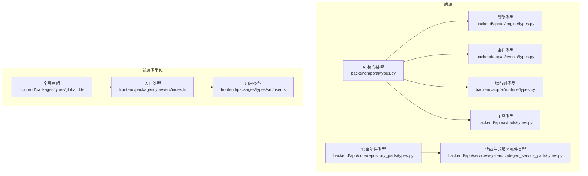
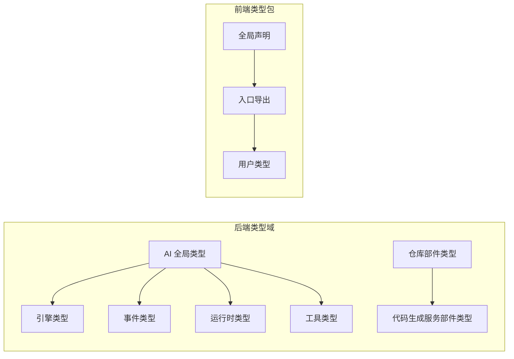
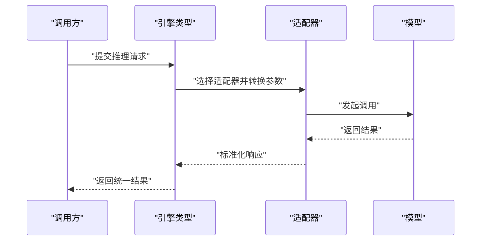
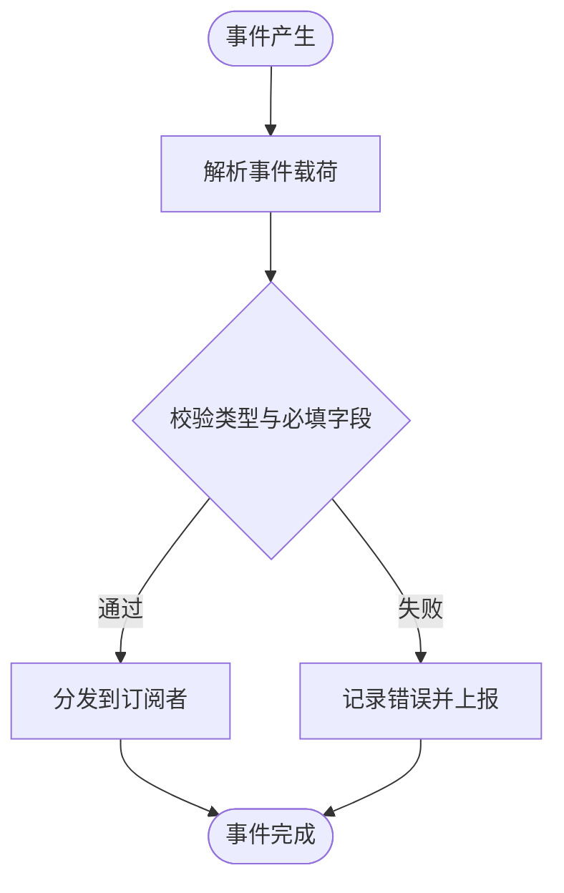
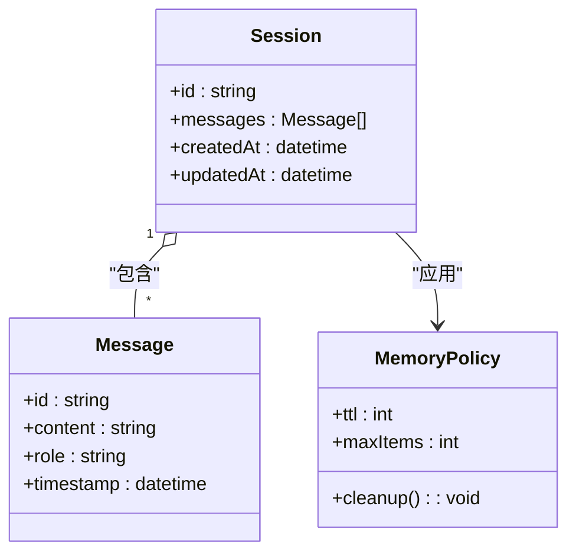
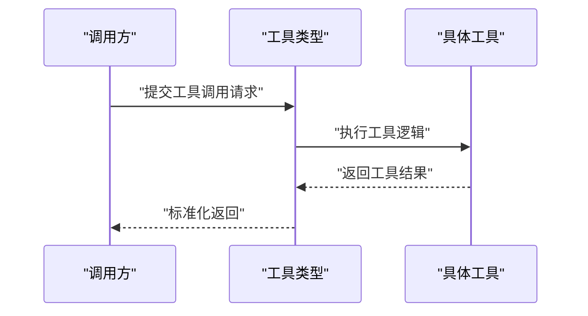
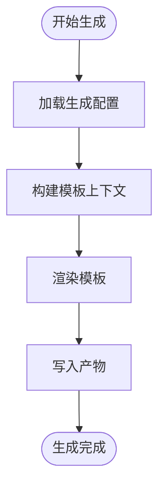
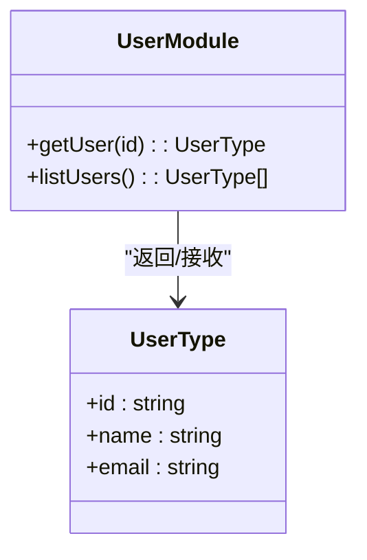
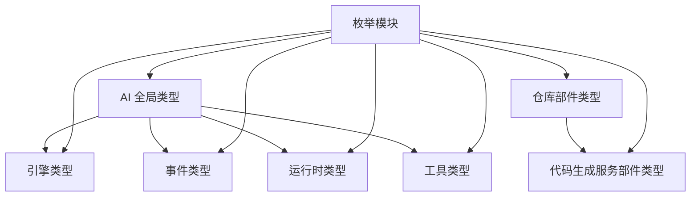

# 类型定义 (types)

<cite>
**本文引用的文件**
- [backend/app/ai/types.py](file://backend/app/ai/types.py)
- [backend/app/ai/engine/types.py](file://backend/app/ai/engine/types.py)
- [backend/app/ai/events/types.py](file://backend/app/ai/events/types.py)
- [backend/app/ai/runtime/types.py](file://backend/app/ai/runtime/types.py)
- [backend/app/ai/tools/types.py](file://backend/app/ai/tools/types.py)
- [backend/app/core/repository_parts/types.py](file://backend/app/core/repository_parts/types.py)
- [backend/app/services/system/codegen_service_parts/types.py](file://backend/app/services/system/codegen_service_parts/types.py)
- [frontend/packages/types/src/index.ts](file://frontend/packages/types/src/index.ts)
- [frontend/packages/types/src/user.ts](file://frontend/packages/types/src/user.ts)
- [frontend/packages/types/global.d.ts](file://frontend/packages/types/global.d.ts)
- [frontend/packages/types/package.json](file://frontend/packages/types/package.json)
- [backend/app/enums/__init__.py](file://backend/app/enums/__init__.py)
- [backend/app/enums/base.py](file://backend/app/enums/base.py)
- [backend/app/enums/common.py](file://backend/app/enums/common.py)
- [backend/app/enums/execution.py](file://backend/app/enums/execution.py)
- [backend/app/enums/skill.py](file://backend/app/enums/skill.py)
- [backend/app/enums/task.py](file://backend/app/enums/task.py)
- [backend/app/enums/agent.py](file://backend/app/enums/agent.py)
- [backend/app/enums/ai.py](file://backend/app/enums/ai.py)
- [backend/app/enums/billing.py](file://backend/app/enums/billing.py)
- [backend/app/enums/cache.py](file://backend/app/enums/cache.py)
- [backend/app/enums/codegen.py](file://backend/app/enums/codegen.py)
- [backend/app/enums/config.py](file://backend/app/enums/config.py)
- [backend/app/enums/domain.py](file://backend/app/enums/domain.py)
- [backend/app/enums/error_code.py](file://backend/app/enums/error_code.py)
- [backend/app/enums/knowledge_base.py](file://backend/app/enums/knowledge_base.py)
- [backend/app/enums/log.py](file://backend/app/enums/log.py)
- [backend/app/enums/memory.py](file://backend/app/enums/memory.py)
- [backend/app/enums/plugin.py](file://backend/app/enums/plugin.py)
- [backend/app/enums/rbac.py](file://backend/app/enums/rbac.py)
- [backend/app/enums/role.py](file://backend/app/enums/role.py)
- [backend/app/enums/attachment.py](file://backend/app/enums/attachment.py)
</cite>

## 目录
1. [引言](#引言)
2. [项目结构](#项目结构)
3. [核心组件](#核心组件)
4. [架构总览](#架构总览)
5. [详细组件分析](#详细组件分析)
6. [依赖分析](#依赖分析)
7. [性能考虑](#性能考虑)
8. [故障排查指南](#故障排查指南)
9. [结论](#结论)
10. [附录](#附录)

## 引言
本文件系统性梳理后端与前端“类型定义（types）”相关模块，覆盖全局类型、接口与枚举的设计与使用；面向业务模型、API 响应与组件属性进行文档化；并总结类型安全最佳实践、泛型与类型推导技巧，提供可扩展与可维护的类型模块化、导入导出策略及版本兼容性处理建议。本文同时给出关键流程的时序图与类图，帮助读者快速理解代码结构与交互。

## 项目结构
类型定义在后端以功能域划分，分别位于 AI 子系统各子模块以及核心与服务层的部分部件中；前端则通过独立的 TypeScript 包对外提供类型声明与全局类型增强。



图表来源
- [backend/app/ai/types.py](file://backend/app/ai/types.py)
- [backend/app/ai/engine/types.py](file://backend/app/ai/engine/types.py)
- [backend/app/ai/events/types.py](file://backend/app/ai/events/types.py)
- [backend/app/ai/runtime/types.py](file://backend/app/ai/runtime/types.py)
- [backend/app/ai/tools/types.py](file://backend/app/ai/tools/types.py)
- [backend/app/core/repository_parts/types.py](file://backend/app/core/repository_parts/types.py)
- [backend/app/services/system/codegen_service_parts/types.py](file://backend/app/services/system/codegen_service_parts/types.py)
- [frontend/packages/types/src/index.ts](file://frontend/packages/types/src/index.ts)
- [frontend/packages/types/src/user.ts](file://frontend/packages/types/src/user.ts)
- [frontend/packages/types/global.d.ts](file://frontend/packages/types/global.d.ts)

章节来源
- [backend/app/ai/types.py](file://backend/app/ai/types.py)
- [backend/app/ai/engine/types.py](file://backend/app/ai/engine/types.py)
- [backend/app/ai/events/types.py](file://backend/app/ai/events/types.py)
- [backend/app/ai/runtime/types.py](file://backend/app/ai/runtime/types.py)
- [backend/app/ai/tools/types.py](file://backend/app/ai/tools/types.py)
- [backend/app/core/repository_parts/types.py](file://backend/app/core/repository_parts/types.py)
- [backend/app/services/system/codegen_service_parts/types.py](file://backend/app/services/system/codegen_service_parts/types.py)
- [frontend/packages/types/src/index.ts](file://frontend/packages/types/src/index.ts)
- [frontend/packages/types/src/user.ts](file://frontend/packages/types/src/user.ts)
- [frontend/packages/types/global.d.ts](file://frontend/packages/types/global.d.ts)

## 核心组件
- 后端 AI 全局类型：集中定义跨模块共享的业务模型与通用类型，作为上层引擎、事件、运行时与工具模块的类型基石。
- 后端 AI 引擎类型：封装推理与调度相关的数据结构与状态类型，支撑多适配器与路由策略。
- 后端 AI 事件类型：描述事件流中的消息体、上下文与生命周期状态，确保事件驱动架构下的类型一致性。
- 后端 AI 运行时类型：定义运行时会话、内存与上下文的类型约束，保障对话与记忆管理的类型安全。
- 后端 AI 工具类型：规范工具调用参数、返回值与错误码，统一工具链的输入输出契约。
- 后端 仓库部件类型：为仓储层提供可复用的查询、分页与过滤类型，提升数据访问层的类型健壮性。
- 后端 代码生成服务部件类型：为代码生成流程提供类型约束，确保生成物与配置之间的类型匹配。
- 前端类型包：提供用户领域类型与全局声明，配合入口导出形成清晰的对外 API。

章节来源
- [backend/app/ai/types.py](file://backend/app/ai/types.py)
- [backend/app/ai/engine/types.py](file://backend/app/ai/engine/types.py)
- [backend/app/ai/events/types.py](file://backend/app/ai/events/types.py)
- [backend/app/ai/runtime/types.py](file://backend/app/ai/runtime/types.py)
- [backend/app/ai/tools/types.py](file://backend/app/ai/tools/types.py)
- [backend/app/core/repository_parts/types.py](file://backend/app/core/repository_parts/types.py)
- [backend/app/services/system/codegen_service_parts/types.py](file://backend/app/services/system/codegen_service_parts/types.py)
- [frontend/packages/types/src/index.ts](file://frontend/packages/types/src/index.ts)
- [frontend/packages/types/src/user.ts](file://frontend/packages/types/src/user.ts)
- [frontend/packages/types/global.d.ts](file://frontend/packages/types/global.d.ts)

## 架构总览
类型定义采用“按域分层 + 按功能拆分”的模块化策略：AI 子系统内部再细分为引擎、事件、运行时与工具四个子域，每个子域拥有独立的类型文件；核心与服务层提供通用部件类型；前端类型包提供用户域与全局声明。该架构确保类型变更影响面可控，并便于跨模块复用。



图表来源
- [backend/app/ai/types.py](file://backend/app/ai/types.py)
- [backend/app/ai/engine/types.py](file://backend/app/ai/engine/types.py)
- [backend/app/ai/events/types.py](file://backend/app/ai/events/types.py)
- [backend/app/ai/runtime/types.py](file://backend/app/ai/runtime/types.py)
- [backend/app/ai/tools/types.py](file://backend/app/ai/tools/types.py)
- [backend/app/core/repository_parts/types.py](file://backend/app/core/repository_parts/types.py)
- [backend/app/services/system/codegen_service_parts/types.py](file://backend/app/services/system/codegen_service_parts/types.py)
- [frontend/packages/types/src/index.ts](file://frontend/packages/types/src/index.ts)
- [frontend/packages/types/src/user.ts](file://frontend/packages/types/src/user.ts)
- [frontend/packages/types/global.d.ts](file://frontend/packages/types/global.d.ts)

## 详细组件分析

### 后端 AI 全局类型（AI 核心）
- 设计要点
  - 聚合跨模块共享的业务模型与通用类型，避免重复定义。
  - 提供类型别名与泛型约束，支持不同场景下的灵活替换。
  - 与枚举模块解耦，通过字符串或数值枚举值进行契约表达。
- 使用建议
  - 将高频使用的类型前置导出，减少模块间循环依赖。
  - 对外暴露稳定接口，内部实现可演进但保持类型签名一致。

章节来源
- [backend/app/ai/types.py](file://backend/app/ai/types.py)

### 后端 AI 引擎类型（推理与调度）
- 设计要点
  - 定义推理请求、响应与中间态的数据结构。
  - 统一适配器与路由策略的输入输出类型，保证多后端一致性。
- 关键流程（序列图）


图表来源
- [backend/app/ai/engine/types.py](file://backend/app/ai/engine/types.py)

章节来源
- [backend/app/ai/engine/types.py](file://backend/app/ai/engine/types.py)

### 后端 AI 事件类型（事件流）
- 设计要点
  - 事件载荷、上下文与生命周期状态的类型化，确保事件驱动一致性。
  - 支持事件扩展与版本演进，保留向后兼容字段。
- 流程图（事件处理）


图表来源
- [backend/app/ai/events/types.py](file://backend/app/ai/events/types.py)

章节来源
- [backend/app/ai/events/types.py](file://backend/app/ai/events/types.py)

### 后端 AI 运行时类型（会话与记忆）
- 设计要点
  - 会话、消息、记忆与上下文的类型约束，保障多轮对话与记忆管理的类型安全。
  - 内存策略与过期机制通过类型参数化，便于测试与替换。
- 类图（运行时核心类型关系）


图表来源
- [backend/app/ai/runtime/types.py](file://backend/app/ai/runtime/types.py)

章节来源
- [backend/app/ai/runtime/types.py](file://backend/app/ai/runtime/types.py)

### 后端 AI 工具类型（工具链）
- 设计要点
  - 工具调用参数、返回值与错误码的类型化，统一工具链输入输出契约。
  - 支持异步工具与批量工具的类型抽象。
- 序列图（工具调用）


图表来源
- [backend/app/ai/tools/types.py](file://backend/app/ai/tools/types.py)

章节来源
- [backend/app/ai/tools/types.py](file://backend/app/ai/tools/types.py)

### 后端 仓库部件类型（仓储层）
- 设计要点
  - 查询、分页、过滤与排序的类型抽象，降低仓储层样板代码复杂度。
  - 泛型约束确保不同实体的查询类型安全。
- 类图（仓储查询类型）
```mermaid
classDiagram
class QueryParams {
+page : int
+pageSize : int
+filters : Map<string, any>
+sorts : SortField[]
}
class SortField {
+field : string
+direction : "asc" | "desc"
}
class PaginatedResult<T> {
+items : T[]
+total : int
+page : int
+pageSize : int
}
QueryParams --> SortField : "包含"
PaginatedResult --> T : "泛型项"
```

图表来源
- [backend/app/core/repository_parts/types.py](file://backend/app/core/repository_parts/types.py)

章节来源
- [backend/app/core/repository_parts/types.py](file://backend/app/core/repository_parts/types.py)

### 后端 代码生成服务部件类型（代码生成）
- 设计要点
  - 生成配置、模板上下文与产物类型的类型约束，确保生成流程的可追踪与可验证。
  - 支持增量生成与回滚的类型化流程。
- 流程图（代码生成）


图表来源
- [backend/app/services/system/codegen_service_parts/types.py](file://backend/app/services/system/codegen_service_parts/types.py)

章节来源
- [backend/app/services/system/codegen_service_parts/types.py](file://backend/app/services/system/codegen_service_parts/types.py)

### 前端类型包（用户域与全局声明）
- 设计要点
  - 用户域类型与全局声明分离，入口导出统一对外 API。
  - 全局声明用于补充第三方库缺失的类型信息，避免污染业务类型。
- 类图（前端类型关系）


图表来源
- [frontend/packages/types/src/user.ts](file://frontend/packages/types/src/user.ts)
- [frontend/packages/types/src/index.ts](file://frontend/packages/types/src/index.ts)
- [frontend/packages/types/global.d.ts](file://frontend/packages/types/global.d.ts)

章节来源
- [frontend/packages/types/src/index.ts](file://frontend/packages/types/src/index.ts)
- [frontend/packages/types/src/user.ts](file://frontend/packages/types/src/user.ts)
- [frontend/packages/types/global.d.ts](file://frontend/packages/types/global.d.ts)
- [frontend/packages/types/package.json](file://frontend/packages/types/package.json)

## 依赖分析
- 后端类型域内依赖
  - AI 全局类型是引擎、事件、运行时与工具类型的基础，其他子域均依赖其公共类型。
  - 仓库部件类型与代码生成服务部件类型相对独立，但可被上层服务与模型使用。
- 前后端类型依赖
  - 前端类型包不依赖后端实现，仅通过契约与枚举值进行协作。
- 枚举模块
  - 后端枚举模块提供统一的枚举值来源，类型模块通过字符串或数值枚举进行契约表达，避免硬编码。



图表来源
- [backend/app/ai/types.py](file://backend/app/ai/types.py)
- [backend/app/ai/engine/types.py](file://backend/app/ai/engine/types.py)
- [backend/app/ai/events/types.py](file://backend/app/ai/events/types.py)
- [backend/app/ai/runtime/types.py](file://backend/app/ai/runtime/types.py)
- [backend/app/ai/tools/types.py](file://backend/app/ai/tools/types.py)
- [backend/app/core/repository_parts/types.py](file://backend/app/core/repository_parts/types.py)
- [backend/app/services/system/codegen_service_parts/types.py](file://backend/app/services/system/codegen_service_parts/types.py)
- [backend/app/enums/__init__.py](file://backend/app/enums/__init__.py)
- [backend/app/enums/base.py](file://backend/app/enums/base.py)
- [backend/app/enums/common.py](file://backend/app/enums/common.py)
- [backend/app/enums/execution.py](file://backend/app/enums/execution.py)
- [backend/app/enums/skill.py](file://backend/app/enums/skill.py)
- [backend/app/enums/task.py](file://backend/app/enums/task.py)
- [backend/app/enums/agent.py](file://backend/app/enums/agent.py)
- [backend/app/enums/ai.py](file://backend/app/enums/ai.py)
- [backend/app/enums/billing.py](file://backend/app/enums/billing.py)
- [backend/app/enums/cache.py](file://backend/app/enums/cache.py)
- [backend/app/enums/codegen.py](file://backend/app/enums/codegen.py)
- [backend/app/enums/config.py](file://backend/app/enums/config.py)
- [backend/app/enums/domain.py](file://backend/app/enums/domain.py)
- [backend/app/enums/error_code.py](file://backend/app/enums/error_code.py)
- [backend/app/enums/knowledge_base.py](file://backend/app/enums/knowledge_base.py)
- [backend/app/enums/log.py](file://backend/app/enums/log.py)
- [backend/app/enums/memory.py](file://backend/app/enums/memory.py)
- [backend/app/enums/plugin.py](file://backend/app/enums/plugin.py)
- [backend/app/enums/rbac.py](file://backend/app/enums/rbac.py)
- [backend/app/enums/role.py](file://backend/app/enums/role.py)
- [backend/app/enums/task.py](file://backend/app/enums/task.py)
- [backend/app/enums/attachment.py](file://backend/app/enums/attachment.py)

章节来源
- [backend/app/enums/__init__.py](file://backend/app/enums/__init__.py)
- [backend/app/enums/base.py](file://backend/app/enums/base.py)
- [backend/app/enums/common.py](file://backend/app/enums/common.py)
- [backend/app/enums/execution.py](file://backend/app/enums/execution.py)
- [backend/app/enums/skill.py](file://backend/app/enums/skill.py)
- [backend/app/enums/task.py](file://backend/app/enums/task.py)
- [backend/app/enums/agent.py](file://backend/app/enums/agent.py)
- [backend/app/enums/ai.py](file://backend/app/enums/ai.py)
- [backend/app/enums/billing.py](file://backend/app/enums/billing.py)
- [backend/app/enums/cache.py](file://backend/app/enums/cache.py)
- [backend/app/enums/codegen.py](file://backend/app/enums/codegen.py)
- [backend/app/enums/config.py](file://backend/app/enums/config.py)
- [backend/app/enums/domain.py](file://backend/app/enums/domain.py)
- [backend/app/enums/error_code.py](file://backend/app/enums/error_code.py)
- [backend/app/enums/knowledge_base.py](file://backend/app/enums/knowledge_base.py)
- [backend/app/enums/log.py](file://backend/app/enums/log.py)
- [backend/app/enums/memory.py](file://backend/app/enums/memory.py)
- [backend/app/enums/plugin.py](file://backend/app/enums/plugin.py)
- [backend/app/enums/rbac.py](file://backend/app/enums/rbac.py)
- [backend/app/enums/role.py](file://backend/app/enums/role.py)
- [backend/app/enums/task.py](file://backend/app/enums/task.py)
- [backend/app/enums/attachment.py](file://backend/app/enums/attachment.py)

## 性能考虑
- 类型推导与编译期优化
  - 优先使用字面量类型与联合类型，减少运行时判断开销。
  - 利用条件类型与映射类型，避免重复定义相似结构。
- 运行时成本控制
  - 避免在热路径中进行复杂的类型计算；将昂贵的类型操作延迟到编译阶段。
  - 对于大对象的序列化/反序列化，尽量通过结构化类型约束减少不必要的字段遍历。
- 可维护性与可扩展性
  - 通过接口与泛型约束替代具体实现，便于替换与扩展。
  - 在枚举与常量中集中管理可变配置，降低类型变更带来的影响范围。

## 故障排查指南
- 类型不匹配
  - 症状：编译报错或运行时断言失败。
  - 排查：检查枚举值是否与类型模块约定一致；确认泛型参数是否正确传递。
- 循环依赖
  - 症状：模块导入时报错或构建失败。
  - 排查：将共享类型前移到公共模块，避免双向导入；使用类型别名隔离实现细节。
- 版本不兼容
  - 症状：升级后类型签名变化导致编译失败。
  - 排查：对照变更日志，逐步迁移；对不稳定接口使用适配层过渡。

## 结论
类型定义通过“按域分层 + 按功能拆分”的模块化策略，实现了后端与前端类型体系的清晰边界与高内聚低耦合。结合枚举模块与泛型约束，既保证了类型安全，又兼顾了演进灵活性。建议在后续开发中持续遵循本文的最佳实践与依赖策略，确保类型系统的长期可维护性与稳定性。

## 附录
- 类型安全最佳实践
  - 使用只读类型与不可变结构，减少副作用。
  - 对外部输入进行严格的类型校验与解码。
  - 通过单元测试验证关键类型转换逻辑。
- 泛型与类型推导技巧
  - 利用条件类型与映射类型提取公共字段，减少重复。
  - 对可选字段使用严格模式，避免隐式 undefined。
- 导入导出策略与版本兼容
  - 前端类型包通过入口统一导出，保持对外 API 的稳定性。
  - 后端类型模块遵循“向下依赖、向上收敛”，避免上层对底层实现的耦合。
  - 版本兼容通过枚举值与字符串常量进行契约表达，降低破坏性变更风险。