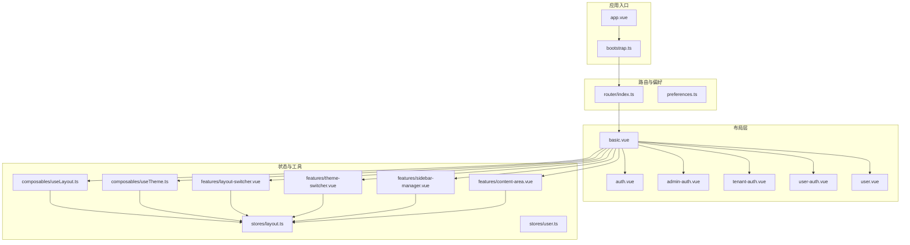
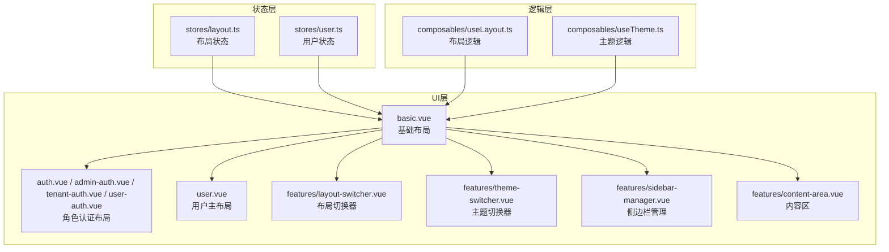
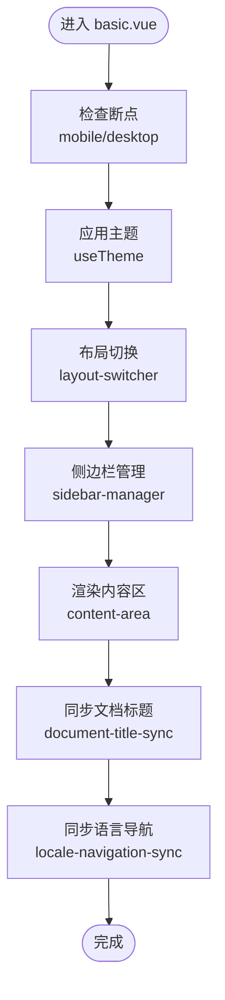
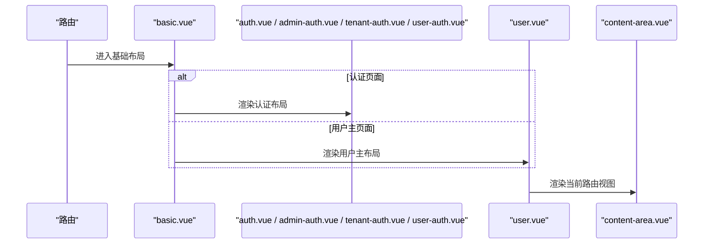
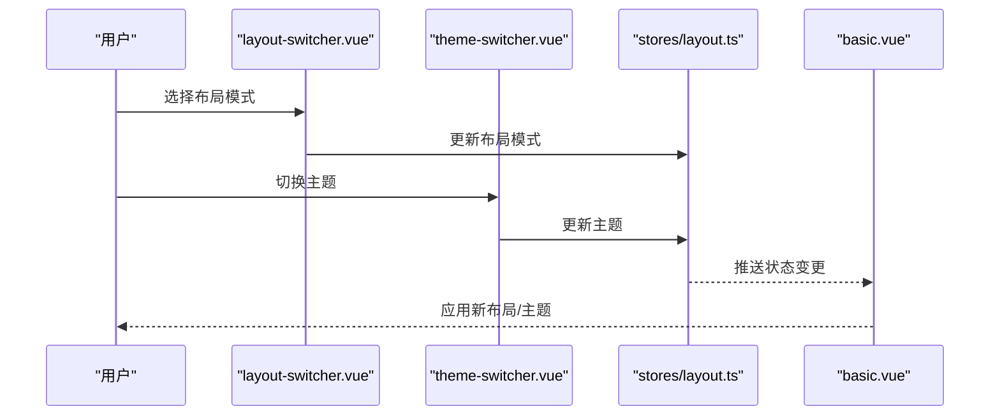
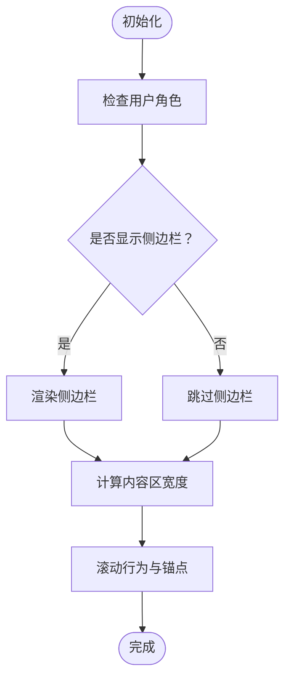
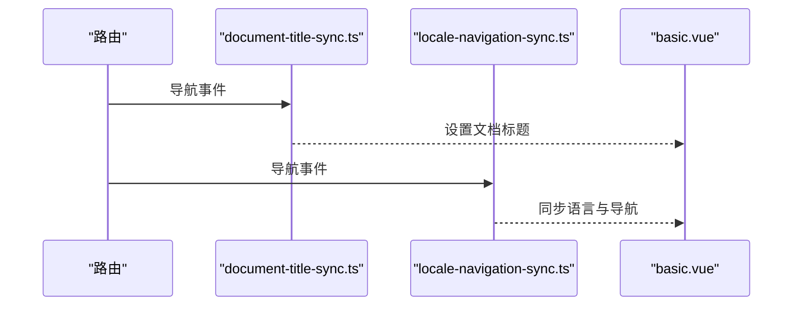
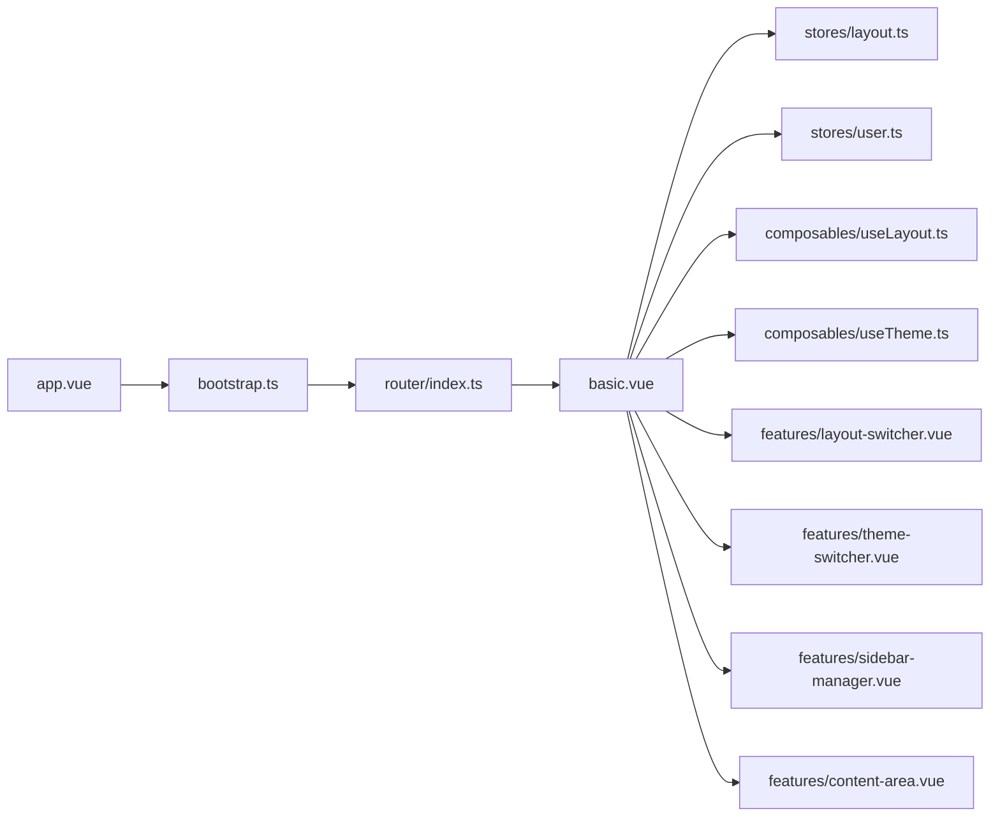

# 布局系统

<cite>
**本文档引用的文件**
- [basic.vue](file://frontend/apps/web-antd/src/layouts/basic.vue)
- [admin-auth.vue](file://frontend/apps/web-antd/src/layouts/admin-auth.vue)
- [tenant-auth.vue](file://frontend/apps/web-antd/src/layouts/tenant-auth.vue)
- [user-auth.vue](file://frontend/apps/web-antd/src/layouts/user-auth.vue)
- [auth.vue](file://frontend/apps/web-antd/src/layouts/auth.vue)
- [user.vue](file://frontend/apps/web-antd/src/layouts/user.vue)
- [index.ts](file://frontend/apps/web-antd/src/layouts/index.ts)
- [document-title-sync.ts](file://frontend/apps/web-antd/src/layouts/document-title-sync.ts)
- [locale-navigation-sync.ts](file://frontend/apps/web-antd/src/layouts/locale-navigation-sync.ts)
- [app.vue](file://frontend/apps/web-antd/src/app.vue)
- [bootstrap.ts](file://frontend/apps/web-antd/src/bootstrap.ts)
- [preferences.ts](file://frontend/apps/web-antd/src/preferences.ts)
- [router/index.ts](file://frontend/apps/web-antd/src/router/index.ts)
- [store/index.ts](file://frontend/apps/web-antd/src/store/index.ts)
- [stores/layout.ts](file://frontend/apps/web-antd/src/stores/layout.ts)
- [stores/user.ts](file://frontend/apps/web-antd/src/stores/user.ts)
- [composables/useLayout.ts](file://frontend/apps/web-antd/src/composables/useLayout.ts)
- [composables/useTheme.ts](file://frontend/apps/web-antd/src/composables/useTheme.ts)
- [features/theme-switcher.vue](file://frontend/apps/web-antd/src/features/theme-switcher.vue)
- [features/layout-switcher.vue](file://frontend/apps/web-antd/src/features/layout-switcher.vue)
- [features/sidebar-manager.vue](file://frontend/apps/web-antd/src/features/sidebar-manager.vue)
- [features/content-area.vue](file://frontend/apps/web-antd/src/features/content-area.vue)
- [types/layout.ts](file://frontend/apps/web-antd/src/types/layout.ts)
- [types/user.ts](file://frontend/apps/web-antd/src/types/user.ts)
</cite>

## 目录
1. [简介](#简介)
2. [项目结构](#项目结构)
3. [核心组件](#核心组件)
4. [架构总览](#架构总览)
5. [详细组件分析](#详细组件分析)
6. [依赖关系分析](#依赖关系分析)
7. [性能考虑](#性能考虑)
8. [故障排除指南](#故障排除指南)
9. [结论](#结论)
10. [附录](#附录)

## 简介
本文件面向前端布局系统，系统性阐述多角色（管理员、租户、用户）布局设计、布局组件复用与响应式实现、嵌套结构与内容区域/侧边栏管理、布局与主题切换、以及布局定制能力。文档同时提供最佳实践、性能优化与用户体验提升策略，并结合仓库中的实际代码进行可视化说明。

## 项目结构
前端布局系统位于 `frontend/apps/web-antd/src/layouts/` 目录，采用按角色划分的布局模板组织方式，配合全局状态管理与可组合逻辑，实现统一的布局行为与差异化展示。

**图表来源**
- [app.vue](file://frontend/apps/web-antd/src/app.vue)
- [bootstrap.ts](file://frontend/apps/web-antd/src/bootstrap.ts)
- [basic.vue](file://frontend/apps/web-antd/src/layouts/basic.vue)
- [auth.vue](file://frontend/apps/web-antd/src/layouts/auth.vue)
- [admin-auth.vue](file://frontend/apps/web-antd/src/layouts/admin-auth.vue)
- [tenant-auth.vue](file://frontend/apps/web-antd/src/layouts/tenant-auth.vue)
- [user-auth.vue](file://frontend/apps/web-antd/src/layouts/user-auth.vue)
- [user.vue](file://frontend/apps/web-antd/src/layouts/user.vue)
- [stores/layout.ts](file://frontend/apps/web-antd/src/stores/layout.ts)
- [stores/user.ts](file://frontend/apps/web-antd/src/stores/user.ts)
- [composables/useLayout.ts](file://frontend/apps/web-antd/src/composables/useLayout.ts)
- [composables/useTheme.ts](file://frontend/apps/web-antd/src/composables/useTheme.ts)
- [features/layout-switcher.vue](file://frontend/apps/web-antd/src/features/layout-switcher.vue)
- [features/theme-switcher.vue](file://frontend/apps/web-antd/src/features/theme-switcher.vue)
- [features/sidebar-manager.vue](file://frontend/apps/web-antd/src/features/sidebar-manager.vue)
- [features/content-area.vue](file://frontend/apps/web-antd/src/features/content-area.vue)
- [router/index.ts](file://frontend/apps/web-antd/src/router/index.ts)
- [preferences.ts](file://frontend/apps/web-antd/src/preferences.ts)

**章节来源**
- [index.ts](file://frontend/apps/web-antd/src/layouts/index.ts)
- [basic.vue](file://frontend/apps/web-antd/src/layouts/basic.vue)
- [app.vue](file://frontend/apps/web-antd/src/app.vue)
- [bootstrap.ts](file://frontend/apps/web-antd/src/bootstrap.ts)

## 核心组件
- 基础布局 basic.vue：作为所有角色布局的根容器，负责响应式断点、主题注入、布局切换、侧边栏与内容区协调。
- 角色专用布局：auth.vue（通用认证）、admin-auth.vue（管理员认证）、tenant-auth.vue（租户认证）、user-auth.vue（用户认证）、user.vue（用户主布局）。
- 状态与工具：stores/layout.ts（布局状态）、stores/user.ts（用户信息）、composables/useLayout.ts（布局逻辑）、composables/useTheme.ts（主题逻辑）。
- 功能特性：layout-switcher.vue（布局切换器）、theme-switcher.vue（主题切换器）、sidebar-manager.vue（侧边栏管理）、content-area.vue（内容区）。
- 路由与偏好：router/index.ts（路由配置）、preferences.ts（偏好设置）。

**章节来源**
- [basic.vue](file://frontend/apps/web-antd/src/layouts/basic.vue)
- [auth.vue](file://frontend/apps/web-antd/src/layouts/auth.vue)
- [admin-auth.vue](file://frontend/apps/web-antd/src/layouts/admin-auth.vue)
- [tenant-auth.vue](file://frontend/apps/web-antd/src/layouts/tenant-auth.vue)
- [user-auth.vue](file://frontend/apps/web-antd/src/layouts/user-auth.vue)
- [user.vue](file://frontend/apps/web-antd/src/layouts/user.vue)
- [stores/layout.ts](file://frontend/apps/web-antd/src/stores/layout.ts)
- [stores/user.ts](file://frontend/apps/web-antd/src/stores/user.ts)
- [composables/useLayout.ts](file://frontend/apps/web-antd/src/composables/useLayout.ts)
- [composables/useTheme.ts](file://frontend/apps/web-antd/src/composables/useTheme.ts)
- [features/layout-switcher.vue](file://frontend/apps/web-antd/src/features/layout-switcher.vue)
- [features/theme-switcher.vue](file://frontend/apps/web-antd/src/features/theme-switcher.vue)
- [features/sidebar-manager.vue](file://frontend/apps/web-antd/src/features/sidebar-manager.vue)
- [features/content-area.vue](file://frontend/apps/web-antd/src/features/content-area.vue)
- [router/index.ts](file://frontend/apps/web-antd/src/router/index.ts)
- [preferences.ts](file://frontend/apps/web-antd/src/preferences.ts)

## 架构总览
布局系统通过“基础布局 + 角色布局 + 功能特性 + 状态与工具”的分层设计，实现：
- 多角色差异化：管理员、租户、用户分别对应不同的认证与主布局。
- 组件复用：基础布局承载通用行为，角色布局仅关注差异部分。
- 响应式与主题：基于断点与主题开关，动态调整布局与外观。
- 嵌套结构：路由视图在内容区渲染，侧边栏根据角色与权限动态显示/隐藏。
- 定制能力：通过布局开关器与偏好设置，支持用户自定义布局风格。

**图表来源**
- [stores/layout.ts](file://frontend/apps/web-antd/src/stores/layout.ts)
- [stores/user.ts](file://frontend/apps/web-antd/src/stores/user.ts)
- [composables/useLayout.ts](file://frontend/apps/web-antd/src/composables/useLayout.ts)
- [composables/useTheme.ts](file://frontend/apps/web-antd/src/composables/useTheme.ts)
- [basic.vue](file://frontend/apps/web-antd/src/layouts/basic.vue)
- [auth.vue](file://frontend/apps/web-antd/src/layouts/auth.vue)
- [admin-auth.vue](file://frontend/apps/web-antd/src/layouts/admin-auth.vue)
- [tenant-auth.vue](file://frontend/apps/web-antd/src/layouts/tenant-auth.vue)
- [user-auth.vue](file://frontend/apps/web-antd/src/layouts/user-auth.vue)
- [user.vue](file://frontend/apps/web-antd/src/layouts/user.vue)
- [features/layout-switcher.vue](file://frontend/apps/web-antd/src/features/layout-switcher.vue)
- [features/theme-switcher.vue](file://frontend/apps/web-antd/src/features/theme-switcher.vue)
- [features/sidebar-manager.vue](file://frontend/apps/web-antd/src/features/sidebar-manager.vue)
- [features/content-area.vue](file://frontend/apps/web-antd/src/features/content-area.vue)

## 详细组件分析

### 基础布局 basic.vue
- 职责：统一处理断点响应、主题注入、布局切换、侧边栏与内容区协调。
- 关键机制：
  - 响应式断点：根据窗口宽度切换移动端/桌面端布局。
  - 主题注入：将当前主题传递给子组件树。
  - 布局切换：通过布局开关器更新布局模式（如侧边栏/顶部导航等）。
  - 内容区渲染：使用路由视图占位符渲染当前页面内容。
  - 文档标题同步：联动 document-title-sync.ts 更新浏览器标题。
  - 语言导航同步：联动 locale-navigation-sync.ts 同步语言与导航状态。

**图表来源**
- [basic.vue](file://frontend/apps/web-antd/src/layouts/basic.vue)
- [document-title-sync.ts](file://frontend/apps/web-antd/src/layouts/document-title-sync.ts)
- [locale-navigation-sync.ts](file://frontend/apps/web-antd/src/layouts/locale-navigation-sync.ts)
- [features/layout-switcher.vue](file://frontend/apps/web-antd/src/features/layout-switcher.vue)
- [features/theme-switcher.vue](file://frontend/apps/web-antd/src/features/theme-switcher.vue)
- [features/sidebar-manager.vue](file://frontend/apps/web-antd/src/features/sidebar-manager.vue)
- [features/content-area.vue](file://frontend/apps/web-antd/src/features/content-area.vue)

**章节来源**
- [basic.vue](file://frontend/apps/web-antd/src/layouts/basic.vue)
- [document-title-sync.ts](file://frontend/apps/web-antd/src/layouts/document-title-sync.ts)
- [locale-navigation-sync.ts](file://frontend/apps/web-antd/src/layouts/locale-navigation-sync.ts)

### 角色布局：认证与主布局
- 认证布局（auth.vue、admin-auth.vue、tenant-auth.vue、user-auth.vue）：用于登录/注册等认证流程，通常不包含侧边栏，强调简洁与快速引导。
- 用户主布局（user.vue）：在用户登录后作为主要内容区容器，可能包含侧边栏、面包屑、页脚等。

**图表来源**
- [basic.vue](file://frontend/apps/web-antd/src/layouts/basic.vue)
- [auth.vue](file://frontend/apps/web-antd/src/layouts/auth.vue)
- [admin-auth.vue](file://frontend/apps/web-antd/src/layouts/admin-auth.vue)
- [tenant-auth.vue](file://frontend/apps/web-antd/src/layouts/tenant-auth.vue)
- [user-auth.vue](file://frontend/apps/web-antd/src/layouts/user-auth.vue)
- [user.vue](file://frontend/apps/web-antd/src/layouts/user.vue)
- [features/content-area.vue](file://frontend/apps/web-antd/src/features/content-area.vue)

**章节来源**
- [auth.vue](file://frontend/apps/web-antd/src/layouts/auth.vue)
- [admin-auth.vue](file://frontend/apps/web-antd/src/layouts/admin-auth.vue)
- [tenant-auth.vue](file://frontend/apps/web-antd/src/layouts/tenant-auth.vue)
- [user-auth.vue](file://frontend/apps/web-antd/src/layouts/user-auth.vue)
- [user.vue](file://frontend/apps/web-antd/src/layouts/user.vue)

### 布局切换与主题切换
- 布局切换器（layout-switcher.vue）：提供布局模式选择（如侧边栏、顶部导航等），写入布局状态。
- 主题切换器（theme-switcher.vue）：提供明暗主题切换，写入布局状态。
- 布局状态（stores/layout.ts）：集中存储布局模式、断点、主题等状态，供基础布局与子组件读取。

**图表来源**
- [features/layout-switcher.vue](file://frontend/apps/web-antd/src/features/layout-switcher.vue)
- [features/theme-switcher.vue](file://frontend/apps/web-antd/src/features/theme-switcher.vue)
- [stores/layout.ts](file://frontend/apps/web-antd/src/stores/layout.ts)
- [basic.vue](file://frontend/apps/web-antd/src/layouts/basic.vue)

**章节来源**
- [features/layout-switcher.vue](file://frontend/apps/web-antd/src/features/layout-switcher.vue)
- [features/theme-switcher.vue](file://frontend/apps/web-antd/src/features/theme-switcher.vue)
- [stores/layout.ts](file://frontend/apps/web-antd/src/stores/layout.ts)

### 侧边栏与内容区管理
- 侧边栏管理（sidebar-manager.vue）：根据角色与权限动态显示/隐藏侧边栏，控制折叠/展开状态。
- 内容区（content-area.vue）：承载路由视图渲染，支持响应式布局下的自适应宽度与滚动。

**图表来源**
- [features/sidebar-manager.vue](file://frontend/apps/web-antd/src/features/sidebar-manager.vue)
- [features/content-area.vue](file://frontend/apps/web-antd/src/features/content-area.vue)
- [stores/user.ts](file://frontend/apps/web-antd/src/stores/user.ts)

**章节来源**
- [features/sidebar-manager.vue](file://frontend/apps/web-antd/src/features/sidebar-manager.vue)
- [features/content-area.vue](file://frontend/apps/web-antd/src/features/content-area.vue)
- [stores/user.ts](file://frontend/apps/web-antd/src/stores/user.ts)

### 文档标题与语言导航同步
- 文档标题同步（document-title-sync.ts）：监听路由变化，动态设置页面标题。
- 语言导航同步（locale-navigation-sync.ts）：维护语言状态与导航项的联动。

**图表来源**
- [document-title-sync.ts](file://frontend/apps/web-antd/src/layouts/document-title-sync.ts)
- [locale-navigation-sync.ts](file://frontend/apps/web-antd/src/layouts/locale-navigation-sync.ts)
- [basic.vue](file://frontend/apps/web-antd/src/layouts/basic.vue)

**章节来源**
- [document-title-sync.ts](file://frontend/apps/web-antd/src/layouts/document-title-sync.ts)
- [locale-navigation-sync.ts](file://frontend/apps/web-antd/src/layouts/locale-navigation-sync.ts)

## 依赖关系分析
- 入口与启动：app.vue 作为根组件，bootstrap.ts 初始化运行时与依赖；router/index.ts 配置路由。
- 布局依赖：basic.vue 依赖 stores/layout.ts、composables/useLayout.ts、composables/useTheme.ts，以及各功能特性组件。
- 状态依赖：stores/layout.ts 与 stores/user.ts 提供全局状态，被布局与功能组件消费。
- 类型与偏好：types/layout.ts、types/user.ts 定义类型，preferences.ts 提供偏好设置。

**图表来源**
- [app.vue](file://frontend/apps/web-antd/src/app.vue)
- [bootstrap.ts](file://frontend/apps/web-antd/src/bootstrap.ts)
- [router/index.ts](file://frontend/apps/web-antd/src/router/index.ts)
- [basic.vue](file://frontend/apps/web-antd/src/layouts/basic.vue)
- [stores/layout.ts](file://frontend/apps/web-antd/src/stores/layout.ts)
- [stores/user.ts](file://frontend/apps/web-antd/src/stores/user.ts)
- [composables/useLayout.ts](file://frontend/apps/web-antd/src/composables/useLayout.ts)
- [composables/useTheme.ts](file://frontend/apps/web-antd/src/composables/useTheme.ts)
- [features/layout-switcher.vue](file://frontend/apps/web-antd/src/features/layout-switcher.vue)
- [features/theme-switcher.vue](file://frontend/apps/web-antd/src/features/theme-switcher.vue)
- [features/sidebar-manager.vue](file://frontend/apps/web-antd/src/features/sidebar-manager.vue)
- [features/content-area.vue](file://frontend/apps/web-antd/src/features/content-area.vue)

**章节来源**
- [app.vue](file://frontend/apps/web-antd/src/app.vue)
- [bootstrap.ts](file://frontend/apps/web-antd/src/bootstrap.ts)
- [router/index.ts](file://frontend/apps/web-antd/src/router/index.ts)
- [basic.vue](file://frontend/apps/web-antd/src/layouts/basic.vue)

## 性能考虑
- 按需渲染：认证布局与主布局分离，避免非必要组件加载。
- 状态集中：布局与主题状态集中于 stores/layout.ts，减少重复计算与跨组件通信成本。
- 响应式优化：断点判断与主题切换在基础布局中一次性完成，降低子组件重绘频率。
- 路由懒加载：建议对大型视图采用路由级懒加载，配合骨架屏提升首屏体验。
- 缓存与持久化：利用 preferences.ts 的偏好设置持久化布局与主题选择，减少每次初始化开销。

[本节为通用指导，无需特定文件引用]

## 故障排除指南
- 布局未生效：检查 stores/layout.ts 中的状态是否正确写入，确认 basic.vue 是否订阅到最新状态。
- 主题切换无效：确认 composable/useTheme.ts 的主题应用逻辑，检查样式作用域与覆盖优先级。
- 侧边栏不显示：核对 stores/user.ts 的角色权限，确保 sidebar-manager.vue 的条件渲染逻辑。
- 文档标题不同步：检查 document-title-sync.ts 的路由监听与标题映射规则。
- 语言导航异常：核对 locale-navigation-sync.ts 的语言状态与导航项绑定。

**章节来源**
- [stores/layout.ts](file://frontend/apps/web-antd/src/stores/layout.ts)
- [composables/useTheme.ts](file://frontend/apps/web-antd/src/composables/useTheme.ts)
- [features/sidebar-manager.vue](file://frontend/apps/web-antd/src/features/sidebar-manager.vue)
- [document-title-sync.ts](file://frontend/apps/web-antd/src/layouts/document-title-sync.ts)
- [locale-navigation-sync.ts](file://frontend/apps/web-antd/src/layouts/locale-navigation-sync.ts)

## 结论
该布局系统通过“基础布局 + 角色布局 + 功能特性 + 状态与工具”的分层设计，实现了多角色差异化、组件复用、响应式与主题切换、侧边栏与内容区协同。结合状态集中与可组合逻辑，既保证了开发效率，也为后续扩展（如更多角色、主题或布局变体）提供了清晰的演进路径。

[本节为总结，无需特定文件引用]

## 附录
- 最佳实践
  - 将通用行为收敛至基础布局，角色布局仅保留差异。
  - 使用状态集中与可组合逻辑，避免跨组件重复实现。
  - 对大型视图启用懒加载，结合骨架屏优化首屏体验。
  - 严格区分认证布局与主布局职责，保持认证流程简洁。
- 差异化实现建议
  - 管理员布局：强调操作面板与数据概览，侧边栏提供管理入口。
  - 租户布局：突出租户空间与资源管理，导航与权限更细粒度。
  - 用户布局：注重任务流与内容阅读，简化导航层级。
- 用户体验提升
  - 提供一键切换布局与主题的入口，支持记忆偏好。
  - 在移动端提供更紧凑的布局与手势交互。
  - 为关键操作提供视觉反馈与无障碍支持。

[本节为通用指导，无需特定文件引用]