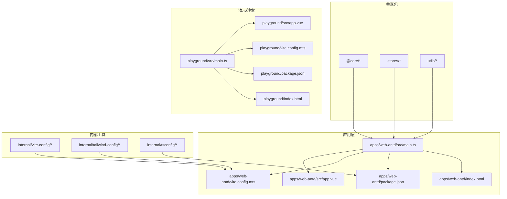
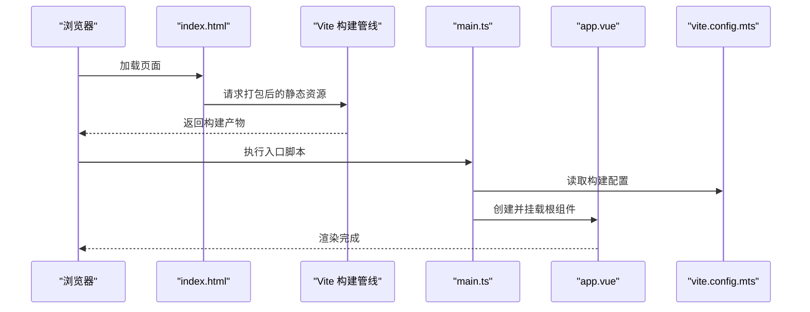
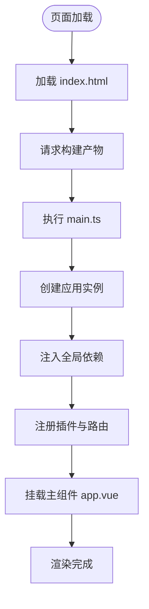
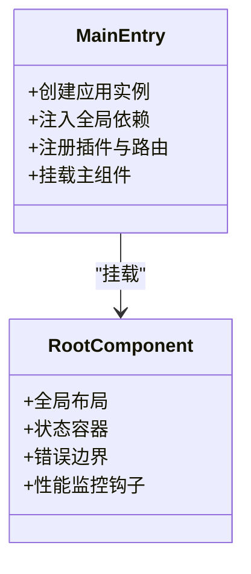
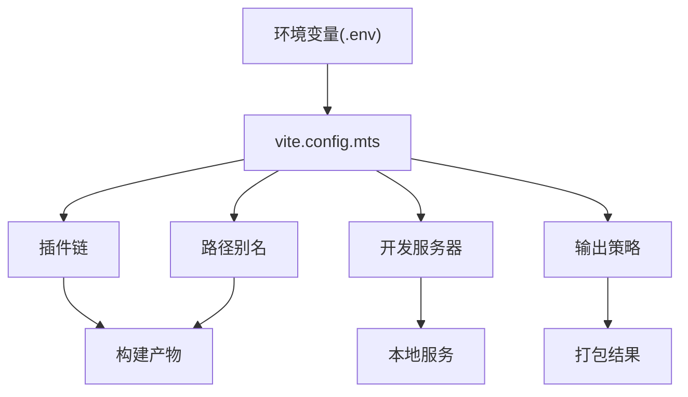
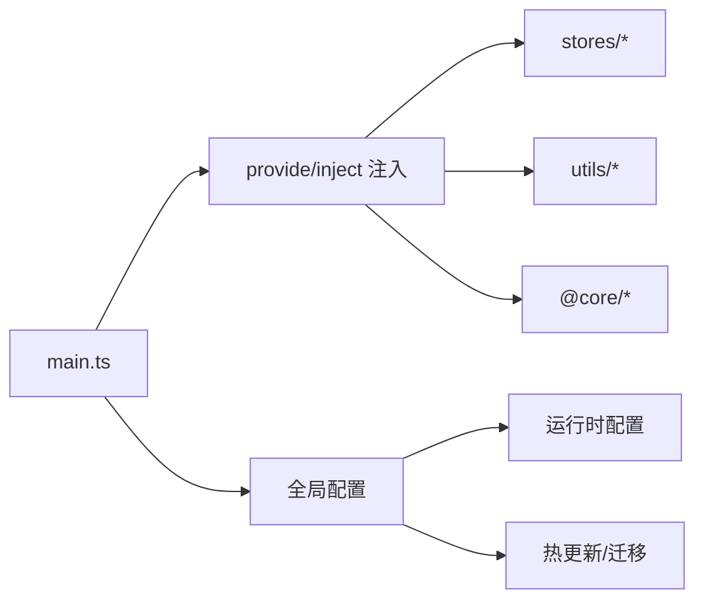
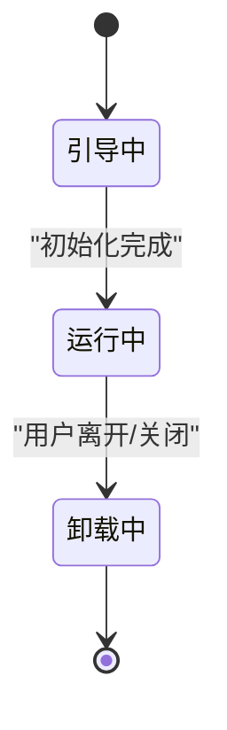
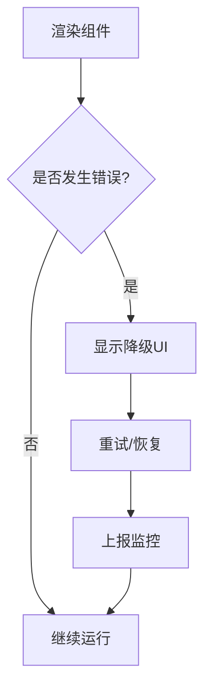
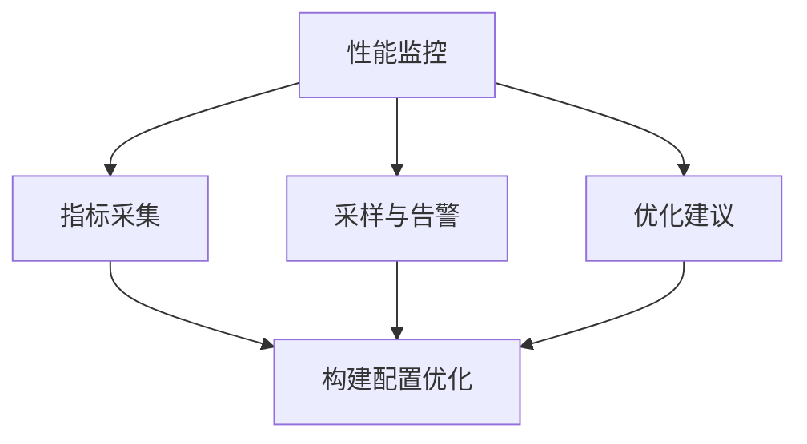
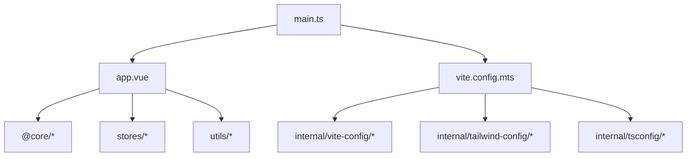

# 应用结构

<cite>
**本文引用的文件**
- [frontend/apps/web-antd/src/main.ts](file://frontend/apps/web-antd/src/main.ts)
- [frontend/apps/web-antd/src/app.vue](file://frontend/apps/web-antd/src/app.vue)
- [frontend/apps/web-antd/vite.config.mts](file://frontend/apps/web-antd/vite.config.mts)
- [frontend/apps/web-antd/package.json](file://frontend/apps/web-antd/package.json)
- [frontend/apps/web-antd/index.html](file://frontend/apps/web-antd/index.html)
- [frontend/packages/@core](file://frontend/packages/@core)
- [frontend/packages/stores](file://frontend/packages/stores)
- [frontend/packages/utils](file://frontend/packages/utils)
- [frontend/internal/vite-config](file://frontend/internal/vite-config)
- [frontend/internal/tailwind-config](file://frontend/internal/tailwind-config)
- [frontend/internal/tsconfig](file://frontend/internal/tsconfig)
- [frontend/scripts/deploy](file://frontend/scripts/deploy)
- [frontend/playground/src/main.ts](file://frontend/playground/src/main.ts)
- [frontend/playground/src/app.vue](file://frontend/playground/src/app.vue)
- [frontend/playground/vite.config.mts](file://frontend/playground/vite.config.mts)
- [frontend/playground/package.json](file://frontend/playground/package.json)
- [frontend/playground/index.html](file://frontend/playground/index.html)
</cite>

## 目录
1. [引言](#引言)
2. [项目结构](#项目结构)
3. [核心组件](#核心组件)
4. [架构总览](#架构总览)
5. [详细组件分析](#详细组件分析)
6. [依赖分析](#依赖分析)
7. [性能考虑](#性能考虑)
8. [故障排除指南](#故障排除指南)
9. [结论](#结论)
10. [附录](#附录)

## 引言
本文件面向Vue.js应用的结构与实现，聚焦于启动流程、引导过程、主组件设计、应用配置与环境变量处理、构建配置、初始化过程、依赖注入与全局配置、生命周期管理、错误边界处理以及性能监控等主题。文档同时提供最佳实践与扩展指南，帮助开发者在保持一致性的同时进行功能扩展与维护。

## 项目结构
前端采用多包工作区（monorepo）组织，核心应用位于 `frontend/apps/web-antd`，配套有内部工具链与共享包：
- 应用层：`frontend/apps/web-antd`（主应用）
- 内部工具：`frontend/internal/vite-config`、`frontend/internal/tailwind-config`、`frontend/internal/tsconfig`
- 共享包：`frontend/packages/@core`、`frontend/packages/stores`、`frontend/packages/utils` 等
- 演示/沙盒：`frontend/playground`（可作为开发与验证的独立入口）

**图表来源**
- [frontend/apps/web-antd/src/main.ts](file://frontend/apps/web-antd/src/main.ts)
- [frontend/apps/web-antd/src/app.vue](file://frontend/apps/web-antd/src/app.vue)
- [frontend/apps/web-antd/vite.config.mts](file://frontend/apps/web-antd/vite.config.mts)
- [frontend/apps/web-antd/package.json](file://frontend/apps/web-antd/package.json)
- [frontend/apps/web-antd/index.html](file://frontend/apps/web-antd/index.html)
- [frontend/internal/vite-config](file://frontend/internal/vite-config)
- [frontend/internal/tailwind-config](file://frontend/internal/tailwind-config)
- [frontend/internal/tsconfig](file://frontend/internal/tsconfig)
- [frontend/packages/@core](file://frontend/packages/@core)
- [frontend/packages/stores](file://frontend/packages/stores)
- [frontend/packages/utils](file://frontend/packages/utils)
- [frontend/playground/src/main.ts](file://frontend/playground/src/main.ts)
- [frontend/playground/src/app.vue](file://frontend/playground/src/app.vue)
- [frontend/playground/vite.config.mts](file://frontend/playground/vite.config.mts)
- [frontend/playground/package.json](file://frontend/playground/package.json)
- [frontend/playground/index.html](file://frontend/playground/index.html)

**章节来源**
- [frontend/apps/web-antd/src/main.ts](file://frontend/apps/web-antd/src/main.ts)
- [frontend/apps/web-antd/src/app.vue](file://frontend/apps/web-antd/src/app.vue)
- [frontend/apps/web-antd/vite.config.mts](file://frontend/apps/web-antd/vite.config.mts)
- [frontend/apps/web-antd/package.json](file://frontend/apps/web-antd/package.json)
- [frontend/apps/web-antd/index.html](file://frontend/apps/web-antd/index.html)
- [frontend/internal/vite-config](file://frontend/internal/vite-config)
- [frontend/internal/tailwind-config](file://frontend/internal/tailwind-config)
- [frontend/internal/tsconfig](file://frontend/internal/tsconfig)
- [frontend/packages/@core](file://frontend/packages/@core)
- [frontend/packages/stores](file://frontend/packages/stores)
- [frontend/packages/utils](file://frontend/packages/utils)
- [frontend/playground/src/main.ts](file://frontend/playground/src/main.ts)
- [frontend/playground/src/app.vue](file://frontend/playground/src/app.vue)
- [frontend/playground/vite.config.mts](file://frontend/playground/vite.config.mts)
- [frontend/playground/package.json](file://frontend/playground/package.json)
- [frontend/playground/index.html](file://frontend/playground/index.html)

## 核心组件
本节聚焦应用启动、引导与主组件设计的关键路径与职责划分。

- 启动入口与引导
  - 应用通过入口文件完成挂载与引导，随后进入主组件渲染流程。
  - 入口文件负责创建应用实例、注入全局依赖、注册插件与路由等。
  - 主组件承担顶层布局、状态容器与错误边界等职责。

- 主组件设计
  - 主组件通常包含全局样式、主题切换、国际化、布局容器、错误边界与性能监控钩子。
  - 通过组合式API或选项式API实现状态管理与副作用控制，确保生命周期可控且可测试。

- 初始化过程
  - 初始化阶段包括环境变量校验、全局配置加载、依赖注入、插件注册与路由守卫设置。
  - 采用异步初始化策略，避免阻塞首屏渲染；对关键资源进行预加载与缓存。

- 依赖注入与全局配置
  - 通过应用实例的全局属性与provide/inject机制实现跨组件依赖共享。
  - 全局配置集中管理，支持运行时热更新与版本化配置迁移。

- 生命周期管理
  - 明确应用级生命周期钩子，贯穿引导、运行到卸载的全过程。
  - 在关键节点执行清理、日志上报与资源回收，保证内存与网络资源不泄漏。

- 错误边界处理
  - 在主组件或路由层面设置错误边界，捕获渲染错误与未处理异常。
  - 提供降级UI与重试机制，记录错误上下文并上报至监控系统。

- 性能监控
  - 集成首屏时间、交互延迟、资源加载等指标采集。
  - 对关键路径进行采样与告警，结合埋点数据优化用户体验。

**章节来源**
- [frontend/apps/web-antd/src/main.ts](file://frontend/apps/web-antd/src/main.ts)
- [frontend/apps/web-antd/src/app.vue](file://frontend/apps/web-antd/src/app.vue)

## 架构总览
下图展示从浏览器加载到应用渲染的端到端流程，涵盖构建产物、入口脚本、主组件与全局配置的关系。

**图表来源**
- [frontend/apps/web-antd/index.html](file://frontend/apps/web-antd/index.html)
- [frontend/apps/web-antd/vite.config.mts](file://frontend/apps/web-antd/vite.config.mts)
- [frontend/apps/web-antd/src/main.ts](file://frontend/apps/web-antd/src/main.ts)
- [frontend/apps/web-antd/src/app.vue](file://frontend/apps/web-antd/src/app.vue)

## 详细组件分析

### 启动与引导流程
- 浏览器加载入口HTML后，由Vite构建管线产出的脚本被加载执行。
- 入口脚本负责创建应用实例、注入全局依赖、注册插件与路由，并最终挂载主组件。
- 构建配置决定模块解析、插件链路与输出策略，影响运行时性能与兼容性。

**图表来源**
- [frontend/apps/web-antd/index.html](file://frontend/apps/web-antd/index.html)
- [frontend/apps/web-antd/src/main.ts](file://frontend/apps/web-antd/src/main.ts)
- [frontend/apps/web-antd/src/app.vue](file://frontend/apps/web-antd/src/app.vue)

**章节来源**
- [frontend/apps/web-antd/index.html](file://frontend/apps/web-antd/index.html)
- [frontend/apps/web-antd/src/main.ts](file://frontend/apps/web-antd/src/main.ts)
- [frontend/apps/web-antd/src/app.vue](file://frontend/apps/web-antd/src/app.vue)

### 主组件设计
- 主组件承担全局布局、状态容器与错误边界职责，是应用的“壳”。
- 通过组合式API或选项式API实现状态管理与副作用控制，确保生命周期可控且可测试。
- 支持主题切换、国际化与性能监控钩子，便于统一治理。

**图表来源**
- [frontend/apps/web-antd/src/main.ts](file://frontend/apps/web-antd/src/main.ts)
- [frontend/apps/web-antd/src/app.vue](file://frontend/apps/web-antd/src/app.vue)

**章节来源**
- [frontend/apps/web-antd/src/app.vue](file://frontend/apps/web-antd/src/app.vue)

### 构建配置与环境变量处理
- 构建配置集中于Vite配置文件，定义插件链、别名、输出策略与开发服务器行为。
- 环境变量通过Vite的模式与前缀约定进行注入，支持运行时读取与编译期替换。
- 内部工具链提供统一的Vite、Tailwind与TS配置，确保团队一致性。

**图表来源**
- [frontend/apps/web-antd/vite.config.mts](file://frontend/apps/web-antd/vite.config.mts)
- [frontend/apps/web-antd/package.json](file://frontend/apps/web-antd/package.json)
- [frontend/internal/vite-config](file://frontend/internal/vite-config)

**章节来源**
- [frontend/apps/web-antd/vite.config.mts](file://frontend/apps/web-antd/vite.config.mts)
- [frontend/apps/web-antd/package.json](file://frontend/apps/web-antd/package.json)
- [frontend/internal/vite-config](file://frontend/internal/vite-config)

### 依赖注入与全局配置
- 通过应用实例的全局属性与provide/inject机制实现跨组件依赖共享。
- 全局配置集中管理，支持运行时热更新与版本化配置迁移。
- 共享包（如@core、stores、utils）提供可复用能力，降低耦合度。

**图表来源**
- [frontend/apps/web-antd/src/main.ts](file://frontend/apps/web-antd/src/main.ts)
- [frontend/packages/@core](file://frontend/packages/@core)
- [frontend/packages/stores](file://frontend/packages/stores)
- [frontend/packages/utils](file://frontend/packages/utils)

**章节来源**
- [frontend/apps/web-antd/src/main.ts](file://frontend/apps/web-antd/src/main.ts)
- [frontend/packages/@core](file://frontend/packages/@core)
- [frontend/packages/stores](file://frontend/packages/stores)
- [frontend/packages/utils](file://frontend/packages/utils)

### 生命周期管理
- 明确应用级生命周期钩子，贯穿引导、运行到卸载的全过程。
- 在关键节点执行清理、日志上报与资源回收，保证内存与网络资源不泄漏。
- 结合错误边界与性能监控，形成闭环的质量保障体系。

**图表来源**
- [frontend/apps/web-antd/src/main.ts](file://frontend/apps/web-antd/src/main.ts)
- [frontend/apps/web-antd/src/app.vue](file://frontend/apps/web-antd/src/app.vue)

**章节来源**
- [frontend/apps/web-antd/src/main.ts](file://frontend/apps/web-antd/src/main.ts)
- [frontend/apps/web-antd/src/app.vue](file://frontend/apps/web-antd/src/app.vue)

### 错误边界处理
- 在主组件或路由层面设置错误边界，捕获渲染错误与未处理异常。
- 提供降级UI与重试机制，记录错误上下文并上报至监控系统。
- 与性能监控联动，定位问题根因并触发告警。

**图表来源**
- [frontend/apps/web-antd/src/app.vue](file://frontend/apps/web-antd/src/app.vue)

**章节来源**
- [frontend/apps/web-antd/src/app.vue](file://frontend/apps/web-antd/src/app.vue)

### 性能监控
- 集成首屏时间、交互延迟、资源加载等指标采集。
- 对关键路径进行采样与告警，结合埋点数据优化用户体验。
- 与构建配置联动，启用压缩、分包与懒加载策略以提升性能。

**图表来源**
- [frontend/apps/web-antd/vite.config.mts](file://frontend/apps/web-antd/vite.config.mts)
- [frontend/apps/web-antd/src/app.vue](file://frontend/apps/web-antd/src/app.vue)

**章节来源**
- [frontend/apps/web-antd/vite.config.mts](file://frontend/apps/web-antd/vite.config.mts)
- [frontend/apps/web-antd/src/app.vue](file://frontend/apps/web-antd/src/app.vue)

## 依赖分析
- 组件耦合与内聚：应用层与内部工具链解耦，通过配置与包管理实现松耦合。
- 直接与间接依赖：入口脚本依赖主组件与构建配置；主组件依赖共享包与全局配置。
- 外部依赖与集成点：Vite生态、浏览器API与第三方SDK。
- 接口契约与实现细节：通过类型系统与配置约束保证接口稳定性。

**图表来源**
- [frontend/apps/web-antd/src/main.ts](file://frontend/apps/web-antd/src/main.ts)
- [frontend/apps/web-antd/src/app.vue](file://frontend/apps/web-antd/src/app.vue)
- [frontend/apps/web-antd/vite.config.mts](file://frontend/apps/web-antd/vite.config.mts)
- [frontend/packages/@core](file://frontend/packages/@core)
- [frontend/packages/stores](file://frontend/packages/stores)
- [frontend/packages/utils](file://frontend/packages/utils)
- [frontend/internal/vite-config](file://frontend/internal/vite-config)
- [frontend/internal/tailwind-config](file://frontend/internal/tailwind-config)
- [frontend/internal/tsconfig](file://frontend/internal/tsconfig)

**章节来源**
- [frontend/apps/web-antd/src/main.ts](file://frontend/apps/web-antd/src/main.ts)
- [frontend/apps/web-antd/src/app.vue](file://frontend/apps/web-antd/src/app.vue)
- [frontend/apps/web-antd/vite.config.mts](file://frontend/apps/web-antd/vite.config.mts)
- [frontend/packages/@core](file://frontend/packages/@core)
- [frontend/packages/stores](file://frontend/packages/stores)
- [frontend/packages/utils](file://frontend/packages/utils)
- [frontend/internal/vite-config](file://frontend/internal/vite-config)
- [frontend/internal/tailwind-config](file://frontend/internal/tailwind-config)
- [frontend/internal/tsconfig](file://frontend/internal/tsconfig)

## 性能考虑
- 构建优化：启用压缩、分包与懒加载策略，减少首屏体积。
- 资源加载：利用HTTP缓存与CDN，优化静态资源分发。
- 运行时优化：避免不必要的重渲染，合理使用计算属性与侦听器。
- 监控与告警：建立性能基线与阈值，及时发现回归与异常波动。

## 故障排除指南
- 启动失败排查：检查入口脚本与主组件是否存在语法或类型错误；确认构建配置与环境变量正确。
- 运行时错误：启用错误边界捕获，记录堆栈与上下文；结合监控系统定位根因。
- 性能问题：采集关键指标，识别瓶颈路径；对比不同版本与分支的性能差异。
- 部署与回滚：通过部署脚本与版本管理，确保快速回滚与灰度发布。

**章节来源**
- [frontend/apps/web-antd/src/main.ts](file://frontend/apps/web-antd/src/main.ts)
- [frontend/apps/web-antd/src/app.vue](file://frontend/apps/web-antd/src/app.vue)
- [frontend/scripts/deploy](file://frontend/scripts/deploy)

## 结论
该Vue.js应用采用清晰的分层与模块化设计，通过统一的构建配置与内部工具链实现一致性与可维护性。主组件承担全局职责，配合错误边界与性能监控，形成稳定的应用生命周期管理体系。建议在扩展新功能时遵循现有约定，优先使用共享包与内部工具，确保架构演进的可控性与可测试性。

## 附录
- 演示/沙盒应用：提供独立的入口与配置，便于功能验证与原型开发。
- 开发与测试：入口文件与主组件同样适用于沙盒应用，便于本地调试与集成测试。

**章节来源**
- [frontend/playground/src/main.ts](file://frontend/playground/src/main.ts)
- [frontend/playground/src/app.vue](file://frontend/playground/src/app.vue)
- [frontend/playground/vite.config.mts](file://frontend/playground/vite.config.mts)
- [frontend/playground/package.json](file://frontend/playground/package.json)
- [frontend/playground/index.html](file://frontend/playground/index.html)