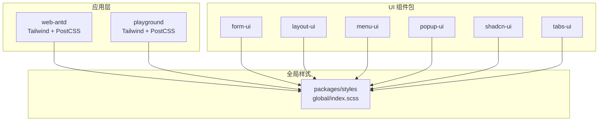
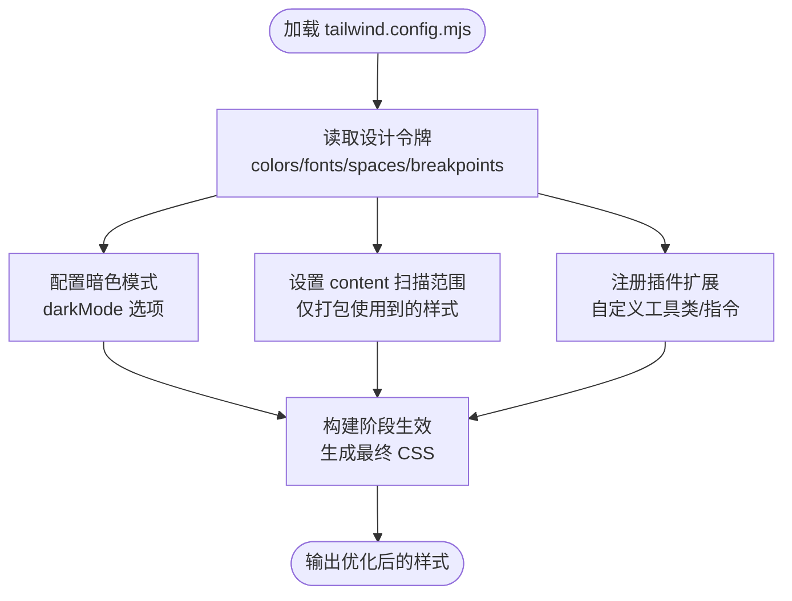
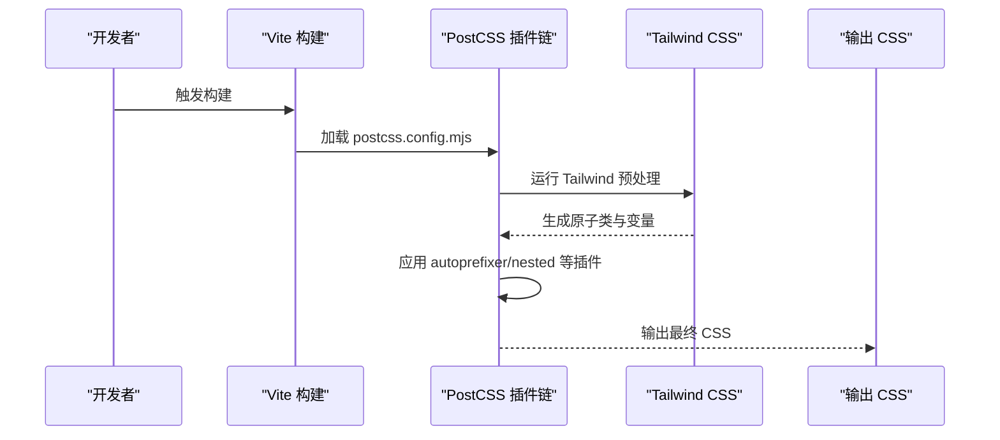
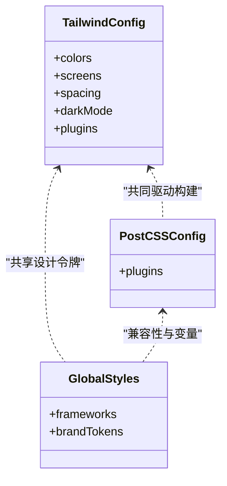
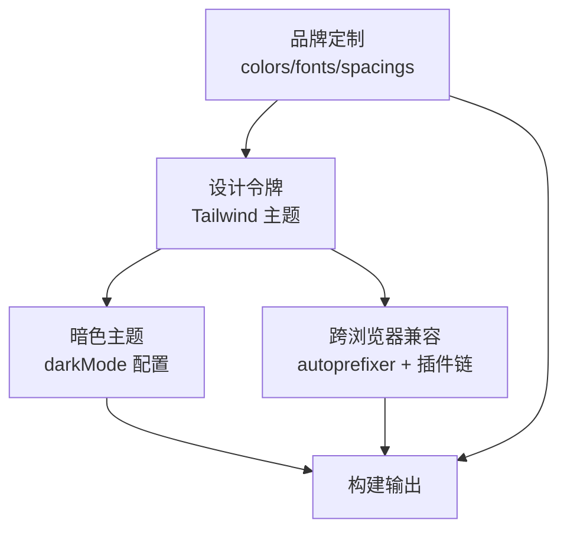
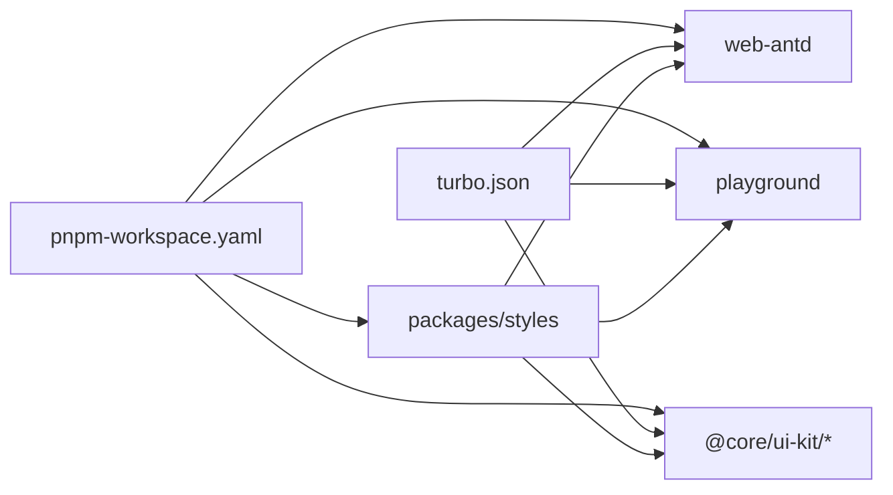

# 样式架构

<cite>
**本文引用的文件**
- [tailwind.config.mjs（应用）](file://frontend/apps/web-antd/tailwind.config.mjs)
- [postcss.config.mjs（应用）](file://frontend/apps/web-antd/postcss.config.mjs)
- [tailwind.config.mjs（playground）](file://frontend/playground/tailwind.config.mjs)
- [postcss.config.mjs（playground）](file://frontend/playground/postcss.config.mjs)
- [tailwind.config.mjs（UI 组件包：form-ui）](file://frontend/packages/@core/ui-kit/form-ui/tailwind.config.mjs)
- [postcss.config.mjs（UI 组件包：form-ui）](file://frontend/packages/@core/ui-kit/form-ui/postcss.config.mjs)
- [tailwind.config.mjs（UI 组件包：layout-ui）](file://frontend/packages/@core/ui-kit/layout-ui/tailwind.config.mjs)
- [postcss.config.mjs（UI 组件包：layout-ui）](file://frontend/packages/@core/ui-kit/layout-ui/postcss.config.mjs)
- [tailwind.config.mjs（UI 组件包：menu-ui）](file://frontend/packages/@core/ui-kit/menu-ui/tailwind.config.mjs)
- [postcss.config.mjs（UI 组件包：menu-ui）](file://frontend/packages/@core/ui-kit/menu-ui/postcss.config.mjs)
- [tailwind.config.mjs（UI 组件包：popup-ui）](file://frontend/packages/@core/ui-kit/popup-ui/tailwind.config.mjs)
- [postcss.config.mjs（UI 组件包：popup-ui）](file://frontend/packages/@core/ui-kit/popup-ui/postcss.config.mjs)
- [tailwind.config.mjs（UI 组件包：shadcn-ui）](file://frontend/packages/@core/ui-kit/shadcn-ui/tailwind.config.mjs)
- [postcss.config.mjs（UI 组件包：shadcn-ui）](file://frontend/packages/@core/ui-kit/shadcn-ui/postcss.config.mjs)
- [tailwind.config.mjs（UI 组件包：tabs-ui）](file://frontend/packages/@core/ui-kit/tabs-ui/tailwind.config.mjs)
- [postcss.config.mjs（UI 组件包：tabs-ui）](file://frontend/packages/@core/ui-kit/tabs-ui/postcss.config.mjs)
- [index.scss（全局样式）](file://frontend/packages/styles/src/global/index.scss)
- [index.ts（样式入口）](file://frontend/packages/styles/src/index.ts)
- [package.json（样式包）](file://frontend/packages/styles/package.json)
- [package.json（应用）](file://frontend/apps/web-antd/package.json)
- [package.json（playground）](file://frontend/playground/package.json)
- [eslint.config.mjs（应用）](file://frontend/apps/web-antd/eslint.config.mjs)
- [eslint.config.mjs（playground）](file://frontend/playground/eslint.config.mjs)
- [stylelint.config.mjs（应用）](file://frontend/apps/web-antd/stylelint.config.mjs)
- [stylelint.config.mjs（playground）](file://frontend/playground/stylelint.config.mjs)
- [vite.config.mts（应用）](file://frontend/apps/web-antd/vite.config.mts)
- [vite.config.mts（playground）](file://frontend/playground/vite.config.mts)
- [turbo.json](file://frontend/turbo.json)
- [pnpm-workspace.yaml](file://frontend/pnpm-workspace.yaml)
</cite>

## 目录
1. [简介](#简介)
2. [项目结构](#项目结构)
3. [核心组件](#核心组件)
4. [架构总览](#架构总览)
5. [详细组件分析](#详细组件分析)
6. [依赖分析](#依赖分析)
7. [性能考虑](#性能考虑)
8. [故障排查指南](#故障排查指南)
9. [结论](#结论)
10. [附录](#附录)

## 简介
本文件面向前端样式架构，聚焦于 Tailwind CSS 的配置与主题系统、自定义样式与组件化、CSS 模块化与响应式设计、PostCSS 配置与样式优化策略，并给出最佳实践、性能优化与维护建议，覆盖暗色主题、品牌定制与跨浏览器兼容性。

## 项目结构
样式体系采用多包工作区（workspace）组织，核心由以下部分构成：
- 应用层：web-antd 与 playground 分别拥有独立的 Tailwind 与 PostCSS 配置，确保可复用与可验证。
- UI 组件包：@core/ui-kit 下的多个子包（如 form-ui、layout-ui、menu-ui、popup-ui、shadcn-ui、tabs-ui）各自维护 Tailwind 与 PostCSS 配置，便于组件级主题与样式隔离。
- 全局样式包：packages/styles 提供全局 SCSS 入口与按框架划分的样式入口，统一品牌与基础样式。

**图表来源**
- [tailwind.config.mjs（应用）](file://frontend/apps/web-antd/tailwind.config.mjs)
- [tailwind.config.mjs（playground）](file://frontend/playground/tailwind.config.mjs)
- [tailwind.config.mjs（UI 组件包：form-ui）](file://frontend/packages/@core/ui-kit/form-ui/tailwind.config.mjs)
- [tailwind.config.mjs（UI 组件包：layout-ui）](file://frontend/packages/@core/ui-kit/layout-ui/tailwind.config.mjs)
- [tailwind.config.mjs（UI 组件包：menu-ui）](file://frontend/packages/@core/ui-kit/menu-ui/tailwind.config.mjs)
- [tailwind.config.mjs（UI 组件包：popup-ui）](file://frontend/packages/@core/ui-kit/popup-ui/tailwind.config.mjs)
- [tailwind.config.mjs（UI 组件包：shadcn-ui）](file://frontend/packages/@core/ui-kit/shadcn-ui/tailwind.config.mjs)
- [tailwind.config.mjs（UI 组件包：tabs-ui）](file://frontend/packages/@core/ui-kit/tabs-ui/tailwind.config.mjs)
- [index.scss（全局样式）](file://frontend/packages/styles/src/global/index.scss)

**章节来源**
- [tailwind.config.mjs（应用）](file://frontend/apps/web-antd/tailwind.config.mjs)
- [tailwind.config.mjs（playground）](file://frontend/playground/tailwind.config.mjs)
- [tailwind.config.mjs（UI 组件包：form-ui）](file://frontend/packages/@core/ui-kit/form-ui/tailwind.config.mjs)
- [tailwind.config.mjs（UI 组件包：layout-ui）](file://frontend/packages/@core/ui-kit/layout-ui/tailwind.config.mjs)
- [tailwind.config.mjs（UI 组件包：menu-ui）](file://frontend/packages/@core/ui-kit/menu-ui/tailwind.config.mjs)
- [tailwind.config.mjs（UI 组件包：popup-ui）](file://frontend/packages/@core/ui-kit/popup-ui/tailwind.config.mjs)
- [tailwind.config.mjs（UI 组件包：shadcn-ui）](file://frontend/packages/@core/ui-kit/shadcn-ui/tailwind.config.mjs)
- [tailwind.config.mjs（UI 组件包：tabs-ui）](file://frontend/packages/@core/ui-kit/tabs-ui/tailwind.config.mjs)
- [index.scss（全局样式）](file://frontend/packages/styles/src/global/index.scss)

## 核心组件
- Tailwind 配置：各应用与组件包均提供独立的 tailwind.config.mjs，用于扩展颜色、字体、间距、断点等设计令牌，并通过 content 控制扫描范围以实现 Tree-shaking。
- PostCSS 配置：各包提供 postcss.config.mjs，集成插件链（如 autoprefixer、postcss-nested 等），保证 CSS 属性前缀与嵌套语法支持。
- 全局样式：packages/styles/src/global/index.scss 提供全局样式入口，按框架（AntD、Naive、Element Plus 等）分层组织，避免样式冲突。
- 样式入口：packages/styles/src/index.ts 汇总导出，供应用与组件包统一引入。
- 工作区与构建：pnpm-workspace.yaml 与 turbo.json 管理多包依赖与缓存；Vite 配置负责开发与打包流程。

**章节来源**
- [tailwind.config.mjs（应用）](file://frontend/apps/web-antd/tailwind.config.mjs)
- [postcss.config.mjs（应用）](file://frontend/apps/web-antd/postcss.config.mjs)
- [tailwind.config.mjs（playground）](file://frontend/playground/tailwind.config.mjs)
- [postcss.config.mjs（playground）](file://frontend/playground/postcss.config.mjs)
- [tailwind.config.mjs（UI 组件包：form-ui）](file://frontend/packages/@core/ui-kit/form-ui/tailwind.config.mjs)
- [postcss.config.mjs（UI 组件包：form-ui）](file://frontend/packages/@core/ui-kit/form-ui/postcss.config.mjs)
- [index.scss（全局样式）](file://frontend/packages/styles/src/global/index.scss)
- [index.ts（样式入口）](file://frontend/packages/styles/src/index.ts)
- [pnpm-workspace.yaml](file://frontend/pnpm-workspace.yaml)
- [turbo.json](file://frontend/turbo.json)

## 架构总览
整体架构围绕“应用层 + 多组件包 + 全局样式”的三层结构展开，Tailwind 与 PostCSS 在每个包内独立配置，确保可复用与可演进；全局样式作为品牌与基础样式的统一出口，避免重复与冲突。

```mermaid
graph TB
A["应用层<br/>web-antd"] --> G["全局样式<br/>packages/styles"]
P["应用层<br/>playground"] --> G
U1["UI 组件包<br/>form-ui"] --> G
U2["UI 组件包<br/>layout-ui"] --> G
U3["UI 组件包<br/>menu-ui"] --> G
U4["UI 组件包<br/>popup-ui"] --> G
U5["UI 组件包<br/>shadcn-ui"] --> G
U6["UI 组件包<br/>tabs-ui"] --> G
subgraph "Tailwind 配置"
TA["应用 tailwind.config.mjs"]
TP["playground tailwind.config.mjs"]
TU1["form-ui tailwind.config.mjs"]
TU2["layout-ui tailwind.config.mjs"]
TU3["menu-ui tailwind.config.mjs"]
TU4["popup-ui tailwind.config.mjs"]
TU5["shadcn-ui tailwind.config.mjs"]
TU6["tabs-ui tailwind.config.mjs"]
end
subgraph "PostCSS 配置"
PA["应用 postcss.config.mjs"]
PP["playground postcss.config.mjs"]
PU1["form-ui postcss.config.mjs"]
PU2["layout-ui postcss.config.mjs"]
PU3["menu-ui postcss.config.mjs"]
PU4["popup-ui postcss.config.mjs"]
PU5["shadcn-ui postcss.config.mjs"]
PU6["tabs-ui postcss.config.mjs"]
end
TA --> PA
TP --> PP
TU1 --> PU1
TU2 --> PU2
TU3 --> PU3
TU4 --> PU4
TU5 --> PU5
TU6 --> PU6
```

**图表来源**
- [tailwind.config.mjs（应用）](file://frontend/apps/web-antd/tailwind.config.mjs)
- [tailwind.config.mjs（playground）](file://frontend/playground/tailwind.config.mjs)
- [tailwind.config.mjs（UI 组件包：form-ui）](file://frontend/packages/@core/ui-kit/form-ui/tailwind.config.mjs)
- [tailwind.config.mjs（UI 组件包：layout-ui）](file://frontend/packages/@core/ui-kit/layout-ui/tailwind.config.mjs)
- [tailwind.config.mjs（UI 组件包：menu-ui）](file://frontend/packages/@core/ui-kit/menu-ui/tailwind.config.mjs)
- [tailwind.config.mjs（UI 组件包：popup-ui）](file://frontend/packages/@core/ui-kit/popup-ui/tailwind.config.mjs)
- [tailwind.config.mjs（UI 组件包：shadcn-ui）](file://frontend/packages/@core/ui-kit/shadcn-ui/tailwind.config.mjs)
- [tailwind.config.mjs（UI 组件包：tabs-ui）](file://frontend/packages/@core/ui-kit/tabs-ui/tailwind.config.mjs)
- [postcss.config.mjs（应用）](file://frontend/apps/web-antd/postcss.config.mjs)
- [postcss.config.mjs（playground）](file://frontend/playground/postcss.config.mjs)
- [postcss.config.mjs（UI 组件包：form-ui）](file://frontend/packages/@core/ui-kit/form-ui/postcss.config.mjs)
- [postcss.config.mjs（UI 组件包：layout-ui）](file://frontend/packages/@core/ui-kit/layout-ui/postcss.config.mjs)
- [postcss.config.mjs（UI 组件包：menu-ui）](file://frontend/packages/@core/ui-kit/menu-ui/postcss.config.mjs)
- [postcss.config.mjs（UI 组件包：popup-ui）](file://frontend/packages/@core/ui-kit/popup-ui/postcss.config.mjs)
- [postcss.config.mjs（UI 组件包：shadcn-ui）](file://frontend/packages/@core/ui-kit/shadcn-ui/postcss.config.mjs)
- [postcss.config.mjs（UI 组件包：tabs-ui）](file://frontend/packages/@core/ui-kit/tabs-ui/postcss.config.mjs)

## 详细组件分析

### Tailwind 配置与主题系统
- 设计令牌：在各 tailwind.config.mjs 中集中定义颜色、字体、间距、圆角、阴影、动画等设计令牌，确保品牌一致性。
- 扫描范围：content 指向源码与静态模板路径，仅打包实际使用的样式，减少体积。
- 插件扩展：通过 plugins 字段扩展自定义工具类或指令，满足业务场景。
- 暗色模式：通过 darkMode 选项（如 'class' 或 'media'）与类名切换机制实现深浅主题切换。
- 响应式断点：在 theme.screens 中统一管理断点，保证移动端优先的设计体验。

**图表来源**
- [tailwind.config.mjs（应用）](file://frontend/apps/web-antd/tailwind.config.mjs)
- [tailwind.config.mjs（playground）](file://frontend/playground/tailwind.config.mjs)
- [tailwind.config.mjs（UI 组件包：form-ui）](file://frontend/packages/@core/ui-kit/form-ui/tailwind.config.mjs)
- [tailwind.config.mjs（UI 组件包：layout-ui）](file://frontend/packages/@core/ui-kit/layout-ui/tailwind.config.mjs)
- [tailwind.config.mjs（UI 组件包：menu-ui）](file://frontend/packages/@core/ui-kit/menu-ui/tailwind.config.mjs)
- [tailwind.config.mjs（UI 组件包：popup-ui）](file://frontend/packages/@core/ui-kit/popup-ui/tailwind.config.mjs)
- [tailwind.config.mjs（UI 组件包：shadcn-ui）](file://frontend/packages/@core/ui-kit/shadcn-ui/tailwind.config.mjs)
- [tailwind.config.mjs（UI 组件包：tabs-ui）](file://frontend/packages/@core/ui-kit/tabs-ui/tailwind.config.mjs)

**章节来源**
- [tailwind.config.mjs（应用）](file://frontend/apps/web-antd/tailwind.config.mjs)
- [tailwind.config.mjs（playground）](file://frontend/playground/tailwind.config.mjs)
- [tailwind.config.mjs（UI 组件包：form-ui）](file://frontend/packages/@core/ui-kit/form-ui/tailwind.config.mjs)
- [tailwind.config.mjs（UI 组件包：layout-ui）](file://frontend/packages/@core/ui-kit/layout-ui/tailwind.config.mjs)
- [tailwind.config.mjs（UI 组件包：menu-ui）](file://frontend/packages/@core/ui-kit/menu-ui/tailwind.config.mjs)
- [tailwind.config.mjs（UI 组件包：popup-ui）](file://frontend/packages/@core/ui-kit/popup-ui/tailwind.config.mjs)
- [tailwind.config.mjs（UI 组件包：shadcn-ui）](file://frontend/packages/@core/ui-kit/shadcn-ui/tailwind.config.mjs)
- [tailwind.config.mjs（UI 组件包：tabs-ui）](file://frontend/packages/@core/ui-kit/tabs-ui/tailwind.config.mjs)

### PostCSS 配置与样式预处理
- 插件链：在各 postcss.config.mjs 中集成 autoprefixer、postcss-nested、postcss-custom-properties 等，确保属性前缀、嵌套语法与 CSS 变量兼容。
- 作用域隔离：通过插件链与 Tailwind 的 utilities 命名空间，避免全局污染。
- 跨浏览器兼容：autoprefixer 自动注入厂商前缀，提升兼容性。
- 开发与生产差异化：在 Vite 配置中区分 dev/prod 的 PostCSS 行为，优化构建速度与产物质量。

**图表来源**
- [postcss.config.mjs（应用）](file://frontend/apps/web-antd/postcss.config.mjs)
- [postcss.config.mjs（playground）](file://frontend/playground/postcss.config.mjs)
- [postcss.config.mjs（UI 组件包：form-ui）](file://frontend/packages/@core/ui-kit/form-ui/postcss.config.mjs)
- [postcss.config.mjs（UI 组件包：layout-ui）](file://frontend/packages/@core/ui-kit/layout-ui/postcss.config.mjs)
- [postcss.config.mjs（UI 组件包：menu-ui）](file://frontend/packages/@core/ui-kit/menu-ui/postcss.config.mjs)
- [postcss.config.mjs（UI 组件包：popup-ui）](file://frontend/packages/@core/ui-kit/popup-ui/postcss.config.mjs)
- [postcss.config.mjs（UI 组件包：shadcn-ui）](file://frontend/packages/@core/ui-kit/shadcn-ui/postcss.config.mjs)
- [postcss.config.mjs（UI 组件包：tabs-ui）](file://frontend/packages/@core/ui-kit/tabs-ui/postcss.config.mjs)
- [vite.config.mts（应用）](file://frontend/apps/web-antd/vite.config.mts)
- [vite.config.mjs（playground）](file://frontend/playground/vite.config.mts)

**章节来源**
- [postcss.config.mjs（应用）](file://frontend/apps/web-antd/postcss.config.mjs)
- [postcss.config.mjs（playground）](file://frontend/playground/postcss.config.mjs)
- [postcss.config.mjs（UI 组件包：form-ui）](file://frontend/packages/@core/ui-kit/form-ui/postcss.config.mjs)
- [postcss.config.mjs（UI 组件包：layout-ui）](file://frontend/packages/@core/ui-kit/layout-ui/postcss.config.mjs)
- [postcss.config.mjs（UI 组件包：menu-ui）](file://frontend/packages/@core/ui-kit/menu-ui/postcss.config.mjs)
- [postcss.config.mjs（UI 组件包：popup-ui）](file://frontend/packages/@core/ui-kit/popup-ui/postcss.config.mjs)
- [postcss.config.mjs（UI 组件包：shadcn-ui）](file://frontend/packages/@core/ui-kit/shadcn-ui/postcss.config.mjs)
- [postcss.config.mjs（UI 组件包：tabs-ui）](file://frontend/packages/@core/ui-kit/tabs-ui/postcss.config.mjs)
- [vite.config.mts（应用）](file://frontend/apps/web-antd/vite.config.mts)
- [vite.config.mts（playground）](file://frontend/playground/vite.config.mts)

### CSS 模块化、样式组件化与响应式设计
- 模块化：每个 UI 组件包维护独立的 Tailwind 与 PostCSS 配置，确保样式边界清晰、可替换性强。
- 组件化：通过 Tailwind 工具类组合与自定义插件扩展，形成稳定的组件样式规范，降低耦合度。
- 响应式：在 theme.screens 中统一断点，结合工具类实现移动端优先的响应式布局；全局样式中按框架分层，避免冲突。

**图表来源**
- [tailwind.config.mjs（应用）](file://frontend/apps/web-antd/tailwind.config.mjs)
- [tailwind.config.mjs（playground）](file://frontend/playground/tailwind.config.mjs)
- [tailwind.config.mjs（UI 组件包：form-ui）](file://frontend/packages/@core/ui-kit/form-ui/tailwind.config.mjs)
- [tailwind.config.mjs（UI 组件包：layout-ui）](file://frontend/packages/@core/ui-kit/layout-ui/tailwind.config.mjs)
- [tailwind.config.mjs（UI 组件包：menu-ui）](file://frontend/packages/@core/ui-kit/menu-ui/tailwind.config.mjs)
- [tailwind.config.mjs（UI 组件包：popup-ui）](file://frontend/packages/@core/ui-kit/popup-ui/tailwind.config.mjs)
- [tailwind.config.mjs（UI 组件包：shadcn-ui）](file://frontend/packages/@core/ui-kit/shadcn-ui/tailwind.config.mjs)
- [tailwind.config.mjs（UI 组件包：tabs-ui）](file://frontend/packages/@core/ui-kit/tabs-ui/tailwind.config.mjs)
- [postcss.config.mjs（应用）](file://frontend/apps/web-antd/postcss.config.mjs)
- [postcss.config.mjs（playground）](file://frontend/playground/postcss.config.mjs)
- [postcss.config.mjs（UI 组件包：form-ui）](file://frontend/packages/@core/ui-kit/form-ui/postcss.config.mjs)
- [postcss.config.mjs（UI 组件包：layout-ui）](file://frontend/packages/@core/ui-kit/layout-ui/postcss.config.mjs)
- [postcss.config.mjs（UI 组件包：menu-ui）](file://frontend/packages/@core/ui-kit/menu-ui/postcss.config.mjs)
- [postcss.config.mjs（UI 组件包：popup-ui）](file://frontend/packages/@core/ui-kit/popup-ui/postcss.config.mjs)
- [postcss.config.mjs（UI 组件包：shadcn-ui）](file://frontend/packages/@core/ui-kit/shadcn-ui/postcss.config.mjs)
- [postcss.config.mjs（UI 组件包：tabs-ui）](file://frontend/packages/@core/ui-kit/tabs-ui/postcss.config.mjs)
- [index.scss（全局样式）](file://frontend/packages/styles/src/global/index.scss)

**章节来源**
- [tailwind.config.mjs（应用）](file://frontend/apps/web-antd/tailwind.config.mjs)
- [tailwind.config.mjs（playground）](file://frontend/playground/tailwind.config.mjs)
- [tailwind.config.mjs（UI 组件包：form-ui）](file://frontend/packages/@core/ui-kit/form-ui/tailwind.config.mjs)
- [tailwind.config.mjs（UI 组件包：layout-ui）](file://frontend/packages/@core/ui-kit/layout-ui/tailwind.config.mjs)
- [tailwind.config.mjs（UI 组件包：menu-ui）](file://frontend/packages/@core/ui-kit/menu-ui/tailwind.config.mjs)
- [tailwind.config.mjs（UI 组件包：popup-ui）](file://frontend/packages/@core/ui-kit/popup-ui/tailwind.config.mjs)
- [tailwind.config.mjs（UI 组件包：shadcn-ui）](file://frontend/packages/@core/ui-kit/shadcn-ui/tailwind.config.mjs)
- [tailwind.config.mjs（UI 组件包：tabs-ui）](file://frontend/packages/@core/ui-kit/tabs-ui/tailwind.config.mjs)
- [postcss.config.mjs（应用）](file://frontend/apps/web-antd/postcss.config.mjs)
- [postcss.config.mjs（playground）](file://frontend/playground/postcss.config.mjs)
- [postcss.config.mjs（UI 组件包：form-ui）](file://frontend/packages/@core/ui-kit/form-ui/postcss.config.mjs)
- [postcss.config.mjs（UI 组件包：layout-ui）](file://frontend/packages/@core/ui-kit/layout-ui/postcss.config.mjs)
- [postcss.config.mjs（UI 组件包：menu-ui）](file://frontend/packages/@core/ui-kit/menu-ui/postcss.config.mjs)
- [postcss.config.mjs（UI 组件包：popup-ui）](file://frontend/packages/@core/ui-kit/popup-ui/postcss.config.mjs)
- [postcss.config.mjs（UI 组件包：shadcn-ui）](file://frontend/packages/@core/ui-kit/shadcn-ui/postcss.config.mjs)
- [postcss.config.mjs（UI 组件包：tabs-ui）](file://frontend/packages/@core/ui-kit/tabs-ui/postcss.config.mjs)
- [index.scss（全局样式）](file://frontend/packages/styles/src/global/index.scss)

### 暗色主题、品牌定制与跨浏览器兼容
- 暗色主题：通过 darkMode 选项与类名切换，在 Tailwind 配置中为暗色模式提供独立的 tokens 与组件变体，确保一致的视觉体验。
- 品牌定制：在全局样式中集中管理品牌色彩、字体与间距，通过 Tailwind 的 design tokens 与 PostCSS 变量实现统一风格。
- 跨浏览器兼容：借助 autoprefixer 注入厂商前缀，结合 browserslist 配置与 PostCSS 插件链，保障主流浏览器的兼容性。

**图表来源**
- [tailwind.config.mjs（应用）](file://frontend/apps/web-antd/tailwind.config.mjs)
- [tailwind.config.mjs（playground）](file://frontend/playground/tailwind.config.mjs)
- [postcss.config.mjs（应用）](file://frontend/apps/web-antd/postcss.config.mjs)
- [postcss.config.mjs（playground）](file://frontend/playground/postcss.config.mjs)
- [index.scss（全局样式）](file://frontend/packages/styles/src/global/index.scss)

**章节来源**
- [tailwind.config.mjs（应用）](file://frontend/apps/web-antd/tailwind.config.mjs)
- [tailwind.config.mjs（playground）](file://frontend/playground/tailwind.config.mjs)
- [postcss.config.mjs（应用）](file://frontend/apps/web-antd/postcss.config.mjs)
- [postcss.config.mjs（playground）](file://frontend/playground/postcss.config.mjs)
- [index.scss（全局样式）](file://frontend/packages/styles/src/global/index.scss)

## 依赖分析
- 工作区：pnpm-workspace.yaml 将样式包与应用、组件包纳入同一工作区，便于版本与依赖统一管理。
- Turbo 缓存：turbo.json 配置任务缓存与增量构建，加速多包样式构建流程。
- 包依赖：应用与组件包通过 packages/styles 的统一入口引入全局样式，避免重复依赖与冲突。

**图表来源**
- [pnpm-workspace.yaml](file://frontend/pnpm-workspace.yaml)
- [turbo.json](file://frontend/turbo.json)
- [package.json（样式包）](file://frontend/packages/styles/package.json)
- [package.json（应用）](file://frontend/apps/web-antd/package.json)
- [package.json（playground）](file://frontend/playground/package.json)

**章节来源**
- [pnpm-workspace.yaml](file://frontend/pnpm-workspace.yaml)
- [turbo.json](file://frontend/turbo.json)
- [package.json（样式包）](file://frontend/packages/styles/package.json)
- [package.json（应用）](file://frontend/apps/web-antd/package.json)
- [package.json（playground）](file://frontend/playground/package.json)

## 性能考虑
- Tree-shaking：通过 Tailwind content 扫描范围限制，仅打包使用到的样式，显著减小产物体积。
- 插件链优化：在 PostCSS 中按需启用插件，避免不必要的转换开销。
- 构建缓存：利用 Turbo 的任务缓存与 Vite 的 HMR，缩短开发与构建时间。
- 资源压缩：生产环境开启 CSS 压缩与资源内联策略，平衡加载速度与可维护性。

## 故障排查指南
- 样式未生效
  - 检查 Tailwind content 扫描范围是否包含目标文件。
  - 确认 PostCSS 插件链顺序与版本兼容性。
- 暗色主题异常
  - 核对 darkMode 选项与类名切换逻辑。
  - 确保 tokens 在暗色模式下有对应值。
- 兼容性问题
  - 检查 autoprefixer 配置与 browserslist 设置。
  - 使用 PostCSS 插件链增强兼容性。
- ESLint/Stylelint 报错
  - 对照应用与 playground 的规则配置，统一格式与命名。
  - 在组件包中遵循相同规则，避免风格漂移。

**章节来源**
- [tailwind.config.mjs（应用）](file://frontend/apps/web-antd/tailwind.config.mjs)
- [tailwind.config.mjs（playground）](file://frontend/playground/tailwind.config.mjs)
- [postcss.config.mjs（应用）](file://frontend/apps/web-antd/postcss.config.mjs)
- [postcss.config.mjs（playground）](file://frontend/playground/postcss.config.mjs)
- [eslint.config.mjs（应用）](file://frontend/apps/web-antd/eslint.config.mjs)
- [eslint.config.mjs（playground）](file://frontend/playground/eslint.config.mjs)
- [stylelint.config.mjs（应用）](file://frontend/apps/web-antd/stylelint.config.mjs)
- [stylelint.config.mjs（playground）](file://frontend/playground/stylelint.config.mjs)

## 结论
本样式架构通过“应用层 + 多组件包 + 全局样式”的分层设计，结合 Tailwind 与 PostCSS 的配置与插件链，实现了可维护、可扩展、可演进的前端样式体系。通过统一的品牌定制、暗色主题与跨浏览器兼容策略，以及性能优化与故障排查指南，能够支撑复杂业务场景下的样式开发与维护。

## 附录
- 最佳实践清单
  - 统一设计令牌与命名规范，避免重复与冲突。
  - 严格控制 content 扫描范围，确保 Tree-shaking 生效。
  - 在组件包中保持 Tailwind 与 PostCSS 配置的一致性。
  - 使用 ESLint/Stylelint 与格式化工具，统一代码风格。
  - 通过 Turbo 与 Vite 优化构建与开发体验。
- 维护建议
  - 定期审查与更新 browserslist 与 autoprefixer 配置。
  - 在全局样式中沉淀品牌与通用组件样式，减少重复实现。
  - 对暗色主题进行回归测试，确保视觉一致性。