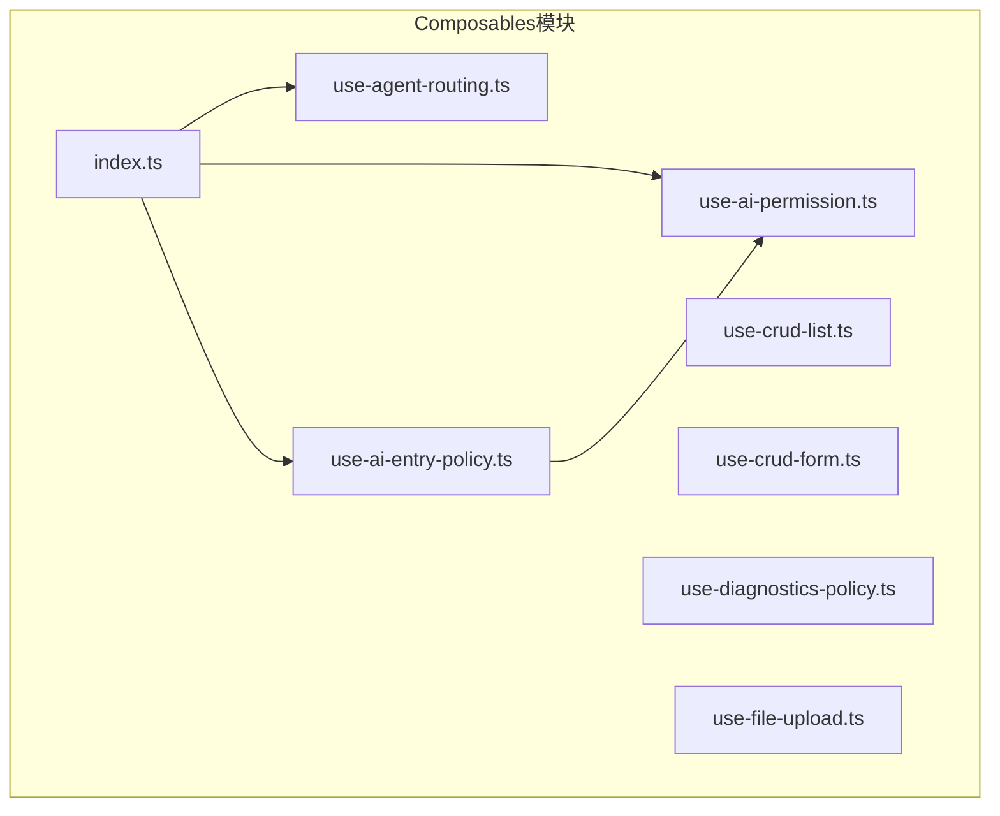
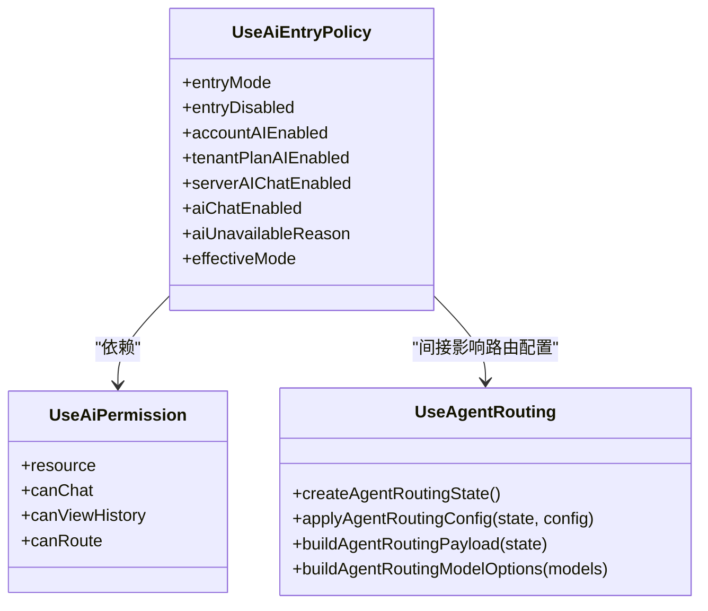
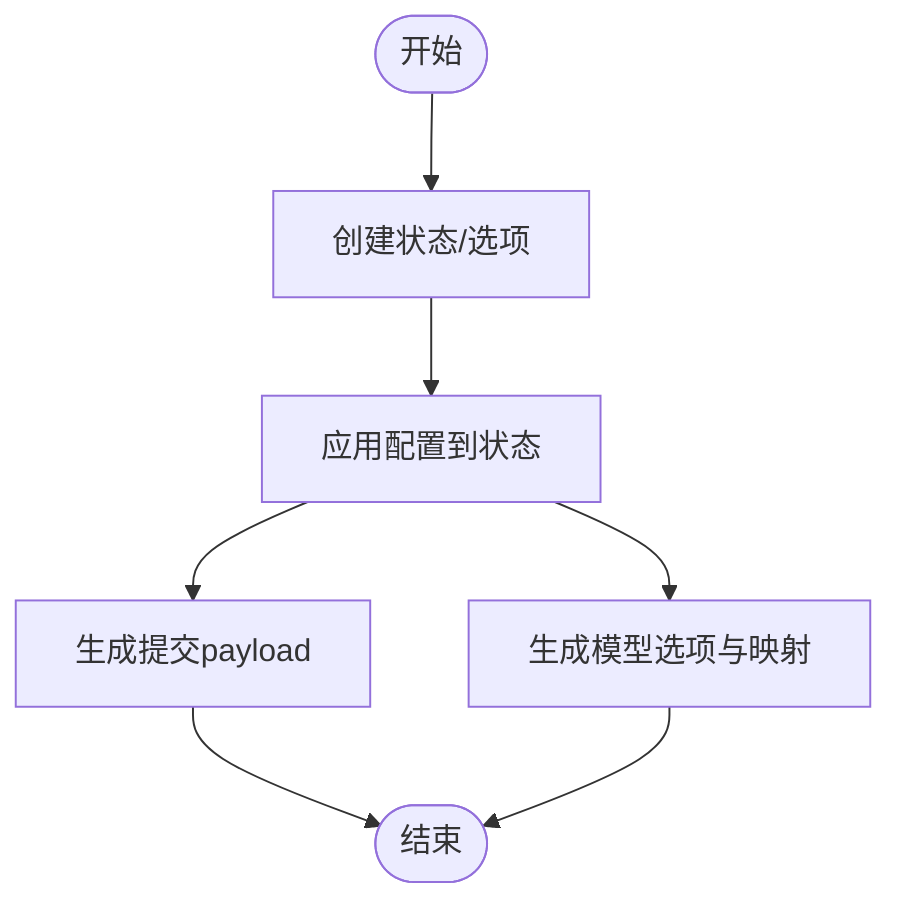
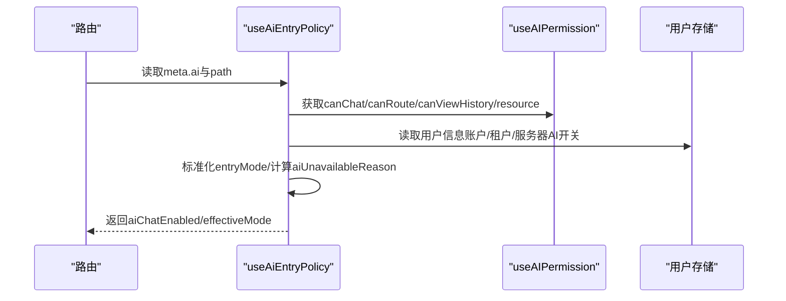
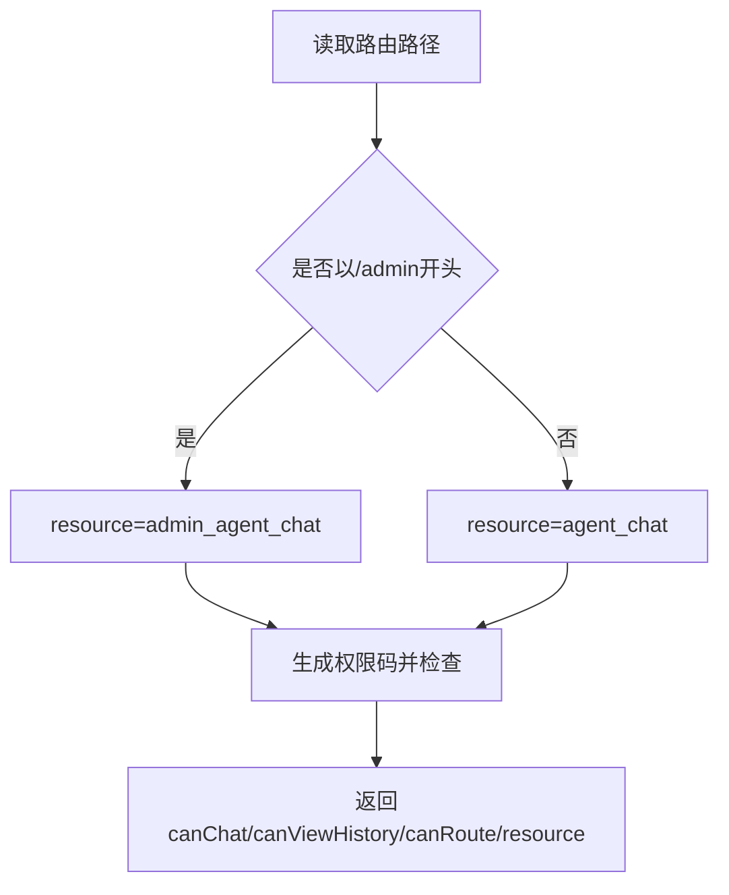
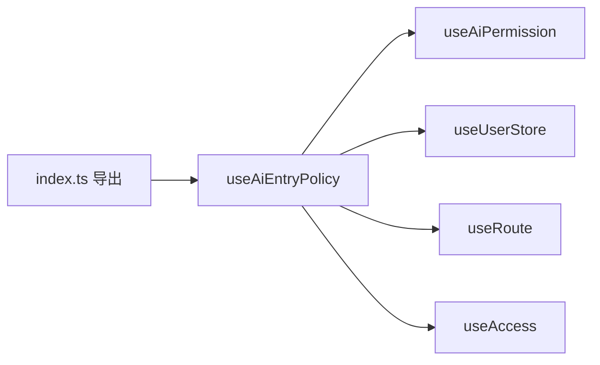

# Composables系统

<cite>
**本文档引用的文件**
- [use-agent-routing.ts](file://frontend/apps/web-antd/src/composables/use-agent-routing.ts)
- [use-ai-entry-policy.ts](file://frontend/apps/web-antd/src/composables/use-ai-entry-policy.ts)
- [use-ai-permission.ts](file://frontend/apps/web-antd/src/composables/use-ai-permission.ts)
- [index.ts](file://frontend/apps/web-antd/src/composables/index.ts)
- [use-crud-list.ts](file://frontend/apps/web-antd/src/composables/use-crud-list.ts)
- [use-diagnostics-policy.ts](file://frontend/apps/web-antd/src/composables/use-diagnostics-policy.ts)
- [use-crud-form.ts](file://frontend/apps/web-antd/src/composables/use-crud-form.ts)
- [use-file-upload.ts](file://frontend/apps/web-antd/src/composables/use-file-upload.ts)
- [use-agent-routing.test.ts](file://frontend/apps/web-antd/src/composables/__tests__/use-agent-routing.test.ts)
- [use-ai-entry-policy.test.ts](file://frontend/apps/web-antd/src/composables/__tests__/use-ai-entry-policy.test.ts)
- [use-ai-permission.test.ts](file://frontend/apps/web-antd/src/composables/__tests__/use-ai-permission.test.ts)
</cite>

## 目录
1. [简介](#简介)
2. [项目结构](#项目结构)
3. [核心组件](#核心组件)
4. [架构总览](#架构总览)
5. [详细组件分析](#详细组件分析)
6. [依赖关系分析](#依赖关系分析)
7. [性能考量](#性能考量)
8. [故障排查指南](#故障排查指南)
9. [结论](#结论)
10. [附录](#附录)

## 简介
本文件面向前端Composables系统，聚焦于响应式状态封装与可复用逻辑抽象。重点覆盖以下核心Composables：
- useAgentRouting：代理路由配置的状态封装与模型选项构建
- useAiEntryPolicy：基于路由元信息与用户态的AI入口可见性决策
- useAiPermission：按路由前缀动态选择权限资源并提供响应式权限判断

同时，文档还涵盖Composables的统一导出、复用策略、性能优化与错误处理机制，并给出自定义Composables的开发规范与最佳实践。

## 项目结构
Composables位于前端应用的统一模块内，采用“按功能域”组织，便于按业务领域复用与维护。核心文件分布如下：
- 核心Composables：use-agent-routing.ts、use-ai-entry-policy.ts、use-ai-permission.ts
- 统一导出：index.ts
- 其他常用Composables：use-crud-list.ts、use-crud-form.ts、use-diagnostics-policy.ts、use-file-upload.ts
- 测试：各Composables对应的__tests__目录下的单元测试

图表来源
- [index.ts:16-18](file://frontend/apps/web-antd/src/composables/index.ts#L16-L18)
- [use-ai-entry-policy.ts:18](file://frontend/apps/web-antd/src/composables/use-ai-entry-policy.ts#L18)

章节来源
- [index.ts:1-33](file://frontend/apps/web-antd/src/composables/index.ts#L1-L33)

## 核心组件
本节对三大核心Composables进行深入解析，包括设计理念、数据结构、参数配置与返回值。

### useAgentRouting
- 设计理念
  - 将代理路由配置抽象为可序列化的状态对象，支持从后端配置应用到本地状态，并能反向生成payload提交。
  - 将可用模型按能力维度拆分为选项集，便于UI选择与后续路由决策。
- 关键接口
  - AgentRoutingState：路由开关、最大Tier、多模态模型ID、长上下文阈值等
  - AgentRoutingModelOptions：音频/视频/视觉/聊天模型选项与输出长度映射
  - AgentRoutingSourceModel：后端模型数据结构
- 主要函数
  - createAgentRoutingState：初始化默认状态
  - createEmptyAgentRoutingModelOptions：初始化空选项
  - applyAgentRoutingConfig：将后端配置应用到状态
  - buildAgentRoutingPayload：将状态序列化为提交payload
  - buildAgentRoutingModelOptions：根据模型能力生成选项集与最大输出映射
- 参数与返回
  - applyAgentRoutingConfig(state, config)：config可为null/undefined/Record
  - buildAgentRoutingPayload(state)：返回包含布尔/数字/字符串/null的payload
  - buildAgentRoutingModelOptions(models)：返回按能力分类的选项集与映射
- 复杂度
  - applyAgentRoutingConfig：O(1)
  - buildAgentRoutingPayload：O(n)（n为状态字段数）
  - buildAgentRoutingModelOptions：O(m)（m为模型数量）

章节来源
- [use-agent-routing.ts:1-115](file://frontend/apps/web-antd/src/composables/use-agent-routing.ts#L1-L115)

### useAiEntryPolicy
- 设计理念
  - 仅决定全局AI聊天入口在当前路由是否可见，综合路由元信息、用户态与权限结果。
  - 将后端返回的不可用原因进行归一化，便于UI提示。
- 关键输入
  - 路由元信息中的ai字段（mode）
  - 用户信息（账户AI开关、租户计划AI开关、服务器侧AI开关、不可用原因）
  - 权限检查（canChat/canViewHistory/canRoute）
- 主要计算
  - entryMode/entryDisabled：从路由meta.ai.mode标准化
  - accountAIEnabled/tenantPlanAIEnabled/serverAIChatEnabled：从用户信息与路由前缀推导
  - aiChatEnabled：综合上述因素得出最终可用性
  - aiUnavailableReason：按优先级归一化后端原因
  - effectiveMode：aiChatEnabled的便捷包装
- 返回值
  - 包含上述所有响应式计算结果与原始资源标识

章节来源
- [use-ai-entry-policy.ts:1-135](file://frontend/apps/web-antd/src/composables/use-ai-entry-policy.ts#L1-L135)

### useAiPermission
- 设计理念
  - 根据路由前缀动态选择权限资源（管理员/租户），提供响应式权限判断。
- 关键点
  - 动态资源名：admin_agent_chat vs agent_chat
  - 权限码：stream/conversations/route
- 返回值
  - canChat/canViewHistory/canRoute/resource

章节来源
- [use-ai-permission.ts:1-56](file://frontend/apps/web-antd/src/composables/use-ai-permission.ts#L1-L56)

## 架构总览
下面的类图展示了三个核心Composables之间的依赖关系与协作方式。

图表来源
- [use-ai-entry-policy.ts:57-134](file://frontend/apps/web-antd/src/composables/use-ai-entry-policy.ts#L57-L134)
- [use-ai-permission.ts:23-55](file://frontend/apps/web-antd/src/composables/use-ai-permission.ts#L23-L55)
- [use-agent-routing.ts:34-114](file://frontend/apps/web-antd/src/composables/use-agent-routing.ts#L34-L114)

## 详细组件分析

### useAgentRouting：状态封装与模型选项
- 数据流
  - 输入：后端配置对象（可为空）
  - 处理：将配置映射到AgentRoutingState
  - 输出：序列化payload与按能力分类的模型选项
- 关键流程图

图表来源
- [use-agent-routing.ts:34-114](file://frontend/apps/web-antd/src/composables/use-agent-routing.ts#L34-L114)

章节来源
- [use-agent-routing.ts:1-115](file://frontend/apps/web-antd/src/composables/use-agent-routing.ts#L1-L115)
- [use-agent-routing.test.ts:1-79](file://frontend/apps/web-antd/src/composables/__tests__/use-agent-routing.test.ts#L1-L79)

### useAiEntryPolicy：AI入口可见性决策
- 决策流程
  - 从路由meta.ai读取mode并标准化
  - 从用户信息读取账户/租户/服务器侧AI开关与不可用原因
  - 结合权限canChat/canRoute/canViewHistory
  - 归一化后端原因并输出aiUnavailableReason
  - 计算effectiveMode与aiChatEnabled
- 序列图（行为验证）

图表来源
- [use-ai-entry-policy.ts:57-134](file://frontend/apps/web-antd/src/composables/use-ai-entry-policy.ts#L57-L134)
- [use-ai-permission.ts:23-55](file://frontend/apps/web-antd/src/composables/use-ai-permission.ts#L23-L55)

章节来源
- [use-ai-entry-policy.ts:1-135](file://frontend/apps/web-antd/src/composables/use-ai-entry-policy.ts#L1-L135)
- [use-ai-entry-policy.test.ts:1-167](file://frontend/apps/web-antd/src/composables/__tests__/use-ai-entry-policy.test.ts#L1-L167)

### useAiPermission：权限资源动态切换
- 关键点
  - 根据路由前缀选择admin_agent_chat或agent_chat
  - 生成stream/conversations/route权限码
- 行为验证

图表来源
- [use-ai-permission.ts:23-55](file://frontend/apps/web-antd/src/composables/use-ai-permission.ts#L23-L55)

章节来源
- [use-ai-permission.ts:1-56](file://frontend/apps/web-antd/src/composables/use-ai-permission.ts#L1-L56)
- [use-ai-permission.test.ts:1-55](file://frontend/apps/web-antd/src/composables/__tests__/use-ai-permission.test.ts#L1-L55)

### 其他常用Composables（概览）
- useCrudList：声明式CRUD列表，提供加载、搜索、分页、增删改、回收站、自动刷新等能力
- useCrudForm：一体化抽屉表单，自动处理camelCase/snake_case映射、提交、Schema切换
- useDiagnosticsPolicy：基于公共配置与API前缀的诊断功能可见性策略
- useFileUpload：统一文件校验（扩展名/大小）与预览URL清理

章节来源
- [use-crud-list.ts:1-762](file://frontend/apps/web-antd/src/composables/use-crud-list.ts#L1-L762)
- [use-crud-form.ts:1-388](file://frontend/apps/web-antd/src/composables/use-crud-form.ts#L1-L388)
- [use-diagnostics-policy.ts:1-86](file://frontend/apps/web-antd/src/composables/use-diagnostics-policy.ts#L1-L86)
- [use-file-upload.ts:1-173](file://frontend/apps/web-antd/src/composables/use-file-upload.ts#L1-L173)

## 依赖关系分析
- 统一导出
  - index.ts集中导出useAIEntryPolicy与useAIPermission等，便于上层按需引入
- 组件间耦合
  - useAiEntryPolicy依赖useAiPermission提供的权限资源与判断
  - useAgentRouting独立于路由与权限，但其配置可能间接影响入口策略
- 外部依赖
  - Vue响应式系统（computed/ref）
  - 路由与Pinia（useRoute/getActivePinia）
  - 权限工具（useAccess）
  - 存储（useUserStore）

图表来源
- [index.ts:16-18](file://frontend/apps/web-antd/src/composables/index.ts#L16-L18)
- [use-ai-entry-policy.ts:14-18](file://frontend/apps/web-antd/src/composables/use-ai-entry-policy.ts#L14-L18)

章节来源
- [index.ts:1-33](file://frontend/apps/web-antd/src/composables/index.ts#L1-L33)
- [use-ai-entry-policy.ts:1-135](file://frontend/apps/web-antd/src/composables/use-ai-entry-policy.ts#L1-L135)

## 性能考量
- 响应式计算
  - 使用computed进行轻量级派生计算，避免重复计算
- 列表加载优化
  - useCrudList支持客户端过滤与服务端分页两种模式，合理选择以平衡网络与CPU
  - 自动刷新仅在前台且未处于加载状态时触发，避免叠加请求
- 文件上传
  - 预览URL撤销防止内存泄漏
- 依赖阻止与级联删除
  - 在删除前先请求预览，减少无效请求与错误反馈成本

章节来源
- [use-crud-list.ts:670-708](file://frontend/apps/web-antd/src/composables/use-crud-list.ts#L670-L708)
- [use-file-upload.ts:154-170](file://frontend/apps/web-antd/src/composables/use-file-upload.ts#L154-L170)

## 故障排查指南
- AI入口不可见
  - 检查路由meta.ai.mode是否被显式禁用
  - 核对用户信息中的账户/租户/服务器AI开关
  - 确认权限canChat/canRoute/canViewHistory
- 路由配置应用异常
  - 确认applyAgentRoutingConfig传入的config为Record或null/undefined
  - 检查buildAgentRoutingPayload生成的payload字段是否符合后端期望
- 权限判定错误
  - 确认路由前缀是否命中admin/tenant分支
  - 检查权限码拼接是否正确（resource:action）

章节来源
- [use-ai-entry-policy.test.ts:76-98](file://frontend/apps/web-antd/src/composables/__tests__/use-ai-entry-policy.test.ts#L76-L98)
- [use-ai-permission.test.ts:23-37](file://frontend/apps/web-antd/src/composables/__tests__/use-ai-permission.test.ts#L23-L37)
- [use-agent-routing.test.ts:11-28](file://frontend/apps/web-antd/src/composables/__tests__/use-agent-routing.test.ts#L11-L28)

## 结论
Composables系统通过响应式封装与职责分离，实现了高内聚、低耦合的可复用逻辑。useAgentRouting、useAiEntryPolicy与useAiPermission三者协同，既保证了入口策略的灵活性，又确保了权限与用户态的一致性。结合统一导出与完善的测试，该体系具备良好的可维护性与扩展性。

## 附录

### 使用方法速查
- useAgentRouting
  - 初始化状态：createAgentRoutingState()
  - 应用配置：applyAgentRoutingConfig(state, config)
  - 生成payload：buildAgentRoutingPayload(state)
  - 生成模型选项：buildAgentRoutingModelOptions(models)
- useAiEntryPolicy
  - 获取策略：useAIEntryPolicy()
  - 关注返回：aiChatEnabled/effectiveMode/aiUnavailableReason
- useAiPermission
  - 获取权限：useAIPermission()
  - 关注返回：resource/canChat/canViewHistory/canRoute

章节来源
- [use-agent-routing.ts:34-114](file://frontend/apps/web-antd/src/composables/use-agent-routing.ts#L34-L114)
- [use-ai-entry-policy.ts:57-134](file://frontend/apps/web-antd/src/composables/use-ai-entry-policy.ts#L57-L134)
- [use-ai-permission.ts:23-55](file://frontend/apps/web-antd/src/composables/use-ai-permission.ts#L23-L55)

### 自定义Composables开发规范与最佳实践
- 命名与职责
  - 命名以use前缀，职责单一，避免跨域耦合
- 响应式设计
  - 优先使用computed/ref，减少副作用
- 参数与返回
  - 明确输入/输出契约，必要时提供默认值与类型约束
- 错误处理
  - 在组合式函数内部捕获并归一化错误，向上抛出易用的结果
- 性能
  - 避免在渲染路径做昂贵计算；利用缓存与防抖
- 测试
  - 为关键分支编写单元测试，覆盖边界与异常路径