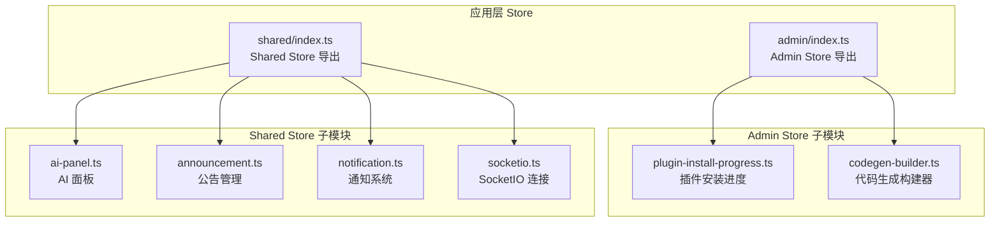
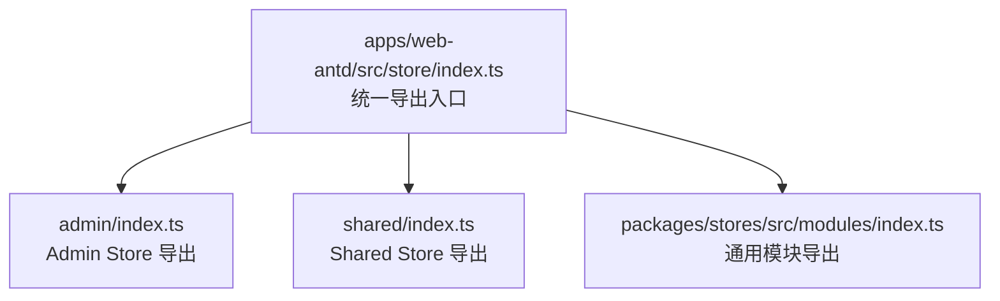
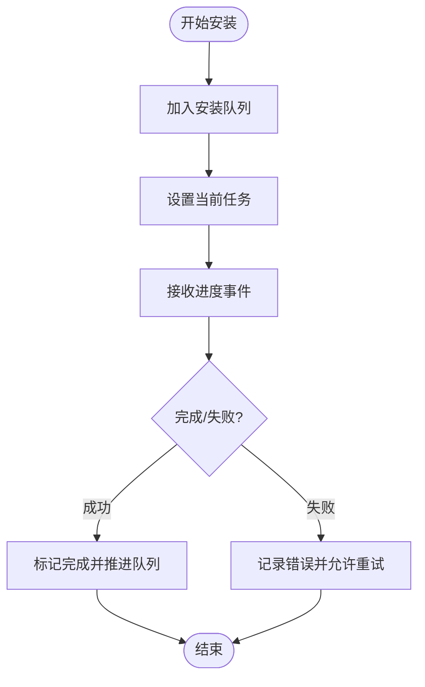
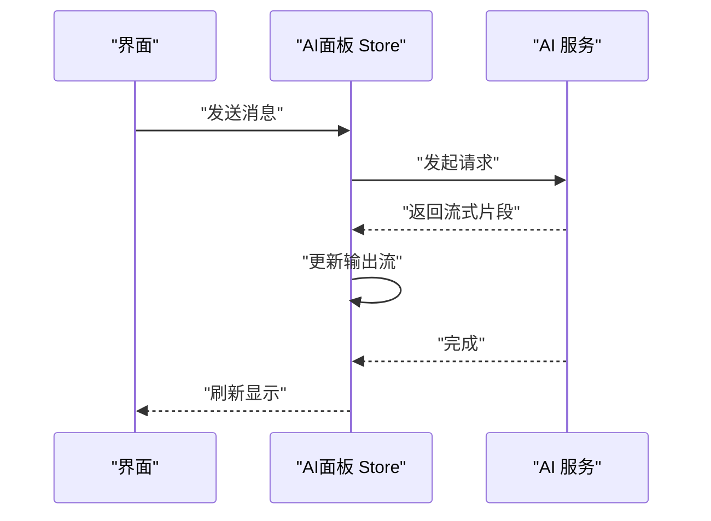
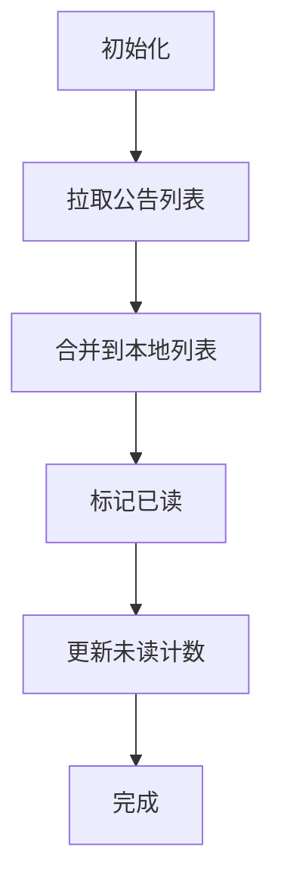
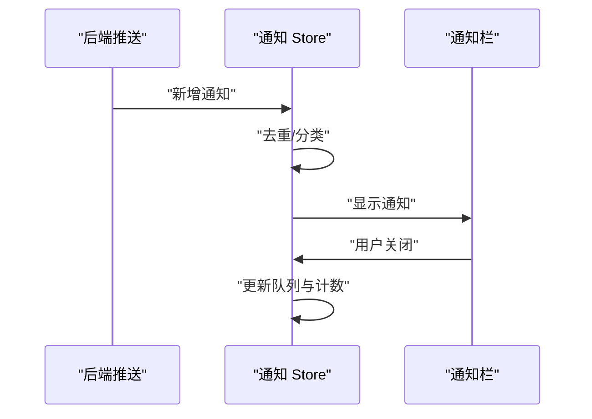
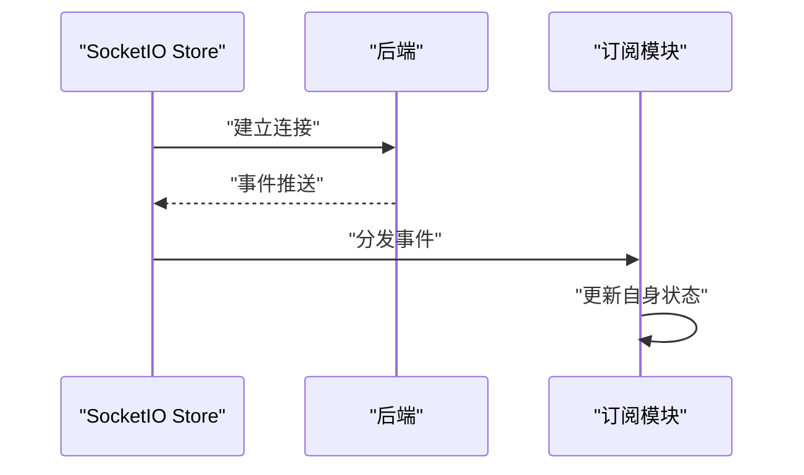
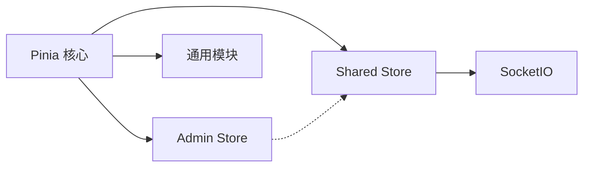

# Store模块

<cite>
**本文引用的文件**
- [frontend/apps/web-antd/src/store/index.ts](file://frontend/apps/web-antd/src/store/index.ts)
- [frontend/apps/web-antd/src/store/admin/index.ts](file://frontend/apps/web-antd/src/store/admin/index.ts)
- [frontend/apps/web-antd/src/store/admin/plugin-install-progress.ts](file://frontend/apps/web-antd/src/store/admin/plugin-install-progress.ts)
- [frontend/apps/web-antd/src/store/shared/index.ts](file://frontend/apps/web-antd/src/store/shared/index.ts)
- [frontend/apps/web-antd/src/store/shared/ai-panel.ts](file://frontend/apps/web-antd/src/store/shared/ai-panel.ts)
- [frontend/apps/web-antd/src/store/shared/announcement.ts](file://frontend/apps/web-antd/src/store/shared/announcement.ts)
- [frontend/apps/web-antd/src/store/shared/notification.ts](file://frontend/apps/web-antd/src/store/shared/notification.ts)
- [frontend/apps/web-antd/src/store/shared/socketio.ts](file://frontend/apps/web-antd/src/store/shared/socketio.ts)
- [frontend/packages/stores/src/index.ts](file://frontend/packages/stores/src/index.ts)
- [frontend/packages/stores/src/modules/index.ts](file://frontend/packages/stores/src/modules/index.ts)
- [frontend/packages/stores/src/modules/user.ts](file://frontend/packages/stores/src/modules/user.ts)
- [frontend/packages/stores/src/modules/access.ts](file://frontend/packages/stores/src/modules/access.ts)
- [frontend/packages/stores/src/modules/tabbar.ts](file://frontend/packages/stores/src/modules/tabbar.ts)
- [frontend/packages/stores/src/modules/timezone.ts](file://frontend/packages/stores/src/modules/timezone.ts)
- [frontend/packages/stores/shim-pinia.d.ts](file://frontend/packages/stores/shim-pinia.d.ts)
</cite>

## 目录
1. [简介](#简介)
2. [项目结构](#项目结构)
3. [核心组件](#核心组件)
4. [架构总览](#架构总览)
5. [详细组件分析](#详细组件分析)
6. [依赖分析](#依赖分析)
7. [性能考虑](#性能考虑)
8. [故障排查指南](#故障排查指南)
9. [结论](#结论)
10. [附录](#附录)

## 简介
本文件面向前端Store模块系统，聚焦于Admin Store与Shared Store的模块化设计与实现。文档将系统性说明各Store模块的职责边界、状态定义、Actions/Mutations实现、模块间通信与状态共享策略、模块注册流程，并结合插件安装进度、AI面板、公告管理、通知系统等具体功能，给出使用示例、最佳实践与性能优化建议。

## 项目结构
前端Store采用“按端分离”的组织方式：Admin Store负责平台管理端状态，Shared Store负责跨端共享状态。Admin Store位于应用层store/admin目录，Shared Store位于store/shared目录；同时，packages/stores提供通用模块（如用户、访问控制、标签页、时区）供多端复用。

图表来源
- [frontend/apps/web-antd/src/store/admin/index.ts:1-200](file://frontend/apps/web-antd/src/store/admin/index.ts#L1-L200)
- [frontend/apps/web-antd/src/store/shared/index.ts:1-200](file://frontend/apps/web-antd/src/store/shared/index.ts#L1-L200)

章节来源
- [frontend/apps/web-antd/src/store/index.ts:1-10](file://frontend/apps/web-antd/src/store/index.ts#L1-L10)
- [frontend/apps/web-antd/src/store/admin/index.ts:1-200](file://frontend/apps/web-antd/src/store/admin/index.ts#L1-L200)
- [frontend/apps/web-antd/src/store/shared/index.ts:1-200](file://frontend/apps/web-antd/src/store/shared/index.ts#L1-L200)

## 核心组件
- Admin Store（平台管理端）
  - 职责：管理平台侧专用状态，如插件安装进度、代码生成构建器等。
  - 关键模块：plugin-install-progress.ts、codegen-builder.ts。
- Shared Store（跨端共享）
  - 职责：管理跨端共享状态，如AI面板、公告、通知、SocketIO连接等。
  - 关键模块：ai-panel.ts、announcement.ts、notification.ts、socketio.ts。
- 通用模块（packages/stores）
  - 职责：提供可复用的通用状态，如用户、访问控制、标签页、时区。
  - 关键模块：user.ts、access.ts、tabbar.ts、timezone.ts。

章节来源
- [frontend/apps/web-antd/src/store/admin/index.ts:1-200](file://frontend/apps/web-antd/src/store/admin/index.ts#L1-L200)
- [frontend/apps/web-antd/src/store/shared/index.ts:1-200](file://frontend/apps/web-antd/src/store/shared/index.ts#L1-L200)
- [frontend/packages/stores/src/modules/index.ts:1-200](file://frontend/packages/stores/src/modules/index.ts#L1-L200)

## 架构总览
Admin Store与Shared Store通过统一的导出入口进行模块化管理，Admin Store专注平台管理场景，Shared Store专注跨端共享能力。通用模块（packages/stores）为多端提供一致的状态抽象与工具。

图表来源
- [frontend/apps/web-antd/src/store/index.ts:1-10](file://frontend/apps/web-antd/src/store/index.ts#L1-L10)
- [frontend/packages/stores/src/index.ts:1-3](file://frontend/packages/stores/src/index.ts#L1-L3)

章节来源
- [frontend/apps/web-antd/src/store/index.ts:1-10](file://frontend/apps/web-antd/src/store/index.ts#L1-L10)
- [frontend/packages/stores/src/index.ts:1-3](file://frontend/packages/stores/src/index.ts#L1-L3)

## 详细组件分析

### Admin Store：插件安装进度（plugin-install-progress）
- 功能职责
  - 跟踪插件安装生命周期与进度，支持开始、更新、完成、失败等状态流转。
  - 提供安装任务队列、当前任务、错误信息等状态字段。
- 状态定义（示意）
  - 安装队列：待处理任务列表
  - 当前任务：正在执行的任务
  - 总数/已完成/失败计数
  - 错误信息与重试策略
- Actions/Mutations
  - 开始安装：入队并切换到当前任务
  - 更新进度：根据事件推进完成度
  - 完成/失败：清理当前任务，推进队列或记录错误
- 模块通信
  - 与后端插件生命周期服务交互，接收进度事件并更新状态
  - 可与其他Admin子模块协作，如代码生成构建器
- 使用示例
  - 在插件市场页面触发安装，订阅进度事件，展示进度条与结果
- 最佳实践
  - 使用原子化Actions减少重复逻辑
  - 对失败任务提供重试按钮与错误提示
  - 合理设置超时与兜底策略

图表来源
- [frontend/apps/web-antd/src/store/admin/plugin-install-progress.ts:1-200](file://frontend/apps/web-antd/src/store/admin/plugin-install-progress.ts#L1-L200)

章节来源
- [frontend/apps/web-antd/src/store/admin/plugin-install-progress.ts:1-200](file://frontend/apps/web-antd/src/store/admin/plugin-install-progress.ts#L1-L200)

### Shared Store：AI面板（ai-panel）
- 功能职责
  - 管理AI面板的可见性、当前选中模型、输入输出状态、历史会话等
  - 支持面板展开/收起、模型切换、上下文注入等
- 状态定义（示意）
  - 展开/折叠标志
  - 当前模型标识
  - 输入文本、输出流、是否正在生成
  - 历史消息列表与当前会话ID
- Actions/Mutations
  - 切换面板：更新展开/折叠状态
  - 选择模型：更新当前模型并清理旧状态
  - 发送消息：发起请求并更新输出流
  - 清空会话：重置输入输出与历史
- 模块通信
  - 与后端AI服务交互，接收流式响应
  - 与通知系统协作，展示错误或完成提示
- 使用示例
  - 在页面右下角点击悬浮按钮打开面板，选择模型后发送消息
- 最佳实践
  - 流式输出需节流/防抖，避免频繁渲染
  - 保持输入框自动高度与滚动同步

图表来源
- [frontend/apps/web-antd/src/store/shared/ai-panel.ts:1-200](file://frontend/apps/web-antd/src/store/shared/ai-panel.ts#L1-L200)

章节来源
- [frontend/apps/web-antd/src/store/shared/ai-panel.ts:1-200](file://frontend/apps/web-antd/src/store/shared/ai-panel.ts#L1-L200)

### Shared Store：公告管理（announcement）
- 功能职责
  - 获取、缓存与展示系统公告，支持分页、筛选与已读状态
- 状态定义（示意）
  - 公告列表、当前页、总数
  - 已读ID集合、未读计数
  - 加载状态与错误信息
- Actions/Mutations
  - 查询公告：拉取分页数据并合并到本地列表
  - 标记已读：更新已读集合与未读计数
  - 清空缓存：重置列表与页码
- 模块通信
  - 与后端公告接口交互
  - 与通知系统联动，对重要公告进行提醒
- 使用示例
  - 登录后拉取公告列表，展示未读数量徽标
- 最佳实践
  - 首屏预取与懒加载结合
  - 已读状态持久化，避免重复提醒

图表来源
- [frontend/apps/web-antd/src/store/shared/announcement.ts:1-200](file://frontend/apps/web-antd/src/store/shared/announcement.ts#L1-L200)

章节来源
- [frontend/apps/web-antd/src/store/shared/announcement.ts:1-200](file://frontend/apps/web-antd/src/store/shared/announcement.ts#L1-L200)

### Shared Store：通知系统（notification）
- 功能职责
  - 管理系统通知的获取、展示、关闭与清理
  - 支持类型分类（成功/警告/错误/信息）、去重与定时关闭
- 状态定义（示意）
  - 通知队列、当前显示项
  - 类型计数（用于徽标）
  - 用户偏好（是否启用声音、震动等）
- Actions/Mutations
  - 添加通知：去重后入队并尝试显示
  - 关闭通知：移除并更新计数
  - 清理过期通知：按时间策略清理
- 模块通信
  - 与SocketIO实时推送集成
  - 与AI面板/公告联动，展示相关事件
- 使用示例
  - 插件安装完成后弹出成功通知
- 最佳实践
  - 控制通知密度，避免刷屏
  - 尊重用户偏好设置

图表来源
- [frontend/apps/web-antd/src/store/shared/notification.ts:1-200](file://frontend/apps/web-antd/src/store/shared/notification.ts#L1-L200)

章节来源
- [frontend/apps/web-antd/src/store/shared/notification.ts:1-200](file://frontend/apps/web-antd/src/store/shared/notification.ts#L1-L200)

### Shared Store：SocketIO（socketio）
- 功能职责
  - 维护与后端的实时连接，订阅频道，派发事件到对应Store
- 状态定义（示意）
  - 连接状态（未连接/连接中/已连接/断开重连）
  - 订阅频道列表
  - 心跳与重连策略参数
- Actions/Mutations
  - 初始化连接：建立连接并订阅频道
  - 处理事件：根据频道分发到相应模块（如通知、公告）
  - 断线重连：指数退避与最大重试次数
- 模块通信
  - 作为事件源，驱动多个子模块状态变更
- 使用示例
  - 插件安装进度事件通过SocketIO推送到客户端
- 最佳实践
  - 合理的心跳间隔与超时阈值
  - 事件幂等与去抖

图表来源
- [frontend/apps/web-antd/src/store/shared/socketio.ts:1-200](file://frontend/apps/web-antd/src/store/shared/socketio.ts#L1-L200)

章节来源
- [frontend/apps/web-antd/src/store/shared/socketio.ts:1-200](file://frontend/apps/web-antd/src/store/shared/socketio.ts#L1-L200)

### 通用模块：用户（user）、访问控制（access）、标签页（tabbar）、时区（timezone）
- 用户（user）
  - 职责：登录态、用户信息、租户切换等
  - 关键状态：用户ID、昵称、角色、当前租户
  - 关键动作：登录、登出、切换租户
- 访问控制（access）
  - 职责：权限矩阵、菜单渲染、路由守卫支持
  - 关键状态：权限集合、菜单树、按钮级权限
  - 关键动作：校验权限、动态加载菜单
- 标签页（tabbar）
  - 职责：多页签状态、缓存策略、关闭行为
  - 关键状态：标签页列表、当前激活页、缓存页集合
  - 关键动作：新增/关闭/刷新页签
- 时区（timezone）
  - 职责：本地时区识别与转换
  - 关键状态：当前时区偏移、是否夏令时
  - 关键动作：设置/更新时区

章节来源
- [frontend/packages/stores/src/modules/user.ts:1-200](file://frontend/packages/stores/src/modules/user.ts#L1-L200)
- [frontend/packages/stores/src/modules/access.ts:1-200](file://frontend/packages/stores/src/modules/access.ts#L1-L200)
- [frontend/packages/stores/src/modules/tabbar.ts:1-200](file://frontend/packages/stores/src/modules/tabbar.ts#L1-L200)
- [frontend/packages/stores/src/modules/timezone.ts:1-200](file://frontend/packages/stores/src/modules/timezone.ts#L1-L200)

## 依赖分析
- 模块耦合
  - Admin Store与Shared Store解耦，Admin仅关注平台管理场景
  - Shared Store内部模块通过SocketIO事件进行松耦合通信
  - 通用模块被多端复用，降低重复实现
- 外部依赖
  - Pinia作为状态容器，提供defineStore、storeToRefs等能力
  - SocketIO用于实时事件分发
- 接口契约
  - 所有Store遵循统一的命名规范与Action/Mutation风格
  - 事件分发遵循频道命名约定，便于追踪与调试

图表来源
- [frontend/packages/stores/src/index.ts:1-3](file://frontend/packages/stores/src/index.ts#L1-L3)
- [frontend/apps/web-antd/src/store/shared/socketio.ts:1-200](file://frontend/apps/web-antd/src/store/shared/socketio.ts#L1-L200)

章节来源
- [frontend/packages/stores/src/index.ts:1-3](file://frontend/packages/stores/src/index.ts#L1-L3)
- [frontend/packages/stores/shim-pinia.d.ts:1-9](file://frontend/packages/stores/shim-pinia.d.ts#L1-L9)

## 性能考虑
- 状态拆分与模块化
  - 将Admin与Shared拆分，避免无关状态影响渲染
- 懒加载与按需注册
  - Store按需导入，减少初始包体
- 事件风暴治理
  - SocketIO事件批量处理与去抖，避免频繁渲染
- 缓存策略
  - 公告与用户偏好本地缓存，降低网络请求
- 渲染优化
  - 使用storeToRefs减少不必要的响应式开销
  - 对高频更新状态进行节流/防抖

## 故障排查指南
- 插件安装进度异常
  - 检查安装队列与当前任务一致性
  - 关注失败重试与错误日志
- AI面板无响应
  - 核查模型选择与输入合法性
  - 检查流式输出是否被中断
- 通知不显示
  - 确认通知队列与去重逻辑
  - 检查用户偏好与浏览器通知权限
- SocketIO断线
  - 查看心跳与重连策略
  - 确认频道订阅与事件分发链路

章节来源
- [frontend/apps/web-antd/src/store/admin/plugin-install-progress.ts:1-200](file://frontend/apps/web-antd/src/store/admin/plugin-install-progress.ts#L1-L200)
- [frontend/apps/web-antd/src/store/shared/ai-panel.ts:1-200](file://frontend/apps/web-antd/src/store/shared/ai-panel.ts#L1-L200)
- [frontend/apps/web-antd/src/store/shared/notification.ts:1-200](file://frontend/apps/web-antd/src/store/shared/notification.ts#L1-L200)
- [frontend/apps/web-antd/src/store/shared/socketio.ts:1-200](file://frontend/apps/web-antd/src/store/shared/socketio.ts#L1-L200)

## 结论
该Store模块系统以Admin/Shared双轨架构清晰划分职责，配合通用模块与SocketIO事件驱动，实现了高内聚、低耦合的状态管理。通过模块化设计与标准化的Action/Mutation模式，既保证了开发效率，也为后续扩展（如更多AI能力、公告类型、通知渠道）提供了良好基础。

## 附录
- 模块注册流程（概念示意）
  - 应用启动时，从统一导出入口引入Admin与Shared Store
  - 各子模块按需注册，初始化默认状态与副作用
  - SocketIO在Shared层建立连接，订阅频道并分发事件
- 最佳实践清单
  - 统一命名与目录结构
  - 明确职责边界，避免跨模块强耦合
  - 事件与状态分离，优先使用事件驱动
  - 对高频操作进行节流/防抖与缓存
  - 重视错误处理与可观测性（日志、埋点）