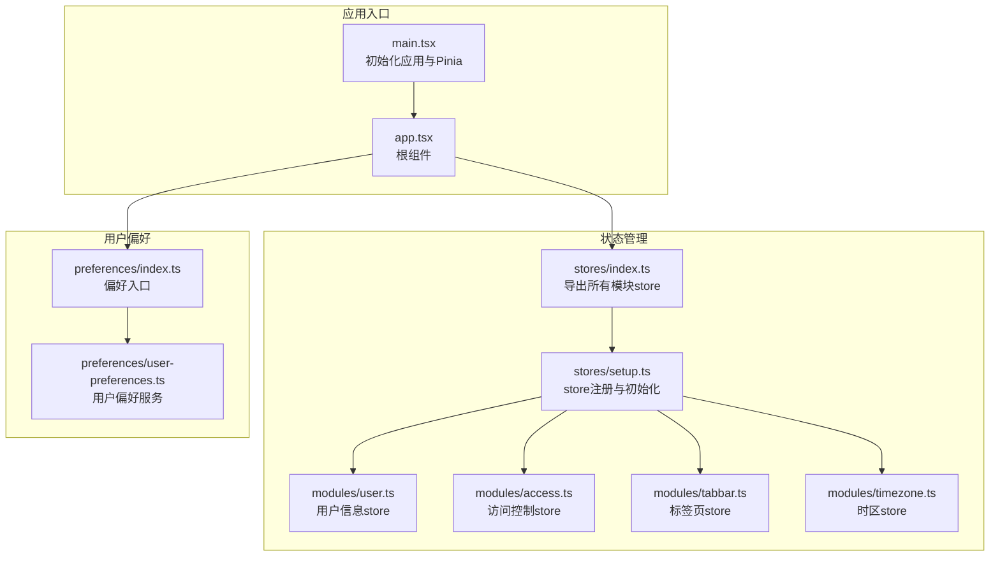
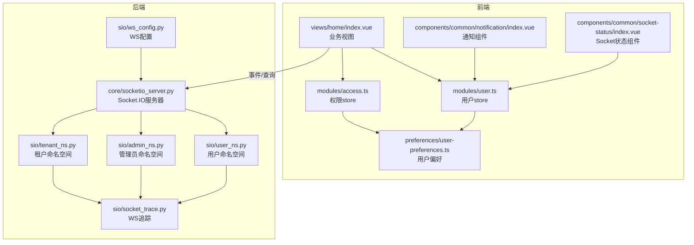
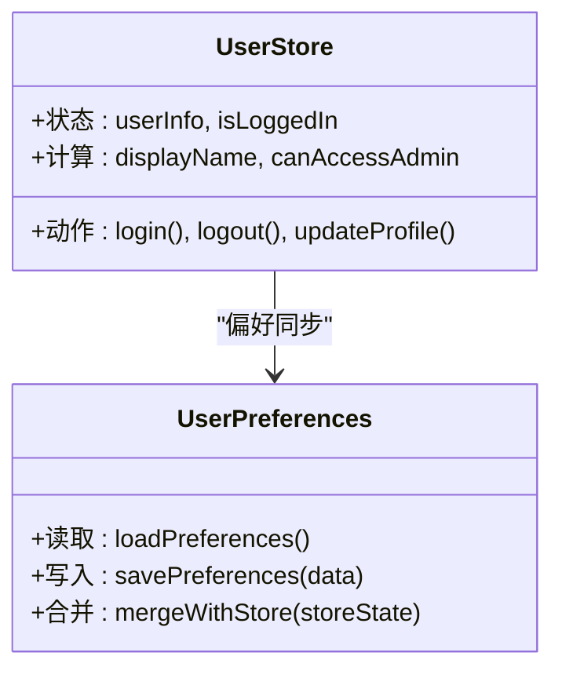
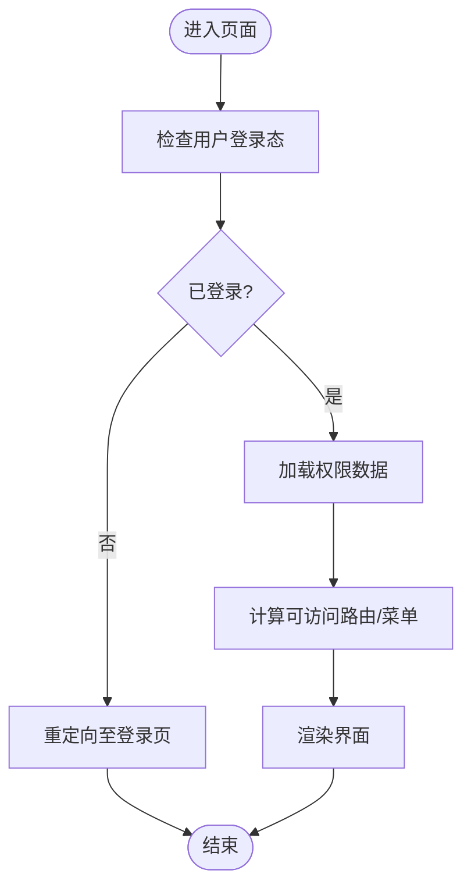
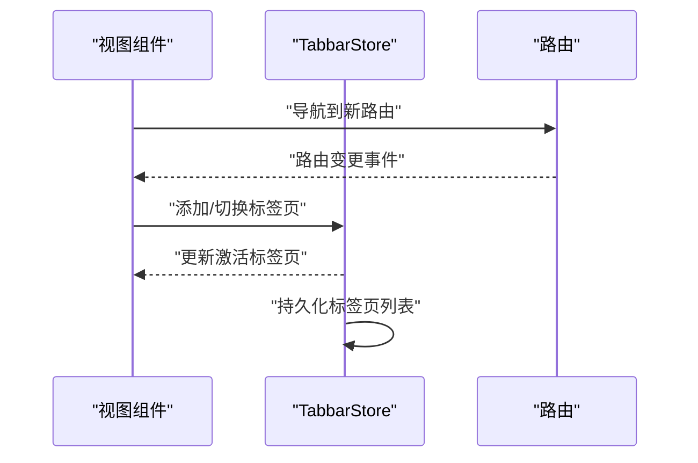
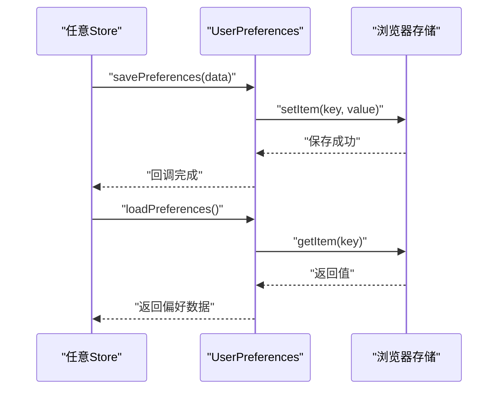
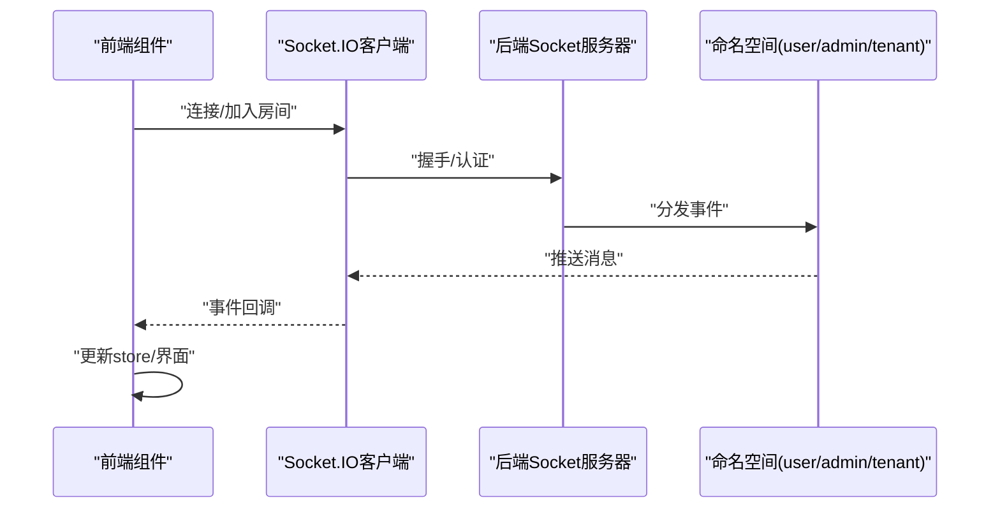
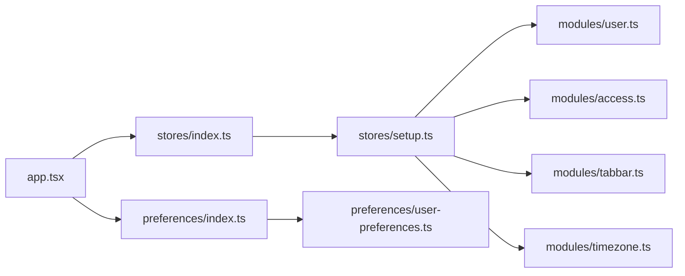

# 响应式数据管理

<cite>
**本文引用的文件**
- [frontend/packages/stores/src/index.ts](file://frontend/packages/stores/src/index.ts)
- [frontend/packages/stores/src/setup.ts](file://frontend/packages/stores/src/setup.ts)
- [frontend/packages/stores/src/modules/user.ts](file://frontend/packages/stores/src/modules/user.ts)
- [frontend/packages/stores/src/modules/access.ts](file://frontend/packages/stores/src/modules/access.ts)
- [frontend/packages/stores/src/modules/tabbar.ts](file://frontend/packages/stores/src/modules/tabbar.ts)
- [frontend/packages/stores/src/modules/timezone.ts](file://frontend/packages/stores/src/modules/timezone.ts)
- [frontend/packages/preferences/src/index.ts](file://frontend/packages/preferences/src/index.ts)
- [frontend/packages/preferences/src/user-preferences.ts](file://frontend/packages/preferences/src/user-preferences.ts)
- [frontend/apps/web-antd/src/app.tsx](file://frontend/apps/web-antd/src/app.tsx)
- [frontend/apps/web-antd/src/main.tsx](file://frontend/apps/web-antd/src/main.tsx)
- [frontend/apps/web-antd/src/router/index.ts](file://frontend/apps/web-antd/src/router/index.ts)
- [frontend/apps/web-antd/src/views/home/index.vue](file://frontend/apps/web-antd/src/views/home/index.vue)
- [frontend/apps/web-antd/src/components/common/notification/index.vue](file://frontend/apps/web-antd/src/components/common/notification/index.vue)
- [frontend/apps/web-antd/src/components/common/socket-status/index.vue](file://frontend/apps/web-antd/src/components/common/socket-status/index.vue)
- [backend/app/sio/socket_trace.py](file://backend/app/sio/socket_trace.py)
- [backend/app/sio/ws_config.py](file://backend/app/sio/ws_config.py)
- [backend/app/core/socketio_server.py](file://backend/app/core/socketio_server.py)
- [backend/app/sio/user_ns.py](file://backend/app/sio/user_ns.py)
- [backend/app/sio/admin_ns.py](file://backend/app/sio/admin_ns.py)
- [backend/app/sio/tenant_ns.py](file://backend/app/sio/tenant_ns.py)
</cite>

## 目录
1. [简介](#简介)
2. [项目结构](#项目结构)
3. [核心组件](#核心组件)
4. [架构总览](#架构总览)
5. [详细组件分析](#详细组件分析)
6. [依赖关系分析](#依赖关系分析)
7. [性能考虑](#性能考虑)
8. [故障排查指南](#故障排查指南)
9. [结论](#结论)
10. [附录](#附录)

## 简介
本技术文档聚焦于前端响应式数据管理系统，围绕 Vue 3 响应式系统与 Pinia 状态管理在本项目的落地实践，系统性阐述以下主题：
- 全局状态与局部状态的协调机制
- 数据同步策略与状态一致性保证
- 用户偏好同步、Socket.IO 连接状态、通知状态等响应式数据的管理实现
- 响应式数据最佳实践、性能监控与调试技巧
- 状态持久化、跨组件通信与数据缓存策略

本项目采用模块化的 Pinia Store 设计，结合用户偏好层与 Socket.IO 实时通道，形成从“本地响应式状态”到“远端实时状态”的闭环。

## 项目结构
前端状态管理位于 packages/stores，采用按功能域划分的模块化组织方式；用户偏好位于 packages/preferences，提供统一的偏好读写与持久化接口；应用入口通过 main.ts 初始化 Pinia 并挂载到根组件 app.tsx。

**图表来源**
- [frontend/apps/web-antd/src/main.tsx:1-200](file://frontend/apps/web-antd/src/main.tsx#L1-L200)
- [frontend/apps/web-antd/src/app.tsx:1-200](file://frontend/apps/web-antd/src/app.tsx#L1-L200)
- [frontend/packages/stores/src/index.ts:1-200](file://frontend/packages/stores/src/index.ts#L1-L200)
- [frontend/packages/stores/src/setup.ts:1-200](file://frontend/packages/stores/src/setup.ts#L1-L200)
- [frontend/packages/stores/src/modules/user.ts:1-200](file://frontend/packages/stores/src/modules/user.ts#L1-L200)
- [frontend/packages/stores/src/modules/access.ts:1-200](file://frontend/packages/stores/src/modules/access.ts#L1-L200)
- [frontend/packages/stores/src/modules/tabbar.ts:1-200](file://frontend/packages/stores/src/modules/tabbar.ts#L1-L200)
- [frontend/packages/stores/src/modules/timezone.ts:1-200](file://frontend/packages/stores/src/modules/timezone.ts#L1-L200)
- [frontend/packages/preferences/src/index.ts:1-200](file://frontend/packages/preferences/src/index.ts#L1-L200)
- [frontend/packages/preferences/src/user-preferences.ts:1-200](file://frontend/packages/preferences/src/user-preferences.ts#L1-L200)

**章节来源**
- [frontend/apps/web-antd/src/main.tsx:1-200](file://frontend/apps/web-antd/src/main.tsx#L1-L200)
- [frontend/apps/web-antd/src/app.tsx:1-200](file://frontend/apps/web-antd/src/app.tsx#L1-L200)
- [frontend/packages/stores/src/index.ts:1-200](file://frontend/packages/stores/src/index.ts#L1-L200)
- [frontend/packages/stores/src/setup.ts:1-200](file://frontend/packages/stores/src/setup.ts#L1-L200)
- [frontend/packages/stores/src/modules/user.ts:1-200](file://frontend/packages/stores/src/modules/user.ts#L1-L200)
- [frontend/packages/stores/src/modules/access.ts:1-200](file://frontend/packages/stores/src/modules/access.ts#L1-L200)
- [frontend/packages/stores/src/modules/tabbar.ts:1-200](file://frontend/packages/stores/src/modules/tabbar.ts#L1-L200)
- [frontend/packages/stores/src/modules/timezone.ts:1-200](file://frontend/packages/stores/src/modules/timezone.ts#L1-L200)
- [frontend/packages/preferences/src/index.ts:1-200](file://frontend/packages/preferences/src/index.ts#L1-L200)
- [frontend/packages/preferences/src/user-preferences.ts:1-200](file://frontend/packages/preferences/src/user-preferences.ts#L1-L200)

## 核心组件
- 模块化 Pinia Store：以功能域划分（用户、访问控制、标签页、时区），每个模块独立维护自身状态与派生计算，通过统一入口导出，便于按需引入与测试。
- 用户偏好层：提供偏好读取、写入与持久化能力，支持与全局状态联动，确保用户设置在刷新后仍保持一致。
- Socket.IO 集成：通过后端命名空间与前端组件配合，实现连接状态、通知状态等实时数据的响应式更新。

关键实现要点：
- 使用响应式数据结构承载状态，结合计算属性与侦听器实现派生与副作用。
- 将持久化逻辑封装在偏好层，避免直接操作浏览器存储，提升可测试性与可维护性。
- 在组件中通过组合式 API 访问 store，减少样板代码，增强可读性。

**章节来源**
- [frontend/packages/stores/src/modules/user.ts:1-200](file://frontend/packages/stores/src/modules/user.ts#L1-L200)
- [frontend/packages/stores/src/modules/access.ts:1-200](file://frontend/packages/stores/src/modules/access.ts#L1-L200)
- [frontend/packages/stores/src/modules/tabbar.ts:1-200](file://frontend/packages/stores/src/modules/tabbar.ts#L1-L200)
- [frontend/packages/stores/src/modules/timezone.ts:1-200](file://frontend/packages/stores/src/modules/timezone.ts#L1-L200)
- [frontend/packages/preferences/src/user-preferences.ts:1-200](file://frontend/packages/preferences/src/user-preferences.ts#L1-L200)

## 架构总览
下图展示了从前端应用到后端 Socket.IO 的整体数据流与交互路径，体现响应式状态如何在本地与远端之间保持一致。

**图表来源**
- [frontend/apps/web-antd/src/views/home/index.vue:1-200](file://frontend/apps/web-antd/src/views/home/index.vue#L1-L200)
- [frontend/apps/web-antd/src/components/common/notification/index.vue:1-200](file://frontend/apps/web-antd/src/components/common/notification/index.vue#L1-L200)
- [frontend/apps/web-antd/src/components/common/socket-status/index.vue:1-200](file://frontend/apps/web-antd/src/components/common/socket-status/index.vue#L1-L200)
- [frontend/packages/stores/src/modules/user.ts:1-200](file://frontend/packages/stores/src/modules/user.ts#L1-L200)
- [frontend/packages/stores/src/modules/access.ts:1-200](file://frontend/packages/stores/src/modules/access.ts#L1-L200)
- [frontend/packages/preferences/src/user-preferences.ts:1-200](file://frontend/packages/preferences/src/user-preferences.ts#L1-L200)
- [backend/app/core/socketio_server.py:1-200](file://backend/app/core/socketio_server.py#L1-L200)
- [backend/app/sio/user_ns.py:1-200](file://backend/app/sio/user_ns.py#L1-L200)
- [backend/app/sio/admin_ns.py:1-200](file://backend/app/sio/admin_ns.py#L1-L200)
- [backend/app/sio/tenant_ns.py:1-200](file://backend/app/sio/tenant_ns.py#L1-L200)
- [backend/app/sio/ws_config.py:1-200](file://backend/app/sio/ws_config.py#L1-L200)
- [backend/app/sio/socket_trace.py:1-200](file://backend/app/sio/socket_trace.py#L1-L200)

## 详细组件分析

### 用户信息 Store（user.ts）
职责与特性：
- 维护当前登录用户的基本信息与会话状态
- 提供派生计算（如是否已登录）与副作用（如登录成功后的偏好同步）
- 与用户偏好层协作，实现用户设置的持久化与恢复

**图表来源**
- [frontend/packages/stores/src/modules/user.ts:1-200](file://frontend/packages/stores/src/modules/user.ts#L1-L200)
- [frontend/packages/preferences/src/user-preferences.ts:1-200](file://frontend/packages/preferences/src/user-preferences.ts#L1-L200)

**章节来源**
- [frontend/packages/stores/src/modules/user.ts:1-200](file://frontend/packages/stores/src/modules/user.ts#L1-L200)
- [frontend/packages/preferences/src/user-preferences.ts:1-200](file://frontend/packages/preferences/src/user-preferences.ts#L1-L200)

### 访问控制 Store（access.ts）
职责与特性：
- 维护用户权限矩阵与路由守卫所需的数据
- 提供权限判断的计算属性，降低组件耦合度
- 与用户信息 store 协作，在登录态变化时自动刷新权限

**图表来源**
- [frontend/packages/stores/src/modules/access.ts:1-200](file://frontend/packages/stores/src/modules/access.ts#L1-L200)

**章节来源**
- [frontend/packages/stores/src/modules/access.ts:1-200](file://frontend/packages/stores/src/modules/access.ts#L1-L200)

### 标签页 Store（tabbar.ts）
职责与特性：
- 维护当前打开的标签页列表与激活状态
- 支持标签页增删改查与持久化，保障多页面场景下的状态一致性
- 与路由模块联动，实现标签页与路由的双向同步

**图表来源**
- [frontend/packages/stores/src/modules/tabbar.ts:1-200](file://frontend/packages/stores/src/modules/tabbar.ts#L1-L200)
- [frontend/apps/web-antd/src/router/index.ts:1-200](file://frontend/apps/web-antd/src/router/index.ts#L1-L200)

**章节来源**
- [frontend/packages/stores/src/modules/tabbar.ts:1-200](file://frontend/packages/stores/src/modules/tabbar.ts#L1-L200)
- [frontend/apps/web-antd/src/router/index.ts:1-200](file://frontend/apps/web-antd/src/router/index.ts#L1-L200)

### 时区 Store（timezone.ts）
职责与特性：
- 维护用户选择的时区与本地化偏好
- 提供格式化工具函数，统一时间显示与存储格式
- 与用户偏好层集成，确保跨设备与跨会话的一致性

**章节来源**
- [frontend/packages/stores/src/modules/timezone.ts:1-200](file://frontend/packages/stores/src/modules/timezone.ts#L1-L200)

### 用户偏好层（preferences）
职责与特性：
- 封装本地存储与网络同步逻辑，屏蔽实现细节
- 提供统一的读写接口，支持增量更新与回滚
- 与各模块 store 解耦，通过事件或手动触发同步

**图表来源**
- [frontend/packages/preferences/src/user-preferences.ts:1-200](file://frontend/packages/preferences/src/user-preferences.ts#L1-L200)

**章节来源**
- [frontend/packages/preferences/src/index.ts:1-200](file://frontend/packages/preferences/src/index.ts#L1-L200)
- [frontend/packages/preferences/src/user-preferences.ts:1-200](file://frontend/packages/preferences/src/user-preferences.ts#L1-L200)

### Socket.IO 连接状态与通知（后端）
职责与特性：
- 后端通过命名空间区分用户、管理员与租户场景，前端组件订阅对应事件
- 连接状态与消息推送通过 store 响应式更新，组件自动刷新
- 提供追踪与配置模块，便于诊断与调优

**图表来源**
- [backend/app/core/socketio_server.py:1-200](file://backend/app/core/socketio_server.py#L1-L200)
- [backend/app/sio/user_ns.py:1-200](file://backend/app/sio/user_ns.py#L1-L200)
- [backend/app/sio/admin_ns.py:1-200](file://backend/app/sio/admin_ns.py#L1-L200)
- [backend/app/sio/tenant_ns.py:1-200](file://backend/app/sio/tenant_ns.py#L1-L200)
- [backend/app/sio/ws_config.py:1-200](file://backend/app/sio/ws_config.py#L1-L200)
- [backend/app/sio/socket_trace.py:1-200](file://backend/app/sio/socket_trace.py#L1-L200)

**章节来源**
- [backend/app/core/socketio_server.py:1-200](file://backend/app/core/socketio_server.py#L1-L200)
- [backend/app/sio/user_ns.py:1-200](file://backend/app/sio/user_ns.py#L1-L200)
- [backend/app/sio/admin_ns.py:1-200](file://backend/app/sio/admin_ns.py#L1-L200)
- [backend/app/sio/tenant_ns.py:1-200](file://backend/app/sio/tenant_ns.py#L1-L200)
- [backend/app/sio/ws_config.py:1-200](file://backend/app/sio/ws_config.py#L1-L200)
- [backend/app/sio/socket_trace.py:1-200](file://backend/app/sio/socket_trace.py#L1-L200)

## 依赖关系分析
- 模块内聚：各模块仅关注自身领域，通过统一入口导出，降低耦合
- 跨模块协作：用户与访问控制模块存在依赖关系，权限变更影响路由与菜单渲染
- 外部依赖：Pinia 作为状态容器，Vue 3 响应式系统提供底层驱动；Socket.IO 提供实时通信能力
- 存储依赖：用户偏好层封装本地存储，避免直接依赖浏览器 API

**图表来源**
- [frontend/packages/stores/src/index.ts:1-200](file://frontend/packages/stores/src/index.ts#L1-L200)
- [frontend/packages/stores/src/setup.ts:1-200](file://frontend/packages/stores/src/setup.ts#L1-L200)
- [frontend/packages/stores/src/modules/user.ts:1-200](file://frontend/packages/stores/src/modules/user.ts#L1-L200)
- [frontend/packages/stores/src/modules/access.ts:1-200](file://frontend/packages/stores/src/modules/access.ts#L1-L200)
- [frontend/packages/stores/src/modules/tabbar.ts:1-200](file://frontend/packages/stores/src/modules/tabbar.ts#L1-L200)
- [frontend/packages/stores/src/modules/timezone.ts:1-200](file://frontend/packages/stores/src/modules/timezone.ts#L1-L200)
- [frontend/packages/preferences/src/index.ts:1-200](file://frontend/packages/preferences/src/index.ts#L1-L200)
- [frontend/packages/preferences/src/user-preferences.ts:1-200](file://frontend/packages/preferences/src/user-preferences.ts#L1-L200)
- [frontend/apps/web-antd/src/app.tsx:1-200](file://frontend/apps/web-antd/src/app.tsx#L1-L200)

**章节来源**
- [frontend/packages/stores/src/index.ts:1-200](file://frontend/packages/stores/src/index.ts#L1-L200)
- [frontend/packages/stores/src/setup.ts:1-200](file://frontend/packages/stores/src/setup.ts#L1-L200)
- [frontend/packages/stores/src/modules/user.ts:1-200](file://frontend/packages/stores/src/modules/user.ts#L1-L200)
- [frontend/packages/stores/src/modules/access.ts:1-200](file://frontend/packages/stores/src/modules/access.ts#L1-L200)
- [frontend/packages/stores/src/modules/tabbar.ts:1-200](file://frontend/packages/stores/src/modules/tabbar.ts#L1-L200)
- [frontend/packages/stores/src/modules/timezone.ts:1-200](file://frontend/packages/stores/src/modules/timezone.ts#L1-L200)
- [frontend/packages/preferences/src/index.ts:1-200](file://frontend/packages/preferences/src/index.ts#L1-L200)
- [frontend/packages/preferences/src/user-preferences.ts:1-200](file://frontend/packages/preferences/src/user-preferences.ts#L1-L200)
- [frontend/apps/web-antd/src/app.tsx:1-200](file://frontend/apps/web-antd/src/app.tsx#L1-L200)

## 性能考虑
- 响应式粒度控制：避免在单个 store 中存放过大的对象，拆分为细粒度状态，减少不必要的重渲染
- 计算属性优先：将派生数据放入计算属性，利用缓存避免重复计算
- 侦听器节流：对高频事件（如滚动、输入）使用节流/防抖，降低副作用开销
- 按需加载：模块 store 采用懒加载与动态导入，减少首屏负担
- 缓存策略：对远程数据采用内存缓存与持久化缓存双层策略，提升二次访问速度
- Socket 优化：合理使用命名空间与房间，避免广播风暴；对离线重连进行指数退避与去重处理

[本节为通用指导，无需列出具体文件来源]

## 故障排查指南
- 状态不一致：检查 store 与偏好层的同步流程，确认写入顺序与回滚机制
- 权限异常：核对访问控制 store 的权限来源与刷新时机，确保登录态变化后及时更新
- 标签页错乱：检查路由与标签页 store 的联动逻辑，确保路由变更与标签页切换一致
- Socket 不可用：查看后端命名空间与连接追踪日志，确认握手、认证与房间加入流程
- 性能问题：使用浏览器性能面板定位重渲染热点，审查计算属性与侦听器的使用

**章节来源**
- [frontend/packages/stores/src/modules/access.ts:1-200](file://frontend/packages/stores/src/modules/access.ts#L1-L200)
- [frontend/packages/stores/src/modules/tabbar.ts:1-200](file://frontend/packages/stores/src/modules/tabbar.ts#L1-L200)
- [backend/app/sio/socket_trace.py:1-200](file://backend/app/sio/socket_trace.py#L1-L200)
- [backend/app/sio/ws_config.py:1-200](file://backend/app/sio/ws_config.py#L1-L200)

## 结论
本项目通过模块化的 Pinia Store 与用户偏好层，构建了清晰的前端响应式数据管理体系。结合 Socket.IO 实时通道，实现了从“本地响应式状态”到“远端实时状态”的高效协同。遵循本文的最佳实践与排障建议，可在保证状态一致性的同时，持续优化性能与可维护性。

[本节为总结性内容，无需列出具体文件来源]

## 附录
- 最佳实践清单
  - 将状态与行为封装在模块 store 中，避免全局污染
  - 使用计算属性表达派生数据，减少重复计算
  - 对高频副作用进行节流/防抖处理
  - 明确模块间依赖关系，避免循环依赖
  - 为 store 提供类型定义与单元测试，提升可靠性
- 调试技巧
  - 利用浏览器开发工具观察响应式数据变化轨迹
  - 为关键事件添加日志与追踪，定位异常路径
  - 对 Socket 事件进行断言与回归测试，确保稳定性

[本节为通用指导，无需列出具体文件来源]