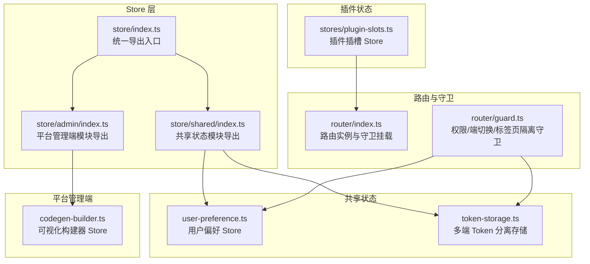
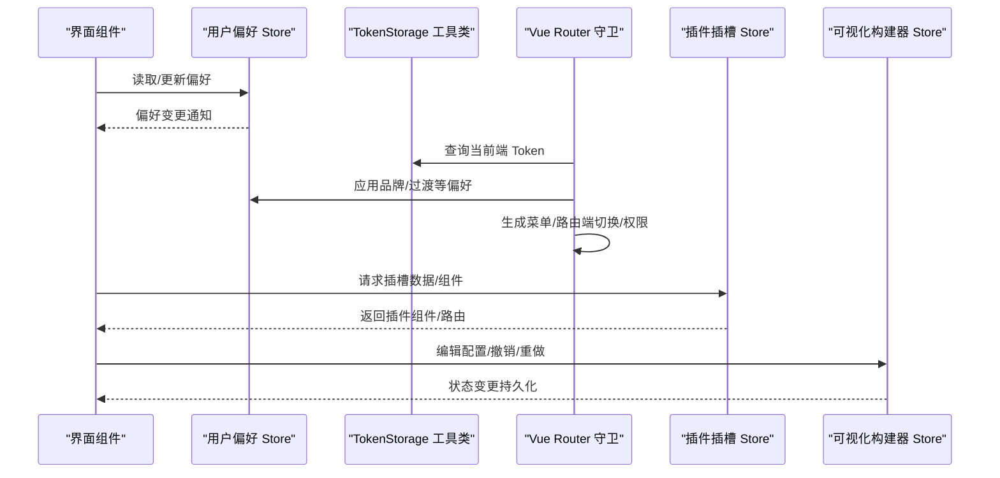
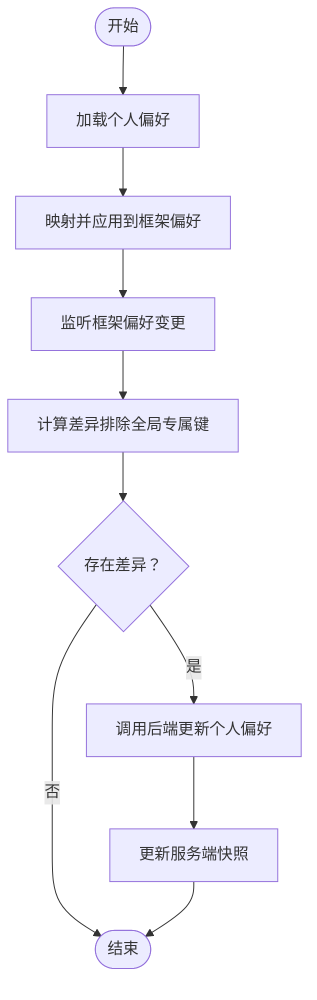
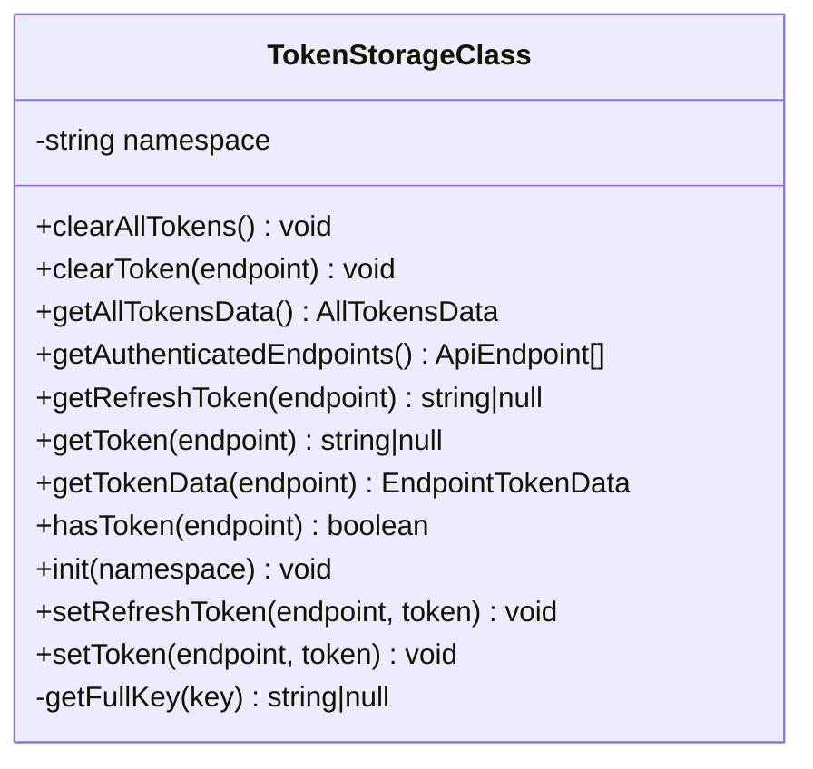
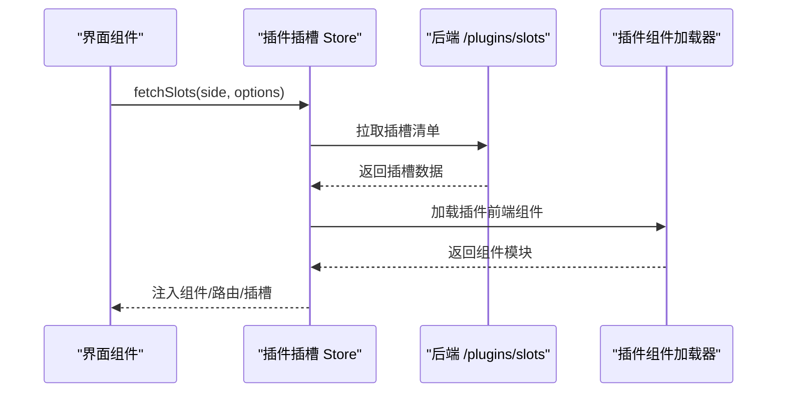
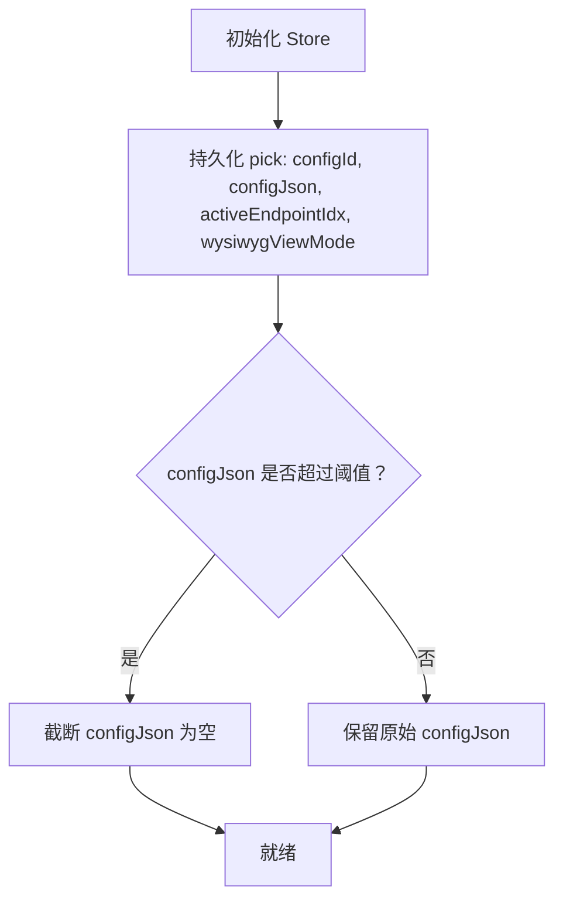
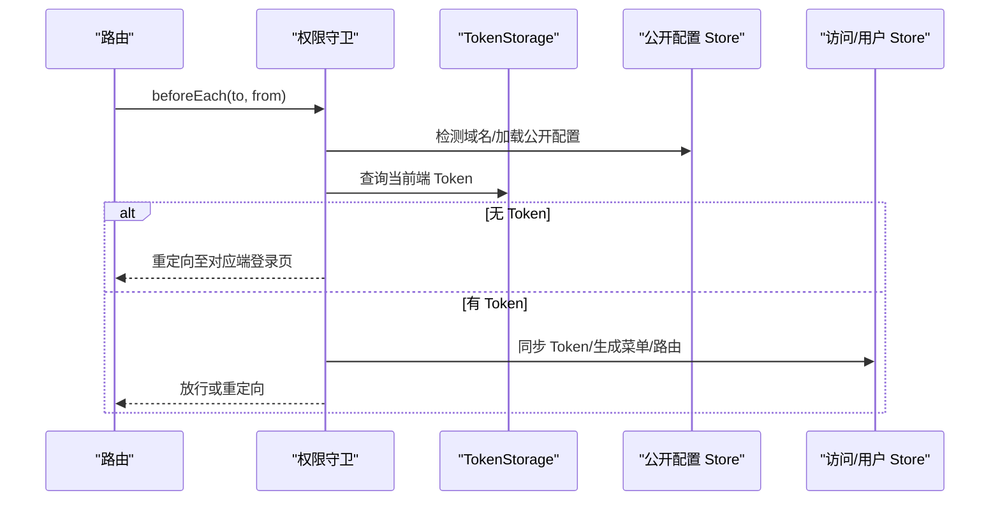
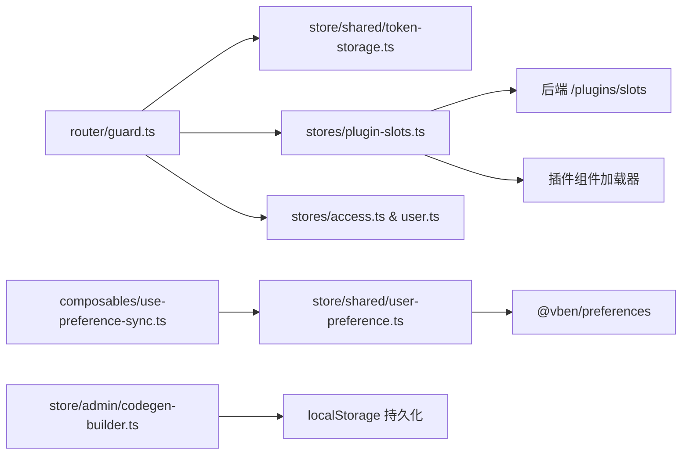

# 状态管理

<cite>
**本文引用的文件**
- [apps/web-antd/src/store/index.ts](file://apps/web-antd/src/store/index.ts)
- [apps/web-antd/src/store/shared/index.ts](file://apps/web-antd/src/store/shared/index.ts)
- [apps/web-antd/src/store/shared/user-preference.ts](file://apps/web-antd/src/store/shared/user-preference.ts)
- [apps/web-antd/src/store/shared/token-storage.ts](file://apps/web-antd/src/store/shared/token-storage.ts)
- [apps/web-antd/src/composables/use-preference-sync.ts](file://apps/web-antd/src/composables/use-preference-sync.ts)
- [apps/web-antd/src/store/admin/index.ts](file://apps/web-antd/src/store/admin/index.ts)
- [apps/web-antd/src/store/admin/codegen-builder.ts](file://apps/web-antd/src/store/admin/codegen-builder.ts)
- [apps/web-antd/src/stores/plugin-slots.ts](file://apps/web-antd/src/stores/plugin-slots.ts)
- [apps/web-antd/src/router/index.ts](file://apps/web-antd/src/router/index.ts)
- [apps/web-antd/src/router/guard.ts](file://apps/web-antd/src/router/guard.ts)
</cite>

## 目录
1. [简介](#简介)
2. [项目结构](#项目结构)
3. [核心组件](#核心组件)
4. [架构总览](#架构总览)
5. [详细组件分析](#详细组件分析)
6. [依赖关系分析](#依赖关系分析)
7. [性能考量](#性能考量)
8. [故障排查指南](#故障排查指南)
9. [结论](#结论)
10. [附录](#附录)

## 简介
本文件系统性梳理前端状态管理方案，围绕以下目标展开：
- Vuex Store 的组织结构与 Pinia Composables 的使用
- 响应式数据管理、状态定义、变更与订阅机制
- 模块化状态设计、状态持久化与状态同步策略
- 插件状态、路由状态与用户偏好状态的实现
- 最佳实践、性能优化与调试技巧

## 项目结构
前端状态管理采用“按端分离”的模块化组织，核心位于 apps/web-antd/src/store 与 apps/web-antd/src/stores，并通过 composables 提供可复用的状态订阅与同步逻辑。

**图表来源**
- [apps/web-antd/src/store/index.ts:1-11](file://apps/web-antd/src/store/index.ts#L1-L11)
- [apps/web-antd/src/store/shared/index.ts:1-15](file://apps/web-antd/src/store/shared/index.ts#L1-L15)
- [apps/web-antd/src/store/admin/index.ts:1-7](file://apps/web-antd/src/store/admin/index.ts#L1-L7)
- [apps/web-antd/src/store/shared/user-preference.ts:221-423](file://apps/web-antd/src/store/shared/user-preference.ts#L221-L423)
- [apps/web-antd/src/store/shared/token-storage.ts:81-230](file://apps/web-antd/src/store/shared/token-storage.ts#L81-L230)
- [apps/web-antd/src/store/admin/codegen-builder.ts:124-410](file://apps/web-antd/src/store/admin/codegen-builder.ts#L124-L410)
- [apps/web-antd/src/stores/plugin-slots.ts:86-384](file://apps/web-antd/src/stores/plugin-slots.ts#L86-L384)
- [apps/web-antd/src/router/index.ts:16-39](file://apps/web-antd/src/router/index.ts#L16-L39)
- [apps/web-antd/src/router/guard.ts:496-506](file://apps/web-antd/src/router/guard.ts#L496-L506)

**章节来源**
- [apps/web-antd/src/store/index.ts:1-11](file://apps/web-antd/src/store/index.ts#L1-L11)
- [apps/web-antd/src/store/shared/index.ts:1-15](file://apps/web-antd/src/store/shared/index.ts#L1-L15)
- [apps/web-antd/src/store/admin/index.ts:1-7](file://apps/web-antd/src/store/admin/index.ts#L1-L7)

## 核心组件
- 用户偏好 Store（Pinia）：负责用户偏好的加载、映射、更新与与框架偏好系统的双向同步。
- 多端 Token 分离存储（工具类）：提供 admin/tenant/user 三端 Token 的独立持久化与查询。
- 插件插槽 Store（Pinia）：统一拉取后端插槽清单，按需加载插件前端组件并维护 UI 插槽状态。
- 可视化构建器 Store（Pinia + 持久化）：管理配置 JSON、预览缓存、撤销/重做历史与视图状态，并对关键字段进行持久化。
- 路由守卫（配合状态）：基于端类型、Token、权限与品牌配置，动态生成菜单/路由并隔离标签页。

**章节来源**
- [apps/web-antd/src/store/shared/user-preference.ts:221-423](file://apps/web-antd/src/store/shared/user-preference.ts#L221-L423)
- [apps/web-antd/src/store/shared/token-storage.ts:81-230](file://apps/web-antd/src/store/shared/token-storage.ts#L81-L230)
- [apps/web-antd/src/stores/plugin-slots.ts:86-384](file://apps/web-antd/src/stores/plugin-slots.ts#L86-L384)
- [apps/web-antd/src/store/admin/codegen-builder.ts:124-410](file://apps/web-antd/src/store/admin/codegen-builder.ts#L124-L410)
- [apps/web-antd/src/router/guard.ts:113-442](file://apps/web-antd/src/router/guard.ts#L113-L442)

## 架构总览
下图展示状态管理的关键交互：用户偏好与 Token 状态驱动路由守卫，插件插槽 Store 在运行时加载插件组件，构建器 Store 通过持久化提升用户体验。

**图表来源**
- [apps/web-antd/src/router/guard.ts:113-442](file://apps/web-antd/src/router/guard.ts#L113-L442)
- [apps/web-antd/src/store/shared/token-storage.ts:140-212](file://apps/web-antd/src/store/shared/token-storage.ts#L140-L212)
- [apps/web-antd/src/store/shared/user-preference.ts:253-420](file://apps/web-antd/src/store/shared/user-preference.ts#L253-L420)
- [apps/web-antd/src/stores/plugin-slots.ts:120-296](file://apps/web-antd/src/stores/plugin-slots.ts#L120-L296)
- [apps/web-antd/src/store/admin/codegen-builder.ts:124-410](file://apps/web-antd/src/store/admin/codegen-builder.ts#L124-L410)

## 详细组件分析

### 用户偏好 Store（Pinia）
- 职责
  - 加载/更新个人偏好与全局偏好
  - 将后端扁平化偏好映射为框架嵌套偏好并同步
  - 支持全局偏好实时预览与个人偏好同步的互斥控制
- 状态与行为
  - 状态：当前生效偏好、全局偏好、全局预览偏好、加载状态、当前端、全局预览开关
  - 行为：加载个人/全局偏好、更新个人/全局偏好、重置个人偏好、清空本地缓存、应用服务器偏好、设置全局预览偏好
- 映射机制
  - 后端扁平键到框架嵌套路径的正反向映射，确保只同步受控键
- 与框架集成
  - 通过框架偏好系统更新主题、布局、国际化等

**图表来源**
- [apps/web-antd/src/store/shared/user-preference.ts:253-420](file://apps/web-antd/src/store/shared/user-preference.ts#L253-L420)
- [apps/web-antd/src/composables/use-preference-sync.ts:52-154](file://apps/web-antd/src/composables/use-preference-sync.ts#L52-L154)

**章节来源**
- [apps/web-antd/src/store/shared/user-preference.ts:221-423](file://apps/web-antd/src/store/shared/user-preference.ts#L221-L423)
- [apps/web-antd/src/composables/use-preference-sync.ts:1-154](file://apps/web-antd/src/composables/use-preference-sync.ts#L1-L154)

### 多端 Token 分离存储（工具类）
- 设计目标
  - admin、tenant、user 三端 Token 互不干扰
  - 支持跨端模拟登录（Impersonate）
- 存储规范
  - 使用命名空间前缀 + 端区分后缀的键规范
- 能力
  - 获取/设置/清除指定端 Token
  - 获取所有端 Token 数据与已认证端列表
  - 初始化命名空间（应用启动时）

**图表来源**
- [apps/web-antd/src/store/shared/token-storage.ts:81-230](file://apps/web-antd/src/store/shared/token-storage.ts#L81-L230)

**章节来源**
- [apps/web-antd/src/store/shared/token-storage.ts:1-230](file://apps/web-antd/src/store/shared/token-storage.ts#L1-L230)

### 插件插槽 Store（Pinia）
- 职责
  - 统一拉取后端插槽清单（header/dashboard/settings/floating/notification/pages）
  - 按需加载插件前端组件（UMD），并注入到对应插槽
  - 维护插槽列表、排序、标题本地化、访问码、事件等元数据
- 关键流程
  - fetchSlots：幂等加载、图标注册、组件提取、快照替换
  - registerSlot/unregisterPlugin/clearAll：运行时插槽管理
  - 支持强制重载与卸载插件以支持热更新

**图表来源**
- [apps/web-antd/src/stores/plugin-slots.ts:120-296](file://apps/web-antd/src/stores/plugin-slots.ts#L120-L296)

**章节来源**
- [apps/web-antd/src/stores/plugin-slots.ts:1-384](file://apps/web-antd/src/stores/plugin-slots.ts#L1-L384)

### 可视化构建器 Store（Pinia + 持久化）
- 职责
  - 管理配置 JSON、预览缓存、撤销/重做历史、字段管理面板、视图模式、验证警告
- 持久化策略
  - 仅持久化关键字段（配置 ID、配置 JSON、活动端点索引、视图模式）
  - 对超大配置 JSON 进行字节长度限制，避免占满本地存储
- 能力
  - 深度合并更新、历史栈管理、字段规范化与去重、专家模式计数

**图表来源**
- [apps/web-antd/src/store/admin/codegen-builder.ts:402-410](file://apps/web-antd/src/store/admin/codegen-builder.ts#L402-L410)
- [apps/web-antd/src/store/admin/codegen-builder.ts:45-67](file://apps/web-antd/src/store/admin/codegen-builder.ts#L45-L67)

**章节来源**
- [apps/web-antd/src/store/admin/codegen-builder.ts:1-410](file://apps/web-antd/src/store/admin/codegen-builder.ts#L1-L410)

### 路由状态与守卫（与状态联动）
- 通用守卫
  - 页面加载进度条、首屏跳过重复进入效果
- 权限守卫
  - 域名检测确定端类型、加载对应公开配置、维护模式检查
  - 端切换重置权限与动态路由、Token 同步到访问 Store
  - 生成菜单/路由、处理插件路由占位与重解析
- 标签页守卫
  - 端切换时批量关闭非当前端标签页，实现端内标签隔离

**图表来源**
- [apps/web-antd/src/router/guard.ts:113-442](file://apps/web-antd/src/router/guard.ts#L113-L442)
- [apps/web-antd/src/router/index.ts:16-39](file://apps/web-antd/src/router/index.ts#L16-L39)

**章节来源**
- [apps/web-antd/src/router/guard.ts:1-506](file://apps/web-antd/src/router/guard.ts#L1-L506)
- [apps/web-antd/src/router/index.ts:1-39](file://apps/web-antd/src/router/index.ts#L1-L39)

## 依赖关系分析
- 模块耦合
  - 路由守卫依赖 TokenStorage、公开配置 Store、访问/用户 Store
  - 用户偏好 Store 与框架偏好系统耦合，通过 Composables 进行双向同步
  - 插件插槽 Store 依赖后端 API 与插件组件加载器
- 外部依赖
  - Vue Router、Pinia、@vben/preferences、@vben/utils、@vben/icons

**图表来源**
- [apps/web-antd/src/router/guard.ts:113-442](file://apps/web-antd/src/router/guard.ts#L113-L442)
- [apps/web-antd/src/store/shared/token-storage.ts:140-212](file://apps/web-antd/src/store/shared/token-storage.ts#L140-L212)
- [apps/web-antd/src/store/shared/user-preference.ts:253-420](file://apps/web-antd/src/store/shared/user-preference.ts#L253-L420)
- [apps/web-antd/src/composables/use-preference-sync.ts:52-154](file://apps/web-antd/src/composables/use-preference-sync.ts#L52-L154)
- [apps/web-antd/src/stores/plugin-slots.ts:120-296](file://apps/web-antd/src/stores/plugin-slots.ts#L120-L296)
- [apps/web-antd/src/store/admin/codegen-builder.ts:402-410](file://apps/web-antd/src/store/admin/codegen-builder.ts#L402-L410)

**章节来源**
- [apps/web-antd/src/router/guard.ts:113-442](file://apps/web-antd/src/router/guard.ts#L113-L442)
- [apps/web-antd/src/store/shared/user-preference.ts:253-420](file://apps/web-antd/src/store/shared/user-preference.ts#L253-L420)
- [apps/web-antd/src/stores/plugin-slots.ts:120-296](file://apps/web-antd/src/stores/plugin-slots.ts#L120-L296)
- [apps/web-antd/src/store/admin/codegen-builder.ts:402-410](file://apps/web-antd/src/store/admin/codegen-builder.ts#L402-L410)

## 性能考量
- 偏好同步防抖
  - 使用防抖函数降低频繁变更导致的后端压力
- 持久化体积控制
  - 可视化构建器对 configJson 进行字节长度限制，避免本地存储溢出
- 组件懒加载与缓存
  - 插件组件按需加载并缓存，支持强制重载以适配热更新
- 路由守卫幂等
  - 域名检测仅首次导航发起请求，避免重复开销

**章节来源**
- [apps/web-antd/src/composables/use-preference-sync.ts:94-105](file://apps/web-antd/src/composables/use-preference-sync.ts#L94-L105)
- [apps/web-antd/src/store/admin/codegen-builder.ts:38-67](file://apps/web-antd/src/store/admin/codegen-builder.ts#L38-L67)
- [apps/web-antd/src/stores/plugin-slots.ts:164-183](file://apps/web-antd/src/stores/plugin-slots.ts#L164-L183)
- [apps/web-antd/src/router/guard.ts:154-156](file://apps/web-antd/src/router/guard.ts#L154-L156)

## 故障排查指南
- 偏好同步异常
  - 现象：WS 全局更新后个人偏好被错误覆盖
  - 排查：确认全局预览开关与 WS 时间戳窗口，避免防抖回调误写
  - 参考：全局更新处理与快照更新逻辑
- Token 读取异常
  - 现象：端切换后 Token 未正确同步
  - 排查：确认命名空间初始化与端键映射，检查 TokenStorage.clearToken 的调用时机
- 插件组件缺失
  - 现象：插件页面组件未导出或加载失败
  - 排查：检查后端 slots 返回与前端组件导出一致性，关注页面失败列表
- 路由重定向死循环
  - 现象：跨端重定向导致登录页循环
  - 排查：守卫中对目标端 Token 存在性进行判断，必要时停留在登录页

**章节来源**
- [apps/web-antd/src/composables/use-preference-sync.ts:108-127](file://apps/web-antd/src/composables/use-preference-sync.ts#L108-L127)
- [apps/web-antd/src/store/shared/token-storage.ts:186-225](file://apps/web-antd/src/store/shared/token-storage.ts#L186-L225)
- [apps/web-antd/src/stores/plugin-slots.ts:209-223](file://apps/web-antd/src/stores/plugin-slots.ts#L209-L223)
- [apps/web-antd/src/router/guard.ts:278-290](file://apps/web-antd/src/router/guard.ts#L278-L290)

## 结论
本状态管理方案以 Pinia 为核心，结合 Composables 实现偏好与路由状态的解耦与高效同步；通过多端 Token 分离、插槽 Store 的按需加载与持久化策略，满足复杂业务场景下的模块化与可扩展需求。建议在实际落地中遵循本文最佳实践，持续优化性能与可观测性。

## 附录
- 最佳实践
  - 使用 Composables 封装跨组件的状态订阅与同步
  - 对关键状态进行持久化与体积控制
  - 在路由守卫中统一处理端类型、权限与品牌配置
- 调试技巧
  - 利用浏览器开发者工具观察 Pinia 状态变更
  - 关注 WS 全局更新时间戳与快照一致性
  - 通过强制重载插件组件定位加载失败问题