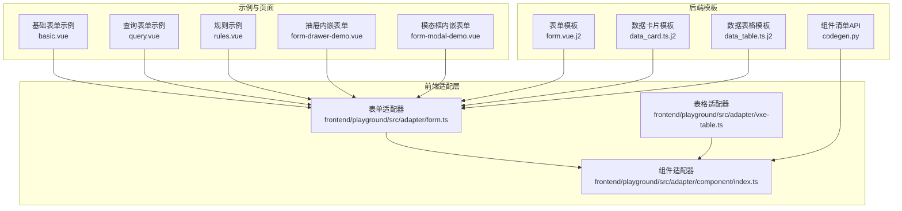
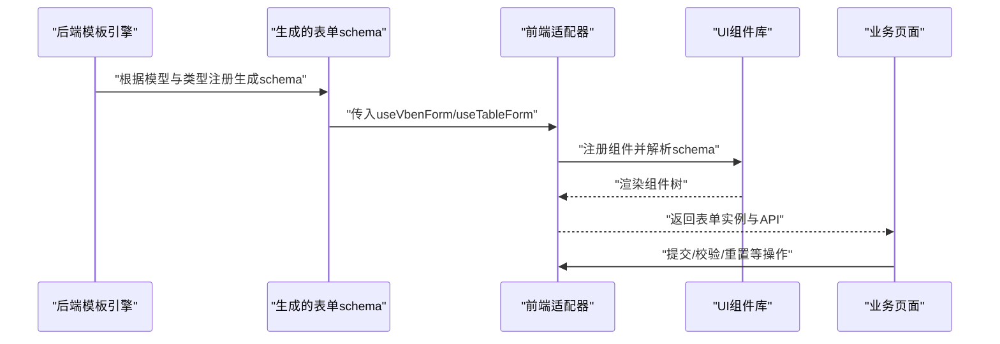
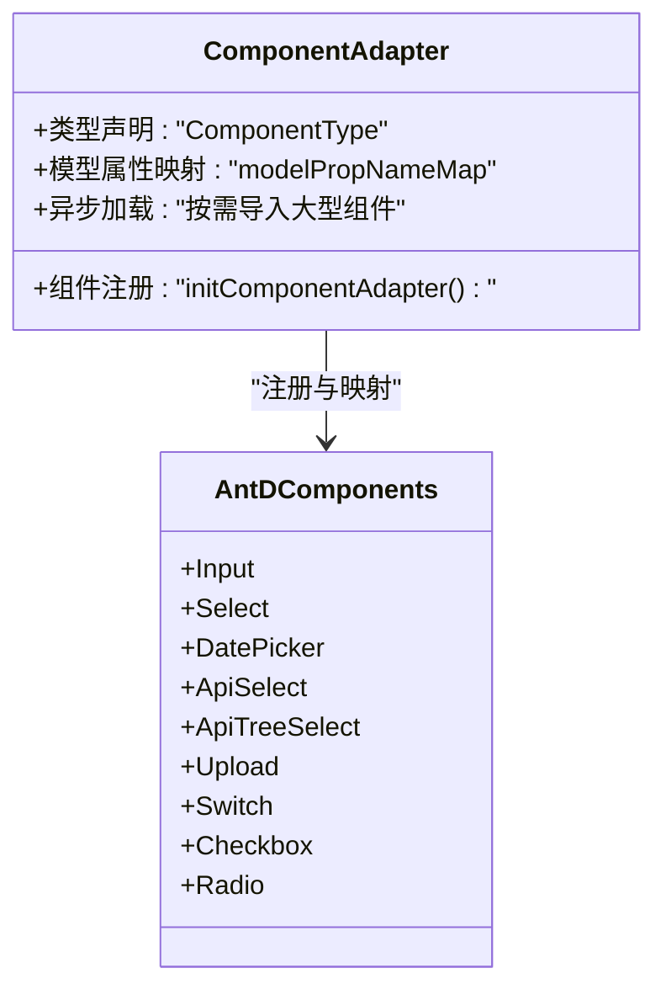
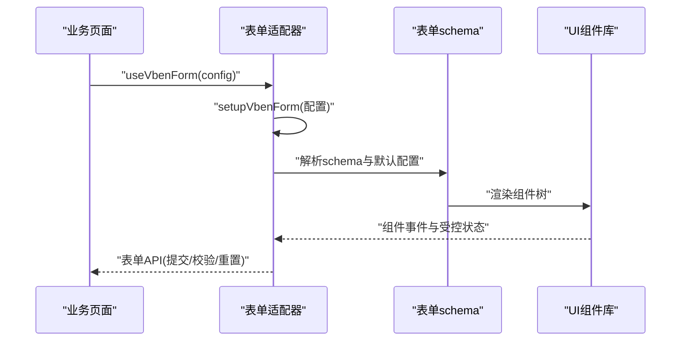
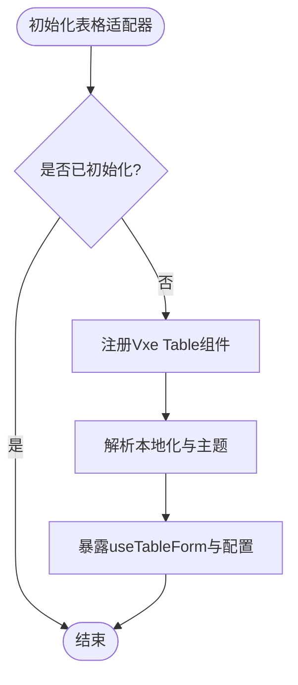
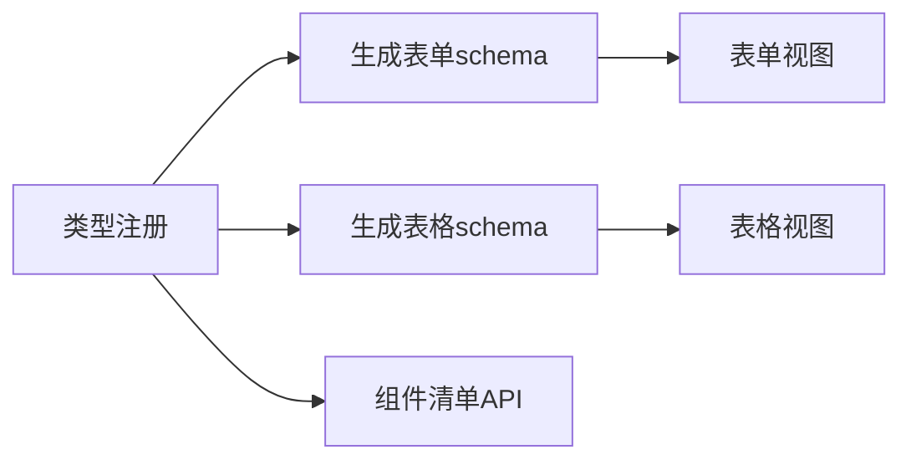
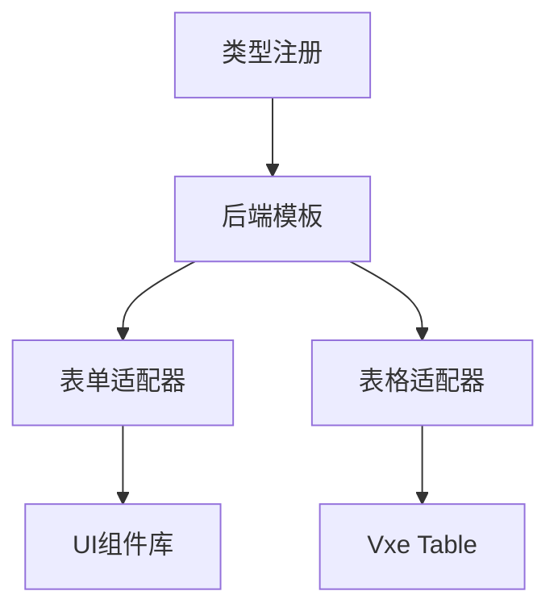

# UI适配器组件

<cite>
**本文档引用的文件**
- [frontend/playground/src/adapter/form.ts](file://frontend/playground/src/adapter/form.ts)
- [frontend/playground/src/adapter/component/index.ts](file://frontend/playground/src/adapter/component/index.ts)
- [frontend/playground/src/adapter/vxe-table.ts](file://frontend/playground/src/adapter/vxe-table.ts)
- [frontend/playground/src/views/examples/form/basic.vue](file://frontend/playground/src/views/examples/form/basic.vue)
- [frontend/playground/src/views/examples/form/query.vue](file://frontend/playground/src/views/examples/form/query.vue)
- [frontend/playground/src/views/examples/form/rules.vue](file://frontend/playground/src/views/examples/form/rules.vue)
- [frontend/playground/src/views/examples/drawer/form-drawer-demo.vue](file://frontend/playground/src/views/examples/drawer/form-drawer-demo.vue)
- [frontend/playground/src/views/examples/modal/form-modal-demo.vue](file://frontend/playground/src/views/examples/modal/form-modal-demo.vue)
- [backend/app/codegen/templates/frontend/form.vue.j2](file://backend/app/codegen/templates/frontend/form.vue.j2)
- [backend/app/codegen/templates/frontend/data_card.ts.j2](file://backend/app/codegen/templates/frontend/data_card.ts.j2)
- [backend/app/codegen/templates/frontend/data_table.ts.j2](file://backend/app/codegen/templates/frontend/data_table.ts.j2)
- [backend/app/api/admin/codegen.py](file://backend/app/api/admin/codegen.py)
- [frontend/packages/effects/plugins/src/vxe-table/init.ts](file://frontend/packages/effects/plugins/src/vxe-table/init.ts)
</cite>

## 目录
1. [简介](#简介)
2. [项目结构](#项目结构)
3. [核心组件](#核心组件)
4. [架构总览](#架构总览)
5. [详细组件分析](#详细组件分析)
6. [依赖关系分析](#依赖关系分析)
7. [性能考量](#性能考量)
8. [故障排查指南](#故障排查指南)
9. [结论](#结论)
10. [附录](#附录)

## 简介
本文件系统性地文档化了前端UI适配器组件，重点覆盖以下方面：
- 组件适配器：如何将通用表单/表格schema映射到具体UI库组件（如Ant Design Vue、Vxe Table等），并支持按需异步加载与模型属性适配。
- 表单适配器：统一的表单渲染与校验规则配置，支持多布局、默认行为与国际化规则。
- 表格适配器：基于Vxe Table的表格初始化与本地化适配，确保组件注册与运行时稳定性。
- 抽象接口与适配策略：通过类型约束与协议桥接，实现对第三方UI库的解耦与扩展。
- 兼容性处理：针对不同组件库的v-model命名差异、默认值与受控状态差异进行适配。
- 配置选项与扩展机制：提供组件注册、模型属性映射、校验规则、默认布局与行为等配置入口。
- 自定义适配器开发：给出从零开始接入新UI库的步骤与最佳实践。
- 性能考虑与错误处理：懒加载、一次性注册、错误边界与回退策略。
- 与第三方UI库的集成模式：以Ant Design Vue与Vxe Table为例，展示适配流程。

## 项目结构
UI适配器位于前端Playground工程中，围绕“表单适配器”和“组件适配器”两大模块构建，并通过模板引擎在后端生成前端表单/表格代码。关键目录与文件如下：
- 表单适配器：负责表单schema解析、校验规则定义、默认行为配置与表单实例化。
- 组件适配器：负责UI组件注册、模型属性映射、按需异步加载与类型声明。
- 表格适配器：负责Vxe Table组件注册、本地化与初始化封装。
- 示例页面：演示表单布局、规则、抽屉/模态框内嵌表单等典型场景。
- 后端模板：根据数据模型与类型注册信息，自动生成表单schema与表格列定义。

**图表来源**
- [frontend/playground/src/adapter/form.ts:1-47](file://frontend/playground/src/adapter/form.ts#L1-L47)
- [frontend/playground/src/adapter/component/index.ts:353-387](file://frontend/playground/src/adapter/component/index.ts#L353-L387)
- [frontend/playground/src/adapter/vxe-table.ts](file://frontend/playground/src/adapter/vxe-table.ts)
- [frontend/playground/src/views/examples/form/basic.vue:53-90](file://frontend/playground/src/views/examples/form/basic.vue#L53-L90)
- [frontend/playground/src/views/examples/form/query.vue:1-143](file://frontend/playground/src/views/examples/form/query.vue#L1-L143)
- [frontend/playground/src/views/examples/form/rules.vue:1-52](file://frontend/playground/src/views/examples/form/rules.vue#L1-L52)
- [frontend/playground/src/views/examples/drawer/form-drawer-demo.vue:1-56](file://frontend/playground/src/views/examples/drawer/form-drawer-demo.vue#L1-L56)
- [frontend/playground/src/views/examples/modal/form-modal-demo.vue:1-68](file://frontend/playground/src/views/examples/modal/form-modal-demo.vue#L1-L68)
- [backend/app/codegen/templates/frontend/form.vue.j2:1-42](file://backend/app/codegen/templates/frontend/form.vue.j2#L1-L42)
- [backend/app/codegen/templates/frontend/data_card.ts.j2:36-62](file://backend/app/codegen/templates/frontend/data_card.ts.j2#L36-L62)
- [backend/app/codegen/templates/frontend/data_table.ts.j2:211-235](file://backend/app/codegen/templates/frontend/data_table.ts.j2#L211-L235)
- [backend/app/api/admin/codegen.py:373-403](file://backend/app/api/admin/codegen.py#L373-L403)

**章节来源**
- [frontend/playground/src/adapter/form.ts:1-47](file://frontend/playground/src/adapter/form.ts#L1-L47)
- [frontend/playground/src/adapter/component/index.ts:353-387](file://frontend/playground/src/adapter/component/index.ts#L353-L387)
- [frontend/playground/src/adapter/vxe-table.ts](file://frontend/playground/src/adapter/vxe-table.ts)
- [frontend/playground/src/views/examples/form/basic.vue:53-90](file://frontend/playground/src/views/examples/form/basic.vue#L53-L90)
- [frontend/playground/src/views/examples/form/query.vue:1-143](file://frontend/playground/src/views/examples/form/query.vue#L1-L143)
- [frontend/playground/src/views/examples/form/rules.vue:1-52](file://frontend/playground/src/views/examples/form/rules.vue#L1-L52)
- [frontend/playground/src/views/examples/drawer/form-drawer-demo.vue:1-56](file://frontend/playground/src/views/examples/drawer/form-drawer-demo.vue#L1-L56)
- [frontend/playground/src/views/examples/modal/form-modal-demo.vue:1-68](file://frontend/playground/src/views/examples/modal/form-modal-demo.vue#L1-L68)
- [backend/app/codegen/templates/frontend/form.vue.j2:1-42](file://backend/app/codegen/templates/frontend/form.vue.j2#L1-L42)
- [backend/app/codegen/templates/frontend/data_card.ts.j2:36-62](file://backend/app/codegen/templates/frontend/data_card.ts.j2#L36-L62)
- [backend/app/codegen/templates/frontend/data_table.ts.j2:211-235](file://backend/app/codegen/templates/frontend/data_table.ts.j2#L211-L235)
- [backend/app/api/admin/codegen.py:373-403](file://backend/app/api/admin/codegen.py#L373-L403)

## 核心组件
- 表单适配器（Form Adapter）
  - 职责：统一表单schema解析、默认配置、校验规则与表单实例化；支持布局、默认值、提交回调、默认操作按钮等。
  - 关键点：通过setupVbenForm完成全局配置，包括基础模型属性名与部分组件的特殊映射；定义国际化规则，提升用户体验。
  - 使用示例：在示例页面中直接调用useVbenForm并传入schema与配置项。

- 组件适配器（Component Adapter）
  - 职责：将通用组件类型映射到具体UI库组件；支持按需异步加载大组件；维护组件类型枚举与注册表。
  - 关键点：通过ComponentType联合类型声明可用组件；在initComponentAdapter中注册组件映射；为每个UI库提供一致的类型约束。

- 表格适配器（Table Adapter）
  - 职责：初始化Vxe Table组件体系，注册所需组件并设置本地化；提供useTableForm能力，确保在表格场景下的表单渲染一致性。
  - 关键点：一次性注册guard避免重复注册；提供虚拟组件占位以满足运行时类型检查；支持主题切换与本地化。

**章节来源**
- [frontend/playground/src/adapter/form.ts:1-47](file://frontend/playground/src/adapter/form.ts#L1-L47)
- [frontend/playground/src/adapter/component/index.ts:353-387](file://frontend/playground/src/adapter/component/index.ts#L353-L387)
- [frontend/playground/src/adapter/vxe-table.ts](file://frontend/playground/src/adapter/vxe-table.ts)
- [frontend/packages/effects/plugins/src/vxe-table/init.ts:55-142](file://frontend/packages/effects/plugins/src/vxe-table/init.ts#L55-L142)

## 架构总览
UI适配器采用“模板驱动 + 适配器桥接”的架构：
- 后端模板根据数据库模型与类型注册信息生成前端表单schema与表格列定义。
- 前端适配器负责将通用schema映射到具体UI库组件，并提供统一的表单/表格渲染能力。
- 示例页面与业务页面通过useVbenForm/useTableForm等API消费适配器能力，实现快速搭建。

**图表来源**
- [backend/app/codegen/templates/frontend/form.vue.j2:1-42](file://backend/app/codegen/templates/frontend/form.vue.j2#L1-L42)
- [backend/app/codegen/templates/frontend/data_card.ts.j2:36-62](file://backend/app/codegen/templates/frontend/data_card.ts.j2#L36-L62)
- [backend/app/codegen/templates/frontend/data_table.ts.j2:211-235](file://backend/app/codegen/templates/frontend/data_table.ts.j2#L211-L235)
- [frontend/playground/src/adapter/form.ts:1-47](file://frontend/playground/src/adapter/form.ts#L1-L47)
- [frontend/playground/src/adapter/vxe-table.ts](file://frontend/playground/src/adapter/vxe-table.ts)

## 详细组件分析

### 组件适配器分析
组件适配器通过类型约束与组件注册，实现对多种UI库的兼容：
- 类型声明：ComponentType联合类型定义了所有可用组件，便于IDE提示与类型安全。
- 组件注册：initComponentAdapter中集中注册组件映射，支持异步加载以优化首屏。
- 模型属性映射：为Checkbox/Radio/Switch/Upload等组件提供特殊的v-model属性映射，保证受控状态一致。

**图表来源**
- [frontend/playground/src/adapter/component/index.ts:353-387](file://frontend/playground/src/adapter/component/index.ts#L353-L387)

**章节来源**
- [frontend/playground/src/adapter/component/index.ts:353-387](file://frontend/playground/src/adapter/component/index.ts#L353-L387)

### 表单适配器分析
表单适配器提供统一的表单渲染与校验能力：
- 全局配置：baseModelPropName与modelPropNameMap确保不同组件的v-model命名一致性。
- 校验规则：内置国际化规则，如必填、选择必填等，提升跨语言体验。
- 实例化：通过useVbenForm返回表单实例与API，支持布局、默认值、提交回调等配置。

**图表来源**
- [frontend/playground/src/adapter/form.ts:1-47](file://frontend/playground/src/adapter/form.ts#L1-L47)

**章节来源**
- [frontend/playground/src/adapter/form.ts:1-47](file://frontend/playground/src/adapter/form.ts#L1-L47)

### 表格适配器分析
表格适配器专注于Vxe Table的初始化与本地化：
- 一次性注册：通过isInit guard避免重复注册，减少运行时开销。
- 组件注册：注册表格、列、工具栏、输入、选择、分页等常用组件。
- 本地化与主题：根据应用偏好解析本地化语言，支持暗色主题切换。
- useTableForm：在表格场景下提供与表单适配器一致的API体验。

**图表来源**
- [frontend/packages/effects/plugins/src/vxe-table/init.ts:55-142](file://frontend/packages/effects/plugins/src/vxe-table/init.ts#L55-L142)

**章节来源**
- [frontend/packages/effects/plugins/src/vxe-table/init.ts:55-142](file://frontend/packages/effects/plugins/src/vxe-table/init.ts#L55-L142)

### 后端模板与组件清单
后端模板根据类型注册信息生成前端表单schema与表格列定义，组件清单API提供默认表单组件分类：
- 表单模板：生成表单视图，绑定useVbenForm与CRUD抽屉/模态框。
- 数据卡片模板：生成表单schema，自动识别外键字段并映射为ApiSelect。
- 数据表格模板：生成表格schema，自动识别外键字段并映射为ApiSelect。
- 组件清单API：汇总默认表单组件，按类别排序输出，便于管理与展示。

**图表来源**
- [backend/app/codegen/templates/frontend/form.vue.j2:1-42](file://backend/app/codegen/templates/frontend/form.vue.j2#L1-L42)
- [backend/app/codegen/templates/frontend/data_card.ts.j2:36-62](file://backend/app/codegen/templates/frontend/data_card.ts.j2#L36-L62)
- [backend/app/codegen/templates/frontend/data_table.ts.j2:211-235](file://backend/app/codegen/templates/frontend/data_table.ts.j2#L211-L235)
- [backend/app/api/admin/codegen.py:373-403](file://backend/app/api/admin/codegen.py#L373-L403)

**章节来源**
- [backend/app/codegen/templates/frontend/form.vue.j2:1-42](file://backend/app/codegen/templates/frontend/form.vue.j2#L1-L42)
- [backend/app/codegen/templates/frontend/data_card.ts.j2:36-62](file://backend/app/codegen/templates/frontend/data_card.ts.j2#L36-L62)
- [backend/app/codegen/templates/frontend/data_table.ts.j2:211-235](file://backend/app/codegen/templates/frontend/data_table.ts.j2#L211-L235)
- [backend/app/api/admin/codegen.py:373-403](file://backend/app/api/admin/codegen.py#L373-L403)

## 依赖关系分析
- 适配器之间的耦合度低，通过统一的schema与类型约束实现解耦。
- 组件适配器依赖UI库组件，但通过异步加载与类型声明降低耦合。
- 表单适配器与表格适配器分别依赖不同的UI库，互不影响。
- 后端模板与适配器之间通过约定的schema与类型注册进行松耦合集成。

**图表来源**
- [frontend/playground/src/adapter/form.ts:1-47](file://frontend/playground/src/adapter/form.ts#L1-L47)
- [frontend/playground/src/adapter/vxe-table.ts](file://frontend/playground/src/adapter/vxe-table.ts)
- [backend/app/codegen/templates/frontend/form.vue.j2:1-42](file://backend/app/codegen/templates/frontend/form.vue.j2#L1-L42)
- [backend/app/codegen/templates/frontend/data_table.ts.j2:211-235](file://backend/app/codegen/templates/frontend/data_table.ts.j2#L211-L235)

**章节来源**
- [frontend/playground/src/adapter/form.ts:1-47](file://frontend/playground/src/adapter/form.ts#L1-L47)
- [frontend/playground/src/adapter/vxe-table.ts](file://frontend/playground/src/adapter/vxe-table.ts)
- [backend/app/codegen/templates/frontend/form.vue.j2:1-42](file://backend/app/codegen/templates/frontend/form.vue.j2#L1-L42)
- [backend/app/codegen/templates/frontend/data_table.ts.j2:211-235](file://backend/app/codegen/templates/frontend/data_table.ts.j2#L211-L235)

## 性能考量
- 按需异步加载：组件适配器支持大型组件的动态导入，减少初始包体与首屏时间。
- 一次性注册：表格适配器通过guard避免重复注册，降低重复初始化成本。
- 模型属性映射：统一v-model命名，减少运行时属性转换与额外逻辑。
- 懒加载与缓存：建议在路由级或页面级懒加载适配器初始化，结合浏览器缓存策略提升复用效率。

[本节为通用指导，无需特定文件来源]

## 故障排查指南
- 组件未注册导致的运行时错误：检查组件适配器中的注册表与类型声明，确保组件名称与类型一致。
- v-model命名不一致：确认modelPropNameMap中是否包含对应组件的特殊映射，如Checkbox/Radio/Switch/Upload。
- 表格适配器未初始化：在使用useTableForm前确保initVxeTable已执行，否则会抛出初始化异常。
- 国际化规则未生效：检查setupVbenForm中的defineRules是否正确配置，以及$t的键是否存在于语言包。
- 后端模板生成异常：核对类型注册与模板中的字段映射，确保外键字段正确识别为ApiSelect。

**章节来源**
- [frontend/playground/src/adapter/component/index.ts:353-387](file://frontend/playground/src/adapter/component/index.ts#L353-L387)
- [frontend/playground/src/adapter/form.ts:1-47](file://frontend/playground/src/adapter/form.ts#L1-L47)
- [frontend/packages/effects/plugins/src/vxe-table/init.ts:55-142](file://frontend/packages/effects/plugins/src/vxe-table/init.ts#L55-L142)

## 结论
UI适配器通过“模板驱动 + 适配器桥接”的架构，实现了对多种UI库的解耦与扩展。组件适配器、表单适配器与表格适配器各司其职，配合后端模板与类型注册，形成从数据模型到界面渲染的完整链路。通过异步加载、一次性注册与统一的v-model映射，适配器在保证灵活性的同时兼顾性能与稳定性。

[本节为总结，无需特定文件来源]

## 附录

### 配置选项速查
- 表单适配器
  - 基础模型属性名：用于统一v-model属性名
  - 组件模型属性映射：为特殊组件提供v-model属性别名
  - 校验规则：内置国际化规则，支持自定义扩展
  - 默认布局与行为：支持水平/垂直/内联布局与默认操作按钮控制
- 组件适配器
  - 组件类型声明：通过ComponentType约束可用组件
  - 组件注册：集中注册并支持异步加载
  - 模型属性映射：统一不同组件的受控状态属性
- 表格适配器
  - 组件注册：一次性注册Vxe Table组件集合
  - 本地化与主题：根据应用偏好解析本地化语言
  - useTableForm：提供表格场景下的表单API

**章节来源**
- [frontend/playground/src/adapter/form.ts:1-47](file://frontend/playground/src/adapter/form.ts#L1-L47)
- [frontend/playground/src/adapter/component/index.ts:353-387](file://frontend/playground/src/adapter/component/index.ts#L353-L387)
- [frontend/packages/effects/plugins/src/vxe-table/init.ts:55-142](file://frontend/packages/effects/plugins/src/vxe-table/init.ts#L55-L142)

### 自定义适配器开发步骤
- 定义组件类型：在ComponentType中新增组件类型
- 注册组件映射：在initComponentAdapter中添加组件映射与异步加载
- 处理v-model差异：在modelPropNameMap中补充特殊组件的属性映射
- 验证与测试：在示例页面中验证组件渲染与交互
- 文档与发布：完善类型声明与使用文档，确保团队协作一致性

**章节来源**
- [frontend/playground/src/adapter/component/index.ts:353-387](file://frontend/playground/src/adapter/component/index.ts#L353-L387)
- [frontend/playground/src/adapter/form.ts:1-47](file://frontend/playground/src/adapter/form.ts#L1-L47)