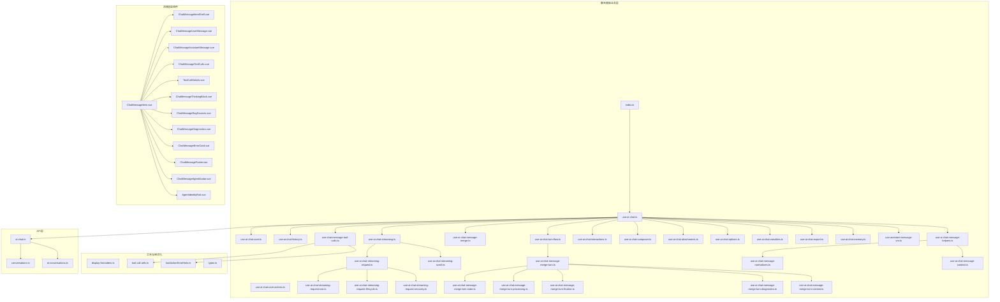
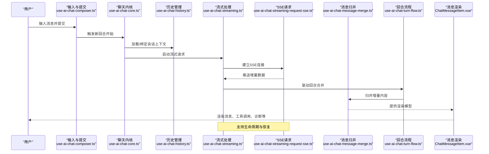
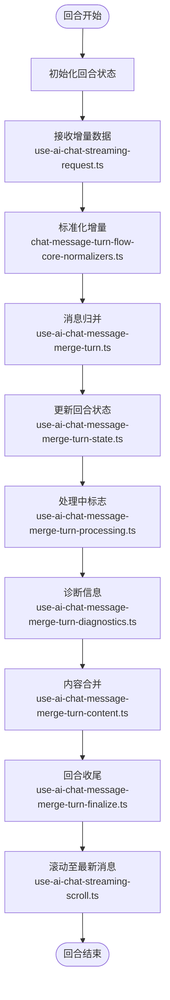
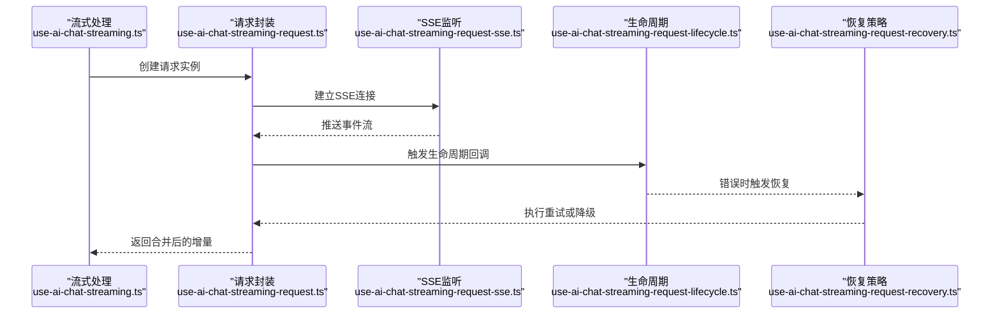
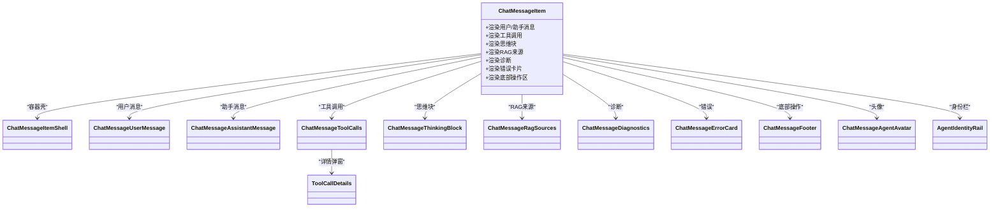
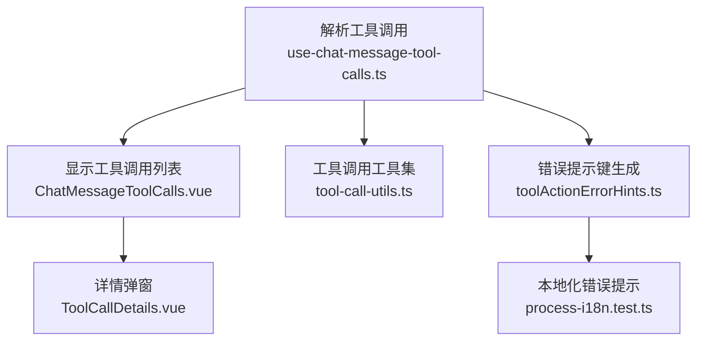
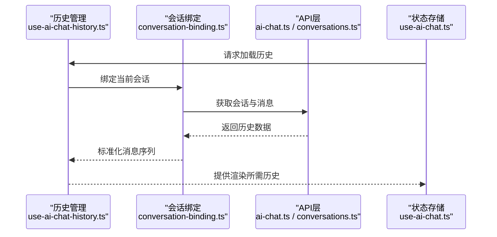
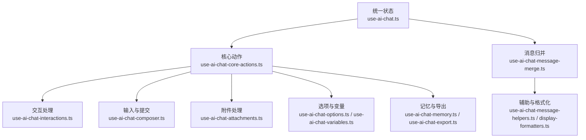
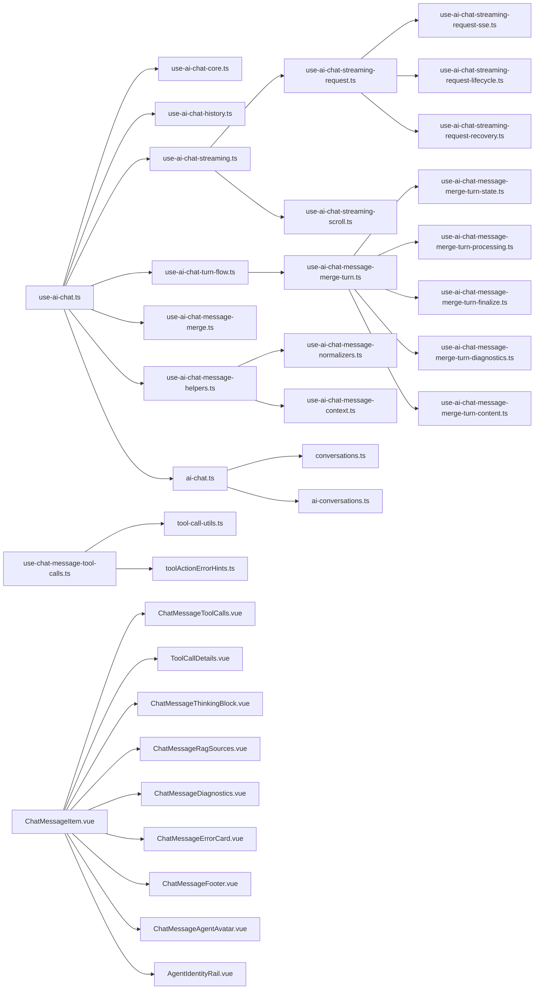

# AI聊天组件

<cite>
**本文引用的文件**
- [index.ts](file://frontend/apps/web-antd/src/components/business/ai-chat-panel/index.ts)
- [use-ai-chat.ts](file://frontend/apps/web-antd/src/components/business/ai-chat-panel/use-ai-chat.ts)
- [use-ai-chat-core.ts](file://frontend/apps/web-antd/src/components/business/ai-chat-panel/use-ai-chat-core.ts)
- [use-ai-chat-core-actions.ts](file://frontend/apps/web-antd/src/components/business/ai-chat-panel/use-ai-chat-core-actions.ts)
- [use-ai-chat-history.ts](file://frontend/apps/web-antd/src/components/business/ai-chat-panel/use-ai-chat-history.ts)
- [use-ai-chat-streaming.ts](file://frontend/apps/web-antd/src/components/business/ai-chat-panel/use-ai-chat-streaming.ts)
- [use-ai-chat-streaming-request.ts](file://frontend/apps/web-antd/src/components/business/ai-chat-panel/use-ai-chat-streaming-request.ts)
- [use-ai-chat-streaming-request-sse.ts](file://frontend/apps/web-antd/src/components/business/ai-chat-panel/use-ai-chat-streaming-request-sse.ts)
- [use-ai-chat-streaming-request-lifecycle.ts](file://frontend/apps/web-antd/src/components/business/ai-chat-panel/use-ai-chat-streaming-request-lifecycle.ts)
- [use-ai-chat-streaming-request-recovery.ts](file://frontend/apps/web-antd/src/components/business/ai-chat-panel/use-ai-chat-streaming-request-recovery.ts)
- [use-ai-chat-streaming-scroll.ts](file://frontend/apps/web-antd/src/components/business/ai-chat-panel/use-ai-chat-streaming-scroll.ts)
- [use-ai-chat-turn-flow.ts](file://frontend/apps/web-antd/src/components/business/ai-chat-panel/use-ai-chat-turn-flow.ts)
- [use-ai-chat-message-merge.ts](file://frontend/apps/web-antd/src/components/business/ai-chat-panel/use-ai-chat-message-merge.ts)
- [use-ai-chat-message-merge-turn.ts](file://frontend/apps/web-antd/src/components/business/ai-chat-panel/use-ai-chat-message-merge-turn.ts)
- [use-ai-chat-message-merge-turn-state.ts](file://frontend/apps/web-antd/src/components/business/ai-chat-panel/use-ai-chat-message-merge-turn-state.ts)
- [use-ai-chat-message-merge-turn-processing.ts](file://frontend/apps/web-antd/src/components/business/ai-chat-panel/use-ai-chat-message-merge-turn-processing.ts)
- [use-ai-chat-message-merge-turn-finalize.ts](file://frontend/apps/web-antd/src/components/business/ai-chat-panel/use-ai-chat-message-merge-turn-finalize.ts)
- [use-ai-chat-message-merge-turn-diagnostics.ts](file://frontend/apps/web-antd/src/components/business/ai-chat-panel/use-ai-chat-message-merge-turn-diagnostics.ts)
- [use-ai-chat-message-merge-turn-content.ts](file://frontend/apps/web-antd/src/components/business/ai-chat-panel/use-ai-chat-message-merge-turn-content.ts)
- [use-ai-chat-message-normalizers.ts](file://frontend/apps/web-antd/src/components/business/ai-chat-panel/use-ai-chat-message-normalizers.ts)
- [use-ai-chat-message-helpers.ts](file://frontend/apps/web-antd/src/components/business/ai-chat-panel/use-ai-chat-message-helpers.ts)
- [use-ai-chat-message-context.ts](file://frontend/apps/web-antd/src/components/business/ai-chat-panel/use-ai-chat-message-context.ts)
- [use-ai-chat-interactions.ts](file://frontend/apps/web-antd/src/components/business/ai-chat-panel/use-ai-chat-interactions.ts)
- [use-ai-chat-composer.ts](file://frontend/apps/web-antd/src/components/business/ai-chat-panel/use-ai-chat-composer.ts)
- [use-ai-chat-attachments.ts](file://frontend/apps/web-antd/src/components/business/ai-chat-panel/use-ai-chat-attachments.ts)
- [use-ai-chat-options.ts](file://frontend/apps/web-antd/src/components/business/ai-chat-panel/use-ai-chat-options.ts)
- [use-ai-chat-variables.ts](file://frontend/apps/web-antd/src/components/business/ai-chat-panel/use-ai-chat-variables.ts)
- [use-ai-chat-export.ts](file://frontend/apps/web-antd/src/components/business/ai-chat-panel/use-ai-chat-export.ts)
- [use-ai-chat-memory.ts](file://frontend/apps/web-antd/src/components/business/ai-chat-panel/use-ai-chat-memory.ts)
- [use-assistant-message-vm.ts](file://frontend/apps/web-antd/src/components/business/ai-chat-panel/use-assistant-message-vm.ts)
- [use-chat-message-tool-calls.ts](file://frontend/apps/web-antd/src/components/business/ai-chat-panel/use-chat-message-tool-calls.ts)
- [chat-message-tool-call-display-helpers.ts](file://frontend/apps/web-antd/src/components/business/ai-chat-panel/chat-message-tool-call-display-helpers.ts)
- [chat-message-tool-call-details-helpers.ts](file://frontend/apps/web-antd/src/components/business/ai-chat-panel/chat-message-tool-call-details-helpers.ts)
- [chat-message-display-preparation.ts](file://frontend/apps/web-antd/src/components/business/ai-chat-panel/chat-message-display-preparation.ts)
- [chat-message-diagnostics-visibility.ts](file://frontend/apps/web-antd/src/components/business/ai-chat-panel/chat-message-diagnostics-visibility.ts)
- [chat-message-turn-flow-core.ts](file://frontend/apps/web-antd/src/components/business/ai-chat-panel/chat-message-turn-flow-core.ts)
- [chat-message-turn-flow-core-normalizers.ts](file://frontend/apps/web-antd/src/components/business/ai-chat-panel/chat-message-turn-flow-core-normalizers.ts)
- [chat-message-turn-flow-ingestion.ts](file://frontend/apps/web-antd/src/components/business/ai-chat-panel/chat-message-turn-flow-ingestion.ts)
- [chat-message-turn-flow-display-helpers.ts](file://frontend/apps/web-antd/src/components/business/ai-chat-panel/chat-message-turn-flow-display-helpers.ts)
- [turn-flow-first-message.ts](file://frontend/apps/web-antd/src/components/business/ai-chat-panel/turn-flow-first-message.ts)
- [conversation-binding.ts](file://frontend/apps/web-antd/src/components/business/ai-chat-panel/conversation-binding.ts)
- [types.ts](file://frontend/apps/web-antd/src/components/business/ai-chat-panel/types.ts)
- [ChatMessageItem.vue](file://frontend/apps/web-antd/src/components/business/ai-chat-panel/ChatMessageItem.vue)
- [ChatMessageItemShell.vue](file://frontend/apps/web-antd/src/components/business/ai-chat-panel/ChatMessageItemShell.vue)
- [ChatMessageUserMessage.vue](file://frontend/apps/web-antd/src/components/business/ai-chat-panel/ChatMessageUserMessage.vue)
- [ChatMessageAssistantMessage.vue](file://frontend/apps/web-antd/src/components/business/ai-chat-panel/ChatMessageAssistantMessage.vue)
- [ChatMessageToolCalls.vue](file://frontend/apps/web-antd/src/components/business/ai-chat-panel/ChatMessageToolCalls.vue)
- [ToolCallDetails.vue](file://frontend/apps/web-antd/src/components/business/ai-chat-panel/ToolCallDetails.vue)
- [ChatMessageThinkingBlock.vue](file://frontend/apps/web-antd/src/components/business/ai-chat-panel/ChatMessageThinkingBlock.vue)
- [ChatMessageRagSources.vue](file://frontend/apps/web-antd/src/components/business/ai-chat-panel/ChatMessageRagSources.vue)
- [ChatMessageDiagnostics.vue](file://frontend/apps/web-antd/src/components/business/ai-chat-panel/ChatMessageDiagnostics.vue)
- [ChatMessageErrorCard.vue](file://frontend/apps/web-antd/src/components/business/ai-chat-panel/ChatMessageErrorCard.vue)
- [ChatMessageFooter.vue](file://frontend/apps/web-antd/src/components/business/ai-chat-panel/ChatMessageFooter.vue)
- [ChatMessageAgentAvatar.vue](file://frontend/apps/web-antd/src/components/business/ai-chat-panel/ChatMessageAgentAvatar.vue)
- [AgentIdentityRail.vue](file://frontend/apps/web-antd/src/components/business/ai-chat-panel/AgentIdentityRail.vue)
- [display-formatters.ts](file://frontend/apps/web-antd/src/components/business/ai-chat-panel/display-formatters.ts)
- [tool-call-utils.ts](file://frontend/apps/web-antd/src/components/business/ai-chat-panel/tool-call-utils.ts)
- [toolActionErrorHints.ts](file://frontend/apps/web-antd/src/components/business/ai-chat-panel/toolActionErrorHints.ts)
- [ai-chat.ts](file://frontend/apps/web-antd/src/api/shared/ai-chat.ts)
- [conversations.ts](file://frontend/apps/web-antd/src/api/tenant/conversations.ts)
- [ai-conversations.ts](file://frontend/apps/web-antd/src/api/admin/ai-conversations.ts)
- [ai-chat.spec.ts](file://frontend/apps/web-antd/__tests__/e2e/ai-chat.spec.ts)
- [ai-chat-shell-cross-surface.spec.ts](file://frontend/apps/web-antd/__tests__/e2e/ai-chat-shell-cross-surface.spec.ts)
- [ai-chat-turn-flow-regression.spec.ts](file://frontend/apps/web-antd/__tests__/e2e/ai-chat-turn-flow-regression.spec.ts)
- [ai-conversation-latest-turn-status.spec.ts](file://frontend/apps/web-antd/__tests__/e2e/ai-conversation-latest-turn-status.spec.ts)
- [ai-chat.test.ts](file://frontend/apps/web-antd/src/api/shared/__tests__/ai-chat.test.ts)
- [ai-chat-fixtures.ts](file://frontend/apps/web-antd/src/components/business/ai-chat-panel/__tests__/fixtures/ai-chat-fixtures.ts)
- [use-ai-chat.test.ts](file://frontend/apps/web-antd/src/components/business/ai-chat-panel/__tests__/use-ai-chat.test.ts)
- [use-ai-chat-core-actions.test.ts](file://frontend/apps/web-antd/src/components/business/ai-chat-panel/__tests__/use-ai-chat-core-actions.test.ts)
- [use-ai-chat-history-cases.ts](file://frontend/apps/web-antd/src/components/business/ai-chat-panel/__tests__/use-ai-chat-history-cases.ts)
- [conversation-binding.test.ts](file://frontend/apps/web-antd/src/components/business/ai-chat-panel/__tests__/conversation-binding.test.ts)
- [chat-input-utils.test.ts](file://frontend/apps/web-antd/src/components/business/ai-chat-panel/__tests__/chat-input-utils.test.ts)
- [chat-message-tool-call-details-helpers.test.ts](file://frontend/apps/web-antd/src/components/business/ai-chat-panel/__tests__/chat-message-tool-call-details-helpers.test.ts)
- [chat-message-turn-flow-core.test.ts](file://frontend/apps/web-antd/src/components/business/ai-chat-panel/__tests__/chat-message-turn-flow-core.test.ts)
- [chat-message-turn-flow-display-helpers.test.ts](file://frontend/apps/web-antd/src/components/business/ai-chat-panel/__tests__/chat-message-turn-flow-display-helpers.test.ts)
- [ChatMessageItem.test.ts](file://frontend/apps/web-antd/src/components/business/ai-chat-panel/__tests__/ChatMessageItem.test.ts)
- [ChatMessageItem.turn-diagnostics.test.ts](file://frontend/apps/web-antd/src/components/business/ai-chat-panel/__tests__/ChatMessageItem.turn-diagnostics.test.ts)
- [ChatMessageToolCalls.state.test.ts](file://frontend/apps/web-antd/src/components/business/ai-chat-panel/__tests__/ChatMessageToolCalls.state.test.ts)
- [ChatMessageDiagnostics.test.ts](file://frontend/apps/web-antd/src/components/business/ai-chat-panel/__tests__/ChatMessageDiagnostics.test.ts)
- [ChatMessageContentBlock.test.ts](file://frontend/apps/web-antd/src/components/business/ai-chat-panel/__tests__/ChatMessageContentBlock.test.ts)
- [ChatMessageAgentAvatar.test.ts](file://frontend/apps/web-antd/src/components/business/ai-chat-panel/__tests__/ChatMessageAgentAvatar.test.ts)
- [getToolActionErrorHintKey.test.ts](file://frontend/apps/web-antd/src/components/business/ai-chat-panel/__tests__/getToolActionErrorHintKey.test.ts)
- [process-i18n.test.ts](file://frontend/apps/web-antd/src/components/business/ai-chat-panel/__tests__/process-i18n.test.ts)
</cite>

## 目录
1. [简介](#简介)
2. [项目结构](#项目结构)
3. [核心组件](#核心组件)
4. [架构总览](#架构总览)
5. [详细组件分析](#详细组件分析)
6. [依赖关系分析](#依赖关系分析)
7. [性能考虑](#性能考虑)
8. [故障排查指南](#故障排查指南)
9. [结论](#结论)
10. [附录](#附录)

## 简介
本技术文档围绕AI聊天组件群组展开，系统性阐述AI聊天面板、聊天内核、滑动面板等核心聊天组件的设计架构与实现细节。重点覆盖以下方面：
- 聊天消息渲染：用户消息、助手消息、工具调用、思维块、RAG来源、诊断信息、错误卡片等多形态消息的渲染与组合。
- 工具调用展示：工具调用解析、详情弹窗、错误提示与回退策略。
- 对话历史管理：会话绑定、历史加载、状态持久化与回放。
- 流式响应处理：请求生命周期、SSE接收、增量合并、滚动与恢复。
- 状态管理与事件处理：统一状态钩子、消息归并、转态机与UI交互。
- 性能优化与内存管理：消息归并策略、滚动优化、资源释放与重试。
- 可定制性、主题适配与国际化：格式化器、显示辅助、工具动作错误提示与本地化。

## 项目结构
AI聊天组件位于前端应用的业务组件目录中，采用“按功能域分层”的组织方式，核心由一组组合式函数（hooks）与多个Vue组件构成，配合API层与测试用例形成完整的聊天体验闭环。

图表来源
- [index.ts](file://frontend/apps/web-antd/src/components/business/ai-chat-panel/index.ts)
- [use-ai-chat.ts](file://frontend/apps/web-antd/src/components/business/ai-chat-panel/use-ai-chat.ts)
- [use-ai-chat-streaming.ts](file://frontend/apps/web-antd/src/components/business/ai-chat-panel/use-ai-chat-streaming.ts)
- [use-ai-chat-turn-flow.ts](file://frontend/apps/web-antd/src/components/business/ai-chat-panel/use-ai-chat-turn-flow.ts)
- [use-ai-chat-message-merge.ts](file://frontend/apps/web-antd/src/components/business/ai-chat-panel/use-ai-chat-message-merge.ts)
- [use-chat-message-tool-calls.ts](file://frontend/apps/web-antd/src/components/business/ai-chat-panel/use-chat-message-tool-calls.ts)
- [ChatMessageItem.vue](file://frontend/apps/web-antd/src/components/business/ai-chat-panel/ChatMessageItem.vue)

章节来源
- [index.ts](file://frontend/apps/web-antd/src/components/business/ai-chat-panel/index.ts)
- [types.ts](file://frontend/apps/web-antd/src/components/business/ai-chat-panel/types.ts)

## 核心组件
本节聚焦AI聊天组件群组的关键模块与其职责边界，帮助读者快速把握整体设计。

- use-ai-chat.ts：聊天主入口，聚合所有子功能钩子，提供统一的状态与动作接口。
- use-ai-chat-core.ts：聊天内核，负责消息流转、状态机与核心业务规则。
- use-ai-chat-history.ts：历史管理，封装会话加载、保存、切换与持久化。
- use-ai-chat-streaming.ts：流式处理总线，协调请求生命周期、SSE、滚动与恢复。
- use-ai-chat-turn-flow.ts：回合（Turn）级流程，驱动消息增量合并与状态推进。
- use-ai-chat-message-merge.ts：消息归并引擎，将增量数据合并为最终渲染模型。
- use-chat-message-tool-calls.ts：工具调用解析与展示，配套工具调用详情与错误提示。
- ChatMessageItem.vue：消息容器，承载多种消息子组件并处理交互与可见性。
- API层：ai-chat.ts、conversations.ts、ai-conversations.ts，提供与后端的通信契约。

章节来源
- [use-ai-chat.ts](file://frontend/apps/web-antd/src/components/business/ai-chat-panel/use-ai-chat.ts)
- [use-ai-chat-core.ts](file://frontend/apps/web-antd/src/components/business/ai-chat-panel/use-ai-chat-core.ts)
- [use-ai-chat-history.ts](file://frontend/apps/web-antd/src/components/business/ai-chat-panel/use-ai-chat-history.ts)
- [use-ai-chat-streaming.ts](file://frontend/apps/web-antd/src/components/business/ai-chat-panel/use-ai-chat-streaming.ts)
- [use-ai-chat-turn-flow.ts](file://frontend/apps/web-antd/src/components/business/ai-chat-panel/use-ai-chat-turn-flow.ts)
- [use-ai-chat-message-merge.ts](file://frontend/apps/web-antd/src/components/business/ai-chat-panel/use-ai-chat-message-merge.ts)
- [use-chat-message-tool-calls.ts](file://frontend/apps/web-antd/src/components/business/ai-chat-panel/use-chat-message-tool-calls.ts)
- [ChatMessageItem.vue](file://frontend/apps/web-antd/src/components/business/ai-chat-panel/ChatMessageItem.vue)
- [ai-chat.ts](file://frontend/apps/web-antd/src/api/shared/ai-chat.ts)
- [conversations.ts](file://frontend/apps/web-antd/src/api/tenant/conversations.ts)
- [ai-conversations.ts](file://frontend/apps/web-antd/src/api/admin/ai-conversations.ts)

## 架构总览
下图展示了从用户输入到消息渲染与流式响应的完整链路，以及各模块间的协作关系。

图表来源
- [use-ai-chat-composer.ts](file://frontend/apps/web-antd/src/components/business/ai-chat-panel/use-ai-chat-composer.ts)
- [use-ai-chat-core.ts](file://frontend/apps/web-antd/src/components/business/ai-chat-panel/use-ai-chat-core.ts)
- [use-ai-chat-history.ts](file://frontend/apps/web-antd/src/components/business/ai-chat-panel/use-ai-chat-history.ts)
- [use-ai-chat-streaming.ts](file://frontend/apps/web-antd/src/components/business/ai-chat-panel/use-ai-chat-streaming.ts)
- [use-ai-chat-streaming-request-sse.ts](file://frontend/apps/web-antd/src/components/business/ai-chat-panel/use-ai-chat-streaming-request-sse.ts)
- [use-ai-chat-turn-flow.ts](file://frontend/apps/web-antd/src/components/business/ai-chat-panel/use-ai-chat-turn-flow.ts)
- [use-ai-chat-message-merge.ts](file://frontend/apps/web-antd/src/components/business/ai-chat-panel/use-ai-chat-message-merge.ts)
- [ChatMessageItem.vue](file://frontend/apps/web-antd/src/components/business/ai-chat-panel/ChatMessageItem.vue)

## 详细组件分析

### 聊天内核与回合流程
聊天内核负责回合的启动、推进与终止，结合回合流程与消息归并，确保消息以最小粒度增量渲染。

图表来源
- [use-ai-chat-turn-flow.ts](file://frontend/apps/web-antd/src/components/business/ai-chat-panel/use-ai-chat-turn-flow.ts)
- [chat-message-turn-flow-core-normalizers.ts](file://frontend/apps/web-antd/src/components/business/ai-chat-panel/chat-message-turn-flow-core-normalizers.ts)
- [use-ai-chat-message-merge-turn.ts](file://frontend/apps/web-antd/src/components/business/ai-chat-panel/use-ai-chat-message-merge-turn.ts)
- [use-ai-chat-message-merge-turn-state.ts](file://frontend/apps/web-antd/src/components/business/ai-chat-panel/use-ai-chat-message-merge-turn-state.ts)
- [use-ai-chat-message-merge-turn-processing.ts](file://frontend/apps/web-antd/src/components/business/ai-chat-panel/use-ai-chat-message-merge-turn-processing.ts)
- [use-ai-chat-message-merge-turn-diagnostics.ts](file://frontend/apps/web-antd/src/components/business/ai-chat-panel/use-ai-chat-message-merge-turn-diagnostics.ts)
- [use-ai-chat-message-merge-turn-content.ts](file://frontend/apps/web-antd/src/components/business/ai-chat-panel/use-ai-chat-message-merge-turn-content.ts)
- [use-ai-chat-message-merge-turn-finalize.ts](file://frontend/apps/web-antd/src/components/business/ai-chat-panel/use-ai-chat-message-merge-turn-finalize.ts)
- [use-ai-chat-streaming-scroll.ts](file://frontend/apps/web-antd/src/components/business/ai-chat-panel/use-ai-chat-streaming-scroll.ts)

章节来源
- [use-ai-chat-core.ts](file://frontend/apps/web-antd/src/components/business/ai-chat-panel/use-ai-chat-core.ts)
- [use-ai-chat-turn-flow.ts](file://frontend/apps/web-antd/src/components/business/ai-chat-panel/use-ai-chat-turn-flow.ts)
- [use-ai-chat-message-merge-turn.ts](file://frontend/apps/web-antd/src/components/business/ai-chat-panel/use-ai-chat-message-merge-turn.ts)
- [use-ai-chat-message-merge-turn-state.ts](file://frontend/apps/web-antd/src/components/business/ai-chat-panel/use-ai-chat-message-merge-turn-state.ts)
- [use-ai-chat-message-merge-turn-processing.ts](file://frontend/apps/web-antd/src/components/business/ai-chat-panel/use-ai-chat-message-merge-turn-processing.ts)
- [use-ai-chat-message-merge-turn-diagnostics.ts](file://frontend/apps/web-antd/src/components/business/ai-chat-panel/use-ai-chat-message-merge-turn-diagnostics.ts)
- [use-ai-chat-message-merge-turn-content.ts](file://frontend/apps/web-antd/src/components/business/ai-chat-panel/use-ai-chat-message-merge-turn-content.ts)
- [use-ai-chat-message-merge-turn-finalize.ts](file://frontend/apps/web-antd/src/components/business/ai-chat-panel/use-ai-chat-message-merge-turn-finalize.ts)
- [use-ai-chat-streaming-scroll.ts](file://frontend/apps/web-antd/src/components/business/ai-chat-panel/use-ai-chat-streaming-scroll.ts)

### 流式请求生命周期与恢复
流式请求通过SSE接收增量数据，并在生命周期内进行错误恢复与重试控制。

图表来源
- [use-ai-chat-streaming.ts](file://frontend/apps/web-antd/src/components/business/ai-chat-panel/use-ai-chat-streaming.ts)
- [use-ai-chat-streaming-request.ts](file://frontend/apps/web-antd/src/components/business/ai-chat-panel/use-ai-chat-streaming-request.ts)
- [use-ai-chat-streaming-request-sse.ts](file://frontend/apps/web-antd/src/components/business/ai-chat-panel/use-ai-chat-streaming-request-sse.ts)
- [use-ai-chat-streaming-request-lifecycle.ts](file://frontend/apps/web-antd/src/components/business/ai-chat-panel/use-ai-chat-streaming-request-lifecycle.ts)
- [use-ai-chat-streaming-request-recovery.ts](file://frontend/apps/web-antd/src/components/business/ai-chat-panel/use-ai-chat-streaming-request-recovery.ts)

章节来源
- [use-ai-chat-streaming.ts](file://frontend/apps/web-antd/src/components/business/ai-chat-panel/use-ai-chat-streaming.ts)
- [use-ai-chat-streaming-request.ts](file://frontend/apps/web-antd/src/components/business/ai-chat-panel/use-ai-chat-streaming-request.ts)
- [use-ai-chat-streaming-request-sse.ts](file://frontend/apps/web-antd/src/components/business/ai-chat-panel/use-ai-chat-streaming-request-sse.ts)
- [use-ai-chat-streaming-request-lifecycle.ts](file://frontend/apps/web-antd/src/components/business/ai-chat-panel/use-ai-chat-streaming-request-lifecycle.ts)
- [use-ai-chat-streaming-request-recovery.ts](file://frontend/apps/web-antd/src/components/business/ai-chat-panel/use-ai-chat-streaming-request-recovery.ts)

### 消息渲染与工具调用展示
消息渲染组件负责将不同类型的聊天内容（文本、工具调用、思维块、RAG来源、诊断、错误）以一致的容器呈现，并支持交互与详情查看。

图表来源
- [ChatMessageItem.vue](file://frontend/apps/web-antd/src/components/business/ai-chat-panel/ChatMessageItem.vue)
- [ChatMessageItemShell.vue](file://frontend/apps/web-antd/src/components/business/ai-chat-panel/ChatMessageItemShell.vue)
- [ChatMessageUserMessage.vue](file://frontend/apps/web-antd/src/components/business/ai-chat-panel/ChatMessageUserMessage.vue)
- [ChatMessageAssistantMessage.vue](file://frontend/apps/web-antd/src/components/business/ai-chat-panel/ChatMessageAssistantMessage.vue)
- [ChatMessageToolCalls.vue](file://frontend/apps/web-antd/src/components/business/ai-chat-panel/ChatMessageToolCalls.vue)
- [ToolCallDetails.vue](file://frontend/apps/web-antd/src/components/business/ai-chat-panel/ToolCallDetails.vue)
- [ChatMessageThinkingBlock.vue](file://frontend/apps/web-antd/src/components/business/ai-chat-panel/ChatMessageThinkingBlock.vue)
- [ChatMessageRagSources.vue](file://frontend/apps/web-antd/src/components/business/ai-chat-panel/ChatMessageRagSources.vue)
- [ChatMessageDiagnostics.vue](file://frontend/apps/web-antd/src/components/business/ai-chat-panel/ChatMessageDiagnostics.vue)
- [ChatMessageErrorCard.vue](file://frontend/apps/web-antd/src/components/business/ai-chat-panel/ChatMessageErrorCard.vue)
- [ChatMessageFooter.vue](file://frontend/apps/web-antd/src/components/business/ai-chat-panel/ChatMessageFooter.vue)
- [ChatMessageAgentAvatar.vue](file://frontend/apps/web-antd/src/components/business/ai-chat-panel/ChatMessageAgentAvatar.vue)
- [AgentIdentityRail.vue](file://frontend/apps/web-antd/src/components/business/ai-chat-panel/AgentIdentityRail.vue)

章节来源
- [ChatMessageItem.vue](file://frontend/apps/web-antd/src/components/business/ai-chat-panel/ChatMessageItem.vue)
- [ChatMessageToolCalls.vue](file://frontend/apps/web-antd/src/components/business/ai-chat-panel/ChatMessageToolCalls.vue)
- [ToolCallDetails.vue](file://frontend/apps/web-antd/src/components/business/ai-chat-panel/ToolCallDetails.vue)

### 工具调用解析与展示
工具调用解析模块负责将后端返回的工具调用结构转换为可读的UI，并提供错误提示与回退策略。

图表来源
- [use-chat-message-tool-calls.ts](file://frontend/apps/web-antd/src/components/business/ai-chat-panel/use-chat-message-tool-calls.ts)
- [ChatMessageToolCalls.vue](file://frontend/apps/web-antd/src/components/business/ai-chat-panel/ChatMessageToolCalls.vue)
- [ToolCallDetails.vue](file://frontend/apps/web-antd/src/components/business/ai-chat-panel/ToolCallDetails.vue)
- [tool-call-utils.ts](file://frontend/apps/web-antd/src/components/business/ai-chat-panel/tool-call-utils.ts)
- [toolActionErrorHints.ts](file://frontend/apps/web-antd/src/components/business/ai-chat-panel/toolActionErrorHints.ts)
- [process-i18n.test.ts](file://frontend/apps/web-antd/src/components/business/ai-chat-panel/__tests__/process-i18n.test.ts)

章节来源
- [use-chat-message-tool-calls.ts](file://frontend/apps/web-antd/src/components/business/ai-chat-panel/use-chat-message-tool-calls.ts)
- [tool-call-utils.ts](file://frontend/apps/web-antd/src/components/business/ai-chat-panel/tool-call-utils.ts)
- [toolActionErrorHints.ts](file://frontend/apps/web-antd/src/components/business/ai-chat-panel/toolActionErrorHints.ts)

### 对话历史管理与会话绑定
会话绑定与历史管理负责维护当前对话上下文，支持加载、保存、切换与持久化。

图表来源
- [use-ai-chat-history.ts](file://frontend/apps/web-antd/src/components/business/ai-chat-panel/use-ai-chat-history.ts)
- [conversation-binding.ts](file://frontend/apps/web-antd/src/components/business/ai-chat-panel/conversation-binding.ts)
- [ai-chat.ts](file://frontend/apps/web-antd/src/api/shared/ai-chat.ts)
- [conversations.ts](file://frontend/apps/web-antd/src/api/tenant/conversations.ts)

章节来源
- [use-ai-chat-history.ts](file://frontend/apps/web-antd/src/components/business/ai-chat-panel/use-ai-chat-history.ts)
- [conversation-binding.ts](file://frontend/apps/web-antd/src/components/business/ai-chat-panel/conversation-binding.ts)

### 状态管理与事件处理
统一的状态钩子与消息归并确保UI与业务逻辑解耦，事件处理集中在交互钩子中。

图表来源
- [use-ai-chat.ts](file://frontend/apps/web-antd/src/components/business/ai-chat-panel/use-ai-chat.ts)
- [use-ai-chat-core-actions.ts](file://frontend/apps/web-antd/src/components/business/ai-chat-panel/use-ai-chat-core-actions.ts)
- [use-ai-chat-interactions.ts](file://frontend/apps/web-antd/src/components/business/ai-chat-panel/use-ai-chat-interactions.ts)
- [use-ai-chat-composer.ts](file://frontend/apps/web-antd/src/components/business/ai-chat-panel/use-ai-chat-composer.ts)
- [use-ai-chat-attachments.ts](file://frontend/apps/web-antd/src/components/business/ai-chat-panel/use-ai-chat-attachments.ts)
- [use-ai-chat-options.ts](file://frontend/apps/web-antd/src/components/business/ai-chat-panel/use-ai-chat-options.ts)
- [use-ai-chat-variables.ts](file://frontend/apps/web-antd/src/components/business/ai-chat-panel/use-ai-chat-variables.ts)
- [use-ai-chat-memory.ts](file://frontend/apps/web-antd/src/components/business/ai-chat-panel/use-ai-chat-memory.ts)
- [use-ai-chat-export.ts](file://frontend/apps/web-antd/src/components/business/ai-chat-panel/use-ai-chat-export.ts)
- [use-ai-chat-message-merge.ts](file://frontend/apps/web-antd/src/components/business/ai-chat-panel/use-ai-chat-message-merge.ts)
- [use-ai-chat-message-helpers.ts](file://frontend/apps/web-antd/src/components/business/ai-chat-panel/use-ai-chat-message-helpers.ts)
- [display-formatters.ts](file://frontend/apps/web-antd/src/components/business/ai-chat-panel/display-formatters.ts)

章节来源
- [use-ai-chat.ts](file://frontend/apps/web-antd/src/components/business/ai-chat-panel/use-ai-chat.ts)
- [use-ai-chat-core-actions.ts](file://frontend/apps/web-antd/src/components/business/ai-chat-panel/use-ai-chat-core-actions.ts)
- [use-ai-chat-interactions.ts](file://frontend/apps/web-antd/src/components/business/ai-chat-panel/use-ai-chat-interactions.ts)
- [use-ai-chat-composer.ts](file://frontend/apps/web-antd/src/components/business/ai-chat-panel/use-ai-chat-composer.ts)
- [use-ai-chat-attachments.ts](file://frontend/apps/web-antd/src/components/business/ai-chat-panel/use-ai-chat-attachments.ts)
- [use-ai-chat-options.ts](file://frontend/apps/web-antd/src/components/business/ai-chat-panel/use-ai-chat-options.ts)
- [use-ai-chat-variables.ts](file://frontend/apps/web-antd/src/components/business/ai-chat-panel/use-ai-chat-variables.ts)
- [use-ai-chat-memory.ts](file://frontend/apps/web-antd/src/components/business/ai-chat-panel/use-ai-chat-memory.ts)
- [use-ai-chat-export.ts](file://frontend/apps/web-antd/src/components/business/ai-chat-panel/use-ai-chat-export.ts)
- [use-ai-chat-message-merge.ts](file://frontend/apps/web-antd/src/components/business/ai-chat-panel/use-ai-chat-message-merge.ts)
- [use-ai-chat-message-helpers.ts](file://frontend/apps/web-antd/src/components/business/ai-chat-panel/use-ai-chat-message-helpers.ts)
- [display-formatters.ts](file://frontend/apps/web-antd/src/components/business/ai-chat-panel/display-formatters.ts)

## 依赖关系分析
组件间依赖清晰，遵循“高层聚合、低层拆分”的原则。核心依赖关系如下：

图表来源
- [use-ai-chat.ts](file://frontend/apps/web-antd/src/components/business/ai-chat-panel/use-ai-chat.ts)
- [use-ai-chat-streaming.ts](file://frontend/apps/web-antd/src/components/business/ai-chat-panel/use-ai-chat-streaming.ts)
- [use-ai-chat-turn-flow.ts](file://frontend/apps/web-antd/src/components/business/ai-chat-panel/use-ai-chat-turn-flow.ts)
- [use-ai-chat-message-merge.ts](file://frontend/apps/web-antd/src/components/business/ai-chat-panel/use-ai-chat-message-merge.ts)
- [use-chat-message-tool-calls.ts](file://frontend/apps/web-antd/src/components/business/ai-chat-panel/use-chat-message-tool-calls.ts)
- [ChatMessageItem.vue](file://frontend/apps/web-antd/src/components/business/ai-chat-panel/ChatMessageItem.vue)
- [ai-chat.ts](file://frontend/apps/web-antd/src/api/shared/ai-chat.ts)

章节来源
- [use-ai-chat.ts](file://frontend/apps/web-antd/src/components/business/ai-chat-panel/use-ai-chat.ts)
- [use-ai-chat-streaming.ts](file://frontend/apps/web-antd/src/components/business/ai-chat-panel/use-ai-chat-streaming.ts)
- [use-ai-chat-turn-flow.ts](file://frontend/apps/web-antd/src/components/business/ai-chat-panel/use-ai-chat-turn-flow.ts)
- [use-ai-chat-message-merge.ts](file://frontend/apps/web-antd/src/components/business/ai-chat-panel/use-ai-chat-message-merge.ts)
- [use-chat-message-tool-calls.ts](file://frontend/apps/web-antd/src/components/business/ai-chat-panel/use-chat-message-tool-calls.ts)
- [ChatMessageItem.vue](file://frontend/apps/web-antd/src/components/business/ai-chat-panel/ChatMessageItem.vue)
- [ai-chat.ts](file://frontend/apps/web-antd/src/api/shared/ai-chat.ts)

## 性能考虑
- 消息归并策略：通过回合级增量合并减少重渲染范围，提升大消息场景下的渲染效率。
- 滚动优化：仅在新增消息时触发滚动，避免频繁DOM操作；对长对话采用虚拟滚动或分页加载策略。
- 资源释放：SSE连接在回合结束或错误恢复时及时关闭，防止内存泄漏。
- 重试与退避：请求恢复模块采用指数退避与最大重试次数限制，降低抖动影响。
- 本地化与格式化：统一的格式化器与本地化工具减少重复计算，提高渲染一致性。
- 附件与多媒体：对图片、视频等资源采用懒加载与缓存策略，降低首屏压力。

## 故障排查指南
- 流式响应异常
  - 现象：消息不更新或卡顿
  - 排查：检查SSE连接状态与生命周期回调；确认恢复策略是否生效
  - 参考路径：[use-ai-chat-streaming-request-sse.ts](file://frontend/apps/web-antd/src/components/business/ai-chat-panel/use-ai-chat-streaming-request-sse.ts)，[use-ai-chat-streaming-request-lifecycle.ts](file://frontend/apps/web-antd/src/components/business/ai-chat-panel/use-ai-chat-streaming-request-lifecycle.ts)，[use-ai-chat-streaming-request-recovery.ts](file://frontend/apps/web-antd/src/components/business/ai-chat-panel/use-ai-chat-streaming-request-recovery.ts)
- 工具调用错误
  - 现象：工具调用显示错误或无法查看详情
  - 排查：检查工具调用解析与错误提示键生成；确认本地化资源是否正确加载
  - 参考路径：[use-chat-message-tool-calls.ts](file://frontend/apps/web-antd/src/components/business/ai-chat-panel/use-chat-message-tool-calls.ts)，[toolActionErrorHints.ts](file://frontend/apps/web-antd/src/components/business/ai-chat-panel/toolActionErrorHints.ts)，[process-i18n.test.ts](file://frontend/apps/web-antd/src/components/business/ai-chat-panel/__tests__/process-i18n.test.ts)
- 历史加载失败
  - 现象：会话历史为空或加载超时
  - 排查：检查会话绑定与API层调用；确认权限与租户上下文
  - 参考路径：[use-ai-chat-history.ts](file://frontend/apps/web-antd/src/components/business/ai-chat-panel/use-ai-chat-history.ts)，[conversation-binding.ts](file://frontend/apps/web-antd/src/components/business/ai-chat-panel/conversation-binding.ts)，[conversations.ts](file://frontend/apps/web-antd/src/api/tenant/conversations.ts)
- 消息渲染错位
  - 现象：消息顺序错乱或重复
  - 排查：检查回合合并与状态机推进逻辑；确认消息去重与排序策略
  - 参考路径：[use-ai-chat-turn-flow.ts](file://frontend/apps/web-antd/src/components/business/ai-chat-panel/use-ai-chat-turn-flow.ts)，[use-ai-chat-message-merge-turn.ts](file://frontend/apps/web-antd/src/components/business/ai-chat-panel/use-ai-chat-message-merge-turn.ts)

章节来源
- [use-ai-chat-streaming-request-sse.ts](file://frontend/apps/web-antd/src/components/business/ai-chat-panel/use-ai-chat-streaming-request-sse.ts)
- [use-ai-chat-streaming-request-lifecycle.ts](file://frontend/apps/web-antd/src/components/business/ai-chat-panel/use-ai-chat-streaming-request-lifecycle.ts)
- [use-ai-chat-streaming-request-recovery.ts](file://frontend/apps/web-antd/src/components/business/ai-chat-panel/use-ai-chat-streaming-request-recovery.ts)
- [use-chat-message-tool-calls.ts](file://frontend/apps/web-antd/src/components/business/ai-chat-panel/use-chat-message-tool-calls.ts)
- [toolActionErrorHints.ts](file://frontend/apps/web-antd/src/components/business/ai-chat-panel/toolActionErrorHints.ts)
- [process-i18n.test.ts](file://frontend/apps/web-antd/src/components/business/ai-chat-panel/__tests__/process-i18n.test.ts)
- [use-ai-chat-history.ts](file://frontend/apps/web-antd/src/components/business/ai-chat-panel/use-ai-chat-history.ts)
- [conversation-binding.ts](file://frontend/apps/web-antd/src/components/business/ai-chat-panel/conversation-binding.ts)
- [conversations.ts](file://frontend/apps/web-antd/src/api/tenant/conversations.ts)
- [use-ai-chat-turn-flow.ts](file://frontend/apps/web-antd/src/components/business/ai-chat-panel/use-ai-chat-turn-flow.ts)
- [use-ai-chat-message-merge-turn.ts](file://frontend/apps/web-antd/src/components/business/ai-chat-panel/use-ai-chat-message-merge-turn.ts)

## 结论
AI聊天组件群组通过“状态聚合 + 回合流程 + 消息归并 + 渲染解耦”的架构设计，实现了高扩展性与高性能的聊天体验。流式响应、工具调用展示、历史管理与错误恢复机制共同构成了稳定可靠的聊天内核。建议在实际集成中关注消息归并策略、滚动优化与资源释放，以获得最佳性能与用户体验。

## 附录
- 测试用例与回归验证
  - E2E测试：覆盖跨界面交互、回合流程与最新轮次状态
  - 单元测试：覆盖输入工具、消息回合流程、工具调用详情与诊断显示
  - 参考路径：[ai-chat.spec.ts](file://frontend/apps/web-antd/__tests__/e2e/ai-chat.spec.ts)，[ai-chat-shell-cross-surface.spec.ts](file://frontend/apps/web-antd/__tests__/e2e/ai-chat-shell-cross-surface.spec.ts)，[ai-chat-turn-flow-regression.spec.ts](file://frontend/apps/web-antd/__tests__/e2e/ai-chat-turn-flow-regression.spec.ts)，[ai-conversation-latest-turn-status.spec.ts](file://frontend/apps/web-antd/__tests__/e2e/ai-conversation-latest-turn-status.spec.ts)，[use-ai-chat.test.ts](file://frontend/apps/web-antd/src/components/business/ai-chat-panel/__tests__/use-ai-chat.test.ts)，[use-ai-chat-core-actions.test.ts](file://frontend/apps/web-antd/src/components/business/ai-chat-panel/__tests__/use-ai-chat-core-actions.test.ts)，[use-ai-chat-history-cases.ts](file://frontend/apps/web-antd/src/components/business/ai-chat-panel/__tests__/use-ai-chat-history-cases.ts)，[conversation-binding.test.ts](file://frontend/apps/web-antd/src/components/business/ai-chat-panel/__tests__/conversation-binding.test.ts)，[chat-input-utils.test.ts](file://frontend/apps/web-antd/src/components/business/ai-chat-panel/__tests__/chat-input-utils.test.ts)，[chat-message-tool-call-details-helpers.test.ts](file://frontend/apps/web-antd/src/components/business/ai-chat-panel/__tests__/chat-message-tool-call-details-helpers.test.ts)，[chat-message-turn-flow-core.test.ts](file://frontend/apps/web-antd/src/components/business/ai-chat-panel/__tests__/chat-message-turn-flow-core.test.ts)，[chat-message-turn-flow-display-helpers.test.ts](file://frontend/apps/web-antd/src/components/business/ai-chat-panel/__tests__/chat-message-turn-flow-display-helpers.test.ts)，[ChatMessageItem.test.ts](file://frontend/apps/web-antd/src/components/business/ai-chat-panel/__tests__/ChatMessageItem.test.ts)，[ChatMessageItem.turn-diagnostics.test.ts](file://frontend/apps/web-antd/src/components/business/ai-chat-panel/__tests__/ChatMessageItem.turn-diagnostics.test.ts)，[ChatMessageToolCalls.state.test.ts](file://frontend/apps/web-antd/src/components/business/ai-chat-panel/__tests__/ChatMessageToolCalls.state.test.ts)，[ChatMessageDiagnostics.test.ts](file://frontend/apps/web-antd/src/components/business/ai-chat-panel/__tests__/ChatMessageDiagnostics.test.ts)，[ChatMessageContentBlock.test.ts](file://frontend/apps/web-antd/src/components/business/ai-chat-panel/__tests__/ChatMessageContentBlock.test.ts)，[ChatMessageAgentAvatar.test.ts](file://frontend/apps/web-antd/src/components/business/ai-chat-panel/__tests__/ChatMessageAgentAvatar.test.ts)，[getToolActionErrorHintKey.test.ts](file://frontend/apps/web-antd/src/components/business/ai-chat-panel/__tests__/getToolActionErrorHintKey.test.ts)，[process-i18n.test.ts](file://frontend/apps/web-antd/src/components/business/ai-chat-panel/__tests__/process-i18n.test.ts)

章节来源
- [ai-chat.spec.ts](file://frontend/apps/web-antd/__tests__/e2e/ai-chat.spec.ts)
- [ai-chat-shell-cross-surface.spec.ts](file://frontend/apps/web-antd/__tests__/e2e/ai-chat-shell-cross-surface.spec.ts)
- [ai-chat-turn-flow-regression.spec.ts](file://frontend/apps/web-antd/__tests__/e2e/ai-chat-turn-flow-regression.spec.ts)
- [ai-conversation-latest-turn-status.spec.ts](file://frontend/apps/web-antd/__tests__/e2e/ai-conversation-latest-turn-status.spec.ts)
- [use-ai-chat.test.ts](file://frontend/apps/web-antd/src/components/business/ai-chat-panel/__tests__/use-ai-chat.test.ts)
- [use-ai-chat-core-actions.test.ts](file://frontend/apps/web-antd/src/components/business/ai-chat-panel/__tests__/use-ai-chat-core-actions.test.ts)
- [use-ai-chat-history-cases.ts](file://frontend/apps/web-antd/src/components/business/ai-chat-panel/__tests__/use-ai-chat-history-cases.ts)
- [conversation-binding.test.ts](file://frontend/apps/web-antd/src/components/business/ai-chat-panel/__tests__/conversation-binding.test.ts)
- [chat-input-utils.test.ts](file://frontend/apps/web-antd/src/components/business/ai-chat-panel/__tests__/chat-input-utils.test.ts)
- [chat-message-tool-call-details-helpers.test.ts](file://frontend/apps/web-antd/src/components/business/ai-chat-panel/__tests__/chat-message-tool-call-details-helpers.test.ts)
- [chat-message-turn-flow-core.test.ts](file://frontend/apps/web-antd/src/components/business/ai-chat-panel/__tests__/chat-message-turn-flow-core.test.ts)
- [chat-message-turn-flow-display-helpers.test.ts](file://frontend/apps/web-antd/src/components/business/ai-chat-panel/__tests__/chat-message-turn-flow-display-helpers.test.ts)
- [ChatMessageItem.test.ts](file://frontend/apps/web-antd/src/components/business/ai-chat-panel/__tests__/ChatMessageItem.test.ts)
- [ChatMessageItem.turn-diagnostics.test.ts](file://frontend/apps/web-antd/src/components/business/ai-chat-panel/__tests__/ChatMessageItem.turn-diagnostics.test.ts)
- [ChatMessageToolCalls.state.test.ts](file://frontend/apps/web-antd/src/components/business/ai-chat-panel/__tests__/ChatMessageToolCalls.state.test.ts)
- [ChatMessageDiagnostics.test.ts](file://frontend/apps/web-antd/src/components/business/ai-chat-panel/__tests__/ChatMessageDiagnostics.test.ts)
- [ChatMessageContentBlock.test.ts](file://frontend/apps/web-antd/src/components/business/ai-chat-panel/__tests__/ChatMessageContentBlock.test.ts)
- [ChatMessageAgentAvatar.test.ts](file://frontend/apps/web-antd/src/components/business/ai-chat-panel/__tests__/ChatMessageAgentAvatar.test.ts)
- [getToolActionErrorHintKey.test.ts](file://frontend/apps/web-antd/src/components/business/ai-chat-panel/__tests__/getToolActionErrorHintKey.test.ts)
- [process-i18n.test.ts](file://frontend/apps/web-antd/src/components/business/ai-chat-panel/__tests__/process-i18n.test.ts)