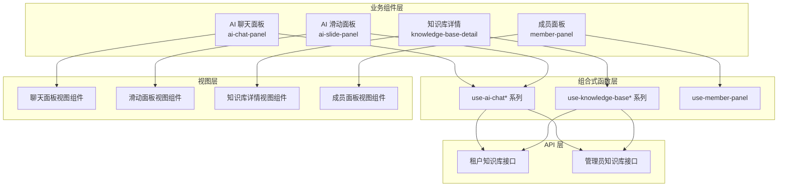
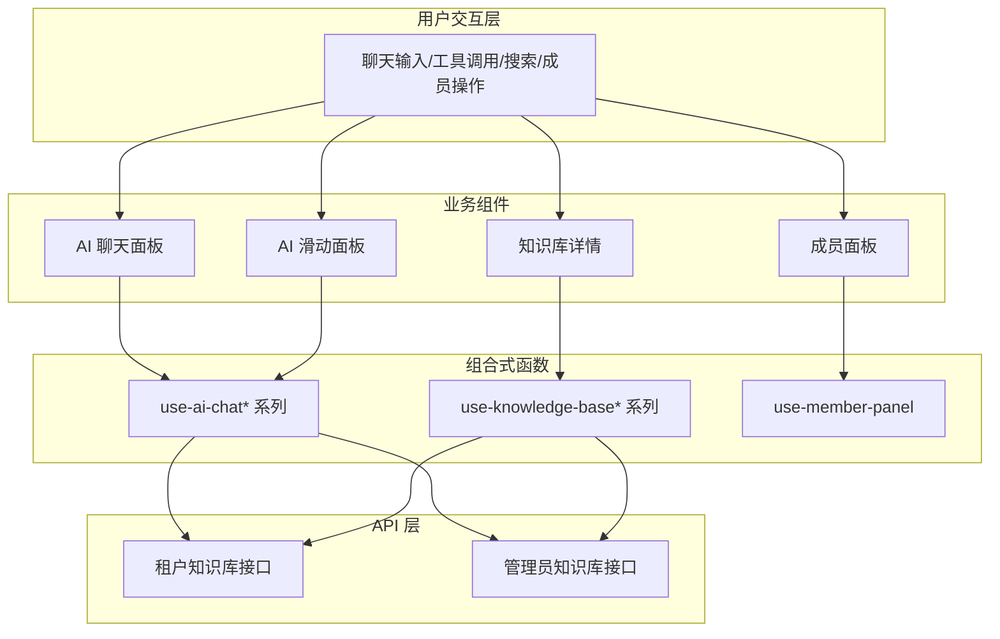
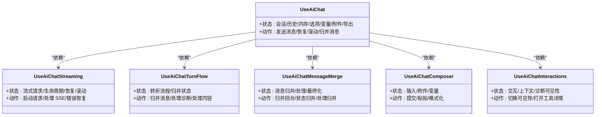
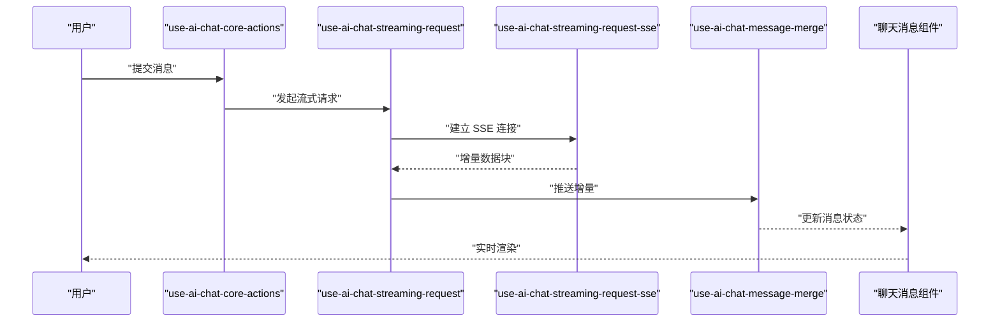
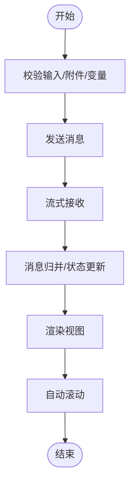
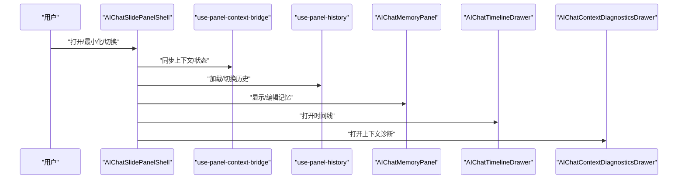
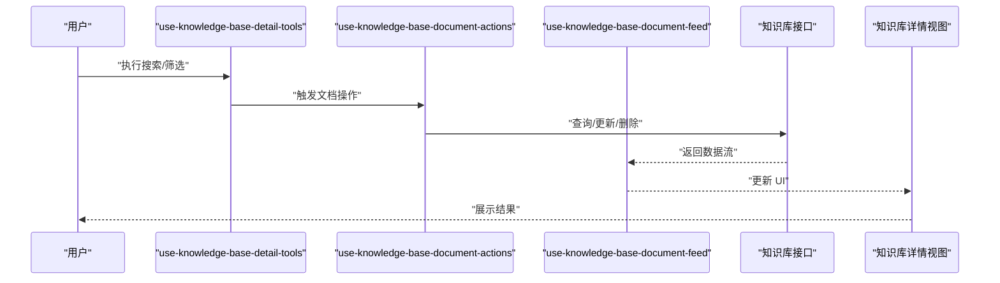
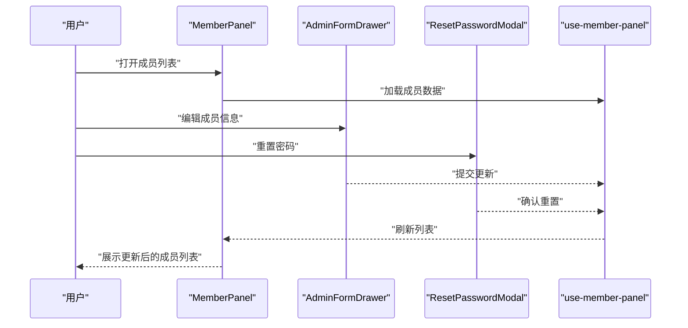
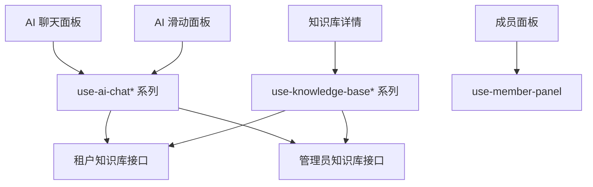

# 业务组件

<cite>
**本文引用的文件**
- [frontend/apps/web-antd/src/components/business/ai-chat-panel/index.ts](file://frontend/apps/web-antd/src/components/business/ai-chat-panel/index.ts)
- [frontend/apps/web-antd/src/components/business/ai-chat-panel/types.ts](file://frontend/apps/web-antd/src/components/business/ai-chat-panel/types.ts)
- [frontend/apps/web-antd/src/components/business/ai-chat-panel/use-ai-chat.ts](file://frontend/apps/web-antd/src/components/business/ai-chat-panel/use-ai-chat.ts)
- [frontend/apps/web-antd/src/components/business/ai-chat-panel/use-ai-chat-core.ts](file://frontend/apps/web-antd/src/components/business/ai-chat-panel/use-ai-chat-core.ts)
- [frontend/apps/web-antd/src/components/business/ai-chat-panel/use-ai-chat-streaming.ts](file://frontend/apps/web-antd/src/components/business/ai-chat-panel/use-ai-chat-streaming.ts)
- [frontend/apps/web-antd/src/components/business/ai-chat-panel/use-ai-chat-streaming-request.ts](file://frontend/apps/web-antd/src/components/business/ai-chat-panel/use-ai-chat-streaming-request.ts)
- [frontend/apps/web-antd/src/components/business/ai-chat-panel/use-ai-chat-streaming-request-sse.ts](file://frontend/apps/web-antd/src/components/business/ai-chat-panel/use-ai-chat-streaming-request-sse.ts)
- [frontend/apps/web-antd/src/components/business/ai-chat-panel/use-ai-chat-streaming-request-lifecycle.ts](file://frontend/apps/web-antd/src/components/business/ai-chat-panel/use-ai-chat-streaming-request-lifecycle.ts)
- [frontend/apps/web-antd/src/components/business/ai-chat-panel/use-ai-chat-streaming-request-recovery.ts](file://frontend/apps/web-antd/src/components/business/ai-chat-panel/use-ai-chat-streaming-request-recovery.ts)
- [frontend/apps/web-antd/src/components/business/ai-chat-panel/use-ai-chat-turn-flow.ts](file://frontend/apps/web-antd/src/components/business/ai-chat-panel/use-ai-chat-turn-flow.ts)
- [frontend/apps/web-antd/src/components/business/ai-chat-panel/use-ai-chat-message-merge.ts](file://frontend/apps/web-antd/src/components/business/ai-chat-panel/use-ai-chat-message-merge.ts)
- [frontend/apps/web-antd/src/components/business/ai-chat-panel/use-ai-chat-message-merge-turn.ts](file://frontend/apps/web-antd/src/components/business/ai-chat-panel/use-ai-chat-message-merge-turn.ts)
- [frontend/apps/web-antd/src/components/business/ai-chat-panel/use-ai-chat-message-merge-turn-state.ts](file://frontend/apps/web-antd/src/components/business/ai-chat-panel/use-ai-chat-message-merge-turn-state.ts)
- [frontend/apps/web-antd/src/components/business/ai-chat-panel/use-ai-chat-message-merge-turn-processing.ts](file://frontend/apps/web-antd/src/components/business/ai-chat-panel/use-ai-chat-message-merge-turn-processing.ts)
- [frontend/apps/web-antd/src/components/business/ai-chat-panel/use-ai-chat-message-merge-turn-finalize.ts](file://frontend/apps/web-antd/src/components/business/ai-chat-panel/use-ai-chat-message-merge-turn-finalize.ts)
- [frontend/apps/web-antd/src/components/business/ai-chat-panel/use-ai-chat-message-merge-turn-diagnostics.ts](file://frontend/apps/web-antd/src/components/business/ai-chat-panel/use-ai-chat-message-merge-turn-diagnostics.ts)
- [frontend/apps/web-antd/src/components/business/ai-chat-panel/use-ai-chat-message-merge-turn-content.ts](file://frontend/apps/web-antd/src/components/business/ai-chat-panel/use-ai-chat-message-merge-turn-content.ts)
- [frontend/apps/web-antd/src/components/business/ai-chat-panel/use-ai-chat-message-normalizers.ts](file://frontend/apps/web-antd/src/components/business/ai-chat-panel/use-ai-chat-message-normalizers.ts)
- [frontend/apps/web-antd/src/components/business/ai-chat-panel/use-ai-chat-message-context.ts](file://frontend/apps/web-antd/src/components/business/ai-chat-panel/use-ai-chat-message-context.ts)
- [frontend/apps/web-antd/src/components/business/ai-chat-panel/use-ai-chat-conversations.ts](file://frontend/apps/web-antd/src/components/business/ai-chat-panel/use-ai-chat-conversations.ts)
- [frontend/apps/web-antd/src/components/business/ai-chat-panel/use-ai-chat-history.ts](file://frontend/apps/web-antd/src/components/business/ai-chat-panel/use-ai-chat-history.ts)
- [frontend/apps/web-antd/src/components/business/ai-chat-panel/use-ai-chat-memory.ts](file://frontend/apps/web-antd/src/components/business/ai-chat-panel/use-ai-chat-memory.ts)
- [frontend/apps/web-antd/src/components/business/ai-chat-panel/use-ai-chat-options.ts](file://frontend/apps/web-antd/src/components/business/ai-chat-panel/use-ai-chat-options.ts)
- [frontend/apps/web-antd/src/components/business/ai-chat-panel/use-ai-chat-variables.ts](file://frontend/apps/web-antd/src/components/business/ai-chat-panel/use-ai-chat-variables.ts)
- [frontend/apps/web-antd/src/components/business/ai-chat-panel/conversation-binding.ts](file://frontend/apps/web-antd/src/components/business/ai-chat-panel/conversation-binding.ts)
- [frontend/apps/web-antd/src/components/business/ai-chat-panel/chat-message-turn-flow-core.ts](file://frontend/apps/web-antd/src/components/business/ai-chat-panel/chat-message-turn-flow-core.ts)
- [frontend/apps/web-antd/src/components/business/ai-chat-panel/chat-message-turn-flow-ingestion.ts](file://frontend/apps/web-antd/src/components/business/ai-chat-panel/chat-message-turn-flow-ingestion.ts)
- [frontend/apps/web-antd/src/components/business/ai-chat-panel/chat-message-turn-flow-display-helpers.ts](file://frontend/apps/web-antd/src/components/business/ai-chat-panel/chat-message-turn-flow-display-helpers.ts)
- [frontend/apps/web-antd/src/components/business/ai-chat-panel/chat-message-display-preparation.ts](file://frontend/apps/web-antd/src/components/business/ai-chat-panel/chat-message-display-preparation.ts)
- [frontend/apps/web-antd/src/components/business/ai-chat-panel/chat-message-diagnostics-visibility.ts](file://frontend/apps/web-antd/src/components/business/ai-chat-panel/chat-message-diagnostics-visibility.ts)
- [frontend/apps/web-antd/src/components/business/ai-chat-panel/tool-call-utils.ts](file://frontend/apps/web-antd/src/components/business/ai-chat-panel/tool-call-utils.ts)
- [frontend/apps/web-antd/src/components/business/ai-chat-panel/toolActionErrorHints.ts](file://frontend/apps/web-antd/src/components/business/ai-chat-panel/toolActionErrorHints.ts)
- [frontend/apps/web-antd/src/components/business/ai-chat-panel/display-formatters.ts](file://frontend/apps/web-antd/src/components/business/ai-chat-panel/display-formatters.ts)
- [frontend/apps/web-antd/src/components/business/ai-chat-panel/turn-flow-first-message.ts](file://frontend/apps/web-antd/src/components/business/ai-chat-panel/turn-flow-first-message.ts)
- [frontend/apps/web-antd/src/components/business/ai-chat-panel/AIChatComposer.vue](file://frontend/apps/web-antd/src/components/business/ai-chat-panel/AIChatComposer.vue)
- [frontend/apps/web-antd/src/components/business/ai-chat-panel/ChatMessageItem.vue](file://frontend/apps/web-antd/src/components/business/ai-chat-panel/ChatMessageItem.vue)
- [frontend/apps/web-antd/src/components/business/ai-chat-panel/ChatMessageAssistantMessage.vue](file://frontend/apps/web-antd/src/components/business/ai-chat-panel/ChatMessageAssistantMessage.vue)
- [frontend/apps/web-antd/src/components/business/ai-chat-panel/ChatMessageUserMessage.vue](file://frontend/apps/web-antd/src/components/business/ai-chat-panel/ChatMessageUserMessage.vue)
- [frontend/apps/web-antd/src/components/business/ai-chat-panel/ChatMessageToolCalls.vue](file://frontend/apps/web-antd/src/components/business/ai-chat-panel/ChatMessageToolCalls.vue)
- [frontend/apps/web-antd/src/components/business/ai-chat-panel/ChatMessageRagSources.vue](file://frontend/apps/web-antd/src/components/business/ai-chat-panel/ChatMessageRagSources.vue)
- [frontend/apps/web-antd/src/components/business/ai-chat-panel/ChatMessageDiagnostics.vue](file://frontend/apps/web-antd/src/components/business/ai-chat-panel/ChatMessageDiagnostics.vue)
- [frontend/apps/web-antd/src/components/business/ai-chat-panel/ChatMessageErrorCard.vue](file://frontend/apps/web-antd/src/components/business/ai-chat-panel/ChatMessageErrorCard.vue)
- [frontend/apps/web-antd/src/components/business/ai-chat-panel/ChatMessageThinkingBlock.vue](file://frontend/apps/web-antd/src/components/business/ai-chat-panel/ChatMessageThinkingBlock.vue)
- [frontend/apps/web-antd/src/components/business/ai-chat-panel/ChatMessageContentBlock.vue](file://frontend/apps/web-antd/src/components/business/ai-chat-panel/ChatMessageContentBlock.vue)
- [frontend/apps/web-antd/src/components/business/ai-chat-panel/ChatMessageItemShell.vue](file://frontend/apps/web-antd/src/components/business/ai-chat-panel/ChatMessageItemShell.vue)
- [frontend/apps/web-antd/src/components/business/ai-chat-panel/ChatMessageFooter.vue](file://frontend/apps/web-antd/src/components/business/ai-chat-panel/ChatMessageFooter.vue)
- [frontend/apps/web-antd/src/components/business/ai-chat-panel/AgentIdentityRail.vue](file://frontend/apps/web-antd/src/components/business/ai-chat-panel/AgentIdentityRail.vue)
- [frontend/apps/web-antd/src/components/business/ai-chat-panel/ToolCallDetails.vue](file://frontend/apps/web-antd/src/components/business/ai-chat-panel/ToolCallDetails.vue)
- [frontend/apps/web-antd/src/components/business/ai-chat-panel/use-assistant-message-vm.ts](file://frontend/apps/web-antd/src/components/business/ai-chat-panel/use-assistant-message-vm.ts)
- [frontend/apps/web-antd/src/components/business/ai-chat-panel/use-chat-message-tool-calls.ts](file://frontend/apps/web-antd/src/components/business/ai-chat-panel/use-chat-message-tool-calls.ts)
- [frontend/apps/web-antd/src/components/business/ai-chat-panel/use-ai-chat-composer.ts](file://frontend/apps/web-antd/src/components/business/ai-chat-panel/use-ai-chat-composer.ts)
- [frontend/apps/web-antd/src/components/business/ai-chat-panel/use-ai-chat-interactions.ts](file://frontend/apps/web-antd/src/components/business/ai-chat-panel/use-ai-chat-interactions.ts)
- [frontend/apps/web-antd/src/components/business/ai-chat-panel/use-ai-chat-export.ts](file://frontend/apps/web-antd/src/components/business/ai-chat-panel/use-ai-chat-export.ts)
- [frontend/apps/web-antd/src/components/business/ai-chat-panel/use-ai-chat-attachments.ts](file://frontend/apps/web-antd/src/components/business/ai-chat-panel/use-ai-chat-attachments.ts)
- [frontend/apps/web-antd/src/components/business/ai-chat-panel/use-ai-chat-core-actions.ts](file://frontend/apps/web-antd/src/components/business/ai-chat-panel/use-ai-chat-core-actions.ts)
- [frontend/apps/web-antd/src/components/business/ai-chat-panel/use-ai-chat-streaming-scroll.ts](file://frontend/apps/web-antd/src/components/business/ai-chat-panel/use-ai-chat-streaming-scroll.ts)
- [frontend/apps/web-antd/src/components/business/ai-chat-panel/use-ai-chat-streaming-types.ts](file://frontend/apps/web-antd/src/components/business/ai-chat-panel/use-ai-chat-streaming-types.ts)
- [frontend/apps/web-antd/src/components/business/ai-chat-panel/chat-input-utils.ts](file://frontend/apps/web-antd/src/components/business/ai-chat-panel/chat-input-utils.ts)
- [frontend/apps/web-antd/src/components/business/ai-chat-panel/chat-message-tool-call-details-helpers.ts](file://frontend/apps/web-antd/src/components/business/ai-chat-panel/chat-message-tool-call-details-helpers.ts)
- [frontend/apps/web-antd/src/components/business/ai-chat-panel/chat-message-tool-call-display-helpers.ts](file://frontend/apps/web-antd/src/components/business/ai-chat-panel/chat-message-tool-call-display-helpers.ts)
- [frontend/apps/web-antd/src/components/business/ai-chat-panel/chat-message-turn-flow-core-ops.ts](file://frontend/apps/web-antd/src/components/business/ai-chat-panel/chat-message-turn-flow-core-ops.ts)
- [frontend/apps/web-antd/src/components/business/ai-chat-panel/chat-message-turn-flow-core-normalizers.ts](file://frontend/apps/web-antd/src/components/business/ai-chat-panel/chat-message-turn-flow-core-normalizers.ts)
- [frontend/apps/web-antd/src/components/business/ai-chat-panel/chat-message-turn-flow.ts](file://frontend/apps/web-antd/src/components/business/ai-chat-panel/chat-message-turn-flow.ts)
- [frontend/apps/web-antd/src/components/business/ai-slide-panel/index.ts](file://frontend/apps/web-antd/src/components/business/ai-slide-panel/index.ts)
- [frontend/apps/web-antd/src/components/business/ai-slide-panel/use-ai-chat-slide-panel-shell.ts](file://frontend/apps/web-antd/src/components/business/ai-slide-panel/use-ai-chat-slide-panel-shell.ts)
- [frontend/apps/web-antd/src/components/business/ai-slide-panel/use-ai-chat-slide-panel-shell-bindings.ts](file://frontend/apps/web-antd/src/components/business/ai-slide-panel/use-ai-chat-slide-panel-shell-bindings.ts)
- [frontend/apps/web-antd/src/components/business/ai-slide-panel/use-ai-chat-slide-panel-shell-bindings-contract.ts](file://frontend/apps/web-antd/src/components/business/ai-slide-panel/use-ai-chat-slide-panel-shell-bindings-contract.ts)
- [frontend/apps/web-antd/src/components/business/ai-slide-panel/use-panel-context-bridge.ts](file://frontend/apps/web-antd/src/components/business/ai-slide-panel/use-panel-context-bridge.ts)
- [frontend/apps/web-antd/src/components/business/ai-slide-panel/use-panel-header.ts](file://frontend/apps/web-antd/src/components/business/ai-slide-panel/use-panel-header.ts)
- [frontend/apps/web-antd/src/components/business/ai-slide-panel/use-panel-history.ts](file://frontend/apps/web-antd/src/components/business/ai-slide-panel/use-panel-history.ts)
- [frontend/apps/web-antd/src/components/business/ai-slide-panel/use-panel-link-preview.ts](file://frontend/apps/web-antd/src/components/business/ai-slide-panel/use-panel-link-preview.ts)
- [frontend/apps/web-antd/src/components/business/ai-slide-panel/use-panel-send-message.ts](file://frontend/apps/web-antd/src/components/business/ai-slide-panel/use-panel-send-message.ts)
- [frontend/apps/web-antd/src/components/business/ai-slide-panel/use-panel-shell-actions.ts](file://frontend/apps/web-antd/src/components/business/ai-slide-panel/use-panel-shell-actions.ts)
- [frontend/apps/web-antd/src/components/business/ai-slide-panel/use-panel-shell-body-bindings.ts](file://frontend/apps/web-antd/src/components/business/ai-slide-panel/use-panel-shell-body-bindings.ts)
- [frontend/apps/web-antd/src/components/business/ai-slide-panel/use-panel-shell-computed-ui.ts](file://frontend/apps/web-antd/src/components/business/ai-slide-panel/use-panel-shell-computed-ui.ts)
- [frontend/apps/web-antd/src/components/business/ai-slide-panel/use-panel-shell-context.ts](file://frontend/apps/web-antd/src/components/business/ai-slide-panel/use-panel-shell-context.ts)
- [frontend/apps/web-antd/src/components/business/ai-slide-panel/use-panel-shell-header-bindings.ts](file://frontend/apps/web-antd/src/components/business/ai-slide-panel/use-panel-shell-header-bindings.ts)
- [frontend/apps/web-antd/src/components/business/ai-slide-panel/use-panel-shell-header-context.ts](file://frontend/apps/web-antd/src/components/business/ai-slide-panel/use-panel-shell-header-context.ts)
- [frontend/apps/web-antd/src/components/business/ai-slide-panel/use-panel-shell-lifecycle.ts](file://frontend/apps/web-antd/src/components/business/ai-slide-panel/use-panel-shell-lifecycle.ts)
- [frontend/apps/web-antd/src/components/business/ai-slide-panel/use-panel-shell-overlay-bindings.ts](file://frontend/apps/web-antd/src/components/business/ai-slide-panel/use-panel-shell-overlay-bindings.ts)
- [frontend/apps/web-antd/src/components/business/ai-slide-panel/use-panel-shell-runtime-visuals.ts](file://frontend/apps/web-antd/src/components/business/ai-slide-panel/use-panel-shell-runtime-visuals.ts)
- [frontend/apps/web-antd/src/components/business/ai-slide-panel/use-panel-vars-editor.ts](file://frontend/apps/web-antd/src/components/business/ai-slide-panel/use-panel-vars-editor.ts)
- [frontend/apps/web-antd/src/components/business/ai-slide-panel/use-panel-width.ts](file://frontend/apps/web-antd/src/components/business/ai-slide-panel/use-panel-width.ts)
- [frontend/apps/web-antd/src/components/business/ai-slide-panel/AIChatSlidePanel.vue](file://frontend/apps/web-antd/src/components/business/ai-slide-panel/AIChatSlidePanel.vue)
- [frontend/apps/web-antd/src/components/business/ai-slide-panel/AIChatSlidePanelShell.vue](file://frontend/apps/web-antd/src/components/business/ai-slide-panel/AIChatSlidePanelShell.vue)
- [frontend/apps/web-antd/src/components/business/ai-slide-panel/AIChatComposer.vue](file://frontend/apps/web-antd/src/components/business/ai-slide-panel/AIChatComposer.vue)
- [frontend/apps/web-antd/src/components/business/ai-slide-panel/AIChatMessageViewport.vue](file://frontend/apps/web-antd/src/components/business/ai-slide-panel/AIChatMessageViewport.vue)
- [frontend/apps/web-antd/src/components/business/ai-slide-panel/AIChatPanelBody.vue](file://frontend/apps/web-antd/src/components/business/ai-slide-panel/AIChatPanelBody.vue)
- [frontend/apps/web-antd/src/components/business/ai-slide-panel/AIChatPanelHeader.vue](file://frontend/apps/web-antd/src/components/business/ai-slide-panel/AIChatPanelHeader.vue)
- [frontend/apps/web-antd/src/components/business/ai-slide-panel/AIChatPanelMinimizedBubble.vue](file://frontend/apps/web-antd/src/components/business/ai-slide-panel/AIChatPanelMinimizedBubble.vue)
- [frontend/apps/web-antd/src/components/business/ai-slide-panel/AIChatPanelOverlays.vue](file://frontend/apps/web-antd/src/components/business/ai-slide-panel/AIChatPanelOverlays.vue)
- [frontend/apps/web-antd/src/components/business/ai-slide-panel/AIChatPanelToolbarRow.vue](file://frontend/apps/web-antd/src/components/business/ai-slide-panel/AIChatPanelToolbarRow.vue)
- [frontend/apps/web-antd/src/components/business/ai-slide-panel/AIChatPanelUtilityActions.vue](file://frontend/apps/web-antd/src/components/business/ai-slide-panel/AIChatPanelUtilityActions.vue)
- [frontend/apps/web-antd/src/components/business/ai-slide-panel/AIChatHistoryPane.vue](file://frontend/apps/web-antd/src/components/business/ai-slide-panel/AIChatHistoryPane.vue)
- [frontend/apps/web-antd/src/components/business/ai-slide-panel/AIChatMemoryPanel.vue](file://frontend/apps/web-antd/src/components/business/ai-slide-panel/AIChatMemoryPanel.vue)
- [frontend/apps/web-antd/src/components/business/ai-slide-panel/AIChatTimelineDrawer.vue](file://frontend/apps/web-antd/src/components/business/ai-slide-panel/AIChatTimelineDrawer.vue)
- [frontend/apps/web-antd/src/components/business/ai-slide-panel/AIChatContextDiagnosticsDrawer.vue](file://frontend/apps/web-antd/src/components/business/ai-slide-panel/AIChatContextDiagnosticsDrawer.vue)
- [frontend/apps/web-antd/src/components/business/ai-slide-panel/AgentVarsModal.vue](file://frontend/apps/web-antd/src/components/business/ai-slide-panel/AgentVarsModal.vue)
- [frontend/apps/web-antd/src/components/business/ai-slide-panel/use-agent-router.ts](file://frontend/apps/web-antd/src/components/business/ai-slide-panel/use-agent-router.ts)
- [frontend/apps/web-antd/src/components/business/member-panel/index.ts](file://frontend/apps/web-antd/src/components/business/member-panel/index.ts)
- [frontend/apps/web-antd/src/components/business/member-panel/use-member-panel.ts](file://frontend/apps/web-antd/src/components/business/member-panel/use-member-panel.ts)
- [frontend/apps/web-antd/src/components/business/member-panel/MemberPanel.vue](file://frontend/apps/web-antd/src/components/business/member-panel/MemberPanel.vue)
- [frontend/apps/web-antd/src/components/business/member-panel/modules/AdminFormDrawer.vue](file://frontend/apps/web-antd/src/components/business/member-panel/modules/AdminFormDrawer.vue)
- [frontend/apps/web-antd/src/components/business/member-panel/modules/MemberItem.vue](file://frontend/apps/web-antd/src/components/business/member-panel/modules/MemberItem.vue)
- [frontend/apps/web-antd/src/components/business/member-panel/modules/ResetPasswordModal.vue](file://frontend/apps/web-antd/src/components/business/member-panel/modules/ResetPasswordModal.vue)
- [frontend/apps/web-antd/src/components/business/knowledge-base-detail/index.ts](file://frontend/apps/web-antd/src/components/business/knowledge-base-detail/index.ts)
- [frontend/apps/web-antd/src/components/business/knowledge-base-detail/KnowledgeBaseDocumentSection.vue](file://frontend/apps/web-antd/src/components/business/knowledge-base-detail/KnowledgeBaseDocumentSection.vue)
- [frontend/apps/web-antd/src/components/business/knowledge-base-detail/KnowledgeBaseDocumentToolbar.vue](file://frontend/apps/web-antd/src/components/business/knowledge-base-detail/KnowledgeBaseDocumentToolbar.vue)
- [frontend/apps/web-antd/src/components/business/knowledge-base-detail/KnowledgeBaseSearchSection.vue](file://frontend/apps/web-antd/src/components/business/knowledge-base-detail/KnowledgeBaseSearchSection.vue)
- [frontend/apps/web-antd/src/components/business/knowledge-base-detail/KnowledgeBaseChunkPreviewModal.vue](file://frontend/apps/web-antd/src/components/business/knowledge-base-detail/KnowledgeBaseChunkPreviewModal.vue)
- [frontend/apps/web-antd/src/composables/use-knowledge-base-detail-tools.ts](file://frontend/apps/web-antd/src/composables/use-knowledge-base-detail-tools.ts)
- [frontend/apps/web-antd/src/composables/use-knowledge-base-document-actions.ts](file://frontend/apps/web-antd/src/composables/use-knowledge-base-document-actions.ts)
- [frontend/apps/web-antd/src/composables/use-knowledge-base-document-feed.ts](file://frontend/apps/web-antd/src/composables/use-knowledge-base-document-feed.ts)
- [frontend/apps/web-antd/src/api/tenant/knowledge-bases.ts](file://frontend/apps/web-antd/src/api/tenant/knowledge-bases.ts)
- [frontend/apps/web-antd/src/api/admin/knowledge-bases.ts](file://frontend/apps/web-antd/src/api/admin/knowledge-bases.ts)
</cite>

## 目录
1. [引言](#引言)
2. [项目结构](#项目结构)
3. [核心组件](#核心组件)
4. [架构总览](#架构总览)
5. [详细组件分析](#详细组件分析)
6. [依赖关系分析](#依赖关系分析)
7. [性能考量](#性能考量)
8. [故障排查指南](#故障排查指南)
9. [结论](#结论)
10. [附录](#附录)

## 引言
本技术文档聚焦于业务组件模块，系统性阐述以下核心业务组件的设计与实现：AI 聊天面板、知识库详情、成员面板。文档覆盖组件的状态管理、数据流处理、用户交互逻辑、组件间通信机制、事件传递与状态同步，并提供可复用模式、扩展策略与性能优化建议，以及生命周期管理、错误处理与调试技巧。

## 项目结构
业务组件主要位于前端应用目录中，采用按功能域划分的组织方式：
- 业务组件层：AI 聊天面板、AI 滑动面板、知识库详情、成员面板
- 组合式函数层：围绕业务组件的可复用逻辑（如聊天会话、消息合并、流式请求、知识库操作）
- API 层：面向租户与管理员的知识库接口
- 视图层：各组件的 Vue 单文件组件与工具模块

图表来源
- [frontend/apps/web-antd/src/components/business/ai-chat-panel/index.ts](file://frontend/apps/web-antd/src/components/business/ai-chat-panel/index.ts)
- [frontend/apps/web-antd/src/components/business/ai-slide-panel/index.ts](file://frontend/apps/web-antd/src/components/business/ai-slide-panel/index.ts)
- [frontend/apps/web-antd/src/components/business/knowledge-base-detail/index.ts](file://frontend/apps/web-antd/src/components/business/knowledge-base-detail/index.ts)
- [frontend/apps/web-antd/src/components/business/member-panel/index.ts](file://frontend/apps/web-antd/src/components/business/member-panel/index.ts)
- [frontend/apps/web-antd/src/composables/use-knowledge-base-detail-tools.ts](file://frontend/apps/web-antd/src/composables/use-knowledge-base-detail-tools.ts)
- [frontend/apps/web-antd/src/composables/use-knowledge-base-document-actions.ts](file://frontend/apps/web-antd/src/composables/use-knowledge-base-document-actions.ts)
- [frontend/apps/web-antd/src/composables/use-knowledge-base-document-feed.ts](file://frontend/apps/web-antd/src/composables/use-knowledge-base-document-feed.ts)
- [frontend/apps/web-antd/src/api/tenant/knowledge-bases.ts](file://frontend/apps/web-antd/src/api/tenant/knowledge-bases.ts)
- [frontend/apps/web-antd/src/api/admin/knowledge-bases.ts](file://frontend/apps/web-antd/src/api/admin/knowledge-bases.ts)

章节来源
- [frontend/apps/web-antd/src/components/business/ai-chat-panel/index.ts](file://frontend/apps/web-antd/src/components/business/ai-chat-panel/index.ts)
- [frontend/apps/web-antd/src/components/business/ai-slide-panel/index.ts](file://frontend/apps/web-antd/src/components/business/ai-slide-panel/index.ts)
- [frontend/apps/web-antd/src/components/business/knowledge-base-detail/index.ts](file://frontend/apps/web-antd/src/components/business/knowledge-base-detail/index.ts)
- [frontend/apps/web-antd/src/components/business/member-panel/index.ts](file://frontend/apps/web-antd/src/components/business/member-panel/index.ts)

## 核心组件
本节概述三大核心业务组件的职责与边界：
- AI 聊天面板：负责对话输入、消息渲染、工具调用展示、RAG 来源呈现、诊断信息可见性控制、消息归并与状态机驱动的流式处理。
- AI 滑动面板：作为聊天面板的外壳与上下文桥接容器，提供最小化气泡、历史面板、记忆面板、时间线与上下文诊断抽屉等能力。
- 知识库详情：提供文档检索、分段预览、工具栏操作与搜索区域，支撑租户与管理员对知识库内容进行浏览与管理。
- 成员面板：提供成员列表、表单抽屉、重置密码弹窗等，支持成员管理与权限配置。

章节来源
- [frontend/apps/web-antd/src/components/business/ai-chat-panel/index.ts](file://frontend/apps/web-antd/src/components/business/ai-chat-panel/index.ts)
- [frontend/apps/web-antd/src/components/business/ai-slide-panel/index.ts](file://frontend/apps/web-antd/src/components/business/ai-slide-panel/index.ts)
- [frontend/apps/web-antd/src/components/business/knowledge-base-detail/index.ts](file://frontend/apps/web-antd/src/components/business/knowledge-base-detail/index.ts)
- [frontend/apps/web-antd/src/components/business/member-panel/index.ts](file://frontend/apps/web-antd/src/components/business/member-panel/index.ts)

## 架构总览
下图展示了业务组件与组合式函数、API 层之间的交互关系，以及消息流与状态流转的关键路径。

图表来源
- [frontend/apps/web-antd/src/components/business/ai-chat-panel/use-ai-chat.ts](file://frontend/apps/web-antd/src/components/business/ai-chat-panel/use-ai-chat.ts)
- [frontend/apps/web-antd/src/components/business/ai-chat-panel/use-ai-chat-streaming.ts](file://frontend/apps/web-antd/src/components/business/ai-chat-panel/use-ai-chat-streaming.ts)
- [frontend/apps/web-antd/src/components/business/ai-chat-panel/use-ai-chat-conversations.ts](file://frontend/apps/web-antd/src/components/business/ai-chat-panel/use-ai-chat-conversations.ts)
- [frontend/apps/web-antd/src/components/business/ai-chat-panel/use-ai-chat-history.ts](file://frontend/apps/web-antd/src/components/business/ai-chat-panel/use-ai-chat-history.ts)
- [frontend/apps/web-antd/src/components/business/ai-chat-panel/use-ai-chat-memory.ts](file://frontend/apps/web-antd/src/components/business/ai-chat-panel/use-ai-chat-memory.ts)
- [frontend/apps/web-antd/src/components/business/ai-chat-panel/use-ai-chat-options.ts](file://frontend/apps/web-antd/src/components/business/ai-chat-panel/use-ai-chat-options.ts)
- [frontend/apps/web-antd/src/components/business/ai-chat-panel/use-ai-chat-variables.ts](file://frontend/apps/web-antd/src/components/business/ai-chat-panel/use-ai-chat-variables.ts)
- [frontend/apps/web-antd/src/components/business/ai-chat-panel/use-ai-chat-attachments.ts](file://frontend/apps/web-antd/src/components/business/ai-chat-panel/use-ai-chat-attachments.ts)
- [frontend/apps/web-antd/src/components/business/ai-chat-panel/use-ai-chat-export.ts](file://frontend/apps/web-antd/src/components/business/ai-chat-panel/use-ai-chat-export.ts)
- [frontend/apps/web-antd/src/components/business/ai-chat-panel/use-ai-chat-core-actions.ts](file://frontend/apps/web-antd/src/components/business/ai-chat-panel/use-ai-chat-core-actions.ts)
- [frontend/apps/web-antd/src/components/business/ai-chat-panel/use-ai-chat-streaming-request.ts](file://frontend/apps/web-antd/src/components/business/ai-chat-panel/use-ai-chat-streaming-request.ts)
- [frontend/apps/web-antd/src/components/business/ai-chat-panel/use-ai-chat-streaming-request-sse.ts](file://frontend/apps/web-antd/src/components/business/ai-chat-panel/use-ai-chat-streaming-request-sse.ts)
- [frontend/apps/web-antd/src/components/business/ai-chat-panel/use-ai-chat-streaming-request-lifecycle.ts](file://frontend/apps/web-antd/src/components/business/ai-chat-panel/use-ai-chat-streaming-request-lifecycle.ts)
- [frontend/apps/web-antd/src/components/business/ai-chat-panel/use-ai-chat-streaming-request-recovery.ts](file://frontend/apps/web-antd/src/components/business/ai-chat-panel/use-ai-chat-streaming-request-recovery.ts)
- [frontend/apps/web-antd/src/components/business/ai-chat-panel/use-ai-chat-turn-flow.ts](file://frontend/apps/web-antd/src/components/business/ai-chat-panel/use-ai-chat-turn-flow.ts)
- [frontend/apps/web-antd/src/components/business/ai-chat-panel/use-ai-chat-message-merge.ts](file://frontend/apps/web-antd/src/components/business/ai-chat-panel/use-ai-chat-message-merge.ts)
- [frontend/apps/web-antd/src/components/business/ai-chat-panel/use-ai-chat-message-merge-turn.ts](file://frontend/apps/web-antd/src/components/business/ai-chat-panel/use-ai-chat-message-merge-turn.ts)
- [frontend/apps/web-antd/src/components/business/ai-chat-panel/use-ai-chat-message-merge-turn-state.ts](file://frontend/apps/web-antd/src/components/business/ai-chat-panel/use-ai-chat-message-merge-turn-state.ts)
- [frontend/apps/web-antd/src/components/business/ai-chat-panel/use-ai-chat-message-merge-turn-processing.ts](file://frontend/apps/web-antd/src/components/business/ai-chat-panel/use-ai-chat-message-merge-turn-processing.ts)
- [frontend/apps/web-antd/src/components/business/ai-chat-panel/use-ai-chat-message-merge-turn-finalize.ts](file://frontend/apps/web-antd/src/components/business/ai-chat-panel/use-ai-chat-message-merge-turn-finalize.ts)
- [frontend/apps/web-antd/src/components/business/ai-chat-panel/use-ai-chat-message-merge-turn-diagnostics.ts](file://frontend/apps/web-antd/src/components/business/ai-chat-panel/use-ai-chat-message-merge-turn-diagnostics.ts)
- [frontend/apps/web-antd/src/components/business/ai-chat-panel/use-ai-chat-message-merge-turn-content.ts](file://frontend/apps/web-antd/src/components/business/ai-chat-panel/use-ai-chat-message-merge-turn-content.ts)
- [frontend/apps/web-antd/src/components/business/ai-chat-panel/use-ai-chat-message-normalizers.ts](file://frontend/apps/web-antd/src/components/business/ai-chat-panel/use-ai-chat-message-normalizers.ts)
- [frontend/apps/web-antd/src/components/business/ai-chat-panel/use-ai-chat-message-context.ts](file://frontend/apps/web-antd/src/components/business/ai-chat-panel/use-ai-chat-message-context.ts)
- [frontend/apps/web-antd/src/components/business/ai-chat-panel/use-ai-chat-composer.ts](file://frontend/apps/web-antd/src/components/business/ai-chat-panel/use-ai-chat-composer.ts)
- [frontend/apps/web-antd/src/components/business/ai-chat-panel/use-ai-chat-interactions.ts](file://frontend/apps/web-antd/src/components/business/ai-chat-panel/use-ai-chat-interactions.ts)
- [frontend/apps/web-antd/src/components/business/ai-chat-panel/use-ai-chat-streaming-scroll.ts](file://frontend/apps/web-antd/src/components/business/ai-chat-panel/use-ai-chat-streaming-scroll.ts)
- [frontend/apps/web-antd/src/components/business/ai-chat-panel/use-ai-chat-streaming-types.ts](file://frontend/apps/web-antd/src/components/business/ai-chat-panel/use-ai-chat-streaming-types.ts)
- [frontend/apps/web-antd/src/components/business/ai-chat-panel/chat-input-utils.ts](file://frontend/apps/web-antd/src/components/business/ai-chat-panel/chat-input-utils.ts)
- [frontend/apps/web-antd/src/components/business/ai-chat-panel/chat-message-tool-call-details-helpers.ts](file://frontend/apps/web-antd/src/components/business/ai-chat-panel/chat-message-tool-call-details-helpers.ts)
- [frontend/apps/web-antd/src/components/business/ai-chat-panel/chat-message-tool-call-display-helpers.ts](file://frontend/apps/web-antd/src/components/business/ai-chat-panel/chat-message-tool-call-display-helpers.ts)
- [frontend/apps/web-antd/src/components/business/ai-chat-panel/chat-message-turn-flow-core-ops.ts](file://frontend/apps/web-antd/src/components/business/ai-chat-panel/chat-message-turn-flow-core-ops.ts)
- [frontend/apps/web-antd/src/components/business/ai-chat-panel/chat-message-turn-flow-core-normalizers.ts](file://frontend/apps/web-antd/src/components/business/ai-chat-panel/chat-message-turn-flow-core-normalizers.ts)
- [frontend/apps/web-antd/src/components/business/ai-chat-panel/chat-message-turn-flow.ts](file://frontend/apps/web-antd/src/components/business/ai-chat-panel/chat-message-turn-flow.ts)
- [frontend/apps/web-antd/src/composables/use-knowledge-base-detail-tools.ts](file://frontend/apps/web-antd/src/composables/use-knowledge-base-detail-tools.ts)
- [frontend/apps/web-antd/src/composables/use-knowledge-base-document-actions.ts](file://frontend/apps/web-antd/src/composables/use-knowledge-base-document-actions.ts)
- [frontend/apps/web-antd/src/composables/use-knowledge-base-document-feed.ts](file://frontend/apps/web-antd/src/composables/use-knowledge-base-document-feed.ts)
- [frontend/apps/web-antd/src/api/tenant/knowledge-bases.ts](file://frontend/apps/web-antd/src/api/tenant/knowledge-bases.ts)
- [frontend/apps/web-antd/src/api/admin/knowledge-bases.ts](file://frontend/apps/web-antd/src/api/admin/knowledge-bases.ts)

## 详细组件分析

### AI 聊天面板
AI 聊天面板是核心交互入口，负责消息的接收、渲染、工具调用展示、RAG 来源呈现与诊断信息控制。其内部通过一系列组合式函数实现状态管理与数据流控制。

图表来源
- [frontend/apps/web-antd/src/components/business/ai-chat-panel/use-ai-chat.ts](file://frontend/apps/web-antd/src/components/business/ai-chat-panel/use-ai-chat.ts)
- [frontend/apps/web-antd/src/components/business/ai-chat-panel/use-ai-chat-streaming.ts](file://frontend/apps/web-antd/src/components/business/ai-chat-panel/use-ai-chat-streaming.ts)
- [frontend/apps/web-antd/src/components/business/ai-chat-panel/use-ai-chat-turn-flow.ts](file://frontend/apps/web-antd/src/components/business/ai-chat-panel/use-ai-chat-turn-flow.ts)
- [frontend/apps/web-antd/src/components/business/ai-chat-panel/use-ai-chat-message-merge.ts](file://frontend/apps/web-antd/src/components/business/ai-chat-panel/use-ai-chat-message-merge.ts)
- [frontend/apps/web-antd/src/components/business/ai-chat-panel/use-ai-chat-composer.ts](file://frontend/apps/web-antd/src/components/business/ai-chat-panel/use-ai-chat-composer.ts)
- [frontend/apps/web-antd/src/components/business/ai-chat-panel/use-ai-chat-interactions.ts](file://frontend/apps/web-antd/src/components/business/ai-chat-panel/use-ai-chat-interactions.ts)

图表来源
- [frontend/apps/web-antd/src/components/business/ai-chat-panel/use-ai-chat-core-actions.ts](file://frontend/apps/web-antd/src/components/business/ai-chat-panel/use-ai-chat-core-actions.ts)
- [frontend/apps/web-antd/src/components/business/ai-chat-panel/use-ai-chat-streaming-request.ts](file://frontend/apps/web-antd/src/components/business/ai-chat-panel/use-ai-chat-streaming-request.ts)
- [frontend/apps/web-antd/src/components/business/ai-chat-panel/use-ai-chat-streaming-request-sse.ts](file://frontend/apps/web-antd/src/components/business/ai-chat-panel/use-ai-chat-streaming-request-sse.ts)
- [frontend/apps/web-antd/src/components/business/ai-chat-panel/use-ai-chat-message-merge.ts](file://frontend/apps/web-antd/src/components/business/ai-chat-panel/use-ai-chat-message-merge.ts)
- [frontend/apps/web-antd/src/components/business/ai-chat-panel/ChatMessageItem.vue](file://frontend/apps/web-antd/src/components/business/ai-chat-panel/ChatMessageItem.vue)

图表来源
- [frontend/apps/web-antd/src/components/business/ai-chat-panel/chat-input-utils.ts](file://frontend/apps/web-antd/src/components/business/ai-chat-panel/chat-input-utils.ts)
- [frontend/apps/web-antd/src/components/business/ai-chat-panel/use-ai-chat-streaming-scroll.ts](file://frontend/apps/web-antd/src/components/business/ai-chat-panel/use-ai-chat-streaming-scroll.ts)
- [frontend/apps/web-antd/src/components/business/ai-chat-panel/use-ai-chat-message-merge.ts](file://frontend/apps/web-antd/src/components/business/ai-chat-panel/use-ai-chat-message-merge.ts)

章节来源
- [frontend/apps/web-antd/src/components/business/ai-chat-panel/types.ts](file://frontend/apps/web-antd/src/components/business/ai-chat-panel/types.ts)
- [frontend/apps/web-antd/src/components/business/ai-chat-panel/use-ai-chat.ts](file://frontend/apps/web-antd/src/components/business/ai-chat-panel/use-ai-chat.ts)
- [frontend/apps/web-antd/src/components/business/ai-chat-panel/use-ai-chat-core.ts](file://frontend/apps/web-antd/src/components/business/ai-chat-panel/use-ai-chat-core.ts)
- [frontend/apps/web-antd/src/components/business/ai-chat-panel/use-ai-chat-streaming.ts](file://frontend/apps/web-antd/src/components/business/ai-chat-panel/use-ai-chat-streaming.ts)
- [frontend/apps/web-antd/src/components/business/ai-chat-panel/use-ai-chat-streaming-request.ts](file://frontend/apps/web-antd/src/components/business/ai-chat-panel/use-ai-chat-streaming-request.ts)
- [frontend/apps/web-antd/src/components/business/ai-chat-panel/use-ai-chat-streaming-request-sse.ts](file://frontend/apps/web-antd/src/components/business/ai-chat-panel/use-ai-chat-streaming-request-sse.ts)
- [frontend/apps/web-antd/src/components/business/ai-chat-panel/use-ai-chat-streaming-request-lifecycle.ts](file://frontend/apps/web-antd/src/components/business/ai-chat-panel/use-ai-chat-streaming-request-lifecycle.ts)
- [frontend/apps/web-antd/src/components/business/ai-chat-panel/use-ai-chat-streaming-request-recovery.ts](file://frontend/apps/web-antd/src/components/business/ai-chat-panel/use-ai-chat-streaming-request-recovery.ts)
- [frontend/apps/web-antd/src/components/business/ai-chat-panel/use-ai-chat-turn-flow.ts](file://frontend/apps/web-antd/src/components/business/ai-chat-panel/use-ai-chat-turn-flow.ts)
- [frontend/apps/web-antd/src/components/business/ai-chat-panel/use-ai-chat-message-merge.ts](file://frontend/apps/web-antd/src/components/business/ai-chat-panel/use-ai-chat-message-merge.ts)
- [frontend/apps/web-antd/src/components/business/ai-chat-panel/use-ai-chat-message-merge-turn.ts](file://frontend/apps/web-antd/src/components/business/ai-chat-panel/use-ai-chat-message-merge-turn.ts)
- [frontend/apps/web-antd/src/components/business/ai-chat-panel/use-ai-chat-message-merge-turn-state.ts](file://frontend/apps/web-antd/src/components/business/ai-chat-panel/use-ai-chat-message-merge-turn-state.ts)
- [frontend/apps/web-antd/src/components/business/ai-chat-panel/use-ai-chat-message-merge-turn-processing.ts](file://frontend/apps/web-antd/src/components/business/ai-chat-panel/use-ai-chat-message-merge-turn-processing.ts)
- [frontend/apps/web-antd/src/components/business/ai-chat-panel/use-ai-chat-message-merge-turn-finalize.ts](file://frontend/apps/web-antd/src/components/business/ai-chat-panel/use-ai-chat-message-merge-turn-finalize.ts)
- [frontend/apps/web-antd/src/components/business/ai-chat-panel/use-ai-chat-message-merge-turn-diagnostics.ts](file://frontend/apps/web-antd/src/components/business/ai-chat-panel/use-ai-chat-message-merge-turn-diagnostics.ts)
- [frontend/apps/web-antd/src/components/business/ai-chat-panel/use-ai-chat-message-merge-turn-content.ts](file://frontend/apps/web-antd/src/components/business/ai-chat-panel/use-ai-chat-message-merge-turn-content.ts)
- [frontend/apps/web-antd/src/components/business/ai-chat-panel/use-ai-chat-message-normalizers.ts](file://frontend/apps/web-antd/src/components/business/ai-chat-panel/use-ai-chat-message-normalizers.ts)
- [frontend/apps/web-antd/src/components/business/ai-chat-panel/use-ai-chat-message-context.ts](file://frontend/apps/web-antd/src/components/business/ai-chat-panel/use-ai-chat-message-context.ts)
- [frontend/apps/web-antd/src/components/business/ai-chat-panel/use-ai-chat-conversations.ts](file://frontend/apps/web-antd/src/components/business/ai-chat-panel/use-ai-chat-conversations.ts)
- [frontend/apps/web-antd/src/components/business/ai-chat-panel/use-ai-chat-history.ts](file://frontend/apps/web-antd/src/components/business/ai-chat-panel/use-ai-chat-history.ts)
- [frontend/apps/web-antd/src/components/business/ai-chat-panel/use-ai-chat-memory.ts](file://frontend/apps/web-antd/src/components/business/ai-chat-panel/use-ai-chat-memory.ts)
- [frontend/apps/web-antd/src/components/business/ai-chat-panel/use-ai-chat-options.ts](file://frontend/apps/web-antd/src/components/business/ai-chat-panel/use-ai-chat-options.ts)
- [frontend/apps/web-antd/src/components/business/ai-chat-panel/use-ai-chat-variables.ts](file://frontend/apps/web-antd/src/components/business/ai-chat-panel/use-ai-chat-variables.ts)
- [frontend/apps/web-antd/src/components/business/ai-chat-panel/conversation-binding.ts](file://frontend/apps/web-antd/src/components/business/ai-chat-panel/conversation-binding.ts)
- [frontend/apps/web-antd/src/components/business/ai-chat-panel/chat-message-turn-flow-core.ts](file://frontend/apps/web-antd/src/components/business/ai-chat-panel/chat-message-turn-flow-core.ts)
- [frontend/apps/web-antd/src/components/business/ai-chat-panel/chat-message-turn-flow-ingestion.ts](file://frontend/apps/web-antd/src/components/business/ai-chat-panel/chat-message-turn-flow-ingestion.ts)
- [frontend/apps/web-antd/src/components/business/ai-chat-panel/chat-message-turn-flow-display-helpers.ts](file://frontend/apps/web-antd/src/components/business/ai-chat-panel/chat-message-turn-flow-display-helpers.ts)
- [frontend/apps/web-antd/src/components/business/ai-chat-panel/chat-message-display-preparation.ts](file://frontend/apps/web-antd/src/components/business/ai-chat-panel/chat-message-display-preparation.ts)
- [frontend/apps/web-antd/src/components/business/ai-chat-panel/chat-message-diagnostics-visibility.ts](file://frontend/apps/web-antd/src/components/business/ai-chat-panel/chat-message-diagnostics-visibility.ts)
- [frontend/apps/web-antd/src/components/business/ai-chat-panel/tool-call-utils.ts](file://frontend/apps/web-antd/src/components/business/ai-chat-panel/tool-call-utils.ts)
- [frontend/apps/web-antd/src/components/business/ai-chat-panel/toolActionErrorHints.ts](file://frontend/apps/web-antd/src/components/business/ai-chat-panel/toolActionErrorHints.ts)
- [frontend/apps/web-antd/src/components/business/ai-chat-panel/display-formatters.ts](file://frontend/apps/web-antd/src/components/business/ai-chat-panel/display-formatters.ts)
- [frontend/apps/web-antd/src/components/business/ai-chat-panel/turn-flow-first-message.ts](file://frontend/apps/web-antd/src/components/business/ai-chat-panel/turn-flow-first-message.ts)
- [frontend/apps/web-antd/src/components/business/ai-chat-panel/AIChatComposer.vue](file://frontend/apps/web-antd/src/components/business/ai-chat-panel/AIChatComposer.vue)
- [frontend/apps/web-antd/src/components/business/ai-chat-panel/ChatMessageItem.vue](file://frontend/apps/web-antd/src/components/business/ai-chat-panel/ChatMessageItem.vue)
- [frontend/apps/web-antd/src/components/business/ai-chat-panel/ChatMessageAssistantMessage.vue](file://frontend/apps/web-antd/src/components/business/ai-chat-panel/ChatMessageAssistantMessage.vue)
- [frontend/apps/web-antd/src/components/business/ai-chat-panel/ChatMessageUserMessage.vue](file://frontend/apps/web-antd/src/components/business/ai-chat-panel/ChatMessageUserMessage.vue)
- [frontend/apps/web-antd/src/components/business/ai-chat-panel/ChatMessageToolCalls.vue](file://frontend/apps/web-antd/src/components/business/ai-chat-panel/ChatMessageToolCalls.vue)
- [frontend/apps/web-antd/src/components/business/ai-chat-panel/ChatMessageRagSources.vue](file://frontend/apps/web-antd/src/components/business/ai-chat-panel/ChatMessageRagSources.vue)
- [frontend/apps/web-antd/src/components/business/ai-chat-panel/ChatMessageDiagnostics.vue](file://frontend/apps/web-antd/src/components/business/ai-chat-panel/ChatMessageDiagnostics.vue)
- [frontend/apps/web-antd/src/components/business/ai-chat-panel/ChatMessageErrorCard.vue](file://frontend/apps/web-antd/src/components/business/ai-chat-panel/ChatMessageErrorCard.vue)
- [frontend/apps/web-antd/src/components/business/ai-chat-panel/ChatMessageThinkingBlock.vue](file://frontend/apps/web-antd/src/components/business/ai-chat-panel/ChatMessageThinkingBlock.vue)
- [frontend/apps/web-antd/src/components/business/ai-chat-panel/ChatMessageContentBlock.vue](file://frontend/apps/web-antd/src/components/business/ai-chat-panel/ChatMessageContentBlock.vue)
- [frontend/apps/web-antd/src/components/business/ai-chat-panel/ChatMessageItemShell.vue](file://frontend/apps/web-antd/src/components/business/ai-chat-panel/ChatMessageItemShell.vue)
- [frontend/apps/web-antd/src/components/business/ai-chat-panel/ChatMessageFooter.vue](file://frontend/apps/web-antd/src/components/business/ai-chat-panel/ChatMessageFooter.vue)
- [frontend/apps/web-antd/src/components/business/ai-chat-panel/AgentIdentityRail.vue](file://frontend/apps/web-antd/src/components/business/ai-chat-panel/AgentIdentityRail.vue)
- [frontend/apps/web-antd/src/components/business/ai-chat-panel/ToolCallDetails.vue](file://frontend/apps/web-antd/src/components/business/ai-chat-panel/ToolCallDetails.vue)
- [frontend/apps/web-antd/src/components/business/ai-chat-panel/use-assistant-message-vm.ts](file://frontend/apps/web-antd/src/components/business/ai-chat-panel/use-assistant-message-vm.ts)
- [frontend/apps/web-antd/src/components/business/ai-chat-panel/use-chat-message-tool-calls.ts](file://frontend/apps/web-antd/src/components/business/ai-chat-panel/use-chat-message-tool-calls.ts)
- [frontend/apps/web-antd/src/components/business/ai-chat-panel/use-ai-chat-composer.ts](file://frontend/apps/web-antd/src/components/business/ai-chat-panel/use-ai-chat-composer.ts)
- [frontend/apps/web-antd/src/components/business/ai-chat-panel/use-ai-chat-interactions.ts](file://frontend/apps/web-antd/src/components/business/ai-chat-panel/use-ai-chat-interactions.ts)
- [frontend/apps/web-antd/src/components/business/ai-chat-panel/use-ai-chat-export.ts](file://frontend/apps/web-antd/src/components/business/ai-chat-panel/use-ai-chat-export.ts)
- [frontend/apps/web-antd/src/components/business/ai-chat-panel/use-ai-chat-attachments.ts](file://frontend/apps/web-antd/src/components/business/ai-chat-panel/use-ai-chat-attachments.ts)
- [frontend/apps/web-antd/src/components/business/ai-chat-panel/use-ai-chat-core-actions.ts](file://frontend/apps/web-antd/src/components/business/ai-chat-panel/use-ai-chat-core-actions.ts)
- [frontend/apps/web-antd/src/components/business/ai-chat-panel/use-ai-chat-streaming-scroll.ts](file://frontend/apps/web-antd/src/components/business/ai-chat-panel/use-ai-chat-streaming-scroll.ts)
- [frontend/apps/web-antd/src/components/business/ai-chat-panel/use-ai-chat-streaming-types.ts](file://frontend/apps/web-antd/src/components/business/ai-chat-panel/use-ai-chat-streaming-types.ts)
- [frontend/apps/web-antd/src/components/business/ai-chat-panel/chat-input-utils.ts](file://frontend/apps/web-antd/src/components/business/ai-chat-panel/chat-input-utils.ts)
- [frontend/apps/web-antd/src/components/business/ai-chat-panel/chat-message-tool-call-details-helpers.ts](file://frontend/apps/web-antd/src/components/business/ai-chat-panel/chat-message-tool-call-details-helpers.ts)
- [frontend/apps/web-antd/src/components/business/ai-chat-panel/chat-message-tool-call-display-helpers.ts](file://frontend/apps/web-antd/src/components/business/ai-chat-panel/chat-message-tool-call-display-helpers.ts)
- [frontend/apps/web-antd/src/components/business/ai-chat-panel/chat-message-turn-flow-core-ops.ts](file://frontend/apps/web-antd/src/components/business/ai-chat-panel/chat-message-turn-flow-core-ops.ts)
- [frontend/apps/web-antd/src/components/business/ai-chat-panel/chat-message-turn-flow-core-normalizers.ts](file://frontend/apps/web-antd/src/components/business/ai-chat-panel/chat-message-turn-flow-core-normalizers.ts)
- [frontend/apps/web-antd/src/components/business/ai-chat-panel/chat-message-turn-flow.ts](file://frontend/apps/web-antd/src/components/business/ai-chat-panel/chat-message-turn-flow.ts)

### AI 滑动面板
AI 滑动面板作为聊天面板的外壳，提供最小化气泡、历史面板、记忆面板、时间线与上下文诊断抽屉等能力，并通过上下文桥接与组合式函数协作。

图表来源
- [frontend/apps/web-antd/src/components/business/ai-slide-panel/AIChatSlidePanelShell.vue](file://frontend/apps/web-antd/src/components/business/ai-slide-panel/AIChatSlidePanelShell.vue)
- [frontend/apps/web-antd/src/components/business/ai-slide-panel/use-ai-chat-slide-panel-shell.ts](file://frontend/apps/web-antd/src/components/business/ai-slide-panel/use-ai-chat-slide-panel-shell.ts)
- [frontend/apps/web-antd/src/components/business/ai-slide-panel/use-panel-context-bridge.ts](file://frontend/apps/web-antd/src/components/business/ai-slide-panel/use-panel-context-bridge.ts)
- [frontend/apps/web-antd/src/components/business/ai-slide-panel/use-panel-history.ts](file://frontend/apps/web-antd/src/components/business/ai-slide-panel/use-panel-history.ts)
- [frontend/apps/web-antd/src/components/business/ai-slide-panel/AIChatMemoryPanel.vue](file://frontend/apps/web-antd/src/components/business/ai-slide-panel/AIChatMemoryPanel.vue)
- [frontend/apps/web-antd/src/components/business/ai-slide-panel/AIChatTimelineDrawer.vue](file://frontend/apps/web-antd/src/components/business/ai-slide-panel/AIChatTimelineDrawer.vue)
- [frontend/apps/web-antd/src/components/business/ai-slide-panel/AIChatContextDiagnosticsDrawer.vue](file://frontend/apps/web-antd/src/components/business/ai-slide-panel/AIChatContextDiagnosticsDrawer.vue)

章节来源
- [frontend/apps/web-antd/src/components/business/ai-slide-panel/index.ts](file://frontend/apps/web-antd/src/components/business/ai-slide-panel/index.ts)
- [frontend/apps/web-antd/src/components/business/ai-slide-panel/use-ai-chat-slide-panel-shell.ts](file://frontend/apps/web-antd/src/components/business/ai-slide-panel/use-ai-chat-slide-panel-shell.ts)
- [frontend/apps/web-antd/src/components/business/ai-slide-panel/use-ai-chat-slide-panel-shell-bindings.ts](file://frontend/apps/web-antd/src/components/business/ai-slide-panel/use-ai-chat-slide-panel-shell-bindings.ts)
- [frontend/apps/web-antd/src/components/business/ai-slide-panel/use-ai-chat-slide-panel-shell-bindings-contract.ts](file://frontend/apps/web-antd/src/components/business/ai-slide-panel/use-ai-chat-slide-panel-shell-bindings-contract.ts)
- [frontend/apps/web-antd/src/components/business/ai-slide-panel/use-panel-context-bridge.ts](file://frontend/apps/web-antd/src/components/business/ai-slide-panel/use-panel-context-bridge.ts)
- [frontend/apps/web-antd/src/components/business/ai-slide-panel/use-panel-header.ts](file://frontend/apps/web-antd/src/components/business/ai-slide-panel/use-panel-header.ts)
- [frontend/apps/web-antd/src/components/business/ai-slide-panel/use-panel-history.ts](file://frontend/apps/web-antd/src/components/business/ai-slide-panel/use-panel-history.ts)
- [frontend/apps/web-antd/src/components/business/ai-slide-panel/use-panel-link-preview.ts](file://frontend/apps/web-antd/src/components/business/ai-slide-panel/use-panel-link-preview.ts)
- [frontend/apps/web-antd/src/components/business/ai-slide-panel/use-panel-send-message.ts](file://frontend/apps/web-antd/src/components/business/ai-slide-panel/use-panel-send-message.ts)
- [frontend/apps/web-antd/src/components/business/ai-slide-panel/use-panel-shell-actions.ts](file://frontend/apps/web-antd/src/components/business/ai-slide-panel/use-panel-shell-actions.ts)
- [frontend/apps/web-antd/src/components/business/ai-slide-panel/use-panel-shell-body-bindings.ts](file://frontend/apps/web-antd/src/components/business/ai-slide-panel/use-panel-shell-body-bindings.ts)
- [frontend/apps/web-antd/src/components/business/ai-slide-panel/use-panel-shell-computed-ui.ts](file://frontend/apps/web-antd/src/components/business/ai-slide-panel/use-panel-shell-computed-ui.ts)
- [frontend/apps/web-antd/src/components/business/ai-slide-panel/use-panel-shell-context.ts](file://frontend/apps/web-antd/src/components/business/ai-slide-panel/use-panel-shell-context.ts)
- [frontend/apps/web-antd/src/components/business/ai-slide-panel/use-panel-shell-header-bindings.ts](file://frontend/apps/web-antd/src/components/business/ai-slide-panel/use-panel-shell-header-bindings.ts)
- [frontend/apps/web-antd/src/components/business/ai-slide-panel/use-panel-shell-header-context.ts](file://frontend/apps/web-antd/src/components/business/ai-slide-panel/use-panel-shell-header-context.ts)
- [frontend/apps/web-antd/src/components/business/ai-slide-panel/use-panel-shell-lifecycle.ts](file://frontend/apps/web-antd/src/components/business/ai-slide-panel/use-panel-shell-lifecycle.ts)
- [frontend/apps/web-antd/src/components/business/ai-slide-panel/use-panel-shell-overlay-bindings.ts](file://frontend/apps/web-antd/src/components/business/ai-slide-panel/use-panel-shell-overlay-bindings.ts)
- [frontend/apps/web-antd/src/components/business/ai-slide-panel/use-panel-shell-runtime-visuals.ts](file://frontend/apps/web-antd/src/components/business/ai-slide-panel/use-panel-shell-runtime-visuals.ts)
- [frontend/apps/web-antd/src/components/business/ai-slide-panel/use-panel-vars-editor.ts](file://frontend/apps/web-antd/src/components/business/ai-slide-panel/use-panel-vars-editor.ts)
- [frontend/apps/web-antd/src/components/business/ai-slide-panel/use-panel-width.ts](file://frontend/apps/web-antd/src/components/business/ai-slide-panel/use-panel-width.ts)
- [frontend/apps/web-antd/src/components/business/ai-slide-panel/AIChatSlidePanel.vue](file://frontend/apps/web-antd/src/components/business/ai-slide-panel/AIChatSlidePanel.vue)
- [frontend/apps/web-antd/src/components/business/ai-slide-panel/AIChatComposer.vue](file://frontend/apps/web-antd/src/components/business/ai-slide-panel/AIChatComposer.vue)
- [frontend/apps/web-antd/src/components/business/ai-slide-panel/AIChatMessageViewport.vue](file://frontend/apps/web-antd/src/components/business/ai-slide-panel/AIChatMessageViewport.vue)
- [frontend/apps/web-antd/src/components/business/ai-slide-panel/AIChatPanelBody.vue](file://frontend/apps/web-antd/src/components/business/ai-slide-panel/AIChatPanelBody.vue)
- [frontend/apps/web-antd/src/components/business/ai-slide-panel/AIChatPanelHeader.vue](file://frontend/apps/web-antd/src/components/business/ai-slide-panel/AIChatPanelHeader.vue)
- [frontend/apps/web-antd/src/components/business/ai-slide-panel/AIChatPanelMinimizedBubble.vue](file://frontend/apps/web-antd/src/components/business/ai-slide-panel/AIChatPanelMinimizedBubble.vue)
- [frontend/apps/web-antd/src/components/business/ai-slide-panel/AIChatPanelOverlays.vue](file://frontend/apps/web-antd/src/components/business/ai-slide-panel/AIChatPanelOverlays.vue)
- [frontend/apps/web-antd/src/components/business/ai-slide-panel/AIChatPanelToolbarRow.vue](file://frontend/apps/web-antd/src/components/business/ai-slide-panel/AIChatPanelToolbarRow.vue)
- [frontend/apps/web-antd/src/components/business/ai-slide-panel/AIChatPanelUtilityActions.vue](file://frontend/apps/web-antd/src/components/business/ai-slide-panel/AIChatPanelUtilityActions.vue)
- [frontend/apps/web-antd/src/components/business/ai-slide-panel/AIChatHistoryPane.vue](file://frontend/apps/web-antd/src/components/business/ai-slide-panel/AIChatHistoryPane.vue)
- [frontend/apps/web-antd/src/components/business/ai-slide-panel/AIChatMemoryPanel.vue](file://frontend/apps/web-antd/src/components/business/ai-slide-panel/AIChatMemoryPanel.vue)
- [frontend/apps/web-antd/src/components/business/ai-slide-panel/AIChatTimelineDrawer.vue](file://frontend/apps/web-antd/src/components/business/ai-slide-panel/AIChatTimelineDrawer.vue)
- [frontend/apps/web-antd/src/components/business/ai-slide-panel/AIChatContextDiagnosticsDrawer.vue](file://frontend/apps/web-antd/src/components/business/ai-slide-panel/AIChatContextDiagnosticsDrawer.vue)
- [frontend/apps/web-antd/src/components/business/ai-slide-panel/use-agent-router.ts](file://frontend/apps/web-antd/src/components/business/ai-slide-panel/use-agent-router.ts)

### 知识库详情
知识库详情组件提供文档检索、分段预览、工具栏操作与搜索区域，支撑租户与管理员对知识库内容进行浏览与管理。

图表来源
- [frontend/apps/web-antd/src/composables/use-knowledge-base-detail-tools.ts](file://frontend/apps/web-antd/src/composables/use-knowledge-base-detail-tools.ts)
- [frontend/apps/web-antd/src/composables/use-knowledge-base-document-actions.ts](file://frontend/apps/web-antd/src/composables/use-knowledge-base-document-actions.ts)
- [frontend/apps/web-antd/src/composables/use-knowledge-base-document-feed.ts](file://frontend/apps/web-antd/src/composables/use-knowledge-base-document-feed.ts)
- [frontend/apps/web-antd/src/api/tenant/knowledge-bases.ts](file://frontend/apps/web-antd/src/api/tenant/knowledge-bases.ts)
- [frontend/apps/web-antd/src/api/admin/knowledge-bases.ts](file://frontend/apps/web-antd/src/api/admin/knowledge-bases.ts)
- [frontend/apps/web-antd/src/components/business/knowledge-base-detail/KnowledgeBaseDocumentSection.vue](file://frontend/apps/web-antd/src/components/business/knowledge-base-detail/KnowledgeBaseDocumentSection.vue)
- [frontend/apps/web-antd/src/components/business/knowledge-base-detail/KnowledgeBaseDocumentToolbar.vue](file://frontend/apps/web-antd/src/components/business/knowledge-base-detail/KnowledgeBaseDocumentToolbar.vue)
- [frontend/apps/web-antd/src/components/business/knowledge-base-detail/KnowledgeBaseSearchSection.vue](file://frontend/apps/web-antd/src/components/business/knowledge-base-detail/KnowledgeBaseSearchSection.vue)
- [frontend/apps/web-antd/src/components/business/knowledge-base-detail/KnowledgeBaseChunkPreviewModal.vue](file://frontend/apps/web-antd/src/components/business/knowledge-base-detail/KnowledgeBaseChunkPreviewModal.vue)

章节来源
- [frontend/apps/web-antd/src/components/business/knowledge-base-detail/index.ts](file://frontend/apps/web-antd/src/components/business/knowledge-base-detail/index.ts)
- [frontend/apps/web-antd/src/components/business/knowledge-base-detail/KnowledgeBaseDocumentSection.vue](file://frontend/apps/web-antd/src/components/business/knowledge-base-detail/KnowledgeBaseDocumentSection.vue)
- [frontend/apps/web-antd/src/components/business/knowledge-base-detail/KnowledgeBaseDocumentToolbar.vue](file://frontend/apps/web-antd/src/components/business/knowledge-base-detail/KnowledgeBaseDocumentToolbar.vue)
- [frontend/apps/web-antd/src/components/business/knowledge-base-detail/KnowledgeBaseSearchSection.vue](file://frontend/apps/web-antd/src/components/business/knowledge-base-detail/KnowledgeBaseSearchSection.vue)
- [frontend/apps/web-antd/src/components/business/knowledge-base-detail/KnowledgeBaseChunkPreviewModal.vue](file://frontend/apps/web-antd/src/components/business/knowledge-base-detail/KnowledgeBaseChunkPreviewModal.vue)
- [frontend/apps/web-antd/src/composables/use-knowledge-base-detail-tools.ts](file://frontend/apps/web-antd/src/composables/use-knowledge-base-detail-tools.ts)
- [frontend/apps/web-antd/src/composables/use-knowledge-base-document-actions.ts](file://frontend/apps/web-antd/src/composables/use-knowledge-base-document-actions.ts)
- [frontend/apps/web-antd/src/composables/use-knowledge-base-document-feed.ts](file://frontend/apps/web-antd/src/composables/use-knowledge-base-document-feed.ts)
- [frontend/apps/web-antd/src/api/tenant/knowledge-bases.ts](file://frontend/apps/web-antd/src/api/tenant/knowledge-bases.ts)
- [frontend/apps/web-antd/src/api/admin/knowledge-bases.ts](file://frontend/apps/web-antd/src/api/admin/knowledge-bases.ts)

### 成员面板
成员面板提供成员列表、表单抽屉、重置密码弹窗等，支持成员管理与权限配置。

图表来源
- [frontend/apps/web-antd/src/components/business/member-panel/MemberPanel.vue](file://frontend/apps/web-antd/src/components/business/member-panel/MemberPanel.vue)
- [frontend/apps/web-antd/src/components/business/member-panel/modules/AdminFormDrawer.vue](file://frontend/apps/web-antd/src/components/business/member-panel/modules/AdminFormDrawer.vue)
- [frontend/apps/web-antd/src/components/business/member-panel/modules/ResetPasswordModal.vue](file://frontend/apps/web-antd/src/components/business/member-panel/modules/ResetPasswordModal.vue)
- [frontend/apps/web-antd/src/components/business/member-panel/use-member-panel.ts](file://frontend/apps/web-antd/src/components/business/member-panel/use-member-panel.ts)

章节来源
- [frontend/apps/web-antd/src/components/business/member-panel/index.ts](file://frontend/apps/web-antd/src/components/business/member-panel/index.ts)
- [frontend/apps/web-antd/src/components/business/member-panel/use-member-panel.ts](file://frontend/apps/web-antd/src/components/business/member-panel/use-member-panel.ts)
- [frontend/apps/web-antd/src/components/business/member-panel/MemberPanel.vue](file://frontend/apps/web-antd/src/components/business/member-panel/MemberPanel.vue)
- [frontend/apps/web-antd/src/components/business/member-panel/modules/AdminFormDrawer.vue](file://frontend/apps/web-antd/src/components/business/member-panel/modules/AdminFormDrawer.vue)
- [frontend/apps/web-antd/src/components/business/member-panel/modules/MemberItem.vue](file://frontend/apps/web-antd/src/components/business/member-panel/modules/MemberItem.vue)
- [frontend/apps/web-antd/src/components/business/member-panel/modules/ResetPasswordModal.vue](file://frontend/apps/web-antd/src/components/business/member-panel/modules/ResetPasswordModal.vue)

## 依赖关系分析
- 组件内聚与耦合
  - AI 聊天面板内部通过组合式函数实现高内聚、低耦合的状态与行为分离，便于测试与复用。
  - 滑动面板作为外壳，通过上下文桥接与组合式函数解耦具体业务逻辑。
  - 知识库详情与成员面板分别依赖各自组合式函数与 API 接口，保持清晰的职责边界。
- 外部依赖
  - 知识库接口同时服务于租户与管理员场景，通过组合式函数抽象统一的数据访问层。
  - 组件间通信通过组合式函数的状态共享与事件回调实现，避免直接 DOM 依赖。

图表来源
- [frontend/apps/web-antd/src/components/business/ai-chat-panel/use-ai-chat.ts](file://frontend/apps/web-antd/src/components/business/ai-chat-panel/use-ai-chat.ts)
- [frontend/apps/web-antd/src/components/business/ai-slide-panel/use-ai-chat-slide-panel-shell.ts](file://frontend/apps/web-antd/src/components/business/ai-slide-panel/use-ai-chat-slide-panel-shell.ts)
- [frontend/apps/web-antd/src/composables/use-knowledge-base-detail-tools.ts](file://frontend/apps/web-antd/src/composables/use-knowledge-base-detail-tools.ts)
- [frontend/apps/web-antd/src/composables/use-knowledge-base-document-actions.ts](file://frontend/apps/web-antd/src/composables/use-knowledge-base-document-actions.ts)
- [frontend/apps/web-antd/src/composables/use-knowledge-base-document-feed.ts](file://frontend/apps/web-antd/src/composables/use-knowledge-base-document-feed.ts)
- [frontend/apps/web-antd/src/api/tenant/knowledge-bases.ts](file://frontend/apps/web-antd/src/api/tenant/knowledge-bases.ts)
- [frontend/apps/web-antd/src/api/admin/knowledge-bases.ts](file://frontend/apps/web-antd/src/api/admin/knowledge-bases.ts)
- [frontend/apps/web-antd/src/components/business/member-panel/use-member-panel.ts](file://frontend/apps/web-antd/src/components/business/member-panel/use-member-panel.ts)

章节来源
- [frontend/apps/web-antd/src/components/business/ai-chat-panel/use-ai-chat.ts](file://frontend/apps/web-antd/src/components/business/ai-chat-panel/use-ai-chat.ts)
- [frontend/apps/web-antd/src/components/business/ai-slide-panel/use-ai-chat-slide-panel-shell.ts](file://frontend/apps/web-antd/src/components/business/ai-slide-panel/use-ai-chat-slide-panel-shell.ts)
- [frontend/apps/web-antd/src/composables/use-knowledge-base-detail-tools.ts](file://frontend/apps/web-antd/src/composables/use-knowledge-base-detail-tools.ts)
- [frontend/apps/web-antd/src/composables/use-knowledge-base-document-actions.ts](file://frontend/apps/web-antd/src/composables/use-knowledge-base-document-actions.ts)
- [frontend/apps/web-antd/src/composables/use-knowledge-base-document-feed.ts](file://frontend/apps/web-antd/src/composables/use-knowledge-base-document-feed.ts)
- [frontend/apps/web-antd/src/api/tenant/knowledge-bases.ts](file://frontend/apps/web-antd/src/api/tenant/knowledge-bases.ts)
- [frontend/apps/web-antd/src/api/admin/knowledge-bases.ts](file://frontend/apps/web-antd/src/api/admin/knowledge-bases.ts)
- [frontend/apps/web-antd/src/components/business/member-panel/use-member-panel.ts](file://frontend/apps/web-antd/src/components/business/member-panel/use-member-panel.ts)

## 性能考量
- 流式渲染与自动滚动
  - 使用滚动组合式函数在消息增量到达时自动滚动到底部，减少不必要的 DOM 操作与重排。
- 消息归并与状态机
  - 通过消息归并与状态机驱动的处理流程，降低重复渲染与状态抖动。
- 工具调用与 RAG 来源
  - 对工具调用与 RAG 来源进行懒加载与条件渲染，避免一次性渲染大量节点。
- 组件拆分与按需加载
  - 将复杂视图拆分为多个子组件，结合动态导入与虚拟滚动，提升首屏与长列表性能。
- 缓存与去抖
  - 在输入与搜索场景使用去抖与缓存策略，减少无效请求与重复计算。

## 故障排查指南
- 流式请求异常
  - 检查流式请求生命周期与恢复机制，确保断线后能正确重建连接并恢复状态。
- 消息归并失败
  - 核对消息归并状态机与回合处理逻辑，定位归并时机与数据一致性问题。
- 工具调用错误提示
  - 查看工具动作错误提示键值映射，结合诊断信息定位具体错误原因。
- 知识库接口异常
  - 校验租户与管理员接口的参数与权限，确保请求路径与鉴权正确。
- 成员面板更新不生效
  - 检查抽屉与弹窗的提交回调是否正确触发组合式函数的刷新逻辑。

章节来源
- [frontend/apps/web-antd/src/components/business/ai-chat-panel/use-ai-chat-streaming-request-lifecycle.ts](file://frontend/apps/web-antd/src/components/business/ai-chat-panel/use-ai-chat-streaming-request-lifecycle.ts)
- [frontend/apps/web-antd/src/components/business/ai-chat-panel/use-ai-chat-streaming-request-recovery.ts](file://frontend/apps/web-antd/src/components/business/ai-chat-panel/use-ai-chat-streaming-request-recovery.ts)
- [frontend/apps/web-antd/src/components/business/ai-chat-panel/use-ai-chat-message-merge-turn-state.ts](file://frontend/apps/web-antd/src/components/business/ai-chat-panel/use-ai-chat-message-merge-turn-state.ts)
- [frontend/apps/web-antd/src/components/business/ai-chat-panel/toolActionErrorHints.ts](file://frontend/apps/web-antd/src/components/business/ai-chat-panel/toolActionErrorHints.ts)
- [frontend/apps/web-antd/src/api/tenant/knowledge-bases.ts](file://frontend/apps/web-antd/src/api/tenant/knowledge-bases.ts)
- [frontend/apps/web-antd/src/api/admin/knowledge-bases.ts](file://frontend/apps/web-antd/src/api/admin/knowledge-bases.ts)
- [frontend/apps/web-antd/src/components/business/member-panel/modules/AdminFormDrawer.vue](file://frontend/apps/web-antd/src/components/business/member-panel/modules/AdminFormDrawer.vue)
- [frontend/apps/web-antd/src/components/business/member-panel/modules/ResetPasswordModal.vue](file://frontend/apps/web-antd/src/components/business/member-panel/modules/ResetPasswordModal.vue)

## 结论
本技术文档系统梳理了 AI 聊天面板、AI 滑动面板、知识库详情与成员面板的设计与实现，明确了状态管理、数据流处理、用户交互逻辑与组件间通信机制。通过组合式函数与清晰的职责边界，组件具备良好的可复用性与扩展性；配合流式渲染、消息归并与按需加载等性能优化策略，可在复杂业务场景下保持稳定与高效。

## 附录
- 复用模式
  - 将通用状态与行为抽取为组合式函数，供多个业务组件复用。
  - 通过上下文桥接与绑定契约，实现外壳与业务逻辑的解耦。
- 扩展策略
  - 新增消息类型时，优先扩展消息归并与显示辅助模块，保持渲染层稳定。
  - 新增工具调用时，完善工具动作错误提示与诊断可见性控制。
- 生命周期管理
  - 在组合式函数中集中管理请求生命周期与资源清理，避免内存泄漏。
- 错误处理
  - 在流式请求与消息归并处设置统一的错误捕获与恢复逻辑，保障用户体验。
- 调试技巧
  - 使用诊断抽屉与上下文可视化工具，快速定位状态与数据流问题。