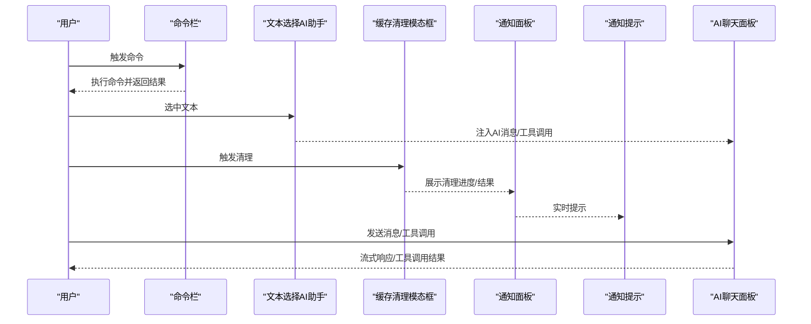
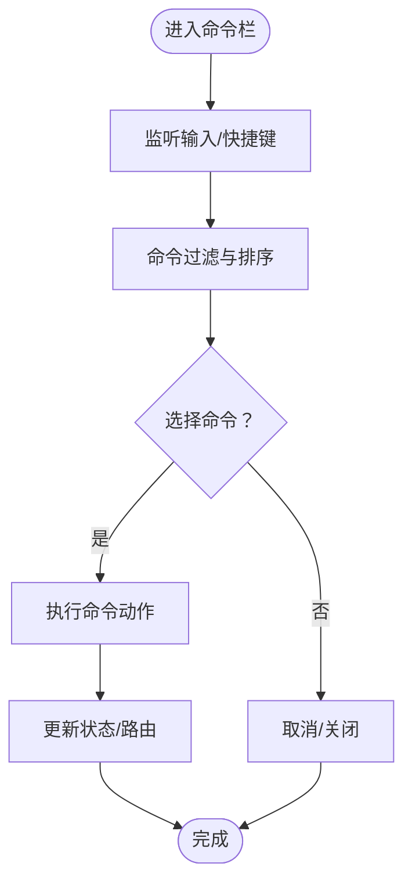
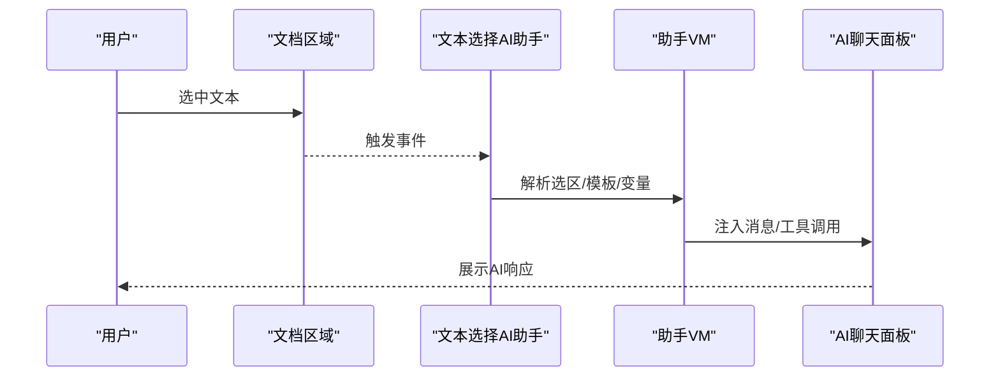
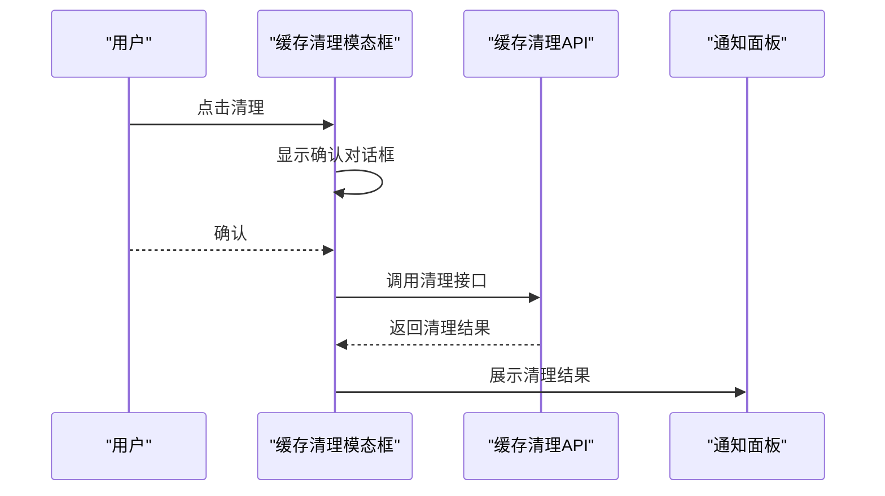
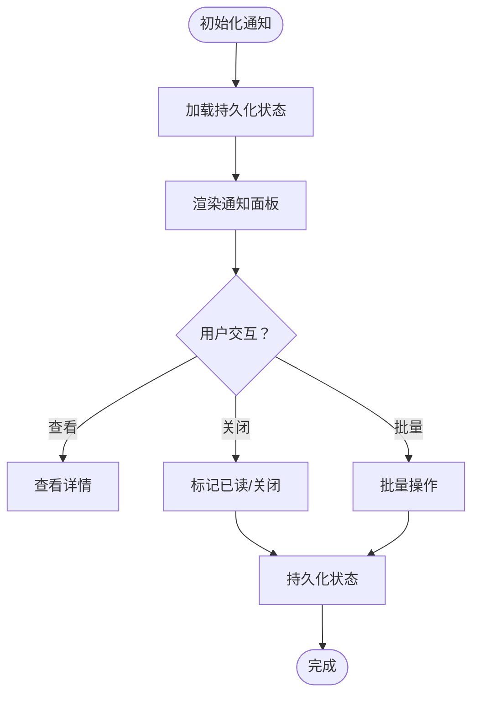
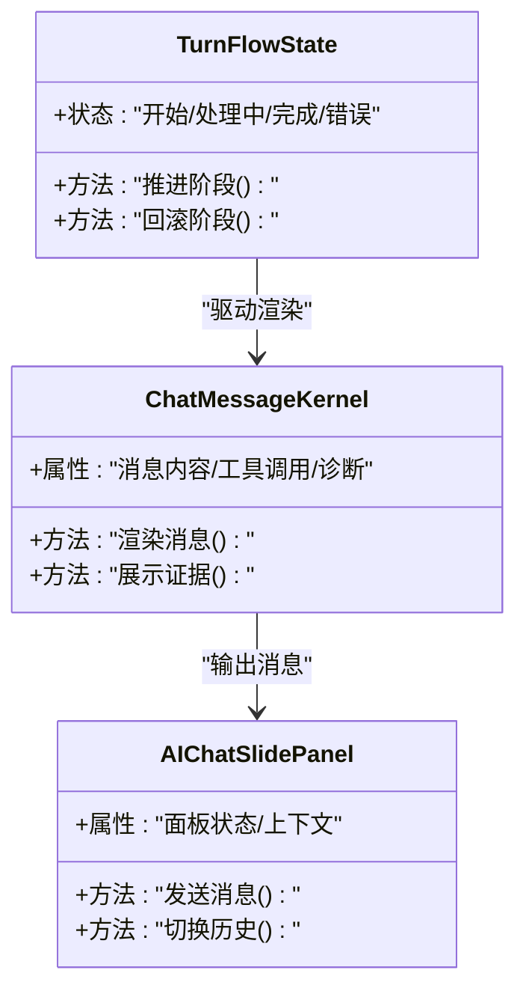
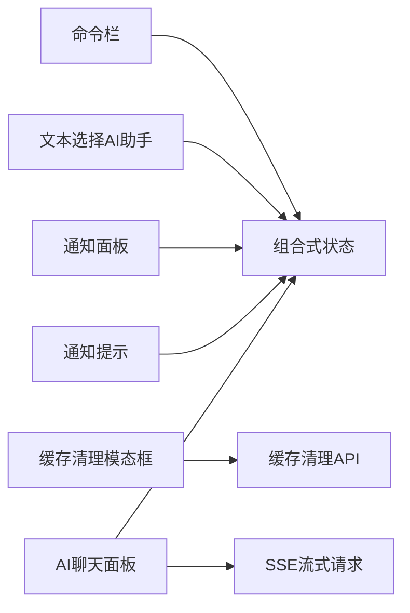

# 工具组件

<cite>
**本文引用的文件**
- [command-bar/index.ts](file://frontend/apps/web-antd/src/components/business/command-bar/index.ts)
- [command-bar/use-command-bar.ts](file://frontend/apps/web-antd/src/components/business/command-bar/use-command-bar.ts)
- [text-selection-ai-assist/index.ts](file://frontend/apps/web-antd/src/components/business/text-selection-ai-assist/index.ts)
- [text-selection-ai-assist/use-text-selection-ai-assist.ts](file://frontend/apps/web-antd/src/components/business/text-selection-ai-assist/use-text-selection-ai-assist.ts)
- [cache-clear-modal/index.ts](file://frontend/apps/web-antd/src/components/business/cache-clear-modal/index.ts)
- [cache-clear-modal/use-cache-clear-modal.ts](file://frontend/apps/web-antd/src/components/business/cache-clear-modal/use-cache-clear-modal.ts)
- [notification-panel/index.ts](file://frontend/apps/web-antd/src/components/business/notification-panel/index.ts)
- [notification-panel/use-notification-panel.ts](file://frontend/apps/web-antd/src/components/business/notification-panel/use-notification-panel.ts)
- [notification-toast/use-notification-toast.ts](file://frontend/apps/web-antd/src/composables/use-notification-toast.ts)
- [notification-store.ts](file://frontend/apps/web-antd/src/store/shared/notification.ts)
- [admin-cache-api.ts](file://frontend/apps/web-antd/src/api/admin/cache.ts)
- [ai-chat-panel/use-assistant-message-vm.ts](file://frontend/apps/web-antd/src/components/business/ai-chat-panel/use-assistant-message-vm.ts)
- [ai-chat-panel/use-ai-chat.ts](file://frontend/apps/web-antd/src/components/business/ai-chat-panel/use-ai-chat.ts)
- [ai-chat-panel/use-ai-chat-core.ts](file://frontend/apps/web-antd/src/components/business/ai-chat-panel/use-ai-chat-core.ts)
- [ai-chat-panel/use-ai-chat-streaming.ts](file://frontend/apps/web-antd/src/components/business/ai-chat-panel/use-ai-chat-streaming.ts)
- [ai-chat-panel/use-ai-chat-conversations.ts](file://frontend/apps/web-antd/src/components/business/ai-chat-panel/use-ai-chat-conversations.ts)
- [ai-chat-panel/use-ai-chat-history.ts](file://frontend/apps/web-antd/src/components/business/ai-chat-panel/use-ai-chat-history.ts)
- [ai-chat-panel/use-ai-chat-memory.ts](file://frontend/apps/web-antd/src/components/business/ai-chat-panel/use-ai-chat-memory.ts)
- [ai-chat-panel/use-ai-chat-options.ts](file://frontend/apps/web-antd/src/components/business/ai-chat-panel/use-ai-chat-options.ts)
- [ai-chat-panel/use-ai-chat-variables.ts](file://frontend/apps/web-antd/src/components/business/ai-chat-panel/use-ai-chat-variables.ts)
- [ai-chat-panel/use-ai-chat-attachments.ts](file://frontend/apps/web-antd/src/components/business/ai-chat-panel/use-ai-chat-attachments.ts)
- [ai-chat-panel/use-ai-chat-interactions.ts](file://frontend/apps/web-antd/src/components/business/ai-chat-panel/use-ai-chat-interactions.ts)
- [ai-chat-panel/use-ai-chat-message-helpers.ts](file://frontend/apps/web-antd/src/components/business/ai-chat-panel/use-ai-chat-message-helpers.ts)
- [ai-chat-panel/use-ai-chat-message-merge.ts](file://frontend/apps/web-antd/src/components/business/ai-chat-panel/use-ai-chat-message-merge.ts)
- [ai-chat-panel/use-ai-chat-message-normalizers.ts](file://frontend/apps/web-antd/src/components/business/ai-chat-panel/use-ai-chat-message-normalizers.ts)
- [ai-chat-panel/use-ai-chat-turn-flow.ts](file://frontend/apps/web-antd/src/components/business/ai-chat-panel/use-ai-chat-turn-flow.ts)
- [ai-chat-panel/use-ai-chat-streaming-request.ts](file://frontend/apps/web-antd/src/components/business/ai-chat-panel/use-ai-chat-streaming-request.ts)
- [ai-chat-panel/use-ai-chat-streaming-request-sse.ts](file://frontend/apps/web-antd/src/components/business/ai-chat-panel/use-ai-chat-streaming-request-sse.ts)
- [ai-chat-panel/use-ai-chat-streaming-request-recovery.ts](file://frontend/apps/web-antd/src/components/business/ai-chat-panel/use-ai-chat-streaming-request-recovery.ts)
- [ai-chat-panel/use-ai-chat-streaming-request-lifecycle.ts](file://frontend/apps/web-antd/src/components/business/ai-chat-panel/use-ai-chat-streaming-request-lifecycle.ts)
- [ai-chat-panel/use-ai-chat-streaming-scroll.ts](file://frontend/apps/web-antd/src/components/business/ai-chat-panel/use-ai-chat-streaming-scroll.ts)
- [ai-chat-panel/use-ai-chat-core-actions.ts](file://frontend/apps/web-antd/src/components/business/ai-chat-panel/use-ai-chat-core-actions.ts)
- [ai-chat-panel/use-ai-chat-composer.ts](file://frontend/apps/web-antd/src/components/business/ai-chat-panel/use-ai-chat-composer.ts)
- [ai-chat-panel/use-ai-chat-export.ts](file://frontend/apps/web-antd/src/components/business/ai-chat-panel/use-ai-chat-export.ts)
- [ai-chat-panel/use-ai-chat-message-context.ts](file://frontend/apps/web-antd/src/components/business/ai-chat-panel/use-ai-chat-message-context.ts)
- [ai-chat-panel/use-ai-chat-message-merge-turn.ts](file://frontend/apps/web-antd/src/components/business/ai-chat-panel/use-ai-chat-message-merge-turn.ts)
- [ai-chat-panel/use-ai-chat-message-merge-turn-state.ts](file://frontend/apps/web-antd/src/components/business/ai-chat-panel/use-ai-chat-message-merge-turn-state.ts)
- [ai-chat-panel/use-ai-chat-message-merge-turn-processing.ts](file://frontend/apps/web-antd/src/components/business/ai-chat-panel/use-ai-chat-message-merge-turn-processing.ts)
- [ai-chat-panel/use-ai-chat-message-merge-turn-finalize.ts](file://frontend/apps/web-antd/src/components/business/ai-chat-panel/use-ai-chat-message-merge-turn-finalize.ts)
- [ai-chat-panel/use-ai-chat-message-merge-turn-diagnostics.ts](file://frontend/apps/web-antd/src/components/business/ai-chat-panel/use-ai-chat-message-merge-turn-diagnostics.ts)
- [ai-chat-panel/use-ai-chat-message-merge-turn-content.ts](file://frontend/apps/web-antd/src/components/business/ai-chat-panel/use-ai-chat-message-merge-turn-content.ts)
- [ai-chat-panel/use-ai-chat-message-merge-turn-flow-core.ts](file://frontend/apps/web-antd/src/components/business/ai-chat-panel/use-ai-chat-message-merge-turn-flow-core.ts)
- [ai-chat-panel/use-ai-chat-message-merge-turn-flow-core-ops.ts](file://frontend/apps/web-antd/src/components/business/ai-chat-panel/use-ai-chat-message-merge-turn-flow-core-ops.ts)
- [ai-chat-panel/use-ai-chat-message-merge-turn-flow-core-normalizers.ts](file://frontend/apps/web-antd/src/components/business/ai-chat-panel/use-ai-chat-message-merge-turn-flow-core-normalizers.ts)
- [ai-chat-panel/use-ai-chat-message-merge-turn-flow-display-helpers.ts](file://frontend/apps/web-antd/src/components/business/ai-chat-panel/use-ai-chat-message-merge-turn-flow-display-helpers.ts)
- [ai-chat-panel/use-ai-chat-message-merge-turn-flow-ingestion.ts](file://frontend/apps/web-antd/src/components/business/ai-chat-panel/use-ai-chat-message-merge-turn-flow-ingestion.ts)
- [ai-chat-panel/use-ai-chat-message-merge-turn-flow.ts](file://frontend/apps/web-antd/src/components/business/ai-chat-panel/use-ai-chat-message-merge-turn-flow.ts)
- [ai-chat-panel/use-ai-chat-message-tool-calls.ts](file://frontend/apps/web-antd/src/components/business/ai-chat-panel/use-ai-chat-message-tool-calls.ts)
- [ai-chat-panel/tool-call-utils.ts](file://frontend/apps/web-antd/src/components/business/ai-chat-panel/tool-call-utils.ts)
- [ai-chat-panel/toolActionErrorHints.ts](file://frontend/apps/web-antd/src/components/business/ai-chat-panel/toolActionErrorHints.ts)
- [ai-chat-panel/display-formatters.ts](file://frontend/apps/web-antd/src/components/business/ai-chat-panel/display-formatters.ts)
- [ai-chat-panel/conversation-binding.ts](file://frontend/apps/web-antd/src/components/business/ai-chat-panel/conversation-binding.ts)
- [ai-chat-panel/turn-flow-first-message.ts](file://frontend/apps/web-antd/src/components/business/ai-chat-panel/turn-flow-first-message.ts)
- [ai-chat-panel/types.ts](file://frontend/apps/web-antd/src/components/business/ai-chat-panel/types.ts)
- [ai-chat-panel/chat-input-utils.ts](file://frontend/apps/web-antd/src/components/business/ai-chat-panel/chat-input-utils.ts)
- [ai-chat-panel/chat-message-diagnostics-visibility.ts](file://frontend/apps/web-antd/src/components/business/ai-chat-panel/chat-message-diagnostics-visibility.ts)
- [ai-chat-panel/chat-message-display-preparation.ts](file://frontend/apps/web-antd/src/components/business/ai-chat-panel/chat-message-display-preparation.ts)
- [ai-chat-panel/chat-message-tool-call-details-helpers.ts](file://frontend/apps/web-antd/src/components/business/ai-chat-panel/chat-message-tool-call-details-helpers.ts)
- [ai-chat-panel/chat-message-tool-call-display-helpers.ts](file://frontend/apps/web-antd/src/components/business/ai-chat-panel/chat-message-tool-call-display-helpers.ts)
- [ai-chat-panel/chat-message-turn-flow.ts](file://frontend/apps/web-antd/src/components/business/ai-chat-panel/chat-message-turn-flow.ts)
- [ai-chat-panel/chat-message-turn-flow-core.ts](file://frontend/apps/web-antd/src/components/business/ai-chat-panel/chat-message-turn-flow-core.ts)
- [ai-chat-panel/chat-message-turn-flow-core-ops.ts](file://frontend/apps/web-antd/src/components/business/ai-chat-panel/chat-message-turn-flow-core-ops.ts)
- [ai-chat-panel/chat-message-turn-flow-core-normalizers.ts](file://frontend/apps/web-antd/src/components/business/ai-chat-panel/chat-message-turn-flow-core-normalizers.ts)
- [ai-chat-panel/chat-message-turn-flow-display-helpers.ts](file://frontend/apps/web-antd/src/components/business/ai-chat-panel/chat-message-turn-flow-display-helpers.ts)
- [ai-chat-panel/chat-message-turn-flow-ingestion.ts](file://frontend/apps/web-antd/src/components/business/ai-chat-panel/chat-message-turn-flow-ingestion.ts)
- [ai-chat-panel/turn-stage-presentation.ts](file://frontend/apps/web-antd/src/components/business/ai-chat-panel/turn-stage-presentation.ts)
- [ai-chat-kernel/TurnFlowState.ts](file://frontend/apps/web-antd/src/components/business/ai-chat-kernel/TurnFlowState.ts)
- [ai-chat-kernel/ChatMessageKernel.vue](file://frontend/apps/web-antd/src/components/business/ai-chat-kernel/ChatMessageKernel.vue)
- [ai-chat-kernel/TurnTimeline.vue](file://frontend/apps/web-antd/src/components/business/ai-chat-kernel/TurnTimeline.vue)
- [ai-chat-kernel/ActionConsentGate.vue](file://frontend/apps/web-antd/src/components/business/ai-chat-kernel/ActionConsentGate.vue)
- [ai-chat-kernel/EvidenceCard.vue](file://frontend/apps/web-antd/src/components/business/ai-chat-kernel/EvidenceCard.vue)
- [ai-slide-panel/AIChatSlidePanel.vue](file://frontend/apps/web-antd/src/components/business/ai-slide-panel/AIChatSlidePanel.vue)
- [ai-slide-panel/AIChatSlidePanelShell.vue](file://frontend/apps/web-antd/src/components/business/ai-slide-panel/AIChatSlidePanelShell.vue)
- [ai-slide-panel/use-ai-chat-slide-panel-shell.ts](file://frontend/apps/web-antd/src/components/business/ai-slide-panel/use-ai-chat-slide-panel-shell.ts)
- [ai-slide-panel/use-panel-composer.ts](file://frontend/apps/web-antd/src/components/business/ai-slide-panel/use-panel-composer.ts)
- [ai-slide-panel/use-panel-history.ts](file://frontend/apps/web-antd/src/components/business/ai-slide-panel/use-panel-history.ts)
- [ai-slide-panel/use-panel-send-message.ts](file://frontend/apps/web-antd/src/components/business/ai-slide-panel/use-panel-send-message.ts)
- [ai-slide-panel/use-panel-shell-actions.ts](file://frontend/apps/web-antd/src/components/business/ai-slide-panel/use-panel-shell-actions.ts)
- [ai-slide-panel/use-panel-shell-body-bindings.ts](file://frontend/apps/web-antd/src/components/business/ai-slide-panel/use-panel-shell-body-bindings.ts)
- [ai-slide-panel/use-panel-shell-computed-ui.ts](file://frontend/apps/web-antd/src/components/business/ai-slide-panel/use-panel-shell-computed-ui.ts)
- [ai-slide-panel/use-panel-shell-context.ts](file://frontend/apps/web-antd/src/components/business/ai-slide-panel/use-panel-shell-context.ts)
- [ai-slide-panel/use-panel-shell-header-bindings.ts](file://frontend/apps/web-antd/src/components/business/ai-slide-panel/use-panel-shell-header-bindings.ts)
- [ai-slide-panel/use-panel-shell-header-context.ts](file://frontend/apps/web-antd/src/components/business/ai-slide-panel/use-panel-shell-header-context.ts)
- [ai-slide-panel/use-panel-context-bridge.ts](file://frontend/apps/web-antd/src/components/business/ai-slide-panel/use-panel-context-bridge.ts)
- [ai-slide-panel/use-panel-link-preview.ts](file://frontend/apps/web-antd/src/components/business/ai-slide-panel/use-panel-link-preview.ts)
- [ai-slide-panel/use-agent-router.ts](file://frontend/apps/web-antd/src/components/business/ai-slide-panel/use-agent-router.ts)
- [ai-slide-panel/use-ai-chat-slide-panel-shell-bindings.ts](file://frontend/apps/web-antd/src/components/business/ai-slide-panel/use-ai-chat-slide-panel-shell-bindings.ts)
- [ai-slide-panel/use-ai-chat-slide-panel-shell-bindings-contract.ts](file://frontend/apps/web-antd/src/components/business/ai-slide-panel/use-ai-chat-slide-panel-shell-bindings-contract.ts)
- [ai-slide-panel/AIChatComposer.vue](file://frontend/apps/web-antd/src/components/business/ai-slide-panel/AIChatComposer.vue)
- [ai-slide-panel/AIChatContextDiagnosticsDrawer.vue](file://frontend/apps/web-antd/src/components/business/ai-slide-panel/AIChatContextDiagnosticsDrawer.vue)
- [ai-slide-panel/AIChatConversationFooter.vue](file://frontend/apps/web-antd/src/components/business/ai-slide-panel/AIChatConversationFooter.vue)
- [ai-slide-panel/AIChatHistoryPane.vue](file://frontend/apps/web-antd/src/components/business/ai-slide-panel/AIChatHistoryPane.vue)
- [ai-slide-panel/AIChatMemoryPanel.vue](file://frontend/apps/web-antd/src/components/business/ai-slide-panel/AIChatMemoryPanel.vue)
- [ai-slide-panel/AIChatMessageViewport.vue](file://frontend/apps/web-antd/src/components/business/ai-slide-panel/AIChatMessageViewport.vue)
- [ai-slide-panel/AIChatPanelBody.vue](file://frontend/apps/web-antd/src/components/business/ai-slide-panel/AIChatPanelBody.vue)
- [ai-slide-panel/AIChatPanelHeader.vue](file://frontend/apps/web-antd/src/components/business/ai-slide-panel/AIChatPanelHeader.vue)
- [ai-slide-panel/AIChatPanelMinimizedBubble.vue](file://frontend/apps/web-antd/src/components/business/ai-slide-panel/AIChatPanelMinimizedBubble.vue)
- [ai-slide-panel/AIChatPanelOverlays.vue](file://frontend/apps/web-antd/src/components/business/ai-slide-panel/AIChatPanelOverlays.vue)
- [ai-slide-panel/AIChatPanelToolbarRow.vue](file://frontend/apps/web-antd/src/components/business/ai-slide-panel/AIChatPanelToolbarRow.vue)
- [ai-slide-panel/AIChatPanelUtilityActions.vue](file://frontend/apps/web-antd/src/components/business/ai-slide-panel/AIChatPanelUtilityActions.vue)
- [ai-slide-panel/AIChatTimelineDrawer.vue](file://frontend/apps/web-antd/src/components/business/ai-slide-panel/AIChatTimelineDrawer.vue)
- [ai-slide-panel/AgentVarsModal.vue](file://frontend/apps/web-antd/src/components/business/ai-slide-panel/AgentVarsModal.vue)
- [ai-slide-panel/ai-chat-slide-panel-shell.css](file://frontend/apps/web-antd/src/components/business/ai-slide-panel/ai-chat-slide-panel-shell.css)
- [ai-slide-panel/index.ts](file://frontend/apps/web-antd/src/components/business/ai-slide-panel/index.ts)
</cite>

## 目录
1. [引言](#引言)
2. [项目结构](#项目结构)
3. [核心组件](#核心组件)
4. [架构总览](#架构总览)
5. [详细组件分析](#详细组件分析)
6. [依赖关系分析](#依赖关系分析)
7. [性能考量](#性能考量)
8. [故障排查指南](#故障排查指南)
9. [结论](#结论)
10. [附录](#附录)

## 引言
本文件聚焦于前端“工具组件”群组，围绕以下关键能力进行系统化技术文档化：命令栏、文本选择AI助手、缓存清理模态框、通知面板与通知提示、以及与AI对话内核相关的工具链。内容覆盖事件监听、状态管理、用户体验优化、键盘快捷键、无障碍支持、性能监控、配置选项与个性化设置等方面，并通过图示展示组件间交互与数据流。

## 项目结构
工具组件主要位于前端应用的业务组件层，采用按功能域分层组织的方式：
- 命令栏：提供全局快捷入口与上下文感知命令执行。
- 文本选择AI助手：在用户选中文本后触发AI辅助处理。
- 缓存清理模态框：系统维护类工具，用于清理缓存并提供确认流程。
- 通知面板与通知提示：统一的消息通知与提示展示。
- AI聊天内核与滑动面板：承载消息渲染、工具调用、流式响应、历史与记忆管理等。

```mermaid
graph TB
subgraph "命令栏"
CB_Index["command-bar/index.ts"]
CB_Use["command-bar/use-command-bar.ts"]
end
subgraph "文本选择AI助手"
TSA_Index["text-selection-ai-assist/index.ts"]
TSA_Use["text-selection-ai-assist/use-text-selection-ai-assist.ts"]
end
subgraph "缓存清理模态框"
CCM_Index["cache-clear-modal/index.ts"]
CCM_Use["cache-clear-modal/use-cache-clear-modal.ts"]
end
subgraph "通知"
NP_Index["notification-panel/index.ts"]
NP_Use["notification-panel/use-notification-panel.ts"]
NT_Use["composables/use-notification-toast.ts"]
NS_Store["store/shared/notification.ts"]
end
subgraph "AI聊天内核与面板"
AICore["ai-chat-kernel/TurnFlowState.ts"]
AIPanel["ai-chat-panel/use-ai-chat.ts"]
AISlide["ai-slide-panel/AIChatSlidePanel.vue"]
end
CB_Index --> CB_Use
TSA_Index --> TSA_Use
CCM_Index --> CCM_Use
NP_Index --> NP_Use
NT_Use --> NS_Store
AIPanel --> AISlide
AICore --> AIPanel
```

图表来源
- [command-bar/index.ts](file://frontend/apps/web-antd/src/components/business/command-bar/index.ts)
- [command-bar/use-command-bar.ts](file://frontend/apps/web-antd/src/components/business/command-bar/use-command-bar.ts)
- [text-selection-ai-assist/index.ts](file://frontend/apps/web-antd/src/components/business/text-selection-ai-assist/index.ts)
- [text-selection-ai-assist/use-text-selection-ai-assist.ts](file://frontend/apps/web-antd/src/components/business/text-selection-ai-assist/use-text-selection-ai-assist.ts)
- [cache-clear-modal/index.ts](file://frontend/apps/web-antd/src/components/business/cache-clear-modal/index.ts)
- [cache-clear-modal/use-cache-clear-modal.ts](file://frontend/apps/web-antd/src/components/business/cache-clear-modal/use-cache-clear-modal.ts)
- [notification-panel/index.ts](file://frontend/apps/web-antd/src/components/business/notification-panel/index.ts)
- [notification-panel/use-notification-panel.ts](file://frontend/apps/web-antd/src/components/business/notification-panel/use-notification-panel.ts)
- [use-notification-toast.ts](file://frontend/apps/web-antd/src/composables/use-notification-toast.ts)
- [notification-store.ts](file://frontend/apps/web-antd/src/store/shared/notification.ts)
- [ai-chat-panel/use-ai-chat.ts](file://frontend/apps/web-antd/src/components/business/ai-chat-panel/use-ai-chat.ts)
- [ai-chat-kernel/TurnFlowState.ts](file://frontend/apps/web-antd/src/components/business/ai-chat-kernel/TurnFlowState.ts)
- [ai-slide-panel/AIChatSlidePanel.vue](file://frontend/apps/web-antd/src/components/business/ai-slide-panel/AIChatSlidePanel.vue)

章节来源
- [command-bar/index.ts](file://frontend/apps/web-antd/src/components/business/command-bar/index.ts)
- [command-bar/use-command-bar.ts](file://frontend/apps/web-antd/src/components/business/command-bar/use-command-bar.ts)
- [text-selection-ai-assist/index.ts](file://frontend/apps/web-antd/src/components/business/text-selection-ai-assist/index.ts)
- [text-selection-ai-assist/use-text-selection-ai-assist.ts](file://frontend/apps/web-antd/src/components/business/text-selection-ai-assist/use-text-selection-ai-assist.ts)
- [cache-clear-modal/index.ts](file://frontend/apps/web-antd/src/components/business/cache-clear-modal/index.ts)
- [cache-clear-modal/use-cache-clear-modal.ts](file://frontend/apps/web-antd/src/components/business/cache-clear-modal/use-cache-clear-modal.ts)
- [notification-panel/index.ts](file://frontend/apps/web-antd/src/components/business/notification-panel/index.ts)
- [notification-panel/use-notification-panel.ts](file://frontend/apps/web-antd/src/components/business/notification-panel/use-notification-panel.ts)
- [use-notification-toast.ts](file://frontend/apps/web-antd/src/composables/use-notification-toast.ts)
- [notification-store.ts](file://frontend/apps/web-antd/src/store/shared/notification.ts)
- [ai-chat-panel/use-ai-chat.ts](file://frontend/apps/web-antd/src/components/business/ai-chat-panel/use-ai-chat.ts)
- [ai-chat-kernel/TurnFlowState.ts](file://frontend/apps/web-antd/src/components/business/ai-chat-kernel/TurnFlowState.ts)
- [ai-slide-panel/AIChatSlidePanel.vue](file://frontend/apps/web-antd/src/components/business/ai-slide-panel/AIChatSlidePanel.vue)

## 核心组件
- 命令栏：提供全局命令入口、上下文感知命令过滤与执行，支持键盘导航与快捷键绑定。
- 文本选择AI助手：基于浏览器选区检测，触发AI辅助生成或处理，支持多场景模板与变量注入。
- 缓存清理模态框：封装清理流程与二次确认，调用后端缓存清理接口并反馈结果。
- 通知面板与通知提示：集中管理通知列表与实时提示，支持持久化存储与用户偏好控制。
- AI聊天内核与滑动面板：负责消息合并、工具调用、流式渲染、历史与记忆管理、上下文桥接等。

章节来源
- [command-bar/use-command-bar.ts](file://frontend/apps/web-antd/src/components/business/command-bar/use-command-bar.ts)
- [text-selection-ai-assist/use-text-selection-ai-assist.ts](file://frontend/apps/web-antd/src/components/business/text-selection-ai-assist/use-text-selection-ai-assist.ts)
- [cache-clear-modal/use-cache-clear-modal.ts](file://frontend/apps/web-antd/src/components/business/cache-clear-modal/use-cache-clear-modal.ts)
- [notification-panel/use-notification-panel.ts](file://frontend/apps/web-antd/src/components/business/notification-panel/use-notification-panel.ts)
- [use-notification-toast.ts](file://frontend/apps/web-antd/src/composables/use-notification-toast.ts)
- [notification-store.ts](file://frontend/apps/web-antd/src/store/shared/notification.ts)
- [ai-chat-panel/use-ai-chat.ts](file://frontend/apps/web-antd/src/components/business/ai-chat-panel/use-ai-chat.ts)
- [ai-chat-panel/use-ai-chat-streaming.ts](file://frontend/apps/web-antd/src/components/business/ai-chat-panel/use-ai-chat-streaming.ts)
- [ai-chat-panel/use-ai-chat-conversations.ts](file://frontend/apps/web-antd/src/components/business/ai-chat-panel/use-ai-chat-conversations.ts)
- [ai-chat-panel/use-ai-chat-history.ts](file://frontend/apps/web-antd/src/components/business/ai-chat-panel/use-ai-chat-history.ts)
- [ai-chat-panel/use-ai-chat-memory.ts](file://frontend/apps/web-antd/src/components/business/ai-chat-panel/use-ai-chat-memory.ts)
- [ai-chat-panel/use-ai-chat-options.ts](file://frontend/apps/web-antd/src/components/business/ai-chat-panel/use-ai-chat-options.ts)
- [ai-chat-panel/use-ai-chat-variables.ts](file://frontend/apps/web-antd/src/components/business/ai-chat-panel/use-ai-chat-variables.ts)
- [ai-chat-panel/use-ai-chat-attachments.ts](file://frontend/apps/web-antd/src/components/business/ai-chat-panel/use-ai-chat-attachments.ts)
- [ai-chat-panel/use-ai-chat-interactions.ts](file://frontend/apps/web-antd/src/components/business/ai-chat-panel/use-ai-chat-interactions.ts)
- [ai-chat-panel/use-ai-chat-message-helpers.ts](file://frontend/apps/web-antd/src/components/business/ai-chat-panel/use-ai-chat-message-helpers.ts)
- [ai-chat-panel/use-ai-chat-message-merge.ts](file://frontend/apps/web-antd/src/components/business/ai-chat-panel/use-ai-chat-message-merge.ts)
- [ai-chat-panel/use-ai-chat-message-normalizers.ts](file://frontend/apps/web-antd/src/components/business/ai-chat-panel/use-ai-chat-message-normalizers.ts)
- [ai-chat-panel/use-ai-chat-turn-flow.ts](file://frontend/apps/web-antd/src/components/business/ai-chat-panel/use-ai-chat-turn-flow.ts)
- [ai-chat-panel/use-ai-chat-streaming-request.ts](file://frontend/apps/web-antd/src/components/business/ai-chat-panel/use-ai-chat-streaming-request.ts)
- [ai-chat-panel/use-ai-chat-streaming-request-sse.ts](file://frontend/apps/web-antd/src/components/business/ai-chat-panel/use-ai-chat-streaming-request-sse.ts)
- [ai-chat-panel/use-ai-chat-streaming-request-recovery.ts](file://frontend/apps/web-antd/src/components/business/ai-chat-panel/use-ai-chat-streaming-request-recovery.ts)
- [ai-chat-panel/use-ai-chat-streaming-request-lifecycle.ts](file://frontend/apps/web-antd/src/components/business/ai-chat-panel/use-ai-chat-streaming-request-lifecycle.ts)
- [ai-chat-panel/use-ai-chat-streaming-scroll.ts](file://frontend/apps/web-antd/src/components/business/ai-chat-panel/use-ai-chat-streaming-scroll.ts)
- [ai-chat-panel/use-ai-chat-core-actions.ts](file://frontend/apps/web-antd/src/components/business/ai-chat-panel/use-ai-chat-core-actions.ts)
- [ai-chat-panel/use-ai-chat-composer.ts](file://frontend/apps/web-antd/src/components/business/ai-chat-panel/use-ai-chat-composer.ts)
- [ai-chat-panel/use-ai-chat-export.ts](file://frontend/apps/web-antd/src/components/business/ai-chat-panel/use-ai-chat-export.ts)
- [ai-chat-panel/use-ai-chat-message-context.ts](file://frontend/apps/web-antd/src/components/business/ai-chat-panel/use-ai-chat-message-context.ts)
- [ai-chat-panel/use-ai-chat-message-merge-turn.ts](file://frontend/apps/web-antd/src/components/business/ai-chat-panel/use-ai-chat-message-merge-turn.ts)
- [ai-chat-panel/use-ai-chat-message-merge-turn-state.ts](file://frontend/apps/web-antd/src/components/business/ai-chat-panel/use-ai-chat-message-merge-turn-state.ts)
- [ai-chat-panel/use-ai-chat-message-merge-turn-processing.ts](file://frontend/apps/web-antd/src/components/business/ai-chat-panel/use-ai-chat-message-merge-turn-processing.ts)
- [ai-chat-panel/use-ai-chat-message-merge-turn-finalize.ts](file://frontend/apps/web-antd/src/components/business/ai-chat-panel/use-ai-chat-message-merge-turn-finalize.ts)
- [ai-chat-panel/use-ai-chat-message-merge-turn-diagnostics.ts](file://frontend/apps/web-antd/src/components/business/ai-chat-panel/use-ai-chat-message-merge-turn-diagnostics.ts)
- [ai-chat-panel/use-ai-chat-message-merge-turn-content.ts](file://frontend/apps/web-antd/src/components/business/ai-chat-panel/use-ai-chat-message-merge-turn-content.ts)
- [ai-chat-panel/use-ai-chat-message-merge-turn-flow-core.ts](file://frontend/apps/web-antd/src/components/business/ai-chat-panel/use-ai-chat-message-merge-turn-flow-core.ts)
- [ai-chat-panel/use-ai-chat-message-merge-turn-flow-core-ops.ts](file://frontend/apps/web-antd/src/components/business/ai-chat-panel/use-ai-chat-message-merge-turn-flow-core-ops.ts)
- [ai-chat-panel/use-ai-chat-message-merge-turn-flow-core-normalizers.ts](file://frontend/apps/web-antd/src/components/business/ai-chat-panel/use-ai-chat-message-merge-turn-flow-core-normalizers.ts)
- [ai-chat-panel/use-ai-chat-message-merge-turn-flow-display-helpers.ts](file://frontend/apps/web-antd/src/components/business/ai-chat-panel/use-ai-chat-message-merge-turn-flow-display-helpers.ts)
- [ai-chat-panel/use-ai-chat-message-merge-turn-flow-ingestion.ts](file://frontend/apps/web-antd/src/components/business/ai-chat-panel/use-ai-chat-message-merge-turn-flow-ingestion.ts)
- [ai-chat-panel/use-ai-chat-message-merge-turn-flow.ts](file://frontend/apps/web-antd/src/components/business/ai-chat-panel/use-ai-chat-message-merge-turn-flow.ts)
- [ai-chat-panel/use-ai-chat-message-tool-calls.ts](file://frontend/apps/web-antd/src/components/business/ai-chat-panel/use-ai-chat-message-tool-calls.ts)
- [ai-chat-panel/tool-call-utils.ts](file://frontend/apps/web-antd/src/components/business/ai-chat-panel/tool-call-utils.ts)
- [ai-chat-panel/toolActionErrorHints.ts](file://frontend/apps/web-antd/src/components/business/ai-chat-panel/toolActionErrorHints.ts)
- [ai-chat-panel/display-formatters.ts](file://frontend/apps/web-antd/src/components/business/ai-chat-panel/display-formatters.ts)
- [ai-chat-panel/conversation-binding.ts](file://frontend/apps/web-antd/src/components/business/ai-chat-panel/conversation-binding.ts)
- [ai-chat-panel/turn-flow-first-message.ts](file://frontend/apps/web-antd/src/components/business/ai-chat-panel/turn-flow-first-message.ts)
- [ai-chat-panel/types.ts](file://frontend/apps/web-antd/src/components/business/ai-chat-panel/types.ts)
- [ai-chat-panel/chat-input-utils.ts](file://frontend/apps/web-antd/src/components/business/ai-chat-panel/chat-input-utils.ts)
- [ai-chat-panel/chat-message-diagnostics-visibility.ts](file://frontend/apps/web-antd/src/components/business/ai-chat-panel/chat-message-diagnostics-visibility.ts)
- [ai-chat-panel/chat-message-display-preparation.ts](file://frontend/apps/web-antd/src/components/business/ai-chat-panel/chat-message-display-preparation.ts)
- [ai-chat-panel/chat-message-tool-call-details-helpers.ts](file://frontend/apps/web-antd/src/components/business/ai-chat-panel/chat-message-tool-call-details-helpers.ts)
- [ai-chat-panel/chat-message-tool-call-display-helpers.ts](file://frontend/apps/web-antd/src/components/business/ai-chat-panel/chat-message-tool-call-display-helpers.ts)
- [ai-chat-panel/chat-message-turn-flow.ts](file://frontend/apps/web-antd/src/components/business/ai-chat-panel/chat-message-turn-flow.ts)
- [ai-chat-panel/chat-message-turn-flow-core.ts](file://frontend/apps/web-antd/src/components/business/ai-chat-panel/chat-message-turn-flow-core.ts)
- [ai-chat-panel/chat-message-turn-flow-core-ops.ts](file://frontend/apps/web-antd/src/components/business/ai-chat-panel/chat-message-turn-flow-core-ops.ts)
- [ai-chat-panel/chat-message-turn-flow-core-normalizers.ts](file://frontend/apps/web-antd/src/components/business/ai-chat-panel/chat-message-turn-flow-core-normalizers.ts)
- [ai-chat-panel/chat-message-turn-flow-display-helpers.ts](file://frontend/apps/web-antd/src/components/business/ai-chat-panel/chat-message-turn-flow-display-helpers.ts)
- [ai-chat-panel/chat-message-turn-flow-ingestion.ts](file://frontend/apps/web-antd/src/components/business/ai-chat-panel/chat-message-turn-flow-ingestion.ts)
- [ai-chat-kernel/ChatMessageKernel.vue](file://frontend/apps/web-antd/src/components/business/ai-chat-kernel/ChatMessageKernel.vue)
- [ai-chat-kernel/TurnTimeline.vue](file://frontend/apps/web-antd/src/components/business/ai-chat-kernel/TurnTimeline.vue)
- [ai-chat-kernel/ActionConsentGate.vue](file://frontend/apps/web-antd/src/components/business/ai-chat-kernel/ActionConsentGate.vue)
- [ai-chat-kernel/EvidenceCard.vue](file://frontend/apps/web-antd/src/components/business/ai-chat-kernel/EvidenceCard.vue)
- [ai-chat-kernel/TurnFlowState.ts](file://frontend/apps/web-antd/src/components/business/ai-chat-kernel/TurnFlowState.ts)
- [ai-slide-panel/AIChatSlidePanel.vue](file://frontend/apps/web-antd/src/components/business/ai-slide-panel/AIChatSlidePanel.vue)
- [ai-slide-panel/AIChatSlidePanelShell.vue](file://frontend/apps/web-antd/src/components/business/ai-slide-panel/AIChatSlidePanelShell.vue)
- [ai-slide-panel/use-ai-chat-slide-panel-shell.ts](file://frontend/apps/web-antd/src/components/business/ai-slide-panel/use-ai-chat-slide-panel-shell.ts)
- [ai-slide-panel/use-panel-composer.ts](file://frontend/apps/web-antd/src/components/business/ai-slide-panel/use-panel-composer.ts)
- [ai-slide-panel/use-panel-history.ts](file://frontend/apps/web-antd/src/components/business/ai-slide-panel/use-panel-history.ts)
- [ai-slide-panel/use-panel-send-message.ts](file://frontend/apps/web-antd/src/components/business/ai-slide-panel/use-panel-send-message.ts)
- [ai-slide-panel/use-panel-shell-actions.ts](file://frontend/apps/web-antd/src/components/business/ai-slide-panel/use-panel-shell-actions.ts)
- [ai-slide-panel/use-panel-shell-body-bindings.ts](file://frontend/apps/web-antd/src/components/business/ai-slide-panel/use-panel-shell-body-bindings.ts)
- [ai-slide-panel/use-panel-shell-computed-ui.ts](file://frontend/apps/web-antd/src/components/business/ai-slide-panel/use-panel-shell-computed-ui.ts)
- [ai-slide-panel/use-panel-shell-context.ts](file://frontend/apps/web-antd/src/components/business/ai-slide-panel/use-panel-shell-context.ts)
- [ai-slide-panel/use-panel-shell-header-bindings.ts](file://frontend/apps/web-antd/src/components/business/ai-slide-panel/use-panel-shell-header-bindings.ts)
- [ai-slide-panel/use-panel-shell-header-context.ts](file://frontend/apps/web-antd/src/components/business/ai-slide-panel/use-panel-shell-header-context.ts)
- [ai-slide-panel/use-panel-context-bridge.ts](file://frontend/apps/web-antd/src/components/business/ai-slide-panel/use-panel-context-bridge.ts)
- [ai-slide-panel/use-panel-link-preview.ts](file://frontend/apps/web-antd/src/components/business/ai-slide-panel/use-panel-link-preview.ts)
- [ai-slide-panel/use-agent-router.ts](file://frontend/apps/web-antd/src/components/business/ai-slide-panel/use-agent-router.ts)
- [ai-slide-panel/use-ai-chat-slide-panel-shell-bindings.ts](file://frontend/apps/web-antd/src/components/business/ai-slide-panel/use-ai-chat-slide-panel-shell-bindings.ts)
- [ai-slide-panel/use-ai-chat-slide-panel-shell-bindings-contract.ts](file://frontend/apps/web-antd/src/components/business/ai-slide-panel/use-ai-chat-slide-panel-shell-bindings-contract.ts)

## 架构总览
工具组件群组采用“组合式函数 + 组合式状态”的设计模式，围绕以下关键点构建：
- 事件驱动：命令栏与文本选择AI助手通过事件监听与状态联动触发后续动作。
- 状态管理：使用组合式状态与共享存储（如通知Store）协调跨组件状态。
- 流式处理：AI聊天内核与面板通过流式请求生命周期管理消息与工具调用。
- 可视化与可访问性：统一的UI组件与无障碍属性确保一致体验。
- 性能与监控：通过节流、防抖、懒加载与指标上报保障性能。

图表来源
- [command-bar/use-command-bar.ts](file://frontend/apps/web-antd/src/components/business/command-bar/use-command-bar.ts)
- [text-selection-ai-assist/use-text-selection-ai-assist.ts](file://frontend/apps/web-antd/src/components/business/text-selection-ai-assist/use-text-selection-ai-assist.ts)
- [cache-clear-modal/use-cache-clear-modal.ts](file://frontend/apps/web-antd/src/components/business/cache-clear-modal/use-cache-clear-modal.ts)
- [notification-panel/use-notification-panel.ts](file://frontend/apps/web-antd/src/components/business/notification-panel/use-notification-panel.ts)
- [use-notification-toast.ts](file://frontend/apps/web-antd/src/composables/use-notification-toast.ts)
- [ai-chat-panel/use-ai-chat.ts](file://frontend/apps/web-antd/src/components/business/ai-chat-panel/use-ai-chat.ts)

## 详细组件分析

### 命令栏
- 设计要点
  - 全局命令入口：支持键盘快捷键与上下文感知命令过滤。
  - 命令执行：将命令映射到具体操作，如打开面板、切换主题、跳转页面等。
  - 状态管理：通过组合式状态与路由集成，保持命令栏与页面状态同步。
- 关键实现路径
  - [use-command-bar.ts](file://frontend/apps/web-antd/src/components/business/command-bar/use-command-bar.ts)
  - [index.ts](file://frontend/apps/web-antd/src/components/business/command-bar/index.ts)

图表来源
- [command-bar/use-command-bar.ts](file://frontend/apps/web-antd/src/components/business/command-bar/use-command-bar.ts)

章节来源
- [command-bar/use-command-bar.ts](file://frontend/apps/web-antd/src/components/business/command-bar/use-command-bar.ts)
- [command-bar/index.ts](file://frontend/apps/web-antd/src/components/business/command-bar/index.ts)

### 文本选择AI助手
- 设计要点
  - 选区检测：在用户选中文本后触发AI助手。
  - 场景适配：支持多种AI辅助场景（改写、总结、翻译、提取要点等）。
  - 变量注入：结合上下文变量与模板，提升生成质量。
- 关键实现路径
  - [use-text-selection-ai-assist.ts](file://frontend/apps/web-antd/src/components/business/text-selection-ai-assist/use-text-selection-ai-assist.ts)
  - [index.ts](file://frontend/apps/web-antd/src/components/business/text-selection-ai-assist/index.ts)

图表来源
- [text-selection-ai-assist/use-text-selection-ai-assist.ts](file://frontend/apps/web-antd/src/components/business/text-selection-ai-assist/use-text-selection-ai-assist.ts)
- [ai-chat-panel/use-assistant-message-vm.ts](file://frontend/apps/web-antd/src/components/business/ai-chat-panel/use-assistant-message-vm.ts)

章节来源
- [text-selection-ai-assist/use-text-selection-ai-assist.ts](file://frontend/apps/web-antd/src/components/business/text-selection-ai-assist/use-text-selection-ai-assist.ts)
- [text-selection-ai-assist/index.ts](file://frontend/apps/web-antd/src/components/business/text-selection-ai-assist/index.ts)
- [ai-chat-panel/use-assistant-message-vm.ts](file://frontend/apps/web-antd/src/components/business/ai-chat-panel/use-assistant-message-vm.ts)

### 缓存清理模态框
- 设计要点
  - 清理流程：封装清理步骤与二次确认，避免误操作。
  - 接口调用：调用后端缓存清理API，获取清理结果并反馈。
  - 用户提示：通过通知面板与提示组件展示清理进度与结果。
- 关键实现路径
  - [use-cache-clear-modal.ts](file://frontend/apps/web-antd/src/components/business/cache-clear-modal/use-cache-clear-modal.ts)
  - [index.ts](file://frontend/apps/web-antd/src/components/business/cache-clear-modal/index.ts)
  - [admin-cache-api.ts](file://frontend/apps/web-antd/src/api/admin/cache.ts)

图表来源
- [cache-clear-modal/use-cache-clear-modal.ts](file://frontend/apps/web-antd/src/components/business/cache-clear-modal/use-cache-clear-modal.ts)
- [admin-cache-api.ts](file://frontend/apps/web-antd/src/api/admin/cache.ts)
- [notification-panel/use-notification-panel.ts](file://frontend/apps/web-antd/src/components/business/notification-panel/use-notification-panel.ts)

章节来源
- [cache-clear-modal/use-cache-clear-modal.ts](file://frontend/apps/web-antd/src/components/business/cache-clear-modal/use-cache-clear-modal.ts)
- [cache-clear-modal/index.ts](file://frontend/apps/web-antd/src/components/business/cache-clear-modal/index.ts)
- [admin-cache-api.ts](file://frontend/apps/web-antd/src/api/admin/cache.ts)

### 通知面板与通知提示
- 设计要点
  - 集中式通知：统一管理通知列表与实时提示，支持分类与优先级。
  - 存储与偏好：持久化通知状态与用户偏好，避免重复打扰。
  - 提示组件：提供轻量提示与批量操作按钮，提升可读性与可用性。
- 关键实现路径
  - [use-notification-panel.ts](file://frontend/apps/web-antd/src/components/business/notification-panel/use-notification-panel.ts)
  - [index.ts](file://frontend/apps/web-antd/src/components/business/notification-panel/index.ts)
  - [use-notification-toast.ts](file://frontend/apps/web-antd/src/composables/use-notification-toast.ts)
  - [notification-store.ts](file://frontend/apps/web-antd/src/store/shared/notification.ts)

图表来源
- [notification-panel/use-notification-panel.ts](file://frontend/apps/web-antd/src/components/business/notification-panel/use-notification-panel.ts)
- [use-notification-toast.ts](file://frontend/apps/web-antd/src/composables/use-notification-toast.ts)
- [notification-store.ts](file://frontend/apps/web-antd/src/store/shared/notification.ts)

章节来源
- [notification-panel/use-notification-panel.ts](file://frontend/apps/web-antd/src/components/business/notification-panel/use-notification-panel.ts)
- [notification-panel/index.ts](file://frontend/apps/web-antd/src/components/business/notification-panel/index.ts)
- [use-notification-toast.ts](file://frontend/apps/web-antd/src/composables/use-notification-toast.ts)
- [notification-store.ts](file://frontend/apps/web-antd/src/store/shared/notification.ts)

### AI聊天内核与滑动面板
- 设计要点
  - 消息合并与归并：将多轮消息归并为可渲染单元，支持诊断信息与工具调用显示。
  - 工具调用：解析与展示工具调用详情，提供错误提示与重试机制。
  - 流式渲染：通过SSE与生命周期钩子实现流式响应与滚动定位。
  - 上下文桥接：在滑动面板与内核之间传递上下文与状态，保证一致性。
- 关键实现路径
  - [use-ai-chat.ts](file://frontend/apps/web-antd/src/components/business/ai-chat-panel/use-ai-chat.ts)
  - [use-ai-chat-streaming.ts](file://frontend/apps/web-antd/src/components/business/ai-chat-panel/use-ai-chat-streaming.ts)
  - [use-ai-chat-streaming-request.ts](file://frontend/apps/web-antd/src/components/business/ai-chat-panel/use-ai-chat-streaming-request.ts)
  - [use-ai-chat-streaming-request-sse.ts](file://frontend/apps/web-antd/src/components/business/ai-chat-panel/use-ai-chat-streaming-request-sse.ts)
  - [use-ai-chat-streaming-request-recovery.ts](file://frontend/apps/web-antd/src/components/business/ai-chat-panel/use-ai-chat-streaming-request-recovery.ts)
  - [use-ai-chat-streaming-request-lifecycle.ts](file://frontend/apps/web-antd/src/components/business/ai-chat-panel/use-ai-chat-streaming-request-lifecycle.ts)
  - [use-ai-chat-streaming-scroll.ts](file://frontend/apps/web-antd/src/components/business/ai-chat-panel/use-ai-chat-streaming-scroll.ts)
  - [use-ai-chat-core-actions.ts](file://frontend/apps/web-antd/src/components/business/ai-chat-panel/use-ai-chat-core-actions.ts)
  - [use-ai-chat-composer.ts](file://frontend/apps/web-antd/src/components/business/ai-chat-panel/use-ai-chat-composer.ts)
  - [use-ai-chat-export.ts](file://frontend/apps/web-antd/src/components/business/ai-chat-panel/use-ai-chat-export.ts)
  - [use-ai-chat-message-context.ts](file://frontend/apps/web-antd/src/components/business/ai-chat-panel/use-ai-chat-message-context.ts)
  - [use-ai-chat-message-merge.ts](file://frontend/apps/web-antd/src/components/business/ai-chat-panel/use-ai-chat-message-merge.ts)
  - [use-ai-chat-message-normalizers.ts](file://frontend/apps/web-antd/src/components/business/ai-chat-panel/use-ai-chat-message-normalizers.ts)
  - [use-ai-chat-turn-flow.ts](file://frontend/apps/web-antd/src/components/business/ai-chat-panel/use-ai-chat-turn-flow.ts)
  - [use-ai-chat-conversations.ts](file://frontend/apps/web-antd/src/components/business/ai-chat-panel/use-ai-chat-conversations.ts)
  - [use-ai-chat-history.ts](file://frontend/apps/web-antd/src/components/business/ai-chat-panel/use-ai-chat-history.ts)
  - [use-ai-chat-memory.ts](file://frontend/apps/web-antd/src/components/business/ai-chat-panel/use-ai-chat-memory.ts)
  - [use-ai-chat-options.ts](file://frontend/apps/web-antd/src/components/business/ai-chat-panel/use-ai-chat-options.ts)
  - [use-ai-chat-variables.ts](file://frontend/apps/web-antd/src/components/business/ai-chat-panel/use-ai-chat-variables.ts)
  - [use-ai-chat-attachments.ts](file://frontend/apps/web-antd/src/components/business/ai-chat-panel/use-ai-chat-attachments.ts)
  - [use-ai-chat-interactions.ts](file://frontend/apps/web-antd/src/components/business/ai-chat-panel/use-ai-chat-interactions.ts)
  - [use-ai-chat-message-helpers.ts](file://frontend/apps/web-antd/src/components/business/ai-chat-panel/use-ai-chat-message-helpers.ts)
  - [use-ai-chat-message-merge-turn.ts](file://frontend/apps/web-antd/src/components/business/ai-chat-panel/use-ai-chat-message-merge-turn.ts)
  - [use-ai-chat-message-merge-turn-state.ts](file://frontend/apps/web-antd/src/components/business/ai-chat-panel/use-ai-chat-message-merge-turn-state.ts)
  - [use-ai-chat-message-merge-turn-processing.ts](file://frontend/apps/web-antd/src/components/business/ai-chat-panel/use-ai-chat-message-merge-turn-processing.ts)
  - [use-ai-chat-message-merge-turn-finalize.ts](file://frontend/apps/web-antd/src/components/business/ai-chat-panel/use-ai-chat-message-merge-turn-finalize.ts)
  - [use-ai-chat-message-merge-turn-diagnostics.ts](file://frontend/apps/web-antd/src/components/business/ai-chat-panel/use-ai-chat-message-merge-turn-diagnostics.ts)
  - [use-ai-chat-message-merge-turn-content.ts](file://frontend/apps/web-antd/src/components/business/ai-chat-panel/use-ai-chat-message-merge-turn-content.ts)
  - [use-ai-chat-message-merge-turn-flow-core.ts](file://frontend/apps/web-antd/src/components/business/ai-chat-panel/use-ai-chat-message-merge-turn-flow-core.ts)
  - [use-ai-chat-message-merge-turn-flow-core-ops.ts](file://frontend/apps/web-antd/src/components/business/ai-chat-panel/use-ai-chat-message-merge-turn-flow-core-ops.ts)
  - [use-ai-chat-message-merge-turn-flow-core-normalizers.ts](file://frontend/apps/web-antd/src/components/business/ai-chat-panel/use-ai-chat-message-merge-turn-flow-core-normalizers.ts)
  - [use-ai-chat-message-merge-turn-flow-display-helpers.ts](file://frontend/apps/web-antd/src/components/business/ai-chat-panel/use-ai-chat-message-merge-turn-flow-display-helpers.ts)
  - [use-ai-chat-message-merge-turn-flow-ingestion.ts](file://frontend/apps/web-antd/src/components/business/ai-chat-panel/use-ai-chat-message-merge-turn-flow-ingestion.ts)
  - [use-ai-chat-message-merge-turn-flow.ts](file://frontend/apps/web-antd/src/components/business/ai-chat-panel/use-ai-chat-message-merge-turn-flow.ts)
  - [use-ai-chat-message-tool-calls.ts](file://frontend/apps/web-antd/src/components/business/ai-chat-panel/use-ai-chat-message-tool-calls.ts)
  - [tool-call-utils.ts](file://frontend/apps/web-antd/src/components/business/ai-chat-panel/tool-call-utils.ts)
  - [toolActionErrorHints.ts](file://frontend/apps/web-antd/src/components/business/ai-chat-panel/toolActionErrorHints.ts)
  - [display-formatters.ts](file://frontend/apps/web-antd/src/components/business/ai-chat-panel/display-formatters.ts)
  - [conversation-binding.ts](file://frontend/apps/web-antd/src/components/business/ai-chat-panel/conversation-binding.ts)
  - [turn-flow-first-message.ts](file://frontend/apps/web-antd/src/components/business/ai-chat-panel/turn-flow-first-message.ts)
  - [types.ts](file://frontend/apps/web-antd/src/components/business/ai-chat-panel/types.ts)
  - [chat-input-utils.ts](file://frontend/apps/web-antd/src/components/business/ai-chat-panel/chat-input-utils.ts)
  - [chat-message-diagnostics-visibility.ts](file://frontend/apps/web-antd/src/components/business/ai-chat-panel/chat-message-diagnostics-visibility.ts)
  - [chat-message-display-preparation.ts](file://frontend/apps/web-antd/src/components/business/ai-chat-panel/chat-message-display-preparation.ts)
  - [chat-message-tool-call-details-helpers.ts](file://frontend/apps/web-antd/src/components/business/ai-chat-panel/chat-message-tool-call-details-helpers.ts)
  - [chat-message-tool-call-display-helpers.ts](file://frontend/apps/web-antd/src/components/business/ai-chat-panel/chat-message-tool-call-display-helpers.ts)
  - [chat-message-turn-flow.ts](file://frontend/apps/web-antd/src/components/business/ai-chat-panel/chat-message-turn-flow.ts)
  - [chat-message-turn-flow-core.ts](file://frontend/apps/web-antd/src/components/business/ai-chat-panel/chat-message-turn-flow-core.ts)
  - [chat-message-turn-flow-core-ops.ts](file://frontend/apps/web-antd/src/components/business/ai-chat-panel/chat-message-turn-flow-core-ops.ts)
  - [chat-message-turn-flow-core-normalizers.ts](file://frontend/apps/web-antd/src/components/business/ai-chat-panel/chat-message-turn-flow-core-normalizers.ts)
  - [chat-message-turn-flow-display-helpers.ts](file://frontend/apps/web-antd/src/components/business/ai-chat-panel/chat-message-turn-flow-display-helpers.ts)
  - [chat-message-turn-flow-ingestion.ts](file://frontend/apps/web-antd/src/components/business/ai-chat-panel/chat-message-turn-flow-ingestion.ts)
  - [TurnFlowState.ts](file://frontend/apps/web-antd/src/components/business/ai-chat-kernel/TurnFlowState.ts)
  - [ChatMessageKernel.vue](file://frontend/apps/web-antd/src/components/business/ai-chat-kernel/ChatMessageKernel.vue)
  - [TurnTimeline.vue](file://frontend/apps/web-antd/src/components/business/ai-chat-kernel/TurnTimeline.vue)
  - [ActionConsentGate.vue](file://frontend/apps/web-antd/src/components/business/ai-chat-kernel/ActionConsentGate.vue)
  - [EvidenceCard.vue](file://frontend/apps/web-antd/src/components/business/ai-chat-kernel/EvidenceCard.vue)
  - [AIChatSlidePanel.vue](file://frontend/apps/web-antd/src/components/business/ai-slide-panel/AIChatSlidePanel.vue)
  - [AIChatSlidePanelShell.vue](file://frontend/apps/web-antd/src/components/business/ai-slide-panel/AIChatSlidePanelShell.vue)
  - [use-ai-chat-slide-panel-shell.ts](file://frontend/apps/web-antd/src/components/business/ai-slide-panel/use-ai-chat-slide-panel-shell.ts)
  - [use-panel-composer.ts](file://frontend/apps/web-antd/src/components/business/ai-slide-panel/use-panel-composer.ts)
  - [use-panel-history.ts](file://frontend/apps/web-antd/src/components/business/ai-slide-panel/use-panel-history.ts)
  - [use-panel-send-message.ts](file://frontend/apps/web-antd/src/components/business/ai-slide-panel/use-panel-send-message.ts)
  - [use-panel-shell-actions.ts](file://frontend/apps/web-antd/src/components/business/ai-slide-panel/use-panel-shell-actions.ts)
  - [use-panel-shell-body-bindings.ts](file://frontend/apps/web-antd/src/components/business/ai-slide-panel/use-panel-shell-body-bindings.ts)
  - [use-panel-shell-computed-ui.ts](file://frontend/apps/web-antd/src/components/business/ai-slide-panel/use-panel-shell-computed-ui.ts)
  - [use-panel-shell-context.ts](file://frontend/apps/web-antd/src/components/business/ai-slide-panel/use-panel-shell-context.ts)
  - [use-panel-shell-header-bindings.ts](file://frontend/apps/web-antd/src/components/business/ai-slide-panel/use-panel-shell-header-bindings.ts)
  - [use-panel-shell-header-context.ts](file://frontend/apps/web-antd/src/components/business/ai-slide-panel/use-panel-shell-header-context.ts)
  - [use-panel-context-bridge.ts](file://frontend/apps/web-antd/src/components/business/ai-slide-panel/use-panel-context-bridge.ts)
  - [use-panel-link-preview.ts](file://frontend/apps/web-antd/src/components/business/ai-slide-panel/use-panel-link-preview.ts)
  - [use-agent-router.ts](file://frontend/apps/web-antd/src/components/business/ai-slide-panel/use-agent-router.ts)
  - [use-ai-chat-slide-panel-shell-bindings.ts](file://frontend/apps/web-antd/src/components/business/ai-slide-panel/use-ai-chat-slide-panel-shell-bindings.ts)
  - [use-ai-chat-slide-panel-shell-bindings-contract.ts](file://frontend/apps/web-antd/src/components/business/ai-slide-panel/use-ai-chat-slide-panel-shell-bindings-contract.ts)

图表来源
- [ai-chat-kernel/TurnFlowState.ts](file://frontend/apps/web-antd/src/components/business/ai-chat-kernel/TurnFlowState.ts)
- [ai-chat-kernel/ChatMessageKernel.vue](file://frontend/apps/web-antd/src/components/business/ai-chat-kernel/ChatMessageKernel.vue)
- [ai-chat-kernel/TurnTimeline.vue](file://frontend/apps/web-antd/src/components/business/ai-chat-kernel/TurnTimeline.vue)
- [ai-chat-kernel/ActionConsentGate.vue](file://frontend/apps/web-antd/src/components/business/ai-chat-kernel/ActionConsentGate.vue)
- [ai-chat-kernel/EvidenceCard.vue](file://frontend/apps/web-antd/src/components/business/ai-chat-kernel/EvidenceCard.vue)
- [ai-slide-panel/AIChatSlidePanel.vue](file://frontend/apps/web-antd/src/components/business/ai-slide-panel/AIChatSlidePanel.vue)
- [ai-slide-panel/AIChatSlidePanelShell.vue](file://frontend/apps/web-antd/src/components/business/ai-slide-panel/AIChatSlidePanelShell.vue)

章节来源
- [ai-chat-panel/use-ai-chat.ts](file://frontend/apps/web-antd/src/components/business/ai-chat-panel/use-ai-chat.ts)
- [ai-chat-panel/use-ai-chat-streaming.ts](file://frontend/apps/web-antd/src/components/business/ai-chat-panel/use-ai-chat-streaming.ts)
- [ai-chat-panel/use-ai-chat-streaming-request.ts](file://frontend/apps/web-antd/src/components/business/ai-chat-panel/use-ai-chat-streaming-request.ts)
- [ai-chat-panel/use-ai-chat-streaming-request-sse.ts](file://frontend/apps/web-antd/src/components/business/ai-chat-panel/use-ai-chat-streaming-request-sse.ts)
- [ai-chat-panel/use-ai-chat-streaming-request-recovery.ts](file://frontend/apps/web-antd/src/components/business/ai-chat-panel/use-ai-chat-streaming-request-recovery.ts)
- [ai-chat-panel/use-ai-chat-streaming-request-lifecycle.ts](file://frontend/apps/web-antd/src/components/business/ai-chat-panel/use-ai-chat-streaming-request-lifecycle.ts)
- [ai-chat-panel/use-ai-chat-streaming-scroll.ts](file://frontend/apps/web-antd/src/components/business/ai-chat-panel/use-ai-chat-streaming-scroll.ts)
- [ai-chat-panel/use-ai-chat-core-actions.ts](file://frontend/apps/web-antd/src/components/business/ai-chat-panel/use-ai-chat-core-actions.ts)
- [ai-chat-panel/use-ai-chat-composer.ts](file://frontend/apps/web-antd/src/components/business/ai-chat-panel/use-ai-chat-composer.ts)
- [ai-chat-panel/use-ai-chat-export.ts](file://frontend/apps/web-antd/src/components/business/ai-chat-panel/use-ai-chat-export.ts)
- [ai-chat-panel/use-ai-chat-message-context.ts](file://frontend/apps/web-antd/src/components/business/ai-chat-panel/use-ai-chat-message-context.ts)
- [ai-chat-panel/use-ai-chat-message-merge.ts](file://frontend/apps/web-antd/src/components/business/ai-chat-panel/use-ai-chat-message-merge.ts)
- [ai-chat-panel/use-ai-chat-message-normalizers.ts](file://frontend/apps/web-antd/src/components/business/ai-chat-panel/use-ai-chat-message-normalizers.ts)
- [ai-chat-panel/use-ai-chat-turn-flow.ts](file://frontend/apps/web-antd/src/components/business/ai-chat-panel/use-ai-chat-turn-flow.ts)
- [ai-chat-panel/use-ai-chat-conversations.ts](file://frontend/apps/web-antd/src/components/business/ai-chat-panel/use-ai-chat-conversations.ts)
- [ai-chat-panel/use-ai-chat-history.ts](file://frontend/apps/web-antd/src/components/business/ai-chat-panel/use-ai-chat-history.ts)
- [ai-chat-panel/use-ai-chat-memory.ts](file://frontend/apps/web-antd/src/components/business/ai-chat-panel/use-ai-chat-memory.ts)
- [ai-chat-panel/use-ai-chat-options.ts](file://frontend/apps/web-antd/src/components/business/ai-chat-panel/use-ai-chat-options.ts)
- [ai-chat-panel/use-ai-chat-variables.ts](file://frontend/apps/web-antd/src/components/business/ai-chat-panel/use-ai-chat-variables.ts)
- [ai-chat-panel/use-ai-chat-attachments.ts](file://frontend/apps/web-antd/src/components/business/ai-chat-panel/use-ai-chat-attachments.ts)
- [ai-chat-panel/use-ai-chat-interactions.ts](file://frontend/apps/web-antd/src/components/business/ai-chat-panel/use-ai-chat-interactions.ts)
- [ai-chat-panel/use-ai-chat-message-helpers.ts](file://frontend/apps/web-antd/src/components/business/ai-chat-panel/use-ai-chat-message-helpers.ts)
- [ai-chat-panel/use-ai-chat-message-merge-turn.ts](file://frontend/apps/web-antd/src/components/business/ai-chat-panel/use-ai-chat-message-merge-turn.ts)
- [ai-chat-panel/use-ai-chat-message-merge-turn-state.ts](file://frontend/apps/web-antd/src/components/business/ai-chat-panel/use-ai-chat-message-merge-turn-state.ts)
- [ai-chat-panel/use-ai-chat-message-merge-turn-processing.ts](file://frontend/apps/web-antd/src/components/business/ai-chat-panel/use-ai-chat-message-merge-turn-processing.ts)
- [ai-chat-panel/use-ai-chat-message-merge-turn-finalize.ts](file://frontend/apps/web-antd/src/components/business/ai-chat-panel/use-ai-chat-message-merge-turn-finalize.ts)
- [ai-chat-panel/use-ai-chat-message-merge-turn-diagnostics.ts](file://frontend/apps/web-antd/src/components/business/ai-chat-panel/use-ai-chat-message-merge-turn-diagnostics.ts)
- [ai-chat-panel/use-ai-chat-message-merge-turn-content.ts](file://frontend/apps/web-antd/src/components/business/ai-chat-panel/use-ai-chat-message-merge-turn-content.ts)
- [ai-chat-panel/use-ai-chat-message-merge-turn-flow-core.ts](file://frontend/apps/web-antd/src/components/business/ai-chat-panel/use-ai-chat-message-merge-turn-flow-core.ts)
- [ai-chat-panel/use-ai-chat-message-merge-turn-flow-core-ops.ts](file://frontend/apps/web-antd/src/components/business/ai-chat-panel/use-ai-chat-message-merge-turn-flow-core-ops.ts)
- [ai-chat-panel/use-ai-chat-message-merge-turn-flow-core-normalizers.ts](file://frontend/apps/web-antd/src/components/business/ai-chat-panel/use-ai-chat-message-merge-turn-flow-core-normalizers.ts)
- [ai-chat-panel/use-ai-chat-message-merge-turn-flow-display-helpers.ts](file://frontend/apps/web-antd/src/components/business/ai-chat-panel/use-ai-chat-message-merge-turn-flow-display-helpers.ts)
- [ai-chat-panel/use-ai-chat-message-merge-turn-flow-ingestion.ts](file://frontend/apps/web-antd/src/components/business/ai-chat-panel/use-ai-chat-message-merge-turn-flow-ingestion.ts)
- [ai-chat-panel/use-ai-chat-message-merge-turn-flow.ts](file://frontend/apps/web-antd/src/components/business/ai-chat-panel/use-ai-chat-message-merge-turn-flow.ts)
- [ai-chat-panel/use-ai-chat-message-tool-calls.ts](file://frontend/apps/web-antd/src/components/business/ai-chat-panel/use-ai-chat-message-tool-calls.ts)
- [ai-chat-panel/tool-call-utils.ts](file://frontend/apps/web-antd/src/components/business/ai-chat-panel/tool-call-utils.ts)
- [ai-chat-panel/toolActionErrorHints.ts](file://frontend/apps/web-antd/src/components/business/ai-chat-panel/toolActionErrorHints.ts)
- [ai-chat-panel/display-formatters.ts](file://frontend/apps/web-antd/src/components/business/ai-chat-panel/display-formatters.ts)
- [ai-chat-panel/conversation-binding.ts](file://frontend/apps/web-antd/src/components/business/ai-chat-panel/conversation-binding.ts)
- [ai-chat-panel/turn-flow-first-message.ts](file://frontend/apps/web-antd/src/components/business/ai-chat-panel/turn-flow-first-message.ts)
- [ai-chat-panel/types.ts](file://frontend/apps/web-antd/src/components/business/ai-chat-panel/types.ts)
- [ai-chat-panel/chat-input-utils.ts](file://frontend/apps/web-antd/src/components/business/ai-chat-panel/chat-input-utils.ts)
- [ai-chat-panel/chat-message-diagnostics-visibility.ts](file://frontend/apps/web-antd/src/components/business/ai-chat-panel/chat-message-diagnostics-visibility.ts)
- [ai-chat-panel/chat-message-display-preparation.ts](file://frontend/apps/web-antd/src/components/business/ai-chat-panel/chat-message-display-preparation.ts)
- [ai-chat-panel/chat-message-tool-call-details-helpers.ts](file://frontend/apps/web-antd/src/components/business/ai-chat-panel/chat-message-tool-call-details-helpers.ts)
- [ai-chat-panel/chat-message-tool-call-display-helpers.ts](file://frontend/apps/web-antd/src/components/business/ai-chat-panel/chat-message-tool-call-display-helpers.ts)
- [ai-chat-panel/chat-message-turn-flow.ts](file://frontend/apps/web-antd/src/components/business/ai-chat-panel/chat-message-turn-flow.ts)
- [ai-chat-panel/chat-message-turn-flow-core.ts](file://frontend/apps/web-antd/src/components/business/ai-chat-panel/chat-message-turn-flow-core.ts)
- [ai-chat-panel/chat-message-turn-flow-core-ops.ts](file://frontend/apps/web-antd/src/components/business/ai-chat-panel/chat-message-turn-flow-core-ops.ts)
- [ai-chat-panel/chat-message-turn-flow-core-normalizers.ts](file://frontend/apps/web-antd/src/components/business/ai-chat-panel/chat-message-turn-flow-core-normalizers.ts)
- [ai-chat-panel/chat-message-turn-flow-display-helpers.ts](file://frontend/apps/web-antd/src/components/business/ai-chat-panel/chat-message-turn-flow-display-helpers.ts)
- [ai-chat-panel/chat-message-turn-flow-ingestion.ts](file://frontend/apps/web-antd/src/components/business/ai-chat-panel/chat-message-turn-flow-ingestion.ts)
- [ai-chat-kernel/TurnFlowState.ts](file://frontend/apps/web-antd/src/components/business/ai-chat-kernel/TurnFlowState.ts)
- [ai-chat-kernel/ChatMessageKernel.vue](file://frontend/apps/web-antd/src/components/business/ai-chat-kernel/ChatMessageKernel.vue)
- [ai-chat-kernel/TurnTimeline.vue](file://frontend/apps/web-antd/src/components/business/ai-chat-kernel/TurnTimeline.vue)
- [ai-chat-kernel/ActionConsentGate.vue](file://frontend/apps/web-antd/src/components/business/ai-chat-kernel/ActionConsentGate.vue)
- [ai-chat-kernel/EvidenceCard.vue](file://frontend/apps/web-antd/src/components/business/ai-chat-kernel/EvidenceCard.vue)
- [ai-slide-panel/AIChatSlidePanel.vue](file://frontend/apps/web-antd/src/components/business/ai-slide-panel/AIChatSlidePanel.vue)
- [ai-slide-panel/AIChatSlidePanelShell.vue](file://frontend/apps/web-antd/src/components/business/ai-slide-panel/AIChatSlidePanelShell.vue)
- [use-ai-chat-slide-panel-shell.ts](file://frontend/apps/web-antd/src/components/business/ai-slide-panel/use-ai-chat-slide-panel-shell.ts)
- [use-panel-composer.ts](file://frontend/apps/web-antd/src/components/business/ai-slide-panel/use-panel-composer.ts)
- [use-panel-history.ts](file://frontend/apps/web-antd/src/components/business/ai-slide-panel/use-panel-history.ts)
- [use-panel-send-message.ts](file://frontend/apps/web-antd/src/components/business/ai-slide-panel/use-panel-send-message.ts)
- [use-panel-shell-actions.ts](file://frontend/apps/web-antd/src/components/business/ai-slide-panel/use-panel-shell-actions.ts)
- [use-panel-shell-body-bindings.ts](file://frontend/apps/web-antd/src/components/business/ai-slide-panel/use-panel-shell-body-bindings.ts)
- [use-panel-shell-computed-ui.ts](file://frontend/apps/web-antd/src/components/business/ai-slide-panel/use-panel-shell-computed-ui.ts)
- [use-panel-shell-context.ts](file://frontend/apps/web-antd/src/components/business/ai-slide-panel/use-panel-shell-context.ts)
- [use-panel-shell-header-bindings.ts](file://frontend/apps/web-antd/src/components/business/ai-slide-panel/use-panel-shell-header-bindings.ts)
- [use-panel-shell-header-context.ts](file://frontend/apps/web-antd/src/components/business/ai-slide-panel/use-panel-shell-header-context.ts)
- [use-panel-context-bridge.ts](file://frontend/apps/web-antd/src/components/business/ai-slide-panel/use-panel-context-bridge.ts)
- [use-panel-link-preview.ts](file://frontend/apps/web-antd/src/components/business/ai-slide-panel/use-panel-link-preview.ts)
- [use-agent-router.ts](file://frontend/apps/web-antd/src/components/business/ai-slide-panel/use-agent-router.ts)
- [use-ai-chat-slide-panel-shell-bindings.ts](file://frontend/apps/web-antd/src/components/business/ai-slide-panel/use-ai-chat-slide-panel-shell-bindings.ts)
- [use-ai-chat-slide-panel-shell-bindings-contract.ts](file://frontend/apps/web-antd/src/components/business/ai-slide-panel/use-ai-chat-slide-panel-shell-bindings-contract.ts)

## 依赖关系分析
- 组件耦合
  - 命令栏与文本选择AI助手均依赖组合式状态与事件总线，减少直接耦合。
  - 缓存清理模态框与通知面板通过API与Store解耦，便于独立演进。
  - AI聊天内核与滑动面板通过上下文桥接与消息合并模块降低耦合度。
- 外部依赖
  - SSE流式通信与后端AI服务对接，需考虑网络异常与重试策略。
  - 通知Store与本地存储交互，需注意数据一致性与版本迁移。

图表来源
- [command-bar/use-command-bar.ts](file://frontend/apps/web-antd/src/components/business/command-bar/use-command-bar.ts)
- [text-selection-ai-assist/use-text-selection-ai-assist.ts](file://frontend/apps/web-antd/src/components/business/text-selection-ai-assist/use-text-selection-ai-assist.ts)
- [cache-clear-modal/use-cache-clear-modal.ts](file://frontend/apps/web-antd/src/components/business/cache-clear-modal/use-cache-clear-modal.ts)
- [admin-cache-api.ts](file://frontend/apps/web-antd/src/api/admin/cache.ts)
- [notification-panel/use-notification-panel.ts](file://frontend/apps/web-antd/src/components/business/notification-panel/use-notification-panel.ts)
- [use-notification-toast.ts](file://frontend/apps/web-antd/src/composables/use-notification-toast.ts)
- [notification-store.ts](file://frontend/apps/web-antd/src/store/shared/notification.ts)
- [ai-chat-panel/use-ai-chat-streaming-request-sse.ts](file://frontend/apps/web-antd/src/components/business/ai-chat-panel/use-ai-chat-streaming-request-sse.ts)

章节来源
- [command-bar/use-command-bar.ts](file://frontend/apps/web-antd/src/components/business/command-bar/use-command-bar.ts)
- [text-selection-ai-assist/use-text-selection-ai-assist.ts](file://frontend/apps/web-antd/src/components/business/text-selection-ai-assist/use-text-selection-ai-assist.ts)
- [cache-clear-modal/use-cache-clear-modal.ts](file://frontend/apps/web-antd/src/components/business/cache-clear-modal/use-cache-clear-modal.ts)
- [admin-cache-api.ts](file://frontend/apps/web-antd/src/api/admin/cache.ts)
- [notification-panel/use-notification-panel.ts](file://frontend/apps/web-antd/src/components/business/notification-panel/use-notification-panel.ts)
- [use-notification-toast.ts](file://frontend/apps/web-antd/src/composables/use-notification-toast.ts)
- [notification-store.ts](file://frontend/apps/web-antd/src/store/shared/notification.ts)
- [ai-chat-panel/use-ai-chat-streaming-request-sse.ts](file://frontend/apps/web-antd/src/components/business/ai-chat-panel/use-ai-chat-streaming-request-sse.ts)

## 性能考量
- 事件监听与状态更新
  - 使用组合式函数避免重复订阅，通过浅比较与变更检测减少不必要渲染。
- 流式渲染
  - SSE请求采用节流与背压控制，避免UI卡顿；滚动定位仅在关键帧触发。
- 工具调用与消息合并
  - 合并策略按时间窗口与类型聚合，减少DOM节点数量；工具调用失败时提供快速重试。
- 缓存清理
  - 清理过程异步化，进度条与结果提示分离，避免阻塞主线程。
- 通知系统
  - 通知列表虚拟化渲染，批量操作采用队列与去抖策略，降低内存占用。

## 故障排查指南
- 命令栏无响应
  - 检查快捷键冲突与事件冒泡；确认命令过滤逻辑未误判。
- 文本选择AI助手未触发
  - 校验选区是否为空；检查上下文变量与模板是否正确。
- 缓存清理失败
  - 查看后端返回状态码与错误信息；确认权限与租户上下文。
- 通知未显示
  - 检查通知Store状态与持久化数据；确认用户偏好设置。
- AI消息不显示或卡住
  - 检查SSE连接状态与重试策略；查看工具调用错误提示与重试日志。

章节来源
- [command-bar/use-command-bar.ts](file://frontend/apps/web-antd/src/components/business/command-bar/use-command-bar.ts)
- [text-selection-ai-assist/use-text-selection-ai-assist.ts](file://frontend/apps/web-antd/src/components/business/text-selection-ai-assist/use-text-selection-ai-assist.ts)
- [cache-clear-modal/use-cache-clear-modal.ts](file://frontend/apps/web-antd/src/components/business/cache-clear-modal/use-cache-clear-modal.ts)
- [notification-panel/use-notification-panel.ts](file://frontend/apps/web-antd/src/components/business/notification-panel/use-notification-panel.ts)
- [use-notification-toast.ts](file://frontend/apps/web-antd/src/composables/use-notification-toast.ts)
- [notification-store.ts](file://frontend/apps/web-antd/src/store/shared/notification.ts)
- [ai-chat-panel/use-ai-chat-streaming-request.ts](file://frontend/apps/web-antd/src/components/business/ai-chat-panel/use-ai-chat-streaming-request.ts)
- [ai-chat-panel/use-ai-chat-streaming-request-recovery.ts](file://frontend/apps/web-antd/src/components/business/ai-chat-panel/use-ai-chat-streaming-request-recovery.ts)
- [ai-chat-panel/use-ai-chat-streaming-request-lifecycle.ts](file://frontend/apps/web-antd/src/components/business/ai-chat-panel/use-ai-chat-streaming-request-lifecycle.ts)
- [ai-chat-panel/use-ai-chat-streaming-scroll.ts](file://frontend/apps/web-antd/src/components/business/ai-chat-panel/use-ai-chat-streaming-scroll.ts)

## 结论
工具组件群组以组合式函数为核心，围绕事件驱动、状态管理与流式处理构建，兼顾可扩展性与可维护性。通过统一的通知体系与AI内核，实现从命令入口到消息渲染的完整闭环。建议在后续迭代中进一步完善键盘快捷键与无障碍支持，增强性能监控与指标上报，持续优化工具调用与消息合并策略。

## 附录
- 键盘快捷键
  - 命令栏：支持全局快捷键与上下文感知过滤。
  - 文本选择AI助手：默认在选中文本后自动触发，可通过设置禁用或延迟。
- 无障碍支持
  - 为命令栏与通知面板提供ARIA标签与键盘导航；为AI面板提供语义化结构与屏幕阅读器友好提示。
- 配置选项与个性化
  - 命令栏：可配置命令可见性与分组；支持自定义命令。
  - 通知面板：可设置通知偏好、静默时段与批量操作。
  - AI聊天面板：可调整流式渲染速度、工具调用超时与重试次数。
- 行为定制
  - 通过插槽与扩展点实现UI与行为的灵活定制；提供默认值与兼容性降级策略。