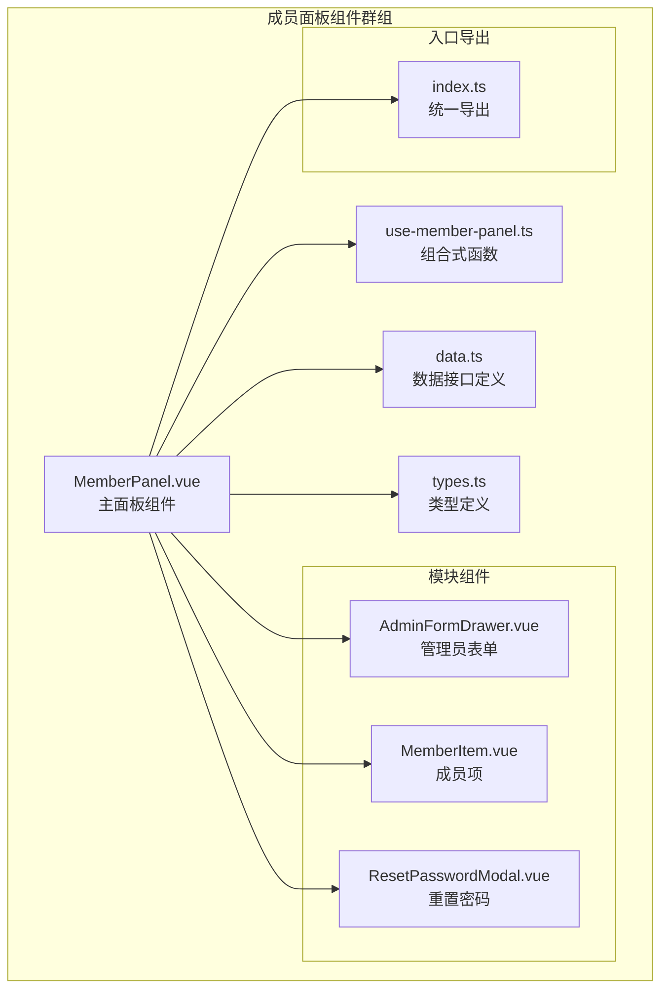
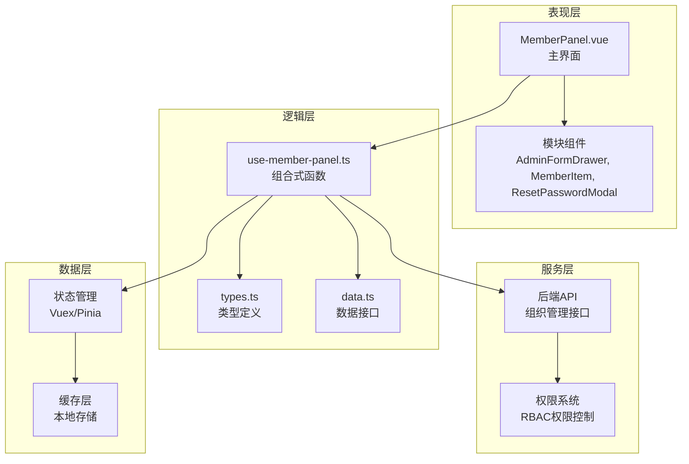
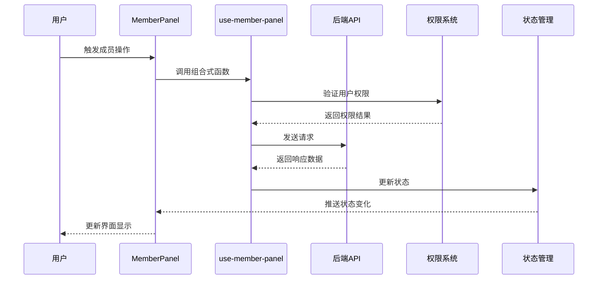
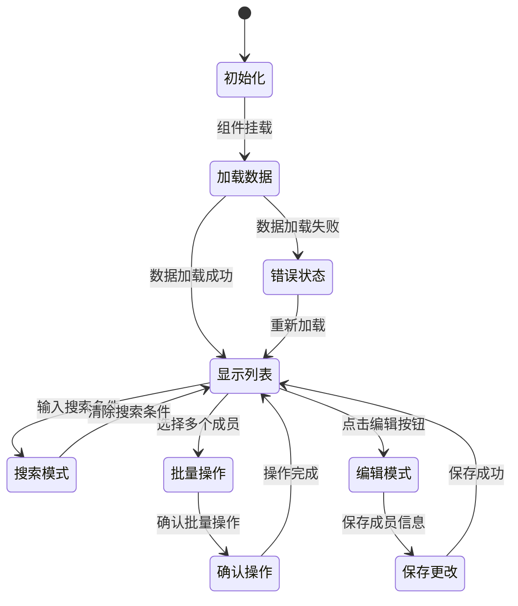
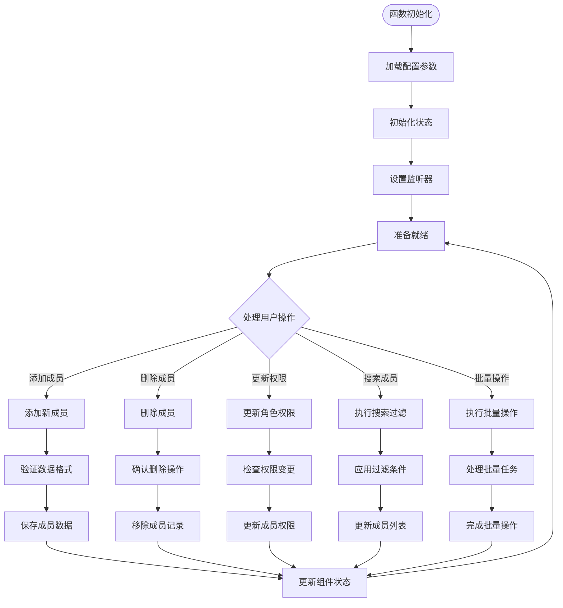
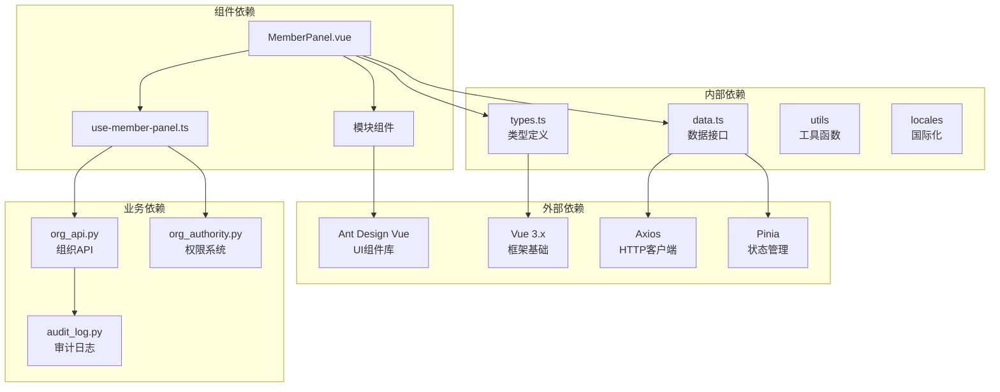

# 成员面板组件

<cite>
**本文档引用的文件**
- [index.ts](file://frontend/apps/web-antd/src/components/business/member-panel/index.ts)
- [MemberPanel.vue](file://frontend/apps/web-antd/src/components/business/member-panel/MemberPanel.vue)
- [use-member-panel.ts](file://frontend/apps/web-antd/src/components/business/member-panel/use-member-panel.ts)
- [types.ts](file://frontend/apps/web-antd/src/components/business/member-panel/types.ts)
- [data.ts](file://frontend/apps/web-antd/src/components/business/member-panel/data.ts)
- [AdminFormDrawer.vue](file://frontend/apps/web-antd/src/components/business/member-panel/modules/AdminFormDrawer.vue)
- [MemberItem.vue](file://frontend/apps/web-antd/src/components/business/member-panel/modules/MemberItem.vue)
- [ResetPasswordModal.vue](file://frontend/apps/web-antd/src/components/business/member-panel/modules/ResetPasswordModal.vue)
- [organization.spec.ts](file://frontend/apps/web-antd/src/__tests__/e2e/organization.spec.ts)
- [org_authority.py](file://backend/app/core/org_authority.py)
- [org_models.py](file://backend/app/models/org/org_models.py)
- [org_schemas.py](file://backend/app/schemas/org/org_schemas.py)
- [org_services.py](file://backend/app/services/org/org_services.py)
- [org_api.py](file://backend/app/api/tenant/org_api.py)
- [operation_log_api.py](file://backend/app/api/admin/operation_log_api.py)
- [audit_log.py](file://backend/app/middleware/audit_log.py)
</cite>

## 目录
1. [简介](#简介)
2. [项目结构](#项目结构)
3. [核心组件](#核心组件)
4. [架构概览](#架构概览)
5. [详细组件分析](#详细组件分析)
6. [依赖关系分析](#依赖关系分析)
7. [性能考虑](#性能考虑)
8. [故障排除指南](#故障排除指南)
9. [结论](#结论)

## 简介

成员面板组件群组是 NovusAI SaaS 平台中的核心成员管理模块，负责组织架构可视化、成员列表展示、权限分配管理和角色变更等关键功能。该组件群组采用现代化的前端架构设计，结合后端 RBAC 权限系统，提供了完整的成员管理解决方案。

该组件群组主要包含以下核心组件：
- **MemberPanel**: 主要的成员管理面板组件
- **OrgTree**: 组织树形结构展示组件  
- **AdminFormDrawer**: 管理员表单抽屉组件
- **MemberItem**: 单个成员项显示组件
- **ResetPasswordModal**: 重置密码模态框组件

## 项目结构

成员面板组件群组位于前端应用的业务组件目录下，采用模块化组织方式：

**图表来源**
- [index.ts:1-19](file://frontend/apps/web-antd/src/components/business/member-panel/index.ts#L1-L19)
- [MemberPanel.vue](file://frontend/apps/web-antd/src/components/business/member-panel/MemberPanel.vue)
- [use-member-panel.ts](file://frontend/apps/web-antd/src/components/business/member-panel/use-member-panel.ts)
- [data.ts](file://frontend/apps/web-antd/src/components/business/member-panel/data.ts)
- [types.ts](file://frontend/apps/web-antd/src/components/business/member-panel/types.ts)

**章节来源**
- [index.ts:1-19](file://frontend/apps/web-antd/src/components/business/member-panel/index.ts#L1-L19)

## 核心组件

### MemberPanel 主面板组件

MemberPanel 是成员面板的核心组件，负责协调整个成员管理界面的展示和交互。该组件实现了以下关键功能：

- **组织架构可视化**: 通过树形结构展示组织层级关系
- **成员列表管理**: 提供成员的增删改查操作界面
- **权限控制**: 基于 RBAC 权限系统进行功能访问控制
- **实时更新**: 支持成员状态的实时同步和更新

### use-member-panel 组合式函数

use-member-panel 提供了成员面板的核心逻辑处理能力：

- **状态管理**: 管理成员数据的状态和生命周期
- **数据绑定**: 处理前后端数据的双向绑定
- **事件处理**: 处理用户交互事件和业务逻辑
- **错误处理**: 实现健壮的错误处理和恢复机制

### 模块化组件体系

组件群组采用模块化设计，每个子组件都有明确的职责分工：

- **AdminFormDrawer**: 管理员权限配置和角色分配
- **MemberItem**: 单个成员信息的展示和编辑
- **ResetPasswordModal**: 成员密码重置功能
- **数据接口层**: 封装 API 调用和数据转换逻辑

**章节来源**
- [MemberPanel.vue](file://frontend/apps/web-antd/src/components/business/member-panel/MemberPanel.vue)
- [use-member-panel.ts](file://frontend/apps/web-antd/src/components/business/member-panel/use-member-panel.ts)
- [AdminFormDrawer.vue](file://frontend/apps/web-antd/src/components/business/member-panel/modules/AdminFormDrawer.vue)
- [MemberItem.vue](file://frontend/apps/web-antd/src/components/business/member-panel/modules/MemberItem.vue)
- [ResetPasswordModal.vue](file://frontend/apps/web-antd/src/components/business/member-panel/modules/ResetPasswordModal.vue)

## 架构概览

成员面板组件群组采用了分层架构设计，确保了良好的可维护性和扩展性：

**图表来源**
- [MemberPanel.vue](file://frontend/apps/web-antd/src/components/business/member-panel/MemberPanel.vue)
- [use-member-panel.ts](file://frontend/apps/web-antd/src/components/business/member-panel/use-member-panel.ts)
- [data.ts](file://frontend/apps/web-antd/src/components/business/member-panel/data.ts)
- [types.ts](file://frontend/apps/web-antd/src/components/business/member-panel/types.ts)

### 数据流架构

成员面板的数据流遵循单向数据流原则，确保了数据的一致性和可预测性：

**图表来源**
- [use-member-panel.ts](file://frontend/apps/web-antd/src/components/business/member-panel/use-member-panel.ts)
- [org_authority.py](file://backend/app/core/org_authority.py)

## 详细组件分析

### MemberPanel 主面板组件

MemberPanel 作为核心组件，实现了完整的成员管理功能：

#### 核心功能特性

- **组织树展示**: 使用树形控件展示组织层级结构
- **成员列表**: 提供表格形式的成员信息展示
- **搜索过滤**: 支持按姓名、邮箱等条件搜索成员
- **批量操作**: 支持批量删除、批量权限分配等操作
- **实时更新**: 通过 WebSocket 或轮询机制实现实时状态同步

#### 状态管理机制

**图表来源**
- [MemberPanel.vue](file://frontend/apps/web-antd/src/components/business/member-panel/MemberPanel.vue)

#### 数据绑定策略

MemberPanel 采用响应式数据绑定机制：

- **双向绑定**: 成员信息的输入框支持双向数据绑定
- **状态同步**: 通过 Vuex/Pinia 确保多组件间的状态一致性
- **实时更新**: 使用 watch 机制监听数据变化并触发 UI 更新

**章节来源**
- [MemberPanel.vue](file://frontend/apps/web-antd/src/components/business/member-panel/MemberPanel.vue)

### use-member-panel 组合式函数

use-member-panel 提供了成员面板的核心业务逻辑：

#### 核心业务流程

**图表来源**
- [use-member-panel.ts](file://frontend/apps/web-antd/src/components/business/member-panel/use-member-panel.ts)

#### 权限验证机制

use-member-panel 内置了完善的权限验证机制：

- **操作权限检查**: 在执行敏感操作前验证用户权限
- **数据访问控制**: 控制对成员数据的访问范围
- **动态权限更新**: 根据用户角色变化动态调整可用功能

**章节来源**
- [use-member-panel.ts](file://frontend/apps/web-antd/src/components/business/member-panel/use-member-panel.ts)

### 模块组件详解

#### AdminFormDrawer 管理员表单抽屉

AdminFormDrawer 专门处理管理员级别的成员管理操作：

- **角色分配**: 支持为成员分配不同的角色和权限
- **权限配置**: 提供细粒度的权限控制界面
- **批量权限管理**: 支持批量设置成员的权限组合

#### MemberItem 成员项组件

MemberItem 负责单个成员信息的展示和基本编辑：

- **信息展示**: 显示成员的基本信息和当前状态
- **快速编辑**: 提供快捷的字段编辑功能
- **状态指示**: 通过图标和颜色表示成员的不同状态

#### ResetPasswordModal 重置密码模态框

ResetPasswordModal 提供安全的密码重置功能：

- **安全验证**: 实施多重身份验证机制
- **密码强度检查**: 确保新密码符合安全要求
- **操作审计**: 记录所有密码重置操作

**章节来源**
- [AdminFormDrawer.vue](file://frontend/apps/web-antd/src/components/business/member-panel/modules/AdminFormDrawer.vue)
- [MemberItem.vue](file://frontend/apps/web-antd/src/components/business/member-panel/modules/MemberItem.vue)
- [ResetPasswordModal.vue](file://frontend/apps/web-antd/src/components/business/member-panel/modules/ResetPasswordModal.vue)

## 依赖关系分析

成员面板组件群组的依赖关系体现了清晰的分层架构：

**图表来源**
- [index.ts:1-19](file://frontend/apps/web-antd/src/components/business/member-panel/index.ts#L1-L19)
- [MemberPanel.vue](file://frontend/apps/web-antd/src/components/business/member-panel/MemberPanel.vue)
- [use-member-panel.ts](file://frontend/apps/web-antd/src/components/business/member-panel/use-member-panel.ts)

### 组件耦合度分析

成员面板组件群组在设计上注重降低组件间的耦合度：

- **松耦合设计**: 各组件通过明确定义的接口进行通信
- **单一职责**: 每个组件专注于特定的功能领域
- **可替换性**: 组件接口标准化，便于后续替换和扩展

### 外部依赖管理

组件群组对外部依赖的管理体现了良好的工程实践：

- **版本锁定**: 关键依赖版本固定，确保构建稳定性
- **安全更新**: 定期审查和更新依赖包
- **性能优化**: 选择轻量级且高性能的依赖库

**章节来源**
- [index.ts:1-19](file://frontend/apps/web-antd/src/components/business/member-panel/index.ts#L1-L19)
- [data.ts](file://frontend/apps/web-antd/src/components/business/member-panel/data.ts)

## 性能考虑

成员面板组件群组在性能方面采用了多项优化策略：

### 渲染性能优化

- **虚拟滚动**: 对于大量成员数据采用虚拟滚动技术
- **懒加载**: 组件按需加载，减少初始渲染时间
- **防抖处理**: 搜索和过滤操作使用防抖机制

### 数据传输优化

- **分页加载**: 大规模成员列表采用分页加载策略
- **增量更新**: 只更新发生变化的数据部分
- **缓存策略**: 合理使用浏览器缓存和服务器缓存

### 内存管理

- **组件销毁**: 正确清理事件监听器和定时器
- **状态清理**: 及时释放不再使用的状态数据
- **垃圾回收**: 避免内存泄漏的代码模式

## 故障排除指南

### 常见问题及解决方案

#### 权限相关问题

**问题**: 用户无法看到某些成员或执行特定操作
**原因**: 权限配置不正确或会话过期
**解决方法**: 
1. 检查用户的实际角色和权限
2. 刷新页面重新获取权限信息
3. 确认组织架构中的权限继承关系

#### 数据同步问题

**问题**: 成员状态更新后界面没有反映最新变化
**原因**: WebSocket 连接异常或状态管理问题
**解决方法**:
1. 检查网络连接和 WebSocket 服务状态
2. 刷新页面强制重新同步数据
3. 清除浏览器缓存后重试

#### 性能问题

**问题**: 页面加载缓慢或操作响应迟缓
**原因**: 成员数据过多或组件渲染开销大
**解决方法**:
1. 实施分页加载替代全量加载
2. 优化搜索算法和过滤逻辑
3. 减少不必要的组件重渲染

### 调试技巧

- **开发者工具**: 使用浏览器开发者工具监控网络请求
- **日志记录**: 在关键位置添加详细的日志输出
- **状态检查**: 定期检查组件状态和数据流

**章节来源**
- [org_authority.py](file://backend/app/core/org_authority.py)
- [audit_log.py](file://backend/app/middleware/audit_log.py)

## 结论

成员面板组件群组是一个设计精良、功能完备的成员管理解决方案。通过采用现代化的前端架构和完善的后端权限控制系统，该组件群组能够满足复杂的企业级成员管理需求。

### 主要优势

- **架构清晰**: 分层设计使得代码易于理解和维护
- **功能完整**: 覆盖了成员管理的所有核心功能
- **性能优秀**: 通过多种优化策略确保良好的用户体验
- **安全可靠**: 内置完善的权限验证和审计机制

### 技术亮点

- **响应式设计**: 适配不同屏幕尺寸和设备类型
- **实时同步**: 支持多用户环境下的数据实时更新
- **可扩展性**: 模块化设计便于功能扩展和定制
- **国际化支持**: 内置多语言支持机制

该组件群组为 NovusAI SaaS 平台提供了坚实的基础，能够有效支撑企业级的成员管理和组织架构管理需求。