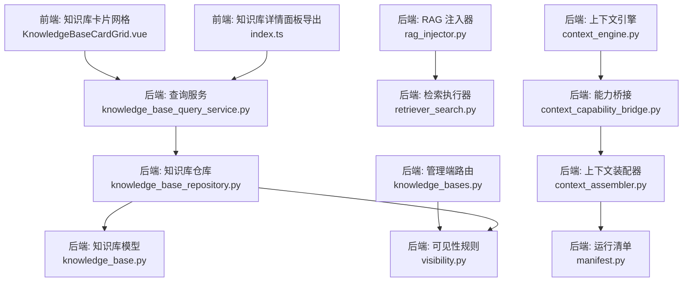
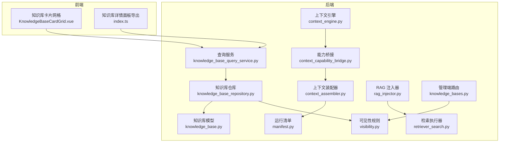
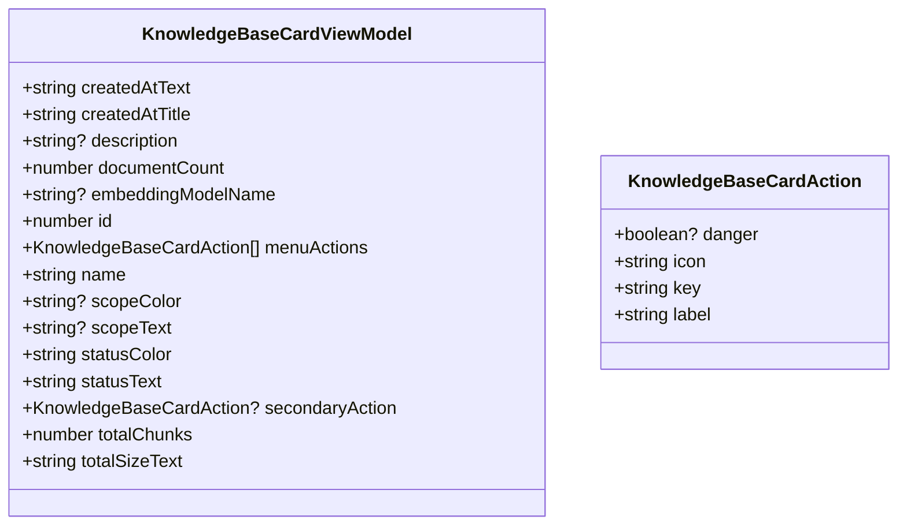
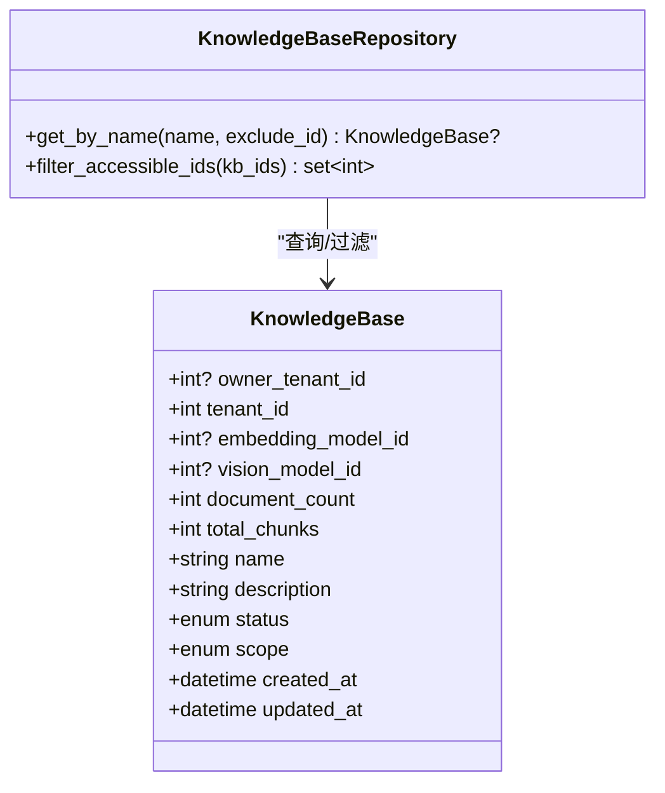
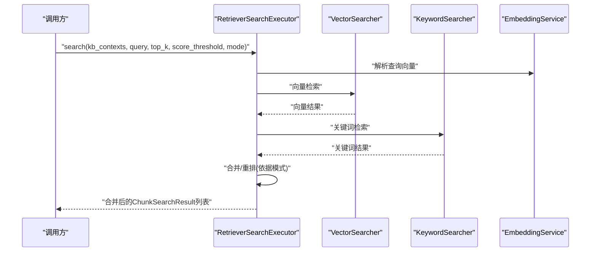
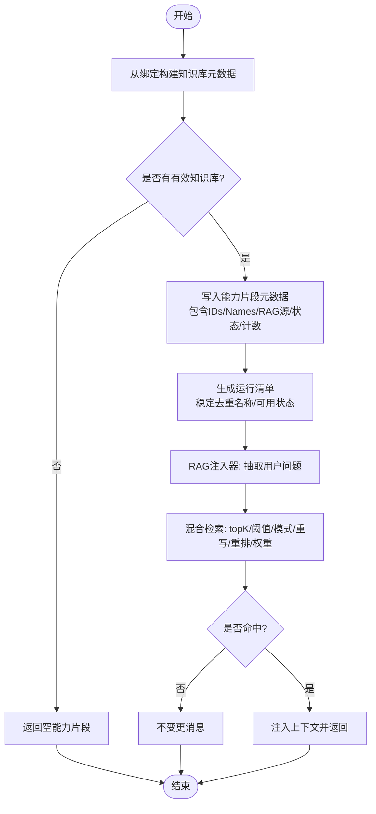
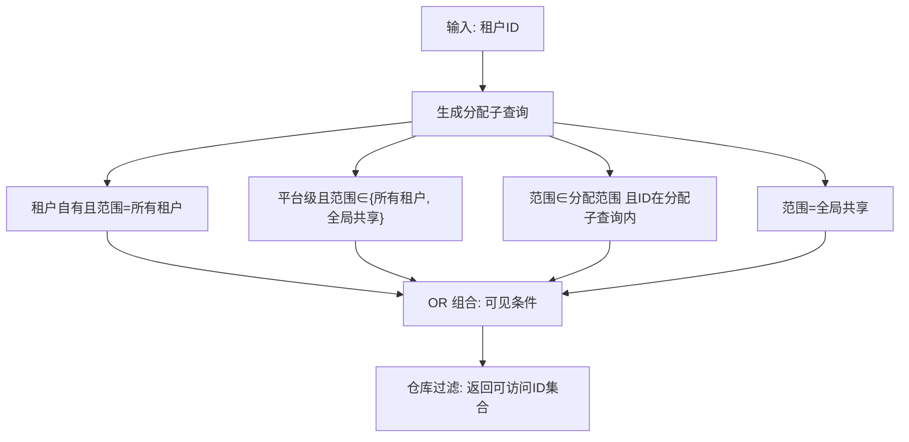
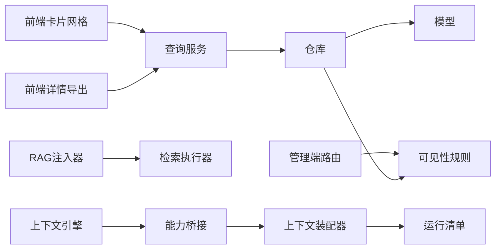

# 知识库组件

<cite>
**本文引用的文件**
- [KnowledgeBaseCardGrid.vue](file://frontend/apps/web-antd/src/components/business/knowledge-base-card-grid/KnowledgeBaseCardGrid.vue)
- [index.ts](file://frontend/apps/web-antd/src/components/business/knowledge-base-detail/index.ts)
- [knowledge_base_query_service.py](file://backend/app/services/ai/knowledge_base_query_service.py)
- [knowledge_base.py](file://backend/app/models/ai/knowledge_base.py)
- [retriever_search.py](file://backend/app/ai/rag/retriever_search.py)
- [context_engine.py](file://backend/app/ai/context/engine.py)
- [context_capability_bridge.py](file://backend/app/ai/runtime/context_capability_bridge.py)
- [context_assembler.py](file://backend/app/ai/runtime/context_assembler.py)
- [manifest.py](file://backend/app/ai/runtime/manifest.py)
- [rag_injector.py](file://backend/app/ai/rag_injector.py)
- [knowledge_bases.py](file://backend/app/api/admin/knowledge_bases.py)
- [visibility.py](file://backend/app/services/system/dashboard_service_parts/visibility.py)
- [knowledge_base_repository.py](file://backend/app/repositories/ai/knowledge_base_repository.py)
</cite>

## 目录
1. [简介](#简介)
2. [项目结构](#项目结构)
3. [核心组件](#核心组件)
4. [架构总览](#架构总览)
5. [组件详解](#组件详解)
6. [依赖关系分析](#依赖关系分析)
7. [性能考量](#性能考量)
8. [故障排查指南](#故障排查指南)
9. [结论](#结论)
10. [附录](#附录)

## 简介
本技术文档聚焦于知识库组件群组，系统性阐述知识库详情面板、知识库卡片网格等前端组件的设计与实现；同时覆盖后端知识库数据模型、查询服务、检索执行器、上下文构建与RAG集成流程；并给出数据流处理、搜索算法与结果展示逻辑、性能优化、缓存策略、分页加载机制以及权限控制、安全过滤与访问审计的实践建议。

## 项目结构
知识库相关能力在前后端分别由以下模块支撑：
- 前端：知识库卡片网格组件、知识库详情面板导出入口
- 后端：知识库模型与仓库、查询服务、检索执行器、上下文装配与注入、RAG集成、权限可见性规则

图表来源
- [KnowledgeBaseCardGrid.vue:1-61](file://frontend/apps/web-antd/src/components/business/knowledge-base-card-grid/KnowledgeBaseCardGrid.vue#L1-L61)
- [index.ts:1-5](file://frontend/apps/web-antd/src/components/business/knowledge-base-detail/index.ts#L1-L5)
- [knowledge_base.py:1-88](file://backend/app/models/ai/knowledge_base.py#L1-L88)
- [knowledge_base_repository.py:134-168](file://backend/app/repositories/ai/knowledge_base_repository.py#L134-L168)
- [knowledge_base_query_service.py:1-27](file://backend/app/services/ai/knowledge_base_query_service.py#L1-L27)
- [retriever_search.py:1-44](file://backend/app/ai/rag/retriever_search.py#L1-L44)
- [context_engine.py:213-246](file://backend/app/ai/context/engine.py#L213-L246)
- [context_capability_bridge.py:93-130](file://backend/app/ai/runtime/context_capability_bridge.py#L93-L130)
- [context_assembler.py:452-483](file://backend/app/ai/runtime/context_assembler.py#L452-L483)
- [manifest.py:280-309](file://backend/app/ai/runtime/manifest.py#L280-L309)
- [rag_injector.py:200-232](file://backend/app/ai/rag_injector.py#L200-L232)
- [knowledge_bases.py:65-280](file://backend/app/api/admin/knowledge_bases.py#L65-L280)
- [visibility.py:42-67](file://backend/app/services/system/dashboard_service_parts/visibility.py#L42-L67)

章节来源
- [KnowledgeBaseCardGrid.vue:1-61](file://frontend/apps/web-antd/src/components/business/knowledge-base-card-grid/KnowledgeBaseCardGrid.vue#L1-L61)
- [index.ts:1-5](file://frontend/apps/web-antd/src/components/business/knowledge-base-detail/index.ts#L1-L5)
- [knowledge_base.py:1-88](file://backend/app/models/ai/knowledge_base.py#L1-L88)
- [knowledge_base_repository.py:134-168](file://backend/app/repositories/ai/knowledge_base_repository.py#L134-L168)
- [knowledge_base_query_service.py:1-27](file://backend/app/services/ai/knowledge_base_query_service.py#L1-L27)
- [retriever_search.py:1-44](file://backend/app/ai/rag/retriever_search.py#L1-L44)
- [context_engine.py:213-246](file://backend/app/ai/context/engine.py#L213-L246)
- [context_capability_bridge.py:93-130](file://backend/app/ai/runtime/context_capability_bridge.py#L93-L130)
- [context_assembler.py:452-483](file://backend/app/ai/runtime/context_assembler.py#L452-L483)
- [manifest.py:280-309](file://backend/app/ai/runtime/manifest.py#L280-L309)
- [rag_injector.py:200-232](file://backend/app/ai/rag_injector.py#L200-L232)
- [knowledge_bases.py:65-280](file://backend/app/api/admin/knowledge_bases.py#L65-L280)
- [visibility.py:42-67](file://backend/app/services/system/dashboard_service_parts/visibility.py#L42-L67)

## 核心组件
- 前端知识库卡片网格组件：负责渲染知识库卡片列表、状态与统计信息、分页与空态展示，并支持操作菜单与二次动作按钮。
- 前端知识库详情面板导出：集中导出详情面板子组件与类型，便于业务页面按需引入。
- 后端知识库模型与仓库：定义知识库实体、过滤与排序键、删除依赖；提供名称唯一性校验、可访问ID过滤等能力。
- 后端查询服务：封装只读查询逻辑，如知识库详情构建。
- 后端检索执行器：统一向量与关键词检索，支持混合模式、阈值与合并策略。
- 后端上下文装配链路：从绑定到能力片段，再到运行清单，贯穿RAG检索状态与命中计数。
- 后端RAG注入器：抽取用户最新问题，调用混合检索器，按配置进行重写、重排与权重融合。
- 后端权限可见性：基于资源范围与租户分配，生成可见条件，保障跨租户访问边界。

章节来源
- [KnowledgeBaseCardGrid.vue:1-61](file://frontend/apps/web-antd/src/components/business/knowledge-base-card-grid/KnowledgeBaseCardGrid.vue#L1-L61)
- [index.ts:1-5](file://frontend/apps/web-antd/src/components/business/knowledge-base-detail/index.ts#L1-L5)
- [knowledge_base.py:1-88](file://backend/app/models/ai/knowledge_base.py#L1-L88)
- [knowledge_base_repository.py:134-168](file://backend/app/repositories/ai/knowledge_base_repository.py#L134-L168)
- [knowledge_base_query_service.py:1-27](file://backend/app/services/ai/knowledge_base_query_service.py#L1-L27)
- [retriever_search.py:1-44](file://backend/app/ai/rag/retriever_search.py#L1-L44)
- [context_engine.py:213-246](file://backend/app/ai/context/engine.py#L213-L246)
- [context_capability_bridge.py:93-130](file://backend/app/ai/runtime/context_capability_bridge.py#L93-L130)
- [context_assembler.py:452-483](file://backend/app/ai/runtime/context_assembler.py#L452-L483)
- [manifest.py:280-309](file://backend/app/ai/runtime/manifest.py#L280-L309)
- [rag_injector.py:200-232](file://backend/app/ai/rag_injector.py#L200-L232)
- [visibility.py:42-67](file://backend/app/services/system/dashboard_service_parts/visibility.py#L42-L67)

## 架构总览
整体架构围绕“前端组件 + 后端服务”的协作展开：前端负责UI与交互，后端提供数据模型、查询、检索与上下文装配，最终在运行时注入到对话或技能执行中。

图表来源
- [KnowledgeBaseCardGrid.vue:1-61](file://frontend/apps/web-antd/src/components/business/knowledge-base-card-grid/KnowledgeBaseCardGrid.vue#L1-L61)
- [index.ts:1-5](file://frontend/apps/web-antd/src/components/business/knowledge-base-detail/index.ts#L1-L5)
- [knowledge_base.py:1-88](file://backend/app/models/ai/knowledge_base.py#L1-L88)
- [knowledge_base_repository.py:134-168](file://backend/app/repositories/ai/knowledge_base_repository.py#L134-L168)
- [knowledge_base_query_service.py:1-27](file://backend/app/services/ai/knowledge_base_query_service.py#L1-L27)
- [retriever_search.py:1-44](file://backend/app/ai/rag/retriever_search.py#L1-L44)
- [context_engine.py:213-246](file://backend/app/ai/context/engine.py#L213-L246)
- [context_capability_bridge.py:93-130](file://backend/app/ai/runtime/context_capability_bridge.py#L93-L130)
- [context_assembler.py:452-483](file://backend/app/ai/runtime/context_assembler.py#L452-L483)
- [manifest.py:280-309](file://backend/app/ai/runtime/manifest.py#L280-L309)
- [rag_injector.py:200-232](file://backend/app/ai/rag_injector.py#L200-L232)
- [knowledge_bases.py:65-280](file://backend/app/api/admin/knowledge_bases.py#L65-L280)
- [visibility.py:42-67](file://backend/app/services/system/dashboard_service_parts/visibility.py#L42-L67)

## 组件详解

### 知识库卡片网格组件
- 角色与职责
  - 渲染知识库卡片列表，展示名称、描述、文档数量、分块总数、大小、状态与投放范围标签。
  - 支持分页、加载态、空态提示与创建按钮。
  - 提供二级操作动作与菜单动作，用于跳转详情、编辑、删除等。
- 数据模型
  - 卡片视图模型包含创建时间文本/标题、描述、文档数、嵌入模型名、ID、菜单动作、名称、范围颜色/文本、状态颜色/文本、二级动作、分块总数、总大小文本等字段。
- 交互与展示
  - 可配置是否可点击进入详情、创建按钮文案、回收站统计与标题、统计项标题等。
  - 分页参数与总数用于驱动分页控件更新。

图表来源
- [KnowledgeBaseCardGrid.vue:17-40](file://frontend/apps/web-antd/src/components/business/knowledge-base-card-grid/KnowledgeBaseCardGrid.vue#L17-L40)

章节来源
- [KnowledgeBaseCardGrid.vue:1-61](file://frontend/apps/web-antd/src/components/business/knowledge-base-card-grid/KnowledgeBaseCardGrid.vue#L1-L61)

### 知识库详情面板导出
- 导出内容
  - 包含分块预览模态、文档区、文档工具栏、搜索区等子组件与文档行类型，便于上层页面按需组合使用。
- 设计意图
  - 通过集中导出降低页面耦合度，提升复用性与维护性。

章节来源
- [index.ts:1-5](file://frontend/apps/web-antd/src/components/business/knowledge-base-detail/index.ts#L1-L5)

### 知识库模型与仓库
- 模型要点
  - 定义知识库基础信息、状态、投放范围、嵌入/视觉模型ID、文档计数、分块计数等字段。
  - 删除依赖包括代理绑定与知识文档软删除，确保级联一致性。
  - 可过滤与可排序键覆盖ID、名称、状态、范围、创建时间等。
- 仓库能力
  - 名称唯一性校验（同归属企业下排除自身）。
  - 批量过滤当前企业仍可访问的知识库ID，结合可见性规则返回集合。

图表来源
- [knowledge_base.py:33-88](file://backend/app/models/ai/knowledge_base.py#L33-L88)
- [knowledge_base_repository.py:134-168](file://backend/app/repositories/ai/knowledge_base_repository.py#L134-L168)

章节来源
- [knowledge_base.py:1-88](file://backend/app/models/ai/knowledge_base.py#L1-L88)
- [knowledge_base_repository.py:134-168](file://backend/app/repositories/ai/knowledge_base_repository.py#L134-L168)

### 查询服务与详情构建
- 查询服务职责
  - 提供只读查询能力，如获取知识库详情并构建详情结构。
- 错误处理
  - 未找到时抛出“未找到”异常，保证调用方明确失败原因。

章节来源
- [knowledge_base_query_service.py:1-27](file://backend/app/services/ai/knowledge_base_query_service.py#L1-L27)

### 检索执行器与搜索算法
- 统一检索入口
  - 接收知识库上下文、查询语句、topK、分数阈值与检索模式，协调向量与关键词检索器。
- 搜索模式
  - 支持混合模式，内部根据模式选择不同策略与合并策略（如加权重排）。
- 异常与可用性
  - 对不可用错误进行识别与处理，避免影响主流程。

图表来源
- [retriever_search.py:23-44](file://backend/app/ai/rag/retriever_search.py#L23-L44)

章节来源
- [retriever_search.py:1-44](file://backend/app/ai/rag/retriever_search.py#L1-L44)

### 上下文构建与RAG集成
- 上下文装配链路
  - 从绑定信息提取有效知识库ID，构造知识库元数据列表；当无绑定且无请求ID时返回空片段。
  - 将知识库IDs、名称、请求/丢弃ID、RAG源计数与种类、检索尝试状态、命中计数等写入能力片段元数据。
- 运行清单
  - 从状态中稳定去重知识库名称，若为空则回退到RAG源中的名称字段；根据是否存在有效ID决定可用状态与原因。
- RAG注入器
  - 从消息历史中抽取用户最新问题作为检索输入；调用混合检索器，按Agent.rag_config统一传入topK、阈值、模式、重写策略、重排开关、权重等；若命中则注入上下文，否则不变更消息。

图表来源
- [context_assembler.py:452-483](file://backend/app/ai/runtime/context_assembler.py#L452-L483)
- [manifest.py:280-309](file://backend/app/ai/runtime/manifest.py#L280-L309)
- [rag_injector.py:200-232](file://backend/app/ai/rag_injector.py#L200-L232)

章节来源
- [context_engine.py:213-246](file://backend/app/ai/context/engine.py#L213-L246)
- [context_capability_bridge.py:93-130](file://backend/app/ai/runtime/context_capability_bridge.py#L93-L130)
- [context_assembler.py:452-483](file://backend/app/ai/runtime/context_assembler.py#L452-L483)
- [manifest.py:280-309](file://backend/app/ai/runtime/manifest.py#L280-L309)
- [rag_injector.py:200-232](file://backend/app/ai/rag_injector.py#L200-L232)

### 权限控制、安全过滤与访问审计
- 可见性规则
  - 基于资源范围与租户分配，生成可见条件：包含租户自有且范围为“所有租户”的知识库、平台级且范围为“所有租户/全局共享”的知识库、分配给当前租户的知识库、以及“全局共享”范围的知识库。
- 管理端路由
  - 管理端知识库监控菜单定义了创建、管理文档、搜索、查看等能力；并限制可见范围为管理员可消费的范围集合。
- 仓库过滤
  - 仓库提供批量过滤当前租户仍可访问的知识库ID，确保后续查询与操作在授权范围内进行。

图表来源
- [visibility.py:42-67](file://backend/app/services/system/dashboard_service_parts/visibility.py#L42-L67)
- [knowledge_base_repository.py:156-168](file://backend/app/repositories/ai/knowledge_base_repository.py#L156-L168)
- [knowledge_bases.py:65-280](file://backend/app/api/admin/knowledge_bases.py#L65-L280)

章节来源
- [visibility.py:42-67](file://backend/app/services/system/dashboard_service_parts/visibility.py#L42-L67)
- [knowledge_base_repository.py:156-168](file://backend/app/repositories/ai/knowledge_base_repository.py#L156-L168)
- [knowledge_bases.py:65-280](file://backend/app/api/admin/knowledge_bases.py#L65-L280)

## 依赖关系分析
- 前端组件依赖后端查询服务以获取知识库详情与统计；卡片网格通过分页参数与总数驱动UI更新。
- 后端检索执行器与RAG注入器共同完成从查询到上下文注入的闭环；上下文装配器与运行清单负责状态聚合与对外暴露。
- 权限可见性规则贯穿仓库与管理端路由，确保跨租户访问边界可控。

图表来源
- [KnowledgeBaseCardGrid.vue:1-61](file://frontend/apps/web-antd/src/components/business/knowledge-base-card-grid/KnowledgeBaseCardGrid.vue#L1-L61)
- [index.ts:1-5](file://frontend/apps/web-antd/src/components/business/knowledge-base-detail/index.ts#L1-L5)
- [knowledge_base_query_service.py:1-27](file://backend/app/services/ai/knowledge_base_query_service.py#L1-L27)
- [knowledge_base_repository.py:134-168](file://backend/app/repositories/ai/knowledge_base_repository.py#L134-L168)
- [knowledge_base.py:1-88](file://backend/app/models/ai/knowledge_base.py#L1-L88)
- [rag_injector.py:200-232](file://backend/app/ai/rag_injector.py#L200-L232)
- [retriever_search.py:1-44](file://backend/app/ai/rag/retriever_search.py#L1-L44)
- [context_engine.py:213-246](file://backend/app/ai/context/engine.py#L213-L246)
- [context_capability_bridge.py:93-130](file://backend/app/ai/runtime/context_capability_bridge.py#L93-L130)
- [context_assembler.py:452-483](file://backend/app/ai/runtime/context_assembler.py#L452-L483)
- [manifest.py:280-309](file://backend/app/ai/runtime/manifest.py#L280-L309)
- [knowledge_bases.py:65-280](file://backend/app/api/admin/knowledge_bases.py#L65-L280)
- [visibility.py:42-67](file://backend/app/services/system/dashboard_service_parts/visibility.py#L42-L67)

章节来源
- [knowledge_base_query_service.py:1-27](file://backend/app/services/ai/knowledge_base_query_service.py#L1-L27)
- [knowledge_base_repository.py:134-168](file://backend/app/repositories/ai/knowledge_base_repository.py#L134-L168)
- [retriever_search.py:1-44](file://backend/app/ai/rag/retriever_search.py#L1-L44)
- [context_engine.py:213-246](file://backend/app/ai/context/engine.py#L213-L246)
- [context_capability_bridge.py:93-130](file://backend/app/ai/runtime/context_capability_bridge.py#L93-L130)
- [context_assembler.py:452-483](file://backend/app/ai/runtime/context_assembler.py#L452-L483)
- [manifest.py:280-309](file://backend/app/ai/runtime/manifest.py#L280-L309)
- [rag_injector.py:200-232](file://backend/app/ai/rag_injector.py#L200-L232)
- [knowledge_bases.py:65-280](file://backend/app/api/admin/knowledge_bases.py#L65-L280)
- [visibility.py:42-67](file://backend/app/services/system/dashboard_service_parts/visibility.py#L42-L67)

## 性能考量
- 检索性能
  - 使用统一检索参数（topK、阈值、模式）减少重复计算；在混合模式下优先利用向量检索快速收敛，再用关键词检索补充召回。
  - 合并策略采用加权重排，平衡相关性与多样性。
- 缓存策略
  - 对查询向量解析与嵌入结果进行短期缓存，避免重复计算；对热点知识库的统计信息进行缓存，降低数据库压力。
- 分页加载
  - 前端卡片网格支持分页参数与总数，后端仓库提供可访问ID过滤，结合分页查询减少单次传输数据量。
- 上下文注入
  - 仅在命中时注入上下文，避免无意义的消息扩展；对RAG源计数与命中计数进行统计，便于性能评估与优化。

## 故障排查指南
- 未找到知识库
  - 当查询服务无法定位目标知识库时会抛出“未找到”异常，检查ID有效性与归属企业范围。
- 权限不足
  - 若仓库过滤返回空集，确认当前租户是否被分配到目标知识库，或其范围是否允许访问。
- 检索无命中
  - 检查阈值设置与模式配置；适当提高阈值或切换为关键词检索模式以增强召回。
- 上下文未注入
  - 确认RAG注入器抽取到的用户问题非空；检查Agent.rag_config参数是否正确传递至检索器。

章节来源
- [knowledge_base_query_service.py:20-24](file://backend/app/services/ai/knowledge_base_query_service.py#L20-L24)
- [knowledge_base_repository.py:156-168](file://backend/app/repositories/ai/knowledge_base_repository.py#L156-L168)
- [rag_injector.py:200-232](file://backend/app/ai/rag_injector.py#L200-L232)

## 结论
知识库组件群组通过清晰的前后端分工与严谨的后端服务编排，实现了从UI展示到数据查询、从检索到上下文注入的完整闭环。配合完善的权限可见性规则与可扩展的检索策略，既能满足多租户场景下的访问控制需求，也能在性能与体验之间取得良好平衡。建议在生产环境中进一步完善缓存与分页策略，并持续优化检索阈值与合并策略以提升命中质量。

## 附录
- 关键流程路径参考
  - 知识库卡片网格渲染与分页：[KnowledgeBaseCardGrid.vue:1-61](file://frontend/apps/web-antd/src/components/business/knowledge-base-card-grid/KnowledgeBaseCardGrid.vue#L1-L61)
  - 知识库详情构建：[knowledge_base_query_service.py:20-24](file://backend/app/services/ai/knowledge_base_query_service.py#L20-L24)
  - 检索执行器调用：[retriever_search.py:36-44](file://backend/app/ai/rag/retriever_search.py#L36-L44)
  - 上下文装配与运行清单：[context_assembler.py:452-483](file://backend/app/ai/runtime/context_assembler.py#L452-L483)、[manifest.py:280-309](file://backend/app/ai/runtime/manifest.py#L280-L309)
  - RAG注入器工作流：[rag_injector.py:200-232](file://backend/app/ai/rag_injector.py#L200-L232)
  - 权限可见性规则：[visibility.py:42-67](file://backend/app/services/system/dashboard_service_parts/visibility.py#L42-L67)