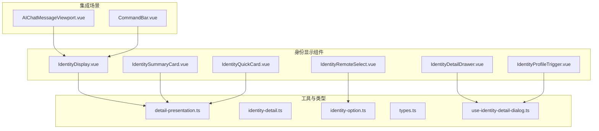
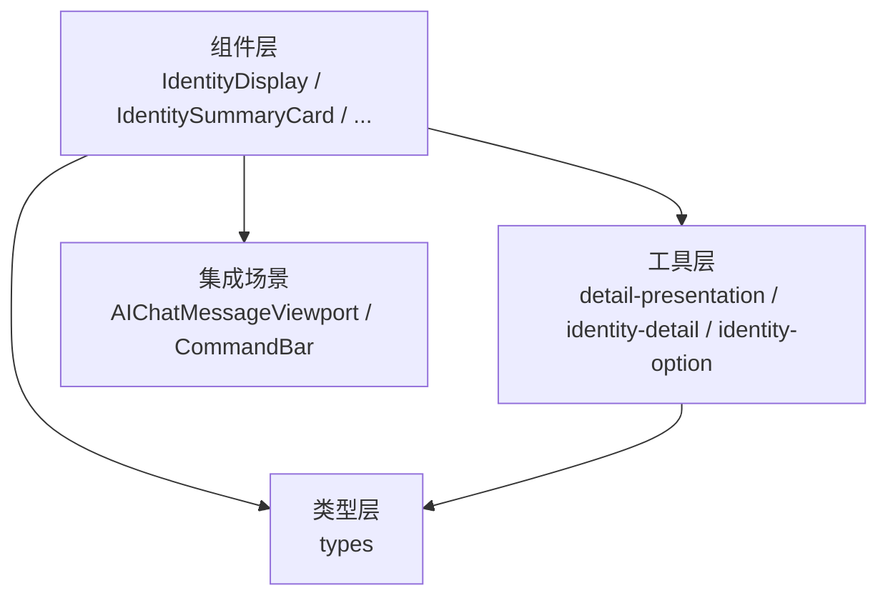
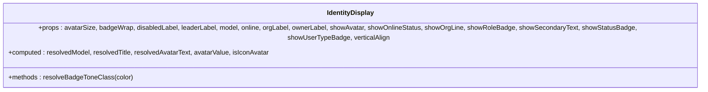
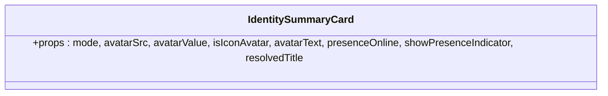
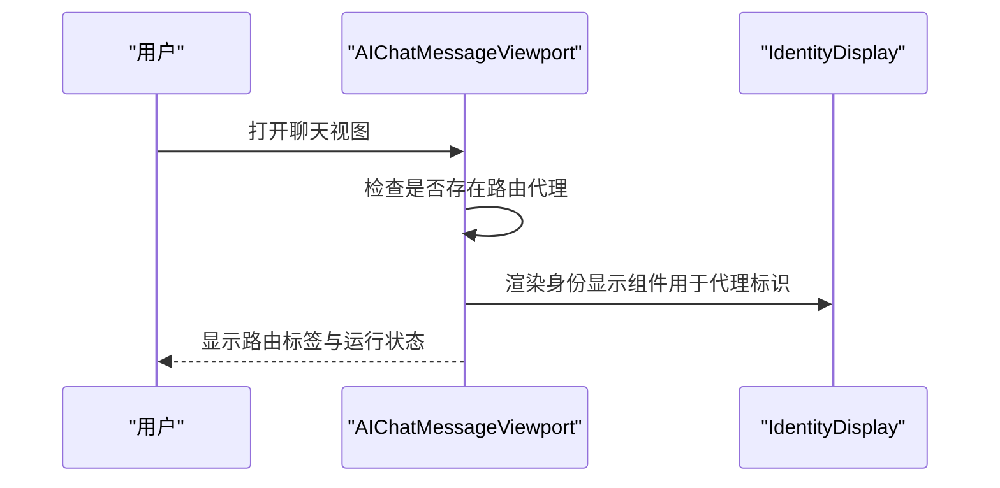
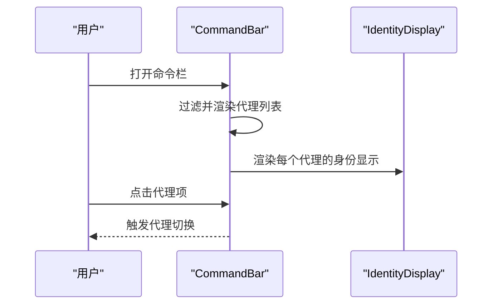
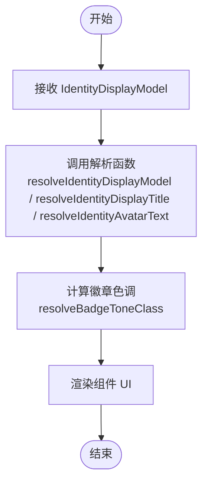
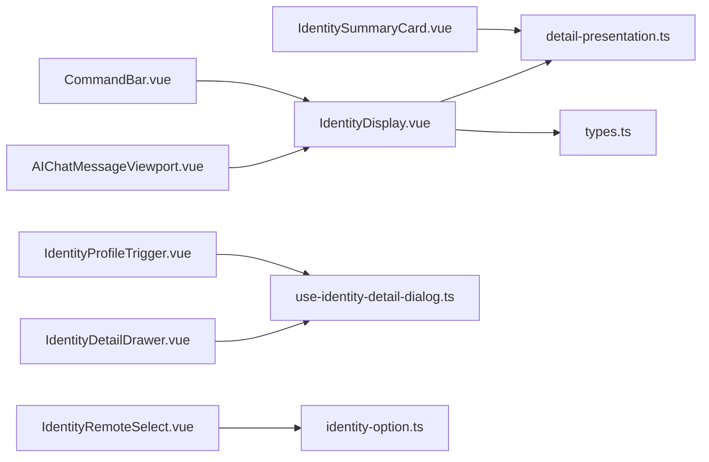

# 身份显示组件

<cite>
**本文档引用的文件**
- [IdentityDisplay.vue](file://frontend/apps/web-antd/src/components/business/identity-display/IdentityDisplay.vue)
- [IdentitySummaryCard.vue](file://frontend/apps/web-antd/src/components/business/identity-display/IdentitySummaryCard.vue)
- [IdentityDetailDrawer.vue](file://frontend/apps/web-antd/src/components/business/identity-display/IdentityDetailDrawer.vue)
- [IdentityQuickCard.vue](file://frontend/apps/web-antd/src/components/business/identity-display/IdentityQuickCard.vue)
- [IdentityProfileTrigger.vue](file://frontend/apps/web-antd/src/components/business/identity-display/IdentityProfileTrigger.vue)
- [IdentityRemoteSelect.vue](file://frontend/apps/web-antd/src/components/business/identity-display/IdentityRemoteSelect.vue)
- [detail-presentation.ts](file://frontend/apps/web-antd/src/components/business/identity-display/detail-presentation.ts)
- [identity-detail.ts](file://frontend/apps/web-antd/src/components/business/identity-display/identity-detail.ts)
- [identity-option.ts](file://frontend/apps/web-antd/src/components/business/identity-display/identity-option.ts)
- [types.ts](file://frontend/apps/web-antd/src/components/business/identity-display/types.ts)
- [use-identity-detail-dialog.ts](file://frontend/apps/web-antd/src/components/business/identity-display/use-identity-detail-dialog.ts)
- [AIChatMessageViewport.vue](file://frontend/apps/web-antd/src/components/business/ai-slide-panel/AIChatMessageViewport.vue)
- [CommandBar.vue](file://frontend/apps/web-antd/src/components/business/command-bar/CommandBar.vue)
- [test_admin_identity_contracts.py](file://backend/tests/services/test_admin_identity_contracts.py)
</cite>

## 目录
1. [简介](#简介)
2. [项目结构](#项目结构)
3. [核心组件](#核心组件)
4. [架构总览](#架构总览)
5. [详细组件分析](#详细组件分析)
6. [依赖关系分析](#依赖关系分析)
7. [性能考虑](#性能考虑)
8. [故障排除指南](#故障排除指南)
9. [结论](#结论)
10. [附录](#附录)

## 简介
本技术文档聚焦于身份显示组件群组，涵盖身份信息展示、代理资料气泡、代理路由标签等身份标识组件的设计与实现。文档将系统性阐述以下方面：
- 用户信息展示：头像、昵称、组织层级、角色与状态标识
- 代理状态显示与路由标签：在聊天视图中展示路由代理的状态与运行阶段
- 权限标识与角色切换：基于权限模型的角色呈现与交互
- 数据获取、缓存策略与实时更新：前端数据解析与后端序列化契约
- 主题适配、图标定制与响应式布局：组件样式与主题系统的集成
- 安全验证、权限检查与隐私保护：访问控制与敏感字段处理

## 项目结构
身份显示组件位于前端应用的业务组件目录下，采用按功能分层的组织方式：
- 组件层：IdentityDisplay、IdentitySummaryCard、IdentityDetailDrawer、IdentityQuickCard、IdentityProfileTrigger、IdentityRemoteSelect
- 工具与类型层：detail-presentation.ts、identity-detail.ts、identity-option.ts、types.ts、use-identity-detail-dialog.ts
- 集成场景：AIChatMessageViewport（路由标签）、CommandBar（命令栏中的代理选择）

**图表来源**
- [IdentityDisplay.vue:25-250](file://frontend/apps/web-antd/src/components/business/identity-display/IdentityDisplay.vue#L25-L250)
- [IdentitySummaryCard.vue:223-263](file://frontend/apps/web-antd/src/components/business/identity-display/IdentitySummaryCard.vue#L223-L263)
- [AIChatMessageViewport.vue:349-373](file://frontend/apps/web-antd/src/components/business/ai-slide-panel/AIChatMessageViewport.vue#L349-L373)
- [CommandBar.vue:485-515](file://frontend/apps/web-antd/src/components/business/command-bar/CommandBar.vue#L485-L515)

**章节来源**
- [IdentityDisplay.vue:25-250](file://frontend/apps/web-antd/src/components/business/identity-display/IdentityDisplay.vue#L25-L250)
- [IdentitySummaryCard.vue:223-263](file://frontend/apps/web-antd/src/components/business/identity-display/IdentitySummaryCard.vue#L223-L263)

## 核心组件
本节对身份显示组件群组进行概览性说明，重点介绍各组件职责与协作关系。

- IdentityDisplay：通用身份展示组件，支持头像、在线状态、组织线、角色徽章、用户类型徽章等可选展示项，具备响应式布局与主题适配能力。
- IdentitySummaryCard：摘要卡片形式的身份展示，常用于详情抽屉或列表项，包含头像、标题行、副标题与状态指示器。
- IdentityDetailDrawer：详情抽屉，承载完整的身份信息面板，配合对话框钩子实现打开/关闭与数据加载。
- IdentityQuickCard：快速卡片，用于上下文中的轻量身份信息展示，强调简洁与快速渲染。
- IdentityProfileTrigger：个人资料触发器，通过点击触发身份详情或相关操作。
- IdentityRemoteSelect：远程身份选择器，支持异步加载身份选项并进行选择，常用于权限分配或代理绑定场景。
- 工具与类型：detail-presentation.ts 提供详情呈现规则；identity-detail.ts 提供序列化与解析逻辑；identity-option.ts 提供选项构建；types.ts 定义核心类型；use-identity-detail-dialog.ts 提供对话框状态与行为。

**章节来源**
- [IdentityDisplay.vue:25-250](file://frontend/apps/web-antd/src/components/business/identity-display/IdentityDisplay.vue#L25-L250)
- [IdentitySummaryCard.vue:223-263](file://frontend/apps/web-antd/src/components/business/identity-display/IdentitySummaryCard.vue#L223-L263)
- [IdentityDetailDrawer.vue](file://frontend/apps/web-antd/src/components/business/identity-display/IdentityDetailDrawer.vue)
- [IdentityQuickCard.vue](file://frontend/apps/web-antd/src/components/business/identity-display/IdentityQuickCard.vue)
- [IdentityProfileTrigger.vue](file://frontend/apps/web-antd/src/components/business/identity-display/IdentityProfileTrigger.vue)
- [IdentityRemoteSelect.vue](file://frontend/apps/web-antd/src/components/business/identity-display/IdentityRemoteSelect.vue)
- [detail-presentation.ts](file://frontend/apps/web-antd/src/components/business/identity-display/detail-presentation.ts)
- [identity-detail.ts](file://frontend/apps/web-antd/src/components/business/identity-display/identity-detail.ts)
- [identity-option.ts](file://frontend/apps/web-antd/src/components/business/identity-display/identity-option.ts)
- [types.ts](file://frontend/apps/web-antd/src/components/business/identity-display/types.ts)
- [use-identity-detail-dialog.ts](file://frontend/apps/web-antd/src/components/business/identity-display/use-identity-detail-dialog.ts)

## 架构总览
身份显示组件群组遵循“组件-工具-类型-集成”的分层架构：
- 组件层负责UI渲染与用户交互
- 工具层提供数据解析、序列化与呈现规则
- 类型层定义数据结构与契约
- 集成场景将组件嵌入到具体业务流程中（如聊天路由标签、命令栏代理选择）

**图表来源**
- [IdentityDisplay.vue:25-250](file://frontend/apps/web-antd/src/components/business/identity-display/IdentityDisplay.vue#L25-L250)
- [detail-presentation.ts](file://frontend/apps/web-antd/src/components/business/identity-display/detail-presentation.ts)
- [identity-detail.ts](file://frontend/apps/web-antd/src/components/business/identity-display/identity-detail.ts)
- [identity-option.ts](file://frontend/apps/web-antd/src/components/business/identity-display/identity-option.ts)
- [types.ts](file://frontend/apps/web-antd/src/components/business/identity-display/types.ts)
- [AIChatMessageViewport.vue:349-373](file://frontend/apps/web-antd/src/components/business/ai-slide-panel/AIChatMessageViewport.vue#L349-L373)
- [CommandBar.vue:485-515](file://frontend/apps/web-antd/src/components/business/command-bar/CommandBar.vue#L485-L515)

## 详细组件分析

### IdentityDisplay 组件分析
IdentityDisplay 是身份展示的核心组件，支持多种可配置项以满足不同场景需求：
- 头像尺寸与显示开关
- 在线状态指示
- 组织线与角色徽章显示
- 副标题与状态徽章
- 垂直对齐与换行策略
- 图标头像与文本头像的自动识别

**图表来源**
- [IdentityDisplay.vue:25-250](file://frontend/apps/web-antd/src/components/business/identity-display/IdentityDisplay.vue#L25-L250)

**章节来源**
- [IdentityDisplay.vue:25-250](file://frontend/apps/web-antd/src/components/business/identity-display/IdentityDisplay.vue#L25-L250)

### IdentitySummaryCard 组件分析
IdentitySummaryCard 以卡片形式展示身份摘要，适用于详情抽屉或列表项：
- 头像区域支持图片与图标/文本头像
- 在线状态指示器
- 标题行与主内容区
- 模式化样式（mode 属性）

**图表来源**
- [IdentitySummaryCard.vue:223-263](file://frontend/apps/web-antd/src/components/business/identity-display/IdentitySummaryCard.vue#L223-L263)

**章节来源**
- [IdentitySummaryCard.vue:223-263](file://frontend/apps/web-antd/src/components/business/identity-display/IdentitySummaryCard.vue#L223-L263)

### 代理路由标签（AIChatMessageViewport 集成）
在全局AI聊天视图中，当存在路由代理时会显示一个路由标签，提示当前处于路由阶段，并带有运行状态的视觉效果：
- 路由标签容器与背景光效
- 路由图标与状态文本
- 国际化文案支持

**图表来源**
- [AIChatMessageViewport.vue:349-373](file://frontend/apps/web-antd/src/components/business/ai-slide-panel/AIChatMessageViewport.vue#L349-L373)
- [IdentityDisplay.vue:25-250](file://frontend/apps/web-antd/src/components/business/identity-display/IdentityDisplay.vue#L25-L250)

**章节来源**
- [AIChatMessageViewport.vue:349-373](file://frontend/apps/web-antd/src/components/business/ai-slide-panel/AIChatMessageViewport.vue#L349-L373)

### 命令栏代理选择（CommandBar 集成）
命令栏中展示代理列表时，使用简化的身份显示组件进行头像与初始字符的渲染：
- 代理头像或初始字符
- 选中态高亮与悬停态反馈
- 列表项的交互行为

**图表来源**
- [CommandBar.vue:485-515](file://frontend/apps/web-antd/src/components/business/command-bar/CommandBar.vue#L485-L515)
- [IdentityDisplay.vue:25-250](file://frontend/apps/web-antd/src/components/business/identity-display/IdentityDisplay.vue#L25-L250)

**章节来源**
- [CommandBar.vue:485-515](file://frontend/apps/web-antd/src/components/business/command-bar/CommandBar.vue#L485-L515)

### 数据模型与解析流程
身份显示组件依赖于统一的数据模型与解析流程：
- IdentityDisplayModel：输入模型，包含头像、名称、组织节点、角色等字段
- ResolvedIdentityDisplayModel：解析后的模型，包含标题、头文字、徽章颜色等
- detail-presentation.ts：提供解析函数，如 resolveIdentityDisplayTitle、resolveIdentityAvatarText、resolveBadgeToneClass 等
- identity-detail.ts：提供序列化与解析逻辑，确保前后端一致
- identity-option.ts：提供选项构建逻辑，用于远程选择器
- types.ts：定义核心类型与接口
- use-identity-detail-dialog.ts：提供详情对话框的状态与行为钩子

**图表来源**
- [IdentityDisplay.vue:65-80](file://frontend/apps/web-antd/src/components/business/identity-display/IdentityDisplay.vue#L65-L80)
- [IdentityDisplay.vue:192-219](file://frontend/apps/web-antd/src/components/business/identity-display/IdentityDisplay.vue#L192-L219)
- [detail-presentation.ts](file://frontend/apps/web-antd/src/components/business/identity-display/detail-presentation.ts)

**章节来源**
- [IdentityDisplay.vue:65-80](file://frontend/apps/web-antd/src/components/business/identity-display/IdentityDisplay.vue#L65-L80)
- [IdentityDisplay.vue:192-219](file://frontend/apps/web-antd/src/components/business/identity-display/IdentityDisplay.vue#L192-L219)
- [detail-presentation.ts](file://frontend/apps/web-antd/src/components/business/identity-display/detail-presentation.ts)
- [identity-detail.ts](file://frontend/apps/web-antd/src/components/business/identity-display/identity-detail.ts)
- [identity-option.ts](file://frontend/apps/web-antd/src/components/business/identity-display/identity-option.ts)
- [types.ts](file://frontend/apps/web-antd/src/components/business/identity-display/types.ts)
- [use-identity-detail-dialog.ts](file://frontend/apps/web-antd/src/components/business/identity-display/use-identity-detail-dialog.ts)

## 依赖关系分析
- 组件间依赖：各组件共享 detail-presentation.ts 的解析能力，IdentityDetailDrawer 与 IdentityProfileTrigger 依赖 use-identity-detail-dialog.ts 的对话框行为
- 类型依赖：所有组件依赖 types.ts 中的类型定义
- 集成依赖：AIChatMessageViewport 与 CommandBar 将 IdentityDisplay 作为子组件进行渲染

**图表来源**
- [IdentityDisplay.vue:25-250](file://frontend/apps/web-antd/src/components/business/identity-display/IdentityDisplay.vue#L25-L250)
- [IdentitySummaryCard.vue:223-263](file://frontend/apps/web-antd/src/components/business/identity-display/IdentitySummaryCard.vue#L223-L263)
- [IdentityDetailDrawer.vue](file://frontend/apps/web-antd/src/components/business/identity-display/IdentityDetailDrawer.vue)
- [IdentityProfileTrigger.vue](file://frontend/apps/web-antd/src/components/business/identity-display/IdentityProfileTrigger.vue)
- [IdentityRemoteSelect.vue](file://frontend/apps/web-antd/src/components/business/identity-display/IdentityRemoteSelect.vue)
- [detail-presentation.ts](file://frontend/apps/web-antd/src/components/business/identity-display/detail-presentation.ts)
- [identity-option.ts](file://frontend/apps/web-antd/src/components/business/identity-display/identity-option.ts)
- [types.ts](file://frontend/apps/web-antd/src/components/business/identity-display/types.ts)
- [use-identity-detail-dialog.ts](file://frontend/apps/web-antd/src/components/business/identity-display/use-identity-detail-dialog.ts)
- [AIChatMessageViewport.vue:349-373](file://frontend/apps/web-antd/src/components/business/ai-slide-panel/AIChatMessageViewport.vue#L349-L373)
- [CommandBar.vue:485-515](file://frontend/apps/web-antd/src/components/business/command-bar/CommandBar.vue#L485-L515)

**章节来源**
- [IdentityDisplay.vue:25-250](file://frontend/apps/web-antd/src/components/business/identity-display/IdentityDisplay.vue#L25-L250)
- [IdentitySummaryCard.vue:223-263](file://frontend/apps/web-antd/src/components/business/identity-display/IdentitySummaryCard.vue#L223-L263)
- [IdentityDetailDrawer.vue](file://frontend/apps/web-antd/src/components/business/identity-display/IdentityDetailDrawer.vue)
- [IdentityProfileTrigger.vue](file://frontend/apps/web-antd/src/components/business/identity-display/IdentityProfileTrigger.vue)
- [IdentityRemoteSelect.vue](file://frontend/apps/web-antd/src/components/business/identity-display/IdentityRemoteSelect.vue)
- [detail-presentation.ts](file://frontend/apps/web-antd/src/components/business/identity-display/detail-presentation.ts)
- [identity-option.ts](file://frontend/apps/web-antd/src/components/business/identity-display/identity-option.ts)
- [types.ts](file://frontend/apps/web-antd/src/components/business/identity-display/types.ts)
- [use-identity-detail-dialog.ts](file://frontend/apps/web-antd/src/components/business/identity-display/use-identity-detail-dialog.ts)
- [AIChatMessageViewport.vue:349-373](file://frontend/apps/web-antd/src/components/business/ai-slide-panel/AIChatMessageViewport.vue#L349-L373)
- [CommandBar.vue:485-515](file://frontend/apps/web-antd/src/components/business/command-bar/CommandBar.vue#L485-L515)

## 性能考虑
- 计算属性优化：通过 computed 缓存解析结果，避免重复计算
- 条件渲染：根据 props 动态决定徽章与副标题的显示，减少不必要的 DOM 结构
- 图标与头像：支持图标头像与文本头像，降低图片请求开销
- 对话框懒加载：详情抽屉按需加载，减少初始渲染压力
- 响应式布局：使用 Flex 布局与 Tailwind 类，保证在不同屏幕下的渲染效率

[本节为通用性能建议，不直接分析具体文件，故无章节来源]

## 故障排除指南
- 头像显示异常
  - 检查 avatar 字段是否为空或格式错误
  - 确认 isIconAvatar 正确识别图标头像格式
- 在线状态不更新
  - 确认 online prop 是否正确传递
  - 检查 Presence 指示器的条件渲染逻辑
- 徽章颜色不生效
  - 检查 resolveBadgeToneClass 的颜色映射
  - 确认传入的颜色值符合预期
- 详情抽屉无法打开
  - 检查 use-identity-detail-dialog 的状态与事件绑定
- 后端序列化差异
  - 参考后端测试用例，确认序列化字段与权限控制逻辑

**章节来源**
- [IdentityDisplay.vue:77-80](file://frontend/apps/web-antd/src/components/business/identity-display/IdentityDisplay.vue#L77-L80)
- [IdentityDisplay.vue:192-219](file://frontend/apps/web-antd/src/components/business/identity-display/IdentityDisplay.vue#L192-L219)
- [use-identity-detail-dialog.ts](file://frontend/apps/web-antd/src/components/business/identity-display/use-identity-detail-dialog.ts)
- [test_admin_identity_contracts.py:236-347](file://backend/tests/services/test_admin_identity_contracts.py#L236-L347)

## 结论
身份显示组件群组通过清晰的分层设计与统一的数据解析流程，实现了灵活且高性能的身份信息展示。组件在聊天路由标签与命令栏等场景中发挥重要作用，同时具备良好的主题适配与响应式布局能力。结合后端序列化契约与权限控制，确保了数据一致性与安全性。

[本节为总结性内容，不直接分析具体文件，故无章节来源]

## 附录
- 主题与布局集成：组件样式与主题系统解耦，便于在不同主题与布局模式下保持一致的视觉体验
- 国际化支持：路由标签与状态文本采用国际化文案，提升多语言环境下的用户体验
- 测试覆盖：后端测试用例覆盖序列化字段与权限控制，保障契约稳定性

[本节为补充说明，不直接分析具体文件，故无章节来源]