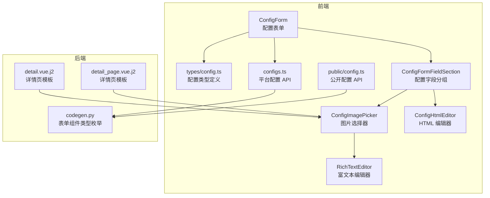
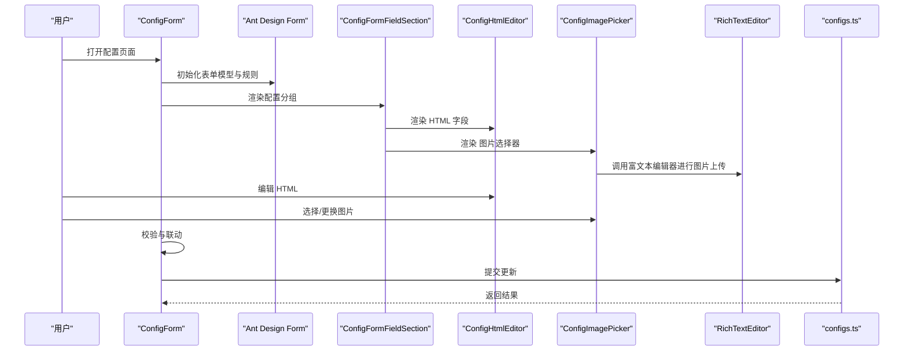
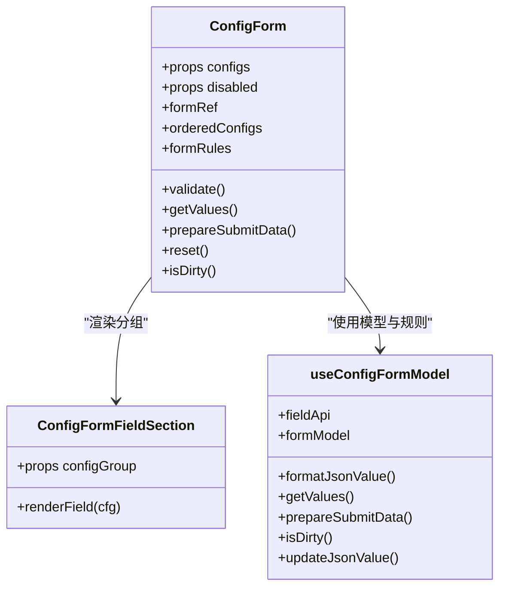
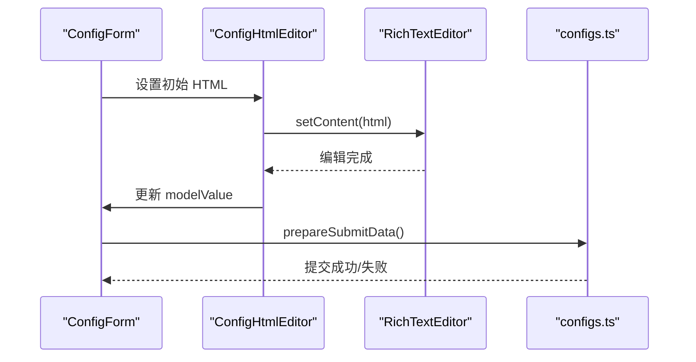
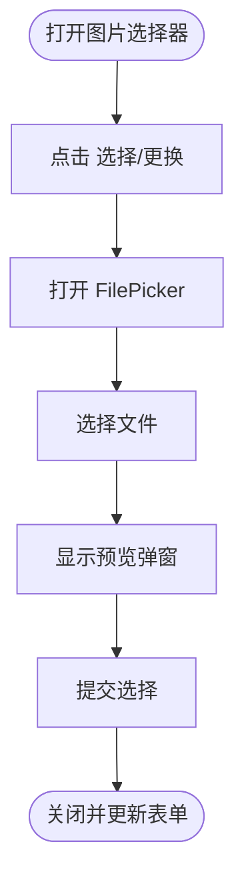
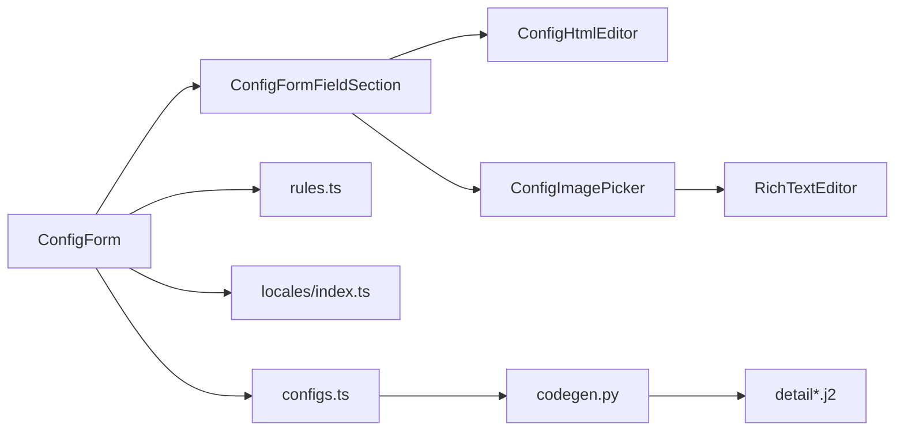

# 配置组件

<cite>
**本文引用的文件**
- [frontend/apps/web-antd/src/components/business/config-form/index.vue](file://frontend/apps/web-antd/src/components/business/config-form/index.vue)
- [frontend/apps/web-antd/src/components/business/config-form/types.ts](file://frontend/apps/web-antd/src/components/business/config-form/types.ts)
- [frontend/apps/web-antd/src/components/business/config-form/composables/use-config-form-model.ts](file://frontend/apps/web-antd/src/components/business/config-form/composables/use-config-form-model.ts)
- [frontend/apps/web-antd/src/components/business/config-form/sections/ConfigFormFieldSection.vue](file://frontend/apps/web-antd/src/components/business/config-form/sections/ConfigFormFieldSection.vue)
- [frontend/apps/web-antd/src/components/business/config-form/rules.ts](file://frontend/apps/web-antd/src/components/business/config-form/rules.ts)
- [frontend/apps/web-antd/src/components/business/config-html-editor/ConfigHtmlEditor.vue](file://frontend/apps/web-antd/src/components/business/config-html-editor/ConfigHtmlEditor.vue)
- [frontend/apps/web-antd/src/components/business/config-image-picker/ConfigImagePicker.vue](file://frontend/apps/web-antd/src/components/business/config-image-picker/ConfigImagePicker.vue)
- [frontend/apps/web-antd/src/components/business/rich-text-editor/RichTextEditor.vue](file://frontend/apps/web-antd/src/components/business/rich-text-editor/RichTextEditor.vue)
- [frontend/apps/web-antd/src/components/business/rich-text-editor/useEditorUpload.ts](file://frontend/apps/web-antd/src/components/business/rich-text-editor/useEditorUpload.ts)
- [frontend/apps/web-antd/src/types/config.ts](file://frontend/apps/web-antd/src/types/config.ts)
- [frontend/apps/web-antd/src/api/admin/configs.ts](file://frontend/apps/web-antd/src/api/admin/configs.ts)
- [frontend/apps/web-antd/src/api/public/config.ts](file://frontend/apps/web-antd/src/api/public/config.ts)
- [backend/app/api/admin/codegen.py](file://backend/app/api/admin/codegen.py)
- [backend/app/codegen/templates/frontend/detail.vue.j2](file://backend/app/codegen/templates/frontend/detail.vue.j2)
- [backend/app/codegen/templates/frontend/detail_page.vue.j2](file://backend/app/codegen/templates/frontend/detail_page.vue.j2)
- [frontend/apps/web-antd/src/constants/upload.ts](file://frontend/apps/web-antd/src/constants/upload.ts)
- [frontend/apps/web-antd/src/locales/index.ts](file://frontend/apps/web-antd/src/locales/index.ts)
</cite>

## 目录
1. [简介](#简介)
2. [项目结构](#项目结构)
3. [核心组件](#核心组件)
4. [架构总览](#架构总览)
5. [组件详解](#组件详解)
6. [依赖关系分析](#依赖关系分析)
7. [性能考量](#性能考量)
8. [故障排查指南](#故障排查指南)
9. [结论](#结论)
10. [附录](#附录)

## 简介
本技术文档围绕“配置组件群组”展开，系统化阐述配置表单、配置分组侧边栏、HTML 编辑器、图片选择器等核心配置组件的设计架构与实现细节。文档覆盖配置项验证、表单联动、动态配置、配置持久化、数据绑定、校验规则与错误处理机制，并补充主题适配、国际化支持与可访问性优化建议，以及权限控制、配置继承与版本管理的实践路径。

## 项目结构
配置相关前端组件主要位于 web-antd 应用的业务组件目录中，后端通过代码生成接口暴露配置表单组件类型，模板层负责在详情页渲染图片与文件字段。

**图表来源**
- [frontend/apps/web-antd/src/components/business/config-form/index.vue:1-162](file://frontend/apps/web-antd/src/components/business/config-form/index.vue#L1-L162)
- [frontend/apps/web-antd/src/components/business/config-form/sections/ConfigFormFieldSection.vue](file://frontend/apps/web-antd/src/components/business/config-form/sections/ConfigFormFieldSection.vue)
- [frontend/apps/web-antd/src/components/business/config-html-editor/ConfigHtmlEditor.vue:1-49](file://frontend/apps/web-antd/src/components/business/config-html-editor/ConfigHtmlEditor.vue#L1-L49)
- [frontend/apps/web-antd/src/components/business/config-image-picker/ConfigImagePicker.vue:106-143](file://frontend/apps/web-antd/src/components/business/config-image-picker/ConfigImagePicker.vue#L106-L143)
- [frontend/apps/web-antd/src/components/business/rich-text-editor/RichTextEditor.vue](file://frontend/apps/web-antd/src/components/business/rich-text-editor/RichTextEditor.vue)
- [frontend/apps/web-antd/src/api/admin/configs.ts:1-67](file://frontend/apps/web-antd/src/api/admin/configs.ts#L1-L67)
- [frontend/apps/web-antd/src/api/public/config.ts:2-515](file://frontend/apps/web-antd/src/api/public/config.ts#L2-L515)
- [backend/app/api/admin/codegen.py:373-403](file://backend/app/api/admin/codegen.py#L373-L403)
- [backend/app/codegen/templates/frontend/detail.vue.j2:99-112](file://backend/app/codegen/templates/frontend/detail.vue.j2#L99-L112)
- [backend/app/codegen/templates/frontend/detail_page.vue.j2:114-126](file://backend/app/codegen/templates/frontend/detail_page.vue.j2#L114-L126)

**章节来源**
- [frontend/apps/web-antd/src/components/business/config-form/index.vue:1-162](file://frontend/apps/web-antd/src/components/business/config-form/index.vue#L1-L162)
- [backend/app/api/admin/codegen.py:373-403](file://backend/app/api/admin/codegen.py#L373-L403)

## 核心组件
- 配置表单（ConfigForm）：基于 Ant Design Vue 表单封装，负责配置项的渲染、校验、联动与提交。
- 配置字段分组（ConfigFormFieldSection）：按分组组织配置项，支持排序与显示规则。
- HTML 编辑器（ConfigHtmlEditor）：基于 TipTap 富文本编辑器的紧凑型配置字段，支持禁用态与内容同步。
- 图片选择器（ConfigImagePicker）：封装文件选择与图片预览，隔离 Form.Item 内部控件以避免告警。
- 富文本编辑器（RichTextEditor）：底层富文本能力，提供上传与拖拽插入图片的能力。
- 配置类型与 API：统一的配置模型、提交载荷与前后端交互接口。

**章节来源**
- [frontend/apps/web-antd/src/components/business/config-form/index.vue:1-162](file://frontend/apps/web-antd/src/components/business/config-form/index.vue#L1-L162)
- [frontend/apps/web-antd/src/components/business/config-form/types.ts:1-36](file://frontend/apps/web-antd/src/components/business/config-form/types.ts#L1-L36)
- [frontend/apps/web-antd/src/components/business/config-html-editor/ConfigHtmlEditor.vue:1-49](file://frontend/apps/web-antd/src/components/business/config-html-editor/ConfigHtmlEditor.vue#L1-L49)
- [frontend/apps/web-antd/src/components/business/config-image-picker/ConfigImagePicker.vue:106-143](file://frontend/apps/web-antd/src/components/business/config-image-picker/ConfigImagePicker.vue#L106-L143)
- [frontend/apps/web-antd/src/components/business/rich-text-editor/RichTextEditor.vue](file://frontend/apps/web-antd/src/components/business/rich-text-editor/RichTextEditor.vue)
- [frontend/apps/web-antd/src/types/config.ts:121-148](file://frontend/apps/web-antd/src/types/config.ts#L121-L148)
- [frontend/apps/web-antd/src/api/admin/configs.ts:1-67](file://frontend/apps/web-antd/src/api/admin/configs.ts#L1-L67)
- [frontend/apps/web-antd/src/api/public/config.ts:2-515](file://frontend/apps/web-antd/src/api/public/config.ts#L2-L515)

## 架构总览
配置组件群组采用“表单驱动 + 组合式组件”的架构设计：
- 前端通过配置元数据（ConfigItemMeta）驱动渲染，支持多级分组与排序。
- 表单规则由后端类型映射到前端 Ant Design 规则，实现统一校验。
- 图片选择器与富文本编辑器作为可复用子组件，通过组合方式嵌入表单。
- 提交时将表单模型转换为后端期望的键值对格式，支持批量更新。

**图表来源**
- [frontend/apps/web-antd/src/components/business/config-form/index.vue:1-162](file://frontend/apps/web-antd/src/components/business/config-form/index.vue#L1-L162)
- [frontend/apps/web-antd/src/components/business/config-html-editor/ConfigHtmlEditor.vue:1-49](file://frontend/apps/web-antd/src/components/business/config-html-editor/ConfigHtmlEditor.vue#L1-L49)
- [frontend/apps/web-antd/src/components/business/config-image-picker/ConfigImagePicker.vue:106-143](file://frontend/apps/web-antd/src/components/business/config-image-picker/ConfigImagePicker.vue#L106-L143)
- [frontend/apps/web-antd/src/components/business/rich-text-editor/RichTextEditor.vue](file://frontend/apps/web-antd/src/components/business/rich-text-editor/RichTextEditor.vue)
- [frontend/apps/web-antd/src/api/admin/configs.ts:1-67](file://frontend/apps/web-antd/src/api/admin/configs.ts#L1-L67)

## 组件详解

### 配置表单（ConfigForm）
- 设计要点
  - 基于 Ant Design Vue Form 实现，支持禁用态、动态排序与规则收集。
  - 通过 useConfigFormModel 管理表单模型、脏值检测与提交数据准备。
  - 支持配置项标签的国际化映射，优先使用 label_key 或平台/租户选项键。
- 数据绑定与提交
  - getValues/prepareSubmitData 将当前模型转换为后端期望的 { configs: { key: value } } 结构。
  - isDirty 用于判断是否需要触发保存。
- 表单联动与动态配置
  - 通过 DisplayRuleMeta 控制字段显隐；排序依据 sort_order 进行稳定排序。
- 校验与错误处理
  - convertRules 将配置规则映射为 Ant Design 规则数组；支持数字、必填、范围等常见规则。
  - validate 方法返回 Promise，便于统一错误处理与提示。

**图表来源**
- [frontend/apps/web-antd/src/components/business/config-form/index.vue:1-162](file://frontend/apps/web-antd/src/components/business/config-form/index.vue#L1-L162)
- [frontend/apps/web-antd/src/components/business/config-form/composables/use-config-form-model.ts](file://frontend/apps/web-antd/src/components/business/config-form/composables/use-config-form-model.ts)
- [frontend/apps/web-antd/src/components/business/config-form/sections/ConfigFormFieldSection.vue](file://frontend/apps/web-antd/src/components/business/config-form/sections/ConfigFormFieldSection.vue)

**章节来源**
- [frontend/apps/web-antd/src/components/business/config-form/index.vue:1-162](file://frontend/apps/web-antd/src/components/business/config-form/index.vue#L1-L162)
- [frontend/apps/web-antd/src/components/business/config-form/types.ts:1-36](file://frontend/apps/web-antd/src/components/business/config-form/types.ts#L1-L36)
- [frontend/apps/web-antd/src/components/business/config-form/composables/use-config-form-model.ts](file://frontend/apps/web-antd/src/components/business/config-form/composables/use-config-form-model.ts)
- [frontend/apps/web-antd/src/components/business/config-form/sections/ConfigFormFieldSection.vue](file://frontend/apps/web-antd/src/components/business/config-form/sections/ConfigFormFieldSection.vue)
- [frontend/apps/web-antd/src/components/business/config-form/rules.ts](file://frontend/apps/web-antd/src/components/business/config-form/rules.ts)

### 配置字段分组（ConfigFormFieldSection）
- 设计要点
  - 接收配置分组，遍历渲染各配置项，支持多级 children。
  - 根据配置项类型选择对应子组件（如 HTML 编辑器、图片选择器等）。
- 国际化与选项
  - 选项标签优先从 label_key 映射，否则回退到平台/租户选项键，最终回退到直译值。
- 排序与显示
  - 按 sort_order 排序，确保界面一致性。

**章节来源**
- [frontend/apps/web-antd/src/components/business/config-form/sections/ConfigFormFieldSection.vue](file://frontend/apps/web-antd/src/components/business/config-form/sections/ConfigFormFieldSection.vue)
- [frontend/apps/web-antd/src/components/business/config-form/index.vue:116-140](file://frontend/apps/web-antd/src/components/business/config-form/index.vue#L116-L140)

### HTML 编辑器（ConfigHtmlEditor）
- 设计要点
  - 基于 TipTap（ProseMirror）的紧凑型编辑器，适合配置场景。
  - 通过 Form.ItemRest 隔离编辑器，避免 Form.Item 注入导致的焦点问题。
  - 支持禁用态，编辑器可读写状态由 disabled 属性控制。
- 数据绑定与同步
  - 使用 defineModel<string> 绑定 HTML 字符串；首次挂载时将模型值推送到编辑器。
  - 通过 lastEmittedHtml 避免编辑器自身变更引发的循环更新。
- 与富文本编辑器的关系
  - 内部引用 RichTextEditor，复用其上传与拖拽插入图片能力。

**图表来源**
- [frontend/apps/web-antd/src/components/business/config-html-editor/ConfigHtmlEditor.vue:1-49](file://frontend/apps/web-antd/src/components/business/config-html-editor/ConfigHtmlEditor.vue#L1-L49)
- [frontend/apps/web-antd/src/components/business/rich-text-editor/RichTextEditor.vue](file://frontend/apps/web-antd/src/components/business/rich-text-editor/RichTextEditor.vue)
- [frontend/apps/web-antd/src/api/admin/configs.ts:1-67](file://frontend/apps/web-antd/src/api/admin/configs.ts#L1-L67)

**章节来源**
- [frontend/apps/web-antd/src/components/business/config-html-editor/ConfigHtmlEditor.vue:1-49](file://frontend/apps/web-antd/src/components/business/config-html-editor/ConfigHtmlEditor.vue#L1-L49)
- [frontend/apps/web-antd/src/components/business/rich-text-editor/RichTextEditor.vue](file://frontend/apps/web-antd/src/components/business/rich-text-editor/RichTextEditor.vue)

### 图片选择器（ConfigImagePicker）
- 设计要点
  - 封装 FilePicker 与 Ant Design Image，提供“选择/更换”按钮与预览弹窗。
  - 通过 Form.ItemRest 包裹内部控件，避免 Ant Design Form.Item 误收集导致告警。
  - 支持 accept 限制与 visibility=public，便于与后端存储策略对齐。
- 上传与预览
  - 选择文件后触发 handleSelect，结合富文本编辑器的上传逻辑实现图片插入。
  - 预览弹窗由隐藏的 Image 组件驱动，提升一致性体验。
- 后端模板渲染
  - 后端模板 detail.vue.j2 与 detail_page.vue.j2 对图片字段进行条件渲染，支持单图与多图场景。

**图表来源**
- [frontend/apps/web-antd/src/components/business/config-image-picker/ConfigImagePicker.vue:106-143](file://frontend/apps/web-antd/src/components/business/config-image-picker/ConfigImagePicker.vue#L106-L143)
- [backend/app/codegen/templates/frontend/detail.vue.j2:99-112](file://backend/app/codegen/templates/frontend/detail.vue.j2#L99-L112)
- [backend/app/codegen/templates/frontend/detail_page.vue.j2:114-126](file://backend/app/codegen/templates/frontend/detail_page.vue.j2#L114-L126)

**章节来源**
- [frontend/apps/web-antd/src/components/business/config-image-picker/ConfigImagePicker.vue:106-143](file://frontend/apps/web-antd/src/components/business/config-image-picker/ConfigImagePicker.vue#L106-L143)
- [backend/app/codegen/templates/frontend/detail.vue.j2:99-112](file://backend/app/codegen/templates/frontend/detail.vue.j2#L99-L112)
- [backend/app/codegen/templates/frontend/detail_page.vue.j2:114-126](file://backend/app/codegen/templates/frontend/detail_page.vue.j2#L114-L126)

### 富文本编辑器（RichTextEditor）与上传
- 设计要点
  - 提供拖拽上传与粘贴占位符替换，保证编辑器内图片的正确插入与替换。
  - 通过 useEditorUpload 处理上传回调，定位占位符节点并替换为真实图片。
- 上传约束
  - 上传大小与类型遵循前端常量 upload.ts 中的默认策略，与后端平台存储配置对齐。

**章节来源**
- [frontend/apps/web-antd/src/components/business/rich-text-editor/useEditorUpload.ts:150-205](file://frontend/apps/web-antd/src/components/business/rich-text-editor/useEditorUpload.ts#L150-L205)
- [frontend/apps/web-antd/src/constants/upload.ts](file://frontend/apps/web-antd/src/constants/upload.ts#L3)

### 配置类型与 API
- 类型定义
  - ConfigGroupMeta/ConfigItemMeta/ConfigSubmitPayload 等类型统一了配置元数据与提交结构。
- 平台配置 API
  - 提供获取分组列表、分组详情与批量更新接口，后端期望的提交格式为 { configs: { key: value } }。
- 公开配置 API
  - 提供无需认证的平台公开配置查询接口，便于前端在未登录状态下展示基础信息。

**章节来源**
- [frontend/apps/web-antd/src/types/config.ts:121-148](file://frontend/apps/web-antd/src/types/config.ts#L121-L148)
- [frontend/apps/web-antd/src/api/admin/configs.ts:1-67](file://frontend/apps/web-antd/src/api/admin/configs.ts#L1-L67)
- [frontend/apps/web-antd/src/api/public/config.ts:2-515](file://frontend/apps/web-antd/src/api/public/config.ts#L2-L515)

## 依赖关系分析
- 组件耦合
  - ConfigForm 与 ConfigFormFieldSection 强耦合，后者负责具体字段渲染。
  - ConfigHtmlEditor 与 RichTextEditor 存在内部依赖，前者仅对外暴露 HTML 字符串。
  - ConfigImagePicker 与 FilePicker、Image 组件协作，通过 Form.ItemRest 解耦。
- 规则与国际化
  - rules.ts 将配置规则映射为 Ant Design 规则；locales/index.ts 提供翻译键。
- 后端集成
  - codegen.py 暴露表单组件类型，detail/*.j2 模板根据字段类型渲染图片/文件。

**图表来源**
- [frontend/apps/web-antd/src/components/business/config-form/index.vue:1-162](file://frontend/apps/web-antd/src/components/business/config-form/index.vue#L1-L162)
- [frontend/apps/web-antd/src/components/business/config-form/rules.ts](file://frontend/apps/web-antd/src/components/business/config-form/rules.ts)
- [frontend/apps/web-antd/src/locales/index.ts](file://frontend/apps/web-antd/src/locales/index.ts)
- [frontend/apps/web-antd/src/api/admin/configs.ts:1-67](file://frontend/apps/web-antd/src/api/admin/configs.ts#L1-L67)
- [backend/app/api/admin/codegen.py:373-403](file://backend/app/api/admin/codegen.py#L373-L403)
- [backend/app/codegen/templates/frontend/detail.vue.j2:99-112](file://backend/app/codegen/templates/frontend/detail.vue.j2#L99-L112)
- [backend/app/codegen/templates/frontend/detail_page.vue.j2:114-126](file://backend/app/codegen/templates/frontend/detail_page.vue.j2#L114-L126)

**章节来源**
- [frontend/apps/web-antd/src/components/business/config-form/index.vue:1-162](file://frontend/apps/web-antd/src/components/business/config-form/index.vue#L1-L162)
- [backend/app/api/admin/codegen.py:373-403](file://backend/app/api/admin/codegen.py#L373-L403)

## 性能考量
- 渲染优化
  - 使用 computed 对配置项排序与规则收集，减少重复计算。
  - 通过 Form.ItemRest 隔离复杂子控件，降低表单重渲染范围。
- 编辑器性能
  - HTML 编辑器在首次挂载时一次性设置内容，避免频繁 setContent。
  - 富文本上传采用占位符与节点定位替换，减少 DOM 重排。
- 提交策略
  - isDirty 判断仅在变更时触发提交，减少网络请求与后端压力。

[本节为通用指导，不直接分析具体文件，故无“章节来源”]

## 故障排查指南
- 表单告警与焦点问题
  - 若出现“内部表单控件被收集”的告警，检查是否遗漏 Form.ItemRest 包裹。
  - HTML 编辑器需确保未被 Form.Item 注入影响，必要时调整容器结构。
- 图片上传失败
  - 检查上传大小与类型是否符合 upload.ts 默认策略。
  - 确认富文本编辑器上传回调是否正确替换占位符节点。
- 校验不生效
  - 确认 convertRules 是否正确映射配置规则。
  - 检查国际化键是否存在，避免回退到默认值导致显示异常。
- 提交数据格式错误
  - 确保 prepareSubmitData 输出格式为 { configs: { key: value } }。
  - 核对后端接口文档与字段类型。

**章节来源**
- [frontend/apps/web-antd/src/components/business/config-html-editor/ConfigHtmlEditor.vue:1-49](file://frontend/apps/web-antd/src/components/business/config-html-editor/ConfigHtmlEditor.vue#L1-L49)
- [frontend/apps/web-antd/src/components/business/config-image-picker/ConfigImagePicker.vue:106-143](file://frontend/apps/web-antd/src/components/business/config-image-picker/ConfigImagePicker.vue#L106-L143)
- [frontend/apps/web-antd/src/components/business/rich-text-editor/useEditorUpload.ts:150-205](file://frontend/apps/web-antd/src/components/business/rich-text-editor/useEditorUpload.ts#L150-L205)
- [frontend/apps/web-antd/src/components/business/config-form/rules.ts](file://frontend/apps/web-antd/src/components/business/config-form/rules.ts)

## 结论
配置组件群组通过“表单驱动 + 组合式组件”的设计，实现了配置项的高可扩展性与易维护性。HTML 编辑器与图片选择器在保持简洁的同时提供了强大的富文本与媒体处理能力。配合完善的校验、国际化与 API 集成，能够满足平台与租户层面的配置需求。后续可在权限控制、配置继承与版本管理方面进一步完善，以支撑更复杂的治理场景。

[本节为总结性内容，不直接分析具体文件，故无“章节来源”]

## 附录
- 主题适配
  - 使用 Ant Design Vue 的主题变量与暗色模式支持，确保编辑器与表单组件在不同主题下的一致性。
- 国际化支持
  - 优先使用 label_key 与平台/租户选项键进行翻译，保障多语言环境下的可读性。
- 可访问性优化
  - 为按钮与输入框提供语义化标签与键盘导航支持，避免仅依赖视觉提示。
- 权限控制
  - 在路由与菜单层面限制配置页面访问；在表单级别通过 disabled 控制编辑能力。
- 配置继承与版本管理
  - 建议引入配置版本号与差异对比，在提交前进行冲突检测与合并策略评估。

[本节为通用指导，不直接分析具体文件，故无“章节来源”]